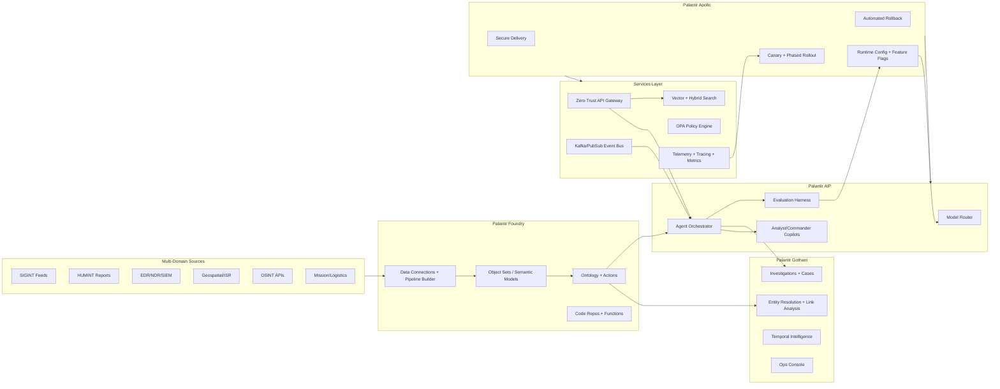
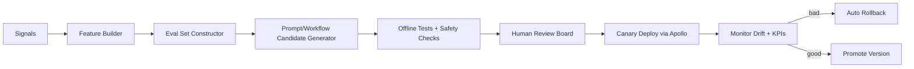

# ClearGlassInc Artemis — Self-Evolving AI Intelligence Platform

## System Architecture

### 1) Platform Topology (Palantir-native)



### 2) Layered Full-Stack Design

- **Frontend Layer (React/TypeScript + Gotham apps)**
  - Analyst Workbench: graph view, timeline, confidence overlays, source lineage.
  - Commander Console: mission status, recommended COAs (courses of action), approval queue.
  - ModelOps Console: prompt/workflow versions, eval scorecards, deployment gates.
- **API Layer**
  - GraphQL + REST gateway, mTLS everywhere, JWT + SPIFFE identity.
  - Fine-grained authorization (entity/attribute/action).
- **Service Layer (Python FastAPI + Async Workers)**
  - Ingestion normalization service.
  - Correlation and fusion service.
  - Agent runtime service.
  - Self-improvement controller service.
- **Data Layer**
  - Foundry datasets + object types as source-of-truth.
  - Lakehouse for historical training/eval corpora.
  - Feature store for ranking/routing features.
- **AI Orchestration Layer (AIP)**
  - Tool-using agents with deterministic guardrails.
  - Model routing by mission criticality, cost, latency, and security domain.
- **Policy/Governance Layer**
  - OPA/Rego + Foundry policy bindings + Apollo release policies.
- **Observability Layer**
  - OpenTelemetry traces across user query → tool calls → decisions.
  - Eval dashboards: precision/recall/latency/trust.
- **Deployment Layer (Apollo)**
  - Signed artifacts, environment promotion rings, canary + auto rollback.

---

## Data and Ontology

### 1) Core Ontology (Foundry Object Types)

```yaml
objectTypes:
  Person:
    properties: [person_id, name, aliases[], nationality, risk_score, confidence, valid_time, tx_time]
  Organization:
    properties: [org_id, name, type, sanctions_status, confidence, valid_time, tx_time]
  Device:
    properties: [device_id, imei, mac, owner_ref, compromise_score, confidence]
  Account:
    properties: [account_id, platform, handle, owner_ref, confidence]
  Location:
    properties: [location_id, lat, lon, geohash, area_name, confidence]
  Event:
    properties: [event_id, event_type, severity, occurred_at, detected_at, source_system, confidence]
  Alert:
    properties: [alert_id, rule_id, score, status, assigned_to, created_at]
  Case:
    properties: [case_id, mission_id, priority, disposition, owner, created_at, closed_at]
  Mission:
    properties: [mission_id, theater, objective, roes, classification, coalition_tags[]]

relationships:
  - Person USES Device
  - Person OPERATES Account
  - Organization CONTROLS Account
  - Event OBSERVED_AT Location
  - Event RELATED_TO Person
  - Alert TRIGGERED_BY Event
  - Case CONTAINS Alert
  - Mission CONSTRAINS Case
```

### 2) Intelligence Semantics
- **Confidence model**: `source_confidence * corroboration_factor * recency_decay`.
- **Lineage**: every inferred edge stores parent evidence pointers.
- **Temporal state**: bitemporal (`valid_time` + `transaction_time`) for “what was known when”.
- **Mission context binding**: all reads/writes scope to mission + coalition tags.

### 3) Permissions Model
- ABAC + ReBAC hybrid:
  - Subject attributes: clearance, role, coalition membership.
  - Object attributes: classification, releasability, mission tags.
  - Relationship constraints: e.g., only case team can approve action package.

---

## AI and Agent Design

### 1) Copilot Types
- **Analyst Copilot**
  - Entity summary, anomaly explanation, evidence citation.
- **Commander Copilot**
  - COA generation with risk matrix and confidence bands.
- **Watchfloor Copilot**
  - Alert triage and escalation recommendation.

### 2) Multi-Agent Workflow Graph

```text
IngestAgent -> NormalizeAgent -> TriageAgent -> EnrichmentAgent
           -> CorrelationAgent -> HypothesisAgent -> ReportAgent
           -> ActionPackAgent -> HumanApprovalGate -> Execute/Archive
```

### 3) Agent Tooling Contract
Each agent can only use approved tools:
- `query_ontology(object_set, filters, mission_scope)`
- `search_retrieval(query, top_k, compartments)`
- `open_case(payload)`
- `draft_action_package(case_id, recommendation)`
- `request_approval(action_id, approver_role)`

### 4) Operational Approval Gates
- **Read-only actions**: autonomous allowed.
- **Case mutation**: analyst confirmation required.
- **External effect actions** (tasking, notifications, blocking): dual approval + policy check.

---

## Self-Improvement Loop

### 1) Signals Captured
- Operator edits to summaries.
- Accept/reject on recommendations.
- Alert outcome labels (TP/FP/FN).
- Mission result KPIs.
- Latency and trust scores.

### 2) Continuous Learning Pipeline



### 3) Versioning & Rollback Strategy
- Version every artifact:
  - Prompt templates.
  - Agent DAG/workflow definitions.
  - Model routing policies.
  - Tool permission manifests.
- Immutable audit records for:
  - who proposed change,
  - eval evidence,
  - who approved,
  - rollout cohort,
  - outcome metrics.

### 4) Drift Detection
- Data drift (PSI/KS tests), concept drift (label-performance divergence), behavior drift (trust decline).
- Freeze auto-promotion when drift exceeds threshold.

---

## Full-Stack Implementation

### 1) Reference Service Decomposition

```text
/services
  /api-gateway           # FastAPI + GraphQL, mTLS, authn/z
  /intel-fusion          # event fusion, graph updates
  /agent-runtime         # AIP adapters + tool executor
  /policy-engine         # OPA sidecar + decision cache
  /eval-orchestrator     # benchmark runs + scorecards
  /self-improvement      # candidate generation + approvals
  /notifier              # mission notifications
/ui
  /analyst-workbench     # React app
  /commander-console     # React app
  /modelops-console      # React app
/infra
  terraform/
  kubernetes/
  apollo-release/
```

### 2) Event Contracts

```json
{
  "event_type": "cyber.alert.detected",
  "event_id": "evt-93f...",
  "mission_id": "mis-eucom-42",
  "classification": "SECRET//REL TO USA,GBR",
  "source": "wazuh",
  "occurred_at": "2026-05-19T10:03:13Z",
  "payload": {
    "host": "edge-node-17",
    "ioc": "185.220.x.x",
    "technique": "T1071",
    "severity": 0.89
  }
}
```

### 3) Model Router Policy
- P0 mission + high consequence ⇒ highest-trust model + chain-of-verification.
- P2/P3 low risk ⇒ cost-efficient model.
- If tool-call uncertainty > threshold ⇒ escalate to human.

---

## Security and Governance

- **Zero Trust**: workload identities, mTLS, per-request policy checks.
- **Need-to-know**: entity-level filter at query planner.
- **Compartmentalization**: coalition tags enforced in ontology queries.
- **Provenance**: append-only event and decision ledgers.
- **Prompt governance**: signed prompt bundles, forbidden pattern scanner.
- **Model governance**: approved registry, eval floor gates.
- **Policy-as-code**: Rego policies stored/versioned with CI checks.

---

## Code Examples

### Python: API Gateway + Policy-Enforced Query

```python
# services/api-gateway/main.py
from fastapi import FastAPI, Depends, HTTPException
from pydantic import BaseModel
from typing import Dict, Any
import httpx

app = FastAPI()

class QueryRequest(BaseModel):
    object_set: str
    filters: Dict[str, Any]
    mission_id: str

async def authorize(token: str, action: str, resource: Dict[str, Any]):
    async with httpx.AsyncClient(timeout=2.0) as client:
        resp = await client.post(
            "http://policy-engine:8181/v1/data/artemis/authz/allow",
            json={"input": {"token": token, "action": action, "resource": resource}},
        )
    if resp.status_code != 200 or not resp.json().get("result", False):
        raise HTTPException(status_code=403, detail="Policy denied")

@app.post("/ontology/query")
async def ontology_query(req: QueryRequest, token: str = ""):
    await authorize(token, "ontology:read", {
        "object_set": req.object_set,
        "mission_id": req.mission_id,
        "filters": req.filters,
    })

    async with httpx.AsyncClient(timeout=10.0) as client:
        result = await client.post(
            "http://foundry-adapter/query",
            json=req.model_dump()
        )

    return {"data": result.json(), "audit": {"mission_id": req.mission_id}}
```

### Python: Agent Tool-Use Orchestrator (Guardrailed)

```python
# services/agent-runtime/orchestrator.py
from enum import Enum
from dataclasses import dataclass

class RiskTier(str, Enum):
    READ_ONLY = "read_only"
    MUTATION = "mutation"
    EXTERNAL_EFFECT = "external_effect"

@dataclass
class ActionProposal:
    tool_name: str
    args: dict
    risk: RiskTier

class Guardrails:
    @staticmethod
    def requires_human_approval(risk: RiskTier) -> bool:
        return risk in {RiskTier.MUTATION, RiskTier.EXTERNAL_EFFECT}

async def execute_proposal(proposal: ActionProposal, context: dict):
    if Guardrails.requires_human_approval(proposal.risk):
        return {
            "status": "pending_approval",
            "proposal": proposal.__dict__,
            "approver_role": "analyst" if proposal.risk == RiskTier.MUTATION else "commander"
        }

    # deterministic tool routing
    tool = TOOL_REGISTRY[proposal.tool_name]
    return await tool(**proposal.args, context=context)
```

### Rego: Coalition + Classification Policy

```rego
# services/policy-engine/policies/artemis/authz.rego
package artemis.authz

default allow = false

allow {
  input.action == "ontology:read"
  subject := data.identities[input.token]
  resource := input.resource

  subject.clearance >= data.classification_levels[resource.filters.classification]
  resource.mission_id == subject.mission_id
  every tag in resource.filters.coalition_tags {
    tag in subject.coalition_tags
  }
}
```

### SQL: Eval Dataset Builder

```sql
-- services/eval-orchestrator/sql/build_eval_set.sql
INSERT INTO eval_samples (
  sample_id, created_at, query_text, expected_label, mission_id, source_trace
)
SELECT
  gen_random_uuid(),
  NOW(),
  q.query_text,
  o.outcome_label,
  q.mission_id,
  q.trace_id
FROM query_logs q
JOIN alert_outcomes o ON o.alert_id = q.alert_id
WHERE q.created_at >= NOW() - INTERVAL '14 days'
  AND o.reviewed_by_human = TRUE;
```

### Python: Self-Improvement Candidate Promotion

```python
# services/self-improvement/promote.py
from dataclasses import dataclass

@dataclass
class Candidate:
    candidate_id: str
    prompt_version: str
    workflow_version: str
    precision: float
    recall: float
    p95_latency_ms: int
    trust_score: float

PROMOTION_FLOOR = {
    "precision": 0.92,
    "recall": 0.88,
    "trust": 4.3,
    "p95_latency_ms": 1800,
}

def qualifies(c: Candidate) -> bool:
    return (
        c.precision >= PROMOTION_FLOOR["precision"] and
        c.recall >= PROMOTION_FLOOR["recall"] and
        c.trust_score >= PROMOTION_FLOOR["trust"] and
        c.p95_latency_ms <= PROMOTION_FLOOR["p95_latency_ms"]
    )

async def promote_or_reject(candidate: Candidate, apollo_client):
    if not qualifies(candidate):
        return {"status": "rejected", "reason": "failed_floor"}

    # human approval prerequisite should already be attached as release ticket
    release_id = await apollo_client.create_canary_release(
        artifact_refs=[candidate.prompt_version, candidate.workflow_version],
        traffic_percent=5,
        auto_rollback=True,
    )
    return {"status": "canary_started", "release_id": release_id}
```

### TypeScript: React Approval Gate

```ts
// ui/commander-console/src/components/ApprovalCard.tsx
export async function approveAction(actionId: string, decision: "approve" | "reject", rationale: string) {
  const res = await fetch(`/api/actions/${actionId}/decision`, {
    method: "POST",
    headers: { "Content-Type": "application/json" },
    body: JSON.stringify({ decision, rationale })
  });

  if (!res.ok) {
    throw new Error(`Decision failed: ${res.status}`);
  }

  return res.json();
}
```

---

## Scenario Walkthrough (Cinematic + Technical)

1. **Live event ingestion**: Wazuh emits suspicious beaconing from coalition edge node.
2. **Triage agent** scores severity 0.89, correlates IOC with GreyNoise and prior campaign entities.
3. **Enrichment agent** pulls device-owner-account relationships from ontology and generates hypothesis set.
4. **Recommendation agent** proposes: isolate host + open high-priority case + notify commander.
5. **Policy engine** marks isolation action as `EXTERNAL_EFFECT`, requiring dual approval.
6. **Commander** approves isolation; analyst approves case package.
7. **Execution** triggers SOAR connector and updates Gotham case timeline.
8. **Outcome capture**: action reduced beaconing within 4 minutes; mission KPI marked positive.
9. **Learning loop**:
   - Prompt variant B produced faster correct recommendation with higher trust.
   - Eval harness compares A/B across 500 recent samples.
   - Candidate exceeds thresholds, enters Apollo 5% canary.
   - No drift/regression after 24h, promoted to 100%.
10. **Audit closure**: immutable ledger records every query, tool call, approval, model version, and outcome.

---

## Implementation Notes for Your Cyber Protection Stack

For your listed controls (Qubes/Kicksecure/Tor-over-VPN/Wazuh/CrowdSec/osquery etc.), map them into Artemis as follows:
- Treat each control as a **data producer** and **policy signal source**.
- Keep “scrambling” automation behind strict mission policy and change windows.
- Never allow autonomous operational impact without explicit approvals and reversible playbooks.
- Use your scrambler concept only as a controlled workflow in isolated domains; record each mutation as auditable state transition.

