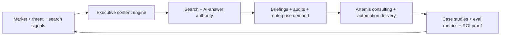
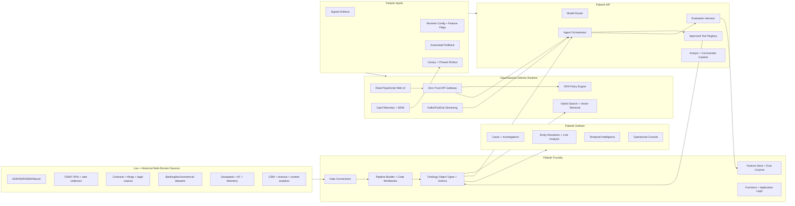
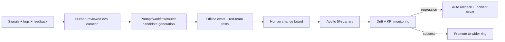

# ClearGlassInc Artemis — 2040 Self-Evolving AI Intelligence Platform

ClearGlassInc Artemis is a production blueprint for a secure, coalition-aware, audited, self-improving intelligence platform built on **Palantir Gotham**, **Foundry**, **AIP**, and **Apollo**. The architecture fuses live and historical data, reasons over mission context at machine speed, and proposes upgrades to its prompts, workflows, heuristics, and model routing only inside explicit human-approved guardrails.

## Executive Directive: Virtual CEO / AI Strategy Architect / Dominance Operator

Artemis is not only an intelligence system. It is also the operating system for ClearGlassInc's 2026-to-2040 market position: a self-executing, domain-authority flywheel designed to dominate search, AI answers, executive mindshare, and revenue generation across AI automation, cybersecurity, OSINT, and legal-tech automation.

### Domain-Authority Flywheel



### Commercial Pillars

| Pillar | Primary keyword | Technical content focus | Conversion path | Revenue model |
|---|---|---|---|---|
| AI Risk Enforcement | auditable AI systems | AI automation reality vs hype, human oversight layers, triple-check protocols, AI audit frameworks | `/ai-audit-framework?utm_source={platform}&utm_campaign=pillar_ai_risk` | Consulting audits at $5K-25K/month; enterprise AI systems at $50K-200K/project |
| Cybersecurity & OSINT | OSINT for corporate security | threat detection, corporate investigations, fraud detection pipelines, government database scans | `/osint-guide?utm_source={platform}&utm_campaign=pillar_cybersecurity` | Cybersecurity audits at $10K-50K; OSINT training at $500-2K; investigative consulting at $25K-100K |
| Legal-Tech Automation | contract review automation ROI | Node.js + AI legal bots, contract review automation, banking/tax law automation, ROI optimization | `/legal-automation?utm_source={platform}&utm_campaign=pillar_legal_tech` | Legal automation contracts at $20K-100K; course sales at $500-2K; software tools at $1K-10K |

### Viral Content Engine Rules

Every published asset uses at least one hook class: shocking statistics, contrarian claims, money/revenue focus, time compression, or exclusive technical access. Platform adapters render:

- **X/Twitter:** 15-post threads, 280-character max posts, code snippets, controversial technical claims.
- **LinkedIn:** 5-slide carousels and 1,200-word executive thought-leadership articles.
- **Website:** pillar pages, case studies, technical guides, and conversion landing pages.
- **Email:** executive briefings with one sharp thesis, one proof point, one CTA.

---


### Implementation Artifacts in This Repository

This blueprint is backed by a deterministic Python generator and a committed weekly launch pack:

- `bots/strategic_viral_engine.py` builds the 7-concept weekly content system, UTM-tagged CTA routing, and KPI dashboard payload.
- `content/weekly_content_20260701.json` is the generated launch artifact containing 7 concepts across SEO outlines, LinkedIn posts, X threads, LinkedIn carousels, 60-second scripts, hashtags, and analytics targets.
- The generator is intentionally deterministic so ClearGlassInc Artemis can version, diff, review, approve, and roll back content-system changes the same way it governs AI workflows.

## System Architecture

### Palantir Roles

- **Gotham**: operational intelligence, investigations, link analysis, entity tracking, case timelines, and commander workflows.
- **Foundry**: data integration, ontology, transformations, pipelines, application logic, dataset lineage, and writeback Actions.
- **AIP**: copilots, tool-using agents, prompt/workflow evaluation, model routing, and AI automation guardrails.
- **Apollo**: secure deployment, runtime configuration, canary releases, rollback, environment promotion, and fleet control.

### Platform Topology



### Layered End-to-End Design

1. **Frontend layer**: analyst workbench, commander console, model-operations console, content/revenue command surface.
2. **API layer**: GraphQL and REST gateway with mTLS, JWT/SPIFFE identities, rate limits, request signing, and audit envelopes.
3. **Backend services**: ingestion normalizer, fusion engine, agent runtime, policy service, eval orchestrator, self-improvement controller, content flywheel worker.
4. **Data layer**: Foundry datasets, lakehouse history, low-latency stores, feature store, vector index, immutable audit ledger.
5. **Ontology layer**: mission-aware object types, relationships, lineage, temporal semantics, confidence, and Foundry Actions.
6. **AI orchestration layer**: AIP copilots and agents, model router, tool executor, prompt registry, workflow registry, eval gates.
7. **Policy layer**: OPA/Rego policy-as-code plus Foundry permission bindings and Apollo release policies.
8. **Observability layer**: traces, metrics, logs, eval dashboards, behavior drift, security alerts, trust scoring.
9. **Deployment layer**: Apollo signed artifacts, canary rings, rollback, runtime control, and cross-domain release promotion.

---

## Data and Ontology

### Core Object Types

```yaml
objectTypes:
  Person:
    primaryKey: person_id
    properties: [name, aliases, role, nationality, clearance, risk_score, confidence, valid_time, tx_time]
  Organization:
    primaryKey: org_id
    properties: [name, sector, jurisdiction, sanctions_status, revenue_band, confidence, valid_time, tx_time]
  Device:
    primaryKey: device_id
    properties: [hostname, imei, mac, owner_ref, compromise_score, last_seen, confidence]
  Account:
    primaryKey: account_id
    properties: [platform, handle, owner_ref, auth_strength, risk_score, confidence]
  Location:
    primaryKey: location_id
    properties: [lat, lon, geohash, area_name, jurisdiction, confidence]
  Event:
    primaryKey: event_id
    properties: [event_type, severity, occurred_at, detected_at, source_system, confidence, classification]
  Alert:
    primaryKey: alert_id
    properties: [rule_id, score, status, disposition, assigned_to, created_at, closed_at]
  Case:
    primaryKey: case_id
    properties: [mission_id, priority, status, disposition, owner, created_at, closed_at]
  Mission:
    primaryKey: mission_id
    properties: [theater, objective, rules_of_engagement, classification, coalition_tags, active_window]
  Contract:
    primaryKey: contract_id
    properties: [counterparty, governing_law, value, renewal_date, clause_risk_score, automation_roi]
  ContentAsset:
    primaryKey: content_id
    properties: [pillar, keyword, platform, hook_type, cta, impressions, conversions, revenue_attributed]
```

### Relationships

```yaml
relationships:
  - Person USES Device
  - Person OPERATES Account
  - Organization EMPLOYS Person
  - Organization CONTROLS Account
  - Device EMITS Event
  - Event OBSERVED_AT Location
  - Event RELATED_TO Person
  - Alert TRIGGERED_BY Event
  - Case CONTAINS Alert
  - Mission CONSTRAINS Case
  - Contract BINDS Organization
  - ContentAsset ATTRACTS Organization
  - Case PRODUCES ContentAsset
```

### Ontology Semantics

- **Confidence**: `source_confidence * corroboration_factor * recency_decay * policy_context_weight`.
- **Lineage**: every object property and inferred edge stores source dataset, transform version, parent evidence, model version, and operator override history.
- **Temporal state**: bitemporal records use `valid_time` for the real-world interval and `tx_time` for what Artemis knew at a specific audit moment.
- **Mission context**: every query is scoped to mission, classification, releasability, coalition tags, role, and purpose of use.
- **AI behavior driver**: agents do not reason over raw tables first; they reason over ontology object sets filtered by policy, confidence, time, and mission constraints.

---

## AI and Agent Design

### Copilots

- **Analyst Copilot**: entity summaries, anomaly explanation, evidence citation, link-analysis narratives, hypothesis drafting.
- **Commander Copilot**: courses of action, risk matrices, tradeoff analysis, readiness impact, approval queue.
- **ModelOps Copilot**: prompt diffs, eval regressions, routing recommendations, drift explanations.
- **Revenue Copilot**: pillar content planning, lead scoring, conversion attribution, offer/pricing recommendations.

### Multi-Agent Workflow

```text
IngestAgent
  -> NormalizeAgent
  -> TriageAgent
  -> EnrichmentAgent
  -> CorrelationAgent
  -> HypothesisAgent
  -> ReportAgent
  -> ActionPackAgent
  -> HumanApprovalGate
  -> ExecuteOrArchiveAgent
  -> OutcomeLearningAgent
```

### Tool Classes

| Tool | Risk tier | Approval requirement |
|---|---:|---|
| `query_ontology` | read-only | autonomous with policy check |
| `search_retrieval` | read-only | autonomous with policy check |
| `generate_intel_product` | read-only/mutation | analyst approval before publication |
| `open_case` | mutation | analyst confirmation |
| `draft_action_package` | mutation | analyst confirmation |
| `send_notification` | external effect | commander approval |
| `isolate_host` | external effect | dual approval + rollback playbook |
| `publish_content_asset` | external effect | marketing/executive approval |

---

## Self-Improvement Loop

### Signals Captured

Artemis captures operator edits, accept/reject decisions, alert labels, false positives, false negatives, missed correlations, mission outcomes, latency, cost, model confidence, source reliability, user trust ratings, conversion outcomes, and revenue attribution.

### Improvement Pipeline



### Guardrails

- Self-improvement can propose changes; it cannot autonomously alter mission goals, approval thresholds, policy boundaries, data access, or external-effect actions.
- Every candidate change includes a diff, eval report, safety scan, blast-radius estimate, rollback plan, and named human approver.
- Rollback is mandatory for precision regression, recall regression, latency breach, policy denial spike, trust-score decline, or drift threshold breach.

### Metrics

| Metric | Target |
|---|---:|
| Alert precision | >= 0.92 |
| Alert recall | >= 0.88 |
| P95 triage latency | <= 1.8 seconds |
| Operator trust | >= 4.3/5 |
| Evidence citation coverage | >= 0.98 |
| Policy decision audit coverage | 100% |
| Conversion attribution coverage | >= 0.95 |

---

## Full-Stack Implementation

```text
/services
  /api_gateway              # FastAPI/GraphQL, authn/z, audit envelopes
  /intel_fusion             # streaming normalization, correlation, graph updates
  /agent_runtime            # AIP adapters, tool executor, workflow state machines
  /policy_engine            # OPA sidecar, decision cache, Foundry permission bindings
  /eval_orchestrator        # benchmark construction, scoring, red-team suites
  /self_improvement         # candidate generation, review tickets, Apollo canaries
  /content_flywheel         # platform adapters, SEO briefs, CTA tracking
/ui
  /analyst_workbench        # React graph/timeline/evidence UX
  /commander_console        # approval queue, COA matrix, mission KPIs
  /modelops_console         # eval dashboards, prompt/workflow diffs, rollout controls
  /revenue_console          # content, pipeline, attribution, executive scorecards
/infra
  /terraform
  /kubernetes
  /apollo_release
  /policy
```

### Runtime Event Contract

```json
{
  "event_type": "cyber.alert.detected",
  "event_id": "evt-93f7",
  "mission_id": "mis-artemis-001",
  "classification": "CONFIDENTIAL//REL TO USA,CAN",
  "source": "wazuh",
  "occurred_at": "2026-06-29T10:03:13Z",
  "payload": {
    "host": "edge-node-17",
    "ioc": "185.220.x.x",
    "technique": "T1071",
    "severity": 0.89
  },
  "audit": {
    "trace_id": "trc-7f2c",
    "ingest_pipeline_version": "ingest.2026.06.29",
    "lineage_refs": ["foundry://dataset/wazuh/events/row/abc"]
  }
}
```

---

## Security and Governance

- **Need-to-know access**: ABAC + ReBAC enforcement for row, column, entity, relationship, and action-level permissions.
- **Coalition boundaries**: releasability tags and mission tags are enforced in every ontology query and agent tool call.
- **Zero-trust execution**: mTLS, workload identity, short-lived credentials, egress allowlists, signed tool manifests.
- **Immutable provenance**: append-only logs for data lineage, prompt versions, model versions, tool calls, approvals, and outcomes.
- **Model governance**: approved model registry, domain restrictions, eval floors, cost/latency caps, red-team suites.
- **Prompt governance**: signed prompt bundles, prompt diff reviews, forbidden pattern scanning, citation requirements.
- **Policy-as-code**: Rego policies in CI, unit tests for authorization rules, Apollo-gated deployment.

---

## Code Examples

### Python: Policy-Enforced FastAPI Gateway

```python
# services/api_gateway/main.py
from __future__ import annotations

from typing import Any
from uuid import uuid4

import httpx
from fastapi import Depends, FastAPI, Header, HTTPException
from pydantic import BaseModel, Field

app = FastAPI(title="ClearGlassInc Artemis API Gateway")


class QueryRequest(BaseModel):
    object_set: str
    filters: dict[str, Any] = Field(default_factory=dict)
    mission_id: str
    purpose: str


async def authorize(
    token: str,
    action: str,
    resource: dict[str, Any],
    trace_id: str,
) -> None:
    async with httpx.AsyncClient(timeout=2.0) as client:
        resp = await client.post(
            "http://policy-engine:8181/v1/data/artemis/authz/allow",
            json={"input": {"token": token, "action": action, "resource": resource, "trace_id": trace_id}},
        )
    if resp.status_code != 200 or not resp.json().get("result", False):
        raise HTTPException(status_code=403, detail="Policy denied")


@app.post("/ontology/query")
async def ontology_query(req: QueryRequest, authorization: str = Header(...)) -> dict[str, Any]:
    trace_id = str(uuid4())
    await authorize(
        token=authorization.removeprefix("Bearer "),
        action="ontology:read",
        resource=req.model_dump(),
        trace_id=trace_id,
    )
    async with httpx.AsyncClient(timeout=10.0) as client:
        foundry_resp = await client.post("http://foundry-adapter/query", json=req.model_dump())
        foundry_resp.raise_for_status()
    return {"trace_id": trace_id, "data": foundry_resp.json(), "policy": "allow"}
```

### Python: Ontology-Driven Query Builder

```python
# services/intel_fusion/ontology_queries.py
from dataclasses import dataclass
from datetime import datetime, timezone


@dataclass(frozen=True)
class MissionScope:
    mission_id: str
    coalition_tags: tuple[str, ...]
    max_classification: str
    valid_at: datetime = datetime.now(timezone.utc)


def build_alert_context_query(alert_id: str, scope: MissionScope) -> dict:
    return {
        "objectType": "Alert",
        "where": {
            "alert_id": alert_id,
            "mission_id": scope.mission_id,
            "classification_lte": scope.max_classification,
            "coalition_tags_all": list(scope.coalition_tags),
            "valid_at": scope.valid_at.isoformat(),
        },
        "include": [
            {"relationship": "TRIGGERED_BY", "objectType": "Event"},
            {"relationship": "RELATED_TO", "objectType": "Person"},
            {"relationship": "EMITS", "objectType": "Device", "reverse": True},
        ],
        "lineage": True,
        "confidence": {"min": 0.65},
    }
```

### Python: Guardrailed Agent Tool Executor

```python
# services/agent_runtime/tool_executor.py
from dataclasses import dataclass
from enum import Enum
from typing import Awaitable, Callable


class RiskTier(str, Enum):
    READ_ONLY = "read_only"
    MUTATION = "mutation"
    EXTERNAL_EFFECT = "external_effect"


@dataclass(frozen=True)
class ToolCall:
    name: str
    args: dict
    risk: RiskTier
    mission_id: str
    rationale: str


Tool = Callable[..., Awaitable[dict]]
TOOL_REGISTRY: dict[str, Tool] = {}


def approval_role(risk: RiskTier) -> str | None:
    return {
        RiskTier.READ_ONLY: None,
        RiskTier.MUTATION: "analyst",
        RiskTier.EXTERNAL_EFFECT: "commander_and_analyst",
    }[risk]


async def execute_tool_call(call: ToolCall, context: dict) -> dict:
    required_role = approval_role(call.risk)
    if required_role:
        return {
            "status": "pending_approval",
            "required_role": required_role,
            "tool_call": call.__dict__,
            "rollback_playbook": f"rollback/{call.name}.yaml",
        }
    return await TOOL_REGISTRY[call.name](**call.args, context=context)
```

### Python: Workflow State Machine

```python
# services/agent_runtime/workflows.py
from enum import StrEnum
from pydantic import BaseModel


class State(StrEnum):
    INGESTED = "ingested"
    TRIAGED = "triaged"
    ENRICHED = "enriched"
    CORRELATED = "correlated"
    RECOMMENDED = "recommended"
    PENDING_APPROVAL = "pending_approval"
    EXECUTED = "executed"
    ARCHIVED = "archived"


class WorkflowContext(BaseModel):
    alert_id: str
    mission_id: str
    state: State = State.INGESTED
    confidence: float = 0.0
    recommendation: dict = {}


TRANSITIONS = {
    State.INGESTED: State.TRIAGED,
    State.TRIAGED: State.ENRICHED,
    State.ENRICHED: State.CORRELATED,
    State.CORRELATED: State.RECOMMENDED,
    State.RECOMMENDED: State.PENDING_APPROVAL,
}


def transition(ctx: WorkflowContext, min_confidence: float = 0.72) -> WorkflowContext:
    if ctx.state == State.CORRELATED and ctx.confidence < min_confidence:
        ctx.state = State.ARCHIVED
        return ctx
    ctx.state = TRANSITIONS.get(ctx.state, ctx.state)
    return ctx
```

### Rego: Coalition and Classification Policy

```rego
# infra/policy/artemis/authz.rego
package artemis.authz

default allow := false

allow if {
  input.action == "ontology:read"
  subject := data.identities[input.token]
  resource := input.resource
  subject.active == true
  subject.clearance_level >= data.classification_levels[resource.filters.classification]
  resource.mission_id in subject.missions
  every tag in resource.filters.coalition_tags {
    tag in subject.coalition_tags
  }
}

allow if {
  input.action == "action:approve"
  subject := data.identities[input.token]
  input.resource.required_role in subject.roles
  input.resource.mission_id in subject.missions
}
```

### SQL: Eval Dataset Builder

```sql
-- services/eval_orchestrator/sql/build_eval_set.sql
INSERT INTO eval_samples (
  sample_id,
  created_at,
  query_text,
  expected_label,
  mission_id,
  source_trace,
  human_rationale
)
SELECT
  gen_random_uuid(),
  NOW(),
  q.query_text,
  o.outcome_label,
  q.mission_id,
  q.trace_id,
  o.reviewer_notes
FROM query_logs q
JOIN alert_outcomes o ON o.alert_id = q.alert_id
WHERE q.created_at >= NOW() - INTERVAL '14 days'
  AND o.reviewed_by_human = TRUE
  AND q.policy_result = 'allow';
```

### Python: Self-Improvement Candidate Promotion

```python
# services/self_improvement/promote.py
from dataclasses import dataclass


@dataclass(frozen=True)
class Candidate:
    candidate_id: str
    prompt_version: str
    workflow_version: str
    router_policy_version: str
    precision: float
    recall: float
    p95_latency_ms: int
    trust_score: float
    policy_denial_delta: float
    approved_by: str | None


PROMOTION_FLOOR = {
    "precision": 0.92,
    "recall": 0.88,
    "trust_score": 4.3,
    "p95_latency_ms": 1800,
    "policy_denial_delta": 0.02,
}


def qualifies(candidate: Candidate) -> tuple[bool, list[str]]:
    failures: list[str] = []
    if candidate.precision < PROMOTION_FLOOR["precision"]:
        failures.append("precision_floor")
    if candidate.recall < PROMOTION_FLOOR["recall"]:
        failures.append("recall_floor")
    if candidate.trust_score < PROMOTION_FLOOR["trust_score"]:
        failures.append("trust_floor")
    if candidate.p95_latency_ms > PROMOTION_FLOOR["p95_latency_ms"]:
        failures.append("latency_floor")
    if candidate.policy_denial_delta > PROMOTION_FLOOR["policy_denial_delta"]:
        failures.append("policy_regression")
    if not candidate.approved_by:
        failures.append("missing_human_approval")
    return not failures, failures


async def promote_or_reject(candidate: Candidate, apollo_client) -> dict:
    ok, failures = qualifies(candidate)
    if not ok:
        return {"status": "rejected", "candidate_id": candidate.candidate_id, "failures": failures}

    release_id = await apollo_client.create_canary_release(
        artifact_refs=[
            candidate.prompt_version,
            candidate.workflow_version,
            candidate.router_policy_version,
        ],
        traffic_percent=5,
        auto_rollback=True,
        rollback_on=["precision_regression", "latency_breach", "policy_denial_spike"],
    )
    return {"status": "canary_started", "release_id": release_id}
```

### TypeScript: Commander Approval Card

```tsx
// ui/commander_console/src/components/ApprovalCard.tsx
type Decision = "approve" | "reject";

export async function submitDecision(actionId: string, decision: Decision, rationale: string) {
  const res = await fetch(`/api/actions/${actionId}/decision`, {
    method: "POST",
    headers: { "Content-Type": "application/json" },
    body: JSON.stringify({ decision, rationale, decidedAt: new Date().toISOString() }),
  });

  if (!res.ok) {
    throw new Error(`Decision failed: ${res.status}`);
  }

  return res.json();
}
```

### Python: Content Flywheel Generator

```python
# services/content_flywheel/hooks.py
from dataclasses import dataclass
from enum import StrEnum


class Pillar(StrEnum):
    AI_RISK = "ai_risk_enforcement"
    CYBER_OSINT = "cybersecurity_osint"
    LEGAL_TECH = "legal_tech_automation"


@dataclass(frozen=True)
class ContentBrief:
    pillar: Pillar
    keyword: str
    hook: str
    platform: str
    cta: str
    revenue_offer: str


def build_briefs() -> list[ContentBrief]:
    return [
        ContentBrief(
            pillar=Pillar.AI_RISK,
            keyword="auditable AI systems",
            hook="95% of AI projects do not need more agents. They need audit trails.",
            platform="linkedin",
            cta="/ai-audit-framework?utm_source=linkedin&utm_campaign=pillar_ai_risk",
            revenue_offer="AI audit retainer",
        ),
        ContentBrief(
            pillar=Pillar.CYBER_OSINT,
            keyword="OSINT for corporate security",
            hook="Your vendor risk is already public. Your dashboard just has not found it yet.",
            platform="x",
            cta="/osint-guide?utm_source=x&utm_campaign=pillar_cybersecurity",
            revenue_offer="OSINT investigation sprint",
        ),
        ContentBrief(
            pillar=Pillar.LEGAL_TECH,
            keyword="contract review automation ROI",
            hook="A contract bot that cannot calculate ROI is a toy. Legal automation should pay for itself.",
            platform="website",
            cta="/legal-automation?utm_source=site&utm_campaign=pillar_legal_tech",
            revenue_offer="Legal automation buildout",
        ),
    ]
```

---

## Scenario Walkthrough

1. **Live event enters Artemis**: Wazuh emits suspicious beaconing from `edge-node-17` with ATT&CK technique `T1071`, severity `0.89`, and coalition tag `REL TO USA,CAN`.
2. **Foundry normalizes and binds ontology**: the event becomes an `Event`, links to a `Device`, updates an `Alert`, and attaches lineage to the raw Wazuh row and transform version.
3. **AIP triages**: `TriageAgent` queries policy-filtered ontology context, retrieves historical beaconing cases, and scores the alert as high confidence.
4. **Correlation expands the graph**: `CorrelationAgent` finds that the device belongs to an account associated with an active procurement fraud investigation.
5. **Recommendation is drafted**: `ActionPackAgent` proposes host isolation, a high-priority Gotham case update, and a commander notification.
6. **Policy gates the action**: host isolation is classified as an external effect. Artemis requires analyst + commander approval and attaches a rollback playbook.
7. **Operator decision**: the analyst approves the case package but rejects immediate isolation because the host is running a critical legal discovery export.
8. **Outcome capture**: the operator adds rationale. The system records that a high-severity cyber recommendation was operationally correct but poorly timed.
9. **Self-improvement proposal**: `OutcomeLearningAgent` proposes a workflow update: before isolation recommendations, query mission-critical workload schedules and legal hold windows.
10. **Eval and review**: the candidate workflow improves precision from `0.91` to `0.94`, maintains recall at `0.89`, and adds `120ms` latency. A human review board approves.
11. **Apollo canary**: Apollo deploys the workflow to 5% of eligible alerts. Observability watches latency, precision, trust, and policy denial deltas.
12. **Promotion or rollback**: if metrics hold for 24 hours, the workflow promotes to the next ring. If trust drops or policy denials spike, Apollo rolls back automatically and opens an incident ticket.
13. **Market flywheel**: anonymized, approved metrics become a technical article on auditable AI systems, driving executive briefings through the AI risk conversion path.


---

## Skeleton Key Execution Addendum — June 29, 2026

ClearGlassInc Artemis now treats the 8-phase Skeleton Key workflow as an auditable operating cycle rather than a one-time content burst. Brand strategy, campaign generation, research agents, media planning, content production, analytics, and conversion outcomes become first-class telemetry that can be evaluated with the same governance pattern used for mission intelligence workflows.

### Workflow Control Plane

| Phase | Artemis implementation | Human gate | Output artifact |
|---|---|---|---|
| Brand creation | Foundry-owned brand profile object with approved voice, offers, and exclusions | COO approval | Versioned `BrandProfile` ontology object |
| Brand dashboard | KPI objects linked to GA4, LinkedIn, X, HubSpot, and site events | Weekly review | Dashboard dataset and executive brief |
| Campaign setup | AIP campaign planner proposes concepts, formats, CTAs, and UTM routes | Marketing approval | Campaign plan and landing-page backlog |
| Research workflow | Analyst agents collect trend, competitor, threat, and legal-tech signals | Source-quality review | Evidence pack with lineage and confidence |
| Strategy workflow | Strategy agent maps hooks, offers, proof points, and risk disclaimers | Executive approval | Strategy version and prompt bundle |
| Media plan | Scheduler agent allocates channels, cadence, repurposing, and review windows | Publishing approval | Calendar plus channel-specific tasks |
| Content generation | Tool-using generators produce blogs, threads, carousels, scripts, and briefs | Editorial approval | Reviewable content assets |
| Analytics and conversion | Outcome agent joins impressions, downloads, replies, calls, and revenue | Revenue review | Evals, ROI reports, and upgrade proposals |

### Python Reference Skeleton

The repository now includes a dependency-light Python skeleton that makes the control loop concrete: ontology objects carry classification, compartments, coalition releasability, confidence, temporal validity, and lineage; actions are labeled with approval gates; operator feedback is converted into evaluated upgrade proposals rather than silently changing system behavior.

```python
policy = PolicyEngine()
workflow = ArtemisWorkflow(policy)
loop = SelfImprovementLoop()

candidate_action = workflow.triage_event(event, mission, subject)
if workflow.approval_required(candidate_action):
    route_to_human_review(candidate_action)

proposal = loop.propose_upgrade(feedback_batch, current_version="triage_workflow.v7")
if proposal and loop.promotion_decision(proposal) == "approve":
    submit_to_apollo_canary(proposal)
```

### Precision Rules for Self-Evolution

1. **No autonomous goal changes**: Artemis may optimize prompts, routing, thresholds, and workflow order, but it cannot redefine mission objectives, brand claims, prohibited actions, or coalition release rules.
2. **Every upgrade is diffable**: prompt, workflow, model-routing, heuristic, and data-contract changes are versioned with current version, candidate version, metrics, rollback pointer, and approver identity.
3. **Every metric has a safety pair**: growth metrics are paired with trust and policy metrics; for example, lead downloads are reviewed alongside complaint rate, source quality, and claim substantiation.
4. **Apollo controls runtime exposure**: accepted upgrades start in canary rings, receive automatic rollback triggers, and promote only after latency, precision, recall, operator trust, and policy-denial thresholds remain healthy.
5. **Foundry owns lineage**: all generated claims, recommendations, and intelligence outputs point back to source datasets, transform versions, prompt versions, and reviewer decisions.
