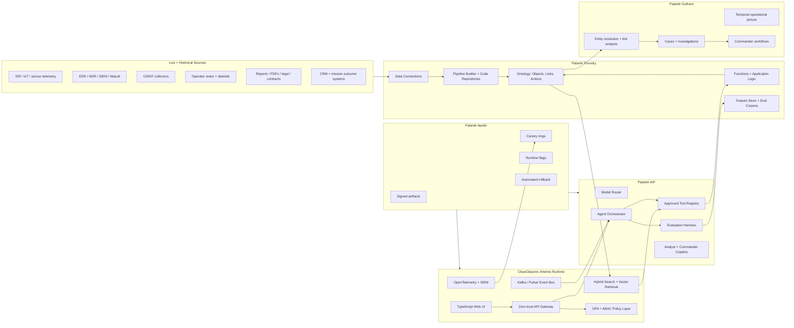
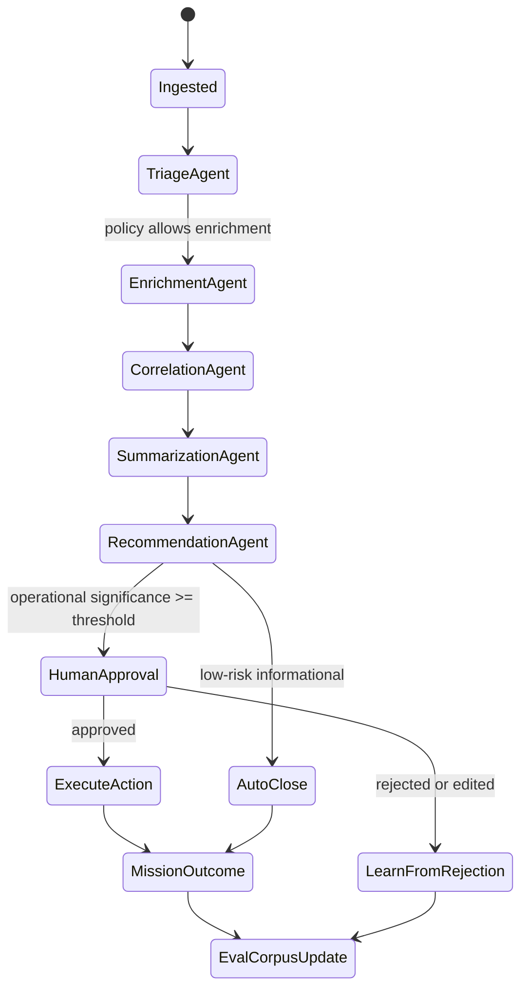
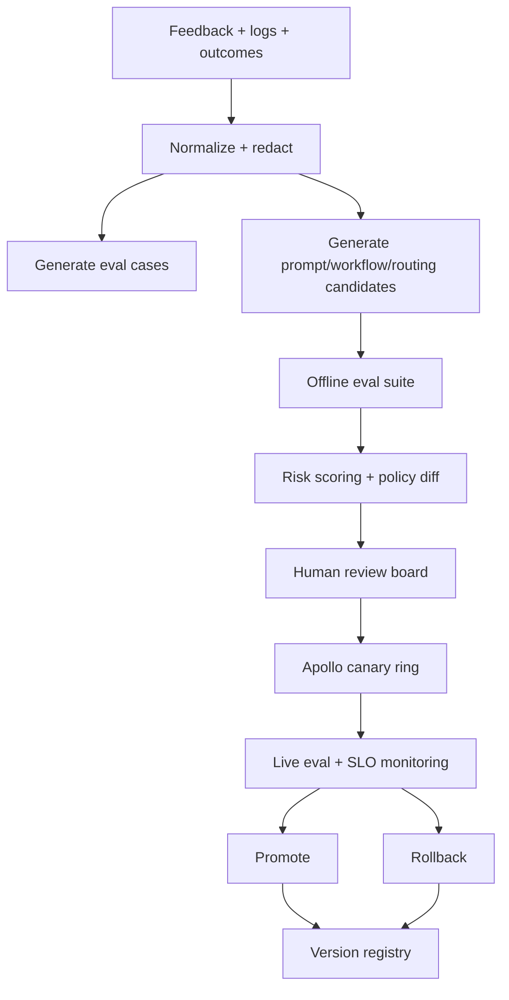

# ClearGlassInc Artemis — Self-Evolving AI Intelligence Platform Blueprint

ClearGlassInc Artemis is a full-stack, coalition-aware intelligence platform blueprint built on Palantir Gotham, Foundry, AIP, and Apollo. It fuses live and historical data, reasons over a governed ontology, assists operators at machine speed, and proposes safe upgrades to prompts, workflows, heuristics, and model routing only through explicit human approval.

## System Architecture

### Platform roles

- **Gotham** provides operational intelligence, investigations, entity tracking, link analysis, case timelines, and commander views.
- **Foundry** provides data integration, transformation pipelines, ontology object types, Actions, Functions, application logic, lineage, and governed writeback.
- **AIP** provides copilots, tool-using agents, evaluations, prompt/workflow orchestration, model routing, and human-in-the-loop automation.
- **Apollo** provides secure deployment, runtime configuration, canaries, rollback, promotion, and fleet control across enclaves.

### End-to-end topology



### Layer responsibilities

| Layer | Responsibility | Production controls |
|---|---|---|
| Frontend | Analyst workbench, commander console, ModelOps console, mission timeline, approval queues | WebAuthn, classification banners, audit overlays, redaction-aware rendering |
| API gateway | REST/GraphQL ingress, mTLS, JWT/SPIFFE identity propagation, request signing | Rate limits, schema validation, replay protection, policy pre-checks |
| Backend services | Fusion, correlation, enrichment, workflow execution, self-improvement proposals | Idempotency keys, event sourcing, circuit breakers, typed contracts |
| Data layer | Lakehouse, low-latency stores, immutable audit ledger, feature/eval corpora | Lineage, retention policy, encryption, dataset ACLs |
| Ontology layer | Mission entities, relationships, Actions, Functions, temporal state | Object-level permissions, confidence, provenance, policy-bound Actions |
| AI orchestration | Agents, copilots, tools, prompts, evals, model routing | Tool allowlists, approval gates, deterministic traces, eval thresholds |
| Policy layer | Need-to-know, coalition boundaries, purpose-of-use, prompt/model governance | OPA/Rego, ABAC, row/column/entity filters, signed policies |
| Observability | Logs, traces, metrics, eval dashboards, drift and trust telemetry | OpenTelemetry, SIEM export, immutable audit, SLO alerts |
| Deployment | Secure rollout, rollback, promotion, runtime control | Apollo canaries, signed artifacts, health gates, config freezes |

## Data and Ontology

### Core ontology objects

```yaml
objectTypes:
  Mission:
    pk: mission_id
    properties: [name, objective, theater, classification, coalition_tags, active_window, roe_ref, commander]
  Event:
    pk: event_id
    properties: [event_type, severity, occurred_at, detected_at, source_system, confidence, classification]
  Alert:
    pk: alert_id
    properties: [rule_id, score, status, disposition, created_at, assigned_to, sla_deadline]
  Case:
    pk: case_id
    properties: [mission_id, priority, status, owner, disposition, created_at, closed_at]
  Entity:
    pk: entity_id
    properties: [kind, canonical_name, aliases, risk_score, confidence, valid_time, tx_time]
  Device:
    pk: device_id
    properties: [hostname, ip, mac, owner_ref, compromise_score, last_seen]
  Location:
    pk: location_id
    properties: [lat, lon, geohash, area_name, jurisdiction, confidence]
  Evidence:
    pk: evidence_id
    properties: [source_uri, hash, collected_at, collector, classification, handling_caveats]
  OperatorFeedback:
    pk: feedback_id
    properties: [operator_id, case_id, target_ref, correction_type, label, rationale, created_at]
  PromptVersion:
    pk: prompt_version_id
    properties: [name, version, body_hash, author, eval_score, approval_state, deployed_ring]
  WorkflowVersion:
    pk: workflow_version_id
    properties: [name, version, graph_hash, eval_score, approval_state, deployed_ring]
```

### Relationships

```yaml
relationships:
  - Mission CONSTRAINS Case
  - Case CONTAINS Alert
  - Alert TRIGGERED_BY Event
  - Event OBSERVED_AT Location
  - Event INVOLVES Entity
  - Entity USES Device
  - Evidence SUPPORTS Event
  - OperatorFeedback CORRECTS Alert
  - PromptVersion POWERS Agent
  - WorkflowVersion ORCHESTRATES Agent
  - Agent PRODUCES IntelProduct
```

### Confidence, lineage, and temporal semantics

```python
from dataclasses import dataclass
from datetime import datetime, timezone
from math import exp

@dataclass(frozen=True)
class EvidenceScore:
    source_confidence: float
    corroboration_count: int
    age_hours: float
    policy_context_weight: float


def confidence(score: EvidenceScore) -> float:
    corroboration = min(1.0, 0.45 + 0.15 * score.corroboration_count)
    recency_decay = exp(-score.age_hours / (24 * 21))
    raw = score.source_confidence * corroboration * recency_decay * score.policy_context_weight
    return round(max(0.0, min(raw, 1.0)), 4)


def lineage_record(parent_ids: list[str], transform: str, model: str | None) -> dict:
    return {
        "parent_evidence_ids": parent_ids,
        "transform_version": transform,
        "model_version": model,
        "tx_time": datetime.now(timezone.utc).isoformat(),
    }
```

Artemis stores both **valid time** (when a fact was true in the world) and **transaction time** (when the platform knew or changed the fact). Agents use that bitemporal state to answer questions such as “what did we know before the approval?” and “which inference changed after operator correction?”

## AI and Agent Design

### Copilots

- **Analyst Copilot**: explains alerts, summarizes entities, cites evidence, drafts hypotheses, asks clarifying questions, and prepares investigation notes.
- **Commander Copilot**: compares courses of action, quantifies risk, identifies approval gates, and produces decision briefs.
- **ModelOps Copilot**: reviews prompt diffs, eval regressions, drift events, cost/latency changes, and proposed routing updates.
- **Coalition Copilot**: creates releasable summaries, strips restricted fields, and verifies coalition caveats before sharing.

### Multi-agent workflow



### Tool-using agent contract

Agents can query policy-filtered ontology objects, search evidence, generate intelligence products, open cases, and prepare action packages. They cannot execute operationally significant actions without a human approval token bound to mission, purpose, classification, and action type.

```python
from pydantic import BaseModel, Field
from typing import Literal

class ToolRequest(BaseModel):
    tool_name: str
    mission_id: str
    purpose: Literal["triage", "investigation", "briefing", "approval_package"]
    args: dict

class ToolResult(BaseModel):
    ok: bool
    data: dict | list | None = None
    citations: list[str] = Field(default_factory=list)
    audit_id: str
```

## Self-Improvement Loop

### Signals captured

- Operator feedback: labels, corrections, rejections, edited summaries, trust ratings, escalation decisions.
- Query logs: prompts, retrieved objects, redactions, tool calls, latency, model route, token cost.
- Alert outcomes: true positive, false positive, duplicate, stale, insufficient evidence, policy blocked.
- Mission outcomes: commander disposition, time-to-decision, downstream impact, safety incidents, post-action review.
- Runtime telemetry: drift, retrieval misses, hallucination flags, failed citations, eval regressions.

### Safe upgrade pipeline



### Control principles

1. Artemis may propose improvements but may not change mission objectives, rules of engagement, legal policy, classification policy, or action authority.
2. Every prompt, workflow, routing policy, and heuristic is versioned, signed, evaluated, and auditable.
3. Deployment requires eval thresholds, policy review, human approval, and Apollo canary success.
4. Rollback is automatic on safety regressions, hallucination-rate increases, citation failures, policy-denial anomalies, or latency SLO breaches.

### Metrics

| Metric | Purpose | Example threshold |
|---|---|---|
| Precision | Reduce false positives | `>= 0.92` for critical alerts |
| Recall | Avoid missing mission-relevant events | `>= 0.86` for priority feeds |
| Citation accuracy | Ensure claims are evidence-backed | `>= 0.98` |
| Policy violation rate | Governance safety | `0` allowed violations |
| Latency p95 | Machine-speed operations | `< 1.5s` triage, `< 8s` package |
| Operator trust | Human acceptance and edit distance | `>= 4.3/5` and falling edit distance |
| Mission impact | Decision speed and outcome quality | `>= 20%` time-to-decision reduction |

## Full-Stack Implementation

### Repository layout

```text
artemis/
  apps/web/                         # Next.js/TypeScript operator UI
  apps/api/                         # FastAPI gateway and service façade
  services/fusion/                  # entity resolution + correlation
  services/agent-runtime/           # AIP tool executor and workflow runner
  services/self-improvement/        # eval generation + candidate proposals
  packages/policy/                  # Rego policies and Python policy client
  packages/ontology/                # typed ontology models and query builders
  infra/apollo/                     # release channels, rings, health gates
  infra/terraform/                  # cloud and enclave infrastructure
  observability/                    # dashboards, OpenTelemetry config, alerts
```

### Web UI blueprint

- Mission header with classification, coalition scope, current objective, and Apollo release ring.
- Real-time event stream with severity, confidence, lineage, and policy status.
- Ontology graph panel powered by policy-filtered entity relationships.
- Copilot sidecar with citations, tool traces, approval buttons, and redaction warnings.
- ModelOps dashboard for eval results, prompt diffs, routing changes, and canary health.

### Backend service blueprint

- API Gateway: FastAPI, Pydantic contracts, mTLS, JWT validation, OPA authorization, OpenTelemetry spans.
- Event bus: Kafka/Pulsar topics for raw events, normalized events, alerts, cases, feedback, eval cases, deployment outcomes.
- Data layer: Foundry datasets for canonical history, low-latency Redis/Postgres for hot state, vector index for evidence retrieval.
- Model router: routes by mission classification, latency SLO, eval score, cost budget, tool availability, and data residency.
- Workflow engine: state machines for triage, enrichment, approval, action-package preparation, and post-action learning.

## Security and Governance

### Need-to-know authorization

Artemis enforces authorization at multiple layers: API request, ontology query, retrieval result, generated answer, tool call, and UI render. A user must have the right role, mission assignment, clearance, coalition tag, purpose-of-use, and compartment access before viewing or acting on data.

```rego
package artemis.authz

default allow := false

allow if {
  input.subject.clearance_level >= input.resource.classification_level
  input.resource.mission_id in input.subject.assigned_missions
  every tag in input.resource.coalition_tags { tag in input.subject.coalition_tags }
  input.action in input.subject.allowed_actions
  input.purpose in input.subject.allowed_purposes
  not denied_compartment
}

denied_compartment if {
  some c in input.resource.compartments
  not c in input.subject.compartments
}
```

### Governance controls

- Row, column, and entity-level filters in Foundry and the API gateway.
- Classification-aware retrieval that excludes restricted evidence before model context construction.
- Prompt governance with signed versions, owners, approvals, eval scores, and deployment rings.
- Model governance with approved model inventory, data residency rules, telemetry, and fallback routes.
- Immutable audit logs for every query, object access, prompt render, tool call, approval, deployment, and rollback.
- Zero-trust execution with service identity, workload attestation, sealed secrets, egress allowlists, and sandboxed tool calls.

## Code Examples

### FastAPI gateway with policy and audit envelope

```python
from fastapi import FastAPI, Depends, HTTPException, Request
from pydantic import BaseModel
from opentelemetry import trace

app = FastAPI(title="ClearGlassInc Artemis API")
tracer = trace.get_tracer("artemis.api")

class TriageRequest(BaseModel):
    mission_id: str
    event_id: str
    purpose: str = "triage"

class Principal(BaseModel):
    sub: str
    clearance_level: int
    assigned_missions: list[str]
    coalition_tags: list[str]
    allowed_actions: list[str]
    allowed_purposes: list[str]
    compartments: list[str]

async def principal_from_request(request: Request) -> Principal:
    # Production: validate mTLS-bound JWT/SPIFFE identity and map claims.
    return Principal.model_validate_json(request.headers["x-artemis-principal"])

async def opa_allow(principal: Principal, action: str, resource: dict, purpose: str) -> bool:
    # Production: call OPA sidecar or embedded policy bundle.
    return purpose in principal.allowed_purposes and resource["mission_id"] in principal.assigned_missions

@app.post("/v1/triage")
async def triage(req: TriageRequest, principal: Principal = Depends(principal_from_request)):
    with tracer.start_as_current_span("triage") as span:
        span.set_attribute("mission_id", req.mission_id)
        resource = {"mission_id": req.mission_id, "classification_level": 3, "coalition_tags": ["REL-CG"]}
        if not await opa_allow(principal, "triage:event", resource, req.purpose):
            raise HTTPException(status_code=403, detail="policy denied")
        result = await run_triage_workflow(req.event_id, req.mission_id, principal.sub)
        await write_audit("triage:event", principal.sub, req.model_dump(), result.audit_id)
        return result.model_dump()
```

### Ontology-driven query builder

```python
from dataclasses import dataclass

@dataclass(frozen=True)
class OntologyQuery:
    object_type: str
    filters: dict
    include_links: list[str]
    as_of: str | None = None


def alert_context_query(mission_id: str, alert_id: str) -> OntologyQuery:
    return OntologyQuery(
        object_type="Alert",
        filters={"mission_id": mission_id, "alert_id": alert_id, "status": {"$ne": "redacted"}},
        include_links=["TRIGGERED_BY", "INVOLVES", "SUPPORTED_BY", "CONSTRAINED_BY"],
    )

async def execute_foundry_query(query: OntologyQuery, principal: Principal) -> dict:
    filtered = apply_need_to_know_filter(query, principal)
    return await foundry_ontology_client.search(filtered)
```

### Workflow state machine

```python
from enum import StrEnum
from pydantic import BaseModel

class State(StrEnum):
    INGESTED = "ingested"
    TRIAGED = "triaged"
    ENRICHED = "enriched"
    CORRELATED = "correlated"
    SUMMARIZED = "summarized"
    PENDING_APPROVAL = "pending_approval"
    EXECUTED = "executed"
    CLOSED = "closed"

class WorkflowContext(BaseModel):
    mission_id: str
    event_id: str
    confidence: float = 0.0
    operational_significance: float = 0.0
    approvals: list[str] = []

async def next_step(ctx: WorkflowContext, state: State) -> State:
    if state == State.INGESTED:
        ctx.confidence = await triage_agent(ctx)
        return State.TRIAGED
    if state == State.TRIAGED:
        await enrichment_agent(ctx)
        return State.ENRICHED
    if state == State.ENRICHED:
        ctx.operational_significance = await correlation_agent(ctx)
        return State.CORRELATED
    if state == State.CORRELATED:
        await summarization_agent(ctx)
        return State.SUMMARIZED
    if state == State.SUMMARIZED and ctx.operational_significance >= 0.65:
        await create_approval_package(ctx)
        return State.PENDING_APPROVAL
    return State.CLOSED
```

### AIP-style tool execution with approval gate

```python
class ActionPackage(BaseModel):
    case_id: str
    mission_id: str
    recommendation: str
    evidence_ids: list[str]
    risk_score: float
    requires_approval: bool = True

async def prepare_action_package(case_id: str, principal: Principal) -> ActionPackage:
    case = await execute_foundry_query(
        OntologyQuery("Case", {"case_id": case_id}, ["CONTAINS", "SUPPORTED_BY"]), principal
    )
    recommendation = await model_router.complete(
        task="commander_recommendation",
        context=case,
        constraints={"must_cite_evidence": True, "no_unapproved_action": True},
    )
    return ActionPackage(
        case_id=case_id,
        mission_id=case["mission_id"],
        recommendation=recommendation.text,
        evidence_ids=recommendation.citations,
        risk_score=recommendation.risk_score,
    )

async def execute_operational_action(pkg: ActionPackage, approval_token: str | None) -> dict:
    if pkg.requires_approval and not await validate_approval_token(approval_token, pkg):
        raise PermissionError("human approval required")
    return await foundry_action_client.invoke("OpenOperationalTask", pkg.model_dump())
```

### Eval and self-upgrade candidate generation

```python
class EvalCase(BaseModel):
    input_snapshot_ref: str
    expected_label: str
    operator_rationale: str
    policy_context: dict

class CandidatePatch(BaseModel):
    target: str
    version_from: str
    diff: str
    rationale: str
    offline_scores: dict[str, float]

async def build_eval_cases(feedback_batch: list[dict]) -> list[EvalCase]:
    cases: list[EvalCase] = []
    for fb in feedback_batch:
        if fb["correction_type"] in {"false_positive", "missed_correlation", "bad_summary"}:
            cases.append(EvalCase(
                input_snapshot_ref=fb["snapshot_ref"],
                expected_label=fb["label"],
                operator_rationale=fb["rationale"],
                policy_context=fb["policy_context"],
            ))
    return cases

async def propose_prompt_patch(eval_cases: list[EvalCase], prompt_name: str) -> CandidatePatch:
    current = await prompt_registry.get_active(prompt_name)
    diff = await model_router.complete(
        task="prompt_improvement_proposal",
        context={"current_prompt": current.body, "eval_failures": [c.model_dump() for c in eval_cases]},
        constraints={"output_format": "unified_diff", "do_not_change_policy": True},
    )
    scores = await eval_runner.run(prompt_diff=diff.text, cases=eval_cases)
    return CandidatePatch(
        target=prompt_name,
        version_from=current.version,
        diff=diff.text,
        rationale="Reduce observed eval failures while preserving policy constraints.",
        offline_scores=scores,
    )
```

### SQL eval dashboard view

```sql
create or replace view artemis_eval_dashboard as
select
  prompt_name,
  prompt_version,
  workflow_version,
  model_route,
  count(*) as eval_count,
  avg(case when passed then 1 else 0 end) as pass_rate,
  avg(latency_ms) as avg_latency_ms,
  percentile_cont(0.95) within group (order by latency_ms) as p95_latency_ms,
  avg(citation_accuracy) as citation_accuracy,
  sum(case when policy_violation then 1 else 0 end) as policy_violations
from eval_runs
where executed_at >= now() - interval '30 days'
group by prompt_name, prompt_version, workflow_version, model_route;
```

## Scenario Walkthrough

1. **Live event arrives**: an encrypted telemetry stream reports anomalous access from a coalition-restricted device. The ingestion normalizer writes a raw event, hashes the evidence, and emits `normalized.event.created`.
2. **Ontology update**: Foundry pipelines map the event to `Event`, link it to `Device`, `Location`, and `Mission`, and compute initial confidence from source reliability, recency, and corroboration.
3. **Agent triage**: the Triage Agent receives the event from Kafka, queries the policy-filtered ontology, and classifies it as medium severity because the device is mission-relevant but evidence is single-source.
4. **Enrichment and correlation**: the Enrichment Agent pulls recent cyber telemetry, the Correlation Agent finds two related failed logins, and confidence rises above the alert threshold.
5. **Recommendation**: the Commander Copilot drafts an action package recommending temporary account isolation, additional collection, and analyst review. Evidence citations and policy constraints are embedded in the package.
6. **Approval gate**: because account isolation is operationally significant, the system routes the package to a cleared operator. The operator edits the rationale, approves collection, but rejects immediate isolation as too disruptive.
7. **Execution**: approved collection runs through a Foundry Action. Rejected isolation is logged with operator rationale and linked to the case.
8. **Learning signal**: the rejection, edit distance, final disposition, and later mission outcome become `OperatorFeedback` and eval cases.
9. **Candidate upgrade**: the self-improvement controller detects a pattern of over-aggressive isolation recommendations in similar cases and proposes a prompt patch plus a workflow threshold change.
10. **Evaluation**: offline evals show higher precision, unchanged recall, zero policy violations, and improved operator trust prediction.
11. **Human review**: the ModelOps board approves the patch for Apollo canary ring `r1` only.
12. **Canary and rollback safety**: live metrics remain healthy, so Apollo promotes to `r2`. If citation accuracy, precision, or policy-denial anomalies regress, Apollo rolls back to the previous signed prompt and workflow versions.

## How Artemis Gets Better Safely

Artemis improves by converting operator behavior and mission outcomes into governed evals, not by autonomously rewriting its goals. It can recommend prompt edits, workflow graph changes, retrieval parameters, model routes, and heuristic thresholds. Humans approve or reject those recommendations. Apollo deploys approved versions gradually, observability verifies live behavior, and immutable audit records preserve every reason, score, diff, approval, and rollback.

## Defensive Cyber Technique Tool Merge

ClearGlassInc Artemis now exposes an operator-facing **Attack Lifecycle Defense Matrix** in the command console. The tool is intentionally defensive and educational: it helps analysts normalize common cybersecurity lifecycle terms into observable risk states, candidate telemetry, and approved countermeasures.

### Technique catalog

| Technique | Operational meaning | Defensive posture |
|---|---|---|
| Exploitation | Abuse of a vulnerability, unpatched system, or misconfiguration to produce unintended behavior. | Patch management, vulnerability scanning, secure input validation, exploit telemetry correlation. |
| Credential Theft | Unauthorized acquisition of usernames, passwords, hashes, session tokens, or authentication material. | MFA, least privilege, credential guardrails, token anomaly analytics. |
| LSASS Dumping | Attempted memory access against `lsass.exe` to obtain cached credentials or password hashes. | Windows Defender Credential Guard, LSA Protection, handle-access alerting, privileged process monitoring. |
| AMSI Bypass | Attempts to blind or disable the Windows Antimalware Scan Interface before script inspection. | Script Block Logging, transcription, AMSI tamper analytics, behavior-based EDR. |
| Defender Disabling | Unauthorized changes that pause, disable, or weaken Microsoft Defender Antivirus controls. | Tamper Protection, managed baselines, drift detection, blocked local policy changes. |
| Defense Evasion | Obfuscation, injection, timestamp manipulation, or other behavior intended to avoid detection. | EDR heuristic analytics, provenance checks, suspicious process lineage detection. |
| Stealth Persistence | Maintaining access across restart or credential rotation while minimizing visible footprint. | Autorun audits, scheduled-task baselines, WMI consumer monitoring, configuration-delta review. |
| Lateral Movement | Movement from one affected system to other hosts or trust zones using remote admin pathways. | Segmentation, privileged access boundaries, east-west authentication monitoring. |
| Unauthorized Access | Any actor, process, or device reaches data or segments without explicit authorization. | Zero Trust Architecture, entity-level permissions, continuous verification, purpose-of-use enforcement. |

### Ontology alignment

```yaml
objectTypes:
  DefensiveTechnique:
    pk: technique_id
    properties:
      - name
      - lifecycle_phase
      - operational_definition
      - defensive_countermeasure
      - telemetry_sources
      - approved_playbooks
      - classification

relationships:
  - DefensiveTechnique MITIGATES ThreatPattern
  - DefensiveTechnique MAPS_TO MitreAttackTechnique
  - Alert INDICATES DefensiveTechnique
  - Playbook IMPLEMENTS DefensiveTechnique
  - OperatorFeedback TUNES DefensiveTechnique
```

### Precision scoring helper

```python
from dataclasses import dataclass

@dataclass(frozen=True)
class TechniqueSignal:
    technique_id: str
    true_positive: int
    false_positive: int
    false_negative: int

    @property
    def precision(self) -> float:
        denom = self.true_positive + self.false_positive
        return self.true_positive / denom if denom else 0.0

    @property
    def recall(self) -> float:
        denom = self.true_positive + self.false_negative
        return self.true_positive / denom if denom else 0.0

    @property
    def f1(self) -> float:
        p, r = self.precision, self.recall
        return 2 * p * r / (p + r) if p + r else 0.0
```

The same technique catalog drives UI education, AIP agent grounding, SIEM correlation labels, operator feedback capture, and eval slices for precision/recall measurement.

## Python Precision Implementation Appendix

ClearGlassInc Artemis uses Python as the precision control plane for deterministic scoring, eval generation, and guarded self-upgrade proposals. The implementation below is intentionally side-effect free until an approved Apollo rollout receives a signed change ticket.

### Precision-first package layout

```text
artemis_precision/
  api.py                  # FastAPI read/write boundary with policy checks
  events.py               # Typed event ingestion contracts
  ontology.py             # Foundry/Gotham object and relationship adapters
  policy.py               # OPA/ABAC authorization client
  evals.py                # Golden-set and live-shadow eval runners
  optimizer.py            # Prompt/workflow/model-route proposal engine
  approvals.py            # Human approval ticket state machine
  apollo.py               # Signed deployment, canary, and rollback adapter
  observability.py        # OpenTelemetry spans, metrics, redacted logs
```

### Deterministic self-upgrade proposal model

```python
from __future__ import annotations

from dataclasses import dataclass, field
from datetime import UTC, datetime
from enum import StrEnum
from typing import Literal
from uuid import uuid4


class ChangeKind(StrEnum):
    PROMPT = "prompt"
    WORKFLOW = "workflow"
    MODEL_ROUTE = "model_route"
    HEURISTIC = "heuristic"


@dataclass(frozen=True)
class EvalMetrics:
    precision: float
    recall: float
    latency_p95_ms: int
    policy_violations: int
    citation_accuracy: float
    operator_trust_delta: float

    def is_safe_regression_free(self, baseline: "EvalMetrics") -> bool:
        return (
            self.policy_violations == 0
            and self.precision >= baseline.precision
            and self.recall >= baseline.recall * 0.995
            and self.citation_accuracy >= baseline.citation_accuracy
            and self.latency_p95_ms <= int(baseline.latency_p95_ms * 1.10)
        )


@dataclass(frozen=True)
class UpgradeProposal:
    proposal_id: str
    kind: ChangeKind
    mission_context: str
    root_cause: str
    diff_summary: str
    baseline: EvalMetrics
    candidate: EvalMetrics
    created_at: datetime = field(default_factory=lambda: datetime.now(UTC))
    status: Literal["draft", "blocked", "review", "approved", "rejected", "rolled_back"] = "draft"


def propose_upgrade(
    *,
    kind: ChangeKind,
    mission_context: str,
    root_cause: str,
    diff_summary: str,
    baseline: EvalMetrics,
    candidate: EvalMetrics,
) -> UpgradeProposal:
    """Create a human-reviewable proposal; never deploy directly from this path."""
    status: Literal["blocked", "review"] = (
        "review" if candidate.is_safe_regression_free(baseline) else "blocked"
    )
    return UpgradeProposal(
        proposal_id=f"artemis-upgrade-{uuid4()}",
        kind=kind,
        mission_context=mission_context,
        root_cause=root_cause,
        diff_summary=diff_summary,
        baseline=baseline,
        candidate=candidate,
        status=status,
    )
```

### Human-approved Apollo rollout contract

```python
@dataclass(frozen=True)
class ApprovalTicket:
    ticket_id: str
    proposal_id: str
    approver: str
    decision: Literal["approved", "rejected"]
    reason: str
    signed_at: datetime


class ApolloRolloutClient:
    def deploy_canary(self, proposal: UpgradeProposal, approval: ApprovalTicket) -> str:
        if proposal.status != "review" or approval.decision != "approved":
            raise PermissionError("Apollo rollout requires explicit human approval")
        # Real implementation signs the artifact, pins the exact prompt/workflow/model-route
        # version, deploys to ring-0, and emits immutable provenance to Foundry/Apollo logs.
        return f"apollo-rollout://{proposal.proposal_id}/ring-0"

    def rollback(self, rollout_id: str, reason: str) -> str:
        # Real implementation restores the previous signed artifact and records the reason.
        return f"apollo-rollback://{rollout_id}?reason={reason}"
```

This appendix turns the architecture into an implementable Python control plane: feedback becomes typed evidence, evidence becomes evals, evals become reviewable proposals, and only signed human approval can trigger Apollo canaries or rollback.

## Production Implementation Addendum

This addendum makes the ClearGlassInc Artemis blueprint directly implementable by defining concrete service contracts, Python-first control-plane modules, TypeScript UI boundaries, SQL schemas, and deployment guardrails. The design assumes Gotham, Foundry, AIP, and Apollo are the system-of-record platforms, while Artemis-owned services provide narrowly scoped orchestration, policy checks, event normalization, and operator experience.

### Full-stack reference architecture

```text
[Browser / Mission Console]
  ├─ Next.js app router
  ├─ WebSocket event stream
  ├─ Copilot panel with cited answers
  └─ Approval queue with signed decisions
        │
        ▼
[API Gateway / FastAPI]
  ├─ mTLS + JWT/SPIFFE identity validation
  ├─ schema validation and request signing
  ├─ OPA policy pre-checks
  ├─ audit envelope writer
  └─ OpenTelemetry trace root
        │
        ├──────────────► [AIP Agent Runtime]
        │                  ├─ model router
        │                  ├─ prompt registry
        │                  ├─ tool executor
        │                  └─ eval harness
        │
        ├──────────────► [Foundry Ontology]
        │                  ├─ object search
        │                  ├─ Actions
        │                  ├─ Functions
        │                  └─ lineage graph
        │
        ├──────────────► [Gotham Operational Graph]
        │                  ├─ investigations
        │                  ├─ entity tracking
        │                  └─ commander picture
        │
        └──────────────► [Event Bus]
                           ├─ normalized.event.created
                           ├─ alert.dispositioned
                           ├─ operator.feedback.created
                           ├─ eval.case.created
                           └─ deployment.rollout.observed
```

### Python service modules

```python
# artemis_precision/events.py
from __future__ import annotations

from datetime import UTC, datetime
from enum import StrEnum
from typing import Any, Literal
from uuid import uuid4

from pydantic import BaseModel, Field, field_validator


class Classification(StrEnum):
    UNCLASSIFIED = "U"
    CONTROLLED = "CUI"
    SECRET = "S"
    TOP_SECRET = "TS"


class NormalizedEvent(BaseModel):
    event_id: str = Field(default_factory=lambda: f"evt_{uuid4().hex}")
    mission_id: str
    source_system: str
    event_type: str
    occurred_at: datetime
    detected_at: datetime = Field(default_factory=lambda: datetime.now(UTC))
    classification: Classification
    coalition_tags: list[str] = Field(default_factory=list)
    payload_hash: str
    attributes: dict[str, Any]

    @field_validator("payload_hash")
    @classmethod
    def require_sha256(cls, value: str) -> str:
        if len(value) != 64 or any(c not in "0123456789abcdef" for c in value.lower()):
            raise ValueError("payload_hash must be a lowercase SHA-256 hex digest")
        return value.lower()


class FeedbackSignal(BaseModel):
    feedback_id: str = Field(default_factory=lambda: f"fb_{uuid4().hex}")
    mission_id: str
    case_id: str
    operator_id: str
    target_ref: str
    correction_type: Literal[
        "true_positive",
        "false_positive",
        "missed_correlation",
        "bad_summary",
        "unsafe_recommendation",
        "policy_overblock",
    ]
    label: str
    rationale: str
    created_at: datetime = Field(default_factory=lambda: datetime.now(UTC))
```

```python
# artemis_precision/policy.py
from __future__ import annotations

from dataclasses import dataclass
from typing import Any


@dataclass(frozen=True)
class Principal:
    subject: str
    clearance_level: int
    assigned_missions: frozenset[str]
    coalition_tags: frozenset[str]
    compartments: frozenset[str]
    allowed_actions: frozenset[str]
    allowed_purposes: frozenset[str]


@dataclass(frozen=True)
class ResourceRef:
    resource_id: str
    mission_id: str
    classification_level: int
    coalition_tags: frozenset[str]
    compartments: frozenset[str]


def authorize(principal: Principal, action: str, purpose: str, resource: ResourceRef) -> bool:
    return (
        principal.clearance_level >= resource.classification_level
        and resource.mission_id in principal.assigned_missions
        and resource.coalition_tags.issubset(principal.coalition_tags)
        and resource.compartments.issubset(principal.compartments)
        and action in principal.allowed_actions
        and purpose in principal.allowed_purposes
    )


def redact_for_principal(record: dict[str, Any], principal: Principal) -> dict[str, Any]:
    redacted: dict[str, Any] = {}
    for key, value in record.items():
        policy = record.get("_field_policy", {}).get(key, {})
        min_clearance = int(policy.get("clearance_level", 0))
        required_tags = set(policy.get("coalition_tags", []))
        if principal.clearance_level >= min_clearance and required_tags.issubset(principal.coalition_tags):
            redacted[key] = value
        else:
            redacted[key] = "<REDACTED>"
    redacted.pop("_field_policy", None)
    return redacted
```

```python
# artemis_precision/workflows.py
from __future__ import annotations

from dataclasses import dataclass, field
from enum import StrEnum
from typing import Awaitable, Callable


class WorkflowState(StrEnum):
    INGESTED = "ingested"
    TRIAGED = "triaged"
    ENRICHED = "enriched"
    CORRELATED = "correlated"
    PACKAGED = "packaged"
    PENDING_APPROVAL = "pending_approval"
    EXECUTED = "executed"
    CLOSED = "closed"


@dataclass
class MissionWorkflowContext:
    mission_id: str
    event_id: str
    case_id: str | None = None
    confidence: float = 0.0
    significance: float = 0.0
    citations: list[str] = field(default_factory=list)
    approval_token: str | None = None


Transition = Callable[[MissionWorkflowContext], Awaitable[WorkflowState]]


class WorkflowRunner:
    def __init__(self, transitions: dict[WorkflowState, Transition], max_steps: int = 12) -> None:
        self.transitions = transitions
        self.max_steps = max_steps

    async def run(self, ctx: MissionWorkflowContext) -> WorkflowState:
        state = WorkflowState.INGESTED
        for _ in range(self.max_steps):
            if state in {WorkflowState.EXECUTED, WorkflowState.CLOSED}:
                return state
            transition = self.transitions[state]
            state = await transition(ctx)
        raise RuntimeError("workflow exceeded max_steps; refusing silent partial execution")
```

### Ontology and warehouse schema

```sql
create table artemis_events (
  event_id text primary key,
  mission_id text not null,
  event_type text not null,
  occurred_at timestamptz not null,
  detected_at timestamptz not null,
  source_system text not null,
  confidence numeric(5,4) not null check (confidence between 0 and 1),
  classification_level integer not null,
  coalition_tags text[] not null default '{}',
  lineage jsonb not null,
  tx_time timestamptz not null default now()
);

create table artemis_feedback (
  feedback_id text primary key,
  mission_id text not null,
  case_id text not null,
  operator_id text not null,
  target_ref text not null,
  correction_type text not null,
  label text not null,
  rationale text not null,
  created_at timestamptz not null default now(),
  immutable_hash text not null unique
);

create table artemis_upgrade_proposals (
  proposal_id text primary key,
  target_kind text not null check (target_kind in ('prompt', 'workflow', 'model_route', 'heuristic')),
  target_name text not null,
  version_from text not null,
  version_to text not null,
  diff_summary text not null,
  eval_metrics jsonb not null,
  risk_score numeric(5,4) not null check (risk_score between 0 and 1),
  approval_state text not null check (approval_state in ('draft', 'blocked', 'review', 'approved', 'rejected', 'deployed', 'rolled_back')),
  created_at timestamptz not null default now()
);
```

### TypeScript operator console boundary

```tsx
// apps/web/components/CopilotActionPackage.tsx
import { useMemo } from "react";

type Citation = { evidenceId: string; label: string; allowed: boolean };
type ActionPackage = {
  caseId: string;
  recommendation: string;
  riskScore: number;
  requiresApproval: boolean;
  citations: Citation[];
};

export function CopilotActionPackage({ pkg, onApprove, onReject }: {
  pkg: ActionPackage;
  onApprove: (caseId: string) => Promise<void>;
  onReject: (caseId: string, reason: string) => Promise<void>;
}) {
  const blockedCitationCount = useMemo(
    () => pkg.citations.filter((citation) => !citation.allowed).length,
    [pkg.citations],
  );

  return (
    <section aria-label="Copilot action package" className="rounded-xl border border-cyan-400/40 p-4">
      <header className="flex items-center justify-between">
        <h2 className="text-lg font-semibold">Commander Recommendation</h2>
        <span className="font-mono text-sm">risk={pkg.riskScore.toFixed(3)}</span>
      </header>
      <p className="mt-3 whitespace-pre-wrap">{pkg.recommendation}</p>
      {blockedCitationCount > 0 && (
        <p className="mt-3 text-amber-300">Some citations are hidden by need-to-know policy.</p>
      )}
      <ul className="mt-3 text-sm">
        {pkg.citations.map((citation) => (
          <li key={citation.evidenceId}>{citation.allowed ? citation.label : "<REDACTED>"}</li>
        ))}
      </ul>
      {pkg.requiresApproval && (
        <div className="mt-4 flex gap-3">
          <button onClick={() => onApprove(pkg.caseId)}>Approve signed action</button>
          <button onClick={() => onReject(pkg.caseId, "operator rejected recommendation")}>Reject</button>
        </div>
      )}
    </section>
  );
}
```

### Self-improvement control flow

```python
# artemis_precision/self_improvement.py
from __future__ import annotations

from dataclasses import dataclass

from artemis_precision.events import FeedbackSignal


@dataclass(frozen=True)
class EvalThresholds:
    min_precision: float = 0.92
    min_recall: float = 0.86
    min_citation_accuracy: float = 0.98
    max_policy_violations: int = 0
    max_latency_p95_ms: int = 8000


@dataclass(frozen=True)
class CandidateScores:
    precision: float
    recall: float
    citation_accuracy: float
    policy_violations: int
    latency_p95_ms: int
    operator_trust_delta: float


def candidate_passes(scores: CandidateScores, thresholds: EvalThresholds) -> bool:
    return (
        scores.precision >= thresholds.min_precision
        and scores.recall >= thresholds.min_recall
        and scores.citation_accuracy >= thresholds.min_citation_accuracy
        and scores.policy_violations <= thresholds.max_policy_violations
        and scores.latency_p95_ms <= thresholds.max_latency_p95_ms
    )


def feedback_to_eval_slice(feedback: FeedbackSignal) -> str:
    if feedback.correction_type == "unsafe_recommendation":
        return "safety_operational_action"
    if feedback.correction_type == "missed_correlation":
        return "correlation_recall"
    if feedback.correction_type == "policy_overblock":
        return "authorization_precision"
    return "triage_precision"
```

The self-improvement loop is deliberately asymmetric: feedback can create evals and proposals automatically, but deployment is impossible without review-board approval, signed artifacts, Apollo ring deployment, and live rollback criteria.

## Advanced Feature Merge — Secure-by-Design Production Extensions

This merge adds advanced implementation guidance without removing any existing blueprint scope. The additions keep ClearGlassInc Artemis Python-first for deterministic control-plane logic and preserve the invariant that AI may propose improvements, but only humans can authorize operationally significant changes or production rollout.

### Advanced capability map

| Capability | Primary platform | Python precision role | Guardrail |
|---|---|---|---|
| Real-time fusion fabric | Foundry + Gotham | Normalize events, compute confidence, publish typed envelopes | Reject malformed, oversized, duplicate, or unauthorized events before ontology writeback |
| Agentic mission workflows | AIP | Run state machines, tool policies, eval gates | Human approval required for case-changing, access-changing, or operational actions |
| Coalition release automation | Gotham + Foundry | Redaction checks, caveat validation, releasability scoring | Default-deny if classification, compartment, purpose, or coalition tags conflict |
| Self-upgrade review board | AIP + Apollo | Generate eval-backed proposals and rollback triggers | No autonomous policy, objective, model, prompt, or workflow deployment |
| Mission observability mesh | Apollo + SIEM | Emit privacy-aware OpenTelemetry, eval, audit, and drift events | No secrets, raw credentials, or restricted payloads in logs or model context |
| Resilience control plane | Apollo | Canary, health gates, feature flags, rollback decisions | Signed artifacts, pinned versions, and immutable deployment provenance |

### Extended folder structure

```text
artemis/
  apps/
    web/                              # Next.js mission console and ModelOps console
      app/
        mission/[missionId]/page.tsx
        approvals/page.tsx
        modelops/page.tsx
      components/
        ClassificationBanner.tsx
        EvidenceCitationList.tsx
        ApprovalGate.tsx
        LiveEventStream.tsx
      lib/
        api-client.ts
        accessibility.ts
        redaction.ts
  services/
    api-gateway/                      # FastAPI edge service with auth, validation, policy, audit
      artemis_api/
        main.py
        auth.py
        schemas.py
        audit.py
        errors.py
        observability.py
    fusion-engine/                    # Python event fusion and confidence scoring
      artemis_fusion/
        normalizer.py
        correlator.py
        confidence.py
        lineage.py
    agent-runtime/                    # AIP tool execution and workflow state machines
      artemis_agents/
        router.py
        tools.py
        workflows.py
        approvals.py
        safety.py
    self-improvement/                 # Eval generation and candidate upgrade proposals
      artemis_improve/
        signals.py
        eval_cases.py
        prompt_candidates.py
        workflow_candidates.py
        drift.py
        rollout.py
  packages/
    ontology/                         # Shared typed ontology contracts and query builders
    policy/                           # Rego bundles plus Python policy client
    telemetry/                        # OpenTelemetry conventions, dashboards, alert rules
  infra/
    apollo/                           # Ring definitions, promotion rules, rollback health checks
    sql/                              # Warehouse/lakehouse schemas and dashboard views
    terraform/                        # Environment-scoped least-privilege infrastructure
  tests/
    contract/                         # API, event, and ontology contract tests
    policy/                           # Positive and negative authorization tests
    evals/                            # Golden-set and regression eval cases
    resilience/                       # Timeout, retry, idempotency, rollback tests
```

### Python control-plane security defaults

```python
# services/api-gateway/artemis_api/schemas.py
from __future__ import annotations

from datetime import UTC, datetime
from typing import Any, Literal
from uuid import uuid4

from pydantic import BaseModel, ConfigDict, Field, field_validator

MAX_ATTRIBUTES = 128
MAX_STRING = 4096


class StrictModel(BaseModel):
    model_config = ConfigDict(extra="forbid", str_strip_whitespace=True)


class MissionEventIn(StrictModel):
    event_id: str = Field(default_factory=lambda: f"evt_{uuid4().hex}")
    mission_id: str = Field(min_length=3, max_length=96, pattern=r"^[a-zA-Z0-9_.:-]+$")
    source_system: str = Field(min_length=2, max_length=128)
    event_type: str = Field(min_length=2, max_length=128)
    occurred_at: datetime
    classification: Literal["U", "CUI", "S", "TS"]
    coalition_tags: list[str] = Field(default_factory=list, max_length=32)
    payload_hash: str = Field(min_length=64, max_length=64)
    attributes: dict[str, Any] = Field(default_factory=dict)

    @field_validator("payload_hash")
    @classmethod
    def payload_hash_must_be_sha256(cls, value: str) -> str:
        lowered = value.lower()
        if any(char not in "0123456789abcdef" for char in lowered):
            raise ValueError("payload_hash must be a SHA-256 hex digest")
        return lowered

    @field_validator("attributes")
    @classmethod
    def attributes_must_be_bounded(cls, value: dict[str, Any]) -> dict[str, Any]:
        if len(value) > MAX_ATTRIBUTES:
            raise ValueError("attributes exceeds maximum key count")
        for key, item in value.items():
            if len(str(key)) > 128 or len(str(item)) > MAX_STRING:
                raise ValueError("attributes contains an oversized key or value")
        return value


class SafeError(StrictModel):
    error_id: str
    message: str = "request could not be processed"
    retryable: bool = False
    emitted_at: datetime = Field(default_factory=lambda: datetime.now(UTC))
```

```python
# services/api-gateway/artemis_api/main.py
from __future__ import annotations

import html
import logging
from uuid import uuid4

from fastapi import Depends, FastAPI, HTTPException, Request
from fastapi.responses import JSONResponse
from opentelemetry import trace

from .schemas import MissionEventIn, SafeError

app = FastAPI(title="ClearGlassInc Artemis API", version="1.0.0")
log = logging.getLogger("artemis.api")
tracer = trace.get_tracer("artemis.api")


async def require_principal(request: Request) -> dict:
    # Production implementation validates an mTLS-bound JWT/SPIFFE identity.
    principal = request.headers.get("x-artemis-principal")
    if not principal:
        raise HTTPException(status_code=401, detail="authentication required")
    return {"subject": principal, "purpose": request.headers.get("x-purpose", "triage")}


async def require_policy(principal: dict, action: str, mission_id: str) -> None:
    # Production implementation calls signed OPA bundles and Foundry/Gotham policy filters.
    if not principal["subject"] or not mission_id:
        raise HTTPException(status_code=403, detail="policy denied")


@app.exception_handler(Exception)
async def safe_exception_handler(request: Request, exc: Exception) -> JSONResponse:
    error_id = f"err_{uuid4().hex}"
    log.exception("request_failed", extra={"error_id": error_id, "path": request.url.path})
    return JSONResponse(status_code=500, content=SafeError(error_id=error_id).model_dump(mode="json"))


@app.post("/v1/events")
async def ingest_event(event: MissionEventIn, principal: dict = Depends(require_principal)) -> dict:
    with tracer.start_as_current_span("events.ingest") as span:
        span.set_attribute("mission_id", event.mission_id)
        span.set_attribute("event_type", event.event_type)
        await require_policy(principal, "event:ingest", event.mission_id)
        normalized = event.model_dump(mode="json")
        normalized["source_system"] = html.escape(normalized["source_system"])
        audit_id = f"audit_{uuid4().hex}"
        log.info("event_ingested", extra={"audit_id": audit_id, "event_id": event.event_id})
        return {"ok": True, "event_id": event.event_id, "audit_id": audit_id}
```

### Advanced self-improvement state machine

```python
# services/self-improvement/artemis_improve/rollout.py
from __future__ import annotations

from dataclasses import dataclass
from enum import StrEnum


class ProposalState(StrEnum):
    DRAFT = "draft"
    EVALUATED = "evaluated"
    BLOCKED = "blocked"
    HUMAN_REVIEW = "human_review"
    APPROVED = "approved"
    CANARY = "canary"
    PROMOTED = "promoted"
    ROLLED_BACK = "rolled_back"


ALLOWED_TRANSITIONS = {
    ProposalState.DRAFT: {ProposalState.EVALUATED, ProposalState.BLOCKED},
    ProposalState.EVALUATED: {ProposalState.HUMAN_REVIEW, ProposalState.BLOCKED},
    ProposalState.HUMAN_REVIEW: {ProposalState.APPROVED, ProposalState.BLOCKED},
    ProposalState.APPROVED: {ProposalState.CANARY},
    ProposalState.CANARY: {ProposalState.PROMOTED, ProposalState.ROLLED_BACK},
}


@dataclass(frozen=True)
class RolloutDecision:
    from_state: ProposalState
    to_state: ProposalState
    actor: str
    reason: str
    evidence_refs: tuple[str, ...]


def transition(decision: RolloutDecision) -> ProposalState:
    allowed = ALLOWED_TRANSITIONS.get(decision.from_state, set())
    if decision.to_state not in allowed:
        raise ValueError(f"invalid rollout transition: {decision.from_state} -> {decision.to_state}")
    if decision.to_state in {ProposalState.APPROVED, ProposalState.CANARY} and decision.actor == "system":
        raise PermissionError("system actor cannot approve or deploy self-upgrades")
    if not decision.evidence_refs:
        raise ValueError("rollout transition requires eval, approval, or monitoring evidence")
    return decision.to_state
```

### SQL warehouse and immutable audit foundation

```sql
create table if not exists artemis_audit_event (
  audit_id text primary key,
  occurred_at timestamptz not null default now(),
  actor text not null,
  action text not null,
  mission_id text not null,
  resource_ref text not null,
  policy_decision text not null check (policy_decision in ('allow', 'deny', 'redact')),
  classification text not null check (classification in ('U', 'CUI', 'S', 'TS')),
  request_hash text not null,
  response_hash text,
  prior_audit_hash text,
  audit_hash text not null unique
);

create table if not exists artemis_upgrade_proposal (
  proposal_id text primary key,
  target_kind text not null check (target_kind in ('prompt', 'workflow', 'model_route', 'heuristic')),
  target_name text not null,
  base_version text not null,
  candidate_version text not null,
  state text not null,
  precision_delta numeric not null,
  recall_delta numeric not null,
  citation_accuracy_delta numeric not null,
  latency_p95_delta_ms integer not null,
  policy_violations integer not null default 0,
  created_by text not null,
  approved_by text,
  created_at timestamptz not null default now(),
  approved_at timestamptz
);
```

### Deployment notes

1. Use Apollo release rings for every prompt, workflow, model-route, policy, API, and UI artifact: `dev -> ring-0 -> ring-1 -> mission-prod`.
2. Require signed artifacts, pinned dependency versions, SBOM generation, and environment-scoped service identities before promotion.
3. Keep production secrets only in approved runtime secret stores; local development uses safe mock defaults and fails closed for privileged operations.
4. Gate deployment on policy tests, contract tests, eval thresholds, accessibility checks for UI changes, and rollback rehearsal for mission-critical workflows.
5. Roll back automatically when policy violations exceed zero, citation accuracy regresses, p95 latency breaches SLO, drift detectors fire, or operator trust drops below threshold.

### Top 5 implementation risks and fastest mitigations

| Risk | Failure mode | Fastest mitigation |
|---|---|---|
| Over-permissive agent tools | A tool path changes cases, access, or operational state without approval | Put every mutating tool behind a server-side policy check, explicit approval token, and regression test for denial |
| Ontology permission leakage | Retrieval or UI rendering exposes coalition-restricted objects | Apply entity/row/column filters before retrieval, then run redaction-aware output validation before display |
| Unsafe self-improvement | Prompt or workflow changes silently alter authority, objectives, or escalation logic | Treat all self-upgrades as proposals; require eval evidence, human approval, Apollo canary, and automatic rollback |
| Telemetry data spill | Logs, traces, or eval corpora capture secrets or restricted payloads | Use structured allowlisted telemetry fields, hash payloads, redact at SDK boundaries, and scan artifacts in CI |
| Latency under mission load | Agent chains exceed decision windows or time out during incidents | Add bounded queues, per-tool timeouts, cached ontology contexts, model-route fallbacks, and p95/p99 Apollo health gates |
