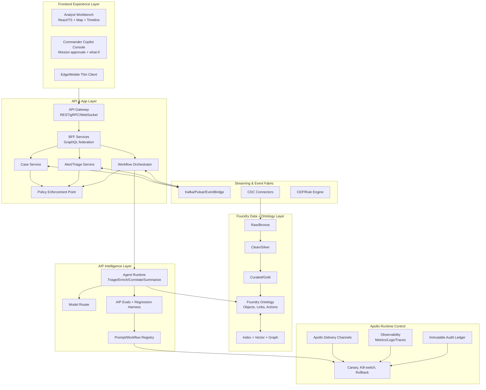

# ClearGlassInc Artemis — Self-Evolving AI Intelligence Platform Blueprint

## System Architecture

### 1) Mission Context and Platform Mapping
ClearGlassInc Artemis is designed as a **secure, coalition-aware, multi-domain intelligence platform** with machine-speed decision support and human-in-the-loop control.

- **Gotham**: operational investigation UI, case management, link analysis, entity tracking.
- **Foundry**: integration layer, ontology, pipelines, feature/materialization, application logic.
- **AIP**: copilots, agentic workflows, model orchestration, eval harnesses.
- **Apollo**: deployment control, policy rollout, staged release, rollback, runtime governance.

### 2) Logical Architecture (Layered)



### 3) Deployment Topology
- **Core region**: primary secure enclave (HA pair).
- **Forward edge nodes**: low-latency inference + cache + degraded mode.
- **Cross-domain guard**: controlled data movement between coalition compartments.
- **Offline-first mode**: queued action packages, eventual sync.

---

## Data and Ontology

### 1) Canonical Intelligence Ontology (Foundry)

#### Core entity classes
- `Person`, `Organization`, `Device`, `Asset`, `Location`, `Event`, `Indicator`, `Case`, `Mission`, `Task`, `Source`, `Report`, `ThreatActor`, `Vulnerability`, `Sensor`, `Observation`.

#### Core relationships
- `ASSOCIATED_WITH(Person, Organization)`
- `OWNS(Organization, Asset)`
- `OBSERVED_AT(Observation, Location)`
- `INDICATES(Indicator, ThreatActor)`
- `RELATES_TO(Event, Case)`
- `PART_OF(Task, Mission)`
- `SUPPORTED_BY(Case, Report)`
- `DERIVED_FROM(Observation, Source)`

#### Required metadata on every object/link
- `classification`: UNCLASSIFIED/CUI/SECRET/TS + caveats.
- `coalition_tags`: e.g., `USA`, `FVEY`, `NATO`.
- `confidence_score`: probabilistic confidence 0.0–1.0.
- `lineage_ref`: upstream dataset + transform version.
- `valid_time`: event time interval.
- `system_time`: ingest/update timestamps.
- `provenance_hash`: immutable content hash.

### 2) Temporal + Confidence Model
- **Bitemporal storage**: support “what was known then” vs “what is known now”.
- **Confidence fusion**:
  - Weighted Bayesian update over source reliability and corroboration count.
  - Decay factor for stale indicators.

### 3) Permissions model embedded in ontology
- Entity-level ACL + attribute-level masking.
- Purpose-of-use claims enforced at query time.
- Dynamic row filtering by mission assignment and coalition boundary.

### 4) Example ontology DDL sketch (conceptual)

```sql
CREATE TABLE ontology_event (
  event_id TEXT PRIMARY KEY,
  event_type TEXT,
  classification TEXT,
  coalition_tags TEXT[],
  confidence DOUBLE PRECISION,
  valid_from TIMESTAMP,
  valid_to TIMESTAMP,
  system_from TIMESTAMP,
  system_to TIMESTAMP,
  lineage_ref TEXT,
  provenance_hash TEXT,
  payload JSONB
);

CREATE TABLE ontology_link (
  link_id TEXT PRIMARY KEY,
  src_id TEXT,
  dst_id TEXT,
  rel_type TEXT,
  confidence DOUBLE PRECISION,
  classification TEXT,
  coalition_tags TEXT[],
  valid_from TIMESTAMP,
  valid_to TIMESTAMP,
  lineage_ref TEXT
);
```

---

## AI and Agent Design

### 1) Copilot tiers
- **Analyst Copilot**: hypothesis generation, entity disambiguation, timeline compression, evidence cards.
- **Commander Copilot**: mission impact forecast, COA comparison, risk-based recommendations.

### 2) Multi-agent pattern
- `TriageAgent` → `EnrichmentAgent` → `CorrelationAgent` → `SummarizationAgent` → `RecommendationAgent`.
- Supervisor agent coordinates retries, fallback models, and confidence thresholds.

### 3) Tool-use contract
Each agent can call tools with constrained schemas:
- `query_ontology` (parameterized query templates only).
- `open_case` (requires policy token + mission context).
- `draft_intel_brief` (retrieves evidence citations).
- `create_action_package` (always requires human approval before execution).

### 4) Operational approval gates
- **Gate A**: recommendation generation (autonomous allowed).
- **Gate B**: external action proposal (human approval mandatory).
- **Gate C**: cross-compartment dissemination (dual approval + policy check).

---

## Self-Improvement Loop

### 1) Signals captured continuously
- User edits to summaries.
- Acceptance/rejection of recommendations.
- Time-to-resolution, false positive flags, mission outcome quality.
- Retrieval misses, tool call failures, latency spikes.

### 2) Improvement pipeline
1. Log signals into `feedback_events` stream.
2. Convert to labeled eval examples (`good/bad`, expected reasoning steps).
3. Run nightly eval suite (AIP Evals): prompts/workflows/model routes.
4. Rank candidate changes with Pareto objective:
   - maximize precision/recall/trust,
   - minimize latency/cost/risk.
5. Propose change set in `ChangeProposal` object.
6. Human review board approves/rejects.
7. Apollo canary deploy to 5% users.
8. Auto-promote or rollback based on SLO + safety thresholds.

### 3) Drift and rollback controls
- Data drift: PSI/KL divergence on key features.
- Behavior drift: answer distribution and policy-violation trend.
- Immediate kill-switch when policy breach risk > threshold.
- One-click rollback in Apollo to previous signed bundle.

### 4) Versioning model
- `prompt_version`, `workflow_version`, `router_policy_version`, `model_version` all immutable and signed.
- Every response attaches version tuple + evidence list for audit.

---

## Full-Stack Implementation

### 1) Web UI (React/TypeScript)
- Mission dashboard: live event rail, threat matrix, map overlays.
- Case workspace: graph explorer, provenance pane, temporal scrubber.
- Copilot panel: recommendation + confidence + “why” evidence.
- Approval console: diff view for model/prompt/workflow upgrades.

### 2) API gateway and backend services
- Gateway: OAuth2 mTLS, JWT claims enrichment, request provenance ID.
- Services (Python/FastAPI):
  - `intel-query-service`
  - `case-command-service`
  - `agent-orchestrator-service`
  - `evals-service`
  - `policy-decision-service`

### 3) Streaming and storage
- Kafka topics:
  - `raw.ingest.*`, `intel.events`, `agent.actions`, `feedback.events`, `eval.results`.
- Lakehouse medallion pattern in Foundry pipelines.
- Search stack: hybrid BM25 + vector + graph traversal.

### 4) Model router
- Route by task + sensitivity + latency budget:
  - low-latency extractors at edge,
  - high-reasoning models for deep correlation,
  - deterministic rules for policy-critical transforms.

---

## Security and Governance

### 1) Need-to-know enforcement
- ABAC + RBAC + ReBAC hybrid.
- Policy-as-code (OPA/Rego-style) bound to ontology objects.
- Query-time redaction for unauthorized attributes.

### 2) Zero-trust runtime
- mTLS service mesh.
- SPIFFE identities for workload attestation.
- Signed artifacts + SLSA-style provenance chain.

### 3) Immutable audit and model governance
- Append-only audit ledger for:
  - source accessed,
  - prompts used,
  - model/version selected,
  - operator decisions,
  - outbound actions.
- Governance board workflow for high-impact model/prompt changes.

---

## Code Examples (Python-first, production-oriented)

### 1) Backend service skeleton (FastAPI)
```python
from fastapi import FastAPI, Depends, HTTPException
from pydantic import BaseModel
from typing import List, Dict, Any

app = FastAPI(title="ClearGlassInc Artemis API")

class QueryRequest(BaseModel):
    mission_id: str
    query_template: str
    params: Dict[str, Any]

class QueryResponse(BaseModel):
    data: List[Dict[str, Any]]
    provenance: Dict[str, Any]


def authorize(claims: Dict[str, Any], mission_id: str) -> None:
    if mission_id not in claims.get("missions", []):
        raise HTTPException(status_code=403, detail="Mission access denied")


@app.post("/ontology/query", response_model=QueryResponse)
def ontology_query(req: QueryRequest, claims: Dict[str, Any] = Depends(...)):
    authorize(claims, req.mission_id)
    # Execute only approved templates (no raw SQL from user).
    rows = execute_parameterized_template(req.query_template, req.params, claims)
    return QueryResponse(
        data=rows,
        provenance={
            "query_template": req.query_template,
            "policy_version": "policy.v42",
            "ontology_snapshot": "2026-05-18T00:00:00Z"
        }
    )
```

### 2) Event handler for triage pipeline
```python
from dataclasses import dataclass
from datetime import datetime

@dataclass
class IntelEvent:
    event_id: str
    source: str
    payload: dict
    classification: str


def handle_intel_event(evt: IntelEvent):
    triage = run_agent("TriageAgent", evt.payload)
    enrich = run_agent("EnrichmentAgent", {"triage": triage, "event": evt.payload})
    corr = run_agent("CorrelationAgent", {"enrich": enrich})

    recommendation = run_agent("RecommendationAgent", {
        "triage": triage,
        "correlation": corr,
        "mission_context": get_mission_context(evt)
    })

    emit("agent.actions", {
        "event_id": evt.event_id,
        "recommendation": recommendation,
        "timestamp": datetime.utcnow().isoformat()
    })
```

### 3) Policy check before operational action
```python

def enforce_operational_gate(action: dict, user: dict, mission: dict) -> dict:
    decision = policy_engine.evaluate(
        principal=user,
        action=action,
        resource=mission,
        context={"classification": action.get("classification")}
    )

    if not decision["allow"]:
        return {"status": "blocked", "reason": decision["reason"]}

    if action.get("impact_level") in {"HIGH", "CRITICAL"}:
        return {"status": "pending_human_approval", "approval_tier": "commander"}

    return {"status": "approved"}
```

### 4) Workflow state machine
```python
from enum import Enum

class CaseState(str, Enum):
    NEW = "NEW"
    TRIAGED = "TRIAGED"
    ENRICHED = "ENRICHED"
    RECOMMENDED = "RECOMMENDED"
    APPROVED = "APPROVED"
    EXECUTED = "EXECUTED"
    CLOSED = "CLOSED"

ALLOWED = {
    CaseState.NEW: {CaseState.TRIAGED},
    CaseState.TRIAGED: {CaseState.ENRICHED},
    CaseState.ENRICHED: {CaseState.RECOMMENDED},
    CaseState.RECOMMENDED: {CaseState.APPROVED, CaseState.CLOSED},
    CaseState.APPROVED: {CaseState.EXECUTED},
    CaseState.EXECUTED: {CaseState.CLOSED},
}


def transition(current: CaseState, nxt: CaseState):
    if nxt not in ALLOWED.get(current, set()):
        raise ValueError(f"Invalid transition {current} -> {nxt}")
    return nxt
```

### 5) Eval pipeline for prompt/workflow upgrades
```python

def evaluate_candidate(candidate_id: str, baseline_id: str, eval_set: list[dict]) -> dict:
    cand_metrics = run_eval_suite(candidate_id, eval_set)
    base_metrics = run_eval_suite(baseline_id, eval_set)

    delta = {
        "precision": cand_metrics["precision"] - base_metrics["precision"],
        "recall": cand_metrics["recall"] - base_metrics["recall"],
        "latency_ms": cand_metrics["latency_ms"] - base_metrics["latency_ms"],
        "policy_violations": cand_metrics["policy_violations"] - base_metrics["policy_violations"],
    }

    safe = delta["policy_violations"] <= 0 and delta["precision"] >= 0
    return {"candidate_id": candidate_id, "delta": delta, "safe": safe}
```

### 6) Router policy example
```python
ROUTER_POLICY = {
    "entity_resolution": {"model": "small-low-latency", "max_latency_ms": 250},
    "mission_summary": {"model": "large-reasoning", "max_latency_ms": 2500},
    "operational_recommendation": {
        "model": "large-reasoning-guarded",
        "requires_evidence": True,
        "requires_policy_check": True
    }
}
```

---

## Scenario Walkthrough (Cinematic + Technical)

1. **Live event ingress**: NVD publishes a critical CVE; GDELT shows geopolitical pressure; ADS-B indicates unusual flight pattern in relevant corridor; event bundle lands in `raw.ingest.*`.
2. **Fusion + triage**: Foundry pipelines normalize and map to ontology; `TriageAgent` scores risk as HIGH due to correlated indicators and mission proximity.
3. **Agent recommendation**: `RecommendationAgent` suggests “initiate focused monitoring + pre-stage incident response package,” with evidence chain and confidence 0.86.
4. **Human gate**: Commander sees recommendation in Gotham-style operations view, requests one additional source validation, then approves staged response (not full execution).
5. **Execution**: System opens case, assigns tasks, generates brief, and dispatches approved notifications to authorized coalition channels.
6. **Outcome capture**: 4 hours later, operator marks action as “effective, low false positive.”
7. **Learning loop**:
   - Feedback converted into labeled eval.
   - Candidate prompt update improves similar-case precision by +4.2% in AIP Evals.
   - Change board approves.
   - Apollo canary to 5% analyst cohort; no policy regressions.
   - Auto-promote to 100%; old version retained for rollback.

---

## Open-source live data mapping (for Artemis IV feed realism)
- **NVD CVE API**: vulnerability intelligence.
- **CISA KEV catalog**: known exploited vulns prioritization.
- **GDELT 2.0**: global event signals.
- **USGS earthquake feeds**: physical-domain disruption context.
- **ADS-B Exchange/OpenSky (subject to licensing/terms)**: aviation movement signals.
- **NOAA weather alerts**: environmental mission context.

> Note: “use all datasets” is operationally interpreted as “connect all approved datasets in your data catalog.” In production, enforce legal/mission constraints and data minimization by policy.
