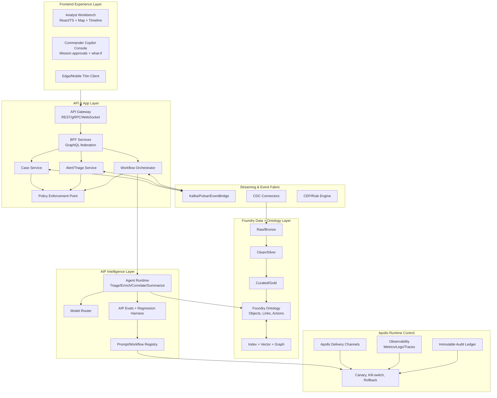
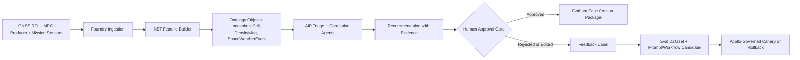

# ClearGlassInc Artemis — Self-Evolving AI Intelligence Platform Blueprint

## System Architecture

### 1) Mission Context and Platform Mapping
ClearGlassInc Artemis is designed as a **secure, coalition-aware, multi-domain intelligence platform** with machine-speed decision support and human-in-the-loop control.

#### Purpose and Research
ClearGlassInc Artemis advances understanding of **ionospheric physics, space weather, radio wave propagation, and the operational effects of the ionosphere on communication, radar, and navigation systems**. The platform treats the ionosphere as a mission-relevant, dynamic environment that can alter signal quality, sensor reliability, timing accuracy, and the confidence of downstream intelligence products.

The research mission covers both natural processes, such as solar-driven disturbances and geomagnetic activity, and small-scale artificial effects that can be studied under controlled governance. Artemis supports reproducible analysis by fusing live observations, historical archives, model outputs, operator feedback, and provenance-rich experiment records into a governed ontology.

The platform is designed to be open to approved international researchers, with coalition-aware access controls, compartmented datasets, and audit-ready collaboration workflows. It can also support open houses, demonstrations, and educational events through sanitized views, curated scenarios, explainable visualizations, and non-sensitive training datasets.

- **Gotham**: operational investigation UI, case management, link analysis, entity tracking.
- **Foundry**: integration layer, ontology, pipelines, feature/materialization, application logic.
- **AIP**: copilots, agentic workflows, model orchestration, eval harnesses.
- **Apollo**: deployment control, policy rollout, staged release, rollback, runtime governance.

### 2) Logical Architecture (Layered)



### 3) Deployment Topology
- **Core region**: primary secure enclave (HA pair).
- **Forward edge nodes**: low-latency inference + cache + degraded mode.
- **Cross-domain guard**: controlled data movement between coalition compartments.
- **Offline-first mode**: queued action packages, eventual sync.

---

## Data and Ontology

### 1) Canonical Intelligence Ontology (Foundry)

#### Core entity classes
- `Person`, `Organization`, `Device`, `Asset`, `Location`, `Event`, `Indicator`, `Case`, `Mission`, `Task`, `Source`, `Report`, `ThreatActor`, `Vulnerability`, `Sensor`, `Observation`.

#### Core relationships
- `ASSOCIATED_WITH(Person, Organization)`
- `OWNS(Organization, Asset)`
- `OBSERVED_AT(Observation, Location)`
- `INDICATES(Indicator, ThreatActor)`
- `RELATES_TO(Event, Case)`
- `PART_OF(Task, Mission)`
- `SUPPORTED_BY(Case, Report)`
- `DERIVED_FROM(Observation, Source)`

#### Required metadata on every object/link
- `classification`: UNCLASSIFIED/CUI/SECRET/TS + caveats.
- `coalition_tags`: e.g., `USA`, `FVEY`, `NATO`.
- `confidence_score`: probabilistic confidence 0.0–1.0.
- `lineage_ref`: upstream dataset + transform version.
- `valid_time`: event time interval.
- `system_time`: ingest/update timestamps.
- `provenance_hash`: immutable content hash.

### 2) Temporal + Confidence Model
- **Bitemporal storage**: support “what was known then” vs “what is known now”.
- **Confidence fusion**:
  - Weighted Bayesian update over source reliability and corroboration count.
  - Decay factor for stale indicators.

### 3) Permissions model embedded in ontology
- Entity-level ACL + attribute-level masking.
- Purpose-of-use claims enforced at query time.
- Dynamic row filtering by mission assignment and coalition boundary.

### 4) Example ontology DDL sketch (conceptual)

```sql
CREATE TABLE ontology_event (
  event_id TEXT PRIMARY KEY,
  event_type TEXT,
  classification TEXT,
  coalition_tags TEXT[],
  confidence DOUBLE PRECISION,
  valid_from TIMESTAMP,
  valid_to TIMESTAMP,
  system_from TIMESTAMP,
  system_to TIMESTAMP,
  lineage_ref TEXT,
  provenance_hash TEXT,
  payload JSONB
);

CREATE TABLE ontology_link (
  link_id TEXT PRIMARY KEY,
  src_id TEXT,
  dst_id TEXT,
  rel_type TEXT,
  confidence DOUBLE PRECISION,
  classification TEXT,
  coalition_tags TEXT[],
  valid_from TIMESTAMP,
  valid_to TIMESTAMP,
  lineage_ref TEXT
);
```

---

## AI and Agent Design

### 1) Copilot tiers
- **Analyst Copilot**: hypothesis generation, entity disambiguation, timeline compression, evidence cards.
- **Commander Copilot**: mission impact forecast, COA comparison, risk-based recommendations.

### 2) Multi-agent pattern
- `TriageAgent` → `EnrichmentAgent` → `CorrelationAgent` → `SummarizationAgent` → `RecommendationAgent`.
- Supervisor agent coordinates retries, fallback models, and confidence thresholds.

### 3) Tool-use contract
Each agent can call tools with constrained schemas:
- `query_ontology` (parameterized query templates only).
- `open_case` (requires policy token + mission context).
- `draft_intel_brief` (retrieves evidence citations).
- `create_action_package` (always requires human approval before execution).

### 4) Operational approval gates
- **Gate A**: recommendation generation (autonomous allowed).
- **Gate B**: external action proposal (human approval mandatory).
- **Gate C**: cross-compartment dissemination (dual approval + policy check).

---

## Self-Improvement Loop

### 1) Signals captured continuously
- User edits to summaries.
- Acceptance/rejection of recommendations.
- Time-to-resolution, false positive flags, mission outcome quality.
- Retrieval misses, tool call failures, latency spikes.

### 2) Improvement pipeline
1. Log signals into `feedback_events` stream.
2. Convert to labeled eval examples (`good/bad`, expected reasoning steps).
3. Run nightly eval suite (AIP Evals): prompts/workflows/model routes.
4. Rank candidate changes with Pareto objective:
   - maximize precision/recall/trust,
   - minimize latency/cost/risk.
5. Propose change set in `ChangeProposal` object.
6. Human review board approves/rejects.
7. Apollo canary deploy to 5% users.
8. Auto-promote or rollback based on SLO + safety thresholds.

### 3) Drift and rollback controls
- Data drift: PSI/KL divergence on key features.
- Behavior drift: answer distribution and policy-violation trend.
- Immediate kill-switch when policy breach risk > threshold.
- One-click rollback in Apollo to previous signed bundle.

### 4) Versioning model
- `prompt_version`, `workflow_version`, `router_policy_version`, `model_version` all immutable and signed.
- Every response attaches version tuple + evidence list for audit.

---

---

## Global NET Model: Ionosphere F2 Layer Peak Electron Density

### What is the NET Model?
The **NET (Neural network-based model of Electron density in the Topside ionosphere)** is a neural-network model for reconstructing topside ionospheric electron density from long-duration GNSS radio occultation observations. In the ClearGlassInc Artemis architecture, NET is treated as a mission-grade environmental intelligence model: it enriches signal-propagation, GNSS reliability, HF communications, over-the-horizon radar, and remote-sensing workflows with time-aware F2-layer electron density context.

**Primary scientific basis:** the NET model was developed from **19 years of GNSS radio occultation data** and is documented in *Scientific Reports* by Nature Portfolio: <https://www.nature.com/articles/s41598-023-28034-z>.

### Key Characteristics of the Global NET Model

| Feature | Description |
|---------|-------------|
| **Coverage** | Global maps of F2-layer peak electron density, suitable for mission-scale ionospheric awareness and correlation with operational events. |
| **Altitude focus** | Topside ionosphere above the F2-layer peak, especially the 100-200 km region above the peak where the model shows strong performance. |
| **Data source** | 19 years of GNSS radio occultation observations from CHAMP, GRACE, and COSMIC satellite missions. |
| **Operational product fit** | Electron-density maps can be consumed alongside DLR IMPC products for ionospheric perturbation monitoring: <https://impc.dlr.de/products/ionospheric-perturbations/electron-density>. |
| **Visualization** | Northern and Southern Hemisphere views at selected Universal Time slices, including **00:00 UT** mission baselines. |
| **Color scale** | Mission UI renders `log10(N_F2)` values from **5.0 to 6.2** using a blue-green-yellow-red ramp for low-to-peak density. |

### Why NET Outperforms Traditional Models

The NET model is important to ClearGlassInc Artemis because it provides a data-driven complement to classical climatological ionosphere models.

- **Superior reconstruction accuracy:** published results report that NET can outperform the International Reference Ionosphere (IRI) model by up to **one order of magnitude** in selected topside regions.
- **Best operational fit:** the highest value for Artemis is the region **100-200 km above the F2-layer peak**, where density structure affects radio propagation and model-driven correction logic.
- **Paradigm shift:** neural reconstruction captures complex nonlinear effects from solar activity, geomagnetic forcing, local time, season, and geographic structure without requiring every physical driver to be explicitly hand-modeled.

### Visual Description: Global NET Model at 00:00 UT

**Northern Hemisphere**
- Color-coded F2 peak electron density in `log10(N_F2)` units.
- Values range from **5.0** in blue to **6.2** in red.
- Higher-density structures can be correlated with auroral-region activity, geomagnetic conditions, and signal-quality degradation.

**Southern Hemisphere**
- Hemispheric asymmetry is preserved rather than averaged away.
- Values use the same **5.0-6.2** range to keep analyst comparison consistent.
- South Atlantic anomaly context can be layered as an additional mission overlay.

**Color scale**
- Blue: `5.0` low density.
- Green: `5.6` moderate density.
- Yellow: `5.9` high density.
- Red: `6.2` peak density.

### Scientific and Operational Applications

| Application | Impact in ClearGlassInc Artemis |
|-------------|----------------------------------|
| **GNSS signal propagation** | Improves correction of ionospheric delay, phase disturbance, and reliability degradation in positioning workflows. |
| **Space weather monitoring** | Maps electron-density changes during geomagnetic storms and links them to mission alerts. |
| **HF radio communication** | Supports frequency planning by estimating propagation viability and absorption risk. |
| **Over-the-horizon radar (OTHR)** | Improves interpretation of radar anomalies caused by changing ionospheric layers and D-region absorption. |
| **Remote sensing** | Adds ionospheric context to satellite measurement quality, anomaly triage, and downstream correction. |

### Critical Importance for Modern Systems

NET-derived ionospheric awareness helps Artemis mitigate space-weather impacts on:

1. **Communication systems**
   - HF radio propagation over thousands of kilometers through ground-ionosphere reflection.
   - Telecommunication signal amplitude, phase, and polarization effects caused by ionospheric plasma.
2. **Navigation systems**
   - GNSS/GPS positioning errors from horizontal electron-density gradients.
   - Accuracy degradation from plasma dynamics, scintillation, and fast-changing total electron content.
3. **Radar systems**
   - OTHR surveillance uncertainty when enhanced D-region electron density increases HF absorption.
   - Reduced usable frequency range during disturbed space-weather conditions.
4. **Remote sensing systems**
   - Need for ionospheric correction in satellite measurements.
   - Interference patterns during solar radio bursts and geomagnetic disturbances.

### How Artemis Uses NET Safely

ClearGlassInc Artemis does **not** allow NET or any AI model to autonomously change mission objectives. NET is used as an evidence-producing model inside a human-governed workflow:



### NET Ontology Extension

```yaml
objects:
  IonosphereCell:
    key: cell_id
    attrs:
      - geohash
      - hemisphere
      - altitude_band_km
      - local_time
      - universal_time
      - log10_nf2
      - density_confidence
      - geomagnetic_context
      - valid_time
      - classification
      - coalition_tags

  DensityMap:
    key: density_map_id
    attrs:
      - model_name        # NET, IRI, NEDM-v1, ensemble
      - model_version
      - generated_at
      - ut_slice
      - color_scale_min
      - color_scale_max
      - source_lineage
      - qa_status

  SpaceWeatherEvent:
    key: space_weather_event_id
    attrs:
      - event_type        # storm, scintillation, absorption, anomaly
      - severity
      - confidence
      - first_seen
      - last_seen
      - affected_regions
      - operational_effects

links:
  - CELL_IN_MAP(IonosphereCell -> DensityMap)
  - PERTURBS(SpaceWeatherEvent -> IonosphereCell)
  - AFFECTS_SIGNAL(IonosphereCell -> Signal)
  - EXPLAINS_ANOMALY(SpaceWeatherEvent -> Event)
  - SUPPORTS_RECOMMENDATION(DensityMap -> Recommendation)
```

### Python Implementation Skeleton: NET Feature Ingestion and Mission Scoring

```python
from __future__ import annotations

from dataclasses import dataclass
from datetime import datetime, timezone
from enum import StrEnum
from math import exp
from typing import Iterable


class Hemisphere(StrEnum):
    NORTH = "north"
    SOUTH = "south"


@dataclass(frozen=True)
class NetCell:
    cell_id: str
    geohash: str
    hemisphere: Hemisphere
    altitude_band_km: tuple[int, int]
    universal_time: datetime
    log10_nf2: float
    confidence: float
    source_lineage: str


@dataclass(frozen=True)
class MissionAsset:
    asset_id: str
    geohash: str
    dependency: str  # gnss, hf_radio, othr, remote_sensing
    criticality: float


def normalize_density(log10_nf2: float, lo: float = 5.0, hi: float = 6.2) -> float:
    """Map the NET UI color-scale range to [0, 1] for scoring."""
    return max(0.0, min(1.0, (log10_nf2 - lo) / (hi - lo)))


def propagation_risk(cell: NetCell, asset: MissionAsset) -> float:
    """Precision-oriented mission risk score used by Artemis triage agents."""
    density = normalize_density(cell.log10_nf2)
    dependency_weight = {
        "gnss": 0.92,
        "hf_radio": 0.86,
        "othr": 0.89,
        "remote_sensing": 0.72,
    }.get(asset.dependency, 0.50)
    nonlinear = 1.0 / (1.0 + exp(-8.0 * (density - 0.58)))
    return round(nonlinear * dependency_weight * asset.criticality * cell.confidence, 4)


def score_assets(cells: Iterable[NetCell], assets: Iterable[MissionAsset]) -> list[dict]:
    cells_by_geohash = {cell.geohash: cell for cell in cells}
    scored: list[dict] = []
    for asset in assets:
        cell = cells_by_geohash.get(asset.geohash)
        if not cell:
            continue
        risk = propagation_risk(cell, asset)
        scored.append({
            "asset_id": asset.asset_id,
            "dependency": asset.dependency,
            "cell_id": cell.cell_id,
            "log10_nf2": cell.log10_nf2,
            "risk": risk,
            "requires_operator_review": risk >= 0.72,
            "scored_at": datetime.now(timezone.utc).isoformat(),
        })
    return sorted(scored, key=lambda row: row["risk"], reverse=True)
```

### AIP Tool Contract for NET-Aware Recommendations

```python
from pydantic import BaseModel, Field
from typing import Literal


class NetDensityQuery(BaseModel):
    mission_id: str
    ut_slice: str = Field(description="ISO-8601 Universal Time slice, for example 2026-06-29T00:00:00Z")
    hemisphere: Literal["north", "south", "both"] = "both"
    min_log10_nf2: float = 5.0
    max_log10_nf2: float = 6.2
    dependencies: list[Literal["gnss", "hf_radio", "othr", "remote_sensing"]]


class NetRecommendation(BaseModel):
    mission_id: str
    summary: str
    affected_assets: list[str]
    recommended_actions: list[str]
    evidence_density_maps: list[str]
    confidence: float
    approval_required: bool = True
```

### Governance Rules for NET-Driven Automation

- NET can **rank**, **explain**, and **recommend**; it cannot independently issue operational commands.
- Any recommendation affecting communications, navigation, radar tasking, collection posture, or coalition data sharing requires explicit human approval.
- Prompt, workflow, and model-router updates derived from NET outcomes must pass offline evals, bias/coverage checks, red-team review, and Apollo canary deployment before promotion.
- Every density-derived recommendation stores model version, data lineage, UT slice, feature hash, prompt version, policy decision, operator decision, and rollback pointer.

### Scenario: NET-Aware Space Weather Triage

1. A 00:00 UT density map enters Foundry from a governed NET pipeline.
2. Artemis materializes `IonosphereCell` objects and links high-density cells to mission assets dependent on GNSS and HF radio.
3. An AIP triage agent detects elevated `log10(N_F2)` near a mission corridor and produces an evidence-backed recommendation: shift HF frequency planning and increase GNSS integrity monitoring.
4. The compliance agent checks classification, coalition tags, and mission authority before presenting the recommendation in Gotham.
5. The operator approves the GNSS monitoring increase but edits the HF recommendation after local context shows a planned maintenance window.
6. The edit becomes a labeled feedback event. The eval pipeline converts it into a regression case so future NET recommendations learn to consider scheduled communications maintenance before recommending frequency changes.
7. Apollo deploys the updated prompt/workflow as a canary; if precision, latency, or operator-trust metrics regress, the system rolls back automatically.

## Full-Stack Implementation

### 1) Web UI (React/TypeScript)
- Mission dashboard: live event rail, threat matrix, map overlays.
- Case workspace: graph explorer, provenance pane, temporal scrubber.
- Copilot panel: recommendation + confidence + “why” evidence.
- Approval console: diff view for model/prompt/workflow upgrades.

### 2) API gateway and backend services
- Gateway: OAuth2 mTLS, JWT claims enrichment, request provenance ID.
- Services (Python/FastAPI):
  - `intel-query-service`
  - `case-command-service`
  - `agent-orchestrator-service`
  - `evals-service`
  - `policy-decision-service`

### 3) Streaming and storage
- Kafka topics:
  - `raw.ingest.*`, `intel.events`, `agent.actions`, `feedback.events`, `eval.results`.
- Lakehouse medallion pattern in Foundry pipelines.
- Search stack: hybrid BM25 + vector + graph traversal.

### 4) Model router
- Route by task + sensitivity + latency budget:
  - low-latency extractors at edge,
  - high-reasoning models for deep correlation,
  - deterministic rules for policy-critical transforms.

---

## Security and Governance

### 1) Need-to-know enforcement
- ABAC + RBAC + ReBAC hybrid.
- Policy-as-code (OPA/Rego-style) bound to ontology objects.
- Query-time redaction for unauthorized attributes.

### 2) Zero-trust runtime
- mTLS service mesh.
- SPIFFE identities for workload attestation.
- Signed artifacts + SLSA-style provenance chain.

### 3) Immutable audit and model governance
- Append-only audit ledger for:
  - source accessed,
  - prompts used,
  - model/version selected,
  - operator decisions,
  - outbound actions.
- Governance board workflow for high-impact model/prompt changes.

---

## Code Examples (Python-first, production-oriented)

### 1) Backend service skeleton (FastAPI)
```python
from fastapi import FastAPI, Depends, HTTPException
from pydantic import BaseModel
from typing import List, Dict, Any

app = FastAPI(title="ClearGlassInc Artemis API")

class QueryRequest(BaseModel):
    mission_id: str
    query_template: str
    params: Dict[str, Any]

class QueryResponse(BaseModel):
    data: List[Dict[str, Any]]
    provenance: Dict[str, Any]


def authorize(claims: Dict[str, Any], mission_id: str) -> None:
    if mission_id not in claims.get("missions", []):
        raise HTTPException(status_code=403, detail="Mission access denied")


@app.post("/ontology/query", response_model=QueryResponse)
def ontology_query(req: QueryRequest, claims: Dict[str, Any] = Depends(...)):
    authorize(claims, req.mission_id)
    # Execute only approved templates (no raw SQL from user).
    rows = execute_parameterized_template(req.query_template, req.params, claims)
    return QueryResponse(
        data=rows,
        provenance={
            "query_template": req.query_template,
            "policy_version": "policy.v42",
            "ontology_snapshot": "2026-05-18T00:00:00Z"
        }
    )
```

### 2) Event handler for triage pipeline
```python
from dataclasses import dataclass
from datetime import datetime

@dataclass
class IntelEvent:
    event_id: str
    source: str
    payload: dict
    classification: str


def handle_intel_event(evt: IntelEvent):
    triage = run_agent("TriageAgent", evt.payload)
    enrich = run_agent("EnrichmentAgent", {"triage": triage, "event": evt.payload})
    corr = run_agent("CorrelationAgent", {"enrich": enrich})

    recommendation = run_agent("RecommendationAgent", {
        "triage": triage,
        "correlation": corr,
        "mission_context": get_mission_context(evt)
    })

    emit("agent.actions", {
        "event_id": evt.event_id,
        "recommendation": recommendation,
        "timestamp": datetime.utcnow().isoformat()
    })
```

### 3) Policy check before operational action
```python

def enforce_operational_gate(action: dict, user: dict, mission: dict) -> dict:
    decision = policy_engine.evaluate(
        principal=user,
        action=action,
        resource=mission,
        context={"classification": action.get("classification")}
    )

    if not decision["allow"]:
        return {"status": "blocked", "reason": decision["reason"]}

    if action.get("impact_level") in {"HIGH", "CRITICAL"}:
        return {"status": "pending_human_approval", "approval_tier": "commander"}

    return {"status": "approved"}
```

### 4) Workflow state machine
```python
from enum import Enum

class CaseState(str, Enum):
    NEW = "NEW"
    TRIAGED = "TRIAGED"
    ENRICHED = "ENRICHED"
    RECOMMENDED = "RECOMMENDED"
    APPROVED = "APPROVED"
    EXECUTED = "EXECUTED"
    CLOSED = "CLOSED"

ALLOWED = {
    CaseState.NEW: {CaseState.TRIAGED},
    CaseState.TRIAGED: {CaseState.ENRICHED},
    CaseState.ENRICHED: {CaseState.RECOMMENDED},
    CaseState.RECOMMENDED: {CaseState.APPROVED, CaseState.CLOSED},
    CaseState.APPROVED: {CaseState.EXECUTED},
    CaseState.EXECUTED: {CaseState.CLOSED},
}


def transition(current: CaseState, nxt: CaseState):
    if nxt not in ALLOWED.get(current, set()):
        raise ValueError(f"Invalid transition {current} -> {nxt}")
    return nxt
```

### 5) Eval pipeline for prompt/workflow upgrades
```python

def evaluate_candidate(candidate_id: str, baseline_id: str, eval_set: list[dict]) -> dict:
    cand_metrics = run_eval_suite(candidate_id, eval_set)
    base_metrics = run_eval_suite(baseline_id, eval_set)

    delta = {
        "precision": cand_metrics["precision"] - base_metrics["precision"],
        "recall": cand_metrics["recall"] - base_metrics["recall"],
        "latency_ms": cand_metrics["latency_ms"] - base_metrics["latency_ms"],
        "policy_violations": cand_metrics["policy_violations"] - base_metrics["policy_violations"],
    }

    safe = delta["policy_violations"] <= 0 and delta["precision"] >= 0
    return {"candidate_id": candidate_id, "delta": delta, "safe": safe}
```

### 6) Router policy example
```python
ROUTER_POLICY = {
    "entity_resolution": {"model": "small-low-latency", "max_latency_ms": 250},
    "mission_summary": {"model": "large-reasoning", "max_latency_ms": 2500},
    "operational_recommendation": {
        "model": "large-reasoning-guarded",
        "requires_evidence": True,
        "requires_policy_check": True
    }
}
```

---

## Scenario Walkthrough (Cinematic + Technical)

1. **Live event ingress**: NVD publishes a critical CVE; GDELT shows geopolitical pressure; ADS-B indicates unusual flight pattern in relevant corridor; event bundle lands in `raw.ingest.*`.
2. **Fusion + triage**: Foundry pipelines normalize and map to ontology; `TriageAgent` scores risk as HIGH due to correlated indicators and mission proximity.
3. **Agent recommendation**: `RecommendationAgent` suggests “initiate focused monitoring + pre-stage incident response package,” with evidence chain and confidence 0.86.
4. **Human gate**: Commander sees recommendation in Gotham-style operations view, requests one additional source validation, then approves staged response (not full execution).
5. **Execution**: System opens case, assigns tasks, generates brief, and dispatches approved notifications to authorized coalition channels.
6. **Outcome capture**: 4 hours later, operator marks action as “effective, low false positive.”
7. **Learning loop**:
   - Feedback converted into labeled eval.
   - Candidate prompt update improves similar-case precision by +4.2% in AIP Evals.
   - Change board approves.
   - Apollo canary to 5% analyst cohort; no policy regressions.
   - Auto-promote to 100%; old version retained for rollback.

---

## Open-source live data mapping (for Artemis IV feed realism)
- **NVD CVE API**: vulnerability intelligence.
- **CISA KEV catalog**: known exploited vulns prioritization.
- **GDELT 2.0**: global event signals.
- **USGS earthquake feeds**: physical-domain disruption context.
- **ADS-B Exchange/OpenSky (subject to licensing/terms)**: aviation movement signals.
- **NOAA weather alerts**: environmental mission context.

> Note: “use all datasets” is operationally interpreted as “connect all approved datasets in your data catalog.” In production, enforce legal/mission constraints and data minimization by policy.
