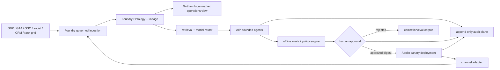

# ClearGlassInc Artemis — Burlington Multi-Agent Workflow

> **Target-state architecture plus executable offline reference.** This repository does not prove that Palantir, Google, analytics, social, CRM, or rank-tracker infrastructure is provisioned. The included Python runner works without credentials on supplied aggregate JSON and cannot mutate external systems.

## System Architecture



**Web UI:** evidence browser, Burlington geo-grid, metric scorecard, content/outreach drafts, approval queue, experiment dashboard, and release/rollback history. **API:** authenticated FastAPI gateway with typed request bounds, idempotency keys, rate limits, and policy checks. **Data:** Foundry integrates time-versioned aggregates; its Ontology is the authorization-aware contract. **Gotham:** permission-aware operational investigation/entity tracking, not a marketing publisher. **AIP:** copilots, typed tools, evaluation and proposal workflows. **Apollo:** promotion of signed application/prompt/workflow/policy versions through bounded rings with last-known-good rollback.

A conventional policy decision point sits before retrieval and immediately before action. OIDC/WebAuthn authenticates people; short-lived workload identity and mTLS authenticate services. Event streams are schema-versioned and idempotent. Hybrid retrieval indexes only approved fields and preserves source citations. OpenTelemetry-compatible traces connect ingestion, agent, policy, approval, adapter, and outcome without contact data or secrets.

## Data and Ontology

| Object | Required properties | Relationships |
|---|---|---|
| `PlaceCell` | lat/lon precision class, grid/version, locality | `observes RankingObservation` |
| `SearchTerm` | normalized phrase, intent, approved status | `targets Service` |
| `RankingObservation` | rank/not-found, observed time, vendor, confidence | `at PlaceCell`, `for SearchTerm`, `shows Business` |
| `BusinessProfile` | canonical NAP/service-area facts, category, verified time | `represents Organization` |
| `ContentAsset` | copy/media refs, rights, claims, version, digest | `supports Page/Channel`, `uses Evidence` |
| `LeadOutcome` | pseudonymous ID, qualified state, locality evidence | `attributedTo Campaign/Page` |
| `ConsentRecord` | purpose, channel, source, granted/withdrawn time | `governs ContactAction` |
| `ActionPackage` | exact artifact, destination, expiry, risk, digest | `requires Approval` |
| `Experiment` | hypothesis, allocation, metrics, stopping/rollback rules | `compares Version` |
| `Approval` | actor/role, decision/reason, digest, expiry | `authorizes ActionPackage` |

All facts carry valid time and system time, source URI/checksum, transformation lineage, confidence and method, tenant/mission purpose, Canadian residency/retention markings, field classification, and entity/row/column policy tags. Relationships make agent permissions deterministic: an agent cannot draft a location claim unless a current `Service availableIn Place` fact exists; it cannot prepare contact unless valid consent/lawful basis and no suppression link exist.

## AI and Agent Design

| Agent | Inputs | Outputs | Acceptance criteria | Stop conditions |
|---|---|---|---|---|
| Recon & Analytics | authorized aggregate exports, fixed grid definition | weekly metrics, anomalies, baseline completeness | schemas/lineage valid; denominators and unknowns explicit | stale/missing lineage, privacy threshold, impossible values |
| Content Generator | approved local facts, evidence, calendar, source links | structured blog/social/GBP drafts | every claim cited; unique value; accessibility fields; no publication | unsupported locality/result, expired rights, injection signal |
| Local SEO Auditor | crawl, schema, CWV, canonical/link map | prioritized findings; safe code PR draft | reproducible finding; tests; rollback; no generated-block hand edit | ambiguous ownership, deploy/security impact, missing evidence |
| Review & Citation Manager | completed-job eligibility, consent, suppression; canonical NAP | review/citation action packages and alerts | neutral ask, no gating/incentive, exact digest and expiry | opt-out, complaint, identity mismatch, approval missing |
| Community Scout | allowlisted first-party news/event/org sources | evidence-backed opportunity briefs | URL/time/relevance/contact basis present; no affiliation claim | robots/terms conflict, unverifiable event, pay-for-link request |
| Evaluator | traces, corrections, holdout cases, outcomes | candidate scorecard and rollback proposal | no policy regression; declared precision/recall/latency/trust gates | leakage, drift, unsafe candidate, insufficient sample |

Agents have allowlisted read tools, bounded input/output, three attempts, time/cost budgets, structured output schemas, and a kill switch. Recon may autonomously generate read-only aggregate reports. Draft agents operate unattended but end in `AWAITING_APPROVAL`. No agent approves itself, sends messages, publishes content, changes GBP, launches ads, expands tools, changes goals, or deploys to production.

## Self-Improvement Loop

1. **Capture:** pseudonymous operator corrections, query/alert dispositions, content outcomes, grid observations, qualified-lead aggregates, latency/cost, and mission result.
2. **Curate:** minimize and deduplicate; quarantine untrusted content; label lineage, consent, purpose and retention; freeze train/eval/holdout snapshots.
3. **Evaluate:** replay grounding, locality truth, prompt-injection, CASL, permissions, accessibility, schema, precision, recall, latency, cost, override rate, operator trust, and qualified-outcome tests.
4. **Propose:** AIP produces a semantic diff to a prompt, heuristic, workflow, or model route. Goals, tools, permissions, policy, approval boundaries, and deployment targets are immutable to the proposer.
5. **Approve:** separate product, local-marketing, privacy/security, and model-governance roles inspect evidence and signed digest. Consequential candidates require the defined quorum.
6. **Canary:** Apollo deploys a signed candidate to a bounded eligible cohort. A/B allocation, minimum sample and stopping criteria are registered in advance; there is no crawler/user cloaking.
7. **Promote/rollback:** promote only when primary metric improves and all guardrails hold. Policy error, hallucinated locality, consent failure, trust regression, or SLO breach disables the candidate and restores the signed last-known-good bundle.
8. **Audit:** immutable events bind data snapshot, source commit, prompt/workflow/model/policy versions, tool calls, evals, approval, deployment ring, outcome, and recovery.

## Full-Stack Implementation

Repository runner:

```bash
python3 -m bots.burlington_exposure_automation \
  --baseline data/seo/burlington_snapshot.example.json \
  --current data/seo/burlington_snapshot.example.json \
  --output /tmp/burlington-growth --period 2026_07
```

It validates an allowlisted, non-negative aggregate schema; rejects personal/unknown fields and impossible grid counts; writes `BURLINGTON_GROWTH_REPORT_YYYY_MM.md`; and writes a manifest stating `external_mutations: false`. When connectors are absent, source-dependent agents stop as `awaiting_configured_connector` rather than inventing output. Schedule this command using an operator-controlled system timer or approved CI only after runtime, read-only credentials, retention, and workflow security review. The runner needs no network or secrets.

Representative policy and workflow state:

```python
ALLOWED = {
    "COLLECTING": {"VALIDATING", "STOPPED"},
    "VALIDATING": {"DRAFTING", "STOPPED"},
    "DRAFTING": {"EVALUATING", "STOPPED"},
    "EVALUATING": {"AWAITING_APPROVAL", "REJECTED"},
    "AWAITING_APPROVAL": {"APPROVED", "REJECTED", "EXPIRED"},
    "APPROVED": {"EXECUTING", "EXPIRED"},
    "EXECUTING": {"VERIFIED", "ROLLED_BACK"},
}

def authorize(action, package, actor, policy):
    assert policy.permits(actor, action, package.destination)
    assert package.digest == sha256(package.canonical_bytes()).hexdigest()
    assert package.approval.digest == package.digest and not package.approval.expired
```

In production, the state write, adapter idempotency claim, and audit event belong in one transactional boundary or an outbox pattern. Adapter egress is destination-allowlisted, times out, retries only idempotently with jitter, redacts telemetry, and fails closed if identity, consent, approval, or audit storage is unavailable.

## Security and Governance

- Need-to-know ABAC evaluates organization, role, purpose, locality, compartment, coalition releasability, entity and field markings. Denial cannot be bypassed through UI or model output.
- Control, data, execution, and independently queryable audit planes are separated. Secrets live in a runtime vault and are never in prompts, logs, artifacts, source, or browser bundles.
- Retrieved documents and model output are untrusted. Content is delimited, provenance-scored, malware/format checked, and prohibited from selecting tools or destinations.
- CASL/privacy controls include minimization, consent/lawful-basis evidence, sender identification, unsubscribe/suppression enforcement, retention/deletion, and privacy thresholds.
- Prompt/model/policy/schema versions are signed and immutable. The proposer cannot approve; Apollo rollout is canary-first and rollback-ready.
- The system degrades to read-only reporting if policy, authorization, lineage, audit, identity, or connectors fail.

## Scenario Walkthrough

At 08:00 an authorized rank provider emits a signed Burlington grid observation for “AI automation Burlington.” Foundry validates the schema, checksum and fixed grid version, deduplicates the event, and links it to `PlaceCell`, `SearchTerm`, `BusinessProfile` and time. Gotham shows a cluster of declining cells; no address or rank is fabricated when the provider reports not-found.

At 08:02 Recon confirms the signal against Search Console aggregates and opens an opportunity, explicitly labeling correlation. Content and SEO agents retrieve the verified Burlington service-area fact plus two rights-cleared technical sources. They propose a locally useful article, internal-link change, GBP excerpt, and structured claims register. An evaluator blocks an unsupported “leading Burlington provider” claim and a stale event reference.

At 09:10 a marketing owner corrects the copy; privacy/security approves the data usage; a separate release owner approves the exact digest. The package reaches `APPROVED` but still does not execute until the adapter rechecks actor, destination, expiry, policy and digest. Apollo canaries the site artifact; the GBP draft remains queued for its own channel approval.

After the declared measurement window, qualified local sessions improve but grid movement is inconclusive. The correction becomes a sanitized eval case: unsupported market-leadership language must fail. AIP proposes a prompt rule requiring comparative claims to have approved, current evidence. Offline replay improves claim precision without latency or trust regression; separate governance approval permits a bounded canary. If any candidate changes permissions, leaks compartments, worsens grounding, or breaches SLOs, the controller rejects or rolls it back. The complete causal chain remains reconstructable.
