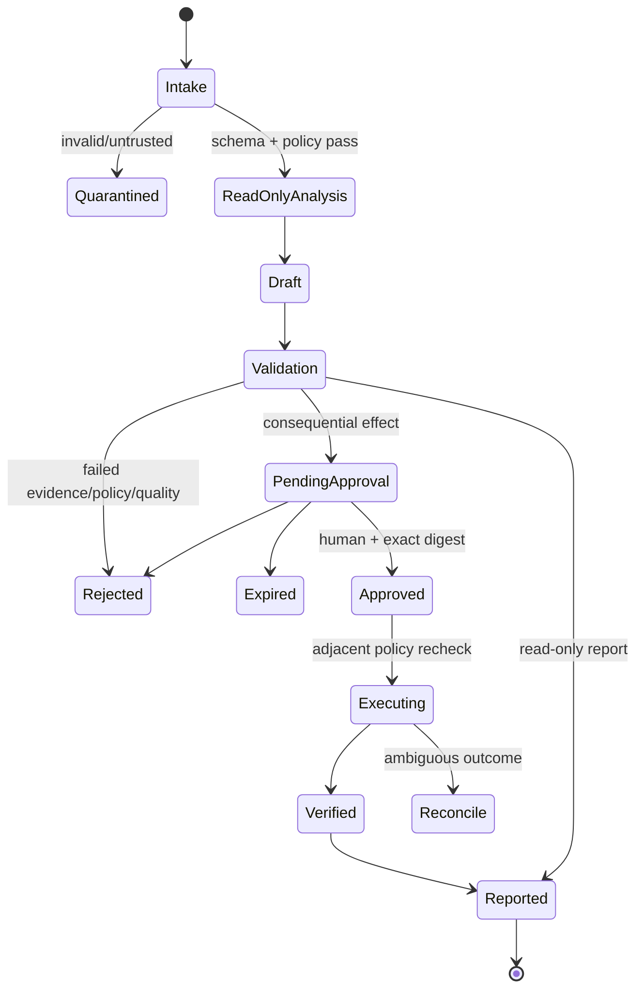

# ClearGlassInc Artemis — Burlington Multi-Agent Workflow

## Operating status and invariants

This is a target-state operating contract, not evidence that agents, APIs, Palantir services, schedules, credentials, or production automation are active. The ClearGlass ARTEMIS FAWL sequence is evidence → draft → deterministic validation → attributable approval → execution → verification → append-only audit. Agents cannot manufacture authority, approve their own work, change policy/goals/privileges, publish, message people, deploy, or conceal missing evidence.

Every run receives `run_id`, `tenant_id`, `mission_id`, purpose, classification/compartments, input/version digests, allowlisted tools, read/write path leases, step/time/token/cost budgets, data-freshness limits, output JSON Schema, and stop/escalation rules. Outputs carry provenance, confidence, missing-data reasons, rationale, timestamps, and versions. Model output is untrusted.

## Agent interfaces

| Agent | Reads | Writes (single owner) | Cadence / trigger | Acceptance |
|---|---|---|---|---|
| ReconEngine | Authorized GBP/GA4/social/rank exports/APIs, public permitted sources | Versioned baseline facts, competitor observations, grid run manifests | Daily increment/weekly full after connector approval | Schema, lineage, freshness, missingness, anomaly checks; no fabricated zero |
| StrategyArchitect | Recon snapshots, mission objectives, approved experiments | `priority_levers` candidate and strategy revision draft | Monthly or material drift | Reproducible score inputs, evidence links, uncertainty/risk, no execution |
| ContentGenerator | Approved opportunity/evidence map and performance aggregates | Unique draft asset directory only | 2–4 blog and 15–25 social drafts/month | Claim citations, local relevance, duplication/brand/privacy checks, draft label |
| LocalSEOAuditor | Repo/live read-only scan, canonical NAP, approved schemas | Issue report; isolated safe-fix branch only | Weekly and pull request | Reproducible finding; accessibility/security/performance checks; no auto-merge |
| ReviewAndCitationManager | Consent/suppression state, reviews, directory audit | Request/response drafts and citation report | Alerts/weekly audit | No review gating; CASL basis; no send/mutation; minimum PII |
| CommunityPartnershipScout | Permitted public event/org/media sources | Weekly evidence-backed shortlist and outreach drafts | Weekly | Source/date/contact-purpose validation; no scraping/mass outreach |
| GrowthReporter | Immutable snapshots and objective definitions | Weekly/monthly report instance | Weekly/monthly | Formula/version, as-of time, denominators, matched cohorts, limitations |
| OpsOrchestrator | Run manifests, leases, policy, approvals | State transitions and append-only run/audit events | Event driven | Idempotency, no overlapping write lease, approval digest, bounded retries |

## Deterministic workflow



### Write ownership and concurrency

The orchestrator grants a time-bounded lease over a canonical resource such as `content/drafts/<asset_id>` or `reports/<period>`. Only one writer holds a resource lease. Agents write immutable run-scoped staging output; a deterministic merger validates expected base digest and schema. Conflicts create a review task rather than last-write-wins. Audit events and source facts are append-only. Approval never transfers across a changed payload, tool, policy, or version.

### Tool and retry rules

Tools are typed, versioned, resource-scoped, egress-allowlisted, timeout-bounded, and policy-checked server-side immediately before use. Reads may retry with exponential backoff and jitter within a maximum attempt/time budget. Mutations require an idempotency key; timeouts enter reconciliation and are never blindly retried. Circuit breakers halt failing connectors. Identity, policy, lineage, approval, or audit failure disables mutation.

## Approval matrix

| Proposed effect | Minimum disposition |
|---|---|
| Read-only normalization/report draft | Automated after schema/policy validation; logged |
| Content, outreach, review response, or GBP draft | Human editorial/compliance review |
| Public publish, GBP edit/post, outbound message/review request, directory mutation | Named human approval bound to exact payload; execution policy recheck |
| Site-wide schema/core structure, personal-data integration, high-exposure campaign | Product + privacy/security + operational owner; staged release and rollback |
| Prompt/workflow/model-route release | Independent eval owner and product/security/operations approval; signed canary manifest |
| Policy, permission, mission, tool scope, retention, production target | Agents may not change; authorized governance change process only |

CASL suppression and consent/lawful-basis checks occur at execution time. Review requests go uniformly to eligible consenting customers, never only happy customers. No mass DMs, fake reviews, invented endorsements, directory spam, or unsupported local claims.

## Run manifest and audit contract

```json
{
  "schema_version": 1,
  "run_id": "uuid",
  "agent": "ReconEngine",
  "agent_version": "sha256:...",
  "tenant_id": "clearglassinc-artemis",
  "mission_id": "burlington-local-exposure",
  "purpose": "local_seo_analysis",
  "input_digests": ["sha256:..."],
  "policy_version": "sha256:...",
  "allowed_tools": ["rank_export.read:v1"],
  "write_leases": ["baseline/2026-W31"],
  "budgets": {"steps": 20, "seconds": 300, "tokens": 20000, "cost_cad": 5},
  "started_at": "RFC3339 timestamp",
  "status": "draft|validated|pending_approval|approved|executed|failed|reconcile",
  "missing_data": [],
  "output_digests": [],
  "approval_id": null,
  "rationale": "evidence-based reason"
}
```

Audit events record actor/workload identity, correlation/run ID, source and output digests, model/prompt/workflow/tool/policy versions, retrieval evidence IDs, policy decision, state transition, approval/rejection and reason, execution receipt, timestamps, and release identity. Sensitive values and secrets are excluded. Critical actions wait for durable append acknowledgement; audit access is separate and retention-controlled.

## Continuous verification and escalation

* **Daily:** connector freshness, schema rejects, dead-letter volume, consent/suppression failures, cost and bounded-run breaches.
* **Weekly:** NAP/schema/link/accessibility/performance audits, grid matched-cell integrity, citation coverage, agent acceptance/rejection, outstanding reconciliation.
* **Monthly:** KPI evidence, source/method changes, precision/recall, hallucination/citation and boundary-leak evals, operator trust, drift, experiment decisions, rollback readiness.
* **Immediate stop:** policy violation, cross-tenant/compartment disclosure, missing audit acknowledgement, approval replay/digest mismatch, suspected secret/PII leak, provider-terms risk, review gating, material metric anomaly, or kill switch.

Anomaly thresholds are configured and versioned, not invented by an agent. Escalations identify exact invariant, affected artifacts, safe disabled state, accountable owner, and evidence needed to resume. A partial outage degrades to labeled read-only data; it never silently authorizes an effect.

## Self-upgrade workflow

Operator corrections, rejection reasons, outcomes, and telemetry become privacy-reviewed labeled cases. StrategyArchitect may propose a candidate; an isolated evaluator runs frozen gold, recent shadow, injection, permission-negative, CASL, citation, latency, cost, and failure tests. Candidates cannot modify policy/tools/goals. Independent humans approve an immutable candidate/eval/rollback manifest. Apollo is a target deployment mechanism for offline replay, read-only canary, limited cohort, promotion, kill switch, and rollback; availability must be verified. Champion and candidate results remain segmentable and auditable.

## 90-day operating gates

1. **Days 1–14:** name owners; approve contracts/methodology; synthetic and authorized-export runs; verify audit, leases, policy negatives, and rollback. All external writes disabled.
2. **Days 15–45:** read-only connectors and weekly orchestration; human-reviewed drafts; day-30 matched-grid analysis; limited outreach only after compliance approval.
3. **Days 46–90:** approved read-only canaries and separately approved public actions; monthly self-upgrade proposal review; rollback drill and after-action report.

Deployment cannot proceed without verified identities, protected environment, secrets handling, immutable artifacts, named approvers, monitoring, incident owner, health criteria, and last-known-good rollback. Hosted workflow dispatch is a separate explicitly authorized act.
