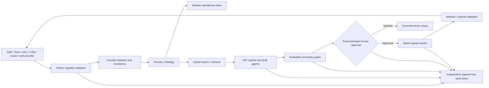

# ClearGlassInc Artemis — Burlington Technical Implementation Plan

> **Target-state blueprint, not deployment evidence.** Palantir licences, tenant configuration, connectors, APIs, credentials, environments, GBP capabilities and production controls are unverified. This design keeps every external mutation disabled until those facts and a bound approval are confirmed.

## System Architecture



- **Web UI:** Next.js analyst cockpit for grid layers, evidence, content drafts, approval queue, eval scorecards and release history. UI authorization is advisory; APIs enforce policy again.
- **API gateway:** OIDC/WebAuthn user identity, workload mTLS, request limits, schema validation, correlation IDs and policy decision point (PDP).
- **Backend:** typed Python/FastAPI services for ingestion, measurement, draft packages, approvals, rank-run normalization and reports.
- **Event layer:** bounded, partitioned topics with schema registry, idempotency key, dead-letter quarantine and replay authorization.
- **Data layer:** raw encrypted source datasets → validated normalized datasets → aggregate reporting marts. Foundry provides governed integration and transforms; the Ontology exposes operational objects/actions.
- **Gotham:** permission-aware investigation and entity tracking views for market signals, opportunities, cases and outcomes.
- **AIP:** grounded copilots, typed tool definitions, agent workflows, prompt/eval registries and proposal generation. Model output is untrusted.
- **Apollo:** signed deployment manifests, environment rings, health gates, canary, last-known-good rollback and runtime kill switch.

## Data and Ontology

Every object property carries source reference, observed/event time, ingest/system time, confidence method, owner, classification, coalition/tenant marking, consent/usage rights, retention and policy version.

| Object | Key properties | Links / actions |
|---|---|---|
| `Organization` | canonical NAP, verified services, policy markings | `serves ServiceArea`; propose profile change |
| `ServiceArea` | locality, verified state, valid interval, evidence | `targetedBy Page`; verify/revoke |
| `Keyword` | normalized phrase, intent, locale | `measuredBy GridRun`; activate/deactivate |
| `GridPoint` | provider point ID, coordinates, neighbourhood | `has Observation`; coordinates restricted |
| `RankObservation` | rank, success/error, settings digest, event time | `for Keyword/Organization/GridPoint` |
| `Page` | URL, canonical, schema, CWV, content digest | `targets Keyword/Area`; propose draft |
| `ContentAsset` | channel, copy/media digest, rights, expiry | `uses Evidence`; request approval |
| `Evidence` | source, claim scope, confidence, rights | `supports Claim/Asset/Page` |
| `LeadOutcome` | aggregate attribution, qualification, event time | `attributedTo Campaign/Page` |
| `Opportunity` | entity, type, fit, verified-at, URL | `becomes PartnershipCase` |
| `ActionPackage` | exact payload, destination, digest, risk, expiry | `authorizedBy Approval`; execute once |
| `Approval` | actor, role, decision, reason, digest, expiry | never transferable to a changed package |
| `Experiment` | hypothesis, cohort, metrics, stop rules | `compares Version`; promote/rollback |

Ontology actions are narrow business interfaces, not unrestricted database access. A content agent can read aggregate signals and create `ActionPackage(status=DRAFT)`; it cannot invoke a publisher. The executor accepts only an approved, unexpired digest and atomically writes execution/audit state.

## AI and Agent Design

Analyst copilots answer “what changed and what evidence supports it?” Commander/growth-owner copilots summarize objectives, risk, resource decisions and blocked approvals. Triage, enrichment, correlation, summarization and recommendation agents run as bounded state machines with typed input/output, tool allowlists, row/entity policy, token/time/cost ceilings and abstention.

Allowed tools include aggregate Ontology query, evidence retrieval, deterministic score calculation, draft creation, eval execution, case opening and approval-package preparation. Opening a case is an internal reversible action. Profile edits, publishing, outreach, personal-data integration, budgets and production releases require a separate human authorization and executor-side policy check.

## Self-Improvement Loop

1. **Capture:** consented feedback, corrections, query traces, alert dispositions, content outcomes, rank/traffic/lead aggregates, latency, cost, overrides and mission results.
2. **Sanitize:** remove secrets and unnecessary personal data; enforce purpose, lineage, rights and retention; quarantine prompt-injection content.
3. **Curate evals:** turn corrections and failure clusters into versioned cases; freeze train/development/holdout splits and prevent outcome leakage.
4. **Propose:** AIP may propose prompt text, workflow ordering, heuristic thresholds or allowlisted model routes. It cannot change mission, policy, privileges, tools, budgets, deployment target, approval rules or its own evaluator.
5. **Evaluate:** offline replay measures factual grounding, precision/recall, policy violations, rank-report correctness, latency, cost, accessibility, operator trust and qualified-lead outcome. Security/policy failures are hard stops.
6. **Review:** proposer and approver are separated. Marketing, privacy, security, model-risk and operations approve according to change class and exact signed digest.
7. **Canary/A-B:** Apollo deploys a bounded eligible cohort with predetermined allocation, sample/window and stop conditions. Search crawlers and users receive no deceptive variants.
8. **Promote/rollback:** SLO, policy, grounding or trust regression restores the signed last-known-good bundle. Every decision and outcome is reconstructable.

Drift monitors input distributions, retrieval miss rate, abstention, override rate, grounding, performance and channel/API errors. Drift opens a case; it never silently retrains or widens authority.

## Full-Stack Implementation

### Repository layout

```text
burlington/
  contracts/          # JSON Schemas and policy bundles
  adapters/           # read-only source clients; publisher separated
  ontology/           # object/action mappings
  workflows/          # deterministic state machines
  evals/              # cases, scorers, holdout manifests
  reports/            # generated aggregate reports
  ui/                 # cockpit routes/components
geo_grid_runs/        # timestamped aggregate run artifacts
```

The present repository addition is intentionally smaller: canonical JSON contracts, operating documents and `tools/burlington_exposure.py`, a stdlib-only validator/report helper. It does not pretend to provision the target state.

### Connector controls

Use dedicated read-only identities, secret-manager references, 10–30 second timeouts, capped exponential backoff only for idempotent reads, quotas, pagination bounds, schema validation and source checksums. Never scrape Google Maps. Use an approved rank provider or human-exported data. GBP mutation support must be separately confirmed against current official capabilities and terms.

Review requests require project-completion eligibility, channel-specific consent/legal basis, global suppression, frequency cap, neutral copy, direct review link, idempotency key and expiry. NPS may be analyzed in aggregate but cannot decide who receives a public-review request.

### Website and CI

A location-page build validates metadata, visible/structured-data parity, canonical URL, sitemap/internal-link generation, accessibility and budgets. Enforce p75 targets of LCP ≤2.5s, INP ≤200ms and CLS ≤0.1 using representative field data when available; lab CI is a regression signal, not field proof. A production release needs environment approval, immutable artifact digest, smoke/functional health checks and a documented prior-artifact rollback.

### Analytics

Emit `local_cta_click`, `phone_click`, `directions_click`, `qualified_form_submit` and `outreach_response` with pseudonymous correlation, page/campaign IDs and consent state—never form contents. UTM values are allowlisted and server-side conversion logs minimize personal data. Reconcile CRM and analytics aggregates without presenting probabilistic attribution as certainty.

## Security and Governance

ABAC combines tenant, coalition, mission, purpose, role, entity/field scope, classification and consent. Deny by default at gateway, service, Ontology action and executor. Use short-lived audience-bound workload identity, mTLS, egress allowlists and field-level encryption. Coalition exports are new derived products with explicit releasability review; labels are not stripped.

Audit records are append-only, hash-chained or platform-tamper-evident, time-synchronized, independently readable and privacy-minimized. Record source snapshot, code/prompt/workflow/model/policy versions, tools, evidence IDs, approval digest, executor identity, outcome and rollback. Model/prompt governance uses signed registries, named owners, expiry and emergency disablement.

### Threats and controls

| Threat | Prevent | Detect | Recover |
|---|---|---|---|
| Prompt injection from local web content | isolate text, no instruction authority, typed tools/egress | injection/evidence evals | quarantine source; replay last good |
| Cross-compartment disclosure | policy-filter before retrieval and output | denied-access and canary-token alerts | revoke session; incident process |
| Fabricated claim/review/affiliation | evidence-required claim schema; no review creation tool | grounding and public-copy scan | unpublish/correct; notify owner |
| Approval replay/confused deputy | actor, audience, destination, digest, expiry, nonce binding | duplicate/idempotency alert | revoke package/credential |
| Unsafe self-upgrade | immutable constitutional policy; separate evaluator/approver | registry diff and authority scan | Apollo rollback and kill switch |

## Code Examples

```python
from enum import StrEnum
from pydantic import BaseModel, Field

class Stage(StrEnum):
    DRAFT = "draft"
    VALIDATED = "validated"
    AWAITING_APPROVAL = "awaiting_approval"
    APPROVED = "approved"
    EXECUTED = "executed"
    REJECTED = "rejected"

class ActionPackage(BaseModel):
    action_id: str
    stage: Stage = Stage.DRAFT
    destination: str
    payload_digest: str = Field(pattern=r"^[a-f0-9]{64}$")
    evidence_ids: list[str] = Field(min_length=1, max_length=50)
    policy_version: str
    expires_at: str

ALLOWED = {
    Stage.DRAFT: {Stage.VALIDATED, Stage.REJECTED},
    Stage.VALIDATED: {Stage.AWAITING_APPROVAL, Stage.REJECTED},
    Stage.AWAITING_APPROVAL: {Stage.APPROVED, Stage.REJECTED},
    Stage.APPROVED: {Stage.EXECUTED, Stage.REJECTED},
}

def transition(package: ActionPackage, target: Stage) -> ActionPackage:
    if target not in ALLOWED.get(package.stage, set()):
        raise ValueError(f"forbidden transition: {package.stage} -> {target}")
    return package.model_copy(update={"stage": target})
```

```python
async def execute_approved(package, approval, actor, policy, publisher):
    # Recheck next to the protected action; UI approval alone is never authority.
    if approval.package_digest != package.payload_digest or approval.expired():
        raise PermissionError("approval is stale or bound to different content")
    decision = await policy.authorize(actor=actor, action="publish", resource=package)
    if not decision.allowed:
        raise PermissionError(decision.reason)
    result = await publisher.publish_once(package, idempotency_key=package.action_id)
    await audit.append_atomically(package, approval, decision, result)
    return result
```

```sql
SELECT keyword_id,
       SUM(CASE WHEN status = 'success' AND rank BETWEEN 1 AND 3 THEN 1 ELSE 0 END) AS green,
       SUM(CASE WHEN status = 'success' THEN 1 ELSE 0 END) AS measured,
       100.0 * SUM(CASE WHEN status = 'success' AND rank BETWEEN 1 AND 3 THEN 1 ELSE 0 END)
         / NULLIF(SUM(CASE WHEN status = 'success' THEN 1 ELSE 0 END), 0) AS green_rate
FROM rank_observation
WHERE run_id = :locked_run_id
GROUP BY keyword_id;
```

## Scenario Walkthrough

At 08:14, an authorized rank-provider event arrives for the locked Burlington grid. The consumer validates its schema, settings digest and idempotency key, stores the raw object with restricted access, and links successful `RankObservation` objects to `Keyword` and `GridPoint`. Failed cells remain errors.

At 08:15, triage correlates a real red-zone cluster with aggregate Search Console demand and a weak Burlington landing-page conversion rate. Retrieval exposes only authorized aggregates and rights-cleared evidence. The strategy agent proposes a revised FAQ and mobile CTA; it cites evidence and stops at `AWAITING_APPROVAL`. It cannot edit GBP or publish.

At 09:02, the operator rejects an unsupported “instant response” phrase, supplies the verified response-policy fact, and approves a corrected exact digest. Policy rechecks actor, destination, expiry and evidence. Apollo canaries the signed site artifact; accessibility, error rate, CWV and conversion guardrails are watched. A breach restores the previous artifact.

After the predeclared window, the correction becomes a sanitized eval case. AIP proposes a prompt rule requiring a cited SLA for every speed claim. Offline holdout replay improves grounding without policy, latency or trust regression. A different model-risk owner approves the prompt digest; Apollo canaries and promotes it. The system learned a constraint, not a new goal or privilege, and every source, correction, eval, approval and release remains auditable.
