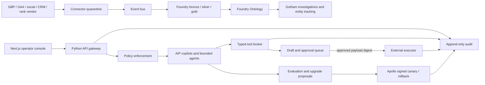

# ClearGlassInc Artemis — Burlington Technical Implementation Plan

## Status, decision, and acceptance contract

> **Target state only.** This document does not assert that Palantir, Google Business Profile (GBP), Google Analytics 4 (GA4), social, CRM, rank-tracking, or production infrastructure is licensed, connected, or provisioned. Every connector starts disabled and read-only; credentials, data agreements, API terms, identity federation, approvers, retention, and rollback owners must be verified before activation.

ClearGlassInc Artemis will implement the Burlington exposure program as a **governed proposal system**: collect evidence → normalize → analyze → draft → deterministic validation → human approval → execution → immutable audit. Models can propose content, prompts, workflows, heuristics, and routing changes, but cannot approve their own changes, modify goals or policy, expand privileges, publish, message contacts, request reviews, or deploy.

Acceptance requires: schema-valid 90-day imports; no invented observations; tenant/mission/purpose/compartment enforcement before retrieval; typed and allowlisted tools; attributable approval bound to an immutable payload; replayable evaluation evidence; a signed release with a stable rollback; and dashboards that label missing/stale data rather than converting it to zero.

## System Architecture



### Palantir responsibility map

* **Gotham** is the operational surface for investigations, entity tracking, maps, timelines, cases, watchlists, and evidence-backed opportunity review.
* **Foundry** integrates sources into governed bronze/silver/gold data products and exposes ontology objects, links, actions, lineage, and application logic.
* **AIP** hosts copilots, evaluation-backed agent workflows, policy-gated tools, prompt/workflow registries, and model routing.
* **Apollo** promotes signed application/configuration bundles through deployment rings, observes canaries, supplies kill switches, and rolls back to an identified last-known-good release.

These are precise responsibility boundaries, not claims about available product APIs. Licensed interfaces must be mapped during discovery; adapters isolate product-specific SDK calls.

### Full-stack components

| Layer | Primary implementation | Failure behaviour |
|---|---|---|
| Web | Next.js/TypeScript, accessible map/grid, evidence drawer, approval inbox, KPI/eval dashboards | Read-only cached view labeled with age; mutations disabled |
| Gateway | Python 3.12 FastAPI, OIDC/mTLS, Pydantic, request IDs, rate/size limits | Fail closed on identity, context, or policy failure |
| Services | Connector, ontology-query, workflow, content-draft, approval, execution, feedback, evaluation, release-proposal services | Bounded retry only for idempotent reads; ambiguous mutations reconcile |
| Stream | Managed Kafka/Pulsar with schema registry, dead-letter topics, tenant keys, bounded retention | Backpressure; quarantine invalid messages |
| Storage | Foundry data products; encrypted object store for raw snapshots; relational control state | Missing is `null + reason`, never fabricated zero |
| Retrieval | Permission-filtered lexical/vector index over approved public and first-party evidence | Policy filters before embedding/search/prompt construction |
| AI | AIP model router and deterministic state machines | Abstain or deterministic fallback; never bypass approval |
| Policy | Server-side policy-as-code plus object/property/action permissions | Default deny |
| Observability | OpenTelemetry, privacy-aware logs, metrics/traces, hash-chained audit exports | Consequential action requires durable audit acknowledgement |
| Delivery | CI validation → signed artifact → Apollo Ring 0 replay → Ring 1 read-only → approved Ring 2 | Automatic rollback/kill switch on integrity or SLO breach |

## Data and Ontology

Every object has `tenant_id`, `mission_id`, `source_id`, `observed_at`, `valid_from`, `valid_to`, `ingested_at`, `confidence`, `lineage_refs`, `classification`, `compartments`, `releasability`, `purpose`, and `schema_version`. Confidence expresses calibrated uncertainty, never authorization.

| Object | Important fields | Links/actions |
|---|---|---|
| `Place` | city, neighbourhood, lat/lng, service radius | contains grid cells; compare periods |
| `Keyword` | normalized phrase, intent, priority, locale | measured by rank observations |
| `GridCell` | vendor/grid ID, coarse coordinates, consented precision | located in Place |
| `RankObservation` | rank, captured_at, method, result URL, raw snapshot digest | keyword/cell/brand; supersedes prior observation |
| `MetricObservation` | channel, metric, value, unit, period, dimensions | supports KPI; derived from source snapshot |
| `BusinessProfile` | canonical NAP, verified categories/services | observed profile; proposed update action |
| `Competitor` | observed public identifiers only | competes for keyword/place |
| `Opportunity` | event/org/media/directory, leverage, evidence, status | partnership draft; never implies endorsement |
| `ContentAsset` | locale, claims, evidence, owner, draft/version state | targets keyword/place; publish action gated |
| `ContactConsent` | channel, lawful basis, proof, scope, expiry/withdrawal | permits a specific message; revocation blocks execution |
| `Lead` | minimum necessary attribution and local intent | conversion event; restricted PII properties |
| `Experiment` | hypothesis, baseline, thresholds, assignment, stop rules | evaluates immutable candidate/champion |
| `ActionPackage` | exact payload digest, risk, status, expiry, approvers | draft → approved → executed/rejected/expired |
| `Feedback` | correction/outcome, actor, reason, target version | becomes labeled eval case after privacy review |
| `ReleaseCandidate` | prompt/workflow/router/artifact versions, eval manifest | approved for canary/rollback |

Permissions apply at row, property, entity, edge, action, mission, purpose, and coalition boundary. PII never enters prompts unless a policy decision explicitly permits the minimum necessary fields. Temporal queries use both source-valid time and system-recorded time, allowing an operator to reconstruct what was known when a decision occurred.

```sql
-- Gold rank fact; source payload remains in restricted bronze storage.
CREATE TABLE rank_observation (
  tenant_id TEXT NOT NULL, observation_id UUID PRIMARY KEY,
  keyword_id UUID NOT NULL, grid_cell_id UUID NOT NULL,
  observed_at TIMESTAMPTZ NOT NULL, position SMALLINT,
  missing_reason TEXT, method TEXT NOT NULL, source_digest TEXT NOT NULL,
  confidence NUMERIC(4,3) CHECK (confidence BETWEEN 0 AND 1),
  classification TEXT NOT NULL, compartments TEXT[] NOT NULL,
  schema_version SMALLINT NOT NULL,
  CHECK ((position IS NOT NULL) <> (missing_reason IS NOT NULL))
);
```

## AI and Agent Design

The analyst copilot explains red cells, finds cited evidence, compares periods, and drafts experiments. The growth lead copilot reviews KPI health, costs, risks, and action packages. Neither executes. A deterministic orchestrator coordinates ReconEngine → StrategyArchitect → ContentGenerator/LocalSEOAuditor/CommunityPartnershipScout → approval → executors → GrowthReporter.

Agents receive a signed mission envelope, maximum steps/tokens/time/cost, permitted object types and tools, output schema, and stop conditions. Retrieval is authorization-filtered before context reaches the model. Tool output is untrusted and validated. Prompt injection cannot grant tools, change scopes, or override policy. Operational effects—GBP edits/posts, website publish, outbound communication, review requests, personal-data integration, schema-wide changes, and production releases—always wait for human approval.

## Self-Improvement Loop

1. Capture privacy-minimized query logs, retrieved evidence IDs, prompt/model/workflow/policy versions, tool calls, latency/cost, operator corrections, approvals/rejections with reason codes, alert outcomes, lead attribution, and experiment results.
2. Validate consent/purpose, redact disallowed fields, deduplicate, and create versioned labeled eval cases. Corrections are signals, not unquestioned truth.
3. Detect quality, data, concept, latency, cost, and trust drift against a frozen baseline and segment by channel, keyword, geography, language, and workflow.
4. Generate a candidate prompt, workflow, heuristic, or routing diff inside an isolated branch. The candidate cannot alter policy, tools, goals, privileges, retention, or deployment scope.
5. Replay frozen gold sets, recent shadow traffic, adversarial prompt-injection cases, permission-leak tests, CASL/review-gating tests, hallucination/citation tests, and load/failure tests.
6. Require non-inferiority safety gates plus a statistically defensible improvement: e.g. precision/recall and citation coverage improve or remain within approved margins; policy violations and cross-boundary disclosures remain exactly zero; p95 latency/cost stay within budget.
7. Named product, data, privacy/security, and operational owners review the immutable manifest. Candidate and evaluator cannot approve.
8. Apollo target design: Ring 0 offline replay, Ring 1 shadow/read-only canary, Ring 2 limited operator cohort, then wider promotion only after observation windows and approval.
9. Automatically recall on policy violation, audit failure, citation regression, trust drop, latency/error threshold, drift alarm, or operator kill switch; restore the recorded champion and reconcile partial work.
10. Append proposal, evidence, decisions, signatures, release identity, telemetry, and rollback outcome to the audit ledger.

Core metrics: green-cell share at explicit rank threshold, local organic sessions, attributable qualified leads, brand mentions, precision, recall, grounded-citation coverage, abstention quality, p50/p95 latency, cost per accepted draft, override/rejection rate, operator trust, policy violations, and downstream outcome. A/B tests randomize only eligible low-risk users, define minimum sample and stopping criteria in advance, prevent metric peeking, and support instant opt-out.

## Full-Stack Implementation

### Repository contracts

```text
apps/operator-web/                  # Next.js UI; no secrets or authorization logic
services/gateway/                   # OIDC, mission context, policy, request envelope
services/connector/                 # read-only source adapters and quarantine
services/orchestrator/              # deterministic state machines
services/tool-broker/               # typed tools, idempotency, egress allowlist
services/evaluator/                 # gold sets, drift, candidate manifests
packages/contracts/                 # JSON Schema / generated Pydantic + TypeScript types
policy/                             # reviewed policy-as-code and tests
ontology/                           # target Foundry object/link/action definitions
geo_grid_runs/                      # metadata/manifests; sensitive raw data external
content/drafts/                     # draft-only generated content
```

### Python-first ingestion and validation

```python
from datetime import datetime, timezone
from hashlib import sha256
from typing import Literal
from pydantic import BaseModel, ConfigDict, Field

class RankEvent(BaseModel):
    model_config = ConfigDict(extra="forbid", frozen=True)
    tenant_id: str = Field(pattern=r"^[a-z0-9_-]{1,64}$")
    keyword_id: str
    grid_cell_id: str
    observed_at: datetime
    position: int | None = Field(default=None, ge=1, le=100)
    missing_reason: Literal["not_found", "vendor_error", "not_collected"] | None = None
    source: Literal["approved_vendor", "manual_export"]

    def validate_missingness(self) -> None:
        if (self.position is None) == (self.missing_reason is None):
            raise ValueError("provide exactly one of position or missing_reason")

async def ingest(raw: bytes, *, expected_tenant: str, producer) -> str:
    if len(raw) > 1_000_000:
        raise ValueError("payload too large")
    event = RankEvent.model_validate_json(raw)
    event.validate_missingness()
    if event.tenant_id != expected_tenant:
        raise PermissionError("tenant mismatch")
    digest = sha256(raw).hexdigest()
    await producer.send("rank.validated", key=event.tenant_id,
                        value={**event.model_dump(mode="json"), "source_digest": digest})
    return digest
```

### Adjacent policy enforcement and ontology query

```python
from dataclasses import dataclass

@dataclass(frozen=True)
class Subject:
    tenant: str; missions: frozenset[str]; compartments: frozenset[str]
    purposes: frozenset[str]; actions: frozenset[str]

def authorize(subject: Subject, obj: dict, action: str, purpose: str) -> None:
    allowed = (
        obj["tenant_id"] == subject.tenant
        and obj["mission_id"] in subject.missions
        and set(obj["compartments"]).issubset(subject.compartments)
        and purpose in subject.purposes and action in subject.actions
    )
    if not allowed:
        raise PermissionError("default-deny policy decision")

async def ranked_cells(repo, subject: Subject, mission_id: str, keyword_id: str):
    # Adapter maps this contract to licensed Foundry Ontology interfaces.
    rows = await repo.query_rank_cells(tenant=subject.tenant,
                                       mission=mission_id, keyword=keyword_id)
    visible = []
    for row in rows:
        authorize(subject, row, "rank:read", "local_seo_analysis")
        visible.append(row)
    return visible
```

### Workflow state machine and approval binding

```python
from enum import StrEnum
import hashlib, json

class State(StrEnum):
    DRAFT="draft"; VALIDATED="validated"; PENDING="pending_human_approval"
    APPROVED="approved"; EXECUTING="executing"; EXECUTED="executed"
    REJECTED="rejected"; EXPIRED="expired"; RECONCILE="reconcile"

TRANSITIONS = {
    State.DRAFT: {State.VALIDATED}, State.VALIDATED: {State.PENDING},
    State.PENDING: {State.APPROVED, State.REJECTED, State.EXPIRED},
    State.APPROVED: {State.EXECUTING},
    State.EXECUTING: {State.EXECUTED, State.RECONCILE},
}

def payload_digest(payload: dict) -> str:
    canonical = json.dumps(payload, sort_keys=True, separators=(",", ":"))
    return hashlib.sha256(canonical.encode()).hexdigest()

def transition(current: State, target: State) -> None:
    if target not in TRANSITIONS.get(current, set()):
        raise ValueError(f"forbidden transition: {current} -> {target}")

async def execute(package, approval, broker):
    if approval.expired or approval.consumed:
        raise PermissionError("approval invalid")
    if approval.payload_digest != payload_digest(package.payload):
        raise PermissionError("payload changed after approval")
    transition(package.state, State.EXECUTING)
    # Idempotency lookup precedes execution; timed-out mutations enter reconciliation.
    return await broker.execute(package.payload, idempotency_key=package.id)
```

### Evaluation and promotion gate

```python
from dataclasses import dataclass

@dataclass(frozen=True)
class EvalResult:
    precision: float; recall: float; citation_coverage: float
    p95_ms: int; policy_violations: int; boundary_leaks: int

def eligible(champion: EvalResult, candidate: EvalResult) -> bool:
    return all((
        candidate.policy_violations == 0,
        candidate.boundary_leaks == 0,
        candidate.precision >= champion.precision - 0.01,
        candidate.recall >= champion.recall,
        candidate.citation_coverage >= 0.98,
        candidate.p95_ms <= 2_500,
    ))

async def propose_release(candidate, evidence, registry):
    if not eligible(evidence.champion, evidence.candidate):
        raise ValueError("candidate failed deterministic gates")
    # Creates a proposal only. Apollo promotion requires independent signed approval.
    return await registry.create_pending_manifest(
        artifact_digest=candidate.digest,
        eval_digest=evidence.digest,
        rollback_version=evidence.champion_version,
    )
```

### CI and release gates

CI validates JSON/Markdown, schemas, typing, unit/property tests, permission-negative tests, prompt-injection evals, secret scanning, dependency/SBOM/provenance, accessibility, link integrity, and representative Core Web Vitals budgets. External actions must be full-SHA pinned, permissions explicit, checkout credentials disabled, jobs timed out, and production deployment separated from untrusted builds. CI produces proposals/artifacts only; production uses a protected environment, immutable artifact digest, named approver, health check, observation window, and tested rollback.

## Security and Governance

* OIDC workload identity, mTLS, short-lived audience/resource-scoped tokens, default-deny egress, and separation of control/data/action/audit planes.
* Need-to-know at tenant, mission, row, column/property, entity, edge, action, purpose, classification, compartment, and coalition-releasability levels. UI hiding is never authorization.
* Data minimization, consent/lawful-basis registry, retention/deletion schedules, Canadian residency assessment, access/correction handling, and privacy impact review before personal-data integrations.
* CASL execution requires recorded consent or documented applicable basis, accurate sender identity, unsubscribe support, suppression checks, and evidence retention. No mass DMs. Legal counsel owns the final interpretation.
* Review requests are sent uniformly to eligible consenting customers—never selected by NPS/sentiment—and contain no incentive, fabricated review, or required positive framing.
* Google/third-party terms, robots, rate limits, and permitted APIs govern collection. No scraping or automated GBP mutation until confirmed lawful and authorized.
* Prompt/model/tool/data lineage, approvals, denials, release attestations, and actions are append-only and tamper-evident. Secrets and unnecessary PII are excluded from telemetry.
* Models cannot change policy, tools, retention, goals, privileges, production targets, or approval requirements. Break-glass is time-limited, reason-coded, alerted, independently reviewed, and cannot alter releasability.

## Geo-grid, website, and analytics delivery

Geo-grid collection must use an approved vendor/API, fixed versioned grid, locale/device settings, rate limits, and timestamped manifests. Store rank plus missing reason; compare matched cells and disclose sampling/vendor changes. Coordinates are coarsened in broad-access reports. No proxy abuse or manipulation of Maps.

Location pages (`/burlington` first; Oakville/Hamilton/Milton/Dundas only after evidence) require unique verified services, local evidence, canonical metadata, accessible headings, contact details, and truthful LocalBusiness/Organization/Service schema. Do not fabricate offices, case studies, testimonials, or service areas. Generate internal links canonically with `python3 tools/internal_links.py`; preserve Pages requirements. Proposed schema changes receive validator tests and approval before production.

GA4 events use a versioned contract: `local_cta_click`, `phone_click`, `directions_click`, `lead_submit`, and `qualified_local_lead`, with source/medium/campaign/content and coarse city/region dimensions. Never send PII in event names, URLs, or analytics parameters. Server-side conversion records use event IDs for dedupe and record consent status. UTM format: `utm_source`, `utm_medium`, `utm_campaign=burlington_<initiative>_<yyyyq#>`, `utm_content=<asset_id>`.

## 90-day rollout and rollback

| Phase | Deliverable | Gate / evidence |
|---|---|---|
| Days 1–14 | Contracts, synthetic pilot, authorized exports, baseline, GBP/site/NAP/schema drafts, first grid manifest | Owner validates sources and missingness; privacy/security review; no publishing |
| Days 15–45 | Read-only connectors, operator UI, draft content, five targeted partnership drafts, day-30 matched grid comparison | Evaluation gates; named approval per public/outbound action |
| Days 46–90 | Limited canary automation, approved location/content releases, monthly grid rerun, feedback/eval loop | Observation window, attributable KPI evidence, rollback drill |

Rollback restores the last-known-good application, prompt/workflow/router and policy bundle; disables affected connectors/tools; invalidates outstanding approvals whose digest/version changed; preserves audit and raw evidence; reconciles ambiguous external effects; and opens an incident review. Public content rollback restores the prior immutable site artifact. Data corrections append superseding facts rather than rewriting history.

## Scenario Walkthrough

At 09:10 an approved rank vendor emits a signed observation showing a matched set of Burlington waterfront cells deteriorating for “AI automation Burlington.” The connector verifies size/schema/tenant and quarantines two malformed records. Foundry preserves the raw digest, normalizes valid observations, and links them to `Keyword`, `GridCell`, `Place`, and prior observations. Gotham displays a time-aware cluster, explicitly labeled vendor evidence—not a causal claim.

ReconEngine opens a read-only anomaly. StrategyArchitect asks the policy-filtered ontology for correlated first-party evidence; the model cites a stale Burlington page and absence of recent locally relevant content but reports low causal confidence. ContentGenerator drafts a verified waterfront-workshop article and GBP post. LocalSEOAuditor validates claims, canonical metadata, accessibility, schema, links, and performance. The orchestrator creates two separate immutable action packages; it does not publish.

An authorized growth operator rejects the GBP post because the event date is unconfirmed and corrects the evidence link. The website draft remains pending. The rejection, reason, versions, evidence IDs, and payload digest are audited. After event-owner confirmation, a new candidate—not a mutation of the rejected payload—is validated and approved. Execution rechecks consent/policy and consumes the approval nonce; the release is monitored and reversible.

The correction becomes a privacy-reviewed eval case: “event dates require primary-source confirmation.” An isolated candidate workflow adds a deterministic date-evidence requirement. It passes frozen regression, citation, permission, CASL, injection, latency, and recent shadow cases. Product, privacy/security, and operational owners approve the exact signed manifest. Apollo target-state controls run Ring 0 replay and Ring 1 shadow canary; the champion remains available. Following the observation window, a human promotes it. Future unconfirmed dates now cause abstention. The system improved its validation workflow—not its goals, authority, policy, or privileges.

## Immediate next actions

1. Name business, privacy/security, data, deployment, rollback, and approval owners.
2. Confirm licensed Palantir capabilities and supported interfaces; create adapters only after discovery.
3. Approve keyword definitions, grid methodology, KPI green threshold, source contracts, and retention.
4. Load authorized exports into quarantine and validate baseline completeness before making any performance claim.
5. Threat-model connector, retrieval, prompt-injection, approval, outbound-message, and release boundaries.
6. Build the synthetic/read-only pilot; do not enable public publishing, outbound communication, personal-data integrations, or production deployment until their gates pass.
