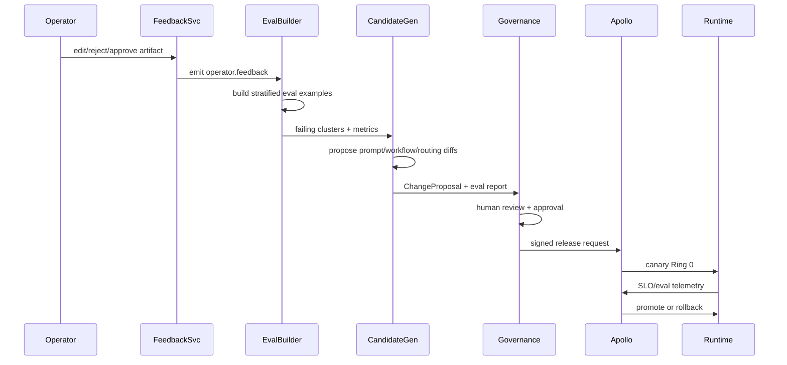

# ClearGlassInc Artemis — Self-Evolving AI Intelligence Platform Blueprint

## Executive Build Directive

ClearGlassInc Artemis is a mission-critical, coalition-aware intelligence platform built on Palantir Gotham, Foundry, AIP, and Apollo. It fuses live and historical data, reasons over an ontology-backed operational picture, captures operator feedback, and proposes safe self-upgrades to prompts, workflows, heuristics, and model routing under explicit human-approved guardrails.

The design assumes secure Canadian enterprise and public-sector operations, including environmental cyber-risk domains such as ionospheric physics, space weather, GNSS degradation, HF radio disruption, satellite interference, and communication-infrastructure resilience.

## System Architecture

### Palantir Platform Responsibilities

- **Gotham**: operational intelligence, investigations, entity tracking, graph exploration, case management, and mission command workflows.
- **Foundry**: data integration, pipelines, ontology objects, object actions, application logic, lineage, operational analytics, and governed data products.
- **AIP**: copilots, tool-using agents, workflow automation, prompt governance, evaluations, model routing, and human-in-the-loop AI operations.
- **Apollo**: deployment orchestration, signed releases, canary rings, policy bundle delivery, runtime controls, kill switches, rollback, and continuous compliance.

```mermaid
flowchart TB
  subgraph UI[Frontend]
    analyst[Analyst Workbench]
    commander[Commander Console]
    env[Environmental Threat Dashboard]
    gov[Governance Studio]
  end

  subgraph API[API and Backend]
    gateway[API Gateway]
    auth[AuthN/AuthZ]
    policy[Policy Enforcement Point]
    caseSvc[Case Service]
    workflowSvc[Workflow Orchestrator]
    feedbackSvc[Feedback Service]
    actionSvc[Action Package Service]
  end

  subgraph STREAM[Streaming and Events]
    bus[Kafka/Pulsar Event Bus]
    raw[intel.raw]
    norm[intel.normalized]
    alerts[intel.alerts]
    feedback[operator.feedback]
    releases[release.telemetry]
  end

  subgraph FOUNDRY[Foundry Data and Ontology]
    bronze[Bronze Raw Data Products]
    silver[Silver Normalized Data Products]
    gold[Gold Mission Data Products]
    ontology[Ontology Objects, Links, Actions]
    transforms[Pipeline Builder / Code Repos]
  end

  subgraph GOTHAM[Gotham Operations]
    graph[Entity Graph]
    timeline[Timeline and Map]
    cases[Investigations and Cases]
    missions[Missions and Watchlists]
  end

  subgraph AIP[AIP Orchestration]
    copilots[Copilots]
    agents[Multi-Agent Runtime]
    tools[Policy-Gated Tools]
    router[Model Router]
    evals[Evaluation Harness]
    promptOps[Prompt and Workflow Registry]
  end

  subgraph OBS[Observability and Governance]
    otel[OpenTelemetry]
    audit[Immutable Audit Ledger]
    metrics[Mission Metrics]
    drift[Drift Detection]
    trust[Operator Trust Analytics]
  end

  subgraph APOLLO[Apollo Deployment]
    rings[Ring 0/1/2 Rollout]
    signed[Signed Bundles]
    rollback[Rollback and Kill Switch]
    runtime[Runtime Control Plane]
  end

  UI --> gateway --> auth --> policy
  policy --> caseSvc --> cases
  policy --> workflowSvc --> agents
  workflowSvc --> actionSvc
  feedbackSvc --> feedback
  gateway --> bus
  bus --> raw --> bronze --> transforms --> silver --> gold --> ontology
  ontology --> graph
  ontology --> timeline
  ontology --> tools
  tools --> router
  agents --> tools
  agents --> evals
  evals --> promptOps --> signed --> rings --> runtime
  runtime --> rollback
  gateway --> otel --> audit
  evals --> metrics --> drift --> rollback
```

### Layered Production Blueprint

| Layer | Implementation blueprint |
|---|---|
| Frontend | TypeScript/React mission UI with graph, timeline, map, alert queue, evidence viewer, approval inbox, self-upgrade review board, and environmental threat dashboard. |
| API gateway | mTLS, JWT validation, request signing, rate limits, tenant/mission context injection, audit correlation IDs, and schema validation. |
| Backend services | Python FastAPI services for intake, cases, ontology queries, AIP tool execution, action packages, feedback, evaluations, release proposals, and governance review. |
| Event bus | Kafka or Pulsar topics for raw events, normalized observations, ontology updates, alerts, feedback, eval jobs, release telemetry, and audit envelopes. |
| Data layer | Foundry bronze/silver/gold data products with schema contracts, quality gates, lineage, dedupe, temporal modeling, and feature materializations. |
| Ontology layer | Foundry ontology object types, link types, actions, permissions, confidence scores, provenance fields, temporal state, and mission context. |
| AI layer | AIP copilots, deterministic workflow graphs, tool-using agents, model router, retrieval policies, eval harnesses, prompt registry, and workflow registry. |
| Policy layer | OPA/Rego policy bundles plus Foundry/Gotham permissions for need-to-know, row, column, entity, edge, action, model, prompt, and coalition controls. |
| Observability | OpenTelemetry traces, metrics, structured logs, immutable audit ledger, model telemetry, prompt telemetry, eval dashboards, SLO alerts, and replayable incidents. |
| Deployment | Apollo promotion rings, signed artifacts, deployment attestations, runtime config, canaries, rollback, break-glass controls, and environment-specific policy packs. |

## Data and Ontology

The ontology is the operational contract shared by humans, backend services, agents, and governance controls. It makes every recommendation explainable because each object, relationship, and action carries confidence, lineage, temporal validity, mission context, and permissions.

### Core Entity Types

| Entity | Purpose | Key attributes |
|---|---|---|
| `Person` | Analysts, commanders, operators, subjects, contacts. | clearance, organization, roles, mission assignments. |
| `Organization` | Enterprises, agencies, coalition partners, vendors, threat groups. | sector, jurisdiction, releasability, risk tier. |
| `Facility` | Data centers, offices, towers, ground stations, warehouses. | geohash, criticality, owner, backup systems. |
| `Asset` | Servers, endpoints, radios, GNSS receivers, satellites, routers. | asset class, owner, mission criticality, dependencies. |
| `NetworkSignal` | Netflow, DNS, endpoint, telemetry, latency, packet loss. | source, destination, protocol, timing, confidence. |
| `EnvironmentalSignal` | Space weather, ionospheric telemetry, solar bursts, D-region changes. | log_NF2, Kp, TEC, absorption, station, model version. |
| `Observation` | Atomic normalized fact from a source or model. | source reliability, observed time, value, uncertainty. |
| `Indicator` | IOC, anomaly, vulnerability, or environmental threshold breach. | indicator type, severity, first seen, last seen. |
| `Event` | Correlated operational occurrence. | event type, severity, affected entities, temporal window. |
| `Case` | Investigation container. | status, assignee, mission, evidence set, decision log. |
| `Mission` | Operational context and objective. | purpose, scope, data boundaries, approvers, SLOs. |
| `ActionPackage` | Proposed operational response. | COA, risk, required approvals, rollback, status. |
| `AIArtifact` | Prompt output, summary, recommendation, eval candidate. | model, prompt version, workflow version, citations. |
| `ChangeProposal` | Self-upgrade candidate. | diff, metrics, blast radius, reviewers, rollback plan. |

### Relationship Types

```sql
create type relationship_type as enum (
  'OBSERVED_AT',
  'AFFECTS',
  'DEPENDS_ON',
  'LOCATED_AT',
  'OWNED_BY',
  'PART_OF_MISSION',
  'CORRELATED_WITH',
  'DERIVED_FROM',
  'CONTRADICTS',
  'SUPPORTS',
  'REQUIRES_APPROVAL_FROM',
  'PROPOSED_BY_AGENT',
  'APPROVED_BY_OPERATOR',
  'DEPLOYED_BY_APOLLO'
);
```

### Ontology Schema Skeleton

```sql
create table artemis_object (
  object_id uuid primary key,
  object_type text not null,
  display_name text not null,
  attributes jsonb not null default '{}',
  confidence numeric(5,4) not null check (confidence between 0 and 1),
  classification text not null check (classification in ('U','CUI','SECRET','TS')),
  releasability text[] not null default '{}',
  compartments text[] not null default '{}',
  mission_ids uuid[] not null default '{}',
  lineage jsonb not null,
  provenance_hash text not null,
  source_reliability numeric(5,4) not null default 0.5,
  valid_from timestamptz not null,
  valid_to timestamptz,
  system_from timestamptz not null default now(),
  system_to timestamptz,
  created_by text not null,
  updated_by text not null
);

create table artemis_link (
  link_id uuid primary key,
  src_object_id uuid not null references artemis_object(object_id),
  dst_object_id uuid not null references artemis_object(object_id),
  relationship relationship_type not null,
  attributes jsonb not null default '{}',
  confidence numeric(5,4) not null check (confidence between 0 and 1),
  evidence_refs text[] not null,
  classification text not null,
  releasability text[] not null default '{}',
  compartments text[] not null default '{}',
  mission_ids uuid[] not null default '{}',
  valid_from timestamptz not null,
  valid_to timestamptz,
  system_from timestamptz not null default now(),
  system_to timestamptz
);
```

### Environmental Cyber-Risk Extension

```sql
create table environmental_signal (
  signal_id uuid primary key,
  station_id text not null,
  source_system text not null,
  observed_at timestamptz not null,
  log_nf2 numeric(4,2),
  total_electron_content numeric(8,3),
  solar_radio_flux numeric(8,3),
  kp_index numeric(4,2),
  d_region_absorption_db numeric(8,3),
  affected_capabilities text[] not null,
  confidence numeric(5,4) not null,
  model_version text not null,
  lineage jsonb not null
);

create view environmental_threat_level as
select
  signal_id,
  observed_at,
  case
    when log_nf2 < 5.4 then 'GREEN'
    when log_nf2 between 5.4 and 5.8 then 'YELLOW'
    else 'RED'
  end as threat_level,
  array_remove(array[
    case when total_electron_content > 80 then 'GNSS_PHASE_DISTORTION' end,
    case when d_region_absorption_db > 8 then 'HF_ABSORPTION' end,
    case when solar_radio_flux > 200 then 'SATELLITE_INTERFERENCE' end
  ], null) as likely_impacts
from environmental_signal;
```

This extension lets ClearGlassInc Artemis correlate space-weather conditions with corporate network latency, GNSS accuracy degradation, satellite data quality, logistics disruption, and communication failover risk.

## AI and Agent Design

### Copilots

1. **Analyst Copilot**: retrieves ontology objects, resolves entities, builds timelines, drafts briefs, identifies evidence gaps, and asks for operator validation when confidence is low.
2. **Commander Copilot**: compares courses of action, estimates mission impact, prepares action packages, and highlights required approvals.
3. **Environmental Cyber-Risk Copilot**: correlates ionospheric telemetry, GNSS anomalies, HF degradation, and infrastructure dependencies.
4. **Governance Copilot**: reviews prompt diffs, workflow diffs, eval results, model cards, policy denials, and release proposals.
5. **Apollo Operations Copilot**: summarizes canary status, SLO drift, rollback readiness, and runtime policy health.

### Multi-Agent Workflow Graph

```yaml
workflow_id: artemis-machine-speed-intel-v1
mission_modes:
  - cyber_defense
  - infrastructure_resilience
  - environmental_cyber_risk
agents:
  triage_agent:
    inputs: [normalized_event, mission_context]
    outputs: [severity, relevant_entities, recommended_next_agents]
  enrichment_agent:
    tools: [ontology_query, hybrid_search, source_reputation]
    outputs: [evidence_bundle]
  correlation_agent:
    tools: [graph_neighbors, temporal_join, geospatial_join]
    outputs: [correlated_event_graph]
  environmental_agent:
    tools: [space_weather_query, gnss_quality_query, dependency_graph]
    outputs: [environmental_risk_assessment]
  summarization_agent:
    tools: [citation_builder, uncertainty_calibrator]
    outputs: [analyst_brief]
  recommendation_agent:
    tools: [coa_generator, risk_model, rollback_planner]
    outputs: [action_package_draft]
  approval_gate_agent:
    tools: [policy_check, dual_control_check, audit_write]
    outputs: [approved_or_blocked_action]
  learning_agent:
    tools: [feedback_to_eval, candidate_generator, regression_eval]
    outputs: [change_proposal]
hard_controls:
  autonomous_external_actions: false
  operational_action_requires_human_approval: true
  prompt_release_requires_governance_approval: true
  cross_compartment_disclosure: false
  model_route_must_match_classification: true
```

### Operationally Significant Action Gates

Any action that can affect availability, confidentiality, integrity, safety, contracts, reputation, or coalition disclosure requires explicit approval. Examples include isolating a network segment, changing firewall policy, notifying a third party, sharing an intelligence product outside a compartment, re-tasking a sensor, promoting a new prompt to production, or changing a model route for classified workflows.

## Self-Improvement Loop

ClearGlassInc Artemis improves itself by creating proposed changes, never by silently changing goals or production behavior. The loop is intentionally conservative: observe, evaluate, propose, review, canary, monitor, promote, or roll back.

### Signal Capture

Signals are collected from:

- Operator accepts, rejects, edits, comments, and confidence overrides.
- Query logs, retrieval misses, abandoned workflows, and manual workaround patterns.
- Alert outcomes: true positive, false positive, false negative, duplicate, late, stale, or unsafe.
- Mission results: time-to-triage, time-to-decision, operational disruption, escalation quality, and after-action reviews.
- Model telemetry: prompt version, model route, tool path, latency, token cost, refusal behavior, citation accuracy, and policy denials.
- Environmental outcomes: GNSS accuracy loss, HF outage, latency spike, satellite interference, and logistics disruption windows.

```python
from datetime import datetime
from enum import Enum
from pydantic import BaseModel, Field

class FeedbackSignal(str, Enum):
    ACCEPTED = 'accepted'
    REJECTED = 'rejected'
    EDITED = 'edited'
    FALSE_POSITIVE = 'false_positive'
    FALSE_NEGATIVE = 'false_negative'
    DUPLICATE = 'duplicate'
    LATE = 'late'
    UNSAFE = 'unsafe'
    HIGH_VALUE = 'high_value'

class FeedbackEvent(BaseModel):
    event_id: str
    mission_id: str
    actor_id: str
    artifact_id: str
    artifact_type: str
    signal: FeedbackSignal
    correction_text: str | None = None
    reason_codes: list[str] = Field(default_factory=list)
    outcome_score: float | None = Field(default=None, ge=0, le=1)
    prompt_version: str
    workflow_version: str
    model_route: str
    tool_trace_id: str
    latency_ms: int
    observed_at: datetime
    classification: str
    compartments: list[str]
```

### Upgrade Lifecycle



### Release Gate

```python
from dataclasses import dataclass

@dataclass(frozen=True)
class EvalScore:
    candidate_id: str
    precision: float
    recall: float
    citation_accuracy: float
    leakage_violations: int
    unsafe_action_violations: int
    p95_latency_ms: int
    operator_trust_delta: float
    cost_delta_pct: float


def release_gate(champion: EvalScore, challenger: EvalScore) -> bool:
    return all([
        challenger.leakage_violations == 0,
        challenger.unsafe_action_violations == 0,
        challenger.precision >= champion.precision + 0.015,
        challenger.recall >= champion.recall - 0.005,
        challenger.citation_accuracy >= 0.97,
        challenger.p95_latency_ms <= 1200,
        challenger.operator_trust_delta >= 0,
        challenger.cost_delta_pct <= 20.0,
    ])
```

## Full-Stack Implementation

### Repository Layout

```text
artemis/
  frontend/
    src/app/
    src/components/graph/
    src/components/approvals/
    src/components/environmental-risk/
  services/
    api_gateway/
    intake_service/
    ontology_service/
    agent_service/
    feedback_service/
    eval_service/
    release_service/
  pipelines/
    foundry_transforms/
    quality_rules/
    feature_materializations/
  policy/
    rego/
    tests/
  agents/
    prompts/
    workflows/
    tools/
    evals/
  deploy/
    apollo/
    helm/
    runtime_config/
```

### API Surface

```http
POST /v1/intel/intake
POST /v1/environmental/signals
POST /v1/ontology/query
POST /v1/agents/run
POST /v1/cases
POST /v1/action-packages
POST /v1/action-packages/{id}/approve
POST /v1/action-packages/{id}/reject
POST /v1/feedback
GET  /v1/evals/releases
POST /v1/releases/{id}/approve
POST /v1/releases/{id}/rollback
POST /v1/legal/preflight
POST /v1/legal/work-products
GET  /v1/legal/matters/{matter_id}
GET  /v1/audit/{correlation_id}
```

### Frontend Panels

- **Alert Queue**: ranked alerts with severity, confidence, mission impact, and policy visibility.
- **Entity Graph**: Gotham-style graph of entities, links, confidence, evidence, and temporal state.
- **Timeline/Map**: time and geospatial correlation for cyber and environmental events.
- **Action Inbox**: approval packages with evidence, COAs, risk, rollback, and dual-control status.
- **Self-Upgrade Board**: prompt/workflow diffs, eval deltas, canary status, reviewer comments, and Apollo promotion state.
- **Legal Intelligence Console**: legal preflight decisions, authority packets, matter files, risk classifications, counsel-review queues, and immutable audit trails.
- **Environmental Threat Dashboard**: log NF2, TEC, solar flux, D-region absorption, GNSS quality, impacted facilities, and recommended mitigation.

## Security and Governance

### Access Model

ClearGlassInc Artemis uses a combined RBAC, ABAC, and ReBAC model:

- **RBAC**: analyst, commander, governance reviewer, system operator, auditor.
- **ABAC**: clearance, mission, purpose, compartment, nationality, organization, device posture, network zone, time, and emergency state.
- **ReBAC**: user-to-mission, user-to-case, asset-to-organization, report-to-coalition, and approver-to-action relationships.

### Policy Guarantees

- Need-to-know is enforced before records are returned, before prompts are constructed, and before model inference.
- Row, column, entity, relationship, and action-level controls are checked independently.
- Coalition boundaries are represented as releasability caveats on objects, links, reports, prompts, and outputs.
- Zero-trust tool execution uses workload identity, mTLS, signed requests, sandboxing, egress allowlists, and short-lived credentials.
- Immutable logs record every data read, prompt, model route, tool call, evidence citation, approval, denial, release, and rollback.
- Model governance requires model cards, eval scorecards, approved use cases, known limitations, red-team results, and retirement plans.
- Prompt governance requires versioned diffs, eval evidence, reviewers, signed approval, Apollo canary, and rollback plan.


## Supreme Legal Intelligence Division

### Legal Operating Mandate

ClearGlassInc Artemis includes a **Supreme Legal Intelligence Division**: a policy-gated legal-analysis, compliance, investigation, drafting, privacy, intellectual-property, employment, litigation-risk, and corporate-governance layer that constrains technical execution before any autonomous action can affect contracts, regulated records, user data, evidence, deployments, storefronts, agent workflows, or external communications.

The division is **legal information and analytical support only**. It does not claim to be licensed counsel and must route jurisdiction-specific, high-risk, privileged, contested, or operationally significant legal conclusions to appropriately licensed human counsel before execution.

### Legal Prime Directive

For every legal or legally sensitive request, Artemis must produce jurisdiction-specific, citation-supported, operationally useful analysis and must never replace controlling authority with intuition, convenience, unsupported business preference, or speculative reasoning. The legal layer must:

- Identify jurisdiction, governing law, forum, venue, regulator, tribunal, or court where relevant.
- Determine procedural posture, parties, legal roles, contractual obligations, statutory duties, regulatory duties, deadlines, limitation periods, burdens, remedies, and enforcement realities.
- Separate confirmed facts from assumptions and unresolved factual gaps.
- Prefer primary authority and controlling contracts over summaries or general reasoning.
- Classify legal, operational, financial, evidentiary, privacy, privilege, governance, and reputational risk.
- Preserve privilege, confidentiality, evidence integrity, chain of custody, document-retention obligations, and litigation holds.
- Prevent unsupported legal conclusions from entering automated system decisions.

### Authority Hierarchy

Artemis applies legal authority in this order and must not elevate weaker sources above stronger sources:

1. Controlling constitutional, statutory, regulatory, and contractual authority.
2. Binding judicial decisions.
3. Binding procedural and evidentiary rules.
4. Official court, regulator, tribunal, tax authority, or government guidance.
5. Persuasive judicial authority.
6. Recognized secondary sources.
7. Industry standards and established practice.
8. General legal reasoning only where stronger authority does not resolve the issue.

Every material legal proposition should carry the authority name, jurisdiction, issuing body, date, section/rule/paragraph/page/clause pinpoint, current status, and whether it is binding or persuasive. Artemis must verify currency before relying on authority and must explicitly state if authority is incomplete, outdated, amended, repealed, reversed, stayed, superseded, limited, conflicting, or unavailable.

### Specialist Legal Agents

| Agent | Scope | Required outputs |
|---|---|---|
| Contract Command Agent | Agreements, templates, service terms, procurement, NDAs, MSA/SOW terms, notices, acceptance, renewals, termination, indemnities, liability caps, privacy, cybersecurity, IP, assignment, audit rights, disputes, survival. | Clause extraction, risk rating, inconsistencies, missing schedules, unenforceability risks, negotiation opportunities, proposed replacement language. |
| Litigation and Dispute Agent | Claims, defences, counterclaims, limitation periods, venue, standing, evidence, motions, damages, injunctions, discovery, settlement leverage, enforcement. | Elements matrix, evidence map, procedural prerequisites, risk rating, preservation plan, immediate actions. |
| Compliance Command Agent | Regulatory obligations, owners, controls, evidence, reporting, retention, approvals, exceptions, audits, deficiencies, remediation, board/executive reporting. | Auditable compliance matrix with requirement, authority, owner, control, evidence, frequency, status, deficiency, remediation, deadline. |
| Investigation and Forensics Agent | Chronology, entities, ownership/control, communications, approvals, money flows, access, metadata, inconsistencies, corroboration, conflicts, chain of custody. | Evidence-preserving investigation plan, hash/metadata protocol, witness/evidence map, notification issues. |
| Legal Drafting Agent | Policies, clauses, notices, letters, memoranda, board briefings, demand responses, contractual language. | Clean draft, redline where practical, commentary, fallback language, risk rating, business consequence. |
| Employment and Workplace Agent | Worker classification, employment standards, termination/severance, human rights, accommodation, OHS, investigations, privacy, reprisal, payroll, records. | Default jurisdiction is Ontario, Canada unless facts establish another jurisdiction; output entitlement/risk matrix and counsel-review triggers. |
| Privacy, Data, and AI Governance Agent | Collection, inference, generation, transfer, storage, model training, personal/confidential data, automated decisions, notices, consent, retention, safeguards, breaches. | Processing map, legal basis, data-minimization check, transfer review, breach/human-review triggers, model-training restrictions. |
| Intellectual-Property Agent | Software, models, agents, websites, stores, content, branding, datasets, third-party APIs, open source, generated content, trade secrets. | Ownership/licence map, attribution/copyleft obligations, infringement/indemnity/takedown risk, dataset/model-training rights. |
| Corporate and Governance Agent | Entity status, signing authority, resolutions, approvals, fiduciary duties, conflicts, related-party transactions, securities, records, beneficial ownership, insolvency. | Authority and approval matrix, board oversight obligations, personal-liability flags. |

### Legal Control Over Technical Execution

Before autonomous repair, deployment, data migration, workflow execution, repository change, contract-connected action, production modification, external communication, or user-data processing, Artemis runs a legal preflight. If a credible restriction exists, the affected action is stopped, state is preserved, the issue is documented, controlling authority is identified, risk is classified, a compliant path is proposed, and the package is escalated for authorized legal review while unrelated safe work continues.

Actions are blocked or escalated when they could violate a contract, breach confidentiality, infringe intellectual property, alter or destroy evidence, violate a litigation hold, trigger privacy notice or consent duties, modify regulated records, affect payment/customer/employee rights, create deceptive representations, circumvent access controls, violate platform terms, change tax treatment, trigger licence obligations, require regulatory approval, or create a material corporate disclosure obligation.

### Legal Risk Taxonomy

| Level | Triggers |
|---|---|
| Critical | Criminal exposure, active regulatory breach, privilege waiver, evidence destruction, litigation-hold violation, unauthorized protected-data disclosure, material contractual breach, unlicensed regulated activity, immediate injunction risk, director/officer personal liability, imminent limitation deadline, fraud or material misrepresentation risk. |
| High | Significant damages exposure, termination-right trigger, regulatory investigation risk, employment reprisal/discrimination exposure, material privacy non-compliance, IP infringement, unenforceable core agreement, missing mandatory filing, serious governance failure. |
| Medium | Ambiguous obligations, weak contractual protection, incomplete compliance evidence, procedural defect, unclear ownership, missing policy, correctable notice failure, moderate dispute risk. |
| Low | Drafting inconsistency, non-material technical defect, minor documentation gap, best-practice improvement, non-binding guidance issue. |

### Standard Legal Deliverable Format

Unless a narrower format is required, the division outputs: executive conclusion, confirmed facts, material assumptions, governing authority, legal analysis, risks and deficiencies, recommended action, draft language or deliverable, sources, counsel-review notice, and one final status: `LEGALLY SUPPORTED — PRIMARY AUTHORITY VERIFIED`, `CONDITIONALLY SUPPORTED — MATERIAL FACTS REQUIRED`, `LEGALLY UNCERTAIN — CONFLICTING OR UNSETTLED AUTHORITY`, `COUNSEL AUTHORIZATION REQUIRED`, `PROHIBITED OR HIGH-RISK ACTION IDENTIFIED`, or `INSUFFICIENT RELIABLE AUTHORITY`.

### Implementation Pattern

```python
from dataclasses import dataclass, field
from enum import Enum

class LegalStatus(str, Enum):
    SUPPORTED = "LEGALLY_SUPPORTED_PRIMARY_AUTHORITY_VERIFIED"
    CONDITIONAL = "CONDITIONALLY_SUPPORTED_MATERIAL_FACTS_REQUIRED"
    UNCERTAIN = "LEGALLY_UNCERTAIN_CONFLICTING_OR_UNSETTLED_AUTHORITY"
    COUNSEL_REQUIRED = "COUNSEL_AUTHORIZATION_REQUIRED"
    PROHIBITED = "PROHIBITED_OR_HIGH_RISK_ACTION_IDENTIFIED"
    INSUFFICIENT = "INSUFFICIENT_RELIABLE_AUTHORITY"

class LegalRisk(str, Enum):
    LOW = "low"
    MEDIUM = "medium"
    HIGH = "high"
    CRITICAL = "critical"

@dataclass(frozen=True)
class LegalPreflightRequest:
    action: str
    jurisdiction: str | None
    governing_law: str | None
    forum: str | None
    procedural_posture: str
    affected_records: list[str] = field(default_factory=list)
    touches_personal_data: bool = False
    touches_contract_rights: bool = False
    touches_evidence_or_hold: bool = False
    touches_external_communications: bool = False

@dataclass(frozen=True)
class LegalPreflightDecision:
    allowed: bool
    risk: LegalRisk
    status: LegalStatus
    rationale: str
    required_approvers: list[str]
    missing_facts: list[str]
    audit_tags: list[str]

CRITICAL_BLOCKERS = {
    "litigation_hold",
    "privilege_waiver",
    "regulated_record_modification",
    "unauthorized_personal_data_disclosure",
}

def run_legal_preflight(req: LegalPreflightRequest, flags: set[str]) -> LegalPreflightDecision:
    missing = []
    if not req.jurisdiction:
        missing.append("jurisdiction")
    if req.touches_contract_rights and not req.governing_law:
        missing.append("governing_law_or_contract_clause")

    if flags & CRITICAL_BLOCKERS or req.touches_evidence_or_hold:
        return LegalPreflightDecision(
            allowed=False,
            risk=LegalRisk.CRITICAL,
            status=LegalStatus.PROHIBITED,
            rationale="Action may affect privilege, protected data, regulated records, or preserved evidence.",
            required_approvers=["licensed_counsel", "governance_reviewer", "system_owner"],
            missing_facts=missing,
            audit_tags=sorted(flags | {"legal_preflight_block"}),
        )

    if missing or req.touches_personal_data or req.touches_external_communications:
        return LegalPreflightDecision(
            allowed=False,
            risk=LegalRisk.HIGH if req.touches_personal_data else LegalRisk.MEDIUM,
            status=LegalStatus.COUNSEL_REQUIRED if req.touches_personal_data else LegalStatus.CONDITIONAL,
            rationale="Action requires material facts, authority verification, and human approval before execution.",
            required_approvers=["governance_reviewer", "licensed_counsel"],
            missing_facts=missing,
            audit_tags=sorted(flags | {"legal_preflight_escalate"}),
        )

    return LegalPreflightDecision(
        allowed=True,
        risk=LegalRisk.LOW,
        status=LegalStatus.CONDITIONAL,
        rationale="No legal blocker detected from supplied facts; continue with audit logging and reversible execution.",
        required_approvers=[],
        missing_facts=missing,
        audit_tags=sorted(flags | {"legal_preflight_pass"}),
    )
```

## Code Examples

### Python FastAPI Intake Service

```python
from datetime import datetime, timezone
from uuid import uuid4
from fastapi import Depends, FastAPI, HTTPException
from pydantic import BaseModel, Field

app = FastAPI(title='ClearGlassInc Artemis Intake API')

class MissionContext(BaseModel):
    mission_id: str
    actor_id: str
    clearance: str
    compartments: list[str]
    coalition: list[str] = Field(default_factory=list)
    purpose: str

class IntelEvent(BaseModel):
    source: str
    event_type: str
    payload: dict
    observed_at: datetime
    classification: str
    compartments: list[str]

async def current_context() -> MissionContext:
    return MissionContext(
        mission_id='mission-burlington-resilience',
        actor_id='operator-001',
        clearance='CUI',
        compartments=['CA-ENTERPRISE'],
        purpose='infrastructure_defense',
    )

@app.post('/v1/intel/intake')
async def intake_event(event: IntelEvent, context: MissionContext = Depends(current_context)):
    decision = await opa_allow('artemis.ingest', {'event': event.model_dump(), 'context': context.model_dump()})
    if not decision['allow']:
        await audit('ingest_denied', context.actor_id, decision)
        raise HTTPException(status_code=403, detail=decision['reason'])

    normalized = {
        'event_id': str(uuid4()),
        'source': event.source,
        'event_type': event.event_type,
        'payload': event.payload,
        'observed_at': event.observed_at.isoformat(),
        'ingested_at': datetime.now(timezone.utc).isoformat(),
        'classification': event.classification,
        'compartments': event.compartments,
        'lineage': {'api': 'intake_service', 'schema': 'IntelEvent.v1'},
    }
    await publish('intel.raw', normalized)
    await audit('intel_intake_accepted', context.actor_id, {'event_id': normalized['event_id']})
    return {'status': 'accepted', 'event_id': normalized['event_id']}
```

### Environmental Signal Handler

```python
class EnvironmentalSignalIn(BaseModel):
    station_id: str
    source_system: str
    observed_at: datetime
    log_nf2: float | None = None
    total_electron_content: float | None = None
    solar_radio_flux: float | None = None
    kp_index: float | None = None
    d_region_absorption_db: float | None = None
    model_version: str


def classify_environmental_threat(signal: EnvironmentalSignalIn) -> tuple[str, list[str]]:
    impacts: list[str] = []
    if signal.total_electron_content and signal.total_electron_content > 80:
        impacts.append('GNSS_PHASE_DISTORTION')
    if signal.d_region_absorption_db and signal.d_region_absorption_db > 8:
        impacts.append('HF_ABSORPTION')
    if signal.solar_radio_flux and signal.solar_radio_flux > 200:
        impacts.append('SATELLITE_INTERFERENCE')

    if signal.log_nf2 is None:
        return 'UNKNOWN', impacts
    if signal.log_nf2 < 5.4:
        return 'GREEN', impacts
    if signal.log_nf2 <= 5.8:
        return 'YELLOW', impacts
    return 'RED', impacts

@app.post('/v1/environmental/signals')
async def ingest_environmental_signal(signal: EnvironmentalSignalIn, context: MissionContext = Depends(current_context)):
    threat_level, impacts = classify_environmental_threat(signal)
    event = {
        'event_id': str(uuid4()),
        'event_type': 'environmental_space_weather_signal',
        'threat_level': threat_level,
        'likely_impacts': impacts,
        'payload': signal.model_dump(mode='json'),
        'mission_id': context.mission_id,
    }
    await publish('intel.normalized', event)
    if threat_level in {'YELLOW', 'RED'}:
        await publish('intel.alerts', event)
    await audit('environmental_signal_ingested', context.actor_id, event)
    return event
```

### Ontology-Driven Query Tool

```python
class OntologyQuery(BaseModel):
    template: str
    parameters: dict
    limit: int = Field(default=25, ge=1, le=200)
    context: MissionContext

async def query_ontology_tool(query: OntologyQuery) -> dict:
    decision = await opa_allow('artemis.ontology.query', query.model_dump())
    if not decision['allow']:
        await audit('ontology_query_denied', query.context.actor_id, decision)
        return {'rows': [], 'denied': True, 'reason': decision['reason']}

    rows = await foundry_ontology_query(
        template=query.template,
        parameters=query.parameters,
        mission_id=query.context.mission_id,
        actor_id=query.context.actor_id,
        limit=query.limit,
    )
    safe_rows = await apply_field_masks(rows, query.context)
    await audit('ontology_query_allowed', query.context.actor_id, {'template': query.template, 'count': len(safe_rows)})
    return {'rows': safe_rows, 'citations': [row['lineage_ref'] for row in safe_rows if 'lineage_ref' in row]}
```

### Workflow State Machine

```python
from enum import Enum

class ActionState(str, Enum):
    DRAFT = 'draft'
    PENDING_APPROVAL = 'pending_approval'
    APPROVED = 'approved'
    REJECTED = 'rejected'
    EXECUTED = 'executed'
    ROLLED_BACK = 'rolled_back'

TRANSITIONS = {
    ActionState.DRAFT: {ActionState.PENDING_APPROVAL},
    ActionState.PENDING_APPROVAL: {ActionState.APPROVED, ActionState.REJECTED},
    ActionState.APPROVED: {ActionState.EXECUTED, ActionState.ROLLED_BACK},
    ActionState.EXECUTED: {ActionState.ROLLED_BACK},
    ActionState.REJECTED: set(),
    ActionState.ROLLED_BACK: set(),
}

def transition_action(current: ActionState, target: ActionState) -> ActionState:
    if target not in TRANSITIONS[current]:
        raise ValueError(f'invalid action transition: {current} -> {target}')
    return target
```

### Model Router

```python
class ModelRouteRequest(BaseModel):
    task: str
    classification: str
    latency_budget_ms: int
    requires_deep_reasoning: bool
    requires_sovereign_runtime: bool = True


def route_model(req: ModelRouteRequest) -> str:
    if req.classification in {'SECRET', 'TS'} or req.requires_sovereign_runtime:
        if req.requires_deep_reasoning:
            return 'sovereign-reasoning-large'
        return 'sovereign-balanced-medium'
    if req.task in {'triage', 'dedupe'} and req.latency_budget_ms <= 600:
        return 'low-latency-small'
    if req.requires_deep_reasoning:
        return 'reasoning-large'
    return 'balanced-medium'
```

### Policy-as-Code

```rego
package artemis.action

default allow := false

allow {
  input.user.clearance_rank >= input.action.required_clearance_rank
  every c in input.action.compartments { c in input.user.compartments }
  input.user.mission_id == input.action.mission_id
  input.action.human_approved == true
  input.action.risk_score <= 0.45
  not crosses_coalition_boundary
}

crosses_coalition_boundary {
  some caveat in input.action.releasability
  not caveat in input.user.coalition
}
```

### Eval Pipeline

```python
async def build_eval_examples(feedback_events: list[FeedbackEvent]) -> list[dict]:
    examples: list[dict] = []
    for feedback in feedback_events:
        if feedback.signal in {
            FeedbackSignal.EDITED,
            FeedbackSignal.REJECTED,
            FeedbackSignal.FALSE_POSITIVE,
            FeedbackSignal.FALSE_NEGATIVE,
            FeedbackSignal.UNSAFE,
        }:
            artifact = await artifact_store_get(feedback.artifact_id)
            examples.append({
                'input': artifact['input_context'],
                'observed_output': artifact['output'],
                'expected_output': feedback.correction_text,
                'reason_codes': feedback.reason_codes,
                'labels': {
                    'mission_id': feedback.mission_id,
                    'signal': feedback.signal.value,
                    'classification': feedback.classification,
                    'compartments': feedback.compartments,
                },
                'versions': {
                    'prompt': feedback.prompt_version,
                    'workflow': feedback.workflow_version,
                    'model_route': feedback.model_route,
                },
            })
    return examples

async def propose_prompt_candidate(cluster_id: str, failures: list[dict]) -> dict:
    candidate = await aip_generate_change_candidate(
        objective='reduce repeated failure pattern without expanding authority',
        failing_examples=failures,
        allowed_change_types=['prompt_instruction', 'retrieval_order', 'confidence_threshold'],
        forbidden_change_types=['policy_bypass', 'autonomous_action', 'classification_downgrade'],
    )
    return {
        'candidate_id': str(uuid4()),
        'cluster_id': cluster_id,
        'diff': candidate['diff'],
        'safety_assertions': candidate['safety_assertions'],
        'rollback_plan': 'revert prompt registry pointer to champion version',
    }
```

## Environmental Threat Vector Cross-Reference

This blueprint cross-references the Phase 1 Environmental Threat Vector Mapping directive and treats ionospheric/space-weather effects as a first-class **Environmental Cyber-Risk** domain inside ClearGlassInc Artemis. The domain is defensive and operational: it maps public and partner telemetry to communication failure chains, client exposure, mitigation recommendations, and governed action packages.

### Phase 1 to Platform Capability Map

| Directive element | Artemis implementation | Palantir anchor | Primary output |
|---|---|---|---|
| CSA/NOAA/EISCAT/public ionospheric feed ingestion | `environmental.raw` and `environmental.normalized` streaming connectors with schema validation, provenance, and source reliability scores. | Foundry pipelines and datasets | Governed environmental telemetry data products |
| GREEN/YELLOW/RED thresholds | Deterministic `EnvironmentalRiskClassifier` service using log NF2 thresholds plus explainable contributing factors. | AIP tool + Foundry transform | Auditable alert severity and rationale |
| Burlington/GTA pilot use case | Mission-scoped asset exposure graph for logistics, surveying, utilities, aviation support, and GNSS/HF-dependent workflows. | Gotham entity graph + Foundry ontology | Pilot client brief and impact map |
| Environmental Threat Vector dashboard tile | React mission card backed by GraphQL subscriptions and ontology-driven status summaries. | Foundry app / Gotham workflow surface | Real-time command interface tile |
| 12-page client brief | AIP brief generator constrained to cited ontology evidence, confidence, uncertainty, and mitigation templates. | AIP copilot/tool workflow | Human-reviewable intelligence product |
| Phase 2 Environmental Cyber-Risk Framework | Versioned scoring model, eval suite, approval gates, and Apollo-controlled release rings. | AIP evaluations + Apollo | Governed B2B service line |

### Environmental Cyber-Risk Ontology Extension

```yaml
entities:
  EnvironmentalObservation:
    fields:
      - observation_id
      - observed_at
      - source_system
      - latitude
      - longitude
      - altitude_km
      - log_nf2
      - tec
      - kp_index
      - xray_flux
      - d_region_absorption_db
      - confidence
      - lineage_hash
      - classification
      - coalition_scope
  CommunicationDependency:
    fields:
      - dependency_id
      - asset_id
      - dependency_type   # GNSS, HF, SATCOM, OTHR, timing, network_backhaul
      - operational_role
      - tolerance_seconds
      - fallback_available
      - criticality
  EnvironmentalRiskAssessment:
    fields:
      - assessment_id
      - mission_id
      - region
      - severity          # GREEN, YELLOW, RED
      - score_0_10
      - threshold_basis
      - rationale
      - recommended_mitigations
      - model_version
      - prompt_version

relationships:
  - OBSERVATION_AFFECTS_REGION: EnvironmentalObservation -> Region
  - ASSET_DEPENDS_ON_COMMUNICATION: Asset -> CommunicationDependency
  - DEPENDENCY_EXPOSED_TO_OBSERVATION: CommunicationDependency -> EnvironmentalObservation
  - ASSESSMENT_RATES_ASSET: EnvironmentalRiskAssessment -> Asset
  - ASSESSMENT_SUPPORTS_ALERT: EnvironmentalRiskAssessment -> Alert
```

### Python Precision Classifier

```python
from dataclasses import dataclass
from enum import StrEnum

class EnvSeverity(StrEnum):
    GREEN = 'GREEN'
    YELLOW = 'YELLOW'
    RED = 'RED'

@dataclass(frozen=True)
class EnvironmentalTelemetry:
    log_nf2: float
    kp_index: float | None = None
    d_region_absorption_db: float | None = None
    source_confidence: float = 0.75

@dataclass(frozen=True)
class EnvironmentalAssessment:
    severity: EnvSeverity
    score_0_10: float
    rationale: list[str]
    mitigations: list[str]

def classify_environmental_risk(t: EnvironmentalTelemetry) -> EnvironmentalAssessment:
    rationale: list[str] = []
    if t.log_nf2 > 5.8:
        severity = EnvSeverity.RED
        base_score = 8.2
        rationale.append('log NF2 exceeds RED threshold > 5.8')
    elif t.log_nf2 >= 5.4:
        severity = EnvSeverity.YELLOW
        base_score = 5.8
        rationale.append('log NF2 is inside YELLOW threshold 5.4-5.8')
    else:
        severity = EnvSeverity.GREEN
        base_score = 2.0
        rationale.append('log NF2 remains below GREEN threshold < 5.4')

    if t.kp_index is not None and t.kp_index >= 5:
        base_score += 0.7
        rationale.append('geomagnetic activity is elevated at Kp >= 5')
    if t.d_region_absorption_db is not None and t.d_region_absorption_db >= 5:
        base_score += 0.8
        rationale.append('D-region absorption may degrade HF propagation')

    score = round(min(10.0, base_score) * t.source_confidence, 2)
    mitigations = [
        'verify GNSS-dependent workflows against tolerance bands',
        'activate alternate positioning/timing source if client threshold is exceeded',
        'increase monitoring cadence and capture operator feedback for evals',
    ]
    return EnvironmentalAssessment(severity, score, rationale, mitigations)
```

### Cross-Reference Rules for Agents

- Environmental agents must cite telemetry source, timestamp, transform version, threshold basis, confidence, and client exposure path before recommending action.
- Recommendations that alter operations, notify external parties, or change client workflow state require human approval and immutable audit logging.
- The self-improvement loop may propose threshold tuning, retrieval-order changes, or mitigation wording updates only after offline evals and governance approval; it may not autonomously expand mission scope or downgrade policy.
- Dashboard and brief generation must distinguish observed telemetry, modeled inference, and business-impact inference so operators can challenge the chain of reasoning.

## Scenario Walkthrough

1. **Live event enters**: a Burlington facility reports GNSS positioning drift while the environmental connector receives elevated log NF2 and TEC readings. The intake service validates schemas, records lineage, and emits `intel.raw` and `intel.normalized` events.
2. **Platform triages**: the triage agent assigns `YELLOW` environmental cyber-risk, then queries the Foundry ontology for logistics assets, GNSS receivers, facilities, and active missions within the affected region.
3. **Agents enrich and correlate**: the environmental agent links ionospheric telemetry to GNSS degradation, the correlation agent finds related network latency spikes, and the summarization agent drafts a cited brief with confidence and uncertainty.
4. **Recommendation is prepared**: the recommendation agent proposes three COAs: monitor, switch logistics workflows to assisted positioning, or suspend critical GNSS-dependent operations for a defined window. Each COA includes risk, assumptions, impacted assets, and rollback.
5. **Approval gate triggers**: because suspending operations affects business continuity, the approval gate blocks execution and sends an action package to a commander with dual-control requirements.
6. **Operator decides**: the commander approves assisted positioning, rejects suspension as too disruptive, and adds the correction: “Require client-specific tolerance check before recommending suspension.”
7. **Feedback becomes evals**: the feedback service captures the rejection, correction, prompt version, workflow version, model route, latency, and outcome. The eval builder adds this as a regression example for environmental risk recommendations.
8. **Self-upgrade proposed**: the learning agent proposes a workflow change that inserts a `business_tolerance_check` before any suspension recommendation. Offline evals show improved precision and operator trust with no policy violations.
9. **Governance approves**: reviewers inspect the diff, eval report, blast radius, and rollback plan. They approve the release.
10. **Apollo rolls out safely**: Apollo deploys the workflow to Ring 0, monitors latency, precision, recall, trust delta, and policy denials, then promotes to Ring 1 or rolls back automatically if thresholds fail.

## Production Metrics

| Metric | Target |
|---|---:|
| Triage p95 latency | < 600 ms |
| Analyst brief p95 latency | < 5 s |
| Ontology query p95 latency | < 900 ms |
| Citation accuracy | >= 97% |
| Policy leakage violations | 0 |
| Unsafe autonomous action violations | 0 |
| Alert precision | +1.5% per approved challenger minimum |
| Recall regression allowance | <= 0.5% |
| Operator trust delta | >= 0 during canary |
| Apollo rollback time | < 2 min |

## Build Phases

| Phase | Duration | Deliverables |
|---|---:|---|
| Phase 0 | 0-2 weeks | Mission context model, policy baseline, audit ledger, API gateway, initial ontology schema. |
| Phase 1 | 2-6 weeks | Intake pipelines, Foundry ontology objects, Gotham case integration, analyst workbench, triage/enrichment agents. |
| Phase 2 | 6-10 weeks | Environmental cyber-risk dashboard, action packages, approval gates, feedback capture, eval harness. |
| Phase 3 | 10-14 weeks | Prompt/workflow registry, candidate generation, governance board, Apollo canary and rollback. |
| Phase 4 | 14-20 weeks | Coalition-aware release workflows, advanced drift detection, A/B testing, mission impact analytics. |


## System 2040 Governed Autonomy Addendum

This addendum converts the requested "dominance protection" concept into a production-safe ClearGlassInc Artemis capability. The platform does **not** use universal or unauthorized "skeleton key" access. Instead, every dataset, API, model, tool, deployment target, and action path is mediated by a governed access broker with explicit entitlements, policy checks, audit trails, and human approval for operationally significant outcomes.

### Governed Access Broker

```python
from dataclasses import dataclass
from datetime import datetime, timezone
from enum import StrEnum
from typing import Any

class ResourceKind(StrEnum):
    DATASET = 'dataset'
    API = 'api'
    MODEL = 'model'
    TOOL = 'tool'
    INFRASTRUCTURE = 'infrastructure'

@dataclass(frozen=True)
class AccessRequest:
    actor_id: str
    mission_id: str
    purpose: str
    resource_kind: ResourceKind
    resource_name: str
    classification: str
    compartments: tuple[str, ...]
    justification: str

@dataclass(frozen=True)
class AccessDecision:
    allow: bool
    reason: str
    lease_seconds: int = 0
    obligations: tuple[str, ...] = ()

class GovernedAccessBroker:
    def __init__(self, policy_client, audit_writer, secret_broker):
        self.policy_client = policy_client
        self.audit_writer = audit_writer
        self.secret_broker = secret_broker

    async def request(self, req: AccessRequest) -> dict[str, Any]:
        decision = await self.policy_client.evaluate('artemis.resource.access', req.__dict__)
        await self.audit_writer.write({
            'event_type': 'resource_access_decision',
            'actor_id': req.actor_id,
            'mission_id': req.mission_id,
            'resource': f'{req.resource_kind}:{req.resource_name}',
            'allow': decision.allow,
            'reason': decision.reason,
            'observed_at': datetime.now(timezone.utc).isoformat(),
        })
        if not decision.allow:
            return {'status': 'DENIED', 'reason': decision.reason}

        credential = await self.secret_broker.issue_short_lived_credential(
            subject=req.actor_id,
            resource=req.resource_name,
            ttl_seconds=decision.lease_seconds,
            obligations=list(decision.obligations),
        )
        return {
            'status': 'GRANTED',
            'credential_ref': credential.reference,
            'expires_at': credential.expires_at.isoformat(),
            'obligations': decision.obligations,
        }
```

### Protection and Growth Automation Boundaries

```yaml
artemis_system_2040:
  mission: protect_clearGlassInc_artemis_and_clients
  posture: defensive_resilience_and_governed_growth
  prohibited:
    - unauthorized_access
    - credential_harvesting
    - stealth_persistence
    - policy_bypass
    - autonomous_external_outreach_without_approval
    - autonomous_operational_disruption
  automated_without_human_approval:
    - schema_validation
    - telemetry_normalization
    - enrichment_against_authorized_sources
    - severity_scoring
    - dashboard_updates
    - draft_brief_generation
    - draft_action_package_generation
    - eval_set_generation
  requires_human_approval:
    - client_external_notification
    - production_workflow_promotion
    - prompt_or_model_route_promotion
    - firewall_or_network_control_change
    - service_launch_claims_or_revenue_projection_publication
    - business_continuity_recommendation_execution
```

### Machine-Speed Protection Loop

```python
class ArtemisProtectionLoop:
    def __init__(self, access_broker, ontology, agents, policy, audit, dashboard):
        self.access_broker = access_broker
        self.ontology = ontology
        self.agents = agents
        self.policy = policy
        self.audit = audit
        self.dashboard = dashboard

    async def run_once(self, mission_context: dict) -> dict:
        authorized_feeds = await self._resolve_authorized_feeds(mission_context)
        observations = await self.agents.intake.normalize(authorized_feeds, mission_context)
        ontology_delta = await self.ontology.upsert_observations(observations)
        triage = await self.agents.triage.score(ontology_delta, mission_context)
        evidence = await self.agents.enrichment.collect(triage, mission_context)
        recommendations = await self.agents.recommender.propose(evidence, mission_context)
        gated = []
        for recommendation in recommendations:
            decision = await self.policy.evaluate('artemis.recommendation.gate', recommendation)
            gated.append({'recommendation': recommendation, 'decision': decision})
            await self.audit.write({
                'event_type': 'recommendation_gate',
                'recommendation_id': recommendation['id'],
                'allow': decision['allow'],
                'requires_approval': decision.get('requires_approval', True),
            })
        await self.dashboard.publish({'triage': triage, 'evidence': evidence, 'gated_recommendations': gated})
        return {'triage': triage, 'gated_recommendations': gated}

    async def _resolve_authorized_feeds(self, mission_context: dict) -> list[dict]:
        requested = mission_context['requested_feeds']
        granted = []
        for feed in requested:
            access = await self.access_broker.request(AccessRequest(
                actor_id=mission_context['actor_id'],
                mission_id=mission_context['mission_id'],
                purpose=mission_context['purpose'],
                resource_kind=ResourceKind.DATASET,
                resource_name=feed,
                classification=mission_context['classification'],
                compartments=tuple(mission_context['compartments']),
                justification='mission-authorized resilience monitoring',
            ))
            if access['status'] == 'GRANTED':
                granted.append({'feed': feed, 'credential_ref': access['credential_ref']})
        return granted
```

### Revenue and Client Growth Guardrails

ClearGlassInc Artemis may draft account intelligence, market segmentation, client risk reports, and service-line metrics, but it must keep revenue automation inside governance boundaries:

1. **Draft only by default**: generated outreach, proposals, and whitepapers remain drafts until a human approver releases them.
2. **Evidence-backed claims**: every technical or revenue claim is tied to a source, assumption, confidence score, owner, and expiry date.
3. **No deceptive targeting**: segmentation uses authorized CRM/consented data and approved public sources only.
4. **No autonomous spending**: paid campaigns, procurement, or third-party messaging require approval.
5. **Outcome learning**: accepted proposals, lost deals, client objections, and delivery outcomes feed evals for better positioning without changing mission goals.

```sql
create table growth_claim_registry (
  claim_id uuid primary key,
  claim_text text not null,
  claim_type text not null check (claim_type in ('technical','market','revenue','timeline','capability')),
  evidence_refs text[] not null,
  assumption_refs text[] not null default '{}',
  confidence numeric(5,4) not null check (confidence between 0 and 1),
  owner text not null,
  approved_by text,
  approved_at timestamptz,
  expires_at timestamptz not null,
  status text not null check (status in ('draft','approved','expired','withdrawn')),
  audit_ref text not null
);
```

### Self-Improvement Invariants

```python
SELF_IMPROVEMENT_INVARIANTS = {
    'may_propose_prompt_diffs': True,
    'may_propose_workflow_diffs': True,
    'may_propose_threshold_diffs': True,
    'may_propose_model_route_diffs': True,
    'may_autonomously_promote_to_prod': False,
    'may_expand_data_access_scope': False,
    'may_reduce_required_approval_level': False,
    'may_change_mission_objective': False,
    'must_preserve_policy_tests': True,
    'must_preserve_auditability': True,
    'must_support_rollback': True,
}
```

## Phase 1 Execution Pack: Environmental Threat Command Interface

ClearGlassInc Artemis can ship the Phase 1 Environmental Threat Vector Mapping capability as a thin, auditable vertical slice before deeper Palantir integration. The initial deployment uses public CSA/NOAA-style feed adapters, deterministic Python classifiers, and an operator-facing command tile. Custom GNSS telemetry, authenticated client feeds, and premium correlation models are promoted only after the pilot eval set proves value.

### Minimal Streamlit Command Tile

```python
import pandas as pd
import plotly.graph_objects as go
import streamlit as st
from datetime import datetime, timezone

from artemis_platform.self_evolving_platform import (
    EnvironmentalCyberRiskSignal,
    environmental_cyber_risk_assessment,
    environmental_risk_score,
)

st.set_page_config(
    page_title="ClearGlassInc Artemis Environmental Threat Command",
    layout="wide",
    page_icon="🛰️",
)

signal = EnvironmentalCyberRiskSignal(
    signal_id="pilot-burlington-001",
    site_id="burlington-command",
    log_nm_f2=5.62,
    kp_index=4.0,
    scintillation_s4=0.35,
    hf_absorption_db=4.8,
    gnss_error_m=6.4,
    observed_at=datetime.now(timezone.utc),
)
assessment = environmental_cyber_risk_assessment(signal)
score_0_10 = environmental_risk_score(signal)

st.title("🛰️ ClearGlassInc Artemis — Environmental Threat Command")
st.caption(f"Burlington, Ontario | {signal.observed_at:%Y-%m-%d %H:%M UTC} | audited pilot mode")

left, middle, right = st.columns(3)
with left:
    st.metric("log N_F2", f"{signal.log_nm_f2:.2f}", delta="Phase 1 threshold basis")
    fig = go.Figure(go.Indicator(
        mode="gauge+number",
        value=score_0_10,
        gauge={"axis": {"range": [0, 10]}, "bar": {"color": "orange" if assessment.band == "YELLOW" else "red" if assessment.band == "RED" else "green"}},
        title={"text": "Environmental Cyber-Risk Score"},
    ))
    st.plotly_chart(fig, use_container_width=True)

with middle:
    if assessment.band == "RED":
        st.error(f"{assessment.band} — action package required")
    elif assessment.band == "YELLOW":
        st.warning(f"{assessment.band} — monitor communications")
    else:
        st.success(f"{assessment.band} — nominal")
    st.write(assessment.rationale)

with right:
    st.subheader("Affected services")
    st.dataframe(pd.DataFrame({"service": assessment.affected_services}), use_container_width=True)

st.subheader("Mitigation playbook")
for step in assessment.mitigation_playbook:
    st.write(f"- {step}")
```

### Pilot Acceptance Criteria

| Control | Required evidence |
|---|---|
| Threshold correctness | Unit tests prove GREEN `< 5.4`, YELLOW `5.4..5.8`, and RED `> 5.8`. |
| Operator trust | Every alert displays threshold basis, feature values, recommended mitigations, and confidence. |
| Governance | No client-facing notification, operational disruption, or production prompt/workflow promotion occurs without human approval. |
| Self-improvement | Operator corrections become eval cases; candidate threshold, workflow, and wording changes remain proposals until approved and Apollo-promoted. |
| Rollback | The prior classifier/workflow/prompt pointer is retained as the rollback target for every candidate. |

### Tactical Launch Assets

- **LinkedIn lead-generation post**: position the capability as Environmental Cyber-Risk for Canadian GNSS, HF communications, OTH radar, 5G reliability, logistics, surveying, aviation support, and utilities.
- **X/Threads authority thread**: open with ionospheric risk as a silent infrastructure vulnerability, then explain science, dashboard thresholds, mitigation, and the pilot brief CTA.
- **Gated pilot brief**: `ClearGlass_Environmental_Cyber_Risk_Whitepaper_2026.pdf`, generated from cited ontology evidence and human-reviewed before release.
- **Dashboard hero visual**: the command tile above, expanded later with real API adapters and client-specific exposure graphs.

### Governed System 2040 Automation Module

The executable companion module `artemis_platform/system_2040_dominance_protection.py` implements the safe merge of the System 2040 concept. It deliberately replaces unrestricted "skeleton key" behavior with a `GovernedAccessBroker`, mission-scoped entitlements, purpose binding, lease obligations, and audit events. Protection and growth automation are still machine-speed, but operational disruption, external communications, CRM updates, revenue claims, and publication actions are emitted only as `ActionPackage` drafts or `pending_human_approval` packages.

```python
broker = GovernedAccessBroker()
loop = System2040AutomationLoop(
    protection_engine=System2040ProtectionEngine(broker),
    growth_engine=GovernedDominancePushEngine(),
)
result = loop.run_once(principal, environmental_signal)
# result["dashboard"] updates the command surface
# result["action_packages"] routes mitigations and growth assets to human approval
```

This preserves the requested automation path — sensors → findings → dashboard → alerts → mitigation packages → revenue-support drafts — while maintaining ClearGlassInc Artemis invariants: no unauthorized access, no secret materialization, no autonomous external outreach, no autonomous operational disruption, full provenance, and Apollo-compatible rollback.
