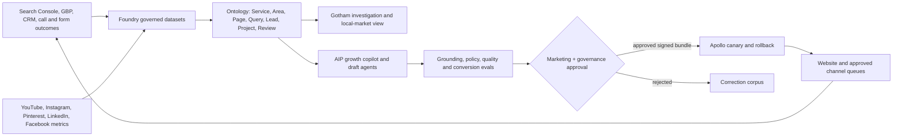

# ClearGlassInc Artemis — Local SEO and Multi-Channel Growth Intelligence Plan

> **Status: implementation plan, not deployed-state evidence.** Recommendations require verified service areas, licensed Palantir interfaces, named owners, and human approval. ClearGlassInc Artemis must never fabricate locations, projects, reviews, availability, rankings, urgency, or performance.

This plan adds local-service growth to the existing Palantir-native architecture without replacing any current capability. **Gotham** supplies governed operational case and entity views; **Foundry** integrates measurement data and exposes it through the Ontology; **AIP** drafts evidence-backed recommendations and runs evaluations; **Apollo** promotes signed, approved application, prompt, workflow, and policy bundles with canary and rollback controls.

## System Architecture



The web UI provides a keyword map, service-page briefs, local visibility grid, review-workflow queue, content calendar, evidence viewer, approval queue, experiment scorecard, and release history. A Python/FastAPI backend validates source events and produces drafts. Streaming consumers update Foundry datasets; the Ontology is the authorization-aware operational contract. Hybrid search retrieves approved project proof and service facts. A policy decision point enforces purpose, geography, consent, channel terms, classification, and actor scope before retrieval and again before action.

No agent publishes content, edits the Google Business Profile, contacts a customer, or posts to social channels by default. It prepares an immutable action package containing exact copy/media, destination, evidence, policy version, expiry, and digest. A named human approves that exact package; the channel adapter revalidates it immediately before execution.

## Data and Ontology

| Object type | Core properties | Important links |
|---|---|---|
| `Service` | canonical name, eligibility, response window, proof status | `availableIn ServiceArea`, `shownOn Page` |
| `ServiceArea` | locality, region, verified coverage, source, valid time | `servedBy Organization` |
| `SearchQuery` | normalized phrase, intent, impressions, clicks, period | `targets Service`, `observedIn ServiceArea` |
| `Page` | URL, title, canonical, index state, schema version, CWV | `targets SearchQuery`, `uses Evidence` |
| `ProjectEvidence` | consent, media rights, service, locality, captured time | `supports Page`, `producedFor Customer` |
| `ReviewRequest` | customer consent, job ID, requested time, status | `follows CompletedJob`; never a fabricated `Review` |
| `LeadOutcome` | channel, qualified state, quote status, revenue band | `attributedTo Page/Campaign` |
| `ContentAsset` | channel, format, copy, media, disclosure, version | `derivedFrom ProjectEvidence` |
| `Experiment` | hypothesis, control/candidate, allocation, guardrails | `measures Metric`, `deploys Version` |
| `Approval` | reviewer, role, digest, decision, reason, expiry | `authorizes ActionPackage` |

Every fact carries event time and system time, source lineage, confidence, consent/usage rights, owner, retention, and policy markings. A service-area page is permitted only when coverage is independently verified and the page contains genuinely distinct local value. Pages must not be mass-generated doorway pages. Reviews are visible customer statements; Review schema is allowed only when policy and search-engine eligibility are confirmed.

### Keyword map

Separate **money keywords** (commercial glass repair, emergency glass service, window replacement, custom shower enclosure, storefront glass replacement, same-day glass repair plus a verified locality) from **support keywords** (replacement indicators, post-breakage steps, enclosure cost factors, repair timelines). Assign one primary transactional phrase to each money page; supporting variants and questions form its content cluster.

Initial priority, subject to evidence: commercial glass repair, storefront glass replacement, custom shower enclosures, window replacement, emergency glass service, and contact/request-quote. Use the homepage for the brand-plus-core-service theme rather than forcing every service phrase onto it.

## AI and Agent Design

| Agent | Reads | Produces | Authority |
|---|---|---|---|
| Signal triage | authorized query, map, lead, and site-health metrics | anomaly and opportunity queue | read only |
| Keyword mapper | verified services/areas and query evidence | page-to-query map | draft only |
| Page architect | map, proof inventory, accessibility patterns | title, meta, H1, outline, internal-link draft | draft only |
| GBP steward | profile fields, photos, Q&A and performance | completeness and posting recommendations | draft only |
| Review coordinator | completed jobs and consent state | same-day request queue | approval required; no incentives or gating |
| Proof curator | rights-cleared project evidence | gallery and before/after packages | draft only |
| Distribution planner | approved source asset and channel metrics | YouTube/social derivatives | draft only |
| Evaluator | candidate/control traces and outcomes | scorecard, drift alert, rollback proposal | cannot approve itself |

Analyst copilots explain rankings, visibility, attribution, and evidence. Commander/marketing-owner copilots prioritize work by qualified-lead impact, confidence, effort, and reversibility. Tool calls are typed and allowlisted: query Ontology, calculate a visibility baseline, draft a page, prepare a review request, create a content package, or open a remediation case. Tools return structured results with citations; operational mutations always stop at `AWAITING_APPROVAL`.

## Self-Improvement Loop

1. **Capture:** minimize and ingest operator corrections, query logs, Search Console metrics, GBP actions, alert dispositions, page outcomes, qualified leads, review-workflow results, channel metrics, latency, and failures.
2. **Curate:** remove secrets and unnecessary personal data, deduplicate, attach lineage, separate training from holdout sets, and require an accountable data owner.
3. **Evaluate:** replay versioned cases for keyword relevance, factual grounding, service-area truth, precision/recall, policy violations, accessibility, latency, cost, operator trust, and qualified-lead conversion.
4. **Propose:** AIP may draft a prompt, workflow, heuristic, content template, or model-route change. It cannot change its goal, permissions, tools, policy, approval rules, or deployment target.
5. **Review:** marketing, data, security/privacy, and model-governance owners inspect the diff, evidence, regressions, cost, residual risk, and rollback artifact. High-risk changes require the applicable quorum.
6. **Canary:** Apollo exposes an approved candidate to a bounded eligible cohort. An A/B test uses predeclared allocation, minimum sample, stopping rules, and guardrails; it never cloaks content or serves search crawlers deceptive variants.
7. **Promote or rollback:** promote only statistically and operationally acceptable candidates. Policy violations, incorrect service claims, material quality regression, or SLO breach trigger automatic disablement and restore the signed last-known-good bundle.
8. **Audit:** append signal IDs, dataset snapshots, source commit, prompt/workflow/model/policy versions, eval output, approvals, release ring, outcome, and rollback decision to an independently controlled ledger.

Weekly metrics are rankings for tracked verified markets, map visibility, organic impressions/clicks, calls, form fills, quote requests, qualified-lead rate, service-page conversion, review count/quality (never just velocity), content assists, Core Web Vitals, operator overrides, grounding, precision, recall, latency, cost, and trust. Rankings alone are not a success criterion.

## Full-Stack Implementation

### On-page and technical contract

Each money page uses a descriptive URL, localized title such as `Commercial Glass Repair in [Verified City] | ClearGlassInc`, matching H1, truthful meta description, clickable phone link, and a flow of hero, problem, details, process, verified gallery, visible testimonials, coverage, FAQs, and quote CTA. Images need correct dimensions, responsive sources, compression, useful alt text, and lazy loading below the fold. Preserve canonical URLs, XML sitemap, `.nojekyll`, redirects, headers, keyboard access, visible focus, reduced motion, contrast, and internal linking generated by `tools/internal_links.py`.

Use `LocalBusiness` only with verified organization data, `Service` on matching service pages, and FAQ structured data only when the questions and answers are visible and eligible. Structured data must never assert unverified ratings, inventory, hours, price, or geography. Validate JSON-LD and monitor Search Console enhancement reports.

### Google Business Profile and Maps

Complete only accurate categories, services, service areas, description, hours, phone, site and booking link. Publish real, rights-cleared work rather than stock imagery. The review workflow begins from a completed job, asks every eligible satisfied or dissatisfied customer consistently, records consent and delivery, and forbids incentives, sentiment gating, impersonation, or fabricated reviews. Keep name/address/phone/site consistent in legitimate directories; earn local authority through genuine contractor, property-manager, designer, real-estate, supplier, chamber, and association relationships—not paid link schemes.

### Multi-channel operating model

- **YouTube:** short before/after proof, installation walkthroughs and safety explanations plus longer pricing-factor, timeline, and materials education. Titles state service and verified locality; descriptions include accurate coverage, phone, site, summary, and disclosure.
- **Instagram/Pinterest:** rights-cleared project photos, Reels, carousels, detail shots, and boards for showers, storefronts, mirrors, and emergency repair.
- **LinkedIn/Facebook:** B2B relationships with contractors, designers, architects, developers, and property managers; local projects, community work, testimonials, and service announcements.

One approved evidence object can produce multiple channel drafts, but each receives channel-specific accessibility text, aspect ratio, copy, disclosure, link tagging, and separate human approval. No automated engagement, mass messaging, scraping, or platform-control bypass is permitted.

### 30–60–90 execution plan

| Window | Deliverables | Exit gate |
|---|---|---|
| Days 1–30 | baseline; verified GBP fields; analytics/consent audit; titles/meta; schema; images; internal links; review workflow; citation cleanup | source-of-truth approved, technical checks pass, no unverified claims |
| Days 31–60 | priority service pages; only justified local pages; FAQs; proof gallery; customer-question articles | proof/rights review, accessibility, schema and conversion QA pass |
| Days 61–90 | legitimate local outreach; review cadence; YouTube pilots; social derivatives; B2B distribution | channel policy review, measured cohort, rollback-ready release |

The implementation sequence is technical integrity, accurate GBP, highest-intent pages, verified proof, review workflow, then local authority and distribution. Every work item has an owner, due date, evidence reference, KPI, approval state, and rollback/disposition.

## Security and Governance

- OIDC/WebAuthn authenticates people; workload identity and mTLS authenticate services. ABAC enforces tenant, mission, role, purpose, geography, consent, and entity/field scope before retrieval.
- Source tokens remain in runtime secret stores, are short-lived and destination-scoped, and never enter prompts, logs, client bundles, or artifacts.
- Prompt injection defenses isolate retrieved content, constrain tool schemas and destinations, quote untrusted fields, limit context and budget, and validate outputs conventionally.
- Audit events are append-only and hash-chained; analytics minimize personal data and obey consent, deletion, retention, and regional requirements.
- Signed prompt, workflow, model-route, policy, schema, and service manifests move through development, evaluation, staging, canary, and production rings. The proposer cannot approve its own candidate.
- Failures in identity, policy, lineage, consent, or audit block mutation. A kill switch disables AI/channel adapters while preserving read-only analytics and manual workflows.

This remains a target-state design: licensed Palantir availability, GBP/API access, verified service areas, consent basis, directory eligibility, environment protections, and operational ownership must be confirmed before production.

## Code Examples

The executable reference planner is in `marketing/local_growth_planner.py`. It validates evidence-backed signals, produces deterministic service-page drafts, requires an identified reviewer and rationale, and maintains a hash-chained decision record. It intentionally has no publisher or channel credentials.

```python
from marketing.local_growth_planner import Intent, KeywordSignal, LocalGrowthPlanner

planner = LocalGrowthPlanner()
draft = planner.build_page_drafts([
    KeywordSignal(
        phrase="commercial glass repair burlington",
        intent=Intent.MONEY,
        service="Commercial Glass Repair",
        location="Burlington",  # must be verified in the service-area source
        impressions=120,
        clicks=20,
        qualified_leads=4,
        evidence_ref="search-console:query:2026-w30",
    )
])[0]

# Still no publication: this records a review decision over the exact draft.
approved_draft = planner.decide_draft(
    draft,
    reviewer="local-marketing-owner",
    approve=True,
    rationale="Service coverage and project proof verified",
)
```

An external, independently authorized release adapter would bind `approved_draft.digest`, policy version, destination and expiry into an action package. Approval does not automatically execute it; the adapter re-checks all bindings and writes the audit record atomically with execution.

## Scenario Walkthrough

At 08:14, a consented Search Console aggregate shows growing Burlington impressions for commercial glass repair, while CRM outcomes show four qualified leads and site telemetry shows mobile CTA abandonment. Foundry ingests the aggregates, validates their contracts, and links `SearchQuery`, `Service`, `ServiceArea`, `Page`, and `LeadOutcome` objects. The service-area fact is current and verified; no customer identity is placed in model context.

At 08:15, signal triage identifies an evidence-backed opportunity. The keyword agent proposes a commercial-glass page brief; the page architect drafts a local title, truthful H1, mobile CTA improvement, FAQ questions, internal links, and slots for rights-cleared project proof. The agent cannot manufacture a testimonial or publish the page. The evaluator catches one gallery asset with expired usage consent and removes it from the package.

At 09:02, the marketing owner reviews the exact content digest, evidence, responsive preview, schema result and accessibility report. They reject an unsupported “same-day” phrase, correct it to the verified response policy, and approve the revised draft. Security policy confirms destination, actor, scope, consent, and expiry. Apollo canaries the signed site bundle; synthetic checks and real-user monitoring watch errors, CWV and conversion guardrails.

Over the next evaluation window, the page improves qualified quote starts without a policy, trust, accessibility, or performance regression. The correction becomes a sanitized holdout case: future candidates claiming speed without a cited service-level fact must fail. AIP proposes a prompt rule requiring response-time evidence. Offline replay passes; a separate governance reviewer approves; Apollo canaries and promotes it. If the candidate had reduced grounding, worsened mobile latency, or asserted an unverified service area, the controller would have disabled it and restored the prior signed version. Every signal, candidate, correction, approval, release and outcome remains reconstructable in the audit plane.
