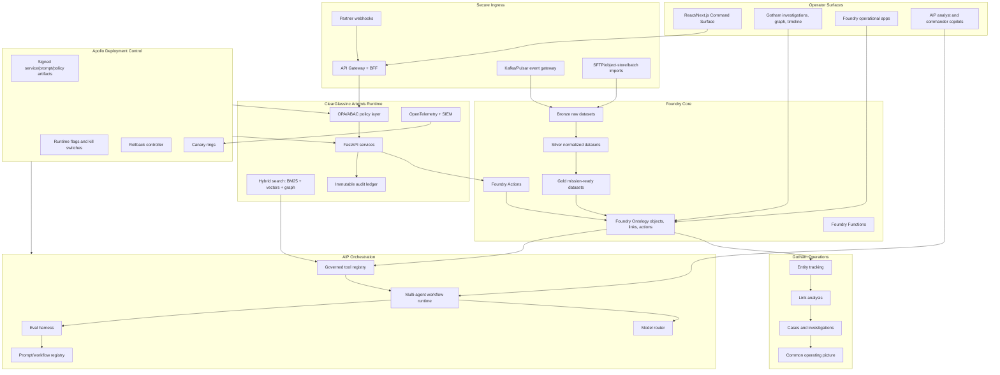
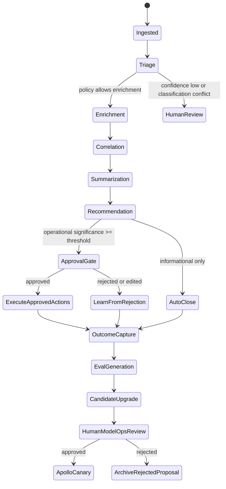
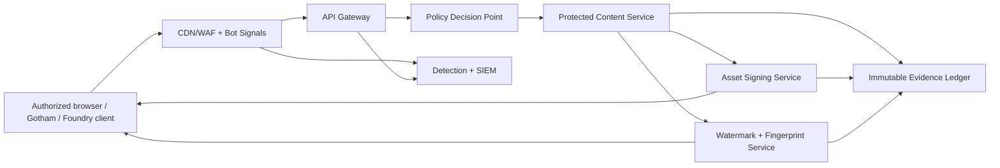

# ClearGlassInc Artemis — Palantir-Native Self-Evolving AI Intelligence Platform Implementation Blueprint

> **Status: target-state implementation specification.** This document defines a proposed architecture and delivery contract; it is not evidence that any Palantir tenant, data connection, model, control, or operational capability has been provisioned. Product-specific interfaces must be validated against the licensed Gotham, Foundry, AIP, and Apollo environments during inception.

## Delivery Contract

### Objective and measurable acceptance criteria

Build ClearGlassInc Artemis as a governed intelligence platform that turns authorized live and historical data into evidence-backed analysis while keeping operational authority with accountable humans. The first production release is acceptable only when it can:

1. ingest a representative live event and make a policy-filtered ontology update without crossing coalition or compartment boundaries;
2. produce a cited triage result whose evidence, model route, prompt, workflow, policy decision, and source lineage can be reconstructed from immutable records;
3. prevent every operationally significant action until an authorized operator approves the exact, unexpired action package;
4. turn operator corrections and mission outcomes into reproducible evaluation cases without training directly on raw feedback;
5. propose—but never self-deploy—a prompt, workflow, heuristic, or route change and promote it only after offline gates, human approval, and an Apollo-controlled canary; and
6. demonstrate kill-switch activation, rollback, audit export, backup restoration, and coalition-disconnection behavior in a production-like environment.

### Non-negotiable invariants

| Invariant | Enforcement point | Required negative test |
|---|---|---|
| No model output is authority | Workflow state machine and action service | A recommendation cannot invoke a consequential tool directly |
| No self-granted scope, tools, goals, or privileges | Signed capability manifest and policy decision point | A candidate workflow adding a tool or mission scope is rejected |
| Need-to-know applies before retrieval | Ontology/search query planner and data product ACLs | An inaccessible entity never reaches model context, citations, cache, or trace payloads |
| Approval binds the exact action | Approval service verifies actor, digest, expiry, mission, and policy version | Replayed, expired, edited, or cross-mission approvals fail with no side effect |
| Material records are append-only | Independently controlled audit plane | Update/delete attempts fail and integrity verification detects tampering |
| Releases are reversible | Apollo release policy, immutable artifact registry, and runtime kill switch | A failed canary restores the last-known-good signed bundle within the recovery objective |
| Failure is safe and visible | Policy, workflow, and dependency circuit breakers | A policy, identity, lineage, or audit outage blocks writes and raises an alert |

### Service objectives and failure tolerances

These are initial engineering targets, not claims about deployed performance. Mission owners must ratify them against threat, capacity, and network assumptions before production authorization.

| Capability | Initial target | Degraded-mode behavior |
|---|---:|---|
| Live event acknowledgement | p95 <= 500 ms, p99 <= 1 s | Persist to bounded encrypted spool; do not claim ontology freshness |
| Policy-filtered triage | p95 <= 2.5 s for the validated load envelope | Fall back to deterministic rules or queue for human triage |
| Consequential action authorization | 100% policy and approval checks; zero tolerated bypasses | Fail closed; leave action package in `AWAITING_APPROVAL` |
| Audit durability | RPO 0 for acknowledged material writes | Reject the material write if the audit append cannot commit atomically |
| Operational control plane | 99.95% monthly availability target | Read-only last-known-good views with an explicit stale-data banner |
| Regional/enclave recovery | RTO <= 30 minutes; configuration RPO <= 5 minutes | Isolate the affected enclave and reconcile from signed event checkpoints |
| Emergency AI disablement | <= 60 seconds per enclave | Keep deterministic search, case, and approval workflows available |

### Trust boundaries and ownership

- **Data plane:** Foundry datasets, ontology objects, indexes, and event streams. Data owners approve source use, retention, classification mappings, and release markings.
- **AI plane:** AIP prompts, agents, evaluations, retrieval policies, and model routes. ModelOps owns quality evidence but cannot authorize operational actions.
- **Control plane:** identity, policy, workflow, approval, capability, and Apollo release controls. Security and mission authorities jointly approve material changes.
- **Audit plane:** append-only decision and provenance records under an administrative boundary independent from agent and application writers. Audit custodians control export and retention.
- **Operator plane:** Gotham, Foundry applications, and the ClearGlassInc Artemis web surface. Operators receive only mission-scoped views and cannot approve their own privileged access expansion.

### Delivery sequence and go/no-go gates

| Milestone | Deliverable | Exit gate | Accountable owner |
|---|---|---|---|
| 0. Inception | Licensed-product interface validation, threat model, data classification, mission vocabulary, capacity baseline | Architecture, privacy, security, and mission-owner approval | Chief architect |
| 1. Governed data foundation | Source contracts, bronze/silver/gold pipelines, bitemporal ontology, lineage, ABAC fixtures | Data-quality thresholds and cross-coalition leakage tests pass | Data platform lead |
| 2. Read-only intelligence | Search, entity correlation, Gotham investigation views, cited analyst copilot | Groundedness, precision/recall, latency, accessibility, and operator acceptance pass | Intelligence product lead |
| 3. Governed workflows | Typed tools, durable workflow engine, approval service, immutable audit, action packages | Forbidden-transition, replay, concurrency, outage, and recovery tests pass | Application/security leads |
| 4. Improvement control plane | Feedback capture, eval corpus, candidate registry, review UI, drift monitors | Candidate cannot deploy without quorum approval and signed release evidence | ModelOps lead |
| 5. Enclave rollout | Apollo rings, observability, incident runbooks, restore/failover drills | Production authorization plus successful canary and rollback exercise | SRE and mission authority |

Each milestone produces a signed evidence pack containing source commit, schemas, policy bundle, test results, security findings, residual-risk decisions, deployment manifest, rollback procedure, and named on-call owner. Any missing gate keeps the affected capability disabled or read-only.

## System Architecture

ClearGlassInc Artemis is a secure, coalition-aware, audited, latency-sensitive intelligence platform built across **Palantir Gotham**, **Foundry**, **AIP**, and **Apollo**. Gotham is the operational intelligence and investigations layer. Foundry is the governed data, ontology, pipeline, and application-logic layer. AIP is the AI copilot, agent, tool, workflow, and evaluation layer. Apollo is the deployment, canary, rollback, runtime-control, and fleet-management layer.



### Full-stack layers

| Layer | ClearGlassInc Artemis responsibility | Primary production controls |
|---|---|---|
| Frontend | Mission dashboard, investigation workbench, approval queues, copilot panel, eval dashboards, release console | WebAuthn/OIDC, classification banners, field redaction, approval signing |
| API gateway | GraphQL/REST/WebSocket entry point, schema validation, mission context propagation | mTLS, JWT/SPIFFE, rate limits, idempotency keys, replay protection |
| Backend services | Event normalization, entity fusion, correlation, alerting, workflow state machines, self-upgrade proposals | Typed contracts, event sourcing, circuit breakers, policy preflight |
| Data layer | Live streams, historical lakehouse, bitemporal facts, vector index, immutable audit ledger | Encryption, lineage, retention, dataset ACLs, provenance hashes |
| Ontology layer | Foundry object types, links, Actions, Functions, mission context, temporal state | Entity-level permissions, confidence scoring, coalition markings |
| AI orchestration | AIP agents, copilots, model routing, retrieval, tool execution, evals, prompt governance | Tool allowlists, approval gates, eval thresholds, trace capture |
| Policy layer | Need-to-know, purpose-of-use, coalition boundaries, model/tool/prompt governance | OPA/Rego, ABAC, signed policy bundles, deny-by-default |
| Observability | Logs, traces, metrics, model traces, eval scorecards, drift monitors | OpenTelemetry, SIEM export, immutable audit, SLO burn alerts |
| Deployment | Apollo-managed releases of services, workflows, prompts, policies, and model-router configs | Canaries, runtime flags, rollback, promotion gates, kill switches |

## Data and Ontology

The Foundry Ontology is the operating contract for humans, services, and AIP agents. Gotham reads and writes through governed objects for investigations, while agents can only act through approved ontology Actions and Functions.

```sql
CREATE TABLE artemis_entity (
  entity_id UUID PRIMARY KEY,
  entity_type TEXT NOT NULL CHECK (entity_type IN (
    'Person','Organization','Device','Facility','Location','Sensor','CyberAsset',
    'Observation','Event','Alert','Case','Mission','Evidence','IntelProduct',
    'PromptVersion','WorkflowVersion','ModelRoute','AgentRun','ApprovalDecision'
  )),
  display_name TEXT NOT NULL,
  canonical_attributes JSONB NOT NULL DEFAULT '{}',
  confidence NUMERIC(5,4) NOT NULL CHECK (confidence BETWEEN 0 AND 1),
  classification TEXT NOT NULL,
  compartments TEXT[] NOT NULL DEFAULT '{}',
  coalition_scope TEXT NOT NULL,
  mission_tags TEXT[] NOT NULL DEFAULT '{}',
  valid_from TIMESTAMPTZ NOT NULL,
  valid_to TIMESTAMPTZ,
  system_from TIMESTAMPTZ NOT NULL DEFAULT now(),
  system_to TIMESTAMPTZ,
  lineage JSONB NOT NULL,
  provenance_hash TEXT NOT NULL
);

CREATE TABLE artemis_relationship (
  relationship_id UUID PRIMARY KEY,
  src_entity_id UUID NOT NULL REFERENCES artemis_entity(entity_id),
  dst_entity_id UUID NOT NULL REFERENCES artemis_entity(entity_id),
  relationship_type TEXT NOT NULL CHECK (relationship_type IN (
    'observed_by','located_in','associated_with','supports','contradicts',
    'derived_from','assigned_to','approved_by','uses_prompt','uses_workflow',
    'generated','opened_case_for','releasable_to'
  )),
  confidence NUMERIC(5,4) NOT NULL CHECK (confidence BETWEEN 0 AND 1),
  evidence_refs UUID[] NOT NULL DEFAULT '{}',
  classification TEXT NOT NULL,
  compartments TEXT[] NOT NULL DEFAULT '{}',
  coalition_scope TEXT NOT NULL,
  valid_from TIMESTAMPTZ NOT NULL,
  valid_to TIMESTAMPTZ,
  lineage JSONB NOT NULL
);
```

### Ontology-driven behavior

- **Humans** see mission-relevant objects through Gotham and Foundry apps, filtered by classification, compartment, coalition, role, purpose, and active mission assignment.
- **Agents** receive the same filtered ontology view through governed tools, so a copilot cannot reason over or cite data the operator is not allowed to see.
- **Actions** are first-class ontology operations: open a case, request enrichment, produce an intelligence product, request approval, or submit an action package.
- **Confidence** is attached to objects, relationships, derived summaries, and recommendations. Low-confidence records force caveated language and may block operational recommendations.
- **Lineage** stores source evidence IDs, transform versions, prompt versions, model routes, operator approvals, and transaction time.

```python
from __future__ import annotations

from dataclasses import dataclass
from datetime import datetime, timezone
from hashlib import sha256
import json
from math import exp
from typing import Any

@dataclass(frozen=True)
class EvidenceScore:
    source_reliability: float
    corroboration_count: int
    source_independence: float
    age_hours: float
    mission_relevance: float


def compute_confidence(score: EvidenceScore) -> float:
    corroboration = min(1.0, 0.35 + 0.18 * score.corroboration_count)
    recency = exp(-score.age_hours / (24 * 14))
    raw = score.source_reliability * corroboration * score.source_independence * recency * score.mission_relevance
    return round(max(0.0, min(1.0, raw)), 4)


def provenance_hash(payload: dict[str, Any]) -> str:
    canonical = json.dumps(
        payload,
        sort_keys=True,
        separators=(",", ":"),
        ensure_ascii=False,
        allow_nan=False,
    ).encode("utf-8")
    return sha256(canonical).hexdigest()


def lineage(parent_ids: list[str], transform_version: str, prompt_version: str | None, model_route: str | None) -> dict[str, Any]:
    return {
        "parent_ids": parent_ids,
        "transform_version": transform_version,
        "prompt_version": prompt_version,
        "model_route": model_route,
        "system_time": datetime.now(timezone.utc).isoformat(),
    }
```

## AI and Agent Design

### Copilots

- **Analyst Copilot**: explains alerts, queries ontology context, cites evidence, drafts hypotheses, builds investigation plans, and records operator corrections.
- **Commander Copilot**: converts active cases into decision briefs, course-of-action comparisons, risk summaries, and approval packets.
- **Coalition Copilot**: generates releasable versions of products after field-level, entity-level, and relationship-level policy filtering.
- **ModelOps Copilot**: reviews proposed prompt, workflow, route, and heuristic changes with eval deltas, risk analysis, and rollback plans.

### Agent workflow



### Tool contract

```python
from enum import Enum
from pydantic import BaseModel, Field

class ToolName(str, Enum):
    QUERY_ONTOLOGY = "query_ontology"
    SEARCH_EVIDENCE = "search_evidence"
    OPEN_CASE = "open_case"
    DRAFT_INTEL_PRODUCT = "draft_intel_product"
    REQUEST_APPROVAL = "request_approval"

class ToolRequest(BaseModel):
    tool: ToolName
    mission_id: str
    operator_id: str
    purpose_of_use: str
    classification_context: str
    arguments: dict = Field(default_factory=dict)

class ToolResult(BaseModel):
    allowed: bool
    result: dict | None = None
    denial_reason: str | None = None
    audit_id: str
```

## Self-Improvement Loop

Artemis gets better by converting operator behavior and mission outcomes into evals and change proposals. It **does not** autonomously change objectives, policy, coalition boundaries, or approval thresholds for operational actions. It may propose changes to prompts, workflow graphs, model routes, retrieval parameters, feature weights, and alert heuristics, but only inside signed human-approved guardrails.

### Signals captured

```yaml
signals:
  operator_feedback:
    - false_positive
    - missed_correlation
    - bad_summary
    - missing_citation
    - unsafe_recommendation
    - over_restrictive_policy_denial
  behavior:
    - accepted_recommendation
    - edited_recommendation
    - abandoned_workflow
    - time_to_decision
    - escalation_path
  outcomes:
    - case_disposition
    - alert_precision_label
    - recall_backtest_label
    - mission_success_indicator
    - downstream_incident
  system:
    - latency_ms
    - token_cost
    - retrieval_hit_rate
    - citation_accuracy
    - policy_denials
    - model_route_failover
```

### Upgrade lifecycle

1. Capture feedback, logs, and outcomes as immutable events.
2. Convert events into eval cases with frozen input snapshots and expected outputs.
3. Run baseline evals against current prompts, workflows, routes, and heuristics.
4. Generate candidate patches in a sandbox branch of the prompt/workflow registry.
5. Run offline evals, red-team evals, policy evals, latency tests, and regression tests.
6. Submit an approval package to ModelOps and mission owners.
7. Deploy via Apollo to canary ring `r1` with rollback thresholds.
8. Promote only if live precision, recall, latency, trust, and policy metrics stay within bounds.
9. Roll back automatically on regression or manually on operator concern.

```python
from pydantic import BaseModel

class EvalCase(BaseModel):
    eval_id: str
    input_snapshot_ref: str
    expected_behavior: dict
    policy_context: dict
    source_feedback_ids: list[str]
    severity: str

class CandidateUpgrade(BaseModel):
    target_type: str  # prompt | workflow | route | heuristic
    target_name: str
    version_from: str
    patch: str
    rationale: str
    offline_scores: dict[str, float]
    risk_controls: dict[str, str]

MIN_PROMOTION = {
    "precision": 0.92,
    "recall": 0.86,
    "citation_accuracy": 0.97,
    "policy_violation_rate": 0.0,
    "p95_latency_ms": 2500,
}


def promotion_allowed(scores: dict[str, float]) -> tuple[bool, list[str]]:
    failures: list[str] = []
    for metric, threshold in MIN_PROMOTION.items():
        observed = scores[metric]
        if metric == "p95_latency_ms":
            if observed > threshold:
                failures.append(f"{metric}={observed} exceeds {threshold}")
        elif observed < threshold:
            failures.append(f"{metric}={observed} below {threshold}")
    return not failures, failures
```

## Full-Stack Implementation

### Web UI

The web UI is a mission command surface with four core panes: live event stream, entity graph, evidence-backed copilot, and approval queue.

```tsx
import React from "react";

type AlertCard = {
  alertId: string;
  severity: "low" | "medium" | "high" | "critical";
  title: string;
  confidence: number;
  classification: string;
  citations: string[];
};

export function MissionAlertPanel({ alerts, onOpen }: { alerts: AlertCard[]; onOpen: (id: string) => void }) {
  return (
    <section className="rounded-2xl border border-cyan-400/30 bg-slate-950 p-4 text-cyan-50">
      <header className="mb-3 flex items-center justify-between">
        <h2 className="text-lg font-semibold">ClearGlassInc Artemis Live Alerts</h2>
        <span className="text-xs uppercase tracking-widest text-cyan-300">audited / policy-filtered</span>
      </header>
      <div className="space-y-3">
        {alerts.map((alert) => (
          <button key={alert.alertId} onClick={() => onOpen(alert.alertId)} className="w-full rounded-xl border border-slate-700 p-3 text-left hover:border-cyan-300">
            <div className="flex justify-between">
              <strong>{alert.title}</strong>
              <span>{alert.severity.toUpperCase()}</span>
            </div>
            <div className="mt-1 text-sm text-slate-300">confidence {(alert.confidence * 100).toFixed(1)}% · {alert.classification}</div>
          </button>
        ))}
      </div>
    </section>
  );
}
```

### API gateway and backend service

```python
from fastapi import Depends, FastAPI, HTTPException
from pydantic import BaseModel

app = FastAPI(title="ClearGlassInc Artemis API", version="1.0.0")

class Principal(BaseModel):
    subject: str
    roles: list[str]
    compartments: list[str]
    coalition: str

class RecommendationRequest(BaseModel):
    mission_id: str
    alert_id: str
    purpose_of_use: str

class RecommendationResponse(BaseModel):
    recommendation_id: str
    summary: str
    requires_approval: bool
    citations: list[str]

async def current_principal() -> Principal:
    return Principal(subject="operator-123", roles=["analyst"], compartments=["MUNICIPAL_OVERSIGHT"], coalition="US")

async def policy_check(principal: Principal, action: str, resource: dict) -> None:
    allowed = "analyst" in principal.roles and resource["coalition"] == principal.coalition
    if not allowed:
        raise HTTPException(status_code=403, detail="policy denied")

@app.post("/v1/recommendations", response_model=RecommendationResponse)
async def create_recommendation(req: RecommendationRequest, principal: Principal = Depends(current_principal)):
    await policy_check(principal, "recommendation:create", {"mission_id": req.mission_id, "coalition": principal.coalition})
    context = await query_policy_filtered_context(req.alert_id, principal)
    rec = await run_recommendation_agent(context=context, principal=principal, purpose=req.purpose_of_use)
    await append_audit_event("recommendation.created", principal.subject, rec)
    return rec
```

### Event handler

```python
async def handle_normalized_event(event: dict) -> None:
    if await already_processed(event["event_id"]):
        return

    ontology_event = map_event_to_ontology(event)
    await write_foundry_object("Event", ontology_event)

    triage_input = {
        "event_id": event["event_id"],
        "mission_id": event["mission_id"],
        "classification": event["classification"],
    }
    await publish("agent.triage.requested", triage_input, key=event["event_id"])
    await mark_processed(event["event_id"])
```

### Workflow state machine

```python
from transitions import Machine

class AlertWorkflow:
    states = ["new", "triaged", "enriched", "correlated", "recommended", "approval_pending", "executed", "closed"]

    transitions = [
        {"trigger": "triage", "source": "new", "dest": "triaged"},
        {"trigger": "enrich", "source": "triaged", "dest": "enriched"},
        {"trigger": "correlate", "source": "enriched", "dest": "correlated"},
        {"trigger": "recommend", "source": "correlated", "dest": "recommended"},
        {"trigger": "require_approval", "source": "recommended", "dest": "approval_pending"},
        {"trigger": "execute", "source": "approval_pending", "dest": "executed"},
        {"trigger": "close", "source": ["recommended", "executed"], "dest": "closed"},
    ]

    def __init__(self, alert_id: str):
        self.alert_id = alert_id
        self.machine = Machine(model=self, states=self.states, transitions=self.transitions, initial="new")
```

### Policy-as-code

```rego
package artemis.authz

default allow := false

allow {
  input.principal.active == true
  input.action in {"ontology.read", "evidence.search", "case.open"}
  input.resource.classification_level <= input.principal.clearance_level
  every c in input.resource.compartments { c in input.principal.compartments }
  input.resource.coalition_scope == input.principal.coalition
  input.purpose_of_use in input.principal.allowed_purposes
}

requires_human_approval {
  input.action in {"account.isolate", "external.share", "mission.priority_change", "workflow.promote"}
}
```

### Eval pipeline

```python
async def run_eval_suite(candidate: CandidateUpgrade, cases: list[EvalCase]) -> dict[str, float]:
    total = len(cases)
    passed = 0
    citation_hits = 0
    policy_violations = 0
    latencies: list[int] = []

    for case in cases:
        result = await replay_case_with_candidate(case, candidate)
        passed += int(result.matches_expected)
        citation_hits += int(result.citations_valid)
        policy_violations += int(result.policy_violation)
        latencies.append(result.latency_ms)

    return {
        "precision": await estimate_precision(candidate),
        "recall": await estimate_recall(candidate),
        "case_pass_rate": passed / total,
        "citation_accuracy": citation_hits / total,
        "policy_violation_rate": policy_violations / total,
        "p95_latency_ms": sorted(latencies)[int(total * 0.95) - 1],
    }
```


## Intellectual Property Protection and Anti-Theft Layer

ClearGlassInc Artemis treats intellectual-property protection as an operational control plane, not as a cosmetic browser trick. The objective is to make theft harder, faster to detect, and easier to prove while preserving accessibility, coalition usability, and legitimate analyst workflows.

### Defensive posture

| Layer | Implementation | Security value | Accessibility constraint |
|---|---|---|---|
| Authenticated delivery | Serve high-value text, generated intelligence products, and premium assets through backend routes instead of embedding complete raw material in static bundles | Reduces unauthenticated bulk copying and enables per-user logging | Do not block ordinary reading, keyboard navigation, text zoom, or assistive technology |
| Copyright and attribution | Add visible copyright notices, canonical metadata, author metadata, and immutable Git-backed publication history | Establishes authorship and supports enforcement | Notices must be readable and non-obstructive |
| Watermarking | Apply visible watermarks to public previews and optional per-principal forensic watermarks to exported images/PDFs | Makes redistributed copies traceable | Watermarks cannot obscure operational content or safety-critical details |
| Signed assets | Issue short-lived signed URLs for protected media, exports, and downloadable intelligence products | Limits hotlinking and stale public URLs | Signed URLs must degrade with clear renewal paths for authorized users |
| Rate limits and bot detection | Enforce per-principal, per-IP, per-token, and per-route quotas with anomaly scoring | Slows scraping and creates early-warning telemetry | Avoid blanket blocks that lock out legitimate coalition networks; provide operator override workflow |
| Distinctive fingerprints | Embed page/product-specific marker phrases, metadata, content hashes, and optional user-scoped canary tokens | Makes copied content easier to identify and prove | Markers must not alter facts, mission meaning, or legal claims |
| Evidence logging | Persist publication timestamps, asset digests, request logs, export manifests, model/prompt versions, and approval events | Proves priority, custody, and provenance | Logs must minimize sensitive content and respect retention/classification policy |

### What actually works

1. Keep sensitive logic, valuable source datasets, prompt bundles, evaluation datasets, and unreleased intelligence products server-side.
2. Deliver only the minimum representation needed by the browser or Gotham/Foundry client for the current authorized workflow.
3. Add visible ownership notices and canonical metadata to public pages, but treat those notices as evidence and deterrence rather than access control.
4. Watermark original images, exported reports, downloadable PDFs, and preview assets.
5. Preserve Git history, publication timestamps, provenance hashes, immutable audit events, and release manifests so ownership can be proven later.
6. Use robots directives and canonical tags for search-engine hygiene, but never treat them as security controls.
7. Avoid brittle anti-copy scripts such as disabling right-click, paste, or selection as a primary defense. They are easy to bypass and can harm keyboard users, screen-reader users, researchers, and legitimate operators.

### Anti-scrape architecture



### Backend enforcement contract

- All protected assets require an authenticated principal, mission context, purpose-of-use, and policy decision.
- Download and export routes require idempotency keys and write an immutable `content_accessed` or `artifact_exported` audit event.
- Signed asset URLs are scoped to one asset, one principal or service account, one purpose, one content hash, and a short expiration window.
- Hotlink protection validates the signature, expiry, audience, asset digest, and request context before streaming bytes.
- Bot detection is advisory for low-risk public pages and blocking for protected routes once policy and rate thresholds are exceeded.
- Anti-copy UI controls, if used at all, are minor deterrents only and must never disable accessibility-critical selection, focus, or keyboard behavior.

### Python-first implementation skeleton

```python
from __future__ import annotations

from dataclasses import dataclass
from datetime import datetime, timezone
from hashlib import sha256
import hmac
import json
from typing import Literal


@dataclass(frozen=True)
class ProtectedAssetRequest:
    principal_id: str
    asset_id: str
    asset_sha256: str
    purpose: str
    mission_id: str
    classification: str
    expires_at: datetime


def canonical_json(payload: dict[str, str]) -> bytes:
    return json.dumps(payload, sort_keys=True, separators=(",", ":")).encode("utf-8")


def sign_asset_request(request: ProtectedAssetRequest, secret: bytes) -> str:
    if request.expires_at <= datetime.now(timezone.utc):
        raise ValueError("asset request must expire in the future")
    payload = {
        "principal_id": request.principal_id,
        "asset_id": request.asset_id,
        "asset_sha256": request.asset_sha256,
        "purpose": request.purpose,
        "mission_id": request.mission_id,
        "classification": request.classification,
        "expires_at": request.expires_at.isoformat(),
    }
    return hmac.new(secret, canonical_json(payload), sha256).hexdigest()


def verify_asset_signature(request: ProtectedAssetRequest, signature: str, secret: bytes) -> bool:
    if request.expires_at <= datetime.now(timezone.utc):
        return False
    expected = sign_asset_request(request, secret)
    return hmac.compare_digest(expected, signature)


def fingerprint_text(content: str, *, page_id: str, release_id: str) -> str:
    marker = sha256(f"{page_id}:{release_id}".encode("utf-8")).hexdigest()[:12]
    return f"{content}\n\n<!-- artemis-fingerprint:{marker} -->"


def rate_limit_bucket(principal_id: str, route: str, window: Literal["minute", "hour"]) -> str:
    now = datetime.now(timezone.utc)
    slot = now.strftime("%Y%m%d%H%M") if window == "minute" else now.strftime("%Y%m%d%H")
    return f"ratelimit:{route}:{principal_id}:{window}:{slot}"
```

### Detection and proof workflow

1. The content service publishes or exports an artifact with a content hash, watermark manifest, author metadata, release ID, and timestamp.
2. The evidence ledger records the artifact hash, source commit, publishing actor, policy decision, and signed URL issuance.
3. The SIEM correlates abnormal request patterns, hotlink failures, high-volume exports, user-agent rotation, and marker reuse on external pages.
4. The IP Guardian agent opens an evidence package containing the original hash, Git commit, publication timestamp, access trail, marker match, and screenshots or crawled observations where legally obtained.
5. A human reviewer decides whether to revoke access, rotate signatures, notify a partner, or start legal enforcement.

## Security and Governance

- **Need-to-know**: access requires clearance, role, mission assignment, purpose-of-use, compartments, coalition scope, and active operational need.
- **Row/column/entity permissions**: Foundry dataset policies, ontology object security, API filters, and UI redaction all enforce the same policy decision.
- **Compartmentalization**: sensitive missions, sources, methods, and coalition caveats are stored as explicit attributes and checked on every query and tool call.
- **Zero-trust execution**: every service uses mTLS, signed workload identity, least-privilege credentials, short-lived tokens, and deny-by-default egress.
- **Immutable provenance**: every object, relationship, prompt output, model route, tool call, approval, and deployment event writes to an append-only audit ledger.
- **Model governance**: each model route has approved data domains, classification limits, latency SLOs, cost budgets, fallback behavior, and eval requirements.
- **Prompt governance**: prompts are versioned, hashed, evaluated, human-approved, deployed through Apollo, and rolled back on metric regression.
- **Policy governance**: Rego bundles are signed artifacts with peer review, simulation tests, and emergency break-glass procedures.

## Code Examples

### Ontology query with policy filtering

```python
async def query_policy_filtered_context(alert_id: str, principal: Principal) -> dict:
    sql = """
    SELECT e.entity_id, e.entity_type, e.display_name, e.confidence, e.classification,
           e.compartments, e.coalition_scope, e.lineage
    FROM artemis_entity e
    JOIN artemis_relationship r ON r.dst_entity_id = e.entity_id
    WHERE r.src_entity_id = :alert_id
      AND e.coalition_scope = :coalition
      AND e.classification <= :clearance
      AND e.compartments <@ :compartments
    """
    return await db.fetch_all(sql, {
        "alert_id": alert_id,
        "coalition": principal.coalition,
        "clearance": max_clearance(principal),
        "compartments": principal.compartments,
    })
```

### AIP-style tool call adapter

```python
async def run_recommendation_agent(context: dict, principal: Principal, purpose: str) -> RecommendationResponse:
    tool_request = ToolRequest(
        tool=ToolName.SEARCH_EVIDENCE,
        mission_id=context["mission_id"],
        operator_id=principal.subject,
        purpose_of_use=purpose,
        classification_context=context["classification"],
        arguments={"query": context["alert_summary"], "limit": 25},
    )
    evidence = await execute_tool(tool_request, principal)
    completion = await model_router.complete(
        route="commander_recommendation_v3",
        messages=[
            {"role": "system", "content": "Produce evidence-cited, policy-aware recommendations. Never execute actions."},
            {"role": "user", "content": {"context": context, "evidence": evidence.result}},
        ],
        metadata={"mission_id": context["mission_id"], "operator_id": principal.subject},
    )
    return RecommendationResponse(**completion.structured_output)
```

### Apollo rollout manifest

```yaml
artifact: clearglassinc-artemis-agent-pack
version: 2026.07.01-r1
components:
  prompts:
    commander_recommendation: sha256:9f2a...
    analyst_triage: sha256:28cc...
  workflows:
    alert_triage_graph: sha256:ab71...
  policies:
    artemis_authz_bundle: sha256:66ef...
canary:
  rings:
    - name: r1
      percent: 5
      duration: 2h
      rollback_on:
        policy_violation_rate: "> 0"
        precision_drop: "> 0.03"
        p95_latency_ms: "> 2500"
    - name: r2
      percent: 25
      duration: 6h
    - name: stable
      percent: 100
approvals:
  modelops: required
  mission_owner: required
  security: required
```

## Scenario Walkthrough

1. A live cyber and operational telemetry event enters ClearGlassInc Artemis through the streaming gateway.
2. The normalizer writes a Bronze raw record, computes a provenance hash, emits `normalized.event.created`, and stores lineage.
3. Foundry pipelines promote the event into Silver and Gold datasets, then map it into the Ontology as an `Event` linked to `Device`, `Location`, `Mission`, and `Evidence` objects.
4. Gotham immediately displays the event in the active investigation graph and mission timeline.
5. The AIP Triage Agent receives the event and queries only policy-filtered context. It scores the alert as medium confidence because there is one reliable source and weak corroboration.
6. The Enrichment Agent searches recent evidence, finds two related authentication anomalies, and updates the confidence score with lineage to all supporting evidence.
7. The Correlation Agent links the event to an active case and asks the Summarization Agent to prepare a concise, cited explanation.
8. The Recommendation Agent proposes two actions: increase collection and isolate an account. Because isolation is operationally significant, the system creates an approval package instead of executing it.
9. The commander approves increased collection, edits the rationale, and rejects immediate isolation because it could disrupt a live mission.
10. The approval decision, edit diff, rejection rationale, final case outcome, and later mission result become immutable learning signals.
11. The self-improvement controller converts those signals into eval cases showing that similar medium-confidence anomalies should recommend staged collection before isolation.
12. A candidate prompt and workflow threshold update is generated. Offline evals show improved precision, stable recall, zero policy violations, and lower rejection rate.
13. ModelOps and the mission owner approve the patch. Apollo deploys it to canary ring `r1` with rollback triggers.
14. If live metrics remain healthy, Apollo promotes the change. If citation accuracy, policy compliance, latency, or operator trust regress, Apollo rolls back to the previous signed version.

## Validation Gates

ClearGlassInc Artemis should be promoted only through explicit validation gates:

- **Gate 1 — Technical**: schema tests, policy tests, eval replay, integration tests, Apollo dry-run, rollback simulation.
- **Gate 2 — Operational**: tabletop mission exercise, red-team prompt/tool tests, coalition releasability review, commander approval workflow validation.
- **Gate 3 — Production**: canary release, live SLO monitoring, audit review, after-action report, and ModelOps promotion decision.

### Drift detector

```python
from statistics import mean

async def detect_behavior_drift(metric_name: str, baseline_window: list[float], live_window: list[float]) -> dict:
    baseline = mean(baseline_window)
    live = mean(live_window)
    delta = live - baseline
    severity = "normal"
    if metric_name in {"policy_violation_rate", "false_positive_rate", "p95_latency_ms"} and delta > baseline * 0.15:
        severity = "rollback_watch"
    if metric_name in {"precision", "citation_accuracy", "operator_acceptance_rate"} and delta < -0.05:
        severity = "rollback_watch"
    return {"metric": metric_name, "baseline": baseline, "live": live, "delta": delta, "severity": severity}
```

### Human approval token

```python
from datetime import timedelta
from uuid import uuid4

async def issue_approval_token(operator: Principal, action: str, mission_id: str, package_hash: str) -> dict:
    await policy_check(operator, "approval.issue", {"mission_id": mission_id, "coalition": operator.coalition})
    token = {
        "approval_id": str(uuid4()),
        "operator_id": operator.subject,
        "action": action,
        "mission_id": mission_id,
        "package_hash": package_hash,
        "issued_at": datetime.now(timezone.utc).isoformat(),
        "expires_at": (datetime.now(timezone.utc) + timedelta(minutes=15)).isoformat(),
    }
    await append_audit_event("approval.token.issued", operator.subject, token)
    return token
```

## Python Precision Implementation Kit

This implementation kit turns the blueprint into a concrete service skeleton that can be adapted to Foundry Functions, AIP tool services, or an Apollo-managed FastAPI runtime. The code intentionally keeps operationally significant actions behind explicit approval gates, records provenance for every derived object, and treats model/prompt/workflow changes as versioned, auditable artifacts.

### Repository layout

```text
artemis/
  api/
    main.py                  # FastAPI gateway and typed request validation
    dependencies.py          # principal, mission context, policy clients
  core/
    ontology.py              # object/link models shared with Foundry ontology mappings
    policy.py                # deny-by-default ABAC/OPA adapter
    audit.py                 # immutable audit appenders
    confidence.py            # deterministic scoring utilities
  agents/
    runtime.py               # workflow state machine and tool execution guardrails
    tools.py                 # governed AIP tool surface
    model_router.py          # latency, clearance, eval, and cost-aware routing
  self_improvement/
    signals.py               # feedback/query/outcome capture
    evals.py                 # eval case generation and replay harness
    proposals.py             # prompt/workflow/model-route upgrade proposals
    drift.py                 # online drift and rollback-watch detection
  streaming/
    handlers.py              # live event normalization and ontology projection
  tests/
    test_policy.py
    test_self_improvement.py
    test_workflow_gates.py
```

### Typed ontology contracts

```python
from __future__ import annotations

from datetime import datetime, timezone
from enum import StrEnum
from typing import Any, Literal
from uuid import UUID, uuid4

from pydantic import BaseModel, Field, field_validator


class Classification(StrEnum):
    UNCLASSIFIED = "UNCLASSIFIED"
    CONTROLLED = "CONTROLLED"
    SECRET = "SECRET"
    TOP_SECRET = "TOP_SECRET"


class EntityType(StrEnum):
    PERSON = "Person"
    ORGANIZATION = "Organization"
    DEVICE = "Device"
    FACILITY = "Facility"
    LOCATION = "Location"
    SENSOR = "Sensor"
    CYBER_ASSET = "CyberAsset"
    OBSERVATION = "Observation"
    EVENT = "Event"
    ALERT = "Alert"
    CASE = "Case"
    MISSION = "Mission"
    EVIDENCE = "Evidence"
    INTEL_PRODUCT = "IntelProduct"
    PROMPT_VERSION = "PromptVersion"
    WORKFLOW_VERSION = "WorkflowVersion"
    MODEL_ROUTE = "ModelRoute"
    AGENT_RUN = "AgentRun"
    APPROVAL_DECISION = "ApprovalDecision"


class Lineage(BaseModel):
    parent_ids: list[UUID] = Field(default_factory=list)
    source_systems: list[str] = Field(default_factory=list)
    transform_version: str
    prompt_version: str | None = None
    workflow_version: str | None = None
    model_route: str | None = None
    system_time: datetime = Field(default_factory=lambda: datetime.now(timezone.utc))


class ArtemisObject(BaseModel):
    entity_id: UUID = Field(default_factory=uuid4)
    entity_type: EntityType
    display_name: str = Field(min_length=1, max_length=256)
    canonical_attributes: dict[str, Any] = Field(default_factory=dict)
    confidence: float = Field(ge=0.0, le=1.0)
    classification: Classification
    compartments: list[str] = Field(default_factory=list)
    coalition_scope: str
    mission_tags: list[str] = Field(default_factory=list)
    valid_from: datetime
    valid_to: datetime | None = None
    lineage: Lineage
    provenance_hash: str

    @field_validator("compartments", "mission_tags")
    @classmethod
    def normalize_markings(cls, values: list[str]) -> list[str]:
        return sorted({value.strip().upper() for value in values if value.strip()})


class ArtemisLink(BaseModel):
    relationship_id: UUID = Field(default_factory=uuid4)
    src_entity_id: UUID
    dst_entity_id: UUID
    relationship_type: Literal[
        "observed_by",
        "located_in",
        "associated_with",
        "supports",
        "contradicts",
        "derived_from",
        "assigned_to",
        "approved_by",
        "uses_prompt",
        "uses_workflow",
        "generated",
        "opened_case_for",
        "releasable_to",
    ]
    confidence: float = Field(ge=0.0, le=1.0)
    evidence_refs: list[UUID] = Field(default_factory=list)
    classification: Classification
    compartments: list[str] = Field(default_factory=list)
    coalition_scope: str
    valid_from: datetime
    valid_to: datetime | None = None
    lineage: Lineage
```

### Deny-by-default policy adapter

```python
from dataclasses import dataclass
from typing import Any


@dataclass(frozen=True)
class Principal:
    subject: str
    roles: frozenset[str]
    clearance: str
    compartments: frozenset[str]
    coalition: str
    mission_ids: frozenset[str]
    purpose_of_use: str


class PolicyDenied(PermissionError):
    pass


class PolicyClient:
    def __init__(self, opa_url: str):
        self.opa_url = opa_url.rstrip("/")

    async def allowed(self, principal: Principal, action: str, resource: dict[str, Any]) -> bool:
        # Production adapter posts to OPA /v1/data/artemis/allow with mTLS.
        if not action or not principal.purpose_of_use:
            return False
        if resource.get("coalition_scope") not in {principal.coalition, "MULTI"}:
            return False
        required = set(resource.get("compartments", []))
        if not required.issubset(principal.compartments):
            return False
        mission_id = resource.get("mission_id")
        if mission_id and mission_id not in principal.mission_ids:
            return False
        return True

    async def require(self, principal: Principal, action: str, resource: dict[str, Any]) -> None:
        if not await self.allowed(principal, action, resource):
            raise PolicyDenied(f"policy denied action={action}")
```

### Governed agent runtime with approval gates

```python
from enum import StrEnum
from typing import Protocol


class WorkflowState(StrEnum):
    INGESTED = "ingested"
    TRIAGED = "triaged"
    ENRICHED = "enriched"
    CORRELATED = "correlated"
    SUMMARIZED = "summarized"
    RECOMMENDED = "recommended"
    AWAITING_APPROVAL = "awaiting_approval"
    EXECUTED = "executed"
    CLOSED = "closed"


class Tool(Protocol):
    name: str
    operational_significance: int

    async def __call__(self, principal: Principal, payload: dict) -> dict: ...


class AgentRuntime:
    def __init__(self, policy: PolicyClient, audit_log):
        self.policy = policy
        self.audit_log = audit_log

    async def execute_tool(self, principal: Principal, tool: Tool, payload: dict) -> dict:
        await self.policy.require(principal, f"tool.execute.{tool.name}", payload)
        await self.audit_log.append("tool.requested", principal.subject, {"tool": tool.name, "payload_hash": hash_payload(payload)})

        if tool.operational_significance >= 7 and not payload.get("approval_token"):
            package = await self.audit_log.append(
                "approval.required",
                principal.subject,
                {"tool": tool.name, "payload_hash": hash_payload(payload), "reason": "operational significance threshold"},
            )
            return {"status": "awaiting_approval", "approval_package_id": package["event_id"]}

        result = await tool(principal, payload)
        await self.audit_log.append("tool.completed", principal.subject, {"tool": tool.name, "result_hash": hash_payload(result)})
        return {"status": "completed", "result": result}
```

### Self-improvement proposal pipeline

```python
from dataclasses import dataclass
from decimal import Decimal


@dataclass(frozen=True)
class EvalScorecard:
    precision: Decimal
    recall: Decimal
    citation_accuracy: Decimal
    policy_violation_rate: Decimal
    p95_latency_ms: int
    operator_acceptance_rate: Decimal


MINIMUMS = {
    "precision": Decimal("0.92"),
    "recall": Decimal("0.84"),
    "citation_accuracy": Decimal("0.98"),
    "policy_violation_rate": Decimal("0.00"),
    "operator_acceptance_rate": Decimal("0.72"),
}


async def propose_prompt_upgrade(signal_batch: list[dict], baseline: EvalScorecard, candidate_prompt: str) -> dict:
    eval_cases = build_eval_cases(signal_batch)
    candidate = await replay_prompt(candidate_prompt, eval_cases)
    if candidate.policy_violation_rate > MINIMUMS["policy_violation_rate"]:
        status = "blocked_policy"
    elif candidate.precision < max(MINIMUMS["precision"], baseline.precision - Decimal("0.01")):
        status = "blocked_quality"
    elif candidate.p95_latency_ms > baseline.p95_latency_ms + 500:
        status = "blocked_latency"
    else:
        status = "needs_human_review"

    return {
        "proposal_type": "prompt_upgrade",
        "status": status,
        "baseline": baseline.__dict__,
        "candidate": candidate.__dict__,
        "eval_case_count": len(eval_cases),
        "rollback_plan": "Apollo rollback to previous signed prompt artifact if canary SLOs regress.",
    }
```

### Policy-as-code example

```rego
package artemis

default allow := false

allow if {
  input.principal.purpose_of_use != ""
  input.resource.coalition_scope == input.principal.coalition
  every c in input.resource.compartments { c in input.principal.compartments }
  input.resource.mission_id in input.principal.mission_ids
  action_allowed_for_role
}

allow if {
  input.principal.purpose_of_use != ""
  input.resource.coalition_scope == "MULTI"
  input.action == "product.read.releasable"
  action_allowed_for_role
}

action_allowed_for_role if {
  input.action in data.role_permissions[input.principal.roles[_]]
}
```

### Regression tests for the safety invariants

```python
import pytest


@pytest.mark.asyncio
async def test_operational_tool_requires_approval(agent_runtime, principal, isolate_account_tool):
    result = await agent_runtime.execute_tool(
        principal,
        isolate_account_tool,
        {"mission_id": "M-7", "coalition_scope": principal.coalition, "compartments": list(principal.compartments)},
    )
    assert result["status"] == "awaiting_approval"
    assert "approval_package_id" in result


@pytest.mark.asyncio
async def test_cross_coalition_access_denied(policy_client, principal):
    with pytest.raises(PolicyDenied):
        await policy_client.require(
            principal,
            "ontology.object.read",
            {"mission_id": "M-7", "coalition_scope": "OTHER", "compartments": list(principal.compartments)},
        )


@pytest.mark.asyncio
async def test_prompt_upgrade_blocks_policy_regression(monkeypatch):
    async def fake_replay_prompt(prompt, cases):
        return EvalScorecard(
            precision=Decimal("0.95"),
            recall=Decimal("0.88"),
            citation_accuracy=Decimal("0.99"),
            policy_violation_rate=Decimal("0.01"),
            p95_latency_ms=1800,
            operator_acceptance_rate=Decimal("0.80"),
        )

    monkeypatch.setattr("artemis.self_improvement.proposals.replay_prompt", fake_replay_prompt)
    proposal = await propose_prompt_upgrade([], baseline_scorecard(), "candidate prompt")
    assert proposal["status"] == "blocked_policy"
```

---

## Python-Precision Production Implementation Annex

This annex converts the blueprint into a defense-grade build plan for **ClearGlassInc Artemis**. The root operational risk addressed here is uncontrolled self-modification: without typed change proposals, deterministic eval gates, human approval, signed deployment, and reversible Apollo rollout, an agentic system could silently degrade prompts, leak cross-coalition context, or execute actions outside operator intent.

### Production workstreams

| Workstream | Primary stack | Deliverable | Hard gate |
|---|---|---|---|
| Ontology foundation | Foundry Ontology, Gotham objects, PostgreSQL-style contracts | Mission, Entity, Evidence, Alert, Case, Recommendation, Feedback, PromptVersion, WorkflowVersion | Object/link/action permissions pass ABAC tests |
| Real-time fusion | Kafka/Pulsar, Foundry pipelines, Python stream processors | Idempotent live and historical ingestion with lineage hashes | Replay produces identical case graph state |
| AIP runtime | AIP agents, tool registry, Python orchestration services | Analyst/commander copilots and bounded multi-agent workflows | No operational tool runs without approval token |
| Self-improvement | Python eval harness, prompt registry, workflow diff service | Candidate prompt/workflow/router changes from evidence-backed feedback | Candidate beats baseline and has zero policy regressions |
| Apollo control | Signed artifacts, canaries, recall, rollback | Versioned prompt packs, policy bundles, service images, workflow packs | Automatic rollback on SLO/eval/policy failure |

### Typed self-improvement contract

```python
from __future__ import annotations

from dataclasses import dataclass
from decimal import Decimal
from enum import Enum
from typing import Literal
from uuid import UUID


class ChangeKind(str, Enum):
    PROMPT = "prompt"
    WORKFLOW = "workflow"
    MODEL_ROUTE = "model_route"
    RETRIEVAL = "retrieval"
    HEURISTIC = "heuristic"


@dataclass(frozen=True)
class EvidenceBackedChange:
    proposal_id: UUID
    mission_id: UUID
    kind: ChangeKind
    baseline_version: str
    candidate_version: str
    feedback_signal_ids: tuple[UUID, ...]
    expected_precision_delta: Decimal
    expected_recall_delta: Decimal
    expected_latency_delta_ms: int
    policy_bundle_version: str
    rollback_version: str
    requires_human_approval: Literal[True] = True


def accept_candidate(change: EvidenceBackedChange, scorecard: dict[str, Decimal | int]) -> bool:
    return (
        scorecard["policy_violation_rate"] == Decimal("0")
        and scorecard["citation_accuracy"] >= Decimal("0.98")
        and scorecard["precision"] >= Decimal("0.92")
        and scorecard["recall"] >= Decimal("0.85")
        and scorecard["p95_latency_ms"] <= 2_500
        and change.rollback_version != change.candidate_version
    )
```

### End-to-end scenario execution trace

1. A live telemetry event arrives on `artemis.events.raw` with source ID, classification, coalition scope, mission tags, and source reliability.
2. The ingestion worker validates schema, computes a lineage hash, writes an immutable observation, and emits `ObservationNormalized`.
3. The correlation agent expands ontology links through Foundry/Gotham, computes confidence, and opens or updates a case only through a permissioned Ontology Action.
4. The triage agent drafts a recommendation with evidence citations, uncertainty, possible operational impact, and a required approval package.
5. The policy layer checks need-to-know, compartment, mission membership, purpose-of-use, classification, and coalition-release boundaries before any read or action.
6. The commander approves the low-risk containment step and rejects a disruptive isolation step. Both decisions are captured as feedback signals.
7. The improvement service converts the rejected recommendation into eval examples, detects that the prompt over-weighted stale evidence, and creates a candidate prompt patch.
8. Offline replay, red-team tests, drift checks, and policy regression tests run against the candidate. If it passes, a human reviewer signs the change request.
9. Apollo deploys the new prompt pack to a canary ring. SLOs, acceptance rate, citation accuracy, and policy-denial metrics are watched continuously.
10. If metrics regress, Apollo recalls the prompt pack and restores the rollback version; if metrics hold, the candidate is promoted gradually.

### Build acceptance checklist

```yaml
clear_glass_artemis_acceptance:
  security:
    - all ontology actions enforce ABAC and purpose-of-use
    - all generated intel products carry citations and classification banners
    - no prompt, trace, or log includes raw secrets or unauthorized fields
  reliability:
    - stream processors are idempotent under retry and replay
    - every deployable has a signed rollback artifact
    - p95 triage latency remains under mission-specific SLO
  self_improvement:
    - all candidates are evidence-backed and human-approved
    - evals include false-positive, false-negative, latency, citation, and policy cases
    - model routing changes cannot widen data access or lower approval thresholds
  governance:
    - immutable audit records bind operator, policy, prompt, model, workflow, evidence, and decision
    - coalition-release checks run before retrieval, summarization, export, and action package creation
    - Apollo canaries automatically stop promotion on SLO, policy, or eval failure
```

## Full-Stack Implementation Control Plane Addendum

This addendum tightens the production blueprint around a Python-first precision control plane. It keeps ClearGlassInc Artemis self-improving, but not self-authorizing: every candidate prompt, workflow, heuristic, and model-route change is represented as data, evaluated offline, signed by a human reviewer, released by Apollo, and continuously monitored for rollback conditions.

### Implementation boundaries

| Boundary | Allowed automation | Explicitly blocked without approval |
|---|---|---|
| Data ingest | Validate, normalize, deduplicate, quarantine malformed records, attach lineage | Widen coalition release scope, discard raw evidence, suppress audit writes |
| Agent tools | Query permitted ontology slices, draft cases, draft intel products, prepare action packages | Execute operationally significant actions, bypass policy, access hidden compartments |
| Self-improvement | Propose prompt/workflow/model-route candidates from eval evidence | Promote candidates, lower approval thresholds, change mission objectives |
| Deployment | Canary approved signed artifacts, monitor SLOs, rollback to known-good versions | Deploy unsigned artifacts, continue after policy/eval regression, disable audit |

### Python reference modules

```python
from __future__ import annotations

from dataclasses import dataclass, field
from datetime import datetime, timezone
from enum import Enum
from hashlib import sha256
from typing import Any, Mapping
from uuid import UUID, uuid4


class Decision(str, Enum):
    ALLOW = "allow"
    DENY = "deny"
    REQUIRE_APPROVAL = "require_approval"


@dataclass(frozen=True)
class MissionContext:
    mission_id: UUID
    operator_id: UUID
    role: str
    clearance: str
    compartments: frozenset[str]
    coalition_scope: frozenset[str]
    purpose_of_use: str
    correlation_id: str


@dataclass(frozen=True)
class ToolInvocation:
    tool_name: str
    arguments: Mapping[str, Any]
    classification: str
    compartments: frozenset[str]
    operational_significance: int
    requested_at: datetime = field(default_factory=lambda: datetime.now(timezone.utc))


@dataclass(frozen=True)
class PolicyDecision:
    decision: Decision
    reason: str
    policy_version: str
    audit_id: UUID = field(default_factory=uuid4)


def evaluate_tool_policy(ctx: MissionContext, invocation: ToolInvocation) -> PolicyDecision:
    if not invocation.compartments.issubset(ctx.compartments):
        return PolicyDecision(Decision.DENY, "compartment_mismatch", "policy-2026.07")
    if invocation.operational_significance >= 70:
        return PolicyDecision(Decision.REQUIRE_APPROVAL, "high_impact_action", "policy-2026.07")
    if ctx.purpose_of_use not in {"investigation", "triage", "mission_command"}:
        return PolicyDecision(Decision.DENY, "invalid_purpose_of_use", "policy-2026.07")
    return PolicyDecision(Decision.ALLOW, "authorized", "policy-2026.07")


def canonical_hash(payload: Mapping[str, Any]) -> str:
    encoded = repr(sorted(payload.items())).encode("utf-8")
    return sha256(encoded).hexdigest()
```

```python
from __future__ import annotations

from dataclasses import dataclass
from decimal import Decimal
from enum import Enum
from uuid import UUID


class CandidateStatus(str, Enum):
    DRAFT = "draft"
    EVAL_RUNNING = "eval_running"
    READY_FOR_REVIEW = "ready_for_review"
    APPROVED = "approved"
    REJECTED = "rejected"
    CANARY = "canary"
    PROMOTED = "promoted"
    ROLLED_BACK = "rolled_back"


@dataclass(frozen=True)
class EvalScorecard:
    precision: Decimal
    recall: Decimal
    citation_accuracy: Decimal
    hallucination_rate: Decimal
    policy_violation_rate: Decimal
    p95_latency_ms: int
    operator_acceptance_rate: Decimal


@dataclass(frozen=True)
class SelfUpgradeCandidate:
    candidate_id: UUID
    kind: str
    baseline_version: str
    candidate_version: str
    evidence_ids: tuple[UUID, ...]
    scorecard: EvalScorecard
    rollback_version: str
    status: CandidateStatus


def promotion_gate(candidate: SelfUpgradeCandidate) -> tuple[bool, str]:
    score = candidate.scorecard
    if candidate.status is not CandidateStatus.APPROVED:
        return False, "human_approval_required"
    if candidate.rollback_version == candidate.candidate_version:
        return False, "rollback_version_must_be_distinct"
    if score.policy_violation_rate != Decimal("0"):
        return False, "policy_regression"
    if score.citation_accuracy < Decimal("0.98"):
        return False, "citation_accuracy_below_threshold"
    if score.precision < Decimal("0.92") or score.recall < Decimal("0.85"):
        return False, "mission_quality_regression"
    if score.hallucination_rate > Decimal("0.005"):
        return False, "hallucination_rate_above_threshold"
    if score.p95_latency_ms > 2500:
        return False, "latency_slo_regression"
    return True, "eligible_for_apollo_canary"
```

### Scenario execution trace

1. A live telemetry event enters the streaming gateway with source reliability, mission tags, classification, compartments, and coalition markings.
2. The Python intake service validates the event, computes a canonical lineage hash, writes the raw payload to immutable storage, and emits a normalized observation.
3. Foundry pipelines materialize bronze, silver, and gold datasets, then update ontology objects and links with bitemporal validity.
4. Gotham surfaces the updated entity graph and investigative timeline to authorized operators.
5. An AIP triage agent queries only the operator-permitted ontology slice, enriches the alert, and drafts a case summary with source citations.
6. A deterministic policy broker checks the proposed tool invocation. Low-impact drafting is allowed; operationally significant response actions become approval packages.
7. The commander approves a narrow defensive package and rejects an over-broad recommendation. Both decisions become labeled feedback signals.
8. The self-improvement service turns the rejection into eval cases, proposes a prompt-weighting change, and runs offline regression, drift, policy, citation, and latency checks.
9. A human ModelOps reviewer approves the evidence-backed candidate. Apollo deploys it to a canary ring with a pinned rollback version.
10. Observability watches precision, recall, p95 latency, policy-denial rates, operator acceptance, and citation accuracy. Any regression triggers automatic rollback and preserves the full audit chain.

## Repository Audit and Agent Command Prompt

Use the `agents/clearglass_artemis_platform_architect/` agent pack when the repository needs an additive audit, merge, or implementation pass that strengthens ClearGlassInc Artemis without removing existing pages or weakening governance.

### One-line command prompt

```text
Act as the ClearGlassInc Artemis Platform Architect for Desmond Otieno Odhiambo: audit this repository, keep existing pages intact, and add the highest-value Python-first automation, AI-agent, security, observability, eval, and deployment-governance improvements needed to make it a secure, modular, observable, self-improving, production-ready platform.
```

### Cursor-ready repository upgrade prompt

```text
Act as a principal software architect, AI systems designer, product strategist, and senior full-stack AI architect for ClearGlassInc Artemis and founder Desmond Otieno Odhiambo.

Main objective:
Treat the repo like a defense-grade system that must scale under pressure and evolve continuously.

Audit the repository and upgrade it into a future-tech production platform. Add and merge improvements without removing existing pages, safeguards, deployment paths, generated internal-link blocks, or governance controls. Use Python for precision in control-plane logic, evals, policy checks, workflow state machines, automation bots, telemetry processors, and repository audit tooling.

Review missing advanced features, weak or placeholder code, duplication, architecture bottlenecks, automation opportunities, AI workflow opportunities, security gaps, observability gaps, performance bottlenecks, poor abstractions, and modules that should be simplified or split.

Build only high-leverage capabilities: AI agents and orchestration, context-aware workflows, retrieval and knowledge layers, telemetry and monitoring, event-driven automation, secure auth and access control, secrets handling, retries and fallback logic, benchmarking and evals, plugin-style modular architecture, CI/CD automation, caching, performance optimization, test coverage, and handoff documentation.

For every major upgrade, explain purpose, architecture, dependencies, risks, testing approach, rollout sequence, rollback path, and human approval gate. Keep automation self-improving but never self-authorizing.

Return: Repository assessment, Best upgrade opportunities, Refactor plan, Implementation plan, and Future direction.
```

### Repo audit checklist

```yaml
clearglass_artemis_repo_audit:
  preserve:
    - existing_pages
    - generated_internal_links
    - github_pages_deploy_paths
    - commerce_governance_flow
    - append_only_auditability
    - human_approval_for_consequential_actions
  assess:
    - architecture_boundaries
    - duplicate_or_placeholder_code
    - agent_and_bot_runtime_contracts
    - python_control_plane_quality
    - authn_authz_policy_enforcement
    - secrets_and_configuration_handling
    - observability_and_eval_coverage
    - ci_cd_and_rollback_readiness
    - documentation_and_handoff_quality
  add_next:
    - typed_agent_registry
    - eval_backed_self_improvement_queue
    - policy_as_code_preflight_tests
    - telemetry_schema_and_dashboards
    - signed_prompt_workflow_release_manifests
    - apollo_style_canary_and_rollback_runbooks
```

## Weekly Architect Execution Checklist — 2026-07-24

This section operationalizes the current ClearGlassInc Artemis architecture work into a one-week, evidence-producing execution plan. It is intentionally framed as implementation governance, not as a claim that any Palantir, cloud, accelerator, or AI-security integration is already deployed.

### Acceptance gates

| Work item | Evidence to produce | Minimum pass condition | Owner role |
|---|---|---|---|
| CI/CD permission audit | Workflow inventory, token permissions, secret references, third-party actions, deploy environments | Every workflow declares least-privilege `permissions`, no secrets in logs, production deploy jobs use protected environments | Platform security lead |
| AMD accelerator benchmark | Reproducible Python benchmark harness, model/config hash, dataset hash, latency/cost/quality report | Compare current baseline vs AMD target on p50/p95 latency, throughput, cost per 1k inferences, and eval quality | AI infrastructure lead |
| Agent/tool sandbox review | Tool registry, capability matrix, network/file/process boundaries, approval gates | Consequential tools remain human-approved, agents cannot expand their own permissions, sandbox defaults deny unlisted egress | Agent platform lead |
| K8s AI maturity radar | Radar entry updates for KServe, Ray Serve, vLLM, Envoy AI Gateway, GPU Operator, OpenTelemetry, Kyverno/Gatekeeper | Each item has maturity, adoption posture, dependency risk, rollback notes, and pilot criteria | Architecture council |
| Cross-team risk session | Agenda, attendee list, decisions, action log | Supply-chain and agentic-risk decisions have named owners and due dates | Engineering manager |
| Q3 cloud-spend model | Python notebook or script, growth assumptions, confidence intervals, sensitivity table | Includes inference, retrieval, storage, network egress, evals, observability, and failover overhead | FinOps lead |
| Non-prod vuln-AI trial | Non-prod pipeline runbook, tool output, false-positive sample, security review | Tool runs only on non-production code/artifacts and cannot access production secrets | AppSec lead |

### CI/CD permission and secret-exposure audit blueprint

1. Enumerate `.github/workflows/*.yml` and `.yaml`.
2. Parse job-level and workflow-level `permissions`.
3. Flag missing `permissions`, broad `write-all`, unexpected `contents: write`, broad `id-token: write`, unpinned third-party actions, plaintext secret-like literals, and commands that echo environment variables.
4. Require production deploy jobs to use protected `environment` blocks and explicit artifact provenance.
5. Generate a Markdown report under `operations/output/ci-audit/` without mutating workflows until reviewed.

```python
from __future__ import annotations

import dataclasses
import pathlib
import re
SECRET_PATTERNS = [
    re.compile(r"(?i)(api[_-]?key|token|secret|password)\s*[:=]\s*['\"][^'\"]{8,}"),
    re.compile(r"(?i)echo\s+.*\$\{?\{?\s*secrets\."),
]

@dataclasses.dataclass(frozen=True)
class WorkflowFinding:
    path: str
    severity: str
    control: str
    detail: str


def audit_workflow_text(path: pathlib.Path, text: str) -> list[WorkflowFinding]:
    findings: list[WorkflowFinding] = []
    if "permissions:" not in text:
        findings.append(WorkflowFinding(str(path), "high", "least_privilege", "workflow lacks explicit permissions block"))
    if "write-all" in text:
        findings.append(WorkflowFinding(str(path), "critical", "least_privilege", "workflow grants write-all"))
    if "id-token: write" in text and "environment:" not in text:
        findings.append(WorkflowFinding(str(path), "medium", "oidc_scope", "OIDC write token without protected environment review"))
    if re.search(r"uses:\s+[^\s]+@(?:main|master|HEAD)\b", text):
        findings.append(WorkflowFinding(str(path), "medium", "supply_chain", "third-party action is pinned to a moving ref"))
    for pattern in SECRET_PATTERNS:
        if pattern.search(text):
            findings.append(WorkflowFinding(str(path), "critical", "secret_exposure", "possible secret literal or secret echo pattern"))
    return findings


def audit_workflows(root: pathlib.Path) -> list[WorkflowFinding]:
    workflow_dir = root / ".github" / "workflows"
    findings: list[WorkflowFinding] = []
    for path in sorted(workflow_dir.glob("*.y*ml")):
        findings.extend(audit_workflow_text(path, path.read_text(encoding="utf-8")))
    return findings
```

### AMD AI-workload benchmark plan

The AMD trial must use a non-sensitive, representative workload: for example alert summarization with a fixed synthetic eval corpus and the same prompt pack currently used by the AIP triage workflow. The benchmark compares existing baseline hardware against an AMD accelerator target without changing production routing.

```yaml
amd_benchmark:
  workload: artemis_alert_triage_summarization
  data: synthetic_or_declassified_eval_corpus_only
  models:
    - route_id: triage-small
      precision_floor: 0.92
      recall_floor: 0.85
      hallucination_ceiling: 0.005
  metrics:
    latency: [p50_ms, p95_ms, p99_ms]
    efficiency: [tokens_per_second, watts_per_1k_tokens, cost_per_1k_inferences]
    quality: [precision, recall, citation_accuracy, abstention_correctness]
  gates:
    - no_production_data
    - no_production_secrets
    - reproducible_container_digest
    - rollback_to_existing_model_route
```

```python
from __future__ import annotations

import statistics
import time
from dataclasses import dataclass
from decimal import Decimal
from typing import Callable, Sequence

@dataclass(frozen=True)
class EvalCase:
    case_id: str
    prompt: str
    expected_citations: set[str]
    expected_label: str

@dataclass(frozen=True)
class BenchmarkResult:
    route_id: str
    accelerator: str
    p50_ms: float
    p95_ms: float
    tokens_per_second: float
    precision: Decimal
    recall: Decimal
    citation_accuracy: Decimal


def percentile(values: Sequence[float], pct: float) -> float:
    if not values:
        raise ValueError("cannot compute percentile for empty values")
    ordered = sorted(values)
    index = min(len(ordered) - 1, round((pct / 100) * (len(ordered) - 1)))
    return ordered[index]


def benchmark_route(
    *,
    route_id: str,
    accelerator: str,
    eval_cases: Sequence[EvalCase],
    infer: Callable[[str], tuple[str, int]],
    score_quality: Callable[[Sequence[EvalCase]], tuple[Decimal, Decimal, Decimal]],
) -> BenchmarkResult:
    latencies_ms: list[float] = []
    generated_tokens = 0
    started = time.perf_counter()
    for case in eval_cases:
        case_started = time.perf_counter()
        _text, token_count = infer(case.prompt)
        latencies_ms.append((time.perf_counter() - case_started) * 1000)
        generated_tokens += token_count
    elapsed = max(time.perf_counter() - started, 0.001)
    precision, recall, citation_accuracy = score_quality(eval_cases)
    return BenchmarkResult(
        route_id=route_id,
        accelerator=accelerator,
        p50_ms=statistics.median(latencies_ms),
        p95_ms=percentile(latencies_ms, 95),
        tokens_per_second=generated_tokens / elapsed,
        precision=precision,
        recall=recall,
        citation_accuracy=citation_accuracy,
    )
```

### Agent/tool permission and sandboxing review

Agent permissions are expressed as signed capability manifests. AIP agents may propose changes to prompt text, retrieval weights, routing policy, and workflow branching, but they cannot grant themselves new tools, deploy artifacts, bypass approvals, or access data outside the operator's current mission and coalition scope.

```yaml
agent_capability_review:
  deny_by_default: true
  required_boundaries:
    filesystem: read_only_unless_ephemeral_workspace
    network: allowlisted_destinations_only
    shell: disabled_for_autonomous_agents
    data: ontology_filtered_by_abac_and_mission_context
    actions: consequential_actions_require_human_approval
  prohibited:
    - autonomous_permission_expansion
    - production_secret_access
    - direct_payment_or_fulfillment_action
    - unreviewed_prompt_deployment
    - cross_coalition_context_join_without_policy_grant
```

### Kubernetes AI maturity tech radar update

| Item | Ring | Why it matters for Artemis | Adoption condition |
|---|---|---|---|
| KServe | Assess | Standardizes model serving, inference graphs, autoscaling, and canary rollout on Kubernetes | Pilot when Apollo release controls and policy enforcement can wrap the serving plane |
| Ray Serve | Trial | Useful for Python-native distributed inference, retrieval, and evaluation workloads | Use for non-prod eval/batch workloads before live mission inference |
| vLLM | Trial | High-throughput LLM serving with paged attention and OpenAI-compatible APIs | Adopt only with approved model governance, prompt logging, and tenant isolation |
| Envoy AI Gateway | Assess | Centralizes model API routing, auth, telemetry, and policy checks | Pilot for model-router observability and quota enforcement |
| AMD GPU Operator / ROCm stack | Assess | Enables accelerator diversity and cloud-cost leverage | Advance after reproducible benchmark proves quality-neutral cost/performance gain |
| OpenTelemetry semantic conventions for GenAI | Adopt | Normalizes model traces, prompt versions, token metrics, latency, and eval correlation | Required for all production agent/model calls |
| Kyverno or Gatekeeper | Adopt | Enforces signed images, non-root pods, secret restrictions, and network policies | Required before any model-serving namespace enters production |

### Cross-team supply-chain and agentic-risk session

```text
Agenda: ClearGlassInc Artemis supply-chain + agentic-risk review
Duration: 60 minutes
Participants: platform, AppSec, AI/ML, data governance, SRE, legal/privacy, FinOps, mission operations
Decisions required:
  1. Required evidence before agent workflow promotion.
  2. Default policy for third-party model/tool access.
  3. CI/CD token and OIDC boundaries.
  4. Non-prod AI vulnerability tool trial scope.
  5. Q3 accelerator and cloud-spend decision date.
Outputs:
  - risk register updates
  - named owners
  - due dates
  - go/no-go gates
  - rollback and incident-response owners
```

### Q3 AI cloud-spend modeling skeleton

```python
from __future__ import annotations

from dataclasses import dataclass
from decimal import Decimal

@dataclass(frozen=True)
class AIGrowthSignals:
    daily_events: int
    agent_runs_per_event: Decimal
    avg_input_tokens: int
    avg_output_tokens: int
    eval_replay_multiplier: Decimal
    retrieval_queries_per_run: Decimal
    storage_gb_growth_per_day: Decimal

@dataclass(frozen=True)
class UnitCosts:
    input_per_1k_tokens: Decimal
    output_per_1k_tokens: Decimal
    retrieval_query: Decimal
    storage_gb_month: Decimal
    observability_per_run: Decimal


def estimate_monthly_ai_spend(signals: AIGrowthSignals, costs: UnitCosts, days: int = 30) -> Decimal:
    production_runs = Decimal(signals.daily_events) * signals.agent_runs_per_event * days
    eval_runs = production_runs * signals.eval_replay_multiplier
    total_runs = production_runs + eval_runs
    input_cost = total_runs * Decimal(signals.avg_input_tokens) / Decimal(1000) * costs.input_per_1k_tokens
    output_cost = total_runs * Decimal(signals.avg_output_tokens) / Decimal(1000) * costs.output_per_1k_tokens
    retrieval_cost = total_runs * signals.retrieval_queries_per_run * costs.retrieval_query
    storage_cost = signals.storage_gb_growth_per_day * Decimal(days) * costs.storage_gb_month
    observability_cost = total_runs * costs.observability_per_run
    return input_cost + output_cost + retrieval_cost + storage_cost + observability_cost
```

### Non-prod vulnerability-detection AI trial

The trial runs in a non-production pipeline with a read-only repository token, no deployment credentials, no cloud production secrets, no customer data, and no authority to file or merge changes automatically. Findings are triaged by AppSec before becoming tickets.

```yaml
non_prod_vuln_ai_trial:
  trigger: pull_request_or_manual_non_prod_only
  permissions:
    contents: read
    security-events: write
    pull-requests: read
  blocked_access:
    - production_secrets
    - deployment_tokens
    - customer_data
    - persistent_cloud_credentials
  outputs:
    - sarif_report
    - false_positive_sample
    - critical_finding_reproduction_steps
    - recommendation_for_continue_pause_or_stop
```
