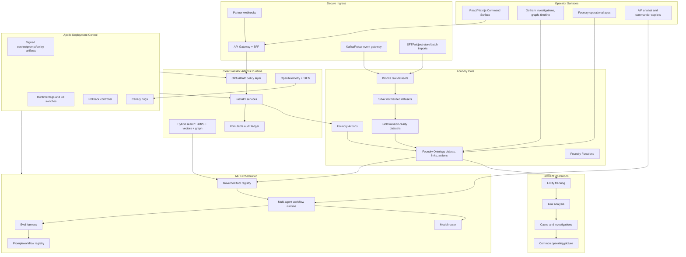
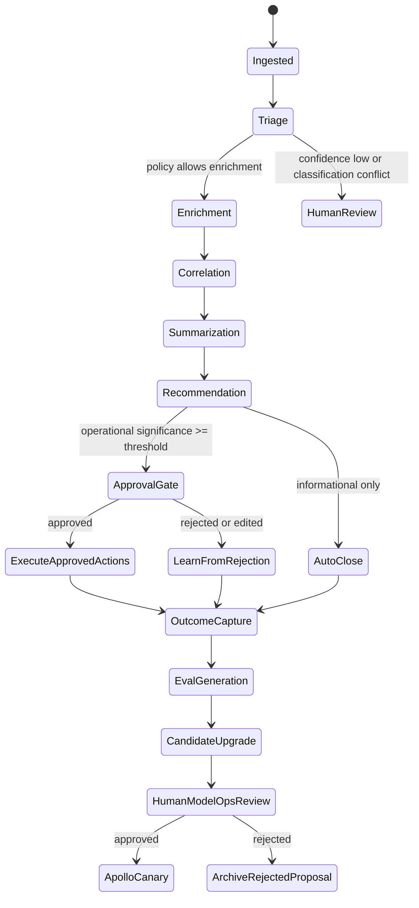

# ClearGlassInc Artemis — Palantir-Native Self-Evolving AI Intelligence Platform Implementation Blueprint

## System Architecture

ClearGlassInc Artemis is a secure, coalition-aware, audited, latency-sensitive intelligence platform built across **Palantir Gotham**, **Foundry**, **AIP**, and **Apollo**. Gotham is the operational intelligence and investigations layer. Foundry is the governed data, ontology, pipeline, and application-logic layer. AIP is the AI copilot, agent, tool, workflow, and evaluation layer. Apollo is the deployment, canary, rollback, runtime-control, and fleet-management layer.



### Full-stack layers

| Layer | ClearGlassInc Artemis responsibility | Primary production controls |
|---|---|---|
| Frontend | Mission dashboard, investigation workbench, approval queues, copilot panel, eval dashboards, release console | WebAuthn/OIDC, classification banners, field redaction, approval signing |
| API gateway | GraphQL/REST/WebSocket entry point, schema validation, mission context propagation | mTLS, JWT/SPIFFE, rate limits, idempotency keys, replay protection |
| Backend services | Event normalization, entity fusion, correlation, alerting, workflow state machines, self-upgrade proposals | Typed contracts, event sourcing, circuit breakers, policy preflight |
| Data layer | Live streams, historical lakehouse, bitemporal facts, vector index, immutable audit ledger | Encryption, lineage, retention, dataset ACLs, provenance hashes |
| Ontology layer | Foundry object types, links, Actions, Functions, mission context, temporal state | Entity-level permissions, confidence scoring, coalition markings |
| AI orchestration | AIP agents, copilots, model routing, retrieval, tool execution, evals, prompt governance | Tool allowlists, approval gates, eval thresholds, trace capture |
| Policy layer | Need-to-know, purpose-of-use, coalition boundaries, model/tool/prompt governance | OPA/Rego, ABAC, signed policy bundles, deny-by-default |
| Observability | Logs, traces, metrics, model traces, eval scorecards, drift monitors | OpenTelemetry, SIEM export, immutable audit, SLO burn alerts |
| Deployment | Apollo-managed releases of services, workflows, prompts, policies, and model-router configs | Canaries, runtime flags, rollback, promotion gates, kill switches |

## Data and Ontology

The Foundry Ontology is the operating contract for humans, services, and AIP agents. Gotham reads and writes through governed objects for investigations, while agents can only act through approved ontology Actions and Functions.

```sql
CREATE TABLE artemis_entity (
  entity_id UUID PRIMARY KEY,
  entity_type TEXT NOT NULL CHECK (entity_type IN (
    'Person','Organization','Device','Facility','Location','Sensor','CyberAsset',
    'Observation','Event','Alert','Case','Mission','Evidence','IntelProduct',
    'PromptVersion','WorkflowVersion','ModelRoute','AgentRun','ApprovalDecision'
  )),
  display_name TEXT NOT NULL,
  canonical_attributes JSONB NOT NULL DEFAULT '{}',
  confidence NUMERIC(5,4) NOT NULL CHECK (confidence BETWEEN 0 AND 1),
  classification TEXT NOT NULL,
  compartments TEXT[] NOT NULL DEFAULT '{}',
  coalition_scope TEXT NOT NULL,
  mission_tags TEXT[] NOT NULL DEFAULT '{}',
  valid_from TIMESTAMPTZ NOT NULL,
  valid_to TIMESTAMPTZ,
  system_from TIMESTAMPTZ NOT NULL DEFAULT now(),
  system_to TIMESTAMPTZ,
  lineage JSONB NOT NULL,
  provenance_hash TEXT NOT NULL
);

CREATE TABLE artemis_relationship (
  relationship_id UUID PRIMARY KEY,
  src_entity_id UUID NOT NULL REFERENCES artemis_entity(entity_id),
  dst_entity_id UUID NOT NULL REFERENCES artemis_entity(entity_id),
  relationship_type TEXT NOT NULL CHECK (relationship_type IN (
    'observed_by','located_in','associated_with','supports','contradicts',
    'derived_from','assigned_to','approved_by','uses_prompt','uses_workflow',
    'generated','opened_case_for','releasable_to'
  )),
  confidence NUMERIC(5,4) NOT NULL CHECK (confidence BETWEEN 0 AND 1),
  evidence_refs UUID[] NOT NULL DEFAULT '{}',
  classification TEXT NOT NULL,
  compartments TEXT[] NOT NULL DEFAULT '{}',
  coalition_scope TEXT NOT NULL,
  valid_from TIMESTAMPTZ NOT NULL,
  valid_to TIMESTAMPTZ,
  lineage JSONB NOT NULL
);
```

### Ontology-driven behavior

- **Humans** see mission-relevant objects through Gotham and Foundry apps, filtered by classification, compartment, coalition, role, purpose, and active mission assignment.
- **Agents** receive the same filtered ontology view through governed tools, so a copilot cannot reason over or cite data the operator is not allowed to see.
- **Actions** are first-class ontology operations: open a case, request enrichment, produce an intelligence product, request approval, or submit an action package.
- **Confidence** is attached to objects, relationships, derived summaries, and recommendations. Low-confidence records force caveated language and may block operational recommendations.
- **Lineage** stores source evidence IDs, transform versions, prompt versions, model routes, operator approvals, and transaction time.

```python
from __future__ import annotations

from dataclasses import dataclass
from datetime import datetime, timezone
from hashlib import sha256
from math import exp
from typing import Any

@dataclass(frozen=True)
class EvidenceScore:
    source_reliability: float
    corroboration_count: int
    source_independence: float
    age_hours: float
    mission_relevance: float


def compute_confidence(score: EvidenceScore) -> float:
    corroboration = min(1.0, 0.35 + 0.18 * score.corroboration_count)
    recency = exp(-score.age_hours / (24 * 14))
    raw = score.source_reliability * corroboration * score.source_independence * recency * score.mission_relevance
    return round(max(0.0, min(1.0, raw)), 4)


def provenance_hash(payload: dict[str, Any]) -> str:
    canonical = repr(sorted(payload.items())).encode("utf-8")
    return sha256(canonical).hexdigest()


def lineage(parent_ids: list[str], transform_version: str, prompt_version: str | None, model_route: str | None) -> dict[str, Any]:
    return {
        "parent_ids": parent_ids,
        "transform_version": transform_version,
        "prompt_version": prompt_version,
        "model_route": model_route,
        "system_time": datetime.now(timezone.utc).isoformat(),
    }
```

## AI and Agent Design

### Copilots

- **Analyst Copilot**: explains alerts, queries ontology context, cites evidence, drafts hypotheses, builds investigation plans, and records operator corrections.
- **Commander Copilot**: converts active cases into decision briefs, course-of-action comparisons, risk summaries, and approval packets.
- **Coalition Copilot**: generates releasable versions of products after field-level, entity-level, and relationship-level policy filtering.
- **ModelOps Copilot**: reviews proposed prompt, workflow, route, and heuristic changes with eval deltas, risk analysis, and rollback plans.

### Agent workflow



### Tool contract

```python
from enum import Enum
from pydantic import BaseModel, Field

class ToolName(str, Enum):
    QUERY_ONTOLOGY = "query_ontology"
    SEARCH_EVIDENCE = "search_evidence"
    OPEN_CASE = "open_case"
    DRAFT_INTEL_PRODUCT = "draft_intel_product"
    REQUEST_APPROVAL = "request_approval"

class ToolRequest(BaseModel):
    tool: ToolName
    mission_id: str
    operator_id: str
    purpose_of_use: str
    classification_context: str
    arguments: dict = Field(default_factory=dict)

class ToolResult(BaseModel):
    allowed: bool
    result: dict | None = None
    denial_reason: str | None = None
    audit_id: str
```

## Self-Improvement Loop

Artemis gets better by converting operator behavior and mission outcomes into evals and change proposals. It **does not** autonomously change objectives, policy, coalition boundaries, or approval thresholds for operational actions. It may propose changes to prompts, workflow graphs, model routes, retrieval parameters, feature weights, and alert heuristics, but only inside signed human-approved guardrails.

### Signals captured

```yaml
signals:
  operator_feedback:
    - false_positive
    - missed_correlation
    - bad_summary
    - missing_citation
    - unsafe_recommendation
    - over_restrictive_policy_denial
  behavior:
    - accepted_recommendation
    - edited_recommendation
    - abandoned_workflow
    - time_to_decision
    - escalation_path
  outcomes:
    - case_disposition
    - alert_precision_label
    - recall_backtest_label
    - mission_success_indicator
    - downstream_incident
  system:
    - latency_ms
    - token_cost
    - retrieval_hit_rate
    - citation_accuracy
    - policy_denials
    - model_route_failover
```

### Upgrade lifecycle

1. Capture feedback, logs, and outcomes as immutable events.
2. Convert events into eval cases with frozen input snapshots and expected outputs.
3. Run baseline evals against current prompts, workflows, routes, and heuristics.
4. Generate candidate patches in a sandbox branch of the prompt/workflow registry.
5. Run offline evals, red-team evals, policy evals, latency tests, and regression tests.
6. Submit an approval package to ModelOps and mission owners.
7. Deploy via Apollo to canary ring `r1` with rollback thresholds.
8. Promote only if live precision, recall, latency, trust, and policy metrics stay within bounds.
9. Roll back automatically on regression or manually on operator concern.

```python
from pydantic import BaseModel

class EvalCase(BaseModel):
    eval_id: str
    input_snapshot_ref: str
    expected_behavior: dict
    policy_context: dict
    source_feedback_ids: list[str]
    severity: str

class CandidateUpgrade(BaseModel):
    target_type: str  # prompt | workflow | route | heuristic
    target_name: str
    version_from: str
    patch: str
    rationale: str
    offline_scores: dict[str, float]
    risk_controls: dict[str, str]

MIN_PROMOTION = {
    "precision": 0.92,
    "recall": 0.86,
    "citation_accuracy": 0.97,
    "policy_violation_rate": 0.0,
    "p95_latency_ms": 2500,
}


def promotion_allowed(scores: dict[str, float]) -> tuple[bool, list[str]]:
    failures: list[str] = []
    for metric, threshold in MIN_PROMOTION.items():
        observed = scores[metric]
        if metric == "p95_latency_ms":
            if observed > threshold:
                failures.append(f"{metric}={observed} exceeds {threshold}")
        elif observed < threshold:
            failures.append(f"{metric}={observed} below {threshold}")
    return not failures, failures
```

## Full-Stack Implementation

### Web UI

The web UI is a mission command surface with four core panes: live event stream, entity graph, evidence-backed copilot, and approval queue.

```tsx
import React from "react";

type AlertCard = {
  alertId: string;
  severity: "low" | "medium" | "high" | "critical";
  title: string;
  confidence: number;
  classification: string;
  citations: string[];
};

export function MissionAlertPanel({ alerts, onOpen }: { alerts: AlertCard[]; onOpen: (id: string) => void }) {
  return (
    <section className="rounded-2xl border border-cyan-400/30 bg-slate-950 p-4 text-cyan-50">
      <header className="mb-3 flex items-center justify-between">
        <h2 className="text-lg font-semibold">ClearGlassInc Artemis Live Alerts</h2>
        <span className="text-xs uppercase tracking-widest text-cyan-300">audited / policy-filtered</span>
      </header>
      <div className="space-y-3">
        {alerts.map((alert) => (
          <button key={alert.alertId} onClick={() => onOpen(alert.alertId)} className="w-full rounded-xl border border-slate-700 p-3 text-left hover:border-cyan-300">
            <div className="flex justify-between">
              <strong>{alert.title}</strong>
              <span>{alert.severity.toUpperCase()}</span>
            </div>
            <div className="mt-1 text-sm text-slate-300">confidence {(alert.confidence * 100).toFixed(1)}% · {alert.classification}</div>
          </button>
        ))}
      </div>
    </section>
  );
}
```

### API gateway and backend service

```python
from fastapi import Depends, FastAPI, HTTPException
from pydantic import BaseModel

app = FastAPI(title="ClearGlassInc Artemis API", version="1.0.0")

class Principal(BaseModel):
    subject: str
    roles: list[str]
    compartments: list[str]
    coalition: str

class RecommendationRequest(BaseModel):
    mission_id: str
    alert_id: str
    purpose_of_use: str

class RecommendationResponse(BaseModel):
    recommendation_id: str
    summary: str
    requires_approval: bool
    citations: list[str]

async def current_principal() -> Principal:
    return Principal(subject="operator-123", roles=["analyst"], compartments=["MUNICIPAL_OVERSIGHT"], coalition="US")

async def policy_check(principal: Principal, action: str, resource: dict) -> None:
    allowed = "analyst" in principal.roles and resource["coalition"] == principal.coalition
    if not allowed:
        raise HTTPException(status_code=403, detail="policy denied")

@app.post("/v1/recommendations", response_model=RecommendationResponse)
async def create_recommendation(req: RecommendationRequest, principal: Principal = Depends(current_principal)):
    await policy_check(principal, "recommendation:create", {"mission_id": req.mission_id, "coalition": principal.coalition})
    context = await query_policy_filtered_context(req.alert_id, principal)
    rec = await run_recommendation_agent(context=context, principal=principal, purpose=req.purpose_of_use)
    await append_audit_event("recommendation.created", principal.subject, rec)
    return rec
```

### Event handler

```python
async def handle_normalized_event(event: dict) -> None:
    if await already_processed(event["event_id"]):
        return

    ontology_event = map_event_to_ontology(event)
    await write_foundry_object("Event", ontology_event)

    triage_input = {
        "event_id": event["event_id"],
        "mission_id": event["mission_id"],
        "classification": event["classification"],
    }
    await publish("agent.triage.requested", triage_input, key=event["event_id"])
    await mark_processed(event["event_id"])
```

### Workflow state machine

```python
from transitions import Machine

class AlertWorkflow:
    states = ["new", "triaged", "enriched", "correlated", "recommended", "approval_pending", "executed", "closed"]

    transitions = [
        {"trigger": "triage", "source": "new", "dest": "triaged"},
        {"trigger": "enrich", "source": "triaged", "dest": "enriched"},
        {"trigger": "correlate", "source": "enriched", "dest": "correlated"},
        {"trigger": "recommend", "source": "correlated", "dest": "recommended"},
        {"trigger": "require_approval", "source": "recommended", "dest": "approval_pending"},
        {"trigger": "execute", "source": "approval_pending", "dest": "executed"},
        {"trigger": "close", "source": ["recommended", "executed"], "dest": "closed"},
    ]

    def __init__(self, alert_id: str):
        self.alert_id = alert_id
        self.machine = Machine(model=self, states=self.states, transitions=self.transitions, initial="new")
```

### Policy-as-code

```rego
package artemis.authz

default allow := false

allow {
  input.principal.active == true
  input.action in {"ontology.read", "evidence.search", "case.open"}
  input.resource.classification_level <= input.principal.clearance_level
  every c in input.resource.compartments { c in input.principal.compartments }
  input.resource.coalition_scope == input.principal.coalition
  input.purpose_of_use in input.principal.allowed_purposes
}

requires_human_approval {
  input.action in {"account.isolate", "external.share", "mission.priority_change", "workflow.promote"}
}
```

### Eval pipeline

```python
async def run_eval_suite(candidate: CandidateUpgrade, cases: list[EvalCase]) -> dict[str, float]:
    total = len(cases)
    passed = 0
    citation_hits = 0
    policy_violations = 0
    latencies: list[int] = []

    for case in cases:
        result = await replay_case_with_candidate(case, candidate)
        passed += int(result.matches_expected)
        citation_hits += int(result.citations_valid)
        policy_violations += int(result.policy_violation)
        latencies.append(result.latency_ms)

    return {
        "precision": await estimate_precision(candidate),
        "recall": await estimate_recall(candidate),
        "case_pass_rate": passed / total,
        "citation_accuracy": citation_hits / total,
        "policy_violation_rate": policy_violations / total,
        "p95_latency_ms": sorted(latencies)[int(total * 0.95) - 1],
    }
```

## Security and Governance

- **Need-to-know**: access requires clearance, role, mission assignment, purpose-of-use, compartments, coalition scope, and active operational need.
- **Row/column/entity permissions**: Foundry dataset policies, ontology object security, API filters, and UI redaction all enforce the same policy decision.
- **Compartmentalization**: sensitive missions, sources, methods, and coalition caveats are stored as explicit attributes and checked on every query and tool call.
- **Zero-trust execution**: every service uses mTLS, signed workload identity, least-privilege credentials, short-lived tokens, and deny-by-default egress.
- **Immutable provenance**: every object, relationship, prompt output, model route, tool call, approval, and deployment event writes to an append-only audit ledger.
- **Model governance**: each model route has approved data domains, classification limits, latency SLOs, cost budgets, fallback behavior, and eval requirements.
- **Prompt governance**: prompts are versioned, hashed, evaluated, human-approved, deployed through Apollo, and rolled back on metric regression.
- **Policy governance**: Rego bundles are signed artifacts with peer review, simulation tests, and emergency break-glass procedures.

## Code Examples

### Ontology query with policy filtering

```python
async def query_policy_filtered_context(alert_id: str, principal: Principal) -> dict:
    sql = """
    SELECT e.entity_id, e.entity_type, e.display_name, e.confidence, e.classification,
           e.compartments, e.coalition_scope, e.lineage
    FROM artemis_entity e
    JOIN artemis_relationship r ON r.dst_entity_id = e.entity_id
    WHERE r.src_entity_id = :alert_id
      AND e.coalition_scope = :coalition
      AND e.classification <= :clearance
      AND e.compartments <@ :compartments
    """
    return await db.fetch_all(sql, {
        "alert_id": alert_id,
        "coalition": principal.coalition,
        "clearance": max_clearance(principal),
        "compartments": principal.compartments,
    })
```

### AIP-style tool call adapter

```python
async def run_recommendation_agent(context: dict, principal: Principal, purpose: str) -> RecommendationResponse:
    tool_request = ToolRequest(
        tool=ToolName.SEARCH_EVIDENCE,
        mission_id=context["mission_id"],
        operator_id=principal.subject,
        purpose_of_use=purpose,
        classification_context=context["classification"],
        arguments={"query": context["alert_summary"], "limit": 25},
    )
    evidence = await execute_tool(tool_request, principal)
    completion = await model_router.complete(
        route="commander_recommendation_v3",
        messages=[
            {"role": "system", "content": "Produce evidence-cited, policy-aware recommendations. Never execute actions."},
            {"role": "user", "content": {"context": context, "evidence": evidence.result}},
        ],
        metadata={"mission_id": context["mission_id"], "operator_id": principal.subject},
    )
    return RecommendationResponse(**completion.structured_output)
```

### Apollo rollout manifest

```yaml
artifact: clearglassinc-artemis-agent-pack
version: 2026.07.01-r1
components:
  prompts:
    commander_recommendation: sha256:9f2a...
    analyst_triage: sha256:28cc...
  workflows:
    alert_triage_graph: sha256:ab71...
  policies:
    artemis_authz_bundle: sha256:66ef...
canary:
  rings:
    - name: r1
      percent: 5
      duration: 2h
      rollback_on:
        policy_violation_rate: "> 0"
        precision_drop: "> 0.03"
        p95_latency_ms: "> 2500"
    - name: r2
      percent: 25
      duration: 6h
    - name: stable
      percent: 100
approvals:
  modelops: required
  mission_owner: required
  security: required
```

## Scenario Walkthrough

1. A live cyber and operational telemetry event enters ClearGlassInc Artemis through the streaming gateway.
2. The normalizer writes a Bronze raw record, computes a provenance hash, emits `normalized.event.created`, and stores lineage.
3. Foundry pipelines promote the event into Silver and Gold datasets, then map it into the Ontology as an `Event` linked to `Device`, `Location`, `Mission`, and `Evidence` objects.
4. Gotham immediately displays the event in the active investigation graph and mission timeline.
5. The AIP Triage Agent receives the event and queries only policy-filtered context. It scores the alert as medium confidence because there is one reliable source and weak corroboration.
6. The Enrichment Agent searches recent evidence, finds two related authentication anomalies, and updates the confidence score with lineage to all supporting evidence.
7. The Correlation Agent links the event to an active case and asks the Summarization Agent to prepare a concise, cited explanation.
8. The Recommendation Agent proposes two actions: increase collection and isolate an account. Because isolation is operationally significant, the system creates an approval package instead of executing it.
9. The commander approves increased collection, edits the rationale, and rejects immediate isolation because it could disrupt a live mission.
10. The approval decision, edit diff, rejection rationale, final case outcome, and later mission result become immutable learning signals.
11. The self-improvement controller converts those signals into eval cases showing that similar medium-confidence anomalies should recommend staged collection before isolation.
12. A candidate prompt and workflow threshold update is generated. Offline evals show improved precision, stable recall, zero policy violations, and lower rejection rate.
13. ModelOps and the mission owner approve the patch. Apollo deploys it to canary ring `r1` with rollback triggers.
14. If live metrics remain healthy, Apollo promotes the change. If citation accuracy, policy compliance, latency, or operator trust regress, Apollo rolls back to the previous signed version.

## Validation Gates

ClearGlassInc Artemis should be promoted only through explicit validation gates:

- **Gate 1 — Technical**: schema tests, policy tests, eval replay, integration tests, Apollo dry-run, rollback simulation.
- **Gate 2 — Operational**: tabletop mission exercise, red-team prompt/tool tests, coalition releasability review, commander approval workflow validation.
- **Gate 3 — Production**: canary release, live SLO monitoring, audit review, after-action report, and ModelOps promotion decision.

### Drift detector

```python
from statistics import mean

async def detect_behavior_drift(metric_name: str, baseline_window: list[float], live_window: list[float]) -> dict:
    baseline = mean(baseline_window)
    live = mean(live_window)
    delta = live - baseline
    severity = "normal"
    if metric_name in {"policy_violation_rate", "false_positive_rate", "p95_latency_ms"} and delta > baseline * 0.15:
        severity = "rollback_watch"
    if metric_name in {"precision", "citation_accuracy", "operator_acceptance_rate"} and delta < -0.05:
        severity = "rollback_watch"
    return {"metric": metric_name, "baseline": baseline, "live": live, "delta": delta, "severity": severity}
```

### Human approval token

```python
from datetime import timedelta
from uuid import uuid4

async def issue_approval_token(operator: Principal, action: str, mission_id: str, package_hash: str) -> dict:
    await policy_check(operator, "approval.issue", {"mission_id": mission_id, "coalition": operator.coalition})
    token = {
        "approval_id": str(uuid4()),
        "operator_id": operator.subject,
        "action": action,
        "mission_id": mission_id,
        "package_hash": package_hash,
        "issued_at": datetime.now(timezone.utc).isoformat(),
        "expires_at": (datetime.now(timezone.utc) + timedelta(minutes=15)).isoformat(),
    }
    await append_audit_event("approval.token.issued", operator.subject, token)
    return token
```
