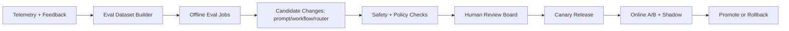

# ClearGlassInc Artemis — Self-Evolving AI Intelligence Platform

## System Architecture

### 1) End-to-end topology

```mermaid
flowchart LR
  subgraph Edge[Secure Mission Edge]
    UI[Web UI / Ops Console]
    API[API Gateway]
  end

  subgraph Core[Foundry + Gotham + AIP Runtime]
    IAM[AuthN/AuthZ + Policy Decision Point]
    CMD[Command Service]
    EVT[Event Bus (Kafka/PubSub)]
    ING[Ingestion Services]
    ONT[Foundry Ontology + Object/Link Store]
    LKH[Lakehouse + Feature Store]
    RAG[Search/Retrieval + Vector Index]
    ORCH[Agent Orchestrator]
    MR[Model Router]
    EVAL[Eval & Experiment Engine]
    OBS[Observability + Audit]
  end

  subgraph Deploy[Apollo Deployment Fabric]
    CD[Progressive Delivery]
    RB[Rollback Control]
    CFG[Runtime Config + Feature Flags]
  end

  FEEDS[Live/Historical Feeds] --> ING
  UI --> API --> IAM --> CMD
  CMD --> EVT
  ING --> EVT
  EVT --> ONT
  EVT --> LKH
  EVT --> ORCH
  ORCH --> RAG
  ORCH --> MR
  ORCH --> ONT
  MR --> ORCH
  ORCH --> EVT
  EVAL --> ORCH
  OBS --> EVAL
  CFG --> ORCH
  CD --> API
  RB --> ORCH
```

### 2) Palantir role mapping

- **Gotham**: live operational intelligence, case management, target/entity tracking, geospatial/temporal views.
- **Foundry**: ontology, data fusion pipelines, business logic transforms, object-level lineage.
- **AIP**: copilots, agent workflows, tool-use orchestration, eval harness.
- **Apollo**: secure deployment across enclaves, release channels, rollback and runtime governance.

### 3) Layered full-stack design

- **Frontend**: React + TypeScript + map/timeline analyst UX, action approval panels, confidence/provenance overlays.
- **Backend**: Python (FastAPI) microservices + workflow engine + async workers.
- **Data layer**: streaming ingest, lakehouse (Parquet/Delta/Iceberg), online feature cache.
- **Ontology layer**: entity/link/event model with temporal versioning and mission context.
- **AI orchestration layer**: model routing + tool-calling + multi-agent state machines.
- **Policy layer**: policy-as-code (OPA/Rego style), release gates, action approvals.
- **Observability layer**: logs, traces, model eval metrics, incident timeline.
- **Deployment layer**: Apollo release rings, canary, signed artifacts, automated rollback.

---

## Data and Ontology

### 1) Core ontology objects (Foundry)

```text
Entity
  - entity_id (UUID)
  - type (Person, Device, Account, Organization, Asset, Location)
  - canonical_name
  - aliases[]
  - confidence (0..1)
  - compartments[]
  - coalition_tags[]
  - created_at, updated_at
  - valid_time_start, valid_time_end
  - lineage_ref

Relationship
  - rel_id
  - src_entity_id
  - dst_entity_id
  - rel_type (owns, contacted, traveled_with, transferred_to)
  - confidence
  - evidence_refs[]
  - temporal_window
  - mission_context_id

Event
  - event_id
  - event_type
  - occurred_at
  - location
  - raw_payload_ref
  - derived_features
  - confidence
  - source_reliability

Case
  - case_id
  - priority
  - status
  - assigned_team
  - hypotheses[]
  - recommended_actions[]
  - approvals[]

MissionContext
  - mission_context_id
  - operation_name
  - rules_of_engagement
  - policy_bundle_version
  - coalition_scope
```

### 2) Ontology-driven behavior

- Copilots receive **mission-scoped ontology view** (not raw global graph).
- Agent permissions are constrained to entity classes + compartments.
- Every recommendation references provenance chain: `source -> transform -> model -> output`.
- Temporal reasoning uses valid-time + transaction-time to prevent stale inference.

### 3) SQL + graph hybrid retrieval

```sql
-- candidate entities near event time with confidence floor
SELECT e.entity_id, e.type, e.canonical_name, e.confidence
FROM ontology_entities e
JOIN entity_event_links l ON l.entity_id = e.entity_id
JOIN events ev ON ev.event_id = l.event_id
WHERE ev.occurred_at BETWEEN :t0 AND :t1
  AND e.confidence >= 0.72
  AND e.compartment @> ARRAY[:compartment]
ORDER BY e.confidence DESC
LIMIT 200;
```

---

## AI and Agent Design

### 1) Copilots

- **Analyst Copilot**: triage queue, entity enrichment suggestions, hypothesis drafting.
- **Commander Copilot**: prioritized action packages, risk/collateral simulation, approval workflows.

### 2) Multi-agent pipeline

1. **Triage Agent**: classify event severity + route queue.
2. **Enrichment Agent**: pull entities/links/features.
3. **Correlation Agent**: cross-case/temporal correlation.
4. **Summarization Agent**: draft intel product.
5. **Recommendation Agent**: produce options with confidence and policy constraints.

### 3) Tool-using actions (gated)

- query ontology
- query signals/time-series
- open/update case
- draft action package
- request human approval

Operationally significant actions are blocked behind explicit `HUMAN_APPROVAL_REQUIRED` guard.

---

## Self-Improvement Loop

### 1) Feedback capture

Signals captured per decision:
- operator edits/diffs to AI output
- approval/rejection with reason codes
- downstream mission outcome label
- alert true/false positive outcome
- latency + confidence + escalation path

### 2) Improvement pipeline



### 3) Safe evolution controls

- Version everything: prompts, tools, workflows, routing policies, model bundles.
- Drift detection: distribution shift on inputs and confidence calibration.
- Auto-rollback when any SLO breaks (precision, latency, policy violations).
- Immutable audit record for each change proposal and approval.

---

## Full-Stack Implementation

### 1) Web UI

- Live event map + timeline
- Case board with AI rationale/provenance cards
- Recommendation drawer with approve/reject + reason taxonomy
- Eval cockpit with prompt/workflow experiments

### 2) API Gateway + backend services

- `ingest-service`
- `ontology-service`
- `case-service`
- `agent-orchestrator`
- `policy-service`
- `eval-service`
- `release-controller`

### 3) Streaming and storage

- Event bus topics:
  - `raw.events`
  - `normalized.events`
  - `agent.decisions`
  - `operator.feedback`
  - `eval.results`
- Lakehouse zones: bronze/silver/gold + feature snapshots.

### 4) Model router

- route by task criticality, latency budget, data sensitivity, and prior eval score.
- supports small local models for low latency and large models for deep reasoning.

---

## Security and Governance

- Need-to-know ABAC + RBAC + mission tags.
- Row/column/entity level access filters enforced at query and tool layers.
- Coalition boundaries encoded as mandatory policy constraints.
- Zero-trust service identity (mTLS, short-lived credentials).
- Signed artifacts and verified runtime attestation.
- Prompt governance: approved templates only in production ring.
- Model governance: allowed model registry + risk tiering + evaluation thresholds.

---

## Code Examples (Python-first)

### 1) FastAPI gateway with policy check

```python
from fastapi import FastAPI, Depends, HTTPException
from pydantic import BaseModel
from typing import Literal

app = FastAPI(title="ClearGlassInc Artemis API")

class ActionRequest(BaseModel):
    case_id: str
    action_type: Literal["OPEN_CASE", "DISPATCH", "REQUEST_COLLECTION"]
    payload: dict

async def enforce_policy(user_ctx: dict, action: str, mission_context_id: str) -> None:
    # call policy engine (OPA/Rego or Foundry policy service)
    allowed = user_ctx.get("clearance") == "mission" and action != "DISPATCH"
    if not allowed:
        raise HTTPException(status_code=403, detail="policy_denied")

@app.post("/v1/actions/propose")
async def propose_action(req: ActionRequest, user_ctx: dict = Depends(lambda: {"clearance": "mission"})):
    await enforce_policy(user_ctx, req.action_type, mission_context_id="mc-772")
    return {
        "proposal_id": "prop-123",
        "status": "HUMAN_APPROVAL_REQUIRED",
        "risk_score": 0.31,
        "explanation": "Action requires commander sign-off by policy bundle v18"
    }
```

### 2) Agent workflow state machine

```python
from enum import Enum

class Stage(str, Enum):
    TRIAGE = "triage"
    ENRICH = "enrich"
    CORRELATE = "correlate"
    SUMMARIZE = "summarize"
    RECOMMEND = "recommend"
    APPROVAL_GATE = "approval_gate"

class Workflow:
    def __init__(self, tools, router):
        self.tools = tools
        self.router = router

    async def run(self, event):
        triage = await self.tools.triage(event)
        enriched = await self.tools.enrich(triage)
        corr = await self.tools.correlate(enriched)
        summary = await self.tools.summarize(corr)
        rec = await self.tools.recommend(summary)
        rec["status"] = "HUMAN_APPROVAL_REQUIRED"
        return rec
```

### 3) Event handler + ontology upsert

```python
import json
from aiokafka import AIOKafkaConsumer

async def consume_normalized_events(ontology_repo):
    consumer = AIOKafkaConsumer("normalized.events", bootstrap_servers="kafka:9092")
    await consumer.start()
    try:
        async for msg in consumer:
            ev = json.loads(msg.value)
            await ontology_repo.upsert_event(ev)
            await ontology_repo.link_entities(ev["event_id"], ev.get("entity_candidates", []))
    finally:
        await consumer.stop()
```

### 4) Prompt experiment + eval pipeline

```python
from dataclasses import dataclass
from statistics import mean

@dataclass
class EvalResult:
    prompt_version: str
    precision: float
    recall: float
    latency_ms: int
    policy_violations: int


def promote_candidate(results: list[EvalResult]) -> str:
    # hard gates
    viable = [r for r in results if r.policy_violations == 0 and r.latency_ms < 1800]
    if not viable:
        return "rollback"

    score = lambda r: 0.45 * r.precision + 0.35 * r.recall + 0.20 * (1 - (r.latency_ms / 1800))
    winner = max(viable, key=score)
    return winner.prompt_version


def drift_alarm(current_confidences: list[float], baseline_confidences: list[float]) -> bool:
    return abs(mean(current_confidences) - mean(baseline_confidences)) > 0.12
```

### 5) Human-approved self-upgrade manifest

```yaml
change_id: chg-2026-05-07-041
type: prompt_update
target_workflow: recommendation_agent
from_version: prompt.v22
to_version: prompt.v23
evidence:
  eval_run: eval-8891
  precision_delta: +0.07
  recall_delta: +0.04
  latency_delta_ms: +120
risk_assessment:
  policy_violations: 0
  drift_risk: low
approvals:
  - role: lead_analyst
    user: artemis.ops.17
    at: 2026-05-07T03:11:09Z
  - role: mission_commander
    user: artemis.cmd.02
    at: 2026-05-07T03:13:22Z
rollout:
  strategy: canary
  ring: coalition-alpha
  auto_rollback_on:
    - precision_drop_gt: 0.03
    - p95_latency_gt_ms: 2200
```

---

## Scenario Walkthrough (Cinematic + Credible)

1. **00:00:00 UTC** — A cross-domain signal (network anomaly + travel metadata + comms spike) lands in `raw.events`.
2. **00:00:03** — Ingestion normalizes and enriches source reliability; event written to ontology.
3. **00:00:05** — Triage agent marks severity `HIGH`, opens candidate case.
4. **00:00:08** — Correlation agent links subject to prior dormant case with 0.81 confidence.
5. **00:00:12** — Recommendation agent proposes three response options with risks and expected mission impact.
6. **00:00:15** — Commander copilot requests human approval for Option B (collection tasking).
7. **00:00:31** — Operator rejects Option B, approves Option C, adds correction note: “false positive pattern resembles maintenance burst.”
8. **00:01:00** — Feedback event written: reject reason + correction diff + outcome pending label.
9. **T+24h** — Outcome labels indicate Option C reduced false escalation rate by 18%.
10. **Eval job** builds dataset from similar incidents; new prompt/workflow candidate emerges.
11. **Review board** approves canary release to one coalition ring.
12. **Canary results** pass thresholds; Apollo promotes to broader ring with rollback guard.
13. **System improvement realized**: future similar events are down-ranked earlier, cutting analyst load and preserving precision.

This is how ClearGlassInc Artemis becomes smarter continuously—through controlled, auditable, human-governed adaptation rather than unsafe autonomous goal drift.
