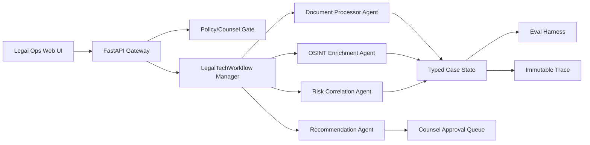

# ClearGlassInc Artemis — Legal-Tech Agentic Automation MVP

## System Architecture

ClearGlassInc Artemis legal automation uses a manager-style multi-agent workflow that can be deployed as a deterministic MVP today and later swapped behind OpenAI Agents SDK, LangGraph, or Palantir AIP orchestration. Current public documentation patterns emphasize typed tools, handoffs, guardrails, tracing, and explicit workflow state; this repository implements those patterns locally so privileged legal content stays offline during demo execution.



## Data and Ontology

The MVP ontology is represented by Python dataclasses that map cleanly to Foundry object types:

- `LegalDocument`: uploaded contract, filing, letter, evidence packet, or policy document.
- `Evidence`: cited extraction or enrichment artifact with source, claim, confidence, and stable hash ID.
- `LegalCaseState`: mission/matter state flowing between agents, including jurisdiction, extracted clauses, public-record enrichment targets, risk score, recommendations, approval flag, and trace.
- `RiskLevel`: deterministic triage label used by dashboards and eval assertions.

Production Foundry mappings:

```sql
create table legal_matter (
  matter_id text primary key,
  jurisdiction text not null,
  risk_score numeric not null,
  risk_level text not null,
  approval_required boolean not null,
  created_at timestamptz default now()
);

create table legal_evidence (
  evidence_id text primary key,
  matter_id text references legal_matter(matter_id),
  source text not null,
  claim text not null,
  confidence numeric not null,
  provenance_hash text not null
);
```

## AI and Agent Design

The MVP contains four collaborating agents:

1. **Document Processor Agent** extracts indemnity, termination, privacy/AI, venue, and payment signals from legal documents.
2. **OSINT Enrichment Agent** identifies organization entities suitable for approved public-record diligence.
3. **Risk Correlation Agent** converts legal and OSINT signals into a deterministic review-priority score.
4. **Recommendation Agent** prepares an action package while preserving a mandatory counsel-review gate.

Operationally significant actions are never autonomous. The recommendation agent can prepare checklists, redline queues, and diligence tasks, but it cannot finalize legal advice, approve filings, send external notices, waive rights, or execute contracts.

## Self-Improvement Loop

The workflow improves safely through evals rather than uncontrolled self-modification:

1. Capture operator accept/reject/edit signals, counsel corrections, false positives, false negatives, latency, and outcome labels.
2. Convert signals into versioned fixtures: input matter, expected risk level, expected extracted clauses, required denial/refusal behavior, and required approval gate.
3. Evaluate any prompt, regex, retrieval, routing, or model change against regression fixtures.
4. Promote only when error rate remains below the configured threshold, counsel gate coverage remains 100%, and no policy violation appears.
5. Store all workflow versions, agent versions, policy versions, and trace output for rollback.

## Full-Stack Implementation

Recommended production services:

- `legal-intake-api`: receives documents and creates Foundry ontology objects.
- `legal-agent-runtime`: runs the multi-agent graph and emits trace spans.
- `legal-policy-service`: enforces jurisdiction, privilege, confidentiality, and counsel-review rules.
- `legal-eval-service`: continuously tests candidate workflow changes.
- `legal-approval-ui`: displays extracted clauses, citations, risk score, recommendations, and approve/reject/edit controls.

Representative API:

```http
POST /v1/legal/matters
POST /v1/legal/matters/{matter_id}/run-agent-workflow
POST /v1/legal/matters/{matter_id}/feedback
POST /v1/legal/workflow-candidates/{candidate_id}/approve
POST /v1/legal/workflow-candidates/{candidate_id}/rollback
```

## Security and Governance

- Privileged inputs remain inside the tenant boundary.
- Every evidence item has source and stable ID.
- Every workflow run emits a trace.
- Counsel approval is required for all substantive legal recommendations.
- Public-record enrichment is queued rather than executed against uncontrolled sources in the offline MVP.
- The system states that outputs are technical triage, not legal advice.

## Code Examples

Run the deterministic demo:

```bash
python artemis_legal_agent_mvp.py
```

Run the eval harness and collaboration tests:

```bash
python -m pytest tests/test_artemis_legal_agent_mvp.py -q
```

## Scenario Walkthrough

A contract arrives at 8:00 AM. The document contains personal-data/model-training language, indemnity, termination, venue, and payment terms. The document processor extracts those clauses with citations. The OSINT enrichment agent detects `Northstar Holdings LLC` and queues approved public-record diligence. The risk agent scores the matter as critical because multiple high-signal clauses and counterparty diligence signals appear together. The recommendation agent prepares a counsel-gated package: validate governing law, review privacy/AI terms, generate a redline checklist, and complete diligence before approval.

At review time, counsel edits one extracted clause and marks one recommendation too broad. Artemis stores that correction as an eval fixture. A future workflow candidate must reproduce the corrected clause treatment, preserve the approval gate, and maintain below-5% error before it can be promoted.
