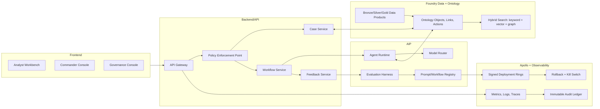

# ClearGlassInc Artemis — System 2040 Self-Evolving Intelligence Blueprint

## System Architecture

ClearGlassInc Artemis is a secure, coalition-aware, multi-domain intelligence platform that combines **Palantir Gotham** for investigations and entity tracking, **Foundry** for data integration and ontology-backed application logic, **AIP** for copilots, agents, evaluations, and workflow automation, and **Apollo** for controlled deployment, rollback, and runtime governance.



### Layer Responsibilities

| Layer | Production responsibility |
|---|---|
| Frontend | Secure web UI for graph exploration, map/timeline correlation, action approvals, evaluation dashboards, and governance review. |
| Backend | Mission APIs, case lifecycle, workflow orchestration, tool execution, feedback capture, and operator approval gates. |
| Data layer | Live and historical ingestion, quality checks, bitemporal storage, lineage, derived features, and lakehouse materializations. |
| Ontology layer | Foundry-backed objects, relationships, actions, permissions, confidence, provenance, and temporal state. |
| AI orchestration | AIP copilots, tool-using agents, model routing, eval generation, prompt/workflow candidates, and recommendation packaging. |
| Policy layer | Need-to-know ABAC/ReBAC, coalition release rules, row/column/entity controls, prompt constraints, and action authorization. |
| Observability | OpenTelemetry, audit ledger, eval scorecards, drift monitors, operator-trust analytics, and incident replay. |
| Deployment | Apollo canaries, signed bundles, environment-specific controls, rollback, runtime kill switches, and policy bundle delivery. |

## Data and Ontology

The ontology is the operational contract between humans, services, and agents. Gotham uses it for investigations and entity tracking; Foundry uses it for data products and actions; AIP uses it to ground tool calls, retrieval, recommendations, and explanations.

### Core Entities

```sql
create table artemis_entity (
  entity_id uuid primary key,
  entity_type text not null check (entity_type in (
    'Person','Organization','Device','IpAddress','Domain','Software','Sensor',
    'Location','Facility','Event','Observation','Indicator','ThreatActor',
    'Vulnerability','Case','Mission','Task','Report','ActionPackage'
  )),
  display_name text not null,
  attributes jsonb not null default '{}',
  confidence numeric(5,4) not null check (confidence between 0 and 1),
  classification text not null,
  releasability text[] not null,
  compartments text[] not null,
  lineage_ref text not null,
  provenance_hash text not null,
  valid_from timestamptz not null,
  valid_to timestamptz,
  system_from timestamptz not null default now(),
  system_to timestamptz
);

create table artemis_relationship (
  relationship_id uuid primary key,
  src_entity_id uuid not null references artemis_entity(entity_id),
  dst_entity_id uuid not null references artemis_entity(entity_id),
  relationship_type text not null,
  confidence numeric(5,4) not null check (confidence between 0 and 1),
  evidence_refs text[] not null,
  classification text not null,
  releasability text[] not null,
  compartments text[] not null,
  valid_from timestamptz not null,
  valid_to timestamptz,
  system_from timestamptz not null default now(),
  system_to timestamptz
);
```

### Required Ontology Semantics

- **Confidence**: combined source reliability, corroboration, model agreement, recency, and contradiction penalties.
- **Lineage**: every object and link carries upstream dataset, transform version, model/prompt version, and evidence hash.
- **Temporal state**: bitemporal records answer both “what happened then?” and “what did Artemis know at the time?”
- **Mission context**: object access and AI behavior are scoped by mission, clearance, compartment, purpose of use, and coalition caveats.
- **Permissions**: row, column, entity, edge, and action-level controls are enforced before data reaches users or models.

## AI and Agent Design

### Copilots

- **Analyst Copilot**: searches the ontology, disambiguates entities, builds timelines, summarizes evidence, flags gaps, and drafts intelligence products.
- **Commander Copilot**: compares courses of action, quantifies mission risk, prepares approval packages, and explains operational tradeoffs.
- **Governance Copilot**: explains policy denials, compares prompt/workflow releases, and prepares review-board evidence.

### Multi-Agent Workflows

```yaml
workflow: artemis-intel-response-v1
agents:
  - triage_agent: classify event, determine mission relevance, assign initial severity
  - enrichment_agent: query Foundry ontology, retrieve evidence, expand entities
  - correlation_agent: connect live event to cases, missions, IOCs, CVEs, facilities
  - summarization_agent: produce cited analyst brief with confidence and gaps
  - recommendation_agent: generate COAs with risk, assumptions, and rollback options
  - approval_gate_agent: enforce human review for operationally significant actions
  - learning_agent: convert outcomes and corrections into eval examples
hard_rules:
  no_autonomous_external_action: true
  no_cross_compartment_disclosure: true
  no_unapproved_prompt_or_policy_release: true
```

### Tool Contract

Agents use explicit, schema-validated tools. They cannot run arbitrary actions; every tool checks policy, emits audit records, and returns citations.

```python
from pydantic import BaseModel, Field
from typing import Literal

class MissionContext(BaseModel):
    mission_id: str
    actor_id: str
    clearance: Literal['U', 'CUI', 'SECRET', 'TS']
    compartments: list[str]
    coalition: list[str]
    purpose: str

class OntologyQuery(BaseModel):
    template: Literal['entity_search', 'case_timeline', 'related_indicators', 'mission_assets']
    parameters: dict
    limit: int = Field(default=25, ge=1, le=200)
    context: MissionContext

async def query_ontology(input: OntologyQuery) -> dict:
    decision = await opa_allow('artemis.query', input.model_dump())
    if not decision.allow:
        await audit('query_denied', input.context.actor_id, decision.reason)
        return {'rows': [], 'denied': True, 'reason': decision.reason}
    rows = await foundry_ontology_query(input.template, input.parameters, input.context)
    await audit('query_allowed', input.context.actor_id, {'template': input.template, 'count': len(rows)})
    return {'rows': rows, 'citations': [r['lineage_ref'] for r in rows]}
```

## Self-Improvement Loop

ClearGlassInc Artemis gets better by proposing bounded improvements, not by changing its own objectives. The platform can generate candidates for prompts, workflows, heuristics, and model routing, but every release is evaluated, signed, approved, deployed gradually, and reversible.

### Signal Capture

```python
class FeedbackEvent(BaseModel):
    event_id: str
    mission_id: str
    actor_id: str
    artifact_id: str
    artifact_type: Literal['summary','recommendation','tool_result','alert','action_package']
    signal: Literal['accepted','rejected','edited','false_positive','false_negative','late','unsafe','high_value']
    correction_text: str | None = None
    outcome_score: float | None = Field(default=None, ge=0, le=1)
    prompt_version: str
    workflow_version: str
    model_route: str
    latency_ms: int
```

### Improvement Pipeline

1. Capture operator edits, approvals, denials, false positives, false negatives, query logs, alert outcomes, and mission results.
2. Convert signals into stratified evaluation examples by mission type, classification, data source, and task family.
3. Generate candidate prompt, workflow, retrieval, model-routing, and scoring-rule changes.
4. Run offline regression evals for precision, recall, citation quality, refusal correctness, leakage risk, latency, and cost.
5. Create a signed `ChangeProposal` with metrics, diffs, blast radius, rollback plan, and reviewer checklist.
6. Require human approval before Apollo canary deployment.
7. Roll out to Ring 0, Ring 1, and mission-wide rings only if SLOs and safety gates hold.
8. Roll back automatically on drift, policy violations, trust degradation, or latency regressions.

```python
@dataclass(frozen=True)
class EvalScore:
    candidate_id: str
    precision: float
    recall: float
    citation_accuracy: float
    policy_violations: int
    p95_latency_ms: int
    operator_trust_delta: float


def release_gate(champion: EvalScore, challenger: EvalScore) -> bool:
    return (
        challenger.policy_violations == 0 and
        challenger.precision >= champion.precision + 0.015 and
        challenger.recall >= champion.recall - 0.005 and
        challenger.citation_accuracy >= 0.97 and
        challenger.p95_latency_ms <= 1200 and
        challenger.operator_trust_delta >= 0
    )
```

## Full-Stack Implementation

### API Surface

```http
POST /v1/intel/intake
POST /v1/ontology/query
POST /v1/agents/run
POST /v1/cases
POST /v1/action-packages/{id}/approve
POST /v1/feedback
GET  /v1/evals/releases
POST /v1/releases/{id}/approve
POST /v1/releases/{id}/rollback
```

### Backend Event Handler

```python
from fastapi import FastAPI, Depends, HTTPException
from pydantic import BaseModel

app = FastAPI(title='ClearGlassInc Artemis API')

class IntelEvent(BaseModel):
    source: str
    event_type: str
    payload: dict
    observed_at: str
    classification: str
    compartments: list[str]

@app.post('/v1/intel/intake')
async def intake_event(event: IntelEvent, user=Depends(current_user)):
    decision = await opa_allow('artemis.ingest', {'event': event.model_dump(), 'user': user.model_dump()})
    if not decision.allow:
        raise HTTPException(status_code=403, detail=decision.reason)
    normalized = normalize_event(event)
    await publish('intel.raw', normalized)
    await audit('intel_intake', user.user_id, {'event_id': normalized['event_id']})
    return {'status': 'accepted', 'event_id': normalized['event_id']}
```

### Workflow State Machine

```python
from enum import Enum

class ActionState(str, Enum):
    DRAFT = 'draft'
    PENDING_APPROVAL = 'pending_approval'
    APPROVED = 'approved'
    REJECTED = 'rejected'
    EXECUTED = 'executed'
    ROLLED_BACK = 'rolled_back'

TRANSITIONS = {
    ActionState.DRAFT: {ActionState.PENDING_APPROVAL},
    ActionState.PENDING_APPROVAL: {ActionState.APPROVED, ActionState.REJECTED},
    ActionState.APPROVED: {ActionState.EXECUTED, ActionState.ROLLED_BACK},
    ActionState.EXECUTED: {ActionState.ROLLED_BACK},
    ActionState.REJECTED: set(),
    ActionState.ROLLED_BACK: set(),
}

def transition(current: ActionState, target: ActionState) -> ActionState:
    if target not in TRANSITIONS[current]:
        raise ValueError(f'invalid transition: {current} -> {target}')
    return target
```

### Model Router

```python
def route_model(task: str, classification: str, latency_budget_ms: int, requires_reasoning: bool) -> str:
    if classification in {'SECRET', 'TS'}:
        return 'sovereign-secure-model-large'
    if task in {'triage', 'dedupe'} and latency_budget_ms <= 600:
        return 'low-latency-secure-model-small'
    if requires_reasoning:
        return 'reasoning-secure-model-large'
    return 'balanced-secure-model-medium'
```

### Policy-as-Code

```rego
package artemis.action

default allow := false

allow {
  input.user.clearance_rank >= input.action.required_clearance_rank
  every c in input.action.compartments { c in input.user.compartments }
  input.user.mission_id == input.action.mission_id
  input.action.risk_score <= 0.45
  input.action.human_approved == true
}
```

## Security and Governance

- **Need-to-know access control**: every query is scoped by user, role, mission, purpose, clearance, compartments, and coalition releasability.
- **Row/column/entity permissions**: sensitive fields are masked or omitted before retrieval, model context construction, or UI rendering.
- **Compartmentalization**: coalition boundaries are encoded in ontology metadata, OPA policy, and cross-domain release workflows.
- **Zero-trust execution**: mTLS, workload identity, short-lived tokens, signed service-to-service calls, and isolated tool sandboxes.
- **Immutable logs**: all data reads, tool calls, model routes, prompt versions, workflow versions, approvals, denials, and deployments are append-only.
- **Model governance**: model cards, evaluation thresholds, approved use cases, red-team results, and rollback playbooks are required for each release.
- **Prompt governance**: prompt diffs are versioned, reviewed, evaluated, signed, and deployed via Apollo rings.

## Code Examples

### Agent Planner Skeleton

```python
class AgentPlan(BaseModel):
    objective: str
    steps: list[str]
    required_tools: list[str]
    approval_required: bool
    risk_score: float

async def plan_response(event_id: str, context: MissionContext) -> AgentPlan:
    evidence = await query_ontology(OntologyQuery(
        template='case_timeline',
        parameters={'event_id': event_id},
        context=context,
    ))
    plan = await aip_generate_plan(evidence=evidence, context=context)
    if plan.risk_score > 0.25 or 'create_action_package' in plan.required_tools:
        plan.approval_required = True
    await audit('agent_plan_created', context.actor_id, plan.model_dump())
    return plan
```

### Eval Dataset Builder

```python
async def build_eval_examples(feedback_batch: list[FeedbackEvent]) -> list[dict]:
    examples = []
    for f in feedback_batch:
        if f.signal in {'edited', 'false_positive', 'false_negative', 'unsafe'}:
            original = await artifact_store.get(f.artifact_id)
            examples.append({
                'input': original['input_context'],
                'bad_output': original['output'],
                'expected_output': f.correction_text,
                'labels': {'signal': f.signal, 'mission_id': f.mission_id},
                'versions': {
                    'prompt': f.prompt_version,
                    'workflow': f.workflow_version,
                    'model_route': f.model_route,
                },
            })
    return examples
```

## Scenario Walkthrough

1. **Live event enters**: a streaming connector receives a high-confidence cyber indicator tied to infrastructure relevant to an active mission. The intake service validates schema, checks ingest policy, writes to `intel.raw`, and stores lineage.
2. **Platform triages**: the triage agent classifies severity, queries Foundry ontology for related assets, and detects that the indicator touches a mission-critical facility.
3. **Agents correlate**: enrichment and correlation agents link the indicator to prior observations, open CVEs, affected devices, and existing cases while preserving confidence and citations.
4. **Recommendation appears**: the recommendation agent drafts three courses of action: monitor, isolate a segment, or accelerate patching. Each COA includes assumptions, estimated impact, rollback path, and evidence references.
5. **Human gate fires**: because isolation is operationally significant, the approval gate blocks execution until a commander approves with reason code and dual-control authentication.
6. **Operator decides**: the commander approves accelerated patching and rejects isolation as too disruptive. Artemis logs the approval, rejection rationale, prompt version, workflow version, model route, and evidence set.
7. **Outcome closes loop**: after the incident closes, the result is labeled true positive with low operational disruption. The feedback service turns the rejection rationale into an eval example that penalizes over-aggressive isolation recommendations for similar missions.
8. **Self-upgrade proposed**: the learning agent proposes a workflow rule that requires a business-impact check before recommending isolation. Offline evals show better operator acceptance and no loss of recall.
9. **Governed rollout**: reviewers approve the change. Apollo deploys it to Ring 0, monitors precision, recall, p95 latency, policy denials, and operator trust, then promotes or rolls back automatically based on thresholds.

