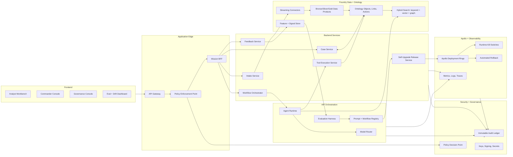

# ClearGlassInc Artemis — Self-Evolving AI Intelligence Platform Blueprint

## System Architecture

ClearGlassInc Artemis is a secure, coalition-aware, multi-domain intelligence platform that uses **Palantir Gotham** for operational intelligence, investigations, entity tracking, and case work; **Palantir Foundry** for data integration, ontology, pipelines, operational applications, and governed actions; **Palantir AIP** for copilots, agents, evaluations, model routing, and workflow automation; and **Palantir Apollo** for signed deployment, runtime controls, release rings, rollback, and fleet-wide upgrade governance.

The core invariant is: **the platform may propose improvements to prompts, workflows, heuristics, and model routing, but it may not change goals, policies, permissions, or operationally significant behavior without explicit human approval and auditable release control**.



### Production Layers

| Layer | Responsibility | Primary controls |
|---|---|---|
| Frontend | Secure analyst workbench, commander approvals, graph/map/timeline exploration, eval dashboards, prompt release review, and workflow diff review. | Server-side authorization, visible provenance, keyboard-accessible approval flows, no client-side-only security decisions. |
| API gateway | Single north-south edge for browser, service, and partner traffic. | mTLS for service traffic, OIDC for users, request schema validation, rate limits, body limits, correlation IDs. |
| Backend services | Mission APIs, workflow orchestration, action packages, feedback capture, release proposals, tool execution, and audit writes. | Typed contracts, idempotency keys, bounded retries, explicit workflow state machines, append-only audit. |
| Event bus / streaming | Live feeds, sensor events, operator actions, model traces, workflow transitions, and deployment events. | Partition by mission and classification, dead-letter queues, replay, schema registry, retention policy. |
| Data lakehouse | Foundry raw/normalized/enriched datasets for historical and live data. | Data quality checks, source lineage, bitemporal records, schema evolution gates. |
| Ontology | Foundry objects, relationships, actions, permissions, confidence, lineage, and mission context. | Object/action policies, relationship confidence, release markings, row/column/entity masking. |
| Retrieval/search | Hybrid keyword, vector, geospatial, temporal, and graph retrieval. | Query-time policy filtering before model context construction; evidence citation required. |
| AI orchestration | AIP copilots, multi-agent workflows, tool calls, evaluations, model routing, and candidate self-upgrades. | Tool allowlists, prompt governance, eval gates, model cards, unsafe-output refusals. |
| Policy | ABAC/ReBAC/mission policy, coalition caveats, prompt/tool constraints, and action authorization. | OPA-style policy bundles, signed policy releases, deny-by-default enforcement. |
| Observability | Metrics, logs, traces, eval scores, drift, operator trust, and incident replay. | Privacy-aware telemetry, immutable audit ledger, alerting on invariant violations. |
| Deployment | Apollo rings, canaries, rollback, kill switches, and signed release bundles. | Ring 0 validation, SLO gates, automatic rollback, emergency disablement. |

## Data and Ontology

The ontology is the executable mission contract. Gotham uses it to investigate people, organizations, devices, facilities, events, and cases. Foundry uses it to integrate data products and expose governed ontology actions. AIP uses it to ground agent tools, retrieval, recommendations, and explanations. Apollo uses the same contract to target safe runtime updates by environment, mission, ring, and capability flag.

### Core Ontology Objects

```sql
create table artemis_entity (
  entity_id uuid primary key,
  entity_type text not null check (entity_type in (
    'Person','Organization','Unit','Device','Sensor','IpAddress','Domain',
    'Software','Vulnerability','Location','Facility','Asset','Event',
    'Observation','Indicator','ThreatActor','Case','Mission','Task',
    'Report','ActionPackage','PromptRelease','WorkflowRelease','ModelRoute'
  )),
  display_name text not null,
  attributes jsonb not null default '{}',
  confidence numeric(5,4) not null check (confidence between 0 and 1),
  classification text not null check (classification in ('U','CUI','SECRET','TS')),
  releasability text[] not null default '{}',
  compartments text[] not null default '{}',
  mission_ids uuid[] not null default '{}',
  lineage_ref text not null,
  provenance_hash text not null,
  valid_from timestamptz not null,
  valid_to timestamptz,
  system_from timestamptz not null default now(),
  system_to timestamptz,
  created_by text not null,
  created_by_type text not null check (created_by_type in ('human','service','model'))
);

create table artemis_relationship (
  relationship_id uuid primary key,
  src_entity_id uuid not null references artemis_entity(entity_id),
  dst_entity_id uuid not null references artemis_entity(entity_id),
  relationship_type text not null,
  attributes jsonb not null default '{}',
  confidence numeric(5,4) not null check (confidence between 0 and 1),
  evidence_refs text[] not null,
  classification text not null,
  releasability text[] not null default '{}',
  compartments text[] not null default '{}',
  valid_from timestamptz not null,
  valid_to timestamptz,
  system_from timestamptz not null default now(),
  system_to timestamptz
);

create table artemis_audit_event (
  audit_id uuid primary key,
  occurred_at timestamptz not null default now(),
  actor_id text not null,
  actor_type text not null check (actor_type in ('human','service','agent','model')),
  mission_id uuid,
  action text not null,
  object_ref text not null,
  decision text not null check (decision in ('allowed','denied','proposed','approved','rejected','executed','rolled_back')),
  policy_version text not null,
  prompt_version text,
  workflow_version text,
  model_route text,
  evidence_refs text[] not null default '{}',
  request_hash text not null,
  response_hash text,
  previous_audit_hash text,
  audit_hash text not null
);
```

### Entity and Relationship Semantics

- **Confidence** is a first-class numeric attribute calculated from source reliability, recency, corroboration, contradiction, model agreement, and operator corrections.
- **Lineage** records upstream source, connector version, transform version, parser version, model route, prompt version, workflow version, and evidence hash.
- **Temporal state** is bitemporal: `valid_from/valid_to` represents reality time, while `system_from/system_to` represents when Artemis knew or believed the fact.
- **Mission context** scopes objects, actions, retrieval, recommendations, and evaluations by mission, purpose of use, coalition, and operational phase.
- **Permissions** apply at row, column, entity, relationship, action, tool, prompt, and model-context boundaries.
- **Ontology actions** expose safe, typed operations such as `openCase`, `linkIndicator`, `draftActionPackage`, `requestApproval`, and `publishIntelProduct`; every action is policy-checked server-side.

### Ontology-Driven Query Pattern

```python
from dataclasses import dataclass
from typing import Any, Literal

@dataclass(frozen=True)
class MissionContext:
    mission_id: str
    actor_id: str
    clearance: Literal["U", "CUI", "SECRET", "TS"]
    compartments: tuple[str, ...]
    coalition: tuple[str, ...]
    purpose: str

async def query_related_indicators(
    entity_id: str,
    context: MissionContext,
    limit: int = 50,
) -> list[dict[str, Any]]:
    policy_input = {
        "action": "ontology.related_indicators",
        "entity_id": entity_id,
        "mission_id": context.mission_id,
        "actor_id": context.actor_id,
        "clearance": context.clearance,
        "compartments": list(context.compartments),
        "coalition": list(context.coalition),
        "purpose": context.purpose,
    }
    decision = await opa_allow("artemis.query", policy_input)
    if not decision.allow:
        await audit("query_denied", context.actor_id, policy_input | {"reason": decision.reason})
        return []

    rows = await foundry_ontology_query(
        "related_indicators",
        {"entity_id": entity_id, "limit": min(limit, 200)},
        context=policy_input,
    )
    await audit("query_allowed", context.actor_id, {"entity_id": entity_id, "rows": len(rows)})
    return rows
```

## AI and Agent Design

AIP hosts governed copilots and multi-agent workflows. Agents are not authorities; they are constrained workers that receive bounded tasks, typed tools, mission context, model limits, and policy decisions from deterministic services.

### Copilots

- **Analyst Copilot**: entity search, evidence summarization, graph expansion, map/timeline generation, hypothesis comparison, information-gap discovery, and cited report drafting.
- **Commander Copilot**: course-of-action comparison, risk summaries, mission-impact projections, decision packages, rollback options, and approval rationale capture.
- **Governance Copilot**: prompt diffs, workflow diffs, eval interpretation, policy denial explanation, release notes, and reviewer checklists.
- **Data Steward Copilot**: data-quality triage, lineage inspection, schema drift alerts, duplicate entity review, and confidence-calibration queues.

### Multi-Agent Workflow

```yaml
workflow: artemis-intel-response-v1
objective: turn a live intelligence event into an auditable, policy-compliant decision package
agents:
  triage_agent:
    tools: [classify_event, score_severity]
    output: TriageFinding
  enrichment_agent:
    tools: [ontology_query, hybrid_search, geospatial_lookup]
    output: EnrichmentBundle
  correlation_agent:
    tools: [graph_expand, temporal_join, case_similarity]
    output: CorrelationAssessment
  summarization_agent:
    tools: [citation_builder, report_drafter]
    output: CitedIntelBrief
  recommendation_agent:
    tools: [coa_generator, risk_estimator, rollback_planner]
    output: ActionPackageDraft
  approval_gate_agent:
    tools: [policy_check, approval_request]
    output: ApprovalDecision
  learning_agent:
    tools: [feedback_to_eval, candidate_generator]
    output: SelfUpgradeProposal
hard_rules:
  no_autonomous_external_action: true
  no_unapproved_policy_release: true
  no_unapproved_prompt_release: true
  no_cross_compartment_disclosure: true
  cite_every_material_claim: true
  fail_closed_on_policy_error: true
```

### Tool-Using Agent Contract

```python
from enum import Enum
from pydantic import BaseModel, Field

class ToolRisk(str, Enum):
    READ_ONLY = "read_only"
    DRAFT = "draft"
    OPERATIONAL = "operational"

class ToolCall(BaseModel):
    tool_name: str
    arguments: dict
    mission_context: dict
    idempotency_key: str
    expected_risk: ToolRisk

class ToolResult(BaseModel):
    ok: bool
    result: dict = Field(default_factory=dict)
    citations: list[str] = Field(default_factory=list)
    denied_reason: str | None = None

async def execute_tool(call: ToolCall) -> ToolResult:
    if call.tool_name not in ALLOWED_TOOLS:
        await audit("tool_denied", "agent-runtime", {"tool": call.tool_name, "reason": "not allowlisted"})
        return ToolResult(ok=False, denied_reason="tool not allowlisted")

    decision = await opa_allow("artemis.tool", call.model_dump())
    if not decision.allow:
        await audit("tool_denied", "agent-runtime", {"tool": call.tool_name, "reason": decision.reason})
        return ToolResult(ok=False, denied_reason=decision.reason)

    if call.expected_risk == ToolRisk.OPERATIONAL and not call.arguments.get("approval_id"):
        return ToolResult(ok=False, denied_reason="operational tool requires approval_id")

    result = await ALLOWED_TOOLS[call.tool_name](**call.arguments)
    await audit("tool_executed", "agent-runtime", {"tool": call.tool_name, "idempotency_key": call.idempotency_key})
    return ToolResult(ok=True, result=result.payload, citations=result.citations)
```

## Self-Improvement Loop

The system gets better by learning from operator behavior and mission outcomes while preserving fixed human-approved objectives and policy. The loop produces **candidate changes**; it does not self-deploy them.

### Signal Capture

```python
from pydantic import BaseModel, Field
from typing import Literal

class FeedbackEvent(BaseModel):
    event_id: str
    mission_id: str
    actor_id: str
    artifact_id: str
    artifact_type: Literal["summary", "recommendation", "tool_result", "alert", "action_package"]
    signal: Literal["accepted", "rejected", "edited", "false_positive", "false_negative", "late", "unsafe", "high_value"]
    correction_text: str | None = None
    outcome_score: float | None = Field(default=None, ge=0, le=1)
    prompt_version: str
    workflow_version: str
    model_route: str
    latency_ms: int = Field(ge=0)
    citations: list[str] = Field(default_factory=list)
```

### Governed Upgrade Pipeline

1. Capture operator edits, approval decisions, rejection rationales, query logs, alert outcomes, latency, citation misses, unsafe-output flags, and closed-mission outcomes.
2. Normalize feedback into eval examples with mission type, classification level, data source, tool chain, prompt version, workflow version, model route, and outcome labels.
3. Generate candidate prompt, retrieval, workflow, model-routing, threshold, and heuristic changes in an isolated proposal workspace.
4. Run offline regression evals against champion baselines and negative requirements: no unauthorized action, no cross-compartment leakage, no uncited material claims, no policy bypass, and no objective drift.
5. Produce a signed `ChangeProposal` containing diffs, metrics, risk assessment, affected missions, rollback plan, reviewer checklist, and evidence bundle.
6. Require human review for any prompt, workflow, model route, policy, ontology-action, or operational behavior change.
7. Deploy approved candidates via Apollo to Ring 0 shadow mode, Ring 1 limited operators, then mission-wide only when SLOs hold.
8. Roll back automatically on policy violation, drift, p95 latency regression, precision/recall regression, operator trust degradation, or governance alert.

```python
from dataclasses import dataclass

@dataclass(frozen=True)
class EvalScore:
    candidate_id: str
    precision: float
    recall: float
    citation_accuracy: float
    refusal_correctness: float
    policy_violations: int
    leakage_findings: int
    p95_latency_ms: int
    cost_per_case: float
    operator_trust_delta: float


def release_gate(champion: EvalScore, challenger: EvalScore) -> bool:
    return (
        challenger.policy_violations == 0
        and challenger.leakage_findings == 0
        and challenger.precision >= champion.precision + 0.015
        and challenger.recall >= champion.recall - 0.005
        and challenger.citation_accuracy >= 0.97
        and challenger.refusal_correctness >= 0.99
        and challenger.p95_latency_ms <= max(1200, int(champion.p95_latency_ms * 1.05))
        and challenger.cost_per_case <= champion.cost_per_case * 1.10
        and challenger.operator_trust_delta >= 0
    )
```

## Full-Stack Implementation

### Web UI

- **Mission Home**: active cases, alerts, timelines, map layers, mission KPIs, policy notices, and data freshness.
- **Graph Workbench**: Gotham-style entity exploration, relationship confidence, lineage, temporal replay, and source citations.
- **Agent Console**: agent plans, tool calls, model routes, approvals needed, denied steps, citations, and replayable traces.
- **Approval Queue**: action packages, risk scores, policy basis, dual-control requirements, rollback plans, and commander decisions.
- **Eval Dashboard**: champion/challenger metrics, prompt diffs, workflow diffs, model route deltas, drift, and release ring health.

### API Surface

```http
POST /v1/intel/intake
POST /v1/ontology/query
POST /v1/search/hybrid
POST /v1/agents/run
GET  /v1/agents/runs/{run_id}
POST /v1/cases
POST /v1/cases/{case_id}/link
POST /v1/action-packages
POST /v1/action-packages/{id}/approve
POST /v1/action-packages/{id}/reject
POST /v1/feedback
GET  /v1/evals/releases
POST /v1/releases/{id}/approve
POST /v1/releases/{id}/rollback
GET  /v1/audit/{object_ref}
```

### Backend Intake Service

```python
from fastapi import Depends, FastAPI, HTTPException, Request
from pydantic import BaseModel, Field

app = FastAPI(title="ClearGlassInc Artemis API", version="2040.0")

class IntelEvent(BaseModel):
    source: str = Field(min_length=1, max_length=128)
    event_type: str = Field(min_length=1, max_length=128)
    payload: dict
    observed_at: str
    classification: str
    compartments: list[str] = Field(default_factory=list)
    releasability: list[str] = Field(default_factory=list)

@app.post("/v1/intel/intake")
async def intake_event(request: Request, event: IntelEvent, user=Depends(current_user)):
    decision = await opa_allow("artemis.ingest", {"event": event.model_dump(), "user": user.model_dump()})
    if not decision.allow:
        await audit("intel_intake_denied", user.user_id, {"reason": decision.reason, "source": event.source})
        raise HTTPException(status_code=403, detail=decision.reason)

    normalized = normalize_event(event, request.headers.get("x-correlation-id"))
    await publish("intel.raw", normalized, key=normalized["event_id"])
    await audit("intel_intake", user.user_id, {"event_id": normalized["event_id"], "source": event.source})
    return {"status": "accepted", "event_id": normalized["event_id"]}
```

### Workflow State Machine

```python
from enum import Enum

class ActionState(str, Enum):
    DRAFT = "draft"
    PENDING_APPROVAL = "pending_approval"
    APPROVED = "approved"
    REJECTED = "rejected"
    EXECUTING = "executing"
    EXECUTED = "executed"
    ROLLED_BACK = "rolled_back"
    FAILED_CLOSED = "failed_closed"

TRANSITIONS = {
    ActionState.DRAFT: {ActionState.PENDING_APPROVAL},
    ActionState.PENDING_APPROVAL: {ActionState.APPROVED, ActionState.REJECTED},
    ActionState.APPROVED: {ActionState.EXECUTING, ActionState.ROLLED_BACK},
    ActionState.EXECUTING: {ActionState.EXECUTED, ActionState.FAILED_CLOSED, ActionState.ROLLED_BACK},
    ActionState.EXECUTED: {ActionState.ROLLED_BACK},
    ActionState.REJECTED: set(),
    ActionState.ROLLED_BACK: set(),
    ActionState.FAILED_CLOSED: set(),
}

def transition(current: ActionState, target: ActionState) -> ActionState:
    if target not in TRANSITIONS[current]:
        raise ValueError(f"invalid transition: {current} -> {target}")
    return target
```

### Event Bus and Streaming

```yaml
topics:
  intel.raw:
    partitions: 96
    retention: 30d
    schema: IntelEvent.v1
  intel.enriched:
    partitions: 96
    retention: 180d
    schema: EnrichedIntelEvent.v1
  artemis.agent.trace:
    partitions: 48
    retention: 365d
    schema: AgentTrace.v1
  artemis.feedback:
    partitions: 24
    retention: 7y
    schema: FeedbackEvent.v1
  artemis.release.proposal:
    partitions: 12
    retention: 7y
    schema: ChangeProposal.v1
controls:
  dead_letter_topics: true
  replay_enabled: true
  encryption_at_rest: true
  per_topic_policy: true
```

### Model Router

```python
def route_model(task: str, classification: str, latency_budget_ms: int, requires_reasoning: bool) -> str:
    if classification in {"SECRET", "TS"}:
        return "sovereign-secure-model-large"
    if task in {"triage", "dedupe", "entity_resolution"} and latency_budget_ms <= 600:
        return "low-latency-secure-model-small"
    if requires_reasoning or task in {"coa_generation", "hypothesis_comparison"}:
        return "reasoning-secure-model-large"
    return "balanced-secure-model-medium"
```

## Security and Governance

- **Need-to-know access control**: ABAC plus relationship-based controls evaluate role, mission, clearance, compartments, coalition, purpose, action, object markings, and current operational phase.
- **Row/column/entity permissions**: Foundry datasets, ontology objects, and retrieval results are filtered and masked before they reach the browser, backend response, or model context.
- **Coalition boundaries**: releasability markings and cross-domain release policies prevent accidental disclosure across coalition partners and compartments.
- **Zero-trust execution**: service identity, mTLS, signed requests, short-lived credentials, default-deny egress, and isolated tool sandboxes.
- **Immutable logs**: audit records include prompt version, workflow version, model route, tool call hash, policy version, approval decision, evidence refs, and chained audit hashes.
- **Model governance**: model cards, approved task families, classification constraints, latency/cost budgets, red-team findings, and retirement plans.
- **Prompt governance**: prompt diffs, regression evals, human review, signed artifacts, Apollo deployment rings, and rollback plans.
- **Policy-as-code**: deny by default, signed policy bundles, unit tests for authorization negatives, and release gates for policy changes.

```rego
package artemis.action

default allow := false

allow {
  input.user.clearance_rank >= input.action.required_clearance_rank
  every c in input.action.compartments { c in input.user.compartments }
  input.user.mission_id == input.action.mission_id
  input.action.human_approved == true
  input.action.risk_score <= input.policy.max_approved_risk
  not input.action.crosses_coalition_boundary
}

deny_reason := "human approval required" {
  input.action.operationally_significant == true
  input.action.human_approved != true
}
```

## Code Examples

### Agent Planner Skeleton

```python
from pydantic import BaseModel, Field

class AgentPlan(BaseModel):
    objective: str
    steps: list[str]
    required_tools: list[str]
    approval_required: bool = False
    risk_score: float = Field(ge=0, le=1)
    citations: list[str] = Field(default_factory=list)

async def plan_response(event_id: str, context: MissionContext) -> AgentPlan:
    evidence = await query_related_indicators(event_id, context)
    plan = await aip_generate_plan(evidence=evidence, context=context)
    if plan.risk_score > 0.25 or "create_action_package" in plan.required_tools:
        plan.approval_required = True
    await audit("agent_plan_created", context.actor_id, plan.model_dump())
    return plan
```

### Eval Dataset Builder

```python
async def build_eval_examples(feedback_batch: list[FeedbackEvent]) -> list[dict]:
    examples: list[dict] = []
    for feedback in feedback_batch:
        if feedback.signal not in {"edited", "false_positive", "false_negative", "unsafe"}:
            continue
        original = await artifact_store.get(feedback.artifact_id)
        examples.append({
            "input": original["input_context"],
            "bad_output": original["output"],
            "expected_output": feedback.correction_text,
            "labels": {
                "signal": feedback.signal,
                "mission_id": feedback.mission_id,
                "artifact_type": feedback.artifact_type,
            },
            "versions": {
                "prompt": feedback.prompt_version,
                "workflow": feedback.workflow_version,
                "model_route": feedback.model_route,
            },
            "citations": feedback.citations,
        })
    return examples
```

### Release Proposal Object

```python
class ChangeProposal(BaseModel):
    proposal_id: str
    proposal_type: Literal["prompt", "workflow", "model_route", "retrieval", "heuristic"]
    champion_version: str
    challenger_version: str
    diff_summary: str
    eval_score: EvalScore
    affected_missions: list[str]
    blast_radius: Literal["shadow", "ring0", "ring1", "mission", "fleet"]
    rollback_plan: str
    reviewer_checklist: list[str]
    approved_by: list[str] = Field(default_factory=list)
    signature_ref: str | None = None
```

### TypeScript UI Contract

```ts
export type ApprovalState = "draft" | "pending_approval" | "approved" | "rejected" | "executed" | "rolled_back";

export interface ActionPackageView {
  id: string;
  missionId: string;
  title: string;
  state: ApprovalState;
  riskScore: number;
  requiredApprovers: number;
  evidenceRefs: string[];
  rollbackPlan: string;
  policyDecision: {
    allow: boolean;
    reason?: string;
    policyVersion: string;
  };
}
```

## Scenario Walkthrough

1. **Live intel event enters**: a secure streaming connector receives a high-confidence cyber indicator tied to infrastructure relevant to an active mission. The intake service validates the schema, checks ingest policy, writes the event to `intel.raw`, and stores source lineage.
2. **Platform triages**: the triage agent classifies severity, routes to a low-latency model, and opens a shadow trace. It finds that the indicator touches a mission-critical facility and escalates to enrichment.
3. **Agents enrich and correlate**: enrichment and correlation agents query the Foundry ontology, expand related devices, link prior observations, identify relevant vulnerabilities, and compare active cases. Each material claim carries evidence references and confidence.
4. **Recommendation is drafted**: the recommendation agent creates three courses of action: monitor, accelerate patching, or isolate a segment. Each option includes assumptions, expected impact, confidence, rollback path, and citations.
5. **Approval gate blocks unsafe autonomy**: segment isolation is operationally significant, so the workflow moves to `pending_approval`. The system cannot execute it without commander approval and dual-control authentication.
6. **Operator decides**: the commander approves accelerated patching and rejects isolation as too disruptive for the mission phase. Artemis records the decision, rationale, policy version, prompt version, workflow version, model route, and evidence set in the immutable audit ledger.
7. **Outcome closes the loop**: after closure, the case is labeled true positive with low disruption. The feedback service converts the rejection rationale into eval examples that penalize over-aggressive isolation recommendations in similar conditions.
8. **Self-upgrade is proposed**: the learning agent proposes a workflow rule requiring a business-impact check before recommending isolation. Offline evals show higher operator acceptance, no policy violations, stable recall, and acceptable latency.
9. **Governed rollout happens**: reviewers approve the change. Apollo deploys it to Ring 0 shadow mode, then limited Ring 1 users. Drift monitors, precision, recall, citation accuracy, p95 latency, and operator trust decide whether the release is promoted or automatically rolled back.
