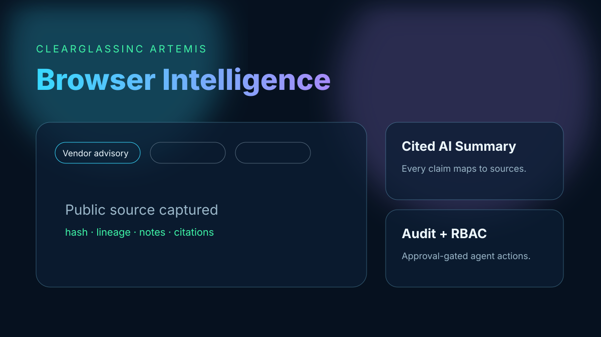
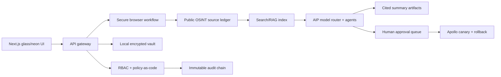

# ClearGlassInc Artemis Browser Intelligence Assistant

Open-source, local-first browser intelligence and research assistant for lawful defensive use. Artemis combines a premium Next.js glass/neon interface with Python security primitives for public OSINT ingestion, source capture, cited AI summarization, role-based access control, immutable audit logs, and human-approved agent workflow upgrades.



## Use cases

- Browser security research workbench for tabs, notes, captures, source hashes, and evidence packages.
- AI research automation that refuses uncited claims and preserves source lineage.
- Cybersecurity workflow automation for defensive triage, enrichment, correlation, summaries, and approval packets.
- Governance testbed for prompt/workflow/model-routing improvements that require eval gates and human approval before promotion.

## Architecture



### Production layers

- **Frontend:** `apps/artemis-browser/app/page.tsx` renders the SEO-ready landing page and console mockup for browser security, AI research automation, and cybersecurity workflow automation.
- **Secure workflow:** `BrowserResearchAssistant` manages public URL validation, tab opening, source hashing, note writing, and cited summaries.
- **Local-first storage:** `SecretBox` seals local secrets with password-derived authenticated ciphertext. Production builds should bind the wrapping key to an OS keychain or hardware keystore.
- **OSINT ingestion:** `PublicSourcePolicy` accepts only public `http`/`https` sources and rejects local, private, and internal network addresses.
- **AI agents:** Triage, citation, and workflow-upgrade agents are approval-gated, citation-bound, and constrained to public-source defensive research.
- **Governance:** Platform primitives in `artemis/intelligence/platform.py` provide policy checks, approval gates, immutable audit records, state-machine transitions, eval gates, model routing, and Apollo-style promotion control.

## Threat model

| Threat | Control |
| --- | --- |
| Prompt injection from web pages | Treat captured pages as untrusted data; send only bounded, redacted excerpts and source IDs to models. |
| Private-network SSRF or credentialed collection | Fail-closed `PublicSourcePolicy` rejects non-public schemes, loopback, private ranges, and internal hostnames. |
| Hallucinated AI claims | `summarize()` rejects every claim without at least one known source citation. |
| Unauthorized capture or review | RBAC permissions are audited before tab, source, note, summary, and audit actions. |
| Secret exfiltration | Secrets stay local, sealed, and out of prompts, logs, fixtures, and browser bundles. |
| Unsafe self-improvement | Prompt/workflow/model changes require offline eval pass, human approval, canary, rollback version, and audit trail. |

## Setup

```bash
# Frontend
cd apps/artemis-browser
npm install
npm run typecheck
npm run build
npm run dev

# Python controls and tests
cd ../..
python -m pytest artemis/tests/test_browser_assistant.py artemis/tests/test_intelligence_platform.py -q
```

## CI

The repository CI already runs Python tests and ruff. For this app, add a package-specific workflow gate when enabling hosted deployment:

```yaml
- working-directory: apps/artemis-browser
  run: npm install && npm run typecheck && npm run build
- run: python -m pytest artemis/tests/test_browser_assistant.py -q
```

## Roadmap

1. Browser extension connector with explicit user consent and per-tab capture scopes.
2. SQLite/SQLCipher local vault adapter with OS keychain wrapping.
3. Foundry ontology adapter for source, claim, entity, mission, and permission objects.
4. AIP tool-calling service with deterministic citation validator in front of model output.
5. Apollo deployment pipeline for prompt/workflow/model-router versions with canary metrics and rollback.
6. Playwright accessibility, keyboard, contrast, and browser-console regression checks.
7. Signed transparency log export for material audit records.

## Lawful defensive use

Artemis is designed for public-source, defensive security research. It must not be used for credential theft, malware, unauthorized access, evasion, persistence, destructive actions, covert surveillance, or collection from systems the operator is not authorized to assess.
