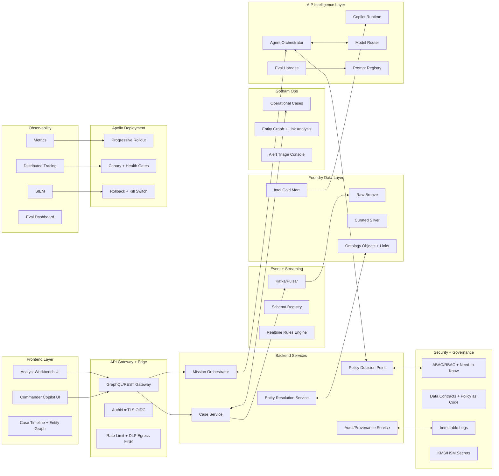

# ClearGlassInc Artemis — Self-Evolving AI Intelligence Platform Blueprint

## Role Perspective (Cybersecurity & Data Privacy Lawyer + Technical Architecture Liaison)

As Cybersecurity & Data Privacy counsel embedded with platform engineering, this blueprint is designed to maximize operational intelligence while constraining legal/regulatory exposure in the **US (NYC context)** and **Canada (Ontario context)**. The design assumes adversarial scrutiny from regulators, litigants, and counterparties.

Core legal anchors integrated into technical controls:
- **PIPEDA** (Canada) accountability, consent, limiting collection/use/disclosure, safeguards, openness, individual access/challenge.
- **Quebec Law 25 interoperability warning** (if Quebec data ever appears in coalition operations).
- **NY SHIELD Act** reasonable safeguards for private information.
- **CCPA/CPRA design compatibility** (if California residents’ data appears in datasets).
- **State breach notification overlays** and Canadian provincial breach expectations.
- Cross-border transfer documentation and purpose limitation as first-class architecture concepts.

---

## System Architecture

### 1) End-to-End Layered Architecture



### 2) Palantir Role Mapping
- **Gotham**: operational investigation workflows, case management, graph-first investigations, analyst/commander operations.
- **Foundry**: ingestion, normalization, ontology, transforms, quality gates, application data contracts.
- **AIP**: copilots, agents, tool calling, evals, model routing, prompt/workflow lifecycle.
- **Apollo**: secure software promotion, environment-aware deployment policy, rollback orchestration, fleet management.

### 3) Runtime Planes
1. **Data Plane**: sources → ingestion → ontology-backed objects.
2. **Decision Plane**: agent reasoning + policy checks + approval gates.
3. **Control Plane**: versioning, deployment policy, rollback, guardrails.
4. **Assurance Plane**: evals, drift, provenance, legal audit package generation.

---

## Data and Ontology

### 1) Canonical Entity Model

Core entities:
- `Person`, `Organization`, `Device`, `Account`, `Credential`, `Location`, `Asset`, `Event`, `Indicator`, `Case`, `Mission`, `ActionPackage`, `SourceDocument`, `ModelRun`, `PromptVersion`, `WorkflowVersion`.

Core relationships:
- `ASSOCIATED_WITH`, `OWNS`, `USES`, `LOCATED_AT`, `OBSERVED_IN`, `DERIVED_FROM`, `TRIGGERED`, `ESCALATED_TO`, `APPROVED_BY`, `REJECTED_BY`, `AFFECTS`, `PART_OF_MISSION`.

### 2) Metadata Required on Every Object/Edge
- `confidence_score` (0–1), `confidence_rationale`
- `lineage` (source system, transform id, extraction method)
- `temporal_valid_from`, `temporal_valid_to`, `observed_at`
- `classification` (e.g., internal/secret/coalition-
  releasable)
- `compartment_tags` (mission/country/program)
- `jurisdiction_tags` (US, CA-ON, multi)
- `legal_basis` (consent, contractual necessity, legitimate interest equivalent mapping)

### 3) Ontology Drives Workflows + AI Behavior
- Agent tool eligibility is computed from ontology permissions + mission context.
- Retrieval context windows are filtered by row/column/entity policy before prompt assembly.
- Confidence-aware tasking: if aggregate confidence < threshold, agent must request enrichment before recommendation.

### 4) Example SQL for Temporal + Permissioned Access

```sql
-- mission_scoped_events.sql
SELECT e.event_id,
       e.event_type,
       e.observed_at,
       e.confidence_score,
       l.location_name,
       c.case_id
FROM intel_gold.events e
JOIN intel_gold.case_event_map c ON c.event_id = e.event_id
LEFT JOIN intel_gold.locations l ON l.location_id = e.location_id
WHERE e.observed_at BETWEEN :t_start AND :t_end
  AND e.compartment && :allowed_compartments
  AND e.classification <= :max_classification
  AND e.jurisdiction IN (:jurisdiction_scope);
```

---

## AI and Agent Design

### 1) Copilot Types
- **Analyst Copilot**: evidence synthesis, anomaly explanation, next-best investigative step.
- **Commander Copilot**: mission impact forecast, resource/conflict prioritization, action-package drafting.

### 2) Multi-Agent Workflow Topology
1. **Triage Agent** — score incoming signal severity and confidence.
2. **Enrichment Agent** — pull related entities/events/documents.
3. **Correlation Agent** — cross-case and cross-domain link discovery.
4. **Summarization Agent** — produce explainable intelligence product.
5. **Recommendation Agent** — generate candidate actions + risk score.
6. **Compliance Gate Agent** — validates policy/legal constraints pre-action.

### 3) Tooling Contract
Every agent tool call includes:
- `mission_id`
- `operator_clearance`
- `purpose_of_use`
- `jurisdiction_scope`
- `write_intent` boolean

Any `write_intent=true` action requires human approval for operationally significant outcomes.

### 4) Operational Approval Gates
- Gate A: Data access scope check.
- Gate B: Action legality/policy check.
- Gate C: Human sign-off (2-person integrity for critical actions).
- Gate D: Post-action evidence + immutable audit commit.

---

## Self-Improvement Loop

### 1) Feedback Inputs
- Explicit thumbs up/down + correction text.
- Analyst edits to case summaries.
- Alert true-positive/false-positive outcomes.
- Mission-level KPI outcomes (latency, precision, mission success).
- Override events where operator rejected agent recommendation.

### 2) Learning Pipeline

```mermaid
flowchart LR
    A[Telemetry + Feedback] --> B[Feature Builder]
    B --> C[Eval Dataset Builder]
    C --> D[Candidate Generator
Prompt/Workflow/Route]
    D --> E[Offline Evals]
    E --> F[Shadow Deployment]
    F --> G[Canary A/B]
    G --> H[Human Review Board]
    H --> I[Promote via Apollo]
    I --> J[Continuous Monitoring]
    J --> K[Auto-Rollback if regressions]
```



### 3) Guardrailed Self-Evolution Rules
- System may propose changes; cannot self-promote to production.
- Mandatory human approval for prompt/workflow/router promotions.
- Regressions in precision, safety policy violations, or latency SLO breach trigger rollback.
- No autonomous objective rewriting; mission objectives are immutable inputs from humans.

### 4) Versioning + Rollback
- Semantic versions for `prompt`, `workflow`, `policy`, `model_route`.
- Each deployment records:
  - `change_request_id`
  - `approver_ids`
  - `baseline_eval_hash`
  - `canary_metrics`
- One-click Apollo rollback bound to previous healthy release tag.

### 5) Drift Detection
- Data drift: PSI/KS on key features.
- Concept drift: performance drop per task category.
- Behavior drift: increased operator overrides.
- Trigger thresholds create a review task in governance queue.

---

## Full-Stack Implementation

### 1) Web UI (TypeScript/React)
- Mission dashboard, real-time alerts, evidence graph, recommendation panel.
- Side-by-side diff when prompt/workflow variant changes recommendation.
- Human approval modal requiring rationale + digital signature.

### 2) API Gateway
- GraphQL for rich UI query patterns.
- REST for operational actions.
- mTLS + OIDC/JWT + request-level policy enforcement.

### 3) Backend Microservices (Python/FastAPI)
- `case-service`
- `entity-service`
- `agent-orchestrator-service`
- `policy-service`
- `eval-service`
- `audit-service`

### 4) Streaming
- Kafka topics:
  - `intel.events.raw`
  - `intel.events.normalized`
  - `intel.alerts.triaged`
  - `intel.actions.requested`
  - `intel.feedback.captured`

### 5) Lakehouse + Search
- Foundry-backed lakehouse tiers + ontology projection.
- Hybrid retrieval: keyword + vector + graph neighborhood expansion.

### 6) Model Router
- Task-aware routing by sensitivity, latency SLO, and cost ceiling.
- Requires model governance policy check before invocation.

---

## Security and Governance

### 1) Need-to-Know / Compartmentalized Access
- ABAC over mission, clearance, coalition, jurisdiction, purpose.
- Entity-level deny precedence.
- Dynamic redaction at query time.

### 2) Zero-Trust Execution
- Mutual TLS service-to-service.
- Per-service SPIFFE-like identity.
- Ephemeral credentials from centralized secrets manager.

### 3) Immutable Provenance
- Append-only audit ledger for:
  - data reads/writes
  - prompt versions used
  - model/version invoked
  - tool calls and outputs
  - human approvals/rejections

### 4) Policy-as-Code Example (OPA/Rego)

```rego
package artemis.authz

default allow = false

allow {
  input.subject.clearance >= input.resource.classification
  input.subject.mission_ids[_] == input.resource.mission_id
  input.subject.jurisdiction[_] == input.resource.jurisdiction
  not denied_by_compartment
}

denied_by_compartment {
  some tag
  input.resource.compartment_tags[tag]
  not input.subject.compartment_tags[tag]
}
```

### 5) Legal/Regulatory Risk Flags
- Cross-border transfer without documented purpose and safeguards.
- Model output used as sole basis for operational decisions.
- Over-collection violating data minimization principles.
- Inadequate breach playbook for mixed US/Canada affected populations.

---

## Code Examples

### 1) Python FastAPI Agent Orchestrator (Precision-first)

```python
from fastapi import FastAPI, HTTPException, Depends
from pydantic import BaseModel, Field
from typing import Literal, List
import uuid

app = FastAPI(title="ClearGlassInc Artemis Orchestrator")

class MissionContext(BaseModel):
    mission_id: str
    jurisdiction_scope: List[Literal["US", "CA-ON", "MULTI"]]
    operator_id: str
    clearance_level: int
    purpose_of_use: str

class AgentRequest(BaseModel):
    task_type: Literal["triage", "enrich", "correlate", "summarize", "recommend"]
    payload_ref: str
    mission: MissionContext

class AgentResponse(BaseModel):
    run_id: str
    recommendation: str
    confidence: float = Field(ge=0, le=1)
    requires_human_approval: bool


def policy_check(req: AgentRequest) -> None:
    if req.mission.purpose_of_use.strip() == "":
        raise HTTPException(status_code=403, detail="Purpose of use required")
    if "MULTI" in req.mission.jurisdiction_scope and req.task_type == "recommend":
        # stricter gate for cross-border recommendations
        pass


def model_router(task_type: str) -> str:
    return {
        "triage": "low-latency-model-v3",
        "enrich": "retrieval-augmented-model-v5",
        "correlate": "graph-reasoner-v2",
        "summarize": "long-context-model-v4",
        "recommend": "policy-conditioned-model-v6",
    }[task_type]


@app.post("/agent/run", response_model=AgentResponse)
def run_agent(req: AgentRequest):
    policy_check(req)
    run_id = str(uuid.uuid4())
    chosen_model = model_router(req.task_type)

    # placeholder tool-use call chain
    recommendation = f"[{chosen_model}] Action package draft for {req.payload_ref}"

    return AgentResponse(
        run_id=run_id,
        recommendation=recommendation,
        confidence=0.81,
        requires_human_approval=req.task_type == "recommend",
    )
```

### 2) Event Handler for Feedback Capture

```python
from dataclasses import dataclass
from datetime import datetime

@dataclass
class FeedbackEvent:
    run_id: str
    operator_id: str
    verdict: str  # approve/reject/correct
    correction_text: str
    timestamp: datetime


def handle_feedback(evt: FeedbackEvent, db, bus):
    db.insert("feedback_events", {
        "run_id": evt.run_id,
        "operator_id": evt.operator_id,
        "verdict": evt.verdict,
        "correction_text": evt.correction_text,
        "timestamp": evt.timestamp.isoformat(),
    })

    bus.publish("intel.feedback.captured", {
        "run_id": evt.run_id,
        "verdict": evt.verdict,
        "has_correction": bool(evt.correction_text),
    })
```

### 3) Workflow State Machine (Operational Gates)

```python
from enum import Enum

class State(str, Enum):
    INGESTED = "INGESTED"
    TRIAGED = "TRIAGED"
    ENRICHED = "ENRICHED"
    CORRELATED = "CORRELATED"
    RECOMMENDED = "RECOMMENDED"
    HUMAN_APPROVED = "HUMAN_APPROVED"
    EXECUTED = "EXECUTED"
    CLOSED = "CLOSED"

ALLOWED = {
    State.INGESTED: [State.TRIAGED],
    State.TRIAGED: [State.ENRICHED],
    State.ENRICHED: [State.CORRELATED],
    State.CORRELATED: [State.RECOMMENDED],
    State.RECOMMENDED: [State.HUMAN_APPROVED],
    State.HUMAN_APPROVED: [State.EXECUTED],
    State.EXECUTED: [State.CLOSED],
}


def transition(current: State, nxt: State):
    if nxt not in ALLOWED.get(current, []):
        raise ValueError(f"Invalid transition {current} -> {nxt}")
    return nxt
```

### 4) Eval Pipeline Skeleton

```python
def run_eval_suite(candidate_version: str, baseline_version: str, dataset):
    cand = evaluate(candidate_version, dataset)
    base = evaluate(baseline_version, dataset)

    gates = {
        "precision_delta": cand["precision"] - base["precision"],
        "recall_delta": cand["recall"] - base["recall"],
        "latency_delta_ms": cand["p95_latency_ms"] - base["p95_latency_ms"],
        "policy_violations": cand["policy_violations"],
        "operator_trust_delta": cand["trust_score"] - base["trust_score"],
    }

    if gates["policy_violations"] > 0:
        return {"promote": False, "reason": "policy violations", "gates": gates}

    if gates["precision_delta"] < -0.01 or gates["latency_delta_ms"] > 120:
        return {"promote": False, "reason": "quality/latency regression", "gates": gates}

    return {"promote": True, "reason": "passes thresholds", "gates": gates}
```

---

## Scenario Walkthrough (Cinematic + Credible)

1. **Live event arrives**: A suspicious credential stuffing burst appears from mixed infrastructure targeting a coalition-facing portal.
2. **Triage**: Triage Agent assigns severity High, confidence 0.78, and opens Case `C-88421` in Gotham.
3. **Enrichment**: Enrichment Agent links IP cluster, historical indicators, related user accounts, and prior case artifacts from Foundry ontology.
4. **Correlation**: Correlation Agent detects overlap with prior adversary TTP pattern and raises confidence to 0.86.
5. **Recommendation**: Recommendation Agent drafts Action Package:
   - temporary geofenced challenge policy,
   - targeted account lock step-up,
   - forensic snapshot order.
6. **Policy Gate**: Compliance Gate flags that one proposed data pull crosses CA-ON purpose boundary; recommendation auto-rewrites to compliant alternative.
7. **Human Decision**: Commander approves 2/3 actions, rejects one due to operational sensitivity.
8. **Execution + Audit**: Approved actions execute; all tool calls, prompts, models, and approvals are immutably logged.
9. **Learning loop update**:
   - rejection reason encoded as structured feedback,
   - workflow candidate generated to reduce similar overreach,
   - candidate passes offline eval and shadow tests,
   - human review board approves,
   - Apollo promotes change via canary,
   - no regressions observed → full rollout.

Result: system improves recommendation precision and trust while preserving hard human and policy control boundaries.

---

## Recommended Actions (Enforceable)

1. Establish **AI Change Control Board** (legal, security, ops, engineering) with written approval SOP for prompt/workflow/model-route promotions.
2. Mandate **operational-significance policy**: no agent may trigger external-impact action without named human approver.
3. Implement **cross-border data transfer register** with purpose, retention, and safeguards mapping for US↔Canada flows.
4. Bind every AI output to **evidence citations + confidence + provenance** before operator display.
5. Adopt quarterly **adversarial red-team + legal tabletop** focused on model misuse, privacy leakage, and audit reconstruction.

---

## Cross-Agent Notes (War Council)

- **Corporate Governance Lawyer**: ensure board-level delegated authority charter for AI operational controls and incident authority.
- **Securities Lawyer**: if performance claims are used in fundraising, align metrics with auditable definitions to avoid misrepresentation risk.
- **Technology & IP Lawyer**: lock down prompt/workflow artifacts as trade secrets; tighten contractor IP assignment scope for generated assets.
- **Employment Lawyer**: operator monitoring data in feedback loop must be proportionate and disclosed in internal policy.
- **Litigation Lawyer**: preserve litigation hold-ready provenance architecture; ensure explainability artifacts are discoverable and tamper-evident.

Unified position: growth velocity is acceptable only if governance gates remain non-bypassable and independently auditable.
