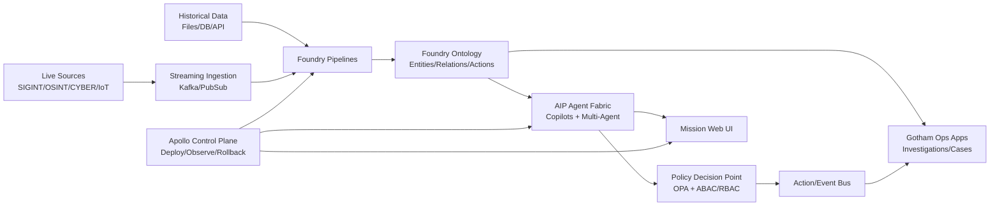
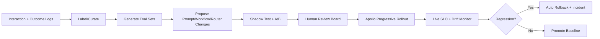

# ClearGlassInc Artemis — Self-Evolving AI Intelligence Platform Blueprint

## System Architecture

### 1) Platform topology (Palantir-aligned)

- **Gotham (Ops Intel Plane):** case management, entity tracking, link analysis, watchlists, alert operations.
- **Foundry (Data + Ontology Plane):** data integration, pipeline transforms, ontology objects/actions, semantic permissions.
- **AIP (AI Decision Plane):** copilots, agentic workflows, tool calling, eval harnesses, prompt/model orchestration.
- **Apollo (Runtime Plane):** secure deployment rings, policy-aware rollouts, rollback, environment drift control.



### 2) Full-stack layered design

1. **Frontend layer**
   - React + TypeScript mission console.
   - Real-time event timeline, graph explorer, case board, approval inbox.
   - Dual copilot UX: Analyst Copilot + Commander Copilot.

2. **API gateway layer**
   - GraphQL federation for UI composition.
   - REST/gRPC for high-throughput machine calls.
   - Request signing, JWT verification, per-tenant throttling.

3. **Backend service layer**
   - `intel-intake-service`
   - `entity-resolution-service`
   - `threat-correlation-service`
   - `case-orchestration-service`
   - `agent-orchestrator-service`
   - `eval-and-learning-service`

4. **Streaming/event layer**
   - Kafka topics: `raw.events`, `normalized.events`, `alerts`, `cases`, `operator.feedback`, `eval.results`.
   - Exactly-once semantics for critical event classes.

5. **Data/lakehouse layer**
   - Foundry datasets + transaction-safe transforms.
   - Hot store for tactical queries, cold store for historical analytics.

6. **Search/retrieval layer**
   - Hybrid retrieval (BM25 + vector + graph neighborhood).
   - Evidence pack construction with lineage and confidence.

7. **Model routing/inference layer**
   - Policy-constrained model router:
     - fast model for triage
     - high-accuracy model for reasoning
     - domain models for cyber/intel NER/linking

8. **AuthN/AuthZ/policy layer**
   - OIDC + hardware-backed MFA.
   - RBAC + ABAC + ReBAC against ontology objects.
   - Coalition compartment tags (`REL TO`, caveats, NOFORN-like labels).

9. **Observability/eval layer**
   - OpenTelemetry traces across agent/tool boundaries.
   - Live eval dashboards: precision/recall/latency/operator-overrides.

10. **Deployment layer**
   - Apollo progressive delivery rings (`dev -> staging -> mission-shadow -> live`).
   - Auto rollback on SLO or policy regressions.

---

## Data and Ontology

### 1) Canonical ontology primitives

```python
# ontology/models.py
from pydantic import BaseModel, Field
from datetime import datetime
from typing import List, Optional, Dict

class SecurityLabel(BaseModel):
    classification: str              # e.g., SECRET
    compartments: List[str]          # e.g., ['CYBER', 'CT']
    releasability: List[str]         # e.g., ['REL USA, FVEY']

class Lineage(BaseModel):
    source_system: str
    source_record_id: str
    ingest_time: datetime
    transform_version: str
    chain_hash: str

class Confidence(BaseModel):
    score: float = Field(ge=0.0, le=1.0)
    method: str                      # model/manual/rule
    rationale: str

class Entity(BaseModel):
    entity_id: str
    entity_type: str                 # Person/Org/Device/Account/IP/Malware
    attributes: Dict[str, str]
    first_seen: datetime
    last_seen: datetime
    confidence: Confidence
    labels: SecurityLabel
    lineage: Lineage

class Relationship(BaseModel):
    rel_id: str
    src_entity_id: str
    dst_entity_id: str
    rel_type: str                    # OWNS/USES/COMMUNICATES_WITH/TRANSFERRED_TO
    valid_from: datetime
    valid_to: Optional[datetime]
    confidence: Confidence
    mission_context_id: str
    labels: SecurityLabel
    lineage: Lineage
```

### 2) Ontology behavior model

- **Temporal state:** bi-temporal validity (`event_time`, `system_time`) for retrospective reconstruction.
- **Mission context:** every fact is attached to mission/operation scope for policy filtering + relevance ranking.
- **Confidence propagation:** relationship confidence decays/strengthens with corroborating evidence.
- **Lineage-first design:** every derived signal carries cryptographic provenance chain.

### 3) Permission semantics in ontology

- Entity-level allow/deny.
- Attribute-level redaction (`email`, `phone`, `biometrics`).
- Relationship traversal guards (can see node but not edge type).
- Action permissions bound to ontology verbs (`open_case`, `escalate_alert`, `publish_brief`).

---

## AI and Agent Design

### 1) Copilot architecture

- **Analyst Copilot:** evidence synthesis, timeline drafting, anomaly explanation.
- **Commander Copilot:** decision options, predicted impact, confidence/risk matrix.

```yaml
copilot_profiles:
  analyst:
    tools: [query_ontology, retrieve_evidence, draft_case_summary]
    max_autonomy: "recommendation_only"
  commander:
    tools: [mission_kpi_query, generate_coa, compare_risks]
    max_autonomy: "approval_required_for_actions"
```

### 2) Multi-agent workflow

Agents (all defensive, non-offensive):
1. `triage_agent`
2. `enrichment_agent`
3. `correlation_agent`
4. `summarization_agent`
5. `recommendation_agent`
6. `compliance_guardian_agent`

```python
# aip/workflow.py
from enum import Enum

class Step(str, Enum):
    TRIAGE = "triage"
    ENRICH = "enrich"
    CORRELATE = "correlate"
    SUMMARIZE = "summarize"
    RECOMMEND = "recommend"
    APPROVAL_GATE = "approval_gate"

WORKFLOW = [
    Step.TRIAGE,
    Step.ENRICH,
    Step.CORRELATE,
    Step.SUMMARIZE,
    Step.RECOMMEND,
    Step.APPROVAL_GATE,
]
```

### 3) Tool-using agent contract

```python
# aip/tools/contracts.py
from typing import Literal, Dict, Any

def invoke_tool(tool_name: Literal[
    "query_ontology",
    "open_case",
    "create_watchlist_entry",
    "generate_intel_brief",
    "prepare_action_package"
], payload: Dict[str, Any], user_ctx: Dict[str, Any]) -> Dict[str, Any]:
    # 1) policy check
    # 2) immutable audit log
    # 3) execute tool
    # 4) return signed result envelope
    ...
```

### 4) Approval gates

Operationally significant actions require:
- policy pass,
- confidence threshold,
- human role approval,
- dual-control for high-impact actions.

---

## Self-Improvement Loop

### 1) Feedback signals captured

- explicit thumbs up/down on copilot outputs,
- analyst corrections to entities/links,
- alert disposition outcomes (TP/FP/FN),
- mission success indicators (time-to-decision, false escalation rate),
- operator override frequency.

### 2) Learning pipeline



### 3) Safe change mechanics

- Version everything: prompt packs, workflow DAGs, routing policies, eval suites.
- Every change has:
  - expected metric deltas,
  - blast radius,
  - rollback hash.
- Drift detectors watch data distribution, model confidence calibration, and operator trust degradation.

```python
# learning/change_control.py
from dataclasses import dataclass

@dataclass
class ChangeProposal:
    change_id: str
    artifact_type: str   # prompt/workflow/router/rule
    from_version: str
    to_version: str
    hypothesis: str
    risk_level: str
    required_approvers: list[str]


def approve_and_promote(proposal: ChangeProposal, approvals: list[str]):
    assert set(proposal.required_approvers).issubset(set(approvals))
    # run eval gate
    # run shadow A/B gate
    # emit signed promotion event for Apollo
```

---

## Full-Stack Implementation

### 1) Web UI (TypeScript)

```tsx
// ui/src/components/ApprovalInbox.tsx
export function ApprovalInbox({ items, onApprove, onReject }) {
  return (
    <section>
      <h2>Operational Approval Queue</h2>
      {items.map((i) => (
        <article key={i.id}>
          <h3>{i.title}</h3>
          <p>Risk: {i.riskLevel} | Confidence: {i.confidence}</p>
          <button onClick={() => onApprove(i.id)}>Approve</button>
          <button onClick={() => onReject(i.id)}>Reject</button>
        </article>
      ))}
    </section>
  );
}
```

### 2) API gateway + backend (Python/FastAPI)

```python
# services/api_gateway/main.py
from fastapi import FastAPI, Depends
from services.policy import enforce
from services.schemas import ActionRequest

app = FastAPI(title="ClearGlassInc Artemis Gateway")

@app.post("/v1/actions/submit")
def submit_action(req: ActionRequest, user=Depends()):
    enforce(user=user, action=req.action, resource=req.resource)
    # route to workflow orchestrator
    return {"status": "queued", "request_id": req.request_id}
```

### 3) Event handler (stream processing)

```python
# services/triage/consumer.py
from confluent_kafka import Consumer

consumer = Consumer({"group.id": "triage-agent", "bootstrap.servers": "kafka:9092"})
consumer.subscribe(["normalized.events"])

while True:
    msg = consumer.poll(1.0)
    if not msg:
        continue
    event = parse_event(msg.value())
    triage = run_triage_model(event)
    publish("alerts", triage)
```

### 4) Ontology-driven query

```sql
-- sql/high_risk_entity_expansion.sql
WITH seed AS (
  SELECT entity_id
  FROM ontology_entities
  WHERE entity_id = :seed_id
),
neighbors AS (
  SELECT r.dst_entity_id AS entity_id, r.confidence_score
  FROM ontology_relationships r
  JOIN seed s ON s.entity_id = r.src_entity_id
  WHERE r.rel_type IN ('COMMUNICATES_WITH', 'TRANSFERRED_TO')
    AND r.valid_to IS NULL
)
SELECT e.entity_id, e.entity_type, n.confidence_score
FROM neighbors n
JOIN ontology_entities e ON e.entity_id = n.entity_id
ORDER BY n.confidence_score DESC
LIMIT 100;
```

### 5) Policy-as-code example (OPA/Rego)

```rego
# policy/approve_action.rego
package artemis.authz

default allow = false

allow {
  input.user.clearance >= input.resource.classification
  input.user.roles[_] == "mission_commander"
  input.action == "escalate_alert"
  not input.resource.requires_dual_control
}

allow {
  input.action == "escalate_alert"
  input.resource.requires_dual_control
  count(input.approvals) >= 2
}
```

### 6) Eval pipeline

```python
# evals/run_eval_suite.py

def run_eval_suite(candidate_version: str, baseline_version: str, dataset: list[dict]):
    metrics = {"precision": 0, "recall": 0, "latency_ms_p95": 0, "trust_score": 0}
    # execute both versions on labeled scenarios
    # compute mission-weighted metrics
    # return pass/fail against policy thresholds
    return metrics
```

---

## Security and Governance

1. **Need-to-know enforcement**
   - Classification + compartments + mission-role predicates.
2. **Fine-grained access**
   - Row/column/entity/relation/action-level checks.
3. **Coalition boundary controls**
   - Hard multi-tenant partitions + releasability policy filters.
4. **Zero-trust execution**
   - Per-service identity, mTLS, short-lived credentials, just-in-time auth.
5. **Immutable provenance**
   - Append-only audit ledger for data, prompts, tool calls, approvals.
6. **Model governance**
   - Model cards, approved-use scopes, prohibited actions, red-team evidence.
7. **Prompt governance**
   - Signed prompt bundles, diff review, risk tags, reproducible eval traces.

---

## Code Examples (Additional)

```python
# services/policy.py
class PolicyDenied(Exception):
    pass


def enforce(user, action, resource):
    decision = opa_query({"user": user, "action": action, "resource": resource})
    if not decision.get("allow", False):
        raise PolicyDenied(f"Denied {action} on {resource.get('id')}")
```

```python
# services/audit.py
import hashlib, json, time

def append_audit(event: dict, prev_hash: str) -> str:
    payload = {
        "ts": time.time(),
        "event": event,
        "prev_hash": prev_hash,
    }
    blob = json.dumps(payload, sort_keys=True).encode()
    return hashlib.sha256(blob).hexdigest()
```

```python
# services/router.py

def route_model(task_type: str, risk_level: str):
    if task_type == "triage" and risk_level in ["low", "medium"]:
        return "fast-low-latency-model"
    if risk_level == "high":
        return "high-accuracy-reasoning-model"
    return "balanced-general-model"
```

---

## Scenario Walkthrough (Cinematic + Technical)

1. **Live event ingestion (T+0s)**
   - A suspicious credential-stuffing burst hits `raw.events` from identity telemetry.
   - Foundry pipeline normalizes to `normalized.events` and maps source IP/account/device to ontology entities.

2. **Machine-speed triage (T+2s)**
   - `triage_agent` scores risk 0.87 due to impossible travel + high fail/success anomaly.
   - `enrichment_agent` adds leaked-credential signals and prior watchlist links.

3. **Correlation + recommendation (T+6s)**
   - `correlation_agent` links 14 accounts to one infrastructure cluster.
   - `recommendation_agent` proposes: force MFA reset for impacted accounts + temporary conditional access hardening.

4. **Approval gate (T+8s)**
   - Action marked `operationally_significant=true`.
   - Commander receives approval card with evidence, confidence, blast radius, rollback plan.
   - Commander approves; policy engine validates clearance + dual-control.

5. **Execution (T+12s)**
   - Action package sent to IAM integration playbook.
   - Gotham case auto-created with full timeline, links, and decisions.

6. **Outcome capture (T+30m to T+24h)**
   - Metrics: account takeover prevented, false positive count low, operator override none.
   - Feedback logged as successful recommendation.

7. **Self-improvement update (Next cycle)**
   - Eval pipeline adds this incident to labeled corpus.
   - Candidate prompt tweak improves early detection language for identity anomalies.
   - A/B shadow run: +3.2 precision, -8% latency.
   - Human review board approves.
   - Apollo rolls out to 10% ring, then 50%, then 100% after SLO stability.
   - System baseline updated; rollback hash retained.

---

## How Artemis Improves Safely Over Time

- Learns from operator corrections and mission outcomes, not unchecked autonomous objectives.
- Uses controlled experimentation (shadow + A/B) before production promotion.
- Requires human approvals for high-impact model/prompt/workflow changes.
- Maintains immutable auditability for every decision and upgrade.
- Optimizes to mission metrics: **precision, recall, latency, operator trust, mission impact**.

