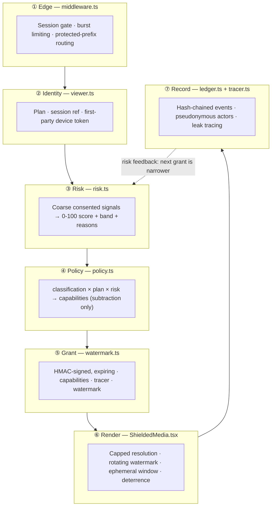

# VEILGUARD — content protection and leak attribution

Layered, consent-based protection for images, screenshots, concept drafts, media
uploads and proprietary workflow content on the ClearGlass storefront.

Status: **Phase 1 shipped** (grant gate, watermark + tracer, ledger, risk,
canaries, shielded viewer). Phases 2–4 are specified below and not yet
provisioned.

---

## 1. Start here: what this can and cannot do

Most "content protection" writing oversells. This section is first so that no
one builds a plan on a promise the technology cannot keep.

**A web page cannot prevent a screenshot.** The operating system's capture path
does not consult the page. `PrintScreen`, Snip & Sketch, `Cmd+Shift+4`, a screen
recorder, a VM's framebuffer, an HDMI capture card, or a phone camera pointed at
the monitor all bypass anything JavaScript can do. Vendors who claim otherwise
are describing a speed bump.

So VEILGUARD does not try to stop capture. It is built on a different bet:

> **Prevention is impossible; attribution is achievable.** Make casual reuse
> inconvenient, make every rendered frame carry who it was rendered for, and
> make the record of what happened impossible to quietly edit.

That yields four honest guarantees, and one honest non-guarantee:

| | Guarantee |
|---|---|
| ✅ | A leaked frame can usually be traced to the grant that produced it, from a partial crop |
| ✅ | The easy reuse paths (right-click save, drag, select-all copy, print) stop being one gesture |
| ✅ | Access narrows automatically as a session starts looking unusual, without a human in the loop |
| ✅ | The audit record cannot be altered after the fact without detection |
| ❌ | **Content cannot be prevented from leaving.** A determined viewer with a camera always wins |

The controls that survive a screenshot are the watermark and the tracer. The
click-blocking is the noisy outer layer; it deters the 95% who were never going
to work hard. Budget attention accordingly.

---

## 2. Threat model

### 2.1 What we are protecting

| Asset | Where it lives | Primary loss |
|---|---|---|
| Concept drafts, unreleased design work | `restricted` tier | Idea theft; competitor sees direction before launch |
| Proprietary workflow maps and playbooks | `confidential` tier | Method replication; the thing clients pay for |
| Client-uploaded media and screenshots | `confidential` / `restricted` | Contractual and privacy breach; loss of trust |
| Internal brand and product collateral | `internal` tier | Off-brand reuse, unauthorised distribution |
| The audit record itself | Ledger | Loss of the ability to prove what happened |

### 2.2 Threat agents

| # | Agent | Capability | Motivation | Realistic? |
|---|---|---|---|---|
| A1 | **Casual re-user** | Browser UI only | Convenience — wants the image for a deck | Very high volume |
| A2 | **Credentialed insider** | Valid session, patience | Takes work to a competitor or a personal portfolio | Low volume, high impact |
| A3 | **Credential-sharer** | Shares a login | Cost avoidance | Common |
| A4 | **Automated scraper** | Scripted, authenticated or not | Bulk harvest for training data or resale | Constant background |
| A5 | **External enumerator** | No session; guesses identifiers | Reconnaissance before a scrape | Constant background |
| A6 | **Hostile operator** | Admin access to the app and DB | Cover up an action after the fact | Rare, catastrophic |
| A7 | **Compromised viewer device** | Malware on a legitimate viewer's machine | Exfiltration the viewer did not choose | Uncommon |

### 2.3 Threats and controls

Ordered by expected loss. "Residual" states what is still true *after* the
control — the number that matters.

| # | Threat | Agent | Control | Residual risk |
|---|---|---|---|---|
| T1 | Right-click → Save image; drag to desktop | A1 | Context menu and drag suppressed on the shielded surface when export is not granted | Screenshot still works; that path is watermarked |
| T2 | Screenshot of a confidential render | A1, A2 | Rotating per-viewer watermark + tracer; frame obscures on capture keystroke and focus loss | **Not prevented.** Leaked frame is attributable |
| T3 | Photograph of the monitor | A2 | Visible watermark survives re-photography | **Not prevented.** Tracer legibility degrades; partial trace still viable |
| T4 | Bulk harvest of many assets | A4 | Breadth signal (`distinctAssetsInWindow`) raises risk; capability withdrawn at `high`; TTLs shorten | Slow, patient scraping under the window threshold |
| T5 | Identifier enumeration to find assets | A5 | Refusals counted into risk; canaries indistinguishable from unknown ids; identical 404 shape | Attacker learns nothing; their own risk rises |
| T6 | Shared credentials across people | A3 | New-device signal, geo-velocity (when edge signals are trusted), per-session tracer | Two people on one device look like one viewer |
| T7 | Client tampering to widen permissions | A2, A4 | Capabilities live in an HMAC-signed grant; server re-derives policy on every request | None material — forgery fails signature check |
| T8 | Forged telemetry to frame another viewer | A2 | Attribution read from the verified grant, never from the request body | Attacker can only raise their *own* risk |
| T9 | Editing the audit record after an incident | A6 | Hash-chained ledger; entry hash covers contents; verification reports the break point | Full consistent rewrite — addressed by T10 |
| T10 | Wholesale ledger rebuild | A6 | External checkpoint anchoring of the head hash | Requires compromising the anchor too |
| T11 | Leaked export surfacing elsewhere | A2, A3 | Per-recipient leak beacon in exported copies | Beacon stripped or opened offline |
| T12 | Exfiltration by malware on the viewer's device | A7 | Short render TTL; obscure on blur; capped resolution | **Not prevented.** Bounded to what was on screen |
| T13 | Screen-share / recording during a call | A1, A2 | Watermark present in every frame of the recording | **Not prevented.** Fully attributable |
| T14 | Client-side watermark stripped before capture | A2, A4 | *Phase 3:* server-side burn-in for `restricted` | **Real gap today** — see §5.4 |

### 2.4 Explicit non-goals

- **DRM.** No attempt to control content after it leaves the browser.
- **Covert tracking.** Every control is disclosed to the viewer (§6).
- **Blocking developer tools.** The heuristic exists, is off by default, and
  never blocks — it misfires on browser zoom and accessibility tooling, which
  would penalise exactly the wrong users (§6.2).
- **Defeating a camera.** Out of scope for any software.

---

## 3. Architecture

### 3.1 Layers

Seven layers, outermost first. Each assumes the one outside it has already
failed — a valid session is not a trusted session.



The dotted edge is the important one. The system has a **feedback loop**: what
a session does now narrows what it can reach next, with no human in the path.

### 3.2 Trust boundaries

```
   ┌─────────────────────────── UNTRUSTED ────────────────────────────┐
   │  Browser                                                          │
   │   · holds its own grant and tracer, nobody else's                  │
   │   · reports telemetry (advisory — never self-attributed)           │
   │   · can strip the client-side overlay (→ T14, Phase 3)             │
   └──────────────────┬────────────────────────────────────────────────┘
                      │  HTTPS · signed grant token
   ┌──────────────────┴──────────── TRUSTED ───────────────────────────┐
   │  Next.js server (route handlers, Node runtime)                     │
   │   · sole holder of VEILGUARD_SIGNING_SECRET                        │
   │   · re-derives policy per request; never trusts client capabilities│
   │   · writes the ledger; mints tracers                               │
   └──────────────────┬────────────────────────────────────────────────┘
                      │
   ┌──────────────────┴──────── SEPARATELY CONTROLLED ─────────────────┐
   │  Ledger store (append-only) · grant store · external anchor        │
   │   · anchor MUST be outside the app's write path (→ T10)            │
   └───────────────────────────────────────────────────────────────────┘
```

Two rules hold the boundary:

1. **The client is told what it may do; the server decides what it may do.** The
   grant's capability list drives the UI, but every server route re-checks.
2. **Attribution never comes from the client.** Telemetry is attributed from the
   verified grant token, which is why forged events cannot target someone else.

### 3.3 Request flows

**Grant issuance** — `POST /api/veilguard/grant`

```
client → resolveViewer      plan, session ref, device token
       → canary check       canary? record + refuse with the SAME shape as unknown
       → signalsFor         rolling 15-min window + device age
       → scoreRisk          score, band, per-signal reasons
       → findProtectedAsset unknown? count refusal, refuse
       → resolvePolicy      classification × plan × risk → capabilities
       → view denied?       ledger(grant_denied) → 403
       → mintGrant          HMAC grant + tracer + watermark descriptor
       → store.recordGrant  binding retained 180d for future tracing
       → ledger(grant_issued)
       ← ShieldGrantDTO
```

**Leak tracing** — `POST /api/veilguard/trace` (operator only, self-logging)

```
recovered code (may be partial: "K7M2????")
       → parseTracerCode        bits + mask; unknown positions excluded
       → candidatesForAsset     grants for THAT asset only
       → maskedDistance         Hamming over known bits
       → falseMatchProbability  Σ C(k,i)/2^k  →  conclusive|strong|indicative|inconclusive
       ← ranked matches + an explicit interpretation line
```

Tracing returns the **full ranked list**, never a top-1 answer. Two candidates
at equal distance means the evidence does not separate two people, and that has
to be visible rather than hidden.

### 3.4 The tracer

40 bits, rendered as 8 [Crockford base32](https://www.crockford.com/base32.html)
characters (no `I`, `L`, `O`, `U` — the glyphs humans misread). Derived as
`HMAC-SHA256(key, "veilguard.tracer.v1 | asset | subject | session | grant")`,
domain-separated from the grant signature computed under the same key.

It surfaces two ways: printed into the visible watermark, and as sub-pixel
per-tile offsets and opacity deltas in the overlay, so two viewers' renders of
the same asset are measurably different.

Evidence strength, given `k` legible bits and `d` mismatches:

| Recovered | Known bits | Clean match | Verdict |
|---|---|---|---|
| All 8 characters | 40 | 9 × 10⁻¹³ | conclusive |
| 4 characters | 20 | 1 × 10⁻⁶ | strong |
| 3 characters | 15 | 3 × 10⁻⁵ | indicative |
| 2 characters | 10 | 1 × 10⁻³ | indicative |
| 1 character | 5 | 3 × 10⁻² | inconclusive |

This is why the probability travels with every result: a trace is evidence with
a strength, not a verdict.

---

## 4. Implementation

### 4.1 Module map

| Path | Runtime | Purpose |
|---|---|---|
| `lib/veilguard/policy.ts` | universal | Classification × plan × risk → capabilities. Pure, subtraction-only |
| `lib/veilguard/risk.ts` | universal | Signals → score, band, per-signal explanations |
| `lib/veilguard/tracer.ts` | universal | Tracer encode/decode, partial recovery, leak tracing, render variants |
| `lib/veilguard/contract.ts` | universal | Wire DTOs between routes and viewer |
| `lib/veilguard/watermark.ts` | **server** | Tracer derivation, grant minting and verification, subject masking |
| `lib/veilguard/ledger.ts` | **server** | Hash-chained tamper-evident log, pseudonymisation, checkpoints |
| `lib/veilguard/honeypot.ts` | **server** | Enumeration canaries, per-recipient leak beacons |
| `lib/veilguard/store.ts` | **server** | Grant bindings + rolling risk window (in-memory; see §4.4) |
| `lib/veilguard/registry.ts` | **server** | Protected asset inventory; unknown ⇒ deny |
| `lib/veilguard/viewer.ts` | **server** | Viewer resolution, signal assembly, operator gate |
| `lib/veilguard/client/deterrence.ts` | **client** | Framework-free capture deterrence |
| `lib/veilguard/client/ShieldedMedia.tsx` | **client** | The shielded viewer + disclosure notice |
| `lib/veilguard/client/VaultViewer.tsx` | **client** | Grant request, denial copy, re-attestation |

> **Import rule.** `lib/veilguard/index.ts` is the *server* barrel and pulls in
> `node:crypto`. Client components import `./policy`, `./tracer` and
> `./contract` directly. Importing the barrel from a client component will
> break the build — deliberately.

### 4.2 Routes

| Route | Auth | Notes |
|---|---|---|
| `POST /api/veilguard/grant` | any (anonymous ⇒ view-only) | The gate. Sets the device cookie |
| `POST /api/veilguard/telemetry` | valid grant token | Advisory; attribution from the token |
| `POST /api/veilguard/trace` | **operator** | Leak tracing; writes its own ledger entry |
| `GET /api/veilguard/ledger` | **operator** | Integrity verdict + anchorable head. Returns no entries |
| `GET /api/veilguard/beacon/[id]` | **public by design** | Fires from wherever a leaked copy landed |

`/api/veilguard/trace` and `/ledger` answer **404**, not 403, to non-operators,
so the routes cannot be used to probe who holds elevated access.

### 4.3 Configuration

| Variable | Default | Production |
|---|---|---|
| `VEILGUARD_SIGNING_SECRET` | dev fallback | **Required** — throws at startup without it |
| `VEILGUARD_LEDGER_SALT` | dev fallback | **Required** — throws at startup without it |
| `VEILGUARD_TRUST_EDGE_SIGNALS` | `false` | `true` only behind a CDN/WAF that strips and rewrites `x-vg-*` |

Both secrets fail closed in production, matching the pattern already used by
`lib/asset-signing.ts` and `lib/auth.ts`.

**Rotating the signing key** invalidates in-flight grants (acceptable — they are
minutes long) **and breaks tracing of grants issued under the old key**. Retain
retired keys for the grant-retention window and attempt verification against
each, newest first.

**Rotating the ledger salt** starts a new pseudonym epoch: `actorRef` values
before and after will not correlate. That is a deliberate privacy property, not
a bug. Record the rotation date alongside the ledger.

### 4.4 Production hardening

Three things are dev-grade today and must change before this protects anything
that matters:

1. **The ledger sink is in-memory.** Replace `InMemoryLedgerSink` with a durable
   append-only store — a Postgres table with `UPDATE`/`DELETE` revoked from the
   application role is the least-effort correct answer, alongside the control
   plane's existing `events` table.
2. **The grant store is per-process.** Two replicas each see half the evidence
   and both under-score risk. Move `GrantStore` to Postgres (bindings) plus
   Redis (rolling counters).
3. **Checkpoints are not anchored.** `GET /api/veilguard/ledger` returns the head
   hash; nothing publishes it yet. Schedule a job to write it somewhere the app
   cannot reach back into (WORM bucket, a second account's log, or a daily
   commit). Without this, T10 stands.

Also recommended at deploy time:

- **CSP** — `default-src 'self'`, and a `report-uri` so an injected exfiltration
  script is visible.
- **`Cache-Control: no-store`** on every shielded asset response, and keep
  protected sources out of the Next.js image optimiser, which would cache a copy
  outside the shielded path (already avoided in `ShieldedMedia`).
- **`Referrer-Policy: same-origin`** so a shielded URL does not leak outward.

---

## 5. Phased rollout

Each phase has an exit criterion that is observable, not a feeling.

### Phase 0 — Baseline (complete)
Premium session gate, signed expiring asset tokens, burst limiting.
**Exit:** in place before this work started.

### Phase 1 — Attribution (shipped)
Grant gate, policy resolution, tracer + rotating watermark, hash-chained ledger,
risk scoring, canaries, shielded viewer, 54 unit tests in CI.
**Exit:** ✅ every render of a protected asset is attributable to a grant, and
`npm test` proves the invariants hold.

### Phase 2 — Durability and truth (next)
Durable append-only ledger; shared grant store; external checkpoint anchoring;
CSP + cache headers; operator trace console UI.
**Exit:** kill a replica mid-session and risk scoring is unaffected; a
deliberately corrupted ledger row is detected by a scheduled verification job
within an hour.

### Phase 3 — Server-side rendering of restricted content
Closes **T14**, the one real gap. `restricted` assets stop being composited in
the browser: the server rasterises with the watermark burned in (`sharp`),
embeds the tracer as a robust low-frequency signal rather than DOM overlay, and
delivers a single-use, no-store image. The client never receives an unmarked
source, so there is no overlay to remove.
**Exit:** a viewer with full developer tools cannot obtain an unmarked frame of
a `restricted` asset.

### Phase 4 — Detection at scale
Beacon-fetch alerting into the ops channel; scheduled canary sweeps; reverse
image search against published work; anomaly baselining per viewer cohort
instead of fixed thresholds.
**Exit:** median time from a beacon fetch to a human seeing it is under 15
minutes.

**Deliberately not planned:** blocking developer tools, disabling right-click
site-wide, obfuscating the client bundle, or any control whose cost lands on
legitimate users and whose benefit is a few minutes of an attacker's time.

---

## 6. Privacy, accessibility, performance

### 6.1 Privacy

The design principle: **collect the least that still supports attribution.**

- **No covert fingerprinting.** No canvas, font, WebGL or audio probing; no
  cross-site identifier. "Device" is a first-party salted token, disclosed in
  the viewer notice, `httpOnly`, 180-day maximum.
- **Pseudonymous ledger.** Entries carry a salted `actorRef`, never a raw
  identity. Re-identification goes through the separately-controlled grant
  store.
- **Bounded retention.** Risk state is a 15-minute rolling window — never a
  standing behavioural profile. Grant bindings persist 180 days because tracing
  needs them, and carry no behavioural history.
- **Masked watermarks.** `maskSubject()` prints `vi••••@example.com`. The tracer
  does the attribution, so masking costs nothing in traceability — the viewer
  recognises themselves (which is the deterrent) without their full address
  being burned into every frame that leaves the building.
- **Beacons are disclosed, not covert.** A beacon a recipient was never told
  about is a tracking pixel. Disclose at export time; the beacon route sets no
  cookie and records only the referring *origin*.
- **Minimal telemetry.** Event kind and method only. Never content, never
  keystrokes, never screen contents.

**Before enabling in a jurisdiction with worker-monitoring rules** (EU/EEA, UK,
several US states, Ontario's ESA written-policy requirement): this is monitoring
of identified individuals, so run a DPIA, name the lawful basis, disclose in the
employment or client agreement, and confirm works-council obligations. The
technical controls are consent-based by construction; the paperwork is not
automatic.

### 6.2 Accessibility

Protection must never cost a disabled user the content. Enforced in code:

- Images keep real alt text; the watermark overlay is `aria-hidden`.
- State changes announce through a polite live region.
- `prefers-reduced-motion` stops watermark *animation*; rotation continues,
  because it is a security function, not decoration.
- No keyboard trap, no focus suppression, no zoom blocking.
- Copy substitutes an attribution stub rather than failing silently, so screen
  reader users get an explanation on paste instead of nothing.
- Every permitted action has a real focusable control, so a suppressed gesture
  is never the only route.
- **A standing route to an accessible or unmarked copy** is linked from every
  shielded item.
- The devtools heuristic is **off by default** because the viewport-delta test
  also fires on browser zoom and screen magnifiers — it would systematically
  raise the risk score of low-vision users.

### 6.3 Performance

- Policy, risk and tracer maths are pure and allocation-light; grant issuance is
  two HMACs and a hash.
- The overlay is a 20-tile CSS grid with no per-frame JS; rotation is one state
  change per interval (20–45s), not an animation loop.
- Capped render resolution *reduces* bytes for confidential and restricted
  content relative to serving the original.
- The viewer ships no asset source until a grant exists — a denied viewer
  downloads nothing.

---

## 7. Operations

### 7.1 Suspected leak — response

1. **Recover the tracer** from the leaked artefact. Zoom the watermark; a
   partial code is fine — use `?` for illegible characters.
2. **Trace it**: `POST /api/veilguard/trace` with the asset id and the code.
3. **Read the verdict, not the name.** `conclusive`/`strong` with a single match
   is actionable evidence. `indicative` is a lead. Two candidates at equal
   distance means the fragment does not separate them — recover more characters.
4. **Corroborate against the ledger** — grant time, session, risk band at issue.
   A trace says *which grant*; the ledger says *what happened around it*.
5. **Verify chain integrity** (`GET /api/veilguard/ledger`) and confirm the head
   matches the published anchor before relying on any of it in a dispute.
6. **Preserve** the artefact, the trace result including its probability, and
   the ledger extract, before rotating any key.

### 7.2 Beacon fired

A fetch of `/api/veilguard/beacon/[id]` means a copy surfaced outside its
intended home. Resolve it to the recipient, check the referring origin, and
confirm against the export record. An *unresolved* beacon is also worth
attention: someone is guessing at the endpoint.

### 7.3 Ledger verification fails

Treat as a security incident, not a bug. Capture `brokenAt` and `reason`, snapshot
the store before anything else touches it, and compare the head against the last
published anchor — that distinguishes an application fault from a rewrite.

---

## 8. Testing

```bash
cd clearglass-commerce/storefront
npm ci
npm test          # 54 tests across policy, tracer, ledger, risk, grants, honeypots
npx tsc --noEmit
npm run build
```

The suite is wired into **Commerce Frontend CI**. It covers the invariants that
must never regress:

- **Policy subtraction** — no combination of classification, plan or risk ever
  *grants* a capability; verified exhaustively across all 48 combinations.
- **Restricted is never downloadable or exportable**, at any plan or risk.
- **Losing full-resolution always narrows the render**, including for tiers with
  no baseline cap.
- **Tracer round-trips**, tolerates transcription noise and Crockford
  confusions, compares only over recovered bits, and reports ambiguity as
  ambiguity.
- **Ledger detects** field edits, deletion, and reordering; hashing is
  order-independent; raw identities never reach an entry.
- **Risk** is monotone and capped, no ordinary signal reaches critical alone,
  honeypots override, and a VPN alone never degrades access.
- **Grants** reject tampering, expire, and cannot replay at zero TTL.

The suite has been mutation-checked: removing the plan-ceiling intersection or
the ledger's content-hash comparison both fail it.
