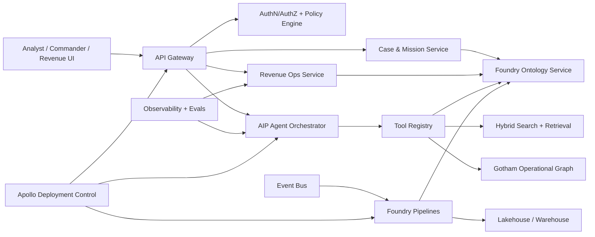
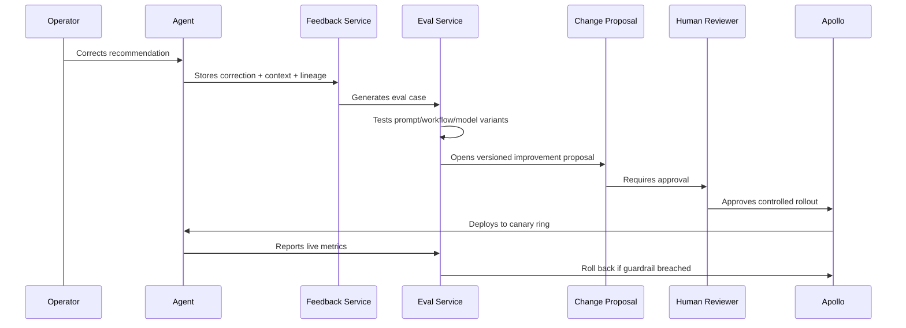

# ClearGlassInc Artemis — Self-Evolving Intelligence Platform Blueprint

## Status: sit rep

**ClearGlassInc Artemis** is designed as a secure, audited, human-governed intelligence and revenue-operations platform built around Palantir Gotham, Foundry, AIP, and Apollo patterns. This document is an implementation blueprint, not legal, tax, accounting, export-control, defense, or procurement advice. Any deployment touching regulated data, government customers, defense operations, tax determinations, financial reporting, or legally binding decisions requires qualified human review before production use.

### Immediate activation posture

| Layer | Online objective | Control gate |
| --- | --- | --- |
| Revenue engine | Convert qualified demand into compliant service offers, proposals, and delivery tasks | Human approval of claims, prices, contracts, and tax treatment |
| Repo Counsel | Review repo changes for legal, accounting, tax, IP, and access-control risk | Licensed lawyer/CPA/tax advisor for regulated decisions |
| Foundry-style data layer | Normalize live and historical signals into governed ontology objects | Data owner approval and lineage checks |
| Gotham-style operations | Track entities, cases, investigations, and mission context | Need-to-know access controls |
| AIP-style agents | Triage, enrich, summarize, recommend, and draft packages | Explicit approval gates for operationally significant actions |
| Apollo-style deployment | Promote, rollback, and monitor versions across secure environments | Signed release and runtime policy checks |

## System Architecture

### Platform map



### Palantir role alignment

- **Gotham**: operational intelligence, entity resolution, investigations, link analysis, case state, and high-confidence operational products.
- **Foundry**: data integration, transformations, ontology, lineage, permissions, pipeline execution, analytical applications, and governed data products.
- **AIP**: copilots, tool-using agents, prompt governance, evaluations, human-in-the-loop workflows, model routing, and automation.
- **Apollo**: secure deployment, runtime policy, version promotion, rollback, drift management, and environment-specific release control.

### Full-stack service layout

```text
apps/
  web-console/                 # TypeScript analyst, commander, and revenue UI
  eval-dashboard/              # AIP evals, prompt versions, precision/recall, drift
services/
  api-gateway/                 # Request auth, rate limits, policy claims, audit envelopes
  ontology-service/            # Entity CRUD, temporal state, confidence, lineage
  mission-service/             # Cases, watchlists, action packages, approvals
  revenue-ops-service/         # Offers, leads, proposals, invoices, delivery tasks
  agent-orchestrator/          # Multi-agent plans, tool calls, approval gates
  feedback-service/            # Corrections, outcomes, labels, operator trust signals
  eval-service/                # Regression evals, A/B tests, prompt scoring
  model-router/                # Latency/cost/classification-aware inference routing
  policy-service/              # OPA/Cedar-style policy-as-code
pipelines/
  ingest/                      # Batch, stream, sensor, API, document, repo events
  transform/                   # Normalization, dedupe, entity resolution, enrichment
  publish/                     # Ontology object publishing and downstream materialization
infra/
  apollo/                      # Deployment rings, rollback policies, runtime controls
  terraform/                   # Cloud/IAM/networking/logging primitives
```

## Data and Ontology

### Core ontology objects

```sql
CREATE TABLE ontology_entity (
  entity_id TEXT PRIMARY KEY,
  entity_type TEXT NOT NULL,
  display_name TEXT NOT NULL,
  confidence NUMERIC(5,4) NOT NULL CHECK (confidence BETWEEN 0 AND 1),
  classification TEXT NOT NULL,
  compartments TEXT[] NOT NULL DEFAULT '{}',
  coalition_releasability TEXT[] NOT NULL DEFAULT '{}',
  valid_from TIMESTAMPTZ NOT NULL,
  valid_to TIMESTAMPTZ,
  source_lineage JSONB NOT NULL,
  created_at TIMESTAMPTZ NOT NULL DEFAULT now(),
  updated_at TIMESTAMPTZ NOT NULL DEFAULT now()
);

CREATE TABLE ontology_relationship (
  relationship_id TEXT PRIMARY KEY,
  src_entity_id TEXT NOT NULL REFERENCES ontology_entity(entity_id),
  dst_entity_id TEXT NOT NULL REFERENCES ontology_entity(entity_id),
  relationship_type TEXT NOT NULL,
  confidence NUMERIC(5,4) NOT NULL CHECK (confidence BETWEEN 0 AND 1),
  temporal_context TSTZRANGE,
  evidence_refs TEXT[] NOT NULL DEFAULT '{}',
  policy_tags TEXT[] NOT NULL DEFAULT '{}'
);

CREATE TABLE mission_context (
  mission_id TEXT PRIMARY KEY,
  objective TEXT NOT NULL,
  commander_intent TEXT,
  jurisdiction TEXT,
  classification TEXT NOT NULL,
  allowed_actions TEXT[] NOT NULL,
  approval_policy TEXT NOT NULL,
  active BOOLEAN NOT NULL DEFAULT true
);
```

### Domain entities

- **Operational**: Person, Organization, Asset, Event, Location, SensorReport, Case, Mission, Watchlist, Finding, Evidence, ActionPackage.
- **Commercial**: Lead, Account, Offer, Proposal, Contract, Invoice, DeliveryMilestone, SupportTicket.
- **Governance**: Approval, PolicyDecision, AccessGrant, Secret, Repository, WorkflowRun, PromptVersion, ModelVersion, EvalRun.
- **Finance/control**: Expense, RevenueEvent, TaxReviewItem, AccountingControl, ReconciliationItem.

### Ontology-driven AI behavior

Agents never operate on raw, context-free text when governed ontology objects exist. Each tool response must carry:

```json
{
  "object_id": "case_123",
  "object_type": "Case",
  "confidence": 0.91,
  "classification": "CONFIDENTIAL",
  "lineage": ["sensor_report_44", "operator_correction_9"],
  "policy_tags": ["need_to_know", "human_approval_required"],
  "temporal_state": {
    "valid_from": "2026-06-29T00:00:00Z",
    "valid_to": null
  }
}
```

## AI and Agent Design

### Copilots

1. **Analyst Copilot**: asks ontology-backed questions, runs correlation, drafts findings, and cites evidence.
2. **Commander Copilot**: summarizes mission state, recommends decision options, and highlights confidence and uncertainty.
3. **Repo Counsel Copilot**: reviews GitHub changes for legal, tax, accounting, IP, workflow-control, and access-risk exposure.
4. **Revenue Operations Copilot**: qualifies inbound opportunities, drafts compliant proposals, prepares delivery checklists, and flags tax/accounting review items.

### Multi-agent workflow

```text
Event Intake Agent
  -> Classification Agent
  -> Entity Resolution Agent
  -> Correlation Agent
  -> Risk/Opportunity Scoring Agent
  -> Repo Counsel / Policy Agent
  -> Recommendation Agent
  -> Human Approval Gate
  -> Execution Agent
  -> Outcome/Eval Agent
```

### Approval gates

Agents may autonomously draft, rank, summarize, enrich, and queue work. Agents must not autonomously:

- execute operationally significant actions;
- make legal, tax, accounting, procurement, employment, defense, or regulated determinations;
- bind ClearGlassInc to contract terms;
- change production policies, model routes, prompts, or workflows without approved change control;
- release data across compartments or coalition boundaries.

## Self-Improvement Loop

### Signal capture

The feedback service captures:

- operator thumbs-up/down and written corrections;
- accepted, edited, rejected, or ignored recommendations;
- query logs, retrieval misses, latency, and tool errors;
- alert outcomes, false positives, false negatives, and mission results;
- revenue outcomes such as lead qualification, proposal acceptance, delivery completion, invoice status, and collection status;
- counsel outcomes such as human legal/CPA/tax review notes, required edits, and approval status.

### Safe upgrade path



### Versioned improvement artifact

```json
{
  "proposal_id": "upgrade_2026_06_29_001",
  "target": "analyst_triage_prompt",
  "current_version": "triage@1.4.2",
  "candidate_version": "triage@1.5.0",
  "reason": "Reduced false positives in sensor-event triage eval by 8.4%",
  "risk_level": "medium",
  "requires_human_approval": true,
  "rollback_version": "triage@1.4.2",
  "metrics": {
    "precision_delta": 0.084,
    "recall_delta": -0.006,
    "p95_latency_delta_ms": 42,
    "operator_trust_delta": 0.031
  }
}
```

## Full-Stack Implementation

### Web UI

- React/Next.js console with mission timeline, graph view, cases, approvals, prompt versions, eval dashboards, and revenue pipeline.
- All actions use signed audit envelopes containing user, role, compartment, object IDs, policy decision, and justification.
- High-risk buttons require two-step confirmation and reviewer assignment.

### Backend

- Python FastAPI for high-control services.
- Async workers for event processing.
- PostgreSQL or Foundry-backed object storage for governed ontology projections.
- Object storage/lakehouse for raw immutable evidence and replayable logs.
- OpenTelemetry for traces; append-only audit log for control evidence.

### Event bus

Topics:

```text
intel.raw_event.received
intel.entity.resolved
intel.case.updated
revenue.lead.qualified
revenue.proposal.prepared
counsel.review.required
agent.recommendation.created
approval.decision.recorded
eval.case.generated
deployment.canary.promoted
deployment.rollback.executed
```

## Security and Governance

### Policy principles

- Need-to-know by default.
- Entity, row, column, object, and relationship-level permissions.
- Coalition releasability as explicit metadata, not a UI-only label.
- Zero-trust service-to-service calls with short-lived credentials.
- Immutable audit logs for all data reads, writes, tool calls, prompt changes, model routes, approvals, and deployment events.
- Prompt governance and model governance are treated as production change management.

### Example policy decision record

```json
{
  "decision_id": "pol_7f1c",
  "subject": "user_analyst_12",
  "action": "read",
  "resource": "entity_asset_9",
  "result": "deny",
  "reason": "Missing compartment: artemis-c2",
  "policy_version": "policy@2026.06.29",
  "timestamp": "2026-06-29T13:05:00Z"
}
```

## Code Examples

### Python policy check

```python
from dataclasses import dataclass
from typing import Iterable

@dataclass(frozen=True)
class Principal:
    user_id: str
    roles: set[str]
    compartments: set[str]
    coalition: set[str]

@dataclass(frozen=True)
class Resource:
    object_id: str
    classification: str
    compartments: set[str]
    releasability: set[str]


def authorize(principal: Principal, action: str, resource: Resource) -> tuple[bool, str]:
    if "suspended" in principal.roles:
        return False, "principal_suspended"
    if not resource.compartments.issubset(principal.compartments):
        return False, "missing_compartment"
    if resource.releasability and not resource.releasability.intersection(principal.coalition):
        return False, "coalition_not_releasable"
    if action in {"approve_action", "deploy_prompt", "bind_contract"} and "approver" not in principal.roles:
        return False, "approval_role_required"
    return True, "allow"
```

### FastAPI recommendation endpoint

```python
from fastapi import FastAPI, HTTPException
from pydantic import BaseModel, Field

app = FastAPI(title="ClearGlassInc Artemis Agent Gateway")

class RecommendationRequest(BaseModel):
    mission_id: str
    case_id: str
    requested_action: str
    justification: str = Field(min_length=20)

class RecommendationResponse(BaseModel):
    recommendation_id: str
    status: str
    requires_approval: bool
    rationale: str

@app.post("/v1/recommendations", response_model=RecommendationResponse)
async def create_recommendation(req: RecommendationRequest) -> RecommendationResponse:
    mission = await load_mission(req.mission_id)
    case = await load_case(req.case_id)
    allowed, reason = await policy_check(user=current_user(), action="recommend", resource=case)
    if not allowed:
        raise HTTPException(status_code=403, detail=reason)

    rec = await agent_orchestrator.plan(
        mission=mission,
        case=case,
        action=req.requested_action,
        guardrails={"human_approval_required": True},
    )
    await audit_log("agent.recommendation.created", rec.model_dump())
    return RecommendationResponse(
        recommendation_id=rec.id,
        status="queued_for_review",
        requires_approval=True,
        rationale=rec.rationale,
    )
```

### Ontology-driven retrieval

```python
async def retrieve_case_context(case_id: str, principal: Principal) -> dict:
    case = await ontology.get_object("Case", case_id)
    allowed, reason = authorize(principal, "read", case.to_resource())
    if not allowed:
        raise PermissionError(reason)

    entities = await ontology.neighbors(case_id, edge_types=["INVOLVES", "SUPPORTED_BY", "LOCATED_AT"])
    permitted = []
    for entity in entities:
        ok, _ = authorize(principal, "read", entity.to_resource())
        if ok:
            permitted.append(entity)

    evidence = await search.hybrid(
        query=case.summary,
        filters={"case_id": case_id, "classification_lte": principal.max_classification},
        top_k=20,
    )
    return {"case": case, "entities": permitted, "evidence": evidence}
```

### Workflow state machine

```python
from enum import StrEnum

class PackageState(StrEnum):
    DRAFT = "draft"
    POLICY_REVIEW = "policy_review"
    HUMAN_APPROVAL = "human_approval"
    APPROVED = "approved"
    EXECUTED = "executed"
    REJECTED = "rejected"
    ROLLED_BACK = "rolled_back"

TRANSITIONS = {
    PackageState.DRAFT: {PackageState.POLICY_REVIEW},
    PackageState.POLICY_REVIEW: {PackageState.HUMAN_APPROVAL, PackageState.REJECTED},
    PackageState.HUMAN_APPROVAL: {PackageState.APPROVED, PackageState.REJECTED},
    PackageState.APPROVED: {PackageState.EXECUTED, PackageState.ROLLED_BACK},
}

def transition(current: PackageState, target: PackageState, actor_roles: set[str]) -> PackageState:
    if target not in TRANSITIONS.get(current, set()):
        raise ValueError(f"invalid transition: {current} -> {target}")
    if target in {PackageState.APPROVED, PackageState.EXECUTED} and "approver" not in actor_roles:
        raise PermissionError("approver role required")
    return target
```

### Eval pipeline

```python
from statistics import mean

async def run_prompt_eval(candidate_prompt: str, eval_cases: list[dict]) -> dict:
    scores = []
    for case in eval_cases:
        output = await model_router.infer(
            model_family="reasoning",
            prompt=candidate_prompt,
            inputs=case["inputs"],
            policy={"no_external_release": True},
        )
        scores.append({
            "case_id": case["case_id"],
            "precision": grade_precision(output, case["expected"]),
            "recall": grade_recall(output, case["expected"]),
            "latency_ms": output.latency_ms,
            "policy_pass": check_policy(output),
        })
    return {
        "precision": mean(s["precision"] for s in scores),
        "recall": mean(s["recall"] for s in scores),
        "p95_latency_ms": percentile([s["latency_ms"] for s in scores], 95),
        "policy_pass_rate": mean(1.0 if s["policy_pass"] else 0.0 for s in scores),
        "cases": scores,
    }
```

### Revenue engine control logic

```python
REVENUE_OFFERS = [
    {
        "offer_id": "ai_risk_assessment",
        "name": "AI Risk Assessment",
        "requires_review": ["legal_claims", "privacy", "sales_tax"],
        "fastest_cash_rank": 1,
    },
    {
        "offer_id": "cybersecurity_audit",
        "name": "Cybersecurity Audit",
        "requires_review": ["contract_scope", "liability", "insurance"],
        "fastest_cash_rank": 2,
    },
    {
        "offer_id": "automation_implementation",
        "name": "AI Automation Implementation",
        "requires_review": ["data_processing", "acceptance_criteria", "revenue_recognition"],
        "fastest_cash_rank": 3,
    },
]

def rank_revenue_actions(lead: dict) -> list[dict]:
    actions = []
    for offer in REVENUE_OFFERS:
        if lead.get("budget_confirmed") and lead.get("decision_maker_identified"):
            urgency = "high"
        else:
            urgency = "medium"
        actions.append({
            "lead_id": lead["lead_id"],
            "offer_id": offer["offer_id"],
            "next_step": "draft_proposal_for_human_review",
            "urgency": urgency,
            "review_required": offer["requires_review"],
        })
    return sorted(actions, key=lambda item: next(o["fastest_cash_rank"] for o in REVENUE_OFFERS if o["offer_id"] == item["offer_id"]))
```

## Scenario Walkthrough

1. **Live event enters**: a new sensor report, customer lead, or repo workflow alert lands on the event bus with timestamp, source, classification, and lineage.
2. **Foundry-style pipeline normalizes**: the ingest pipeline validates schema, deduplicates, enriches geospatial/temporal fields, and publishes governed ontology objects.
3. **Gotham-style graph correlates**: the system links the event to entities, cases, contracts, repositories, workflows, or revenue accounts with confidence scores.
4. **AIP agent triages**: classification, correlation, counsel, and recommendation agents assemble a cited recommendation package.
5. **Policy engine gates**: if the action is operationally significant, contract-facing, tax/accounting-facing, or compartment-sensitive, it is routed to a human approver.
6. **Operator decides**: the operator approves, rejects, or edits the action package. The decision is immutably logged.
7. **Apollo deploys or rolls back**: if the approved action is a prompt/workflow/model-route change, Apollo deploys it to a canary ring and watches guardrails.
8. **System learns safely**: the feedback service converts the outcome into eval cases. The eval service tests candidate upgrades. Only approved, versioned changes are promoted.

### Concrete mission/revenue example

A potential customer submits a request for an AI risk assessment. Artemis creates a Lead and Account, links the request to the **AI Risk Assessment** offer, identifies legal/privacy/sales-tax review points, drafts a proposal, and routes it to a human reviewer. If the proposal is edited because a claim was too broad, that edit becomes a counsel eval case. Future proposal drafts become more precise, but no agent changes the offer, price, tax treatment, or contract language without approval.

## Professional review checklist

- **Legal**: contract templates, limitation of liability, warranty disclaimers, IP ownership, data processing terms, marketing claims, export-control implications, procurement rules.
- **Tax**: sales-tax nexus, taxability of services by jurisdiction, withholding, entity classification, filing calendar, revenue location evidence.
- **Accounting**: revenue recognition, invoice controls, expense approvals, reconciliation, segregation of duties, collection status, audit evidence.
- **Security**: data classification, role design, secret ownership, access reviews, deployment approvals, incident response.
- **Governance**: board/member approvals, delegated authority matrix, signing authority, policy versioning, immutable logs.

## Activation checklist

```text
[ ] Assign human owners for Legal, Tax, Accounting, Security, and Revenue Ops.
[ ] Approve repo counsel prompt and route legal/tax/accounting labels to it.
[ ] Create ontology schema migration and seed governance object types.
[ ] Stand up feedback and eval services before enabling self-improvement.
[ ] Require approval for all prompt, workflow, model-route, contract, pricing, and tax changes.
[ ] Configure Apollo-style canary, rollback, and runtime policy controls.
[ ] Define first revenue offers and professional review gates.
[ ] Run tabletop test: event -> recommendation -> approval -> outcome -> eval -> rollback.
```
