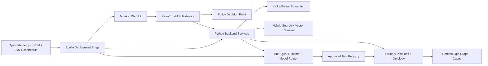

# ClearGlassInc Artemis — Production Self-Evolving AI Intelligence Platform Spec

> **Target-state specification — not a deployment claim.** This document defines the proposed architecture, contracts, controls, and delivery gates for ClearGlassInc Artemis. Product availability, API shapes, hosting boundaries, and security accreditations must be confirmed against the licensed Palantir environment before implementation. No described integration is represented as currently provisioned.

**Objective.** Fuse permissioned live and historical information into traceable mission context, assist operators at low latency, and improve prompts, workflows, heuristics, retrieval, and model routes through evaluated proposals. Artemis never changes its objectives, authority, data access, tools, or production configuration without the required human decision.

### System invariants and service objectives

| Invariant | Enforced by | Verification evidence |
|---|---|---|
| Model output is untrusted data, never authority | typed output schemas, policy decision point (PDP), workflow state machine | malformed-output and forbidden-transition tests |
| Consequential work follows `draft → review → approve → execute` | action service and short-lived approval capability | negative tests proving unapproved execution has no side effect |
| Need-to-know applies before retrieval and after generation | gateway, ontology policy, retrieval filter, output DLP | cross-compartment isolation tests |
| Every conclusion resolves to visible evidence and versioned logic | ontology assertion lineage and run manifest | provenance completeness metric equals 100% |
| Improvement is proposal-only | isolated proposal builder; separate reviewer and deployer identities | authorization and separation-of-duty tests |
| Every release is signed, observable, and reversible | artifact registry and Apollo rollout policy | signature, canary, kill-switch, and rollback drills |

Initial service-level objectives are hypotheses to validate during a pilot: accepted events durable within 2 seconds at p95, interactive reads within 500 ms at p95, first triage within 5 seconds at p95, 99.9% control-plane availability, and zero tolerance for unauthorized disclosure or unapproved consequential execution. Mission owners set stricter per-mission objectives where required.

## System Architecture

ClearGlassInc Artemis is a secure, coalition-aware, latency-sensitive intelligence platform that uses **Gotham** for operational investigations and entity tracking, **Foundry** for data integration and ontology-driven application logic, **AIP** for governed copilots and agents, and **Apollo** for signed deployment, rollback, and runtime control.



| Layer | Implementation | Controls |
|---|---|---|
| Frontend | TypeScript mission console, graph explorer, approval queue, ModelOps dashboard | classification banners, redaction-aware UI, signed approval prompts |
| Backend | Python/FastAPI gateway, fusion services, workflow runner, self-improvement controller | mTLS, JWT/SPIFFE, idempotency, OpenTelemetry, immutable audit |
| Data | Foundry datasets, lakehouse history, hot Postgres/Redis state, evidence object store | lineage, retention, row/column/entity ACLs, WORM audit export |
| Ontology | Mission, Event, Alert, Case, Entity, Device, Location, Evidence, PromptVersion, WorkflowVersion | confidence, temporal state, markings, purpose-of-use filters |
| AI | AIP copilots, agent runtime, model router, eval harness, tool executor | tool allowlists, citation requirements, approval gates, eval thresholds |
| Policy | OPA/Rego ABAC, coalition caveats, clearance, compartments, legal purpose | pre-query, pre-tool, pre-answer, pre-deployment enforcement |
| Deployment | Apollo rings: dev, shadow, canary, mission, rollback | signed artifacts, health gates, rollout freeze, automatic rollback |

### Runtime and trust boundaries

```text
UNTRUSTED SOURCES             DATA PLANE                 DECISION PLANE
signed feed / upload ──> ingest quarantine ──> Foundry datasets + Ontology
                               │                         │ policy-filtered view
                               └── malware/schema/DLP    v
OPERATOR DEVICE ── OIDC/mTLS ─> gateway ── PDP ──> AIP orchestration ──> typed tools
                                  │                         │
                                  └── append-only audit <──┘

MANAGEMENT PLANE: version registry ── human review ── signed release ── Apollo
AUDIT PLANE:      independent event sink ── WORM retention ── SIEM / investigation
```

- The **data plane** accepts only authenticated sources, quarantines malformed or hostile content, and promotes records after schema, marking, integrity, and quality checks.
- The **decision plane** creates analyses and action drafts. It has no deployment credentials and receives mission-scoped, policy-filtered data rather than raw stores.
- The **management plane** owns versions and deployment. Workload identities used by agents cannot approve or promote their own candidates.
- The **audit plane** is write-only from application workloads and independently readable by authorized auditors.
- Disconnected edge cells retain a last-known-good signed policy/model bundle, bounded queues, an expiry time, and a fail-closed mode for actions whose approval cannot be verified.

### Event and request paths

1. An authenticated connector wraps each event in a versioned envelope with source, mission, markings, observed time, idempotency key, and payload digest.
2. Foundry pipelines preserve immutable bronze input, validate and normalize silver records, and publish curated gold objects only when data contracts pass.
3. Ontology object types, links, Actions, and Functions expose the governed operational contract. Gotham consumes the same objects for investigations and entity tracking.
4. AIP workflows obtain a principal-bound authorization context, retrieve only eligible objects, call allowlisted typed tools, and produce schema-validated outputs with citations.
5. Low-risk analytical output may be returned and logged. Case changes and operational packages enter deterministic approval workflows; no model response can directly invoke execution.
6. Operator decisions and eventual outcomes become feedback signals without being treated automatically as ground truth.

## Data and Ontology

The ontology is the contract between human workflows and AI behavior. Agents do not operate on free-form data dumps; they query typed ontology objects that carry provenance, confidence, temporal validity, and permissions.

```yaml
objectTypes:
  Mission: {pk: mission_id, props: [name, objective, theater, classification, coalition_tags, active_window, commander]}
  Event: {pk: event_id, props: [event_type, occurred_at, detected_at, source_system, confidence, classification]}
  Alert: {pk: alert_id, props: [mission_id, score, status, disposition, severity, sla_deadline]}
  Case: {pk: case_id, props: [mission_id, owner, priority, status, created_at, closed_at]}
  Entity: {pk: entity_id, props: [kind, canonical_name, aliases, risk_score, confidence, valid_time, tx_time]}
  Evidence: {pk: evidence_id, props: [source_uri, sha256, collector, collected_at, lineage, handling_caveats]}
  OperatorFeedback: {pk: feedback_id, props: [operator_id, case_id, artifact_ref, correction_type, label, rationale]}
  PromptVersion: {pk: prompt_version_id, props: [name, version, hash, owner, eval_score, approval_state, apollo_ring]}
  WorkflowVersion: {pk: workflow_version_id, props: [name, version, graph_hash, eval_score, approval_state, apollo_ring]}
relationships:
  - Mission CONSTRAINS Case
  - Case CONTAINS Alert
  - Alert TRIGGERED_BY Event
  - Event INVOLVES Entity
  - Evidence SUPPORTS Event
  - OperatorFeedback CORRECTS Alert
  - PromptVersion POWERS Agent
  - WorkflowVersion ORCHESTRATES Agent
```

The production ontology also needs assertion-level and governance objects:

| Object type | Required properties | Purpose |
|---|---|---|
| `Assertion` | subject, predicate, object/value, confidence, valid interval, transaction interval, evidence IDs, derivation ID | represents a claim without collapsing conflicting evidence |
| `Source` | owner, acquisition method, reliability history, legal basis, handling rules | separates source reliability from claim credibility |
| `MissionContext` | purpose, authority, geography, active interval, risk envelope, compartments | binds every query and action to an authorized purpose |
| `AgentRun` | input/output digests, prompt/workflow/model versions, retrieved IDs, tool calls, policy decisions | reproducible run manifest without storing excess sensitive text |
| `ActionPackage` | requested effect, target, risk, evidence, alternatives, expiry, state | immutable review artifact whose digest is approved |
| `ApprovalDecision` | package digest, decision, conditions, approver, role, decided time, expiry | cannot be replayed for a modified or expired package |
| `EvaluationCase` | sanitized input reference, expected rubric, slice tags, provenance, reviewer state | versioned evaluation evidence |
| `ReleaseCandidate` | component digests, parent, eval report, approvals, rollback target | deployable unit controlled by Apollo |

### Identity, confidence, and time semantics

- Object identifiers are stable, opaque IDs; aliases and source keys are attributes, never authorization keys.
- Entity resolution creates a candidate link and score. A reversible merge action requires stewardship policy; source records remain addressable after a merge.
- Confidence attaches to individual assertions and records the calibration method. Independent evidence may raise confidence; repeated reports from one upstream origin must not be counted as independent.
- `valid_from`/`valid_to` describe the world; `recorded_at`/`superseded_at` describe platform knowledge. Corrections supersede assertions rather than overwrite history.
- Derived objects store dataset snapshot, transform, code, policy, model, prompt, and workflow versions plus the exact evidence identifiers used.
- Markings propagate monotonically by default. Declassification or releasability is a separately authorized action, never inferred by an agent.

### How the ontology controls humans and agents

The web application, Gotham views, Foundry applications, and agent tools use the same object/action vocabulary. A `Case.openDraft` action can be available to an analyst and a triage agent, while `ActionPackage.execute` is available only to an execution service presenting an eligible approval capability. Object visibility is intersected across identity, clearance, mission assignment, compartments, coalition releasability, geography, purpose of use, and time. Links are filtered independently so a hidden edge cannot be inferred from node counts, search facets, embeddings, error messages, or citations.

Every fact is bitemporal: `valid_time` captures when it was true in the world, and `tx_time` captures when Artemis learned or changed it. Confidence is stored per assertion, not globally per entity, so agents can explain which evidence moved a conclusion.

## AI and Agent Design

ClearGlassInc Artemis uses specialized, policy-bound agents:

- **Analyst Copilot** summarizes alerts, cites evidence, explains entity links, and drafts investigation notes.
- **Commander Copilot** prepares courses of action, risk comparisons, and decision briefs.
- **Triage Agent** scores incoming events using ontology links, source reliability, and mission context.
- **Enrichment Agent** requests approved data lookups and adds corroborating evidence.
- **Correlation Agent** links events, entities, devices, and cases across time windows.
- **Recommendation Agent** creates action packages but cannot execute significant actions.
- **ModelOps Agent** proposes prompt, workflow, heuristic, and model-route upgrades for human review.

Operationally significant actions require explicit approval tokens bound to mission, action, operator, artifact hash, policy context, and expiry. Rejections are first-class learning signals.

### Agent topology and execution budgets

| Role | Input | Permitted output/tools | Hard stop |
|---|---|---|---|
| Triage | one event plus mission policy | label, priority, cited evidence; ontology read | abstain on missing provenance or schema failure |
| Enrichment | scoped entities and collection plan | queries to approved sources; new candidate assertions | query/time/result budget or marking conflict |
| Correlation | temporal object neighborhood | ranked, explainable candidate links | no automatic entity merge |
| Summarization | visible evidence set | structured brief with claim-level citations | unsupported claims rejected by validator |
| Recommendation | brief, constraints, alternatives | draft `ActionPackage` | cannot invoke an effecting tool |
| Product builder | approved case content | draft report with releasability preview | publication always separately authorized |
| ModelOps | sanitized failures and eval reports | candidate diff and experiment plan | cannot approve, deploy, add tools, or expand scope |

Each run receives immutable budgets: deadline, maximum steps, maximum tool calls, result bytes, model spend, ontology traversal depth, and allowed resource IDs. The orchestrator cancels outstanding work on deadline, detects repeated tool calls, makes writes idempotent, and returns a safe partial result or abstention. Parallel agents exchange typed artifacts through the workflow store—not hidden free-form conversations—and a deterministic reducer resolves conflicts or escalates them to an operator.

### Model router

Routing is deterministic policy plus measured capability, not agent preference. Candidate models are filtered by data classification, accreditation, residency, modality, context limit, latency SLO, approved task, and current health. The router then selects the least-cost route meeting the required quality tier and records the route decision. It fails closed when no eligible model exists and may fall back only to a pre-approved route with equal or stronger data handling.

Prompt injection defenses include source isolation, instruction/data separation, content labeling, retrieval allowlists, tool argument validation, egress denial, secret-free model context, and output validation. Retrieved text cannot grant tools, alter policy, increase budgets, or change the system prompt.

## Self-Improvement Loop

Artemis gets better by converting operator behavior and outcomes into evals and reviewable changes, not by autonomously changing objectives or authorities.

1. Capture feedback, operator corrections, query traces, retrieval misses, alert outcomes, model route, prompt version, workflow version, latency, edit distance, and mission disposition.
2. Normalize and redact signals into Foundry eval datasets with immutable lineage.
3. Generate eval cases for false positives, missed correlations, bad summaries, unsafe recommendations, and policy overblocking.
4. Propose candidate prompt diffs, workflow graph changes, retrieval parameter changes, heuristic thresholds, or model-route updates.
5. Run offline evals and shadow evals against golden sets and recent mission slices.
6. Block candidates with policy violations, citation regressions, recall collapse, precision regression, latency breach, or drift anomalies.
7. Send passing candidates to human ModelOps review.
8. Deploy approved candidates through Apollo canary rings with automatic rollback to the prior signed version.
9. Promote only after live metrics remain healthy.
10. Preserve every signal, eval, diff, approval, rollout, and rollback in the audit ledger.

### Signal quality and evaluation design

Operator edits, accepts, rejects, search reformulations, case outcomes, alert dispositions, retrieval misses, latency, and abstentions are observations—not automatically correct labels. Artemis deduplicates correlated signals, records who supplied them, applies conflict/adjudication states, removes unauthorized payload content, and prevents one operator or mission from dominating global behavior.

Evaluation sets are immutable and split by time, mission, source, classification, language, modality, rare event, and known safety stressors. A sealed holdout is inaccessible to proposal generation. Every candidate is compared to its exact champion on paired cases and reports confidence intervals, not only point estimates. Gates include:

- task precision, recall, calibration error, abstention quality, citation entailment, and unsupported-claim rate;
- policy bypass, cross-compartment leakage, prompt injection, unsafe-tool, and approval-bypass suites, all with zero allowed failures;
- p50/p95/p99 end-to-end latency, timeout rate, throughput, cost, and bounded-resource behavior;
- operator acceptance, correction distance, override rate, time saved, trust calibration, and downstream mission outcome proxies;
- slice regressions so aggregate improvement cannot hide coalition, language, geography, source, or rare-event harm.

Mission impact is never optimized as a single model reward. Accountable owners interpret outcome measures because attribution is confounded by operator decisions and external events.

### Version and promotion state machine

```text
DRAFT -> OFFLINE_EVALUATED -> SECURITY_REVIEWED -> APPROVED -> SHADOW
                                                          -> REJECTED
SHADOW -> CANARY -> LIMITED_MISSION -> CHAMPION
   \         \            \             \
    +----------+------------+-----------> ROLLED_BACK
```

Transitions use compare-and-swap on the current state and append a signed event. `APPROVED` requires role-separated mission, security, data, and model-governance decisions appropriate to risk. Approval binds the complete manifest digest; any prompt, code, policy, dataset, tool, or route change invalidates it. Only Apollo’s deployer identity can transition an approved release. Automated rollback may reduce capability but never promote a new candidate.

### Drift and rollback

Artemis measures input schema/volume, population stability, embedding neighborhoods, label delay, confidence calibration, retrieval quality, denial rate, agent step count, operator correction, and output distribution. Warning thresholds trigger investigation or shadow-only routing. Critical safety, disclosure, integrity, or approval failures immediately disable the affected workflow and pin the last-known-good release. Rollback restores the entire compatible bundle—service, prompt, workflow, policy, tool schema, model route, and ontology contract—and emits an incident record. Forward data migrations require expand/migrate/contract sequencing so the previous release remains viable.

## Full-Stack Implementation

```text
apps/web/                         # Next.js mission UI and approval console
apps/api/                         # FastAPI gateway and public contracts
services/ingest/                  # stream normalization and evidence hashing
services/fusion/                  # entity resolution, correlation, confidence scoring
services/agent_runtime/           # AIP tool executor and state machines
services/self_improvement/        # eval builder, optimizer, proposal registry
packages/ontology/                # typed Python query builders and models
packages/policy/                  # Rego policies and policy client
packages/observability/           # traces, metrics, eval dashboards
infra/apollo/                     # rings, health gates, rollback manifests
```

### Service ownership and contracts

| Service | Responsibility | Storage / interface | Failure posture |
|---|---|---|---|
| Ingestion gateway | authenticate, validate, hash, deduplicate, quarantine | versioned event envelope; Foundry stream | reject or quarantine; never silently coerce |
| Fusion service | resolution, temporal correlation, calibrated confidence | ontology assertions and links | preserve conflicts; no destructive merge |
| Retrieval service | lexical/vector/graph search with policy prefilter | search indexes keyed by object and marking | return no result on policy uncertainty |
| Orchestrator | budgets, state transitions, AIP/tool invocation | durable workflow journal | cancel, retry safe reads, abstain |
| Action service | draft, approval, execution, reconciliation | transactional outbox and action ledger | no approval means no effect |
| Feedback/eval service | signal curation and reproducible evaluation | versioned Foundry datasets | quarantine poisoned or ambiguous labels |
| Registry | immutable prompts, workflows, tools, routes, policies | content-addressed manifests | refuse unsigned or incomplete bundles |

Topics are versioned (`intel.event.received.v1`, `case.feedback.recorded.v1`, `workflow.completed.v1`) and use an outbox/inbox pattern. Producers assign an idempotency key; consumers atomically record receipt and business state; retries use exponential backoff with jitter and a bounded dead-letter queue. Ordering is guaranteed only within a mission/entity partition, so handlers must tolerate duplicates and late events.

### Frontend blueprint

The TypeScript/React mission console has server-mediated data access and never stores raw bearer tokens in browser persistence. Primary surfaces are a live alert queue, ontology graph and timeline, evidence/citation inspector, case workspace, action-package comparison, approval inbox, and ModelOps/eval dashboard. Every surface shows classification and coalition banners, source age, confidence, uncertainty, and policy-redaction indicators.

Approval uses a deliberate review screen showing exact package digest, proposed effects, target, evidence, alternatives, risk, expiry, rollback/recovery instructions, and separation-of-duty status. Keyboard navigation, visible focus, semantic headings, non-color status cues, zoom/reflow, reduced motion, and screen-reader announcements are release criteria. The client must not infer access from hidden controls; the server reauthorizes every request.

```typescript
type ApprovalDecision = Readonly<{
  packageId: string;
  packageDigest: string;
  decision: "approve" | "reject";
  rationale: string;
  expectedVersion: number;
}>;

export async function submitDecision(
  decision: ApprovalDecision,
  csrfToken: string,
  signal: AbortSignal,
): Promise<void> {
  if (decision.rationale.trim().length < 10) {
    throw new Error("A decision rationale of at least 10 characters is required.");
  }
  const response = await fetch(`/api/action-packages/${decision.packageId}/decision`, {
    method: "POST",
    credentials: "same-origin",
    signal,
    headers: { "Content-Type": "application/json", "X-CSRF-Token": csrfToken },
    body: JSON.stringify(decision),
  });
  if (!response.ok) {
    throw new Error(`Decision was not recorded (HTTP ${response.status}).`);
  }
}
```

The backend compares `expectedVersion` atomically, recomputes the canonical package digest, verifies reviewer role and separation of duty, and returns a conflict rather than overwrite a concurrent decision. The UI reports success only after receiving the committed decision resource.

### Observability and operations

OpenTelemetry correlation IDs connect source event, pipeline transform, ontology mutation, retrieval, agent run, tool call, policy decision, operator approval, external effect, and release. Logs contain identifiers and digests rather than sensitive prompts or evidence. Metrics cover service SLOs, queue age, data quality, policy decisions, workflow transitions, token/tool budgets, eval slices, drift, rollout health, and audit-sink lag. Alerts distinguish liveness, readiness, dependency degradation, functional correctness, and invariant violation.

Recovery objectives must be set during threat and business-impact analysis. Before production, teams test restore from backup, loss of Foundry/AIP connectivity, partitioned edge operation, compromised connector revocation, credential rotation, audit-sink outage, event replay, and full-bundle rollback.

## Security and Governance

- Need-to-know checks run at API, ontology, retrieval, tool, answer, and UI render layers.
- Row, column, and entity-level permissions enforce mission assignment, classification, coalition tags, compartments, and purpose.
- Zero-trust execution uses mTLS, SPIFFE IDs, workload attestation, egress allowlists, sealed secrets, and sandboxed tools.
- Prompt governance requires owners, hashes, eval scores, human approvals, and Apollo deployment metadata.
- Model governance restricts models by classification, data residency, latency, cost, and approved use case.
- Audit logs are append-only hash chains exported to SIEM and WORM storage.
- All connected monitoring or automation must retain manual fallback, secure credentials, firmware/update procedures, and documented ownership.

### Threats and control evidence

| Threat | Prevent | Detect | Recover |
|---|---|---|---|
| Coalition data leakage | marking-aware indexes, ABAC, no cross-scope caches | canary records, DLP, denied-query analytics | revoke session, disable route, incident workflow |
| Prompt injection / poisoned retrieval | quarantine, trust labels, typed tools, egress deny | adversarial evals, anomalous tool traces | isolate corpus/version and replay clean index |
| Confused deputy | audience-bound workload identity, resource-scoped capabilities | identity/action mismatch alert | revoke capability and rotate identity |
| Approval replay or substitution | digest-, mission-, action-, condition-, and expiry-bound decision | duplicate/replay event detection | block effect and reconcile ledger |
| Feedback poisoning | provenance, rate limits, deduplication, adjudication, sealed holdout | label/source drift and influence analysis | remove contaminated slice and rebuild candidate |
| Supply-chain compromise | pinned inputs, isolated builds, SBOM, signing, provenance | signature and admission verification | quarantine artifact, revoke signer, roll back |
| Audit tampering | append-only hash chain and independent WORM export | continuity checkpoints and sink-lag alerts | fail closed for material actions; investigate gap |

Residual risks—such as delayed outcome labels, imperfect entity resolution, model opacity, coalition policy inconsistency, and disconnected-edge staleness—require named owners and acceptance at the operational review gate. Capability remains disabled when accreditation, threat review, privacy review, test evidence, deployment ownership, or rollback readiness is missing.

## Code Examples

### Python precision control plane

```python
from dataclasses import dataclass
from datetime import UTC, datetime
from enum import StrEnum
from hashlib import sha256
from typing import Literal
from uuid import uuid4

class ChangeKind(StrEnum):
    PROMPT = "prompt"
    WORKFLOW = "workflow"
    MODEL_ROUTE = "model_route"
    HEURISTIC = "heuristic"

@dataclass(frozen=True)
class EvalMetrics:
    precision: float
    recall: float
    citation_accuracy: float
    policy_violations: int
    p95_latency_ms: int

    def passes(self, baseline: "EvalMetrics") -> bool:
        return (
            self.policy_violations == 0
            and self.precision >= max(0.92, baseline.precision)
            and self.recall >= baseline.recall * 0.995
            and self.citation_accuracy >= baseline.citation_accuracy
            and self.p95_latency_ms <= int(baseline.p95_latency_ms * 1.10)
        )

@dataclass(frozen=True)
class UpgradeProposal:
    proposal_id: str
    kind: ChangeKind
    current_version: str
    candidate_version: str
    diff_hash: str
    rationale: str
    status: Literal["blocked", "review"]
    created_at: datetime

def propose_upgrade(kind: ChangeKind, current_version: str, diff: str, baseline: EvalMetrics, candidate: EvalMetrics) -> UpgradeProposal:
    status: Literal["blocked", "review"] = "review" if candidate.passes(baseline) else "blocked"
    return UpgradeProposal(
        proposal_id=f"artemis-{uuid4().hex}",
        kind=kind,
        current_version=current_version,
        candidate_version=f"{current_version}+{sha256(diff.encode()).hexdigest()[:12]}",
        diff_hash=sha256(diff.encode()).hexdigest(),
        rationale="Eval-backed candidate generated from operator feedback; human approval still required.",
        status=status,
        created_at=datetime.now(UTC),
    )
```

### Policy check

```python
from dataclasses import dataclass

@dataclass(frozen=True)
class Principal:
    subject: str
    clearance: int
    missions: frozenset[str]
    coalition_tags: frozenset[str]
    compartments: frozenset[str]
    actions: frozenset[str]
    purposes: frozenset[str]

@dataclass(frozen=True)
class Resource:
    resource_id: str
    mission_id: str
    classification: int
    coalition_tags: frozenset[str]
    compartments: frozenset[str]

def authorize(principal: Principal, action: str, purpose: str, resource: Resource) -> bool:
    return (
        principal.clearance >= resource.classification
        and resource.mission_id in principal.missions
        and resource.coalition_tags.issubset(principal.coalition_tags)
        and resource.compartments.issubset(principal.compartments)
        and action in principal.actions
        and purpose in principal.purposes
    )
```

### Workflow state machine

```python
from dataclasses import dataclass
from datetime import UTC, datetime
from enum import StrEnum
from hashlib import sha256
from typing import Protocol

class State(StrEnum):
    DRAFT = "draft"
    PENDING_APPROVAL = "pending_approval"
    APPROVED = "approved"
    REJECTED = "rejected"
    EXECUTED = "executed"
    FAILED = "failed"

ALLOWED_TRANSITIONS = {
    State.DRAFT: frozenset({State.PENDING_APPROVAL}),
    State.PENDING_APPROVAL: frozenset({State.APPROVED, State.REJECTED}),
    State.APPROVED: frozenset({State.EXECUTED, State.FAILED}),
    State.REJECTED: frozenset(),
    State.EXECUTED: frozenset(),
    State.FAILED: frozenset(),
}

@dataclass(frozen=True)
class ApprovalCapability:
    mission_id: str
    package_digest: str
    action: str
    approver: str
    expires_at: datetime

class EffectAdapter(Protocol):
    async def execute(self, package: bytes, idempotency_key: str) -> str: ...

def transition(current: State, requested: State) -> State:
    if requested not in ALLOWED_TRANSITIONS[current]:
        raise ValueError(f"forbidden transition: {current} -> {requested}")
    return requested

async def execute_approved(
    *,
    state: State,
    mission_id: str,
    action: str,
    package: bytes,
    capability: ApprovalCapability,
    adapter: EffectAdapter,
) -> tuple[State, str]:
    digest = sha256(package).hexdigest()
    if state is not State.APPROVED:
        raise PermissionError("action package is not approved")
    if capability.expires_at <= datetime.now(UTC):
        raise PermissionError("approval capability expired")
    if (capability.mission_id, capability.action, capability.package_digest) != (
        mission_id, action, digest
    ):
        raise PermissionError("approval capability does not bind this request")

    receipt = await adapter.execute(package, idempotency_key=digest)
    return transition(state, State.EXECUTED), receipt
```

The execution adapter is the only component holding credentials for an effecting system. It must reauthorize at execution time, use the package digest as an idempotency key, write an audit/outbox record in the same transaction as local state, and reconcile the external receipt before declaring success.

### Typed ontology tool boundary

```python
from dataclasses import dataclass
from typing import Protocol

@dataclass(frozen=True)
class QueryScope:
    principal_id: str
    mission_id: str
    purpose: str
    compartments: frozenset[str]
    maximum_objects: int = 100

@dataclass(frozen=True)
class EntitySummary:
    entity_id: str
    kind: str
    display_name: str
    assertion_ids: tuple[str, ...]

class FoundryOntologyAdapter(Protocol):
    """Tenant adapter; this specification does not assume a Palantir SDK shape."""

    async def search_entities(
        self, *, scope: QueryScope, canonical_query: str
    ) -> tuple[EntitySummary, ...]: ...

async def query_entities(
    *, scope: QueryScope, query: str, ontology: FoundryOntologyAdapter
) -> tuple[EntitySummary, ...]:
    normalized = " ".join(query.split())
    if not normalized or len(normalized) > 512:
        raise ValueError("query must contain 1 to 512 normalized characters")
    if not scope.mission_id or not scope.purpose:
        raise PermissionError("mission and purpose are required")
    results = await ontology.search_entities(scope=scope, canonical_query=normalized)
    if len(results) > scope.maximum_objects:
        raise RuntimeError("ontology adapter violated the result budget")
    return results
```

The adapter implementation uses the licensed environment’s supported Foundry Ontology SDK/API, passes the authenticated user/workload context rather than a service-wide superuser, and converts tenant objects into the stable internal contract. The same rule applies to Gotham case synchronization, AIP inference, and Apollo release integrations.

### Idempotent event handler

```python
from dataclasses import dataclass
from datetime import datetime
from hashlib import sha256
from typing import Protocol

@dataclass(frozen=True)
class EventEnvelope:
    event_id: str
    schema_version: int
    mission_id: str
    source_id: str
    occurred_at: datetime
    payload_digest: str
    payload: bytes

class EventStore(Protocol):
    async def accept_once(self, event: EventEnvelope) -> bool: ...
    async def publish_outbox(self, event_id: str, topic: str) -> None: ...

async def handle_event(event: EventEnvelope, store: EventStore) -> str:
    if event.schema_version != 1:
        raise ValueError("unsupported event schema version")
    if sha256(event.payload).hexdigest() != event.payload_digest:
        raise ValueError("payload digest mismatch")
    inserted = await store.accept_once(event)
    if not inserted:
        return "duplicate"
    await store.publish_outbox(event.event_id, "intel.event.received.v1")
    return "accepted"
```

`accept_once` and the outbox write are one datastore transaction in the concrete implementation. Consumers acknowledge only after their inbox record and domain update commit; poison events move to a bounded, access-controlled quarantine with an operator-visible reason.

### SQL eval dashboard

```sql
create or replace view artemis_eval_dashboard as
select
  prompt_name,
  workflow_version,
  model_route,
  count(*) as eval_count,
  avg(case when passed then 1.0 else 0.0 end) as pass_rate,
  avg(precision_score) as precision_score,
  avg(recall_score) as recall_score,
  avg(citation_accuracy) as citation_accuracy,
  percentile_cont(0.95) within group (order by latency_ms) as p95_latency_ms,
  sum(case when policy_violation then 1 else 0 end) as policy_violations
from eval_runs
where executed_at >= now() - interval '30 days'
group by prompt_name, workflow_version, model_route;
```

## Scenario Walkthrough

At **03:14:00 UTC**, an authenticated coalition connector receives a burst of access failures from a field device near a protected facility. This is an illustrative incident, not a real operational claim.

1. **03:14:00 — Accept and preserve.** The ingestion gateway verifies connector identity, schema version, markings, digest, timestamp tolerance, and idempotency key. Foundry retains the original bronze event, normalizes a silver `Event`, and publishes gold `Evidence` and `Assertion` objects with complete lineage. A late duplicate is acknowledged without creating a second assertion.
2. **03:14:02 — Construct context.** The ontology links the device, facility, mission, prior events, and a scheduled maintenance window without merging identities. Gotham renders the policy-filtered graph and timeline. A coalition-ineligible edge is absent from results, counts, citations, and embeddings.
3. **03:14:03 — Triage.** AIP invokes the Triage agent with a five-second deadline and read-only tools. It reports `0.82` suspicion, cites the access failures, and explicitly identifies the maintenance record as contrary evidence. The result passes its schema and citation validator.
4. **03:14:05 — Enrich and correlate.** Enrichment queries two approved sources in parallel. Correlation returns one corroborating device-health anomaly and one conflicting benign explanation. The deterministic reducer preserves both assertions and lowers calibrated confidence to `0.68` rather than hiding disagreement.
5. **03:14:07 — Recommend, do not act.** The Recommendation agent creates two immutable drafts: increase monitoring (medium risk) and temporarily constrain access (high risk). The action service moves both to `PENDING_APPROVAL`; the agent possesses neither approval nor execution credentials.
6. **03:15:10 — Human decision.** A mission-authorized operator reviews evidence, impact, alternatives, markings, expiry, and package digests. The operator approves increased monitoring and rejects access constraint with the rationale that maintenance plus moderate confidence makes disruption disproportionate. A second role is required wherever mission policy classifies the approved effect as high risk.
7. **03:15:12 — Bounded execution.** The execution service reauthorizes the approved monitoring package, validates its unexpired digest-bound capability, invokes the applicable Foundry Action through the tenant adapter once, stores the receipt, and appends the outcome. The rejected package can never reach `EXECUTED`.
8. **+6 hours — Observe outcome.** Device health returns to normal after maintenance. A steward adjudicates the alert disposition. Artemis records the correction, operator rationale, eventual outcome, query trace, route versions, latency, and evidence—not a simplistic reward that would teach the system to suppress all similar alerts.
9. **Nightly — Build a falsifiable proposal.** The eval service adds a sanitized, provenance-linked case to the next evaluation-set version. Failure clustering finds that the champion underweights active maintenance context. ModelOps proposes a narrow retrieval-weight and prompt diff requiring contrary maintenance evidence before recommending disruptive constraints. The proposal cannot alter mission goals, permissions, tools, or its own promotion gates.
10. **Next review window — Evaluate and approve.** Offline paired evaluation runs on temporal holdout and safety suites, followed by replay and shadow traffic. Reviewers inspect full slice metrics, confidence intervals, red-team results, cost/latency, artifact diff, and rollback target. Mission, security, data, and model-governance approvers sign the immutable candidate digest or reject it.
11. **Canary — Deploy and watch.** Apollo verifies signatures, deploys the compatible service/prompt/workflow/policy/tool/route bundle to a small eligible cohort, and compares it with the champion. Promotion proceeds only if predefined precision, recall, calibration, citation, latency, operator-trust, and zero-safety-failure gates hold for the observation window.
12. **Rollback — Prefer safety over novelty.** A disclosure, approval, integrity, or critical slice regression trips the kill switch and atomically pins the prior signed bundle. The release, trigger, decisions, receipts, and rollback become an incident-linked audit chain. A rollback reduces capability; it never grants a different candidate authority.

The improvement is therefore exact and reviewable: an outcome becomes a curated evaluation case; the case motivates a bounded version diff; independent tests determine eligibility; humans grant deployment authority; Apollo limits exposure and can restore the known-good bundle. Operator behavior informs future performance without permitting autonomous goal change or self-expanded privilege.
