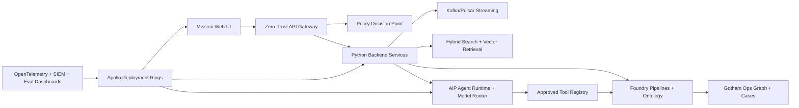

# ClearGlassInc Artemis — Production Self-Evolving AI Intelligence Platform Spec

## System Architecture

ClearGlassInc Artemis is a secure, coalition-aware, latency-sensitive intelligence platform that uses **Gotham** for operational investigations and entity tracking, **Foundry** for data integration and ontology-driven application logic, **AIP** for governed copilots and agents, and **Apollo** for signed deployment, rollback, and runtime control.



| Layer | Implementation | Controls |
|---|---|---|
| Frontend | TypeScript mission console, graph explorer, approval queue, ModelOps dashboard | classification banners, redaction-aware UI, signed approval prompts |
| Backend | Python/FastAPI gateway, fusion services, workflow runner, self-improvement controller | mTLS, JWT/SPIFFE, idempotency, OpenTelemetry, immutable audit |
| Data | Foundry datasets, lakehouse history, hot Postgres/Redis state, evidence object store | lineage, retention, row/column/entity ACLs, WORM audit export |
| Ontology | Mission, Event, Alert, Case, Entity, Device, Location, Evidence, PromptVersion, WorkflowVersion | confidence, temporal state, markings, purpose-of-use filters |
| AI | AIP copilots, agent runtime, model router, eval harness, tool executor | tool allowlists, citation requirements, approval gates, eval thresholds |
| Policy | OPA/Rego ABAC, coalition caveats, clearance, compartments, legal purpose | pre-query, pre-tool, pre-answer, pre-deployment enforcement |
| Deployment | Apollo rings: dev, shadow, canary, mission, rollback | signed artifacts, health gates, rollout freeze, automatic rollback |

## Data and Ontology

The ontology is the contract between human workflows and AI behavior. Agents do not operate on free-form data dumps; they query typed ontology objects that carry provenance, confidence, temporal validity, and permissions.

```yaml
objectTypes:
  Mission: {pk: mission_id, props: [name, objective, theater, classification, coalition_tags, active_window, commander]}
  Event: {pk: event_id, props: [event_type, occurred_at, detected_at, source_system, confidence, classification]}
  Alert: {pk: alert_id, props: [mission_id, score, status, disposition, severity, sla_deadline]}
  Case: {pk: case_id, props: [mission_id, owner, priority, status, created_at, closed_at]}
  Entity: {pk: entity_id, props: [kind, canonical_name, aliases, risk_score, confidence, valid_time, tx_time]}
  Evidence: {pk: evidence_id, props: [source_uri, sha256, collector, collected_at, lineage, handling_caveats]}
  OperatorFeedback: {pk: feedback_id, props: [operator_id, case_id, artifact_ref, correction_type, label, rationale]}
  PromptVersion: {pk: prompt_version_id, props: [name, version, hash, owner, eval_score, approval_state, apollo_ring]}
  WorkflowVersion: {pk: workflow_version_id, props: [name, version, graph_hash, eval_score, approval_state, apollo_ring]}
relationships:
  - Mission CONSTRAINS Case
  - Case CONTAINS Alert
  - Alert TRIGGERED_BY Event
  - Event INVOLVES Entity
  - Evidence SUPPORTS Event
  - OperatorFeedback CORRECTS Alert
  - PromptVersion POWERS Agent
  - WorkflowVersion ORCHESTRATES Agent
```

Every fact is bitemporal: `valid_time` captures when it was true in the world, and `tx_time` captures when Artemis learned or changed it. Confidence is stored per assertion, not globally per entity, so agents can explain which evidence moved a conclusion.

## AI and Agent Design

ClearGlassInc Artemis uses specialized, policy-bound agents:

- **Analyst Copilot** summarizes alerts, cites evidence, explains entity links, and drafts investigation notes.
- **Commander Copilot** prepares courses of action, risk comparisons, and decision briefs.
- **Triage Agent** scores incoming events using ontology links, source reliability, and mission context.
- **Enrichment Agent** requests approved data lookups and adds corroborating evidence.
- **Correlation Agent** links events, entities, devices, and cases across time windows.
- **Recommendation Agent** creates action packages but cannot execute significant actions.
- **ModelOps Agent** proposes prompt, workflow, heuristic, and model-route upgrades for human review.

Operationally significant actions require explicit approval tokens bound to mission, action, operator, artifact hash, policy context, and expiry. Rejections are first-class learning signals.

## Self-Improvement Loop

Artemis gets better by converting operator behavior and outcomes into evals and reviewable changes, not by autonomously changing objectives or authorities.

1. Capture feedback, operator corrections, query traces, retrieval misses, alert outcomes, model route, prompt version, workflow version, latency, edit distance, and mission disposition.
2. Normalize and redact signals into Foundry eval datasets with immutable lineage.
3. Generate eval cases for false positives, missed correlations, bad summaries, unsafe recommendations, and policy overblocking.
4. Propose candidate prompt diffs, workflow graph changes, retrieval parameter changes, heuristic thresholds, or model-route updates.
5. Run offline evals and shadow evals against golden sets and recent mission slices.
6. Block candidates with policy violations, citation regressions, recall collapse, precision regression, latency breach, or drift anomalies.
7. Send passing candidates to human ModelOps review.
8. Deploy approved candidates through Apollo canary rings with automatic rollback to the prior signed version.
9. Promote only after live metrics remain healthy.
10. Preserve every signal, eval, diff, approval, rollout, and rollback in the audit ledger.

## Full-Stack Implementation

```text
apps/web/                         # Next.js mission UI and approval console
apps/api/                         # FastAPI gateway and public contracts
services/ingest/                  # stream normalization and evidence hashing
services/fusion/                  # entity resolution, correlation, confidence scoring
services/agent_runtime/           # AIP tool executor and state machines
services/self_improvement/        # eval builder, optimizer, proposal registry
packages/ontology/                # typed Python query builders and models
packages/policy/                  # Rego policies and policy client
packages/observability/           # traces, metrics, eval dashboards
infra/apollo/                     # rings, health gates, rollback manifests
```

## Security and Governance

- Need-to-know checks run at API, ontology, retrieval, tool, answer, and UI render layers.
- Row, column, and entity-level permissions enforce mission assignment, classification, coalition tags, compartments, and purpose.
- Zero-trust execution uses mTLS, SPIFFE IDs, workload attestation, egress allowlists, sealed secrets, and sandboxed tools.
- Prompt governance requires owners, hashes, eval scores, human approvals, and Apollo deployment metadata.
- Model governance restricts models by classification, data residency, latency, cost, and approved use case.
- Audit logs are append-only hash chains exported to SIEM and WORM storage.
- All connected monitoring or automation must retain manual fallback, secure credentials, firmware/update procedures, and documented ownership.

## Code Examples

### Python precision control plane

```python
from dataclasses import dataclass
from datetime import UTC, datetime
from enum import StrEnum
from hashlib import sha256
from typing import Literal
from uuid import uuid4

class ChangeKind(StrEnum):
    PROMPT = "prompt"
    WORKFLOW = "workflow"
    MODEL_ROUTE = "model_route"
    HEURISTIC = "heuristic"

@dataclass(frozen=True)
class EvalMetrics:
    precision: float
    recall: float
    citation_accuracy: float
    policy_violations: int
    p95_latency_ms: int

    def passes(self, baseline: "EvalMetrics") -> bool:
        return (
            self.policy_violations == 0
            and self.precision >= max(0.92, baseline.precision)
            and self.recall >= baseline.recall * 0.995
            and self.citation_accuracy >= baseline.citation_accuracy
            and self.p95_latency_ms <= int(baseline.p95_latency_ms * 1.10)
        )

@dataclass(frozen=True)
class UpgradeProposal:
    proposal_id: str
    kind: ChangeKind
    current_version: str
    candidate_version: str
    diff_hash: str
    rationale: str
    status: Literal["blocked", "review"]
    created_at: datetime

def propose_upgrade(kind: ChangeKind, current_version: str, diff: str, baseline: EvalMetrics, candidate: EvalMetrics) -> UpgradeProposal:
    status: Literal["blocked", "review"] = "review" if candidate.passes(baseline) else "blocked"
    return UpgradeProposal(
        proposal_id=f"artemis-{uuid4().hex}",
        kind=kind,
        current_version=current_version,
        candidate_version=f"{current_version}+{sha256(diff.encode()).hexdigest()[:12]}",
        diff_hash=sha256(diff.encode()).hexdigest(),
        rationale="Eval-backed candidate generated from operator feedback; human approval still required.",
        status=status,
        created_at=datetime.now(UTC),
    )
```

### Policy check

```python
from dataclasses import dataclass

@dataclass(frozen=True)
class Principal:
    subject: str
    clearance: int
    missions: frozenset[str]
    coalition_tags: frozenset[str]
    compartments: frozenset[str]
    actions: frozenset[str]
    purposes: frozenset[str]

@dataclass(frozen=True)
class Resource:
    resource_id: str
    mission_id: str
    classification: int
    coalition_tags: frozenset[str]
    compartments: frozenset[str]

def authorize(principal: Principal, action: str, purpose: str, resource: Resource) -> bool:
    return (
        principal.clearance >= resource.classification
        and resource.mission_id in principal.missions
        and resource.coalition_tags.issubset(principal.coalition_tags)
        and resource.compartments.issubset(principal.compartments)
        and action in principal.actions
        and purpose in principal.purposes
    )
```

### Workflow state machine

```python
from enum import StrEnum
from pydantic import BaseModel, Field

class State(StrEnum):
    INGESTED = "ingested"
    TRIAGED = "triaged"
    ENRICHED = "enriched"
    RECOMMENDED = "recommended"
    PENDING_APPROVAL = "pending_approval"
    EXECUTED = "executed"
    CLOSED = "closed"

class WorkflowContext(BaseModel):
    mission_id: str
    event_id: str
    confidence: float = 0
    operational_significance: float = 0
    approvals: list[str] = Field(default_factory=list)

async def advance(ctx: WorkflowContext, state: State) -> State:
    if state == State.INGESTED:
        ctx.confidence = await triage_agent(ctx)
        return State.TRIAGED
    if state == State.TRIAGED:
        await enrich(ctx)
        return State.ENRICHED
    if state == State.ENRICHED:
        ctx.operational_significance = await recommend(ctx)
        return State.PENDING_APPROVAL if ctx.operational_significance >= 0.65 else State.CLOSED
    if state == State.PENDING_APPROVAL and ctx.approvals:
        await execute_approved_action(ctx)
        return State.EXECUTED
    return State.CLOSED
```

### SQL eval dashboard

```sql
create or replace view artemis_eval_dashboard as
select
  prompt_name,
  workflow_version,
  model_route,
  count(*) as eval_count,
  avg(case when passed then 1.0 else 0.0 end) as pass_rate,
  avg(precision_score) as precision_score,
  avg(recall_score) as recall_score,
  avg(citation_accuracy) as citation_accuracy,
  percentile_cont(0.95) within group (order by latency_ms) as p95_latency_ms,
  sum(case when policy_violation then 1 else 0 end) as policy_violations
from eval_runs
where executed_at >= now() - interval '30 days'
group by prompt_name, workflow_version, model_route;
```

## Scenario Walkthrough

A live event enters from a restricted telemetry feed. Foundry normalizes the payload, hashes the evidence, and links it to `Mission`, `Device`, `Location`, and `Entity` objects. The Triage Agent reads only policy-visible context, scores the event as suspicious, and opens a case in Gotham. The Enrichment Agent finds corroborating access failures and passes citations to the Recommendation Agent. The Commander Copilot drafts an action package recommending targeted monitoring and temporary access constraint, but the access constraint is operationally significant, so the package enters the approval queue.

A cleared operator approves targeted monitoring but rejects immediate access constraint as disproportionate. Artemis executes only the approved Foundry Action, logs the rejection rationale, and links the feedback to the case. Later, the outcome shows that similar single-source alerts were often over-escalated. The self-improvement service creates eval cases, proposes a prompt patch requiring stronger corroboration before access-constraint recommendations, runs offline evals, and sends the candidate to ModelOps review. After human approval, Apollo deploys it to a canary ring. Live precision improves, recall remains within guardrail, citation accuracy stays stable, and the candidate is promoted. If any gate regresses, Apollo rolls back to the previous signed prompt/workflow version.
