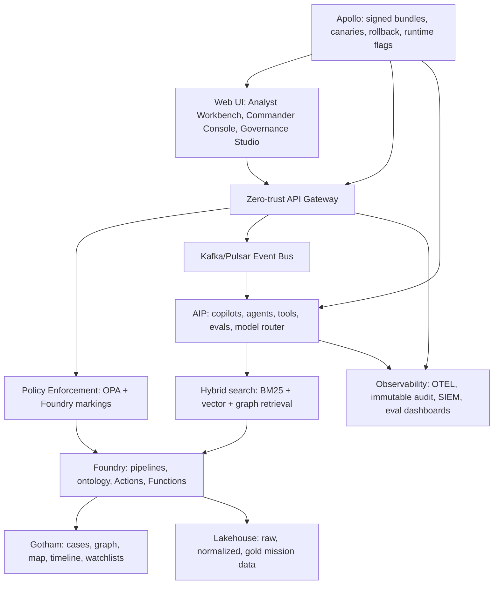
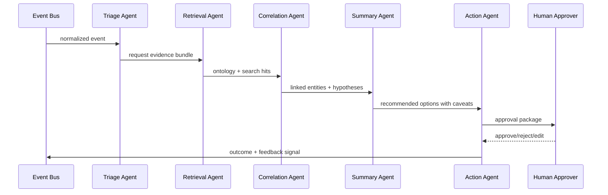

# ClearGlassInc Artemis — Production Self-Evolving AI Intelligence Platform Blueprint

## System Architecture

ClearGlassInc Artemis is a secure, coalition-aware intelligence platform using **Gotham** for investigations and entity tracking, **Foundry** for data integration and ontology-backed application logic, **AIP** for copilots/agents/evaluations, and **Apollo** for signed deployment, runtime control, rollback, and enclave promotion.



### Layer contract

| Layer | Production role | Guardrail |
| --- | --- | --- |
| Frontend | Mission workbench, investigation graph, alert queue, approval cockpit, eval dashboards | Displays confidence, lineage, caveats, and approval status on every AI claim |
| Backend | Case, alert, feedback, action-package, workflow, and model-routing services | All writes pass policy checks and immutable audit logging |
| Data layer | Streaming ingest, historical backfill, bronze/silver/gold data products | Schema contracts, lineage, replayable transformations, quarantine on drift |
| Ontology layer | Objects, links, actions, permissions, temporal state, mission context | Entity-level markings and relationship-level confidence |
| AI orchestration | AIP copilots, multi-agent workflows, tool calls, eval harnesses | No operationally significant action without human approval |
| Policy layer | Need-to-know ABAC/RBAC, coalition boundaries, export controls | Deny-by-default, policy-as-code, testable decision logs |
| Observability | Metrics, traces, prompt/model telemetry, trust analytics | Tamper-evident event store and SIEM forwarding |
| Deployment | Apollo canaries, signed artifacts, rollback, kill switches | Progressive release by enclave, tenant, mission, and model family |

## Data and Ontology

The ontology is the contract between human workflows and AI behavior. Every agent tool accepts ontology identifiers, not ambiguous free text, and every response cites object ids, relationship ids, confidence, lineage, and temporal validity.

### Core object types

```yaml
ontology:
  objects:
    Person:
      keys: [person_id]
      properties: [name, aliases, affiliation, risk_score, markings, valid_time]
    Organization:
      keys: [org_id]
      properties: [name, sector, jurisdiction, coalition_access, markings]
    Asset:
      keys: [asset_id]
      properties: [asset_type, owner_org_id, location, criticality, operational_status]
    SensorEvent:
      keys: [event_id]
      properties: [source, event_time, ingest_time, payload_hash, confidence, markings]
    Alert:
      keys: [alert_id]
      properties: [severity, hypothesis, confidence, status, mission_id, assigned_to]
    Case:
      keys: [case_id]
      properties: [title, mission_id, state, priority, lead_operator, closure_reason]
    IntelProduct:
      keys: [product_id]
      properties: [summary, evidence_refs, caveats, dissemination_controls]
    FeedbackSignal:
      keys: [feedback_id]
      properties: [operator_id, target_id, label, correction, rationale, outcome]
  links:
    OBSERVED_AT: [SensorEvent, Location]
    MENTIONS: [SensorEvent, Person]
    ATTRIBUTED_TO: [Alert, Organization]
    SUPPORTS: [SensorEvent, Alert]
    CONTRADICTS: [SensorEvent, Alert]
    ESCALATED_TO: [Alert, Case]
    PRODUCED: [Case, IntelProduct]
```

### Temporal and confidence model

```sql
CREATE TABLE ontology_edge_state (
  edge_id UUID PRIMARY KEY,
  src_object_id TEXT NOT NULL,
  dst_object_id TEXT NOT NULL,
  relationship_type TEXT NOT NULL,
  confidence NUMERIC(5,4) NOT NULL CHECK (confidence BETWEEN 0 AND 1),
  valid_from TIMESTAMPTZ NOT NULL,
  valid_to TIMESTAMPTZ,
  observed_at TIMESTAMPTZ NOT NULL,
  lineage JSONB NOT NULL,
  markings TEXT[] NOT NULL,
  created_by TEXT NOT NULL,
  created_at TIMESTAMPTZ NOT NULL DEFAULT now()
);
```

## AI and Agent Design

AIP hosts narrowly scoped, tool-using agents. Agents can reason, retrieve, summarize, and propose actions, but they cannot silently execute mission-impacting actions.

### Copilots

- **Analyst Copilot**: asks ontology-grounded questions, explains graph paths, drafts reports, highlights uncertainty.
- **Commander Copilot**: summarizes mission posture, recommends decision options, tracks risk and readiness.
- **Governance Copilot**: reviews proposed prompt/workflow/model changes, compares eval outcomes, prepares approval packets.

### Multi-agent workflow



## Self-Improvement Loop

ClearGlassInc Artemis gets better by converting operator behavior and mission outcomes into governed evals and proposed changes. It does **not** autonomously change goals, authorities, dissemination controls, or operational policy.

1. Capture feedback: thumbs, corrections, report edits, query reformulations, alert dispositions, case outcomes, latency, and trust scores.
2. Normalize into `FeedbackSignal` ontology objects linked to prompts, model versions, tools, alerts, cases, and products.
3. Generate eval cases from high-signal examples, including adversarial and coalition-boundary tests.
4. Propose prompt, workflow, retrieval, heuristic, or routing updates in a change request.
5. Run offline evals, replay tests, security tests, and shadow-mode canaries.
6. Require human approval from mission owner, model governance owner, and policy owner for sensitive changes.
7. Deploy through Apollo ring promotion with live metrics and automatic rollback.
8. Preserve immutable audit trails for every input, output, approval, and version.

### Change lifecycle

```yaml
self_upgrade_lifecycle:
  proposed: generated by evaluation service from measured failure or opportunity
  reviewed: human reviewer inspects diff, eval deltas, safety cases, and rollback plan
  approved: signed approval from mission, governance, and policy authorities
  shadow: runs without operator-visible effect against live traffic copy
  canary: limited release to low-risk users or enclave
  promoted: Apollo ring expansion after SLO and eval gates pass
  rolled_back: automatic or manual rollback if precision, latency, trust, or policy metrics regress
```

## Full-Stack Implementation

```text
apps/artemis-web/             Next.js mission UI
services/api-gateway/         FastAPI gateway and policy enforcement
services/agent-runtime/       AIP-compatible agent orchestration adapters
services/feedback-evals/      Feedback normalization and eval generation
services/workflow-engine/     Temporal/Durable workflow state machines
services/search-retrieval/    Hybrid retrieval over ontology, graph, and vector indexes
infra/policy/                 Rego policies and policy tests
infra/apollo/                 Deployment rings, flags, rollback plans
```

## Security and Governance

- Need-to-know access is enforced with user attributes, mission membership, coalition caveats, object markings, and tool scopes.
- Row-, column-, entity-, edge-, and action-level permissions are evaluated before retrieval, summarization, or writeback.
- Zero-trust execution requires signed service identity, mTLS, short-lived tokens, egress policies, and workload attestation.
- Immutable audit logs store prompt ids, model ids, policy decisions, object ids, evidence ids, approvals, and response hashes.
- Prompt governance treats prompts as versioned code with owners, tests, rollback plans, and Apollo release status.

## Code Examples

### Python policy gate

```python
from dataclasses import dataclass
from typing import Iterable

@dataclass(frozen=True)
class Principal:
    user_id: str
    clearances: set[str]
    coalitions: set[str]
    missions: set[str]

@dataclass(frozen=True)
class OntologyObject:
    object_id: str
    markings: set[str]
    mission_id: str
    coalition: str


def can_read(principal: Principal, obj: OntologyObject) -> bool:
    return (
        obj.markings.issubset(principal.clearances)
        and obj.coalition in principal.coalitions
        and obj.mission_id in principal.missions
    )


def filter_authorized(principal: Principal, objects: Iterable[OntologyObject]) -> list[OntologyObject]:
    return [obj for obj in objects if can_read(principal, obj)]
```

### Python event handler

```python
import json
from pydantic import BaseModel, Field

class NormalizedEvent(BaseModel):
    event_id: str
    source: str
    mission_id: str
    event_time: str
    confidence: float = Field(ge=0.0, le=1.0)
    text: str
    markings: list[str]

async def handle_normalized_event(raw: bytes, ontology, aip_runtime, audit):
    event = NormalizedEvent.model_validate(json.loads(raw))
    event_obj = await ontology.upsert_object("SensorEvent", event.model_dump())
    await audit.write("event_ingested", object_id=event.event_id, mission_id=event.mission_id)

    triage = await aip_runtime.run_agent(
        agent="triage_agent_v3",
        input={"event_object_id": event_obj.id, "mission_id": event.mission_id},
        required_tools=["ontology_read", "hybrid_search", "create_alert_draft"],
    )
    await audit.write("triage_completed", object_id=event.event_id, result_hash=triage.hash)
    return triage
```

### Python workflow state machine

```python
from enum import StrEnum
from pydantic import BaseModel

class ActionState(StrEnum):
    DRAFT = "draft"
    POLICY_REVIEW = "policy_review"
    HUMAN_APPROVAL = "human_approval"
    APPROVED = "approved"
    EXECUTED = "executed"
    REJECTED = "rejected"
    ROLLED_BACK = "rolled_back"

class ActionPackage(BaseModel):
    package_id: str
    alert_id: str
    proposed_by_agent: str
    action_type: str
    evidence_refs: list[str]
    risk: str
    state: ActionState = ActionState.DRAFT

async def advance_action(pkg: ActionPackage, decision: str, policy, audit):
    if pkg.state == ActionState.DRAFT:
        await policy.assert_allowed("submit_action_package", pkg.model_dump())
        pkg.state = ActionState.POLICY_REVIEW
    elif pkg.state == ActionState.POLICY_REVIEW and decision == "policy_pass":
        pkg.state = ActionState.HUMAN_APPROVAL
    elif pkg.state == ActionState.HUMAN_APPROVAL and decision == "approve":
        pkg.state = ActionState.APPROVED
    elif decision == "reject":
        pkg.state = ActionState.REJECTED
    else:
        raise ValueError(f"Invalid transition from {pkg.state} using {decision}")
    await audit.write("action_state_changed", package_id=pkg.package_id, state=pkg.state)
    return pkg
```

### TypeScript AI tool contract

```ts
export type ToolResult<T> = {
  ok: boolean;
  data?: T;
  deniedReason?: string;
  evidenceRefs: string[];
  policyDecisionId: string;
};

export async function queryOntology<T>(args: {
  principalToken: string;
  objectType: string;
  where: Record<string, unknown>;
  includeLineage: boolean;
}): Promise<ToolResult<T[]>> {
  const res = await fetch('/api/tools/ontology-query', {
    method: 'POST',
    headers: { Authorization: `Bearer ${args.principalToken}`, 'content-type': 'application/json' },
    body: JSON.stringify(args),
  });
  return res.json();
}
```

### SQL eval corpus generation

```sql
INSERT INTO eval_cases (case_id, source_feedback_id, prompt_id, input_payload, expected_behavior, markings)
SELECT gen_random_uuid(), feedback_id, target_prompt_id,
       jsonb_build_object('alert_id', target_id, 'correction', correction),
       jsonb_build_object('must_include', correction, 'must_cite_lineage', true),
       markings
FROM feedback_signals
WHERE label IN ('incorrect_summary', 'missed_entity', 'bad_recommendation')
  AND reviewer_verified = true
  AND created_at > now() - interval '30 days';
```

## Scenario Walkthrough

A live environmental-cyber signal enters the streaming bus indicating anomalous GNSS degradation near a protected logistics corridor. Foundry normalizes the feed into a `SensorEvent`, links it to known `Asset` and `Location` objects, and exposes the object through the ontology. Gotham shows the correlated graph and timeline in the analyst workbench.

The AIP triage agent reads the event, retrieves authorized historical incidents, and asks the correlation agent to compare telemetry, OSINT, and prior case patterns. The summary agent drafts an alert with confidence, caveats, lineage, and dissenting evidence. The action agent prepares an action package recommending increased monitoring and a commander briefing, but it cannot execute the package.

An operator edits the summary, rejects one weak attribution, approves the monitoring recommendation, and closes the alert two hours later as confirmed interference. Those edits and outcomes become `FeedbackSignal` objects. The eval service turns the corrected attribution into a new eval case, discovers that prompt `triage_agent_v3.system` overweights one source, and proposes a prompt change plus a retrieval weighting update.

Governance reviewers inspect the diff, eval deltas, coalition-boundary tests, and rollback plan. Apollo deploys the approved change to shadow mode, then a canary ring. If precision, recall, latency, trust, or policy-denial metrics regress, Apollo rolls back automatically and the audit ledger preserves the full decision trail.
