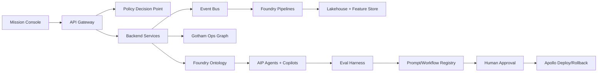

# ClearGlassInc Artemis Self-Evolving Intelligence Platform

## System Architecture

ClearGlassInc Artemis is a secure, coalition-aware intelligence platform that uses Palantir Gotham for operational intelligence and entity tracking, Foundry for data integration and ontology-backed workflows, AIP for copilots, agents, evaluations, and human-gated automation, and Apollo for controlled deployment, rollback, and runtime governance.

### Layers

1. **Frontend:** React/Next.js mission console, investigation graph, alert queue, eval dashboard, approval inbox, and Apollo release status.
2. **API gateway:** OIDC/JWT validation, tenant routing, request signing, throttling, policy pre-checks, and immutable request journaling.
3. **Backend services:** Case service, entity service, alert triage service, feedback service, model router, prompt registry, workflow registry, and audit service.
4. **Data layer:** Live streams, historical lakehouse tables, vector indexes, graph indexes, feature store, and mission outcome stores.
5. **Ontology layer:** Foundry ontology objects, links, actions, computed properties, temporal states, lineage, confidence, and markings.
6. **AI orchestration:** AIP logic, tool-using agents, eval harnesses, retrieval pipelines, model routing, and prompt/workflow optimization proposals.
7. **Policy layer:** Need-to-know access, row/column/entity permissions, ABAC/ReBAC, coalition caveats, action approval gates, and policy-as-code.
8. **Observability:** Metrics, traces, red-team events, eval runs, data quality monitors, drift monitors, audit chains, and operator trust telemetry.
9. **Deployment:** Apollo promotes signed releases through dev, staging, enclave, and mission production with canary, rollback, and runtime kill switches.



## Data and Ontology

The ontology is the contract between humans, data, applications, and agents. It makes AI behavior deterministic enough for mission workflows because every tool call binds to typed objects, authorized actions, and lineage-aware facts.

### Core objects

| Object | Key fields | Purpose |
| --- | --- | --- |
| `Entity` | `entity_id`, `kind`, `canonical_name`, `confidence`, `markings` | Person, organization, device, vehicle, account, location, or infrastructure node. |
| `Observation` | `source_id`, `observed_at`, `payload_hash`, `lineage`, `confidence` | Raw or normalized fact from live/historical feeds. |
| `Relationship` | `source_entity`, `target_entity`, `predicate`, `valid_time`, `confidence` | Temporal graph edge with provenance. |
| `Alert` | `severity`, `hypothesis`, `evidence_refs`, `triage_state` | Analyst-facing signal requiring review. |
| `Case` | `mission_id`, `owner`, `status`, `linked_entities`, `approval_state` | Investigation workspace and audit boundary. |
| `IntelProduct` | `summary`, `claims`, `citations`, `release_markings` | Generated or analyst-authored report. |
| `FeedbackEvent` | `operator_id`, `artifact_id`, `rating`, `correction`, `outcome` | Training/eval signal for safe improvement. |
| `WorkflowVersion` | `version`, `graph_hash`, `eval_score`, `approval_ticket` | Deployable agent/workflow definition. |

### Relationship examples

```sql
CREATE TABLE ontology_relationships (
  relationship_id TEXT PRIMARY KEY,
  source_entity_id TEXT NOT NULL,
  target_entity_id TEXT NOT NULL,
  predicate TEXT NOT NULL,
  confidence NUMERIC NOT NULL CHECK (confidence BETWEEN 0 AND 1),
  valid_from TIMESTAMPTZ NOT NULL,
  valid_to TIMESTAMPTZ,
  source_observation_ids TEXT[] NOT NULL,
  markings JSONB NOT NULL,
  lineage JSONB NOT NULL
);
```

## AI and Agent Design

### Copilots

- **Analyst Copilot:** searches ontology, explains evidence, drafts intel products, requests enrichments, and records uncertainty.
- **Commander Copilot:** summarizes mission posture, compares courses of action, displays confidence and policy constraints.
- **Data Steward Copilot:** surfaces quality issues, schema drift, lineage gaps, and ontology mapping proposals.
- **Release Commander Copilot:** explains Apollo rollouts, failed canaries, rollback options, and eval deltas.

### Multi-agent workflows

1. **Triage agent** normalizes an event, maps it to ontology entities, and assigns preliminary severity.
2. **Enrichment agent** invokes approved tools for internal records, OSINT connectors, geospatial context, and historical cases.
3. **Correlation agent** builds graph paths and competing hypotheses.
4. **Summarization agent** produces a cited, caveated briefing.
5. **Recommendation agent** proposes actions but cannot execute operationally significant actions without explicit approval.
6. **Eval agent** converts operator outcomes into eval cases and regression tests.

## Self-Improvement Loop

ClearGlassInc Artemis improves prompts, workflows, heuristics, and model routing only through approved changes. The system never changes mission goals or bypasses policy.

1. **Capture:** feedback buttons, corrections, accepted/rejected recommendations, latency, search abandonment, false positive labels, and mission outcome tags.
2. **Transform:** normalize signals into `FeedbackEvent`, derive eval cases, cluster failure modes, and attach lineage to the artifact version that produced the result.
3. **Propose:** AIP generates candidate prompt diffs, workflow graph diffs, retrieval parameter changes, or model routing rules.
4. **Evaluate:** offline evals measure precision, recall, calibration, hallucination rate, citation coverage, policy violations, latency, and cost.
5. **Approve:** human reviewers inspect diffs, risk tier, eval deltas, and rollback plans.
6. **Deploy:** Apollo canary deploys the signed version with a runtime kill switch.
7. **Monitor:** live metrics compare champion/challenger versions; drift or policy failures trigger rollback.

## Full-Stack Implementation

- **Web UI:** mission timeline, graph canvas, evidence drawer, approval queue, eval leaderboard, model route explorer.
- **Gateway:** FastAPI or Envoy front door with signed context propagation.
- **Services:** Python FastAPI microservices with typed Pydantic contracts and idempotent event handlers.
- **Event bus:** Kafka/Pulsar topics for observations, alerts, feedback, eval runs, and deployment events.
- **Lakehouse:** Foundry datasets for bronze/silver/gold records and mission outcomes.
- **Search:** hybrid BM25/vector retrieval with ontology-filtered access controls.
- **Inference:** model router chooses low-latency, high-reasoning, or enclave-local models based on data markings and task risk.
- **Monitoring:** OpenTelemetry traces, Prometheus metrics, audit appenders, and eval dashboards.

## Security and Governance

- Need-to-know ABAC with mission, role, citizenship/coalition, compartment, data source, and purpose constraints.
- Row, column, and entity-level filters are applied before retrieval and rechecked at tool execution.
- Coalition release markings are carried on every object, prompt, response, citation, and generated product.
- Zero-trust execution isolates tools, signs requests, validates outputs, and logs immutable decision records.
- Model and prompt governance require owners, risk tiers, eval gates, approval tickets, and Apollo rollback plans.

## Scenario Walkthrough

A live event enters from a trusted stream indicating suspicious infrastructure behavior. Foundry pipelines normalize it into an `Observation`, map it to known infrastructure `Entity` objects, and emit an `Alert`. Gotham displays the entity graph and prior case links. The triage agent assigns medium severity with cited evidence. The enrichment agent finds two similar historical patterns, while the policy engine blocks coalition-ineligible sources. The recommendation agent drafts an action package: open a case, request additional collection, and notify an operator.

The operator approves opening the case but rejects the initial severity as too high after reviewing a benign maintenance window. Artemis stores the correction as `FeedbackEvent`, converts it into an eval case, and detects a workflow weakness: maintenance-window retrieval was weighted too low. AIP proposes a retrieval policy change and a prompt diff requiring agents to check maintenance context before severity escalation. Offline evals show fewer false positives with no recall loss. A human reviewer approves, Apollo canaries the workflow, live drift monitors pass, and the new version becomes champion. If false negatives rise, Apollo rolls back instantly.
