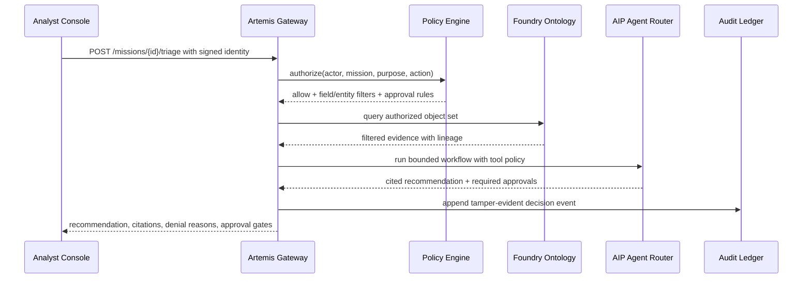

# ClearGlassInc Artemis 2050 Command Grid — Production AI Intelligence Platform Blueprint

## System Architecture

ClearGlassInc Artemis is designed as a secure, coalition-aware, audited, latency-sensitive intelligence platform spanning Palantir Gotham, Foundry, AIP, and Apollo.

- **Gotham** provides operational intelligence workspaces, investigations, entity tracking, case context, and mission command views.
- **Foundry** provides governed ingestion, transforms, datasets, ontology objects, operational applications, and lineage-backed application logic.
- **AIP** provides copilots, bounded tool-using agents, workflow automation, model routing, prompt governance, and evaluation harnesses.
- **Apollo** provides controlled deployment, health checks, runtime policy, progressive rollout, rollback, and environment synchronization.

```text
Live Sources + Historical Archives
  -> Foundry Ingest + Streaming Event Bus
  -> Data Quality + Normalization Pipelines
  -> Foundry Ontology + Gotham Entity Graph
  -> Policy Decision Point + Need-to-Know Filter
  -> AIP Agent Router + Tool Execution Layer
  -> Analyst / Commander / Governance Consoles
  -> Feedback + Outcome + Eval Capture
  -> Human-Approved Improvement Registry
  -> Apollo Canary, Promotion, Rollback
```

### Full-stack layers

| Layer | Production responsibility | Implementation pattern |
| --- | --- | --- |
| Frontend | Analyst queues, commander briefs, case graph, approval gates, eval dashboards | React/TypeScript Foundry app surfaces plus Gotham embedded investigation views |
| API gateway | Identity propagation, request validation, mission scoping, rate limits, policy hooks | FastAPI gateway with signed mission context and structured audit events |
| Backend services | Case lifecycle, signal triage, feedback capture, intel product generation, approvals | Python services with explicit state machines and idempotent command handlers |
| Data layer | Batch + stream ingestion, lakehouse retention, quality checks, replay | Foundry datasets, transforms, object sets, and event topics |
| Ontology layer | Entities, relationships, temporal state, permissions, lineage, confidence | Foundry Ontology mapped into Gotham mission graph views |
| AI orchestration | Copilots, agent workflows, model routing, prompt registry, evals | AIP Logic/Agents with bounded tool contracts and approval-aware mutation tools |
| Policy layer | Need-to-know, coalition compartments, purpose binding, approval requirements | Policy-as-code PDP/PEP enforced before every read, write, and tool call |
| Observability | Logs, traces, metrics, eval scores, drift, data quality, audit chain | OpenTelemetry-style traces, immutable audit ledger, Foundry/Apollo dashboards |
| Deployment | Deterministic releases, canaries, rollback, runtime control | Apollo channels per environment, compartment, and coalition boundary |

### Request path



## Data and Ontology

The ontology is the authoritative contract used by humans, services, and agents. It controls which objects exist, how evidence is related, which state transitions are legal, and which policy markings travel with each object.

### Core entities

| Entity | Key fields | AI behavior impact |
| --- | --- | --- |
| `Mission` | `mission_id`, `objective`, `jurisdiction`, `coalition`, `status`, `commander_id`, `policy_bundle` | Scopes all retrieval, summaries, recommendations, and approval gates |
| `Signal` | `signal_id`, `source_id`, `observed_at`, `payload_hash`, `confidence`, `classification`, `lineage` | Input for triage, enrichment, alerting, and replayable eval cases |
| `Actor` | `actor_id`, `role`, `clearances`, `compartments`, `coalition_memberships`, `purpose_grants` | Drives row/column/entity-level authorization |
| `TrackedEntity` | `entity_id`, `entity_type`, `aliases`, `markings`, `confidence`, `first_seen`, `last_seen` | Object for link analysis and Gotham entity views |
| `Relationship` | `source_entity`, `target_entity`, `predicate`, `valid_from`, `valid_to`, `evidence`, `confidence` | Temporal graph edge for correlation and explanations |
| `Case` | `case_id`, `mission_id`, `priority`, `state`, `owner`, `linked_entities`, `approval_state` | Human workflow container and agent memory boundary |
| `IntelProduct` | `product_id`, `case_id`, `claims`, `citations`, `classification`, `approvals`, `version` | Generated output must cite ontology evidence and policy decisions |
| `OperatorFeedback` | `feedback_id`, `artifact_id`, `rating`, `correction`, `outcome`, `operator_id` | Becomes eval labels and candidate improvement evidence |
| `ImprovementProposal` | `proposal_id`, `target_type`, `diff`, `eval_bundle`, `risk`, `approval_state`, `rollback_ref` | Only mechanism for self-upgrades; always human-approved |

### Relationship and temporal schema

```sql
CREATE TABLE artemis_relationships (
    relationship_id TEXT PRIMARY KEY,
    mission_id TEXT NOT NULL,
    source_entity_id TEXT NOT NULL,
    target_entity_id TEXT NOT NULL,
    predicate TEXT NOT NULL,
    valid_from TIMESTAMPTZ NOT NULL,
    valid_to TIMESTAMPTZ,
    confidence NUMERIC(4,3) NOT NULL CHECK (confidence >= 0 AND confidence <= 1),
    evidence_signal_ids TEXT[] NOT NULL,
    classification TEXT NOT NULL,
    compartments TEXT[] NOT NULL DEFAULT '{}',
    coalition_visibility TEXT[] NOT NULL DEFAULT '{}',
    lineage_hash TEXT NOT NULL,
    policy_bundle_hash TEXT NOT NULL,
    created_at TIMESTAMPTZ NOT NULL DEFAULT now(),
    created_by TEXT NOT NULL
);

CREATE INDEX artemis_relationships_temporal_idx
    ON artemis_relationships (mission_id, source_entity_id, valid_from DESC);
```

### Permission propagation

```python
from dataclasses import dataclass
from enum import Enum

class Decision(str, Enum):
    ALLOW = "allow"
    DENY = "deny"
    REQUIRE_APPROVAL = "require_approval"

@dataclass(frozen=True)
class PolicyContext:
    actor_id: str
    action: str
    mission_id: str
    purpose: str
    clearances: frozenset[str]
    compartments: frozenset[str]
    coalition: frozenset[str]

@dataclass(frozen=True)
class ObjectMarkings:
    classification: str
    compartments: frozenset[str]
    coalition_visibility: frozenset[str]
    mission_id: str

RANK = {"UNCLASSIFIED": 0, "CONTROLLED": 1, "SECRET": 2, "TOP_SECRET": 3}


def authorize(ctx: PolicyContext, obj: ObjectMarkings) -> Decision:
    if ctx.mission_id != obj.mission_id:
        return Decision.DENY
    if RANK.get(obj.classification, 999) > max(RANK.get(c, -1) for c in ctx.clearances):
        return Decision.DENY
    if not obj.compartments.issubset(ctx.compartments):
        return Decision.DENY
    if obj.coalition_visibility and not (obj.coalition_visibility & ctx.coalition):
        return Decision.DENY
    if ctx.action in {"send_external", "task_asset", "change_policy", "deploy_model"}:
        return Decision.REQUIRE_APPROVAL
    return Decision.ALLOW
```

## AI and Agent Design

Artemis uses bounded agents that recommend, draft, correlate, and prepare packages. Agents do not autonomously expand their goals, bypass policy, change access rights, or execute operationally significant actions.

### Copilots

- **Analyst Copilot**: retrieves authorized evidence, summarizes entity context, drafts hypotheses, creates cited case notes, and highlights uncertainty.
- **Commander Copilot**: ranks mission risks, prepares options, estimates impact, and assembles approval-ready action packages.
- **Data Steward Copilot**: detects schema drift, proposes ontology mappings, and flags quality regressions.
- **Governance Copilot**: explains denials, audits prompts, checks model routing, and reviews proposed self-upgrades.

### Multi-agent workflow state machine

```python
from enum import StrEnum
from pydantic import BaseModel, Field

class WorkflowState(StrEnum):
    RECEIVED = "received"
    TRIAGED = "triaged"
    ENRICHED = "enriched"
    CORRELATED = "correlated"
    SUMMARIZED = "summarized"
    RECOMMENDED = "recommended"
    WAITING_APPROVAL = "waiting_approval"
    CLOSED = "closed"

class WorkflowEvent(BaseModel):
    state: WorkflowState
    mission_id: str
    case_id: str | None = None
    signal_ids: list[str] = Field(default_factory=list)
    approval_token: str | None = None
    trace_id: str

TRANSITIONS = {
    WorkflowState.RECEIVED: WorkflowState.TRIAGED,
    WorkflowState.TRIAGED: WorkflowState.ENRICHED,
    WorkflowState.ENRICHED: WorkflowState.CORRELATED,
    WorkflowState.CORRELATED: WorkflowState.SUMMARIZED,
    WorkflowState.SUMMARIZED: WorkflowState.RECOMMENDED,
    WorkflowState.RECOMMENDED: WorkflowState.WAITING_APPROVAL,
    WorkflowState.WAITING_APPROVAL: WorkflowState.CLOSED,
}


def advance(event: WorkflowEvent, requested: WorkflowState) -> WorkflowEvent:
    expected = TRANSITIONS[event.state]
    if requested != expected:
        raise ValueError(f"illegal transition {event.state}->{requested}; expected {expected}")
    if event.state == WorkflowState.WAITING_APPROVAL and not event.approval_token:
        raise PermissionError("approval token required to close operational workflow")
    return event.model_copy(update={"state": requested})
```

### Tool contract

```python
from typing import Literal
from pydantic import BaseModel, Field

class ToolRequest(BaseModel):
    tool_name: Literal["ontology.search", "case.open", "intel_product.draft", "approval.request"]
    mission_id: str
    actor_id: str
    purpose: str
    payload: dict
    trace_id: str
    max_rows: int = Field(default=50, le=500)
    timeout_ms: int = Field(default=3000, le=15000)

class ToolResult(BaseModel):
    allowed: bool
    approval_required: bool = False
    result: dict | None = None
    citations: list[str] = Field(default_factory=list)
    denial_reasons: list[str] = Field(default_factory=list)
    audit_event_id: str
```

## Self-Improvement Loop

Artemis gets better through a controlled loop that converts operational evidence into candidate improvements. The system may propose prompt, workflow, heuristic, and routing changes, but only a human-approved proposal can be deployed.

```text
feedback + corrections + query logs + alert outcomes + mission results
  -> feature extraction
  -> eval case generation
  -> candidate diff generation
  -> offline eval and safety regression checks
  -> human review and signed approval
  -> Apollo canary deployment
  -> runtime telemetry comparison
  -> promote, hold, or rollback
```

### Improvement proposal lifecycle

```python
class ImprovementProposal(BaseModel):
    proposal_id: str
    target_type: Literal["prompt", "workflow", "heuristic", "model_route"]
    target_name: str
    current_version: str
    proposed_version: str
    diff: str
    eval_dataset_ref: str
    precision_delta: float
    recall_delta: float
    p95_latency_delta_ms: int
    safety_regressions: int
    rollback_ref: str
    approval_state: Literal["draft", "under_review", "approved", "rejected", "deployed", "rolled_back"]


def promotion_gate(p: ImprovementProposal) -> bool:
    return (
        p.precision_delta >= -0.01
        and p.recall_delta >= 0.0
        and p.p95_latency_delta_ms <= 150
        and p.safety_regressions == 0
        and p.approval_state == "approved"
        and bool(p.rollback_ref)
    )
```

### Evaluation harness

```python
import statistics
from collections.abc import Callable

EvalFn = Callable[[dict], dict]


def score_eval_cases(cases: list[dict], candidate: EvalFn) -> dict:
    tp = fp = fn = 0
    latencies = []
    safety_failures = 0
    for case in cases:
        result = candidate(case["input"])
        latencies.append(result["latency_ms"])
        predicted = set(result["labels"])
        expected = set(case["expected_labels"])
        tp += len(predicted & expected)
        fp += len(predicted - expected)
        fn += len(expected - predicted)
        safety_failures += int(bool(result.get("policy_violation")))
    precision = tp / max(tp + fp, 1)
    recall = tp / max(tp + fn, 1)
    return {
        "precision": precision,
        "recall": recall,
        "p95_latency_ms": statistics.quantiles(latencies, n=20)[18] if len(latencies) >= 20 else max(latencies, default=0),
        "safety_failures": safety_failures,
    }
```

## Full-Stack Implementation

### Repository/service layout

```text
apps/
  mission-console/          # TypeScript UI for analysts and commanders
  governance-console/       # Prompt/eval/policy review UI
services/
  artemis_gateway/          # FastAPI request gateway
  triage_service/           # Event classification and routing
  case_service/             # Case lifecycle and approvals
  feedback_service/         # Operator feedback ingestion
  agent_router/             # AIP tool/model routing facade
  eval_runner/              # Self-improvement evaluation harness
ontology/
  schemas/                  # JSON Schema / SQL contracts
  transforms/               # Foundry transform logic
policies/
  artemis.rego              # Policy-as-code bundle
ops/
  apollo/                   # Release channels, rollback policies, health checks
```

### FastAPI gateway skeleton

```python
from fastapi import Depends, FastAPI, HTTPException
from pydantic import BaseModel, Field

app = FastAPI(title="ClearGlassInc Artemis Gateway")

class MissionContextIn(BaseModel):
    mission_id: str
    actor_id: str
    purpose: str
    trace_id: str

class SignalIn(BaseModel):
    source_id: str
    observed_at: str
    payload_hash: str
    classification: str
    payload: dict
    mission_context: MissionContextIn

class RecommendationOut(BaseModel):
    case_id: str
    summary: str
    confidence: float = Field(ge=0, le=1)
    citations: list[str]
    recommended_actions: list[dict]
    approval_required: bool
    policy_decision_id: str

async def authenticated_context() -> MissionContextIn:
    # Production implementation verifies signed identity, session, and mission binding.
    return MissionContextIn(mission_id="MISSION-1", actor_id="operator-1", purpose="triage", trace_id="trace-1")

@app.post("/signals/triage", response_model=RecommendationOut)
async def triage_signal(signal: SignalIn, ctx: MissionContextIn = Depends(authenticated_context)):
    if signal.mission_context.mission_id != ctx.mission_id:
        raise HTTPException(status_code=403, detail="mission context mismatch")
    # Policy check -> Foundry object-set query -> AIP workflow -> audit append.
    return RecommendationOut(
        case_id="CASE-DRAFT",
        summary="Signal accepted for governed triage; recommendation awaits evidence lookup.",
        confidence=0.72,
        citations=[signal.payload_hash],
        recommended_actions=[{"type": "open_case", "requires_approval": False}],
        approval_required=False,
        policy_decision_id="pdp-001",
    )
```

### Frontend approval component

```tsx
import { useState } from "react";

type Recommendation = {
  caseId: string;
  summary: string;
  citations: string[];
  approvalRequired: boolean;
};

export function ApprovalCard({ rec }: { rec: Recommendation }) {
  const [busy, setBusy] = useState(false);

  async function approve() {
    setBusy(true);
    await fetch(`/api/cases/${rec.caseId}/approval`, {
      method: "POST",
      headers: { "content-type": "application/json" },
      body: JSON.stringify({ decision: "approve", citations: rec.citations }),
    });
    setBusy(false);
  }

  return (
    <section aria-label="AI recommendation approval">
      <h2>Recommendation</h2>
      <p>{rec.summary}</p>
      <ul>{rec.citations.map((c) => <li key={c}>{c}</li>)}</ul>
      {rec.approvalRequired && <button disabled={busy} onClick={approve}>Approve bounded action</button>}
    </section>
  );
}
```

### Event handler

```python
async def handle_signal_received(event: dict, ontology, agent_router, audit):
    ctx = event["mission_context"]
    policy = await ontology.policy_for(ctx)
    authorized_context = await ontology.search(
        mission_id=ctx["mission_id"],
        query=event["payload"],
        filters=policy.entity_filters,
        max_rows=100,
    )
    recommendation = await agent_router.run_workflow(
        workflow="triage_enrichment_correlation",
        inputs={"signal": event, "context": authorized_context},
        step_limit=8,
        timeout_seconds=20,
    )
    await audit.append({
        "type": "agent.recommendation.created",
        "trace_id": ctx["trace_id"],
        "mission_id": ctx["mission_id"],
        "citations": recommendation["citations"],
        "approval_required": recommendation["approval_required"],
    })
    return recommendation
```

## Security and Governance

Artemis security is fail-closed and evidence-based.

- **Need-to-know access**: every object carries mission, classification, compartments, coalition visibility, and purpose constraints.
- **Row/column/entity-level enforcement**: Foundry and service-side policy filters are generated by the policy engine; UI filters are not trusted.
- **Compartmentalization**: coalition members receive only explicitly visible objects and redacted fields.
- **Zero-trust execution**: every service call carries signed identity, trace ID, purpose, policy hash, and expiry.
- **Immutable logs**: every policy decision, tool call, approval, denial, model route, and generated artifact is appended to a tamper-evident ledger.
- **Model governance**: prompts, model routes, eval bundles, and workflow DAGs are versioned and approval-gated.
- **Prompt governance**: prompt changes require eval evidence, reviewer approval, rollback reference, and Apollo canary health.
- **Operational boundaries**: external notifications, tasking, policy changes, deployment, payment, customer, or production-data mutations require explicit human approval.

## Scenario Walkthrough

1. A live signal arrives from an approved stream and is normalized into a `Signal` with classification, confidence, lineage, mission scope, and payload hash.
2. The policy engine evaluates the operator, mission, purpose, compartments, and coalition visibility before any evidence is retrieved.
3. The triage agent classifies mission relevance and severity, then the enrichment agent retrieves only authorized ontology context.
4. The correlation agent links the signal to existing temporal relationships and active cases, preserving confidence and evidence IDs.
5. The summarization agent drafts a cited brief. Unsupported claims are blocked because the generator receives only evidence-backed context.
6. The recommendation agent prepares response options and marks any operationally significant option as `approval_required=true`.
7. The commander approves one bounded package or rejects it with a reason. The approval decision is written to the immutable ledger.
8. The outcome, rejection reason, corrected labels, latency, citations used, and final mission result become `OperatorFeedback` and eval cases.
9. The self-improvement service proposes a prompt or routing update only if evals show measurable precision/recall or latency gains with zero safety regressions.
10. A human reviewer approves the exact diff. Apollo canaries the new bundle, compares telemetry, and either promotes or rolls back.

## Local Repository Audit Snapshot — 2026-07-12

Current accessible repository: `ClearGlassInc.github.io`.

| Check | Evidence result |
| --- | --- |
| Python test suite | `554 passed, 4 skipped` with `python -m pytest tests/ -q` |
| Workflow doctor | `Workflow doctor clean.` with `python scripts/workflow_doctor.py` |
| Self repo audit | Score `100`, grade `A`, no failing CI or unpinned dependency finding with `python scripts/repo_audit.py --self --out /tmp/repo-audit` |
| Python dependency check | `No broken requirements found.` with `python -m pip check` |

Final local status: `VERIFIED PASS` for the accessible repository checks executed in this session. External organization-wide GitHub Actions execution, private security alerts, deployment-provider status, and non-cloned repositories require repository-owner credentials and were not mutated by this blueprint.
