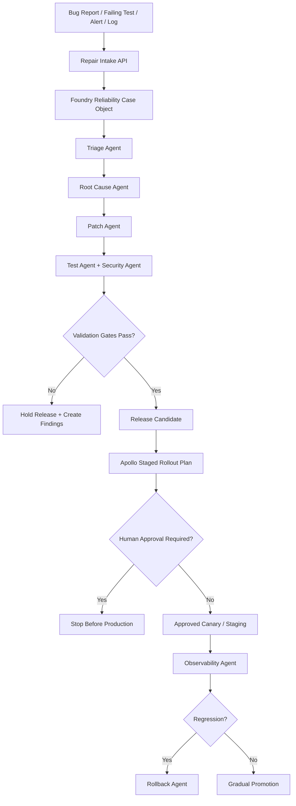

# ClearGlassInc Artemis — Autonomous Software Repair, Verification, and Release System

## Summary

This document extends **ClearGlassInc Artemis** with an autonomous software reliability layer that can triage defects, identify root causes, create minimal patches, verify safety gates, prepare releases, and stop before production deployment unless a human explicitly approves the rollout. It is designed to operate inside the existing Artemis stack: **Gotham** for operational case context, **Foundry** for data and ontology, **AIP** for guarded agentic workflows, and **Apollo** for deployment, rollback, and runtime control.

The system is intentionally conservative: it can propose and prepare changes, but it must not bypass tests, security checks, audit logging, approval policy, or rollback validation.

---

## System Architecture

### Reliability Control Plane



### Runtime Components

- **Repair Intake API** receives stack traces, test failures, production alerts, GitHub issue references, and operator notes.
- **Reliability Ontology** stores defects, evidence, hypotheses, patches, verification results, release candidates, approvals, and rollback plans.
- **AIP Agent Runtime** coordinates specialized agents with scoped tools and explicit approval gates.
- **Foundry Pipelines** aggregate logs, traces, CI output, static analysis findings, dependency advisories, and deployment telemetry.
- **Apollo Release Controller** performs signed artifact promotion, canary rollout, runtime kill switches, and deterministic rollback.
- **Immutable Audit Ledger** records every observation, hypothesis, patch diff, command, test result, approval, and deployment decision.

---

## Data and Ontology

### Core Object Types

| Object | Purpose | Key fields |
| --- | --- | --- |
| `ReliabilityCase` | End-to-end defect or release investigation | `case_id`, `severity`, `blast_radius`, `service`, `status`, `owner`, `confidence` |
| `EvidenceArtifact` | Logs, traces, screenshots, CI output, user report | `artifact_id`, `case_id`, `kind`, `source_uri`, `hash`, `collected_at` |
| `FailureSignature` | Normalized error pattern | `exception_type`, `stack_hash`, `test_name`, `endpoint`, `metric_name` |
| `RootCauseHypothesis` | Candidate cause with supporting evidence | `hypothesis`, `evidence_refs`, `confidence`, `falsification_tests` |
| `PatchProposal` | Minimal candidate change | `repo`, `branch`, `diff_hash`, `files_changed`, `risk_class` |
| `ValidationRun` | Test/lint/security results | `command`, `exit_code`, `duration_ms`, `logs_uri`, `verdict` |
| `ReleaseCandidate` | Versioned deployable package | `artifact_digest`, `sbom_uri`, `apollo_channel`, `rollback_ref` |
| `ApprovalRecord` | Human approval or rejection | `approver`, `decision`, `reason`, `timestamp`, `scope` |
| `RollbackPlan` | Verified recovery path | `command`, `target_version`, `data_migration_safe`, `rto_minutes` |

### Relationships

```text
ReliabilityCase HAS_EVIDENCE EvidenceArtifact
ReliabilityCase HAS_SIGNATURE FailureSignature
ReliabilityCase HAS_HYPOTHESIS RootCauseHypothesis
RootCauseHypothesis SUPPORTED_BY EvidenceArtifact
PatchProposal ADDRESSES RootCauseHypothesis
ValidationRun VALIDATES PatchProposal
ReleaseCandidate BUILT_FROM PatchProposal
ApprovalRecord AUTHORIZES ReleaseCandidate
RollbackPlan PROTECTS ReleaseCandidate
```

### Policy Metadata

Every repair object must carry:

- `classification`: sensitivity marking for code, logs, screenshots, and customer data.
- `mission_context`: product, customer, environment, and operational priority.
- `data_lineage`: source system, ingestion transform, and immutable content hash.
- `permission_scope`: ABAC/ReBAC policy attributes for least-privilege access.
- `retention_class`: evidence retention and deletion policy.

---

## AI and Agent Design

### Agent Responsibilities

| Agent | Allowed actions | Hard stop conditions |
| --- | --- | --- |
| Triage Agent | classify severity, priority, blast radius, affected services | missing evidence for severity escalation |
| Root Cause Agent | inspect code, logs, traces, tests, dependency changes | confidence below threshold or untestable hypothesis |
| Patch Agent | produce smallest reversible diff | behavior change without test coverage |
| Test Agent | run format, lint, static checks, unit, integration, smoke tests | failed validation gates |
| Security Agent | scan secrets, dependency advisories, injection/auth/privacy risk | auth, payments, privacy, data loss, or secrets exposure |
| Release Agent | generate release notes, artifact metadata, staged rollout plan | missing SBOM, missing rollback, failed tests |
| Rollback Agent | verify rollback command, previous artifact, migration reversibility | irreversible migration or unknown restore point |
| Observability Agent | monitor SLOs, logs, traces, evals, error budgets | regression or missing telemetry |

### Approval Gates

Human approval is mandatory when a patch touches:

- authentication or authorization;
- billing, payments, finance, tax, or customer money flows;
- data deletion, migrations, retention, privacy, or regulated data;
- operational recommendations, safety-critical workflows, or cross-coalition release boundaries;
- model routing, prompt policy, or self-improvement guardrails.

---

## Self-Improvement Loop

### Signals Captured

```text
operator_feedback
code_review_comments
failing_tests
incident_timeline
rollback_events
security_findings
post_release_metrics
prompt_eval_scores
agent_tool_errors
release_gate_decisions
```

### Improvement Pipeline

1. **Capture** raw evidence and operator decisions into Foundry datasets.
2. **Normalize** signals into ontology objects with lineage and policy tags.
3. **Generate evals** from real failures, corrected root causes, rejected patches, and successful regressions.
4. **Propose updates** to prompts, workflow state machines, heuristics, model routing, and test selection.
5. **Score proposals** with offline evals, replay tests, static policy checks, and adversarial examples.
6. **Require approval** for any update that changes autonomous behavior, policy thresholds, routing, or production release criteria.
7. **Deploy by Apollo** through dev, staging, canary, and production rings with instant rollback pins.
8. **Monitor drift** in precision, recall, false-positive rate, mean time to repair, rollback frequency, and operator trust.

### Guardrails

- The system may optimize prompts and workflows only inside a human-approved policy envelope.
- It may not redefine business goals, safety policy, approval thresholds, data access rules, or production deployment rights.
- Every self-upgrade is versioned, evaluated, approved, deployed gradually, and reversible.

---

## Full-Stack Implementation

### Service Topology

```text
apps/web-console/          React mission and reliability workbench
services/repair-api/       FastAPI intake, case, patch, validation APIs
services/agent-runtime/    AIP-compatible orchestration and tool registry
services/eval-runner/      Evaluation generation, replay, and scoring
services/policy-gateway/   OPA/Cedar policy decisions and audit explainability
workers/ci-runner/         Sandboxed command execution for tests and scanners
workers/release-planner/   Apollo release candidate and rollback metadata
foundry/pipelines/         Evidence ingestion and ontology transforms
infra/apollo/              Channels, rings, promotion gates, rollback pins
```

### API Contract Sketch

```yaml
POST /v1/repair/cases:
  body:
    service: string
    environment: dev|staging|production
    symptom: string
    artifacts: [uri]
    severity_hint: low|medium|high|critical
  response:
    case_id: string
    status: triage_open

POST /v1/repair/cases/{case_id}/patches:
  body:
    root_cause_id: string
    branch: string
    diff_uri: string
  response:
    patch_id: string
    validation_plan: [command]

POST /v1/release/candidates:
  body:
    patch_id: string
    artifact_digest: string
    sbom_uri: string
    rollback_ref: string
  response:
    release_candidate_id: string
    approval_required: boolean
```

---

## Security and Governance

### Zero-Trust Execution

- Agents receive short-lived credentials scoped to a single case and tool action.
- Sandboxed repair workers cannot access production secrets.
- Logs are redacted before model context construction.
- Every tool call is policy-checked before execution and audit-logged after execution.
- Source code diffs are signed and linked to validation artifacts.

### Policy-as-Code Example

```rego
package artemis.repair

default allow_patch = false

allow_patch {
  input.actor.role == "repair_agent"
  input.case.status == "root_cause_confirmed"
  not touches_sensitive_area
  input.patch.files_changed_count <= 5
  input.patch.has_regression_test == true
}

touches_sensitive_area {
  some file
  file := input.patch.files[_]
  startswith(file, "services/auth/")
}

touches_sensitive_area {
  some file
  file := input.patch.files[_]
  startswith(file, "services/payments/")
}
```

---

## Code Examples

### Python: Repair Case Model

```python
from datetime import datetime
from enum import StrEnum
from pydantic import BaseModel, Field


class Severity(StrEnum):
    LOW = "low"
    MEDIUM = "medium"
    HIGH = "high"
    CRITICAL = "critical"


class RepairCase(BaseModel):
    case_id: str
    service: str
    environment: str
    symptom: str
    severity: Severity
    confidence: float = Field(ge=0.0, le=1.0)
    evidence_uris: list[str]
    created_at: datetime
    audit_hash: str
```

### Python: Policy-Gated Tool Call

```python
async def run_tool_with_policy(actor, case, tool_name, payload, policy_client, audit):
    decision = await policy_client.evaluate(
        policy="artemis.repair.tool_call",
        input={
            "actor": actor.model_dump(),
            "case": case.model_dump(),
            "tool": tool_name,
            "payload": payload,
        },
    )
    await audit.record("policy_decision", decision)
    if not decision.allow:
        raise PermissionError(decision.reason)

    result = await dispatch_tool(tool_name, payload)
    await audit.record("tool_result", {"tool": tool_name, "result_hash": hash_result(result)})
    return result
```

### Python: Validation Gate

```python
REQUIRED_GATES = [
    "format_check",
    "lint",
    "unit_tests",
    "integration_tests",
    "secret_scan",
    "dependency_scan",
    "rollback_verified",
]


def release_gate_status(validation_runs: list[dict]) -> tuple[bool, list[str]]:
    verdict_by_gate = {run["gate"]: run["verdict"] for run in validation_runs}
    missing_or_failed = [
        gate for gate in REQUIRED_GATES
        if verdict_by_gate.get(gate) != "pass"
    ]
    return len(missing_or_failed) == 0, missing_or_failed
```

### SQL: Drift and Repair Quality Metrics

```sql
SELECT
  date_trunc('day', completed_at) AS day,
  service,
  avg(time_to_root_cause_minutes) AS avg_ttrc,
  avg(time_to_repair_minutes) AS avg_ttr,
  sum(CASE WHEN rollback_triggered THEN 1 ELSE 0 END) AS rollbacks,
  avg(operator_trust_score) AS operator_trust
FROM artemis_reliability.repair_case_metrics
WHERE completed_at >= now() - interval '30 days'
GROUP BY 1, 2
ORDER BY day DESC, service;
```

### TypeScript: Frontend Approval Card

```tsx
export function ReleaseApprovalCard({ candidate, onApprove, onReject }: Props) {
  const blocked = candidate.failedGates.length > 0 || !candidate.rollbackVerified;

  return (
    <section className="approval-card">
      <h2>Release Candidate {candidate.id}</h2>
      <p>Artifact: {candidate.artifactDigest}</p>
      <p>Risk: {candidate.riskLevel}</p>
      <p>Rollback: {candidate.rollbackVerified ? "Verified" : "Missing"}</p>
      {candidate.failedGates.map((gate) => (
        <span className="gate gate-failed" key={gate}>{gate}</span>
      ))}
      <button disabled={blocked} onClick={() => onApprove(candidate.id)}>
        Approve staged rollout
      </button>
      <button onClick={() => onReject(candidate.id)}>Reject</button>
    </section>
  );
}
```

---

## Scenario Walkthrough

1. A production API emits a spike in `500` responses and a failing regression test appears in CI.
2. The Repair Intake API creates a `ReliabilityCase` with attached traces, logs, commit range, and test output.
3. The Triage Agent classifies the incident as high severity because it affects a mission dashboard but confirms no data loss.
4. The Root Cause Agent compares traces with the recent commit range and identifies a null handling regression in an ontology relationship resolver.
5. The Patch Agent proposes a two-line guard plus a regression test that reproduces the failing relationship edge case.
6. The Test Agent runs formatting, linting, unit tests, integration tests, and a smoke test against a staging dataset.
7. The Security Agent confirms no secrets, auth, payment, privacy, or data-loss path was touched.
8. The Release Agent prepares a signed release candidate with SBOM, Apollo staging channel, canary policy, and rollback ref.
9. Because this is a user-facing behavior change, the system stops for human approval before production.
10. After approval, Apollo deploys to staging, then canary. The Observability Agent watches error rate, latency, trace exceptions, and operator feedback.
11. The fix succeeds. The eval-runner converts the regression into a permanent test and stores the corrected root-cause pattern for future triage.
12. A prompt/workflow improvement is proposed to check ontology null-edge regressions earlier. It is evaluated offline, approved, versioned, and deployed gradually.

---

## Deployment Recommendation

- **Recommended next state:** release candidate preparation only.
- **Production deployment:** stop for human approval.
- **Risk level:** medium by default; escalate to high if auth, payments, privacy, regulated data, or operational action packages are touched.
- **Rollback plan:** Apollo pin to previous signed artifact, disable new workflow version by feature flag, and restore previous prompt/model-routing bundle.

## Audit Log Entry Template

```json
{
  "event_type": "repair_release_decision",
  "organization": "ClearGlassInc Artemis",
  "case_id": "REL-2026-0001",
  "root_cause_confirmed": true,
  "patch_minimal": true,
  "validation_passed": true,
  "security_review_passed": true,
  "rollback_verified": true,
  "human_approval_required": true,
  "deployment_decision": "hold_before_production",
  "timestamp": "2026-06-29T00:00:00Z"
}
```
