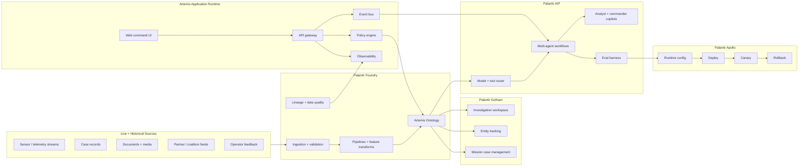
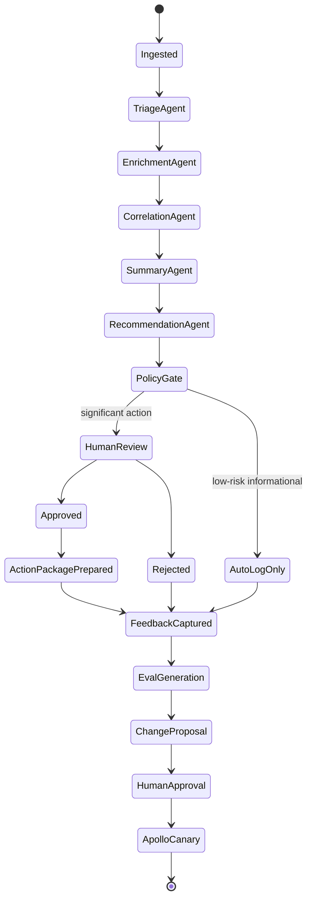

# ClearGlassInc Artemis — Extreme Self-Evolving AI Intelligence Platform Blueprint

**Date:** 2026-07-06  
**Organization:** ClearGlassInc Artemis  
**Stack:** Palantir Gotham + Foundry + AIP + Apollo  
**Design stance:** secure, coalition-aware, multi-domain, latency-sensitive, audited, and human-governed.

ClearGlassInc Artemis is a mission-critical intelligence platform that fuses live and historical data, reasons over a governed ontology, coordinates agentic AI workflows, and continuously improves prompts, model routing, heuristics, and workflow logic through explicit human approval. The system is designed to learn from operator feedback and mission outcomes without autonomously changing its objectives or bypassing operational guardrails.

---

## System Architecture

### Platform roles

| Palantir layer | Artemis responsibility | Implementation posture |
|---|---|---|
| **Gotham** | Operational intelligence, investigations, entity tracking, link analysis, case workflows | Analyst-facing investigation surface for missions, alerts, entities, timelines, and evidence graphs |
| **Foundry** | Data integration, ontology, pipelines, application logic, lineage, access control | Data products, streaming transforms, ontology actions, object sets, lineage, branch/review workflows |
| **AIP** | AI copilots, tool-using agents, workflow automation, evaluations, prompt governance | Guarded agents operating over allowed tools, eval suites, prompt registries, review workflows |
| **Apollo** | Secure deployment, runtime control, canary release, rollback, environment policy | Progressive delivery for services, prompts, model routes, workflow versions, and edge runtimes |

### End-to-end architecture



### Full-stack layers

1. **Frontend:** mission command web UI, analyst workbench, graph explorer, case timeline, agent recommendations, approval inbox, eval dashboards.
2. **API gateway:** OAuth/OIDC, request signing, policy checks, rate limits, tenant and coalition boundary enforcement.
3. **Backend services:** triage service, enrichment service, graph correlation service, action-package service, feedback service, eval service, prompt registry service.
4. **Streaming/event layer:** Kafka-compatible topics or Foundry stream pipelines for alerts, entity updates, operator actions, workflow outcomes, and eval events.
5. **Data layer:** lakehouse-backed raw/clean/curated datasets, vector indexes, search indexes, graph/object sets, model features, immutable audit logs.
6. **Ontology layer:** semantic contract for entities, relationships, permissions, confidence, lineage, temporal state, and operational actions.
7. **AI orchestration layer:** AIP copilots, tool-using agents, model router, workflow state machines, evaluation harnesses, and change proposal generators.
8. **Policy layer:** policy-as-code for need-to-know, compartments, coalition sharing, tool risk, approval gates, and model/prompt promotion.
9. **Observability layer:** OpenTelemetry traces, structured logs, mission metrics, model metrics, drift monitors, human trust metrics, and audit dashboards.
10. **Deployment layer:** Apollo-controlled rollout, canaries, policy bundles, signed artifact promotion, emergency kill switches, and rollback.

---

## Data and Ontology

The Artemis ontology is the operational nervous system. It converts raw data into objects and relationships that humans and AI agents can reason over consistently.

### Core object types

| Object | Key fields | Notes |
|---|---|---|
| `Mission` | `mission_id`, `objective`, `authority`, `start_time`, `status`, `coalition_scope`, `risk_tolerance` | Governs context and permissible actions |
| `IntelEvent` | `event_id`, `source_id`, `event_type`, `observed_at`, `received_at`, `payload_hash`, `confidence` | Canonical incoming signal |
| `Entity` | `entity_id`, `entity_type`, `canonical_name`, `aliases`, `confidence`, `compartments` | Person, org, device, location, account, asset, vulnerability, document |
| `Relationship` | `src`, `dst`, `predicate`, `valid_from`, `valid_to`, `confidence`, `evidence_ids` | Temporal graph edge |
| `Evidence` | `evidence_id`, `uri`, `classification`, `provenance`, `lineage`, `hash`, `retention_policy` | Immutable evidence pointer |
| `Case` | `case_id`, `mission_id`, `priority`, `status`, `assigned_team`, `summary` | Human workflow container |
| `AgentRun` | `run_id`, `agent_name`, `prompt_version`, `model_route`, `tool_calls`, `decision_trace` | AI execution audit |
| `Recommendation` | `rec_id`, `case_id`, `action_type`, `rationale`, `risk`, `approval_state` | Requires gates for significant actions |
| `FeedbackSignal` | `signal_id`, `actor`, `target_id`, `signal_type`, `label`, `notes`, `created_at` | Source for improvement loop |
| `ChangeProposal` | `proposal_id`, `change_type`, `diff`, `eval_results`, `review_state`, `rollback_plan` | Human-approved self-upgrade artifact |

### Relationship examples

```sql
-- Ontology-backed analytical view for entity correlation.
CREATE VIEW artemis_entity_correlation AS
SELECT
  e.event_id,
  r.src AS observed_entity_id,
  r.dst AS related_entity_id,
  r.predicate,
  r.confidence AS relationship_confidence,
  e.confidence AS event_confidence,
  LEAST(r.confidence, e.confidence) AS fused_confidence,
  e.observed_at,
  e.mission_id
FROM intel_events e
JOIN relationships r
  ON r.src = e.primary_entity_id
WHERE e.valid_record = TRUE
  AND r.valid_from <= e.observed_at
  AND COALESCE(r.valid_to, TIMESTAMP '9999-12-31') >= e.observed_at;
```

### Confidence, lineage, and temporal state

- **Confidence** is stored on events, entities, relationships, extracted claims, agent outputs, and recommendations.
- **Lineage** links every derived object to source datasets, transform versions, parser versions, model versions, and operator corrections.
- **Temporal state** is bitemporal: `observed_at` describes when the event happened; `known_at` / `received_at` describes when Artemis learned it.
- **Mission context** limits which actions and data are valid for a given workflow.
- **Permissions** are enforced at row, column, entity, relationship, document, vector chunk, and tool levels.

### Ontology-driven AI behavior

Agents do not receive arbitrary database access. They receive typed tools that operate over ontology objects and return policy-filtered results. For example, a correlation agent can ask for `Entity` neighborhoods and temporal relationships but cannot retrieve compartmented evidence unless the mission, user, and agent policy all permit it.

---

## AI and Agent Design

### Copilots

1. **Analyst Copilot**
   - Summarizes cases, explains graph relationships, drafts intel notes, highlights evidence gaps, and asks clarifying questions.
   - Cannot close cases, alter evidence, or publish reports without approval.

2. **Commander Copilot**
   - Produces mission-level briefs, risk summaries, action packages, and decision options.
   - Requires approval for operationally significant actions.

3. **Data Steward Copilot**
   - Reviews data quality failures, lineage breaks, ontology drift, and schema changes.
   - Can propose pipeline fixes but cannot promote them alone.

4. **PromptOps Copilot**
   - Converts feedback and eval failures into bounded prompt/workflow/model-route proposals.
   - Submits proposals to a review queue with eval evidence and rollback plans.

### Multi-agent workflow



### Tool-using agents

Agents are allowed to:

- Query ontology objects through policy-filtered APIs.
- Run entity enrichment on approved sources.
- Generate case summaries and intelligence products.
- Open a draft case when triage confidence exceeds policy thresholds.
- Prepare, but not execute, operational action packages.
- Submit prompt/workflow/model-route improvement proposals.

Agents are not allowed to:

- Execute disruptive actions without documented human approval.
- Change mission objectives.
- Bypass coalition boundaries.
- Access private or compartmented data outside scope.
- Promote their own prompt or workflow updates to production.

---

## Self-Improvement Loop

ClearGlassInc Artemis improves by converting operational evidence into reviewed software and AI configuration changes.

### Signals captured

| Signal | Source | Use |
|---|---|---|
| Operator corrections | Analyst edits to summaries, entity links, labels | Build eval examples and improve extraction prompts |
| Query logs | Search terms, graph traversals, tool calls | Tune retrieval and tool routing |
| Alert outcomes | True positive, false positive, duplicate, stale | Improve triage thresholds and classifiers |
| Mission results | Approved actions, rejected actions, downstream outcomes | Calibrate recommendation logic |
| Latency traces | API, retrieval, model, pipeline timing | Improve runtime routing and caching |
| Trust feedback | Operator rating and free-text rationale | Identify unsafe or unhelpful behavior |
| Drift monitors | Feature drift, embedding drift, ontology drift | Trigger review and fallback modes |

### Improvement pipeline

1. **Capture:** every human and agent action emits an immutable event.
2. **Normalize:** events become `FeedbackSignal` ontology objects.
3. **Generate evals:** corrected outputs become golden test cases.
4. **Diagnose:** eval service clusters failures by prompt, model route, tool, workflow state, and data source.
5. **Propose:** PromptOps agent creates `ChangeProposal` artifacts.
6. **Evaluate:** run offline evals, regression suites, latency checks, red-team tests, and policy checks.
7. **Review:** human review board approves, rejects, or requests changes.
8. **Deploy:** Apollo releases to a canary cohort with rollback hooks.
9. **Monitor:** compare precision, recall, latency, trust, and mission impact.
10. **Rollback:** if guardrail metrics fail, Apollo returns to previous signed version.

### Governance contract

```yaml
self_improvement_policy:
  allowed_to_propose:
    - prompt_template_changes
    - workflow_state_changes
    - retrieval_weight_changes
    - model_route_changes
    - triage_threshold_changes
    - eval_suite_expansions
  forbidden_without_human_approval:
    - production_prompt_promotion
    - operational_action_execution
    - new_data_source_activation
    - expanded_compartment_access
    - objective_or_mission_policy_changes
  required_evidence:
    min_eval_cases: 100
    no_regression_on_safety_evals: true
    latency_p95_budget_ms: 1800
    rollback_plan_required: true
    reviewer_roles:
      - mission_owner
      - security_officer
      - model_governance_lead
```

---

## Full-Stack Implementation

### Repository layout

```text
artemis/
  apps/
    web-command-ui/          # TypeScript/React mission UI
    eval-dashboard/          # Metrics, drift, trust, eval results
  services/
    api-gateway/             # FastAPI gateway + policy hooks
    triage-service/          # Event classification and prioritization
    ontology-service/        # Typed object APIs over Foundry ontology
    agent-orchestrator/      # AIP tool routing + workflow state machine
    feedback-service/        # Operator feedback capture
    eval-service/            # Evals, regression, proposed updates
    prompt-registry/         # Versioned prompt and workflow registry
  infra/
    apollo/                  # Runtime and rollout configuration
    policy/                  # OPA/Rego policy bundles
    telemetry/               # OpenTelemetry collectors and dashboards
  pipelines/
    foundry/                 # Foundry transforms and data products
    streaming/               # Event schemas and stream consumers
```

### API surface

| Endpoint | Purpose | Risk gate |
|---|---|---|
| `POST /v1/events` | Submit live intel event | Source authentication, schema validation |
| `GET /v1/entities/{id}` | Retrieve ontology object | Entity and relationship-level policy |
| `POST /v1/cases` | Open draft case | Human or low-risk agent approval |
| `POST /v1/agents/run` | Run an AIP workflow | Tool and data-scope policy |
| `POST /v1/recommendations/{id}/approve` | Approve significant recommendation | Human approval + role check |
| `POST /v1/feedback` | Capture correction or rating | Audit write |
| `POST /v1/evals/run` | Run eval suite | Model governance role |
| `POST /v1/change-proposals/{id}/promote` | Promote candidate update | Multi-party approval + Apollo canary |

### Metrics

- **Precision / recall:** true-positive alert rate and missed-event rate.
- **Latency:** ingestion-to-triage p95, triage-to-recommendation p95, UI response p95.
- **Operator trust:** acceptance rate, override rate, correction density, free-text sentiment.
- **Mission impact:** time-to-detection, time-to-brief, decision cycle compression, duplicate work reduction.
- **Safety:** policy denials, unauthorized access attempts, unsafe recommendation blocks, rollback frequency.

---

## Security and Governance

### Need-to-know control model

ClearGlassInc Artemis uses layered authorization:

1. **Identity:** OIDC/SAML, hardware-backed MFA, device posture.
2. **Mission scope:** every query and tool call is bound to a mission and authority.
3. **Compartment:** entity, document, vector chunk, and relationship labels.
4. **Coalition boundary:** data sharing rules per partner, purpose, and retention.
5. **Tool risk:** high-risk tools require explicit approval.
6. **Runtime policy:** every request evaluated by policy-as-code.
7. **Immutable audit:** every decision writes a signed event.

### Zero-trust execution

- Short-lived credentials.
- Workload identity for every service and agent.
- Signed prompts, tools, policies, and containers.
- Network segmentation by mission and compartment.
- Egress allowlists and data-loss prevention.
- Runtime kill switches through Apollo.

### Prompt and model governance

- Every prompt has owner, purpose, risk class, version, eval score, approval status, and rollback target.
- Every model route has allowed data classes, latency envelope, cost policy, eval baseline, and fallback route.
- Every agent run records prompt version, model route, tool calls, retrieved evidence IDs, policy decisions, and human approvals.

---

## Code Examples

### Python domain models

```python
from __future__ import annotations

from datetime import datetime
from enum import Enum
from pydantic import BaseModel, Field
from typing import Any, Literal


class Classification(str, Enum):
    PUBLIC = "PUBLIC"
    INTERNAL = "INTERNAL"
    SECRET = "SECRET"
    COALITION = "COALITION"


class Confidence(BaseModel):
    score: float = Field(ge=0.0, le=1.0)
    method: str
    calibrated_at: datetime


class IntelEvent(BaseModel):
    event_id: str
    mission_id: str
    source_id: str
    event_type: str
    observed_at: datetime
    received_at: datetime
    primary_entity_id: str | None = None
    payload_hash: str
    classification: Classification
    compartments: set[str] = Field(default_factory=set)
    confidence: Confidence
    attributes: dict[str, Any] = Field(default_factory=dict)


class Recommendation(BaseModel):
    rec_id: str
    case_id: str
    action_type: str
    rationale: str
    evidence_ids: list[str]
    risk_level: Literal["low", "medium", "high", "critical"]
    approval_state: Literal["draft", "pending", "approved", "rejected"] = "draft"
```

### FastAPI gateway with policy checks

```python
from fastapi import Depends, FastAPI, HTTPException, Request
from pydantic import BaseModel

app = FastAPI(title="ClearGlassInc Artemis Gateway")


class Principal(BaseModel):
    user_id: str
    roles: set[str]
    compartments: set[str]
    coalition: str
    clearance: str


async def authenticate(request: Request) -> Principal:
    # Production implementation validates OIDC token, device posture, and workload identity.
    token = request.headers.get("authorization", "")
    if not token:
        raise HTTPException(status_code=401, detail="missing authorization")
    return Principal(
        user_id="analyst-001",
        roles={"analyst"},
        compartments={"alpha"},
        coalition="CLEARGLASS_INTERNAL",
        clearance="SECRET",
    )


def enforce_policy(principal: Principal, action: str, resource: dict) -> None:
    allowed = (
        resource.get("classification") in {"PUBLIC", "INTERNAL"}
        or bool(principal.compartments.intersection(set(resource.get("compartments", []))))
    )
    if not allowed:
        raise HTTPException(status_code=403, detail=f"policy denied: {action}")


@app.post("/v1/events")
async def ingest_event(event: IntelEvent, principal: Principal = Depends(authenticate)):
    enforce_policy(
        principal,
        "intel_event.ingest",
        {"classification": event.classification.value, "compartments": list(event.compartments)},
    )
    # Persist into Foundry-backed ingestion queue and emit audit event.
    return {"accepted": True, "event_id": event.event_id}
```

### Ontology-driven query client

```python
class OntologyClient:
    def __init__(self, base_url: str, token: str):
        self.base_url = base_url
        self.token = token

    async def entity_neighborhood(
        self,
        *,
        mission_id: str,
        entity_id: str,
        max_depth: int = 2,
        min_confidence: float = 0.65,
    ) -> dict:
        """Return policy-filtered graph context for an ontology entity."""
        # In production this calls Foundry ontology APIs / Gotham object sets.
        return {
            "mission_id": mission_id,
            "center": entity_id,
            "nodes": [],
            "edges": [],
            "filters": {"max_depth": max_depth, "min_confidence": min_confidence},
        }
```

### Agent tool call and workflow state machine

```python
from dataclasses import dataclass
from enum import StrEnum


class WorkflowState(StrEnum):
    INGESTED = "ingested"
    TRIAGED = "triaged"
    ENRICHED = "enriched"
    CORRELATED = "correlated"
    SUMMARIZED = "summarized"
    RECOMMENDED = "recommended"
    PENDING_APPROVAL = "pending_approval"
    CLOSED = "closed"


@dataclass
class WorkflowContext:
    mission_id: str
    event_id: str
    case_id: str | None = None
    confidence: float = 0.0
    evidence_ids: list[str] | None = None


class ArtemisWorkflow:
    def __init__(self, ontology: OntologyClient, audit_writer):
        self.ontology = ontology
        self.audit_writer = audit_writer

    async def run(self, ctx: WorkflowContext) -> Recommendation:
        state = WorkflowState.INGESTED
        await self.audit_writer.write(ctx, state, "workflow_started")

        triage = await self._triage(ctx)
        state = WorkflowState.TRIAGED
        await self.audit_writer.write(ctx, state, triage)

        enrichment = await self._enrich(ctx)
        state = WorkflowState.ENRICHED
        await self.audit_writer.write(ctx, state, enrichment)

        correlation = await self._correlate(ctx)
        state = WorkflowState.CORRELATED
        await self.audit_writer.write(ctx, state, correlation)

        recommendation = await self._recommend(ctx, triage, enrichment, correlation)
        if recommendation.risk_level in {"high", "critical"}:
            recommendation.approval_state = "pending"
            state = WorkflowState.PENDING_APPROVAL
        else:
            recommendation.approval_state = "draft"
            state = WorkflowState.RECOMMENDED

        await self.audit_writer.write(ctx, state, recommendation.model_dump())
        return recommendation
```

### Eval pipeline in Python

```python
from statistics import mean
from typing import Callable


class EvalCase(BaseModel):
    case_id: str
    input_payload: dict
    expected_label: str
    minimum_confidence: float
    policy_tags: set[str] = Field(default_factory=set)


class EvalResult(BaseModel):
    suite_id: str
    candidate_version: str
    precision: float
    recall: float
    latency_p95_ms: float
    safety_failures: int
    passed: bool


async def run_eval_suite(
    suite_id: str,
    candidate_version: str,
    cases: list[EvalCase],
    predictor: Callable[[dict], dict],
) -> EvalResult:
    predictions = []
    latencies = []
    safety_failures = 0

    for case in cases:
        started = datetime.utcnow()
        output = predictor(case.input_payload)
        elapsed_ms = (datetime.utcnow() - started).total_seconds() * 1000
        latencies.append(elapsed_ms)
        predictions.append((case.expected_label, output["label"], output["confidence"]))
        if output.get("policy_violation"):
            safety_failures += 1

    true_positive = sum(1 for expected, actual, _ in predictions if expected == actual == "positive")
    false_positive = sum(1 for expected, actual, _ in predictions if expected != "positive" and actual == "positive")
    false_negative = sum(1 for expected, actual, _ in predictions if expected == "positive" and actual != "positive")

    precision = true_positive / max(true_positive + false_positive, 1)
    recall = true_positive / max(true_positive + false_negative, 1)
    latency_p95 = sorted(latencies)[int(len(latencies) * 0.95) - 1]

    return EvalResult(
        suite_id=suite_id,
        candidate_version=candidate_version,
        precision=precision,
        recall=recall,
        latency_p95_ms=latency_p95,
        safety_failures=safety_failures,
        passed=precision >= 0.92 and recall >= 0.88 and latency_p95 <= 1800 and safety_failures == 0,
    )
```

### Change proposal object

```python
class ChangeProposal(BaseModel):
    proposal_id: str
    created_by_agent: str
    change_type: Literal["prompt", "workflow", "model_route", "threshold", "eval"]
    target_name: str
    current_version: str
    candidate_version: str
    diff_summary: str
    eval_result: EvalResult
    rollback_version: str
    approval_required_from: list[str]
    status: Literal["draft", "in_review", "approved", "rejected", "deployed", "rolled_back"] = "draft"


def can_promote(proposal: ChangeProposal) -> bool:
    return proposal.status == "approved" and proposal.eval_result.passed and bool(proposal.rollback_version)
```

### Policy-as-code example

```rego
package artemis.authz

default allow := false

allow {
  input.principal.clearance == resource_clearance
  input.action == "entity.read"
  input.resource.mission_id == input.context.mission_id
  some c
  input.principal.compartments[c]
  input.resource.compartments[c]
}

allow {
  input.action == "recommendation.prepare"
  input.resource.risk_level == "low"
  input.principal.roles[_] == "analyst"
}

requires_human_approval {
  input.action == "recommendation.execute"
  input.resource.risk_level in {"high", "critical"}
}
```

### Apollo rollout configuration

```yaml
application: artemis-agent-orchestrator
artifact: registry.clearglass/artemis-agent-orchestrator:2.4.0
runtime:
  environment: mission-prod
  policy_bundle: artemis-policy-2026-07-06
  prompt_bundle: artemis-prompts-1.18.0
rollout:
  strategy: canary
  stages:
    - name: internal-shadow
      traffic_percent: 0
      shadow_only: true
      duration: 2h
    - name: analyst-canary
      traffic_percent: 5
      duration: 6h
    - name: mission-prod
      traffic_percent: 50
      duration: 12h
  rollback_on:
    safety_failures_gt: 0
    p95_latency_ms_gt: 1800
    trust_score_drop_gt: 0.05
    precision_drop_gt: 0.03
```

---

## Scenario Walkthrough

At 03:14 UTC, a live telemetry event enters ClearGlassInc Artemis from an authorized coalition stream. The event references a device identifier, a location, a partial organization association, and a short-lived network indicator.

1. **Ingestion**
   - Foundry validates the event schema, attaches provenance, computes a payload hash, labels compartments, and emits an `IntelEvent` object.
   - The event is available in Gotham as a mission-scoped signal.

2. **Triage**
   - The AIP triage agent reads only policy-authorized fields.
   - It identifies the event as time-sensitive with `0.82` confidence.
   - It opens a draft case because the mission policy allows low-risk case creation.

3. **Enrichment**
   - The enrichment agent queries approved internal and licensed sources.
   - It links the device to two historical events and one active mission watchlist.
   - Foundry records lineage for every new relationship.

4. **Correlation**
   - The correlation agent requests the entity neighborhood from the ontology service.
   - Policy filters remove coalition-restricted evidence not available to the current mission cell.
   - The agent produces a graph-backed explanation rather than an unsupported assertion.

5. **Recommendation**
   - The recommendation agent prepares two options: accelerate monitoring or isolate an affected asset.
   - Isolation is marked high risk and routed to human review.
   - The commander sees the evidence set, confidence, rationale, tradeoffs, and policy gates.

6. **Operator decision**
   - The commander approves accelerated monitoring and rejects isolation as disproportionate.
   - The rejection rationale is captured as `FeedbackSignal`: “isolation too disruptive for current confidence.”

7. **Learning loop**
   - The eval service converts the case into a new eval example: when confidence is moderate and blast radius is high, recommend monitoring before isolation unless additional evidence appears.
   - PromptOps proposes a bounded update to the recommendation prompt and risk-router threshold.
   - Offline evals show improved precision with no safety regressions.
   - Human reviewers approve the change.
   - Apollo deploys it to shadow mode, then a 5% canary, then mission production.

8. **Rollback path**
   - If the canary causes lower trust scores, higher latency, or safety failures, Apollo automatically restores the prior prompt bundle and model route.
   - The failed proposal remains in the audit log with eval evidence and reviewer notes.

This is how ClearGlassInc Artemis gets better and better: it learns from real operator behavior, but only converts that learning into production behavior through evaluated, versioned, reviewed, and rollback-safe changes.
