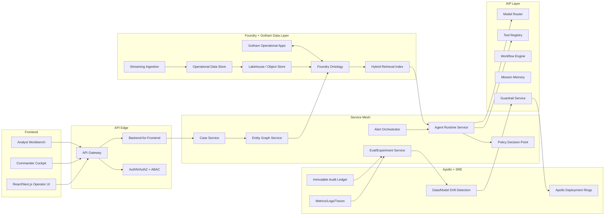

# ClearGlassInc Artemis — Extreme Self-Evolving Intelligence Platform (Palantir Gotham + Foundry + AIP + Apollo)

## 1) System Architecture

### 1.1 Reference Topology



### 1.2 Layer Responsibilities
- **Gotham**: mission operations, investigations, link analysis, watchlists, case timelines.
- **Foundry**: ingestion, transforms, ontology, data lineage, application logic.
- **AIP**: copilots, tool-using agents, evaluations, workflow orchestration.
- **Apollo**: secure progressive rollout, rollback, runtime controls, patch management.

## 2) Data and Ontology

### 2.1 Canonical Ontology Entities
- `Person`, `Organization`, `Asset`, `Location`, `Event`, `Signal`, `Case`, `Mission`, `Alert`, `ActionPackage`.
- Each entity includes:
  - `entity_id`, `classification`, `confidence_score`, `source_refs[]`, `valid_time`, `ingest_time`, `owner_compartment`.

### 2.2 Relationship Model
- `OBSERVED_AT`, `ASSOCIATED_WITH`, `OWNS`, `TRAVELED_TO`, `COMMUNICATED_WITH`, `IMPACTS_MISSION`, `DERIVED_FROM`.
- Relationship metadata: `confidence`, `provenance_hash`, `policy_tags`, `ttl`.

### 2.3 Temporal + Lineage
- Bi-temporal storage: `valid_from/valid_to` and `recorded_at`.
- Every transform emits lineage: upstream dataset version + code version + operator context.

```sql
CREATE TABLE ontology_entity (
  entity_id TEXT PRIMARY KEY,
  entity_type TEXT NOT NULL,
  attributes JSONB NOT NULL,
  confidence NUMERIC(5,4) NOT NULL,
  valid_from TIMESTAMPTZ,
  valid_to TIMESTAMPTZ,
  recorded_at TIMESTAMPTZ NOT NULL DEFAULT now(),
  source_refs JSONB NOT NULL,
  policy_tags TEXT[] NOT NULL,
  lineage_id TEXT NOT NULL
);
```

## 3) AI and Agent Design

### 3.1 Agent Roles (AIP)
- **Triage Agent**: validates incoming signals, de-duplicates, risk scores.
- **Enrichment Agent**: expands entities via approved connectors.
- **Correlation Agent**: performs graph traversal, hypothesis generation.
- **Intel Drafting Agent**: prepares briefs, SITREPs, action packages.
- **Commander Copilot**: recommends options + confidence + anticipated outcomes.

### 3.2 Tool Contract
All tools are typed and policy-gated.

```python
from pydantic import BaseModel

class ToolRequest(BaseModel):
    mission_id: str
    actor_id: str
    purpose: str
    query: dict

class ToolResponse(BaseModel):
    data: dict
    provenance: list[str]
    confidence: float

class Tool:
    name: str
    required_scopes: list[str]
    async def run(self, req: ToolRequest) -> ToolResponse: ...
```

### 3.3 Approval Gates
- Any operationally significant action (`open_case`, `notify_field_unit`, `escalate_tier`) requires:
  1. policy allow,
  2. human approval,
  3. immutable signature + audit record.

## 4) Self-Improvement Loop (Human-Governed)

1. Capture signals: prompts, outputs, edits, accept/reject, mission outcomes.
2. Auto-generate eval datasets from real operations.
3. Propose upgrades to prompts/workflows/model routes.
4. Run sandbox replay + counterfactual simulation.
5. Human review board approves/rejects change set.
6. Apollo canary rollout (5% -> 25% -> 100%) with auto-rollback.

```python
class ImprovementProposal(BaseModel):
    proposal_id: str
    target: str  # prompt|workflow|router|heuristic
    diff: dict
    expected_gain: dict
    risks: list[str]
    approval_required: bool = True
```

Drift triggers:
- retrieval precision drop > 8%
- operator override rate > 12%
- latency p95 > SLA for 15 min

## 5) Full-Stack Implementation Blueprint

### 5.1 Web UI (TypeScript/Next.js)
- Mission timeline, graph canvas, copilot chat, approval queue, eval dashboard.
- Real-time updates via WebSockets / SSE.

```ts
export async function approveAction(actionId: string, token: string) {
  return fetch(`/api/actions/${actionId}/approve`, {
    method: "POST",
    headers: { Authorization: `Bearer ${token}` }
  });
}
```

### 5.2 API + Backend (Python/FastAPI)

```python
from fastapi import FastAPI, Depends
app = FastAPI()

@app.post("/v1/agent/ask")
async def agent_ask(req: dict, user=Depends(authn)):
    policy_assert(user, req["mission_id"], "agent.ask")
    plan = await orchestrator.plan(req)
    result = await orchestrator.execute(plan, approval_callback=approval_gate)
    return result
```

### 5.3 Event Bus + Stream Processing
- Kafka/Pulsar topics:
  - `intel.signal.raw`
  - `intel.signal.normalized`
  - `agent.action.proposed`
  - `agent.action.approved`
  - `mission.outcome.logged`
  - `self_improve.proposal.created`

### 5.4 Retrieval + Inference
- Hybrid retrieval: BM25 + vector + ontology constraints.
- Model router policy: cheap model for low-risk summarization; high-trust model for recommendations.

## 6) Security and Governance

- **Need-to-know ABAC**: mission, compartment, coalition tags.
- **Row/column/entity controls** integrated with ontology objects.
- **Zero-trust**: mTLS service identity + short-lived tokens.
- **Immutable logs**: append-only audit store with cryptographic chaining.
- **Policy-as-code** (OPA/Rego-like).

```rego
package artemis.policy

default allow = false

allow {
  input.user.clearance >= input.resource.classification
  input.user.compartments[_] == input.resource.compartment
  input.action == "agent.ask"
}
```

## 7) Code Examples

### 7.1 Workflow State Machine (Python)

```python
from enum import Enum

class State(str, Enum):
    INGESTED="INGESTED"; TRIAGED="TRIAGED"; ENRICHED="ENRICHED"
    CORRELATED="CORRELATED"; RECOMMENDED="RECOMMENDED"; APPROVED="APPROVED"

TRANSITIONS = {
  State.INGESTED:[State.TRIAGED],
  State.TRIAGED:[State.ENRICHED],
  State.ENRICHED:[State.CORRELATED],
  State.CORRELATED:[State.RECOMMENDED],
  State.RECOMMENDED:[State.APPROVED],
}
```

### 7.2 Eval Pipeline Job

```python
async def run_eval_suite(candidate_version: str):
    suite = load_suite("mission-critical-v3")
    scores = await evaluator.run(candidate_version, suite)
    guardrail = {
      "precision_min": 0.91,
      "recall_min": 0.88,
      "hallucination_max": 0.03,
      "p95_latency_ms_max": 1800,
    }
    return gate(scores, guardrail)
```

### 7.3 Agent Tool Call with Approval Hook

```python
async def propose_and_execute(action, user):
    if action.risk_level >= 3:
        ticket = await approval_service.create(action, user)
        return {"status": "PENDING_APPROVAL", "ticket": ticket}
    return await action_executor.execute(action)
```

## 8) Scenario Walkthrough (Cinematic, Technical)

1. **00:00:03 UTC**: live SIGINT indicator enters `intel.signal.raw`.
2. Triage agent scores anomaly 0.87 and creates `Alert#A-8842`.
3. Enrichment agent resolves 3 entities; correlation agent links to ongoing `Mission#M-102`.
4. Commander copilot recommends “Escalate to Level-2 watch + open case draft.”
5. Policy engine flags as operationally significant -> human approval required.
6. Operator approves with amendment: “Delay external notification pending HUMINT corroboration.”
7. System executes partial action package, logs immutable audit + provenance.
8. Outcome after 6h: alert confirmed true positive.
9. Self-improvement service attributes success to:
   - enriched graph pattern,
   - prompt variant `triage_v12`.
10. Proposal created: increase routing weight for `triage_v12` in this mission profile.
11. Review board approves; Apollo canary deploys to 10% comparable missions.
12. Metrics improve (precision +4.1%, override rate -2.7%); rollout completes.

---

This blueprint keeps **ClearGlassInc Artemis** adaptive and aggressively intelligent while preserving human command authority, auditability, and coalition-safe governance.
