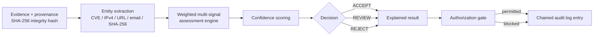

# SITREP — ARTEMIS Governed Intelligence Platform Core

**Report type:** Operational situation report (engineering command)
**Subject:** `ClearGlasslabs/ClearGlassInc` — PR #10, *Artemis governed intelligence platform core*
**Branch:** `feat/artemis-intelligence-platforms`
**Disposition:** OPEN — NOT MERGED
**Classification:** Internal engineering. Defensive intelligence engineering only.

---

## 1. Executive Summary

PR #10 delivers the governed intelligence platform core on branch
`feat/artemis-intelligence-platforms`. The change set establishes a defensive
control layer in which intelligence assessments are produced from
integrity-hashed evidence, scored by a weighted multi-signal engine, resolved
into an explicit `ACCEPT` / `REVIEW` / `REJECT` decision with a human-readable
explanation, and written to a tamper-evident chained audit log. Authorization
gates enforce least privilege at the boundary, blocking high-consequence
operations rather than attempting to adjudicate them silently. Operational
value is auditability, policy enforcement, and validation: every decision the
platform emits is traceable to the evidence that produced it, the weights that
scored it, and the policy that permitted or blocked the resulting action. The
pull request is open and has not been merged.

---

## 2. Delivered Capabilities

Capabilities delivered in this change set:

- **Evidence and provenance records with SHA-256 integrity hashes.** Evidence
  entering the platform carries a provenance record and a SHA-256 integrity
  hash, establishing a verifiable chain from source material to assessment.
- **Weighted multi-signal intelligence assessment engine.** Assessments are
  computed across multiple signals under explicit weighting rather than a
  single-source verdict.
- **Confidence scoring with explicit `ACCEPT`, `REVIEW`, or `REJECT`
  decisions.** Confidence is scored and resolved into one of three declared
  decision states — no implicit or undefined outcome.
- **Human-readable decision explanations.** Each decision is exposed with an
  explanation an operator can read and contest.
- **Tamper-evident chained audit logging.** Audit entries are chained such that
  modification of a prior record is detectable.
- **Entity extraction** for CVE identifiers, IPv4 addresses, URLs, email
  addresses, and SHA-256 indicators.
- **Authorization gates** blocking unapproved production deployment,
  protected-branch merges, secret rotation, access-control changes, destructive
  operations, financial actions, and personal-data collection.

### 2.1 Capability register

| # | Capability | Function delivered |
|---|---|---|
| C-1 | Evidence + provenance | Provenance records bound to SHA-256 integrity hashes |
| C-2 | Assessment engine | Weighted multi-signal intelligence assessment |
| C-3 | Decision resolution | Confidence scoring → `ACCEPT` / `REVIEW` / `REJECT` |
| C-4 | Explainability | Human-readable decision explanations |
| C-5 | Audit | Tamper-evident chained audit logging |
| C-6 | Extraction | CVEs, IPv4 addresses, URLs, email addresses, SHA-256 indicators |
| C-7 | Authorization | Gates blocking seven classes of high-consequence action |

### 2.2 Blocked action classes (C-7)

| Action class | Gate posture |
|---|---|
| Production deployment (unapproved) | Blocked |
| Protected-branch merge | Blocked |
| Secret rotation | Blocked |
| Access-control change | Blocked |
| Destructive operation | Blocked |
| Financial action | Blocked |
| Personal-data collection | Blocked |

### 2.3 Assessment path

---

## 3. Verification and Quality Gates

Unit tests cover scoring, extraction, policy enforcement, and audit-chain
tampering — that is, the audit chain is exercised against tamper conditions
rather than assumed intact. GitHub Actions validation runs across Python 3.11,
3.12, and 3.13. The validation set includes compilation, Ruff linting, strict
mypy checks, and pytest execution.

| Gate | Scope |
|---|---|
| Unit tests | Scoring, extraction, policy enforcement, audit-chain tampering |
| Matrix | Python 3.11, 3.12, 3.13 (GitHub Actions) |
| Compilation | Included in validation |
| Ruff lint | Included in validation |
| mypy (strict) | Included in validation |
| pytest | Included in validation |

Capability and verification status are distinct. Section 2 states what the
change set delivers; Section 5 states what GitHub had confirmed at the final
verification point. The gates above are defined and configured in the change
set; no completed workflow run was available to report results from.

---

## 4. Operational Assessment

This is a meaningful defensive control layer for four reasons.

**Integrity.** Evidence carries provenance and a SHA-256 hash, and audit
records are chained. Substituted evidence and rewritten history are made
detectable rather than left to trust.

**Explainability.** Every decision resolves to a declared state with a
human-readable explanation. Analysts can review the reasoning behind an
`ACCEPT`, `REVIEW`, or `REJECT` instead of accepting an opaque score, which is
what makes the `REVIEW` state operationally useful rather than decorative.

**Least privilege.** The authorization gates are default-deny across the seven
highest-consequence classes — deployment, protected-branch merges, secret
rotation, access-control changes, destructive operations, financial actions,
and personal-data collection. Consequential authority stays with a human.

**Auditability.** Assessment, decision, explanation, and gate outcome are all
evidenced in the chained log, producing a reconstructable record of what was
decided and on what basis.

**Scope statement.** This is not fictional government-classified capability. It
does not include unauthorized surveillance, exploitation, credential theft,
covert persistence, or destructive tooling. The extraction set — CVEs, IPv4
addresses, URLs, email addresses, and SHA-256 indicators — is defensive
indicator handling operating on evidence supplied to the platform.

---

## 5. Current Status / Readiness

PR #10 is **open and not merged**. GitHub initially reported the pull request
as non-mergeable while checks and repository evaluation were initializing. **No
completed workflow run was available at the final verification point**, so no
validation results are reported here.

| Area | State | Notes |
|---|---|---|
| Pull request #10 | Open | Not merged |
| Branch | `feat/artemis-intelligence-platforms` | Source branch for the change set |
| Mergeability | Initially non-mergeable | Reported while checks and repository evaluation initialize |
| Workflow run | None completed | No completed run available at final verification |
| Delivered capabilities | Present in change set | Section 2 |
| Verification gates | Configured | Results pending — see above |

**Readiness call.** Capability is delivered and gates are configured;
verification status is unconfirmed pending a completed workflow run and a
mergeable state. Merge readiness is not asserted.

---

*Report ends.*
