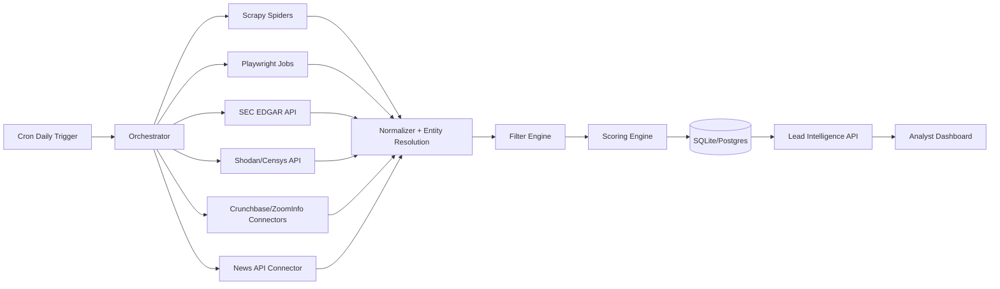

# ClearGlassInc Artemis — Lead Scraping Architecture (Python, Public Data Only)

## 1) System Architecture

This design adds a **public-data lead intelligence pipeline** for ClearGlassInc Artemis that runs daily, captures compliance and cyber-risk signals, and writes structured outputs for scoring and analyst action.

### 1.1 High-level components

- **Acquisition Layer (Python)**
  - Scrapy spiders for structured crawling.
  - Playwright workers for JavaScript-rendered public pages.
  - API connectors for SEC EDGAR, Censys/Shodan, Clearbit, Hunter.io, and news feeds.
- **Normalization Layer**
  - Entity resolution (domain/company matching).
  - Canonical schema mapping (company, tech stack, compliance posture, breach signals).
- **Scoring Layer**
  - Rules + weighted model for lead quality and urgency.
- **Storage Layer**
  - SQLite (local dev) and Postgres (prod).
- **Orchestration Layer**
  - Daily cron schedule + Celery/Redis queue.
  - Proxy rotation + compliant header rotation for resilient crawling.
- **Governance Layer**
  - Strict public-data-only controls.
  - Audit logs and source provenance.



## 2) Data and Ontology

### 2.1 Core entities

- `Company`: legal name, domains, industry, revenue estimate, employee count.
- `TechnologySignal`: observed stack component/version and source evidence.
- `ComplianceSignal`: HIPAA/GDPR/control-gap indicators from filings/public statements.
- `ExposureSignal`: exposed services, vulnerable ports, outdated OS signals.
- `BreachSignal`: breach/news incidents with date, severity, and source reliability.
- `Contact`: publicly discoverable contacts and roles (where terms permit).
- `LeadScore`: weighted score, explanation vector, and confidence.

### 2.2 Relational model (Postgres)

```sql
CREATE TABLE companies (
  id UUID PRIMARY KEY,
  name TEXT NOT NULL,
  domain TEXT,
  revenue_usd BIGINT,
  industry TEXT,
  hq_country TEXT,
  created_at TIMESTAMPTZ DEFAULT now(),
  updated_at TIMESTAMPTZ DEFAULT now()
);

CREATE TABLE technology_signals (
  id UUID PRIMARY KEY,
  company_id UUID REFERENCES companies(id),
  source TEXT NOT NULL,
  tech_name TEXT NOT NULL,
  tech_version TEXT,
  is_outdated BOOLEAN DEFAULT FALSE,
  observed_at TIMESTAMPTZ NOT NULL,
  evidence_url TEXT,
  confidence NUMERIC(4,3) CHECK (confidence >= 0 AND confidence <= 1)
);

CREATE TABLE compliance_signals (
  id UUID PRIMARY KEY,
  company_id UUID REFERENCES companies(id),
  framework TEXT CHECK (framework IN ('HIPAA','GDPR','SOC2','PCI-DSS','NIST')),
  gap_type TEXT NOT NULL,
  severity TEXT CHECK (severity IN ('low','medium','high','critical')),
  observed_at TIMESTAMPTZ NOT NULL,
  evidence_url TEXT,
  confidence NUMERIC(4,3)
);

CREATE TABLE exposure_signals (
  id UUID PRIMARY KEY,
  company_id UUID REFERENCES companies(id),
  provider TEXT CHECK (provider IN ('shodan','censys')),
  exposure_type TEXT,
  cve TEXT,
  cvss NUMERIC(3,1),
  observed_at TIMESTAMPTZ NOT NULL,
  evidence_json JSONB,
  confidence NUMERIC(4,3)
);

CREATE TABLE breach_signals (
  id UUID PRIMARY KEY,
  company_id UUID REFERENCES companies(id),
  source TEXT,
  incident_date DATE,
  title TEXT,
  severity TEXT,
  evidence_url TEXT,
  confidence NUMERIC(4,3)
);

CREATE TABLE contacts (
  id UUID PRIMARY KEY,
  company_id UUID REFERENCES companies(id),
  full_name TEXT,
  title TEXT,
  work_email TEXT,
  linkedin_url TEXT,
  source TEXT,
  confidence NUMERIC(4,3)
);

CREATE TABLE lead_scores (
  company_id UUID PRIMARY KEY REFERENCES companies(id),
  score NUMERIC(5,2) NOT NULL,
  urgency TEXT CHECK (urgency IN ('low','medium','high')),
  rationale JSONB NOT NULL,
  recomputed_at TIMESTAMPTZ NOT NULL
);
```

## 3) AI and Agent Design

### 3.1 Python micro-agents

- `collector_agent`: dispatches crawlers/connectors.
- `resolver_agent`: canonicalizes companies/domains.
- `risk_agent`: evaluates vulnerabilities and outdated stacks.
- `compliance_agent`: extracts filing/news compliance gaps.
- `scoring_agent`: generates explainable lead score.
- `qa_agent`: validates data quality and policy constraints.

### 3.2 Guardrails

- Public pages and licensed APIs only.
- Robots.txt-aware behavior.
- Rate limits per source.
- No account takeover or auth bypass.
- No protected/private profile scraping.

## 4) Self-Improvement Loop (Safe)

1. Capture feedback (`won/lost`, false positive, bad enrichment).
2. Auto-generate eval datasets by source and vertical.
3. Run nightly evals on extraction precision, lead relevance, and freshness.
4. Propose score-weight updates and parser updates.
5. Require human approval to activate new configs.
6. Keep rollback snapshots for parsers/weights.

```python
# app/self_improve/pipeline.py
from dataclasses import dataclass

@dataclass
class EvalResult:
    precision: float
    recall: float
    freshness: float
    false_positive_rate: float


def should_propose_update(result: EvalResult) -> bool:
    return (
        result.precision >= 0.82
        and result.recall >= 0.70
        and result.false_positive_rate <= 0.15
    )


def gate_for_human_approval(candidate_version: str, result: EvalResult) -> dict:
    return {
        "candidate_version": candidate_version,
        "status": "pending_human_review",
        "metrics": result.__dict__,
        "rollback_to": "current_production_version"
    }
```

## 5) Full-Stack Implementation Blueprint

### 5.1 Python package layout

```text
lead_intel/
  app/
    api/
      main.py
      routes_leads.py
    collectors/
      scrapy_runner.py
      playwright_runner.py
      sec_edgar.py
      shodan_client.py
      censys_client.py
      crunchbase_client.py
      zoominfo_client.py
      news_client.py
    normalize/
      company_resolver.py
      schema_mapper.py
    filters/
      qualification.py
    scoring/
      lead_scorer.py
    db/
      models.py
      session.py
      migrations/
    orchestration/
      daily_job.py
      celery_app.py
    compliance/
      guardrails.py
    self_improve/
      feedback_capture.py
      eval_runner.py
      pipeline.py
```

### 5.2 Scrapy + Playwright example

```python
# app/collectors/scrapy_runner.py
from scrapy.crawler import CrawlerProcess
from app.collectors.spiders.company_spider import CompanySpider


def run_scrapy(seed_urls: list[str]) -> None:
    process = CrawlerProcess(settings={
        "USER_AGENT": "ClearGlassIncArtemisLeadIntelBot/1.0 (+public-data)",
        "ROBOTSTXT_OBEY": True,
        "DOWNLOAD_DELAY": 0.75,
        "CONCURRENT_REQUESTS": 8,
    })
    process.crawl(CompanySpider, seed_urls=seed_urls)
    process.start()
```

```python
# app/collectors/playwright_runner.py
from playwright.async_api import async_playwright


async def fetch_rendered(url: str) -> str:
    async with async_playwright() as p:
        browser = await p.chromium.launch(headless=True)
        page = await browser.new_page()
        await page.goto(url, wait_until="networkidle", timeout=45000)
        html = await page.content()
        await browser.close()
        return html
```

### 5.3 Qualification filters

```python
# app/filters/qualification.py
from datetime import datetime, timedelta, timezone

RECENT_WINDOW_DAYS = 90


def qualifies(company: dict, signals: dict) -> bool:
    revenue_ok = (company.get("revenue_usd") or 0) > 10_000_000

    outdated_stack = any(
        t.get("tech_name") == "Windows Server" and str(t.get("tech_version", "")).startswith("2012")
        for t in signals.get("technology", [])
    )

    recent_vuln = any(
        (datetime.now(timezone.utc) - s["observed_at"]).days <= RECENT_WINDOW_DAYS
        and (s.get("cvss") or 0) >= 7.0
        for s in signals.get("exposure", [])
    )

    compliance_gap = any(
        c.get("framework") in {"HIPAA", "GDPR"} and c.get("severity") in {"high", "critical"}
        for c in signals.get("compliance", [])
    )

    return revenue_ok and (outdated_stack or recent_vuln or compliance_gap)
```

### 5.4 Scoring engine

```python
# app/scoring/lead_scorer.py
WEIGHTS = {
    "revenue": 0.20,
    "exposure": 0.35,
    "compliance_gap": 0.25,
    "breach_recency": 0.15,
    "contact_quality": 0.05,
}


def score_lead(features: dict) -> tuple[float, dict]:
    contributions = {
        k: WEIGHTS[k] * float(features.get(k, 0.0))
        for k in WEIGHTS
    }
    score = round(sum(contributions.values()) * 100, 2)
    return score, contributions
```

### 5.5 Daily cron orchestration

```bash
# /etc/cron.d/clearglass-lead-intel
15 02 * * * /usr/bin/python3 /opt/lead_intel/app/orchestration/daily_job.py >> /var/log/lead-intel.log 2>&1
```

```python
# app/orchestration/daily_job.py
from app.collectors.sec_edgar import ingest_sec_filings
from app.collectors.shodan_client import ingest_shodan
from app.collectors.news_client import ingest_news
from app.normalize.schema_mapper import normalize_all
from app.filters.qualification import qualifies
from app.scoring.lead_scorer import score_lead
from app.db.session import SessionLocal


def run_daily_pipeline() -> None:
    ingest_sec_filings()
    ingest_shodan()
    ingest_news()

    db = SessionLocal()
    for company, signals in normalize_all(db):
        if not qualifies(company, signals):
            continue
        score, rationale = score_lead(signals["features"])
        # persist score + rationale
        # db.upsert_lead_score(...)


if __name__ == "__main__":
    run_daily_pipeline()
```

## 6) Security and Governance

- Public-data-only policy checks before ingestion commit.
- API key vaulting and scoped secrets.
- Source-level provenance and immutable run logs.
- PII minimization and configurable retention windows.
- Jurisdiction-aware compliance flags (HIPAA/GDPR evidence).

```python
# app/compliance/guardrails.py
ALLOWED_SOURCES = {
    "sec_edgar_api",
    "shodan_api",
    "censys_api",
    "crunchbase_api",
    "zoominfo_api",
    "clearbit_api",
    "hunter_api",
    "news_api",
    "public_web"
}


def enforce_public_data_policy(record: dict) -> None:
    source = record.get("source")
    if source not in ALLOWED_SOURCES:
        raise ValueError(f"Blocked non-approved source: {source}")
    if record.get("access_type") == "private_or_restricted":
        raise ValueError("Blocked restricted/private data collection")
```

## 7) Operational Output Contract

Every qualified company row should include:

```json
{
  "company": {
    "name": "Example Health Systems",
    "domain": "examplehealth.com",
    "revenue_usd": 250000000,
    "industry": "Healthcare"
  },
  "tech_stack": [
    {"name": "Windows Server", "version": "2012 R2", "outdated": true}
  ],
  "contacts": [
    {"name": "Jane Doe", "title": "CISO", "email": "jane@examplehealth.com"}
  ],
  "pain_points": [
    "High CVSS exposure observed in recent scan",
    "Potential HIPAA control gap from filing language"
  ],
  "score": 84.6,
  "urgency": "high",
  "provenance": [
    "https://www.sec.gov/...",
    "https://api.shodan.io/..."
  ]
}
```

## 8) Integration Notes for ClearGlassInc Artemis

- This architecture plugs into existing Artemis platform docs and can be linked from strategy, operations, and investor materials.
- For production rollout: start with SEC + news + one exposure API, then incrementally enable additional connectors with legal review.
- Keep all generated intelligence marked as **advisory** until analyst validation.
