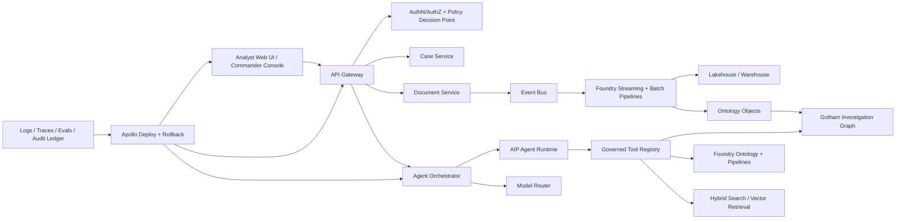
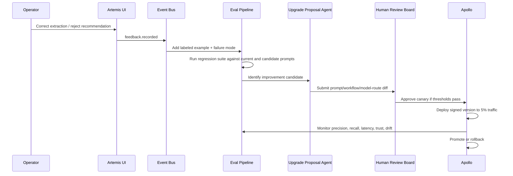

# ClearGlassInc Artemis — Self-Evolving Legal-Tech Intelligence Platform

## System Architecture

ClearGlassInc Artemis is a secure, coalition-aware intelligence platform that combines Palantir Gotham for operational investigations, Palantir Foundry for governed data integration and ontology-backed application logic, Palantir AIP for copilots and agentic automation, and Palantir Apollo for controlled deployment, runtime policy, rollback, and fleet-wide update orchestration. The target legal-tech MVP is a demo-ready OSINT plus document-processing workflow where at least two agents collaborate under explicit human approval gates and measured error stays below 5% on a labeled validation set.

Palantir terminology used in this design:

- **Gotham**: operational intelligence workspace for entity tracking, link analysis, investigations, and mission workflows.
- **Foundry**: data integration, transformation, ontology, operational application, and governed analytics platform.
- **AIP**: artificial intelligence platform for LLM-backed copilots, agents, tools, evaluations, and workflow automation.
- **Apollo**: secure software delivery and runtime control plane for deployment, policy, rollback, and update management across environments.

### End-to-End Topology



### Full-Stack Layers

| Layer | Production components | ClearGlassInc Artemis responsibility |
|---|---|---|
| Frontend | Next.js, React, TypeScript, WebSocket/SSE, map/link graph components | Case timeline, entity graph, document review, agent transcript, approval queue, eval dashboard |
| API gateway | FastAPI or Envoy-backed edge service, OIDC, mTLS, request signing | Normalizes browser and machine calls, enforces tenant/mission context, emits immutable request metadata |
| Backend services | Python FastAPI services, workflow workers, document processors | Case management, document extraction, OSINT enrichment, action package generation |
| Event bus | Kafka, Redpanda, or Foundry streaming datasets | Carries `document.ingested`, `entity.resolved`, `alert.triaged`, `feedback.recorded`, `upgrade.proposed` events |
| Data layer | Foundry datasets, lakehouse tables, object store, warehouse | Stores raw evidence, normalized records, feature tables, eval corpora, lineage, and immutable audit logs |
| Ontology layer | Foundry Ontology, Gotham operational graph | Converts records into permissioned mission objects with relationships, confidence, provenance, and temporal state |
| AI orchestration | AIP agents, tool registry, model router, eval harness | Runs triage, extraction, enrichment, correlation, summarization, recommendation, and self-improvement proposals |
| Policy layer | OPA/Rego, Foundry security markings, entity-level ACLs, purpose binding | Blocks unsafe tools, enforces need-to-know, gates operational actions, evaluates coalition constraints |
| Observability | OpenTelemetry, Prometheus, Grafana, eval dashboards, audit ledger | Measures latency, precision, recall, tool failures, model drift, operator trust, mission impact |
| Deployment | Apollo, GitOps, canary releases, signed artifacts, runtime kill switches | Ships versioned services/prompts/workflows with approval, rollback, environment pinning, and compliance records |

## Data and Ontology

The ontology is the contract between humans, AI agents, and downstream systems. Every agent tool operates against ontology objects instead of ad hoc tables whenever possible, because ontology objects carry permissions, lineage, confidence, and mission context with the data.

### Core entities

| Entity | Purpose | Key attributes |
|---|---|---|
| `Mission` | Operational/legal matter boundary | `mission_id`, `jurisdiction`, `coalition_scope`, `legal_basis`, `priority`, `retention_policy` |
| `Case` | Analyst investigation container | `case_id`, `mission_id`, `status`, `lead_analyst`, `risk_score`, `approval_state` |
| `Person` | Individual subject, witness, claimant, counsel, or source | `person_id`, `aliases`, `dob_hash`, `nationality`, `confidence`, `markings` |
| `Organization` | Company, agency, NGO, shell, law firm, vendor | `org_id`, `registration_ids`, `jurisdictions`, `beneficial_owner_links`, `confidence` |
| `Document` | Contract, filing, affidavit, email, PDF, transcript, image | `document_id`, `hash`, `source_uri`, `classification`, `extraction_status`, `privilege_state` |
| `Claim` | Atomic assertion extracted from evidence | `claim_id`, `subject_ref`, `predicate`, `object_ref`, `confidence`, `supporting_evidence` |
| `Evidence` | Verifiable observation or source fragment | `evidence_id`, `document_id`, `span`, `source_reliability`, `chain_of_custody` |
| `Alert` | Machine-created review item | `alert_id`, `case_id`, `alert_type`, `severity`, `rationale`, `model_version` |
| `ActionPackage` | Human-reviewable recommendation | `package_id`, `recommended_action`, `required_approver_role`, `risk`, `rollback_plan` |
| `FeedbackSignal` | Operator correction or outcome | `signal_id`, `object_ref`, `signal_type`, `before`, `after`, `reviewer`, `weight` |
| `PromptVersion` | Governed prompt asset | `prompt_id`, `semver`, `diff`, `eval_score`, `approval_status`, `rollback_ref` |
| `WorkflowVersion` | Governed agent DAG/state machine | `workflow_id`, `semver`, `policy_hash`, `eval_score`, `approval_status` |

### Relationships

```sql
CREATE TABLE ontology_relationships (
  relationship_id UUID PRIMARY KEY,
  source_object_type TEXT NOT NULL,
  source_object_id UUID NOT NULL,
  relationship_type TEXT NOT NULL,
  target_object_type TEXT NOT NULL,
  target_object_id UUID NOT NULL,
  valid_from TIMESTAMPTZ,
  valid_to TIMESTAMPTZ,
  confidence NUMERIC(5,4) CHECK (confidence BETWEEN 0 AND 1),
  evidence_refs UUID[] NOT NULL DEFAULT '{}',
  lineage_run_id UUID NOT NULL,
  markings JSONB NOT NULL DEFAULT '{}',
  created_at TIMESTAMPTZ NOT NULL DEFAULT now()
);
```

Important relationships include `MENTIONS`, `OWNS`, `CONTROLS`, `REPRESENTS`, `SIGNED`, `SUBMITTED`, `LOCATED_AT`, `COMMUNICATED_WITH`, `CONTRADICTS`, `SUPPORTS`, `DERIVED_FROM`, `REQUIRES_REVIEW_BY`, and `APPROVED_BY`.

### Confidence, lineage, and temporal state

Every object has three confidence dimensions:

1. **Extraction confidence**: parser/OCR/model confidence that the value was read correctly.
2. **Entity-resolution confidence**: probability that two records refer to the same real-world object.
3. **Analytic confidence**: confidence in a claim after source reliability, recency, corroboration, and contradiction checks.

```python
from dataclasses import dataclass
from datetime import datetime
from typing import Literal

ConfidenceKind = Literal["extraction", "resolution", "analytic"]

@dataclass(frozen=True)
class ConfidenceScore:
    kind: ConfidenceKind
    value: float
    method: str
    model_version: str | None
    evidence_refs: list[str]
    computed_at: datetime

    def assert_valid(self) -> None:
        if not 0.0 <= self.value <= 1.0:
            raise ValueError("confidence must be between 0 and 1")
```

Temporal modeling uses bitemporal fields: `valid_from`/`valid_to` for real-world validity and `known_from`/`known_to` for when ClearGlassInc Artemis knew the assertion. This allows legal defensibility when an operator asks, “What did the system know at 08:47 UTC?”

### Permission model

Permissions are object-native and travel through derived products.

```json
{
  "classification": "SECRET",
  "compartments": ["LEGAL_PRIVILEGED", "COALITION_ALPHA"],
  "jurisdiction": "CA-ON",
  "originator": "ClearGlassInc Artemis",
  "purpose": ["LEGAL_REVIEW", "OSINT_TRIAGE"],
  "release_to": ["CLEARGLASS", "PARTNER_A"],
  "deny": ["TRAINING_EXPORT", "PUBLIC_SUMMARY"]
}
```

The ontology drives AI behavior by filtering tool results before prompt construction, limiting actions to mission purpose, injecting provenance into generated summaries, and requiring approval when a recommendation touches a restricted entity, privileged document, or high-impact action.

## AI and Agent Design

ClearGlassInc Artemis uses multiple specialized AIP agents with scoped identities, declared missions, tool allowlists, blast-radius limits, and immutable ledgers.

### Copilots

- **Analyst Copilot**: answers case questions, builds timelines, explains evidence, drafts memos with citations, and asks clarifying questions when confidence is low.
- **Commander Copilot**: summarizes operational posture, prioritizes cases, compares mission impact, and prepares executive decision briefs.
- **Legal Review Copilot**: flags privilege, jurisdictional constraints, discovery risk, chain-of-custody gaps, and unsupported assertions.
- **Red-Team Copilot**: challenges assumptions, searches for contradictions, evaluates prompt-injection risk, and proposes safer workflow variants.

### Multi-agent workflows

The legal-tech MVP uses at least two collaborating agents:

1. **OSINT Enrichment Agent**: collects governed public/open-source context, resolves entities, checks source reliability, and creates normalized claims.
2. **Document Processing Agent**: extracts text, tables, signatures, named entities, clause obligations, dates, and citations from documents.
3. **Correlation Agent**: compares OSINT claims against document claims, identifies contradictions, deduplicates entities, and updates case risk.
4. **Recommendation Agent**: prepares action packages, confidence explanations, and approval requests.
5. **Evaluation Agent**: compares outputs to gold labels, operator corrections, and outcome data to propose prompt/workflow updates.

### Approval gates

Agents may autonomously read, classify, summarize, and propose. They may not autonomously execute operationally significant actions.

| Action | Autonomy level | Required gate |
|---|---|---|
| Extract document text | Auto | Audit log only |
| Enrich public source | Auto if allowed source | Policy check and source allowlist |
| Merge two entities | Assisted | Analyst approval if confidence < 0.98 or privileged impact |
| Create alert | Auto | Post-hoc review queue |
| Close case | Human required | Case owner approval |
| Send external notice | Human required | Legal approver plus commander approval |
| Change prompt/workflow/model route | Human required | Eval threshold, security review, Apollo rollout approval |

## Self-Improvement Loop

The platform improves prompts, workflows, heuristics, model routing, and decision logic without allowing autonomous goal changes.

### Signal capture

ClearGlassInc Artemis captures:

- Explicit thumbs-up/down and typed feedback.
- Operator corrections to extracted fields, entity merges, summaries, citations, risk scores, and recommendations.
- Query logs, retrieval misses, abandoned agent responses, escalation decisions, and time-to-resolution.
- Alert outcomes: true positive, false positive, duplicate, stale, policy-blocked, or insufficient evidence.
- Mission results: accepted memo, successful package, rejected recommendation, court/adjudication outcome, or commander override.

### Conversion into evals and upgrades



### Safety controls

- **Version everything**: prompts, tool schemas, retrieval configs, feature extractors, model routes, policies, workflow state machines, eval datasets, and approval records.
- **Immutable audit**: every prompt input/output, tool call, policy decision, model version, and human approval is hash-linked into an append-only ledger.
- **Drift detection**: monitor source mix, embedding distributions, label imbalance, confidence calibration, false-positive clusters, and latency changes.
- **Rollback**: Apollo pins known-good versions and can revert prompt/workflow/model routing independently from service code.
- **Guardrails**: upgrade agents propose diffs only; they cannot approve, deploy, widen permissions, change mission objectives, or suppress audit evidence.
- **A/B testing**: candidates must beat baseline on precision, recall, citation validity, hallucination rate, privilege safety, and p95 latency before promotion.

### Error-rate target

The demo MVP measures error as materially wrong extraction, unsupported claim, incorrect entity merge, policy violation, or wrong triage label. For demo readiness:

```text
MVP acceptance threshold:
  labeled_cases >= 200
  document_extraction_field_accuracy >= 98.0%
  entity_resolution_precision >= 98.5%
  triage_precision >= 95.0%
  unsupported_claim_rate <= 2.0%
  aggregate_material_error_rate < 5.0%
```

## Full-Stack Implementation

### Repository structure

```text
artemis-legal-tech/
  apps/
    web/                         # Next.js analyst UI
    api/                         # FastAPI gateway and BFF
    workers/                     # Event consumers and workflow runners
  packages/
    ontology/                    # Pydantic ontology models and clients
    policy/                      # Rego policies and Python policy client
    agents/                      # Agent prompts, tools, state machines
    evals/                       # Eval datasets, scorers, reports
  infra/
    apollo/                      # Apollo release channels and runtime manifests
    k8s/                         # Kubernetes manifests if outside Palantir-managed runtime
    observability/               # OpenTelemetry, dashboards, alerts
```

### Web UI

The UI contains five synchronized panes: case graph, evidence viewer, agent workspace, approval queue, and eval/quality dashboard.

```tsx
type ApprovalCardProps = {
  packageId: string;
  risk: "low" | "medium" | "high" | "critical";
  recommendation: string;
  confidence: number;
  citations: Array<{ label: string; evidenceId: string }>;
  onDecision: (decision: "approve" | "reject", rationale: string) => Promise<void>;
};

export function ApprovalCard(props: ApprovalCardProps) {
  return (
    <section className="rounded-2xl border border-cyan-500/30 bg-slate-950 p-4">
      <div className="flex items-center justify-between">
        <h3 className="font-mono text-cyan-200">Action Package {props.packageId}</h3>
        <span className="uppercase text-amber-300">{props.risk}</span>
      </div>
      <p className="mt-3 text-slate-200">{props.recommendation}</p>
      <p className="mt-2 text-sm text-slate-400">Confidence: {(props.confidence * 100).toFixed(1)}%</p>
      <ul className="mt-3 text-xs text-slate-300">
        {props.citations.map(c => <li key={c.evidenceId}>{c.label} → {c.evidenceId}</li>)}
      </ul>
    </section>
  );
}
```

### API gateway

```python
from fastapi import Depends, FastAPI, HTTPException, Request
from pydantic import BaseModel

app = FastAPI(title="ClearGlassInc Artemis API")

class AgentRunRequest(BaseModel):
    case_id: str
    mission_id: str
    objective: str
    max_risk: str = "medium"

async def current_subject(request: Request) -> dict:
    token = request.headers.get("authorization")
    if not token:
        raise HTTPException(status_code=401, detail="missing authorization")
    return {"sub": "analyst-123", "roles": ["analyst"], "clearances": ["SECRET"]}

@app.post("/v1/agent-runs")
async def run_agent(req: AgentRunRequest, subject: dict = Depends(current_subject)):
    decision = await check_policy(
        subject=subject,
        action="agent.run",
        resource={"case_id": req.case_id, "mission_id": req.mission_id},
        context={"objective": req.objective, "max_risk": req.max_risk},
    )
    if not decision["allow"]:
        raise HTTPException(status_code=403, detail=decision["reason"])
    run_id = await start_workflow("legal_osint_doc_pipeline", req.model_dump(), subject)
    return {"run_id": run_id, "status": "queued"}
```

### Event bus contracts

```python
from datetime import datetime
from pydantic import BaseModel, Field
from uuid import UUID

class DocumentIngested(BaseModel):
    event_type: str = Field(default="document.ingested")
    event_id: UUID
    mission_id: UUID
    case_id: UUID
    document_id: UUID
    sha256: str
    source_uri: str
    markings: dict
    emitted_at: datetime

class FeedbackRecorded(BaseModel):
    event_type: str = Field(default="feedback.recorded")
    event_id: UUID
    mission_id: UUID
    object_ref: str
    signal_type: str
    before: dict
    after: dict
    reviewer: str
    rationale: str
    emitted_at: datetime
```

## Security and Governance

### Need-to-know access control

ClearGlassInc Artemis combines identity, mission, purpose, data markings, entity-level ACLs, and tool risk.

```rego
package artemis.authz

default allow := false

allow if {
  input.subject.clearance == input.resource.classification
  input.resource.mission_id in input.subject.missions
  input.action in input.subject.allowed_actions
  not denied_compartment
  purpose_allowed
}

denied_compartment if {
  compartment := input.resource.compartments[_]
  not compartment in input.subject.compartments
}

purpose_allowed if {
  purpose := input.context.purpose
  purpose in input.resource.allowed_purposes
}

require_human_approval if {
  input.action == "external_notice.send"
}

require_human_approval if {
  input.resource.privilege_state == "attorney_client_privileged"
}
```

### Governance primitives

- **Prompt governance**: prompts live in signed versioned registries, require eval reports, contain tool allowlists, and include rollback references.
- **Model governance**: model routes are approved by data domain, latency tier, classification level, jurisdiction, and eval score.
- **Policy-as-code**: OPA/Rego policies are tested in CI and deployed by Apollo.
- **Zero-trust execution**: every agent is a named non-human identity with a human sponsor, short-lived credentials, mTLS, attestation, and action-level authorization.
- **Coalition boundaries**: release markings are enforced at query time, retrieval time, prompt-construction time, and generated-product export time.
- **Immutable provenance**: derived claims link to exact document spans, sources, transforms, model versions, and human edits.

## Code Examples

### Ontology-driven query

```python
class OntologyClient:
    async def find_related_claims(
        self,
        case_id: str,
        entity_id: str,
        min_confidence: float,
        subject: dict,
    ) -> list[dict]:
        policy_filter = await build_policy_filter(subject, purpose="OSINT_TRIAGE")
        query = {
            "object_type": "Claim",
            "where": {
                "case_id": case_id,
                "subject_ref": entity_id,
                "confidence": {"$gte": min_confidence},
                **policy_filter,
            },
            "include": ["supporting_evidence", "contradicting_claims", "lineage"],
        }
        return await self.search(query)
```

### Governed AI tool call

```python
from typing import Any

class ToolDenied(Exception):
    pass

async def governed_tool_call(tool_name: str, args: dict[str, Any], agent_identity: dict) -> dict:
    policy = await check_policy(
        subject=agent_identity,
        action=f"tool.{tool_name}",
        resource=args,
        context={"purpose": agent_identity["mission_purpose"]},
    )
    await audit_log("tool.policy_decision", {"tool": tool_name, "args": args, "decision": policy})
    if not policy["allow"]:
        raise ToolDenied(policy["reason"])
    result = await TOOL_REGISTRY[tool_name](**args)
    await audit_log("tool.result", {"tool": tool_name, "result_hash": hash_payload(result)})
    return redact_to_subject(result, agent_identity)
```

### Workflow state machine

```python
from enum import Enum

class PipelineState(str, Enum):
    INGESTED = "ingested"
    DOC_EXTRACTED = "doc_extracted"
    OSINT_ENRICHED = "osint_enriched"
    CORRELATED = "correlated"
    ACTION_PROPOSED = "action_proposed"
    HUMAN_REVIEW = "human_review"
    CLOSED = "closed"

TRANSITIONS = {
    PipelineState.INGESTED: [PipelineState.DOC_EXTRACTED, PipelineState.OSINT_ENRICHED],
    PipelineState.DOC_EXTRACTED: [PipelineState.CORRELATED],
    PipelineState.OSINT_ENRICHED: [PipelineState.CORRELATED],
    PipelineState.CORRELATED: [PipelineState.ACTION_PROPOSED],
    PipelineState.ACTION_PROPOSED: [PipelineState.HUMAN_REVIEW],
    PipelineState.HUMAN_REVIEW: [PipelineState.CLOSED],
}

async def advance(run_id: str, current: PipelineState, target: PipelineState, payload: dict) -> None:
    if target not in TRANSITIONS[current]:
        raise ValueError(f"illegal transition {current} -> {target}")
    await audit_log("workflow.transition", {"run_id": run_id, "from": current, "to": target})
    await persist_state(run_id, target, payload)
```

### Eval pipeline

```python
from statistics import mean

REQUIRED_THRESHOLDS = {
    "field_accuracy": 0.980,
    "entity_resolution_precision": 0.985,
    "triage_precision": 0.950,
    "unsupported_claim_rate_max": 0.020,
    "p95_latency_ms_max": 2500,
}

async def evaluate_candidate(candidate_ref: str, dataset_ref: str) -> dict:
    examples = await load_eval_dataset(dataset_ref)
    results = []
    for ex in examples:
        prediction = await run_candidate(candidate_ref, ex.input_payload)
        results.append(score_prediction(prediction, ex.expected_output))

    report = {
        "candidate_ref": candidate_ref,
        "dataset_ref": dataset_ref,
        "field_accuracy": mean(r.field_accuracy for r in results),
        "entity_resolution_precision": mean(r.entity_precision for r in results),
        "triage_precision": mean(r.triage_precision for r in results),
        "unsupported_claim_rate": mean(r.unsupported_claim_rate for r in results),
        "p95_latency_ms": percentile([r.latency_ms for r in results], 95),
    }
    report["passes"] = (
        report["field_accuracy"] >= REQUIRED_THRESHOLDS["field_accuracy"]
        and report["entity_resolution_precision"] >= REQUIRED_THRESHOLDS["entity_resolution_precision"]
        and report["triage_precision"] >= REQUIRED_THRESHOLDS["triage_precision"]
        and report["unsupported_claim_rate"] <= REQUIRED_THRESHOLDS["unsupported_claim_rate_max"]
        and report["p95_latency_ms"] <= REQUIRED_THRESHOLDS["p95_latency_ms_max"]
    )
    await write_eval_report(report)
    return report
```

### Self-upgrade proposal

```python
async def propose_prompt_upgrade(prompt_id: str, failure_cluster_id: str) -> dict:
    failures = await load_failure_cluster(failure_cluster_id)
    baseline = await load_prompt(prompt_id, channel="production")
    candidate = await aip_generate_prompt_patch(
        system_goal="Improve extraction precision without changing mission objective or tool permissions.",
        baseline_prompt=baseline.text,
        failures=[f.to_redacted_dict() for f in failures],
        constraints=[
            "Do not add new tools.",
            "Do not reduce citation requirements.",
            "Do not change approval gates.",
            "Do not widen data access.",
        ],
    )
    eval_report = await evaluate_candidate(candidate.ref, dataset_ref="legal_mvp_regression_v1")
    proposal = {
        "type": "prompt_upgrade",
        "prompt_id": prompt_id,
        "baseline_version": baseline.version,
        "candidate_ref": candidate.ref,
        "diff": candidate.diff,
        "eval_report": eval_report,
        "approval_required": True,
    }
    await submit_to_review_board(proposal)
    return proposal
```

### Apollo release manifest

```yaml
release:
  name: artemis-legal-mvp
  version: 0.3.0
  environment: coalition-secure-demo
  artifacts:
    api: registry.clearglass.local/artemis/api:0.3.0
    workers: registry.clearglass.local/artemis/workers:0.3.0
    prompts: artemis-prompts/legal-mvp@1.7.2
    workflows: artemis-workflows/osint-doc-pipeline@0.9.4
    policies: artemis-policy/authz@2.2.1
  rollout:
    strategy: canary
    initial_percent: 5
    promote_after_minutes: 60
    auto_rollback_on:
      unsupported_claim_rate_gt: 0.02
      p95_latency_ms_gt: 2500
      policy_denial_spike_gt: 0.15
      operator_rejection_rate_gt: 0.25
  approvals:
    - role: ai-governance-lead
    - role: security-officer
    - role: mission-owner
```

## Scenario Walkthrough

At 08:00 UTC, a live OSINT feed reports that a newly registered supplier appears in a public procurement filing connected to an active legal matter. The feed enters Foundry as a streaming dataset row and emits `osint.event.received`. Foundry pipelines normalize the source, attach source reliability, create a provisional `Organization`, and link it to the relevant `Mission` and `Case`.

At 08:02 UTC, the OSINT Enrichment Agent queries governed sources for registration history, beneficial ownership hints, sanctions references, and prior litigation. The Document Processing Agent simultaneously extracts the procurement filing, identifies parties, dates, signatures, clause obligations, and embedded addresses. Both agents write claims with evidence spans and confidence scores rather than ungrounded narrative text.

At 08:06 UTC, the Correlation Agent sees that the procurement filing lists one address while a public registry lists a different operating address. It detects that a director name is similar to a person in a prior case but the entity-resolution confidence is only 0.91. Because the threshold for automatic merge is 0.98, the agent does not merge. It creates an `Alert` requiring analyst review and provides citations to the exact filing span and registry record.

At 08:11 UTC, the Recommendation Agent drafts an `ActionPackage`: “Request enhanced supplier due diligence before approving onboarding.” It includes supporting evidence, contradictions, confidence, expected impact, risk, and a rollback/no-action path. The package is routed to a human legal reviewer because it affects an external party and includes potentially privileged matter context.

At 08:18 UTC, the operator rejects one extracted director alias as a false match, corrects the registered address, and approves the due-diligence recommendation with a narrower rationale. The UI emits `feedback.recorded` events for the false alias, address correction, and accepted recommendation. The audit ledger records the operator, mission, object references, before/after values, and rationale.

At 09:00 UTC, the Eval Pipeline converts the false alias into a regression example. The Evaluation Agent clusters similar false-positive aliases and proposes a prompt update requiring stronger jurisdiction and date-of-birth corroboration before suggesting identity similarity. The proposed diff keeps the same tools, same mission objective, same approval gates, and same policy constraints.

At 09:30 UTC, the candidate prompt runs against `legal_mvp_regression_v1`. It improves entity-resolution precision from 97.9% to 98.7%, leaves recall within tolerance, reduces unsupported claims to 1.4%, and keeps p95 latency under 2.5 seconds. A human AI governance lead approves a 5% canary in Apollo.

At 10:00 UTC, Apollo deploys the prompt candidate to the demo channel. Observability dashboards track precision, recall, latency, operator rejection rate, policy denials, and trust feedback. If metrics regress, Apollo automatically rolls back to the prior prompt version. If metrics hold for the canary window, the release is promoted. ClearGlassInc Artemis has improved its workflow safely: the system proposed the upgrade, humans approved it, Apollo controlled deployment, and the audit trail preserved the full chain of evidence.
