# ClearGlassInc Artemis — Linked, Self-Evolving Intelligence Platform Blueprint

## System Architecture

### 1) End-to-End Platform Topology

ClearGlassInc Artemis runs as a mission-grade intelligence mesh across **Palantir Gotham, Foundry, AIP, and Apollo**:

- **Gotham**: operational intelligence, investigations, entity graph exploration, watchlist/mission case handling.
- **Foundry**: integration pipelines, ontology-backed digital twin, transformations, application logic, metrics.
- **AIP**: copilots, agent workflows, model routing, tool-use, evals, and human-in-the-loop orchestration.
- **Apollo**: secure deployment, policy-checked release promotion, rollback, runtime posture management.

```mermaid
flowchart LR
    A[External Sources\nISR Feeds / OSINT / HUMINT / SIGINT / Internal Systems] --> B[Foundry Ingestion + Data Connectors]
    B --> C[Foundry Pipeline Graph\nBatch + Streaming + CDC]
    C --> D[Ontology Layer\nEntities/Relations/Temporal States]
    D --> E[Gotham Operational Apps\nInvestigations + Case Mgmt]
    D --> F[AIP Orchestration Layer\nCopilots + Multi-Agent Workflows]
    F --> G[Model Router + Inference Runtime]
    F --> H[Tooling APIs\nCase Ops / Geospatial / Search / Simulation]
    E --> I[Operator Feedback + Corrections]
    F --> I
    I --> J[Eval Factory + Drift Detection]
    J --> K[Prompt/Workflow/Model Proposal Registry]
    K --> L[Human Approval Board + Policy Gates]
    L --> M[Apollo Release Channels\nCanary/Blue-Green/Rollback]
    M --> F
    M --> E
```



### 2) Layered Full-Stack View

| Layer | Core Services | Palantir Mapping | Runtime Notes |
|---|---|---|---|
| Frontend | Analyst cockpit, commander board, mission timeline, graph UI | Gotham + Foundry apps + AIP copilot panels | React/TypeScript, WebSocket updates |
| API Gateway | AuthN, request shaping, policy pre-checks, audit headers | Foundry app gateway + service mesh edge | OIDC + mTLS + signed service identity |
| Backend | Case service, entity service, tasking service, recommendation service | Foundry transforms/services + Gotham workflow hooks | Python FastAPI services |
| Event Streaming | Alert bus, feedback bus, model telemetry stream | Foundry streaming pipelines | Kafka/PubSub abstractions |
| Data Lakehouse | Raw zone, curated zone, mission marts | Foundry datasets | Partitioned Delta/Iceberg tables |
| Ontology | Entities, links, confidence, temporal validity, lineage | Foundry Ontology + Gotham objects | Versioned ontology contracts |
| AI Orchestration | Copilot coordinator, agent workflows, tool execution | AIP agents + AIP logic | Policy-gated tool calls |
| Policy & Trust | ABAC/ReBAC, need-to-know, coalition boundaries, governance | Foundry policy + Gotham permissions + AIP safeguards | OPA-style policy-as-code |
| Observability | Logs, traces, eval dashboards, trust scorecards | Foundry monitoring + AIP eval dashboards | End-to-end trace IDs |
| Deployment | Build, attest, deploy, rollback, runtime control | Apollo | Multi-env promotion lanes |

---

## Data and Ontology

### 1) Canonical Intelligence Data Model

```sql
-- Core entities (Foundry dataset + ontology mapping)
CREATE TABLE ontology_entity (
  entity_id            STRING PRIMARY KEY,
  entity_type          STRING,      -- Person, Organization, Device, Location, Event, Asset
  display_name         STRING,
  confidence_score     DOUBLE,      -- 0.0 to 1.0
  source_count         INT,
  first_seen_ts        TIMESTAMP,
  last_seen_ts         TIMESTAMP,
  temporal_state       STRING,      -- active, dormant, deprecated, contested
  mission_context_id   STRING,
  coalition_domain     STRING,      -- US, FiveEyes, PartnerX
  classification       STRING,      -- U, C, S, TS
  releasability_tags   ARRAY<STRING>,
  lineage_hash         STRING,
  created_by           STRING,
  created_ts           TIMESTAMP,
  updated_ts           TIMESTAMP
);

CREATE TABLE ontology_relationship (
  rel_id               STRING PRIMARY KEY,
  src_entity_id        STRING,
  dst_entity_id        STRING,
  rel_type             STRING,      -- communicated_with, owns, traveled_to, controls, associated_with
  confidence_score     DOUBLE,
  valid_from_ts        TIMESTAMP,
  valid_to_ts          TIMESTAMP,
  evidence_refs        ARRAY<STRING>,
  mission_context_id   STRING,
  coalition_domain     STRING,
  classification       STRING,
  lineage_hash         STRING,
  created_ts           TIMESTAMP
);

CREATE TABLE mission_feedback_signal (
  signal_id            STRING PRIMARY KEY,
  mission_id           STRING,
  case_id              STRING,
  actor_id             STRING,
  signal_type          STRING,      -- correction, approval, rejection, override, outcome
  signal_payload       STRING,      -- JSON payload
  impact_label         STRING,      -- true_positive, false_positive, delayed, successful
  created_ts           TIMESTAMP
);
```

### 2) Ontology as the Execution Contract

Ontology drives:

1. **Human workflows**: analysts traverse entity relationships, confidence timelines, and lineage to justify decisions.
2. **Agent behavior**: every agent tool query is ontology-scoped by mission, clearance, coalition boundary, and temporal window.
3. **Policy enforcement**: row/column/entity filters are derived from ontology attributes (`classification`, `coalition_domain`, `mission_context_id`).
4. **Model grounding**: prompts include ontology-backed evidence slices, not free-form untrusted text.

### 3) Confidence, Lineage, and Temporal State

- **Confidence** is split into `source_confidence`, `model_confidence`, and `fusion_confidence`.
- **Lineage** stores transformation DAG IDs + source artifact hashes.
- **Temporal state** supports “truth at time T” reconstruction for audits and retrospective analysis.

---

## AI and Agent Design

### 1) Copilot Tiers

- **Analyst Copilot**: triage assistance, entity linking suggestions, evidence summary, draft intel notes.
- **Commander Copilot**: mission status synthesis, risk projection, recommended taskings with confidence and alternatives.
- **Watch Officer Copilot**: live anomaly and escalation recommendation with strict action gates.

### 2) Multi-Agent Workflow Graph

```text
Ingest Agent -> Triage Agent -> Enrichment Agent -> Correlation Agent ->
Hypothesis Agent -> Recommendation Agent -> Human Approval Gate ->
Execution Agent (if approved) -> Outcome Capture Agent -> Learning Agent
```

### 3) Tool-Using Agents (AIP)

Each tool call is policy-gated and explainable:

- `query_ontology_graph`
- `fetch_case_history`
- `open_or_update_case`
- `generate_action_package`
- `dispatch_tasking_request` (requires explicit approval token)

```python
# backend/agents/tools.py
from dataclasses import dataclass
from typing import Any, Dict

@dataclass
class ToolContext:
    user_id: str
    mission_id: str
    clearance: str
    coalition_domain: str
    approval_token: str | None = None

class PolicyDenied(Exception):
    pass


def enforce_tool_policy(tool_name: str, ctx: ToolContext, payload: Dict[str, Any]) -> None:
    if tool_name == "dispatch_tasking_request" and not ctx.approval_token:
        raise PolicyDenied("Operational action requires human approval token")
    if payload.get("classification") == "TS" and ctx.clearance not in {"TS", "TS/SCI"}:
        raise PolicyDenied("Insufficient clearance")


def call_tool(tool_name: str, ctx: ToolContext, payload: Dict[str, Any]) -> Dict[str, Any]:
    enforce_tool_policy(tool_name, ctx, payload)
    # route to Gotham/Foundry/AIP action API
    return {"status": "ok", "tool": tool_name, "result": {"echo": payload}}
```

### 4) Approval Gates for Significant Actions

- Any kinetic, external notification, or cross-domain dissemination action requires:
  - model recommendation,
  - policy check pass,
  - human approval signature,
  - immutable audit event.

---

## Self-Improvement Loop

### 1) Signal Capture

Capture these signals continuously:

- analyst corrections
- acceptance/rejection of recommendations
- alert outcomes (TP/FP/FN)
- mission KPIs (time-to-decision, mission success)
- tool execution latency/error profiles

```python
# backend/learning/signal_ingest.py
from pydantic import BaseModel
from datetime import datetime

class FeedbackSignal(BaseModel):
    signal_id: str
    mission_id: str
    case_id: str
    actor_id: str
    signal_type: str
    payload: dict
    created_ts: datetime


def normalize_signal(raw: dict) -> FeedbackSignal:
    # strict schema validation before entering eval pipeline
    return FeedbackSignal(**raw)
```

### 2) Eval Factory

Signals are converted into evaluation suites:

- prompt regression tests
- route-selection benchmarks
- workflow success/failure matrices
- hallucination and policy-violation tests

```python
# backend/learning/eval_factory.py
from typing import Iterable, Dict, Any


def build_eval_cases(signals: Iterable[dict]) -> list[Dict[str, Any]]:
    cases = []
    for s in signals:
        if s["signal_type"] in {"correction", "rejection", "outcome"}:
            cases.append({
                "input": s["payload"].get("original_query"),
                "expected": s["payload"].get("corrected_outcome"),
                "policy_constraints": s["payload"].get("policy_context", {}),
                "metadata": {"mission_id": s["mission_id"], "signal_id": s["signal_id"]}
            })
    return cases
```

### 3) Proposal Engine (Self-Upgrade Suggestions)

The system may propose updates to:

- prompt templates
- tool routing thresholds
- workflow branching heuristics
- model selection policies

…but **cannot self-apply**. Every proposal enters a governed registry.

```python
# backend/learning/proposals.py
from dataclasses import dataclass

@dataclass
class UpgradeProposal:
    proposal_id: str
    kind: str  # prompt, workflow, router, policy_hint
    current_version: str
    candidate_version: str
    expected_gain: float
    risk_score: float
    evidence_uri: str
    status: str = "pending_human_review"


def should_propose_upgrade(delta_precision: float, delta_latency: float, risk_score: float) -> bool:
    return delta_precision >= 0.03 and delta_latency <= 0.10 and risk_score < 0.25
```

### 4) Safe Rollout + Rollback

- Canary deployment to 5% analyst sessions
- A/B prompt experiments with fixed mission cohorts
- Auto-rollback triggers:
  - precision drop > 2%
  - policy incident count > threshold
  - latency SLO breach sustained 10 min

```python
# backend/runtime/release_guard.py

def release_guard(metrics: dict) -> str:
    if metrics["precision_delta"] < -0.02:
        return "rollback"
    if metrics["policy_incidents"] > 0:
        return "rollback"
    if metrics["p95_latency_ms"] > metrics["slo_p95_ms"]:
        return "pause_and_review"
    return "continue"
```

---

## Full-Stack Implementation

### 1) Web UI (React + TypeScript)

```ts
// ui/src/components/RecommendationPanel.tsx
import React from "react";

type Recommendation = {
  recommendationId: string;
  summary: string;
  confidence: number;
  requiresApproval: boolean;
};

export function RecommendationPanel({ rec, onApprove, onReject }: {
  rec: Recommendation;
  onApprove: (id: string) => void;
  onReject: (id: string) => void;
}) {
  return (
    <div className="panel">
      <h3>AI Recommendation</h3>
      <p>{rec.summary}</p>
      <p>Confidence: {(rec.confidence * 100).toFixed(1)}%</p>
      {rec.requiresApproval && (
        <div>
          <button onClick={() => onApprove(rec.recommendationId)}>Approve</button>
          <button onClick={() => onReject(rec.recommendationId)}>Reject</button>
        </div>
      )}
    </div>
  );
}
```

### 2) API Gateway + Backend (Python FastAPI)

```python
# backend/api/main.py
from fastapi import FastAPI, Header, HTTPException
from pydantic import BaseModel

app = FastAPI(title="ClearGlassInc Artemis Intelligence API")

class RecommendationRequest(BaseModel):
    mission_id: str
    case_id: str
    query: str

@app.post("/v1/recommendations")
def get_recommendation(req: RecommendationRequest, x_user_id: str = Header(...), x_clearance: str = Header(...)):
    if not x_user_id:
        raise HTTPException(status_code=401, detail="Missing identity")
    # call AIP orchestration service with policy context
    return {
        "recommendation_id": "rec_123",
        "summary": "Escalate case for cross-domain correlation",
        "confidence": 0.87,
        "requires_approval": True,
    }
```

### 3) Event Bus Handlers

```python
# backend/events/handlers.py
from typing import Dict


def on_new_alert(event: Dict) -> Dict:
    # normalize + enrich + write to Foundry streaming dataset
    normalized = {
        "alert_id": event["id"],
        "mission_id": event["mission"],
        "severity": event.get("severity", "medium"),
        "timestamp": event["ts"],
    }
    return normalized


def on_operator_feedback(event: Dict) -> Dict:
    # publish to learning queue and audit log
    return {"kind": "feedback_signal", "payload": event}
```

### 4) Ontology-Driven Query Service

```python
# backend/services/ontology_query.py
from typing import Any


def query_entity_context(entity_id: str, mission_id: str, as_of_ts: str) -> dict[str, Any]:
    # pseudo-SQL executed in Foundry against ontology-backed datasets
    sql = f"""
    SELECT e.entity_id, e.entity_type, e.display_name, e.confidence_score,
           r.rel_type, r.dst_entity_id
    FROM ontology_entity e
    LEFT JOIN ontology_relationship r
      ON e.entity_id = r.src_entity_id
    WHERE e.entity_id = '{entity_id}'
      AND e.mission_context_id = '{mission_id}'
      AND r.valid_from_ts <= TIMESTAMP '{as_of_ts}'
      AND (r.valid_to_ts IS NULL OR r.valid_to_ts >= TIMESTAMP '{as_of_ts}')
    """
    return {"sql": sql, "rows": []}
```

### 5) Workflow State Machine

```python
# backend/workflows/triage_state_machine.py
from enum import Enum

class TriageState(str, Enum):
    NEW = "NEW"
    ENRICHING = "ENRICHING"
    CORRELATING = "CORRELATING"
    RECOMMENDING = "RECOMMENDING"
    AWAITING_APPROVAL = "AWAITING_APPROVAL"
    EXECUTED = "EXECUTED"
    CLOSED = "CLOSED"


def advance(state: TriageState, event: str) -> TriageState:
    transitions = {
        (TriageState.NEW, "ingest_complete"): TriageState.ENRICHING,
        (TriageState.ENRICHING, "enrichment_complete"): TriageState.CORRELATING,
        (TriageState.CORRELATING, "correlation_complete"): TriageState.RECOMMENDING,
        (TriageState.RECOMMENDING, "approval_required"): TriageState.AWAITING_APPROVAL,
        (TriageState.AWAITING_APPROVAL, "approved"): TriageState.EXECUTED,
        (TriageState.AWAITING_APPROVAL, "rejected"): TriageState.CLOSED,
        (TriageState.EXECUTED, "post_action_complete"): TriageState.CLOSED,
    }
    return transitions.get((state, event), state)
```

### 6) Policy-as-Code (Python expression layer)

```python
# backend/policy/engine.py
from dataclasses import dataclass

@dataclass
class AccessContext:
    user_clearance: str
    user_coalition: str
    data_classification: str
    data_coalition: str


def can_read(ctx: AccessContext) -> bool:
    clearance_order = ["U", "C", "S", "TS", "TS/SCI"]
    return (
        clearance_order.index(ctx.user_clearance) >= clearance_order.index(ctx.data_classification)
        and ctx.user_coalition == ctx.data_coalition
    )
```

### 7) Eval + Drift Pipeline

```python
# backend/learning/drift.py
from statistics import mean


def detect_drift(window_a: list[float], window_b: list[float], threshold: float = 0.05) -> bool:
    if not window_a or not window_b:
        return False
    delta = abs(mean(window_a) - mean(window_b))
    return delta >= threshold
```

---

## Security and Governance

### 1) Need-to-Know and Compartmentalization

- Enforce **ABAC + ReBAC** at request, query, and entity graph traversal levels.
- Mission-scoped compartments isolate coalition data planes.
- Every inference request carries policy context envelope (`mission`, `classification`, `coalition`, `purpose`).

### 2) Zero-Trust Execution

- mTLS service identities for every service-to-service call.
- Signed workload attestation before tool execution.
- Just-in-time credentials with short TTL.

### 3) Provenance + Immutable Logs

- Append-only audit log for:
  - query access,
  - model input/output hashes,
  - approvals/rejections,
  - workflow and policy version used.
- Deterministic replay for investigation and legal audit.

### 4) Model + Prompt Governance

- Prompt versions are artifacts with owner, rationale, and blast radius.
- Model routing rules are policy-controlled, not agent-self-modified at runtime.
- Upgrade proposals require human approval and Apollo-governed release.

---

## Code Examples

### 1) Model Router with Guardrails

```python
# backend/ai/router.py
from dataclasses import dataclass

@dataclass
class RouteRequest:
    task_type: str
    classification: str
    latency_budget_ms: int


def select_model(req: RouteRequest) -> str:
    if req.classification in {"TS", "TS/SCI"}:
        return "onprem-secure-llm-v4"
    if req.task_type == "summarization" and req.latency_budget_ms < 1200:
        return "distilled-ops-llm-v2"
    return "reasoning-llm-v5"
```

### 2) Human Approval Token Flow

```python
# backend/approvals/service.py
import secrets
from datetime import datetime, timedelta


def issue_approval_token(approver_id: str, recommendation_id: str) -> dict:
    token = secrets.token_urlsafe(32)
    expires_at = datetime.utcnow() + timedelta(minutes=10)
    return {
        "token": token,
        "approver_id": approver_id,
        "recommendation_id": recommendation_id,
        "expires_at": expires_at.isoformat(),
    }
```

### 3) Foundry/AIP-Compatible Eval Runner Skeleton

```python
# backend/learning/eval_runner.py
from typing import Iterable


def run_eval_suite(eval_cases: Iterable[dict], candidate_prompt: str) -> dict:
    total = 0
    correct = 0
    policy_violations = 0

    for case in eval_cases:
        total += 1
        # call AIP eval endpoint with prompt candidate + policy context
        predicted = case.get("expected")  # stub
        if predicted == case.get("expected"):
            correct += 1
        if case.get("policy_constraints", {}).get("must_require_approval") and not True:
            policy_violations += 1

    return {
        "accuracy": correct / total if total else 0.0,
        "policy_violations": policy_violations,
        "total": total,
    }
```

---

## Scenario Walkthrough (Cinematic + Credible)

### Live Event to Learning Update (End-to-End)

1. **00:00:03 UTC — Event Ingest**
   - A maritime sensor anomaly enters Foundry streaming ingestion.
   - Entity resolver links vessel ID to prior suspicious route pattern in Gotham graph.

2. **00:00:08 UTC — Automated Triage**
   - Triage agent marks severity high due to route deviation + watchlist adjacency.
   - Enrichment agent pulls comms metadata and geospatial weather context.

3. **00:00:15 UTC — Recommendation Drafted**
   - Correlation agent proposes: “Open cross-domain case + task ISR asset for confirmation.”
   - Confidence = 0.82; policy flags this as operationally significant.

4. **00:00:18 UTC — Human Approval Gate**
   - Commander Copilot presents rationale, source lineage, confidence breakdown, alternatives.
   - Watch officer rejects first recommendation, noting false-positive pattern due to seasonal fishing corridor.

5. **00:00:25 UTC — Alternate Plan Generated**
   - Agent recomputes with operator correction and suggests lower-cost monitoring action.
   - Officer approves. Execution agent opens case update and schedules monitoring task.

6. **+4 hours — Outcome Recorded**
   - Outcome labeled true negative for initial escalation, true positive for adaptive monitoring.
   - Signals are written to eval factory.

7. **Daily Learning Cycle**
   - Eval pipeline identifies recurring seasonal corridor issue.
   - Proposal generated: update triage prompt and geospatial heuristic weight.
   - Human review board approves after A/B test shows +4.1% precision, unchanged recall.
   - Apollo promotes update canary->production with rollback guard.

8. **Future Similar Events**
   - System now down-ranks seasonal-route false positives while preserving escalation for non-seasonal deviations.
   - Operator trust score rises; median time-to-valid-decision drops.

---

## Implementation Roadmap (Suggested)

- **Phase 1 (0-60 days):** ingest + ontology baseline, analyst copilot MVP, approval gate enforcement.
- **Phase 2 (60-120 days):** multi-agent triage/enrichment/correlation, eval factory, drift monitoring.
- **Phase 3 (120-180 days):** governed self-improvement proposals, canary/rollback automation via Apollo.
- **Phase 4 (180+ days):** federated coalition optimization, mission-specific adaptive policy packs.

This design links everything together for **ClearGlassInc Artemis**: data fusion, ontology-first operations, agentic AI, governance-first self-improvement, and mission-speed execution with human authority preserved.
