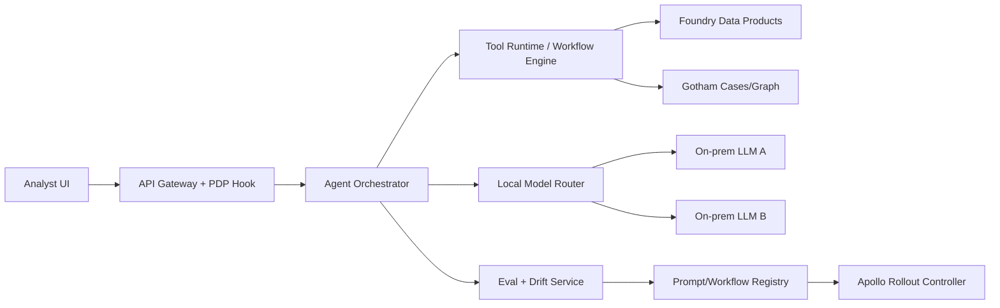

# ClearGlassInc Artemis — Local, Restricted-Network AI Assistant Blueprint

## System Architecture

### 1) Trust-Zone Topology (Air-gapped/Constrained)
- **Zone 0 (Operator Endpoints):** Analyst web UI + secure thin client.
- **Zone 1 (Mission App Plane):** API Gateway, orchestration services, workflow engine.
- **Zone 2 (Data Plane):** Foundry data products, ontology services, feature/eval stores.
- **Zone 3 (Model Plane):** Local inference cluster (on-prem GPUs/CPUs), model router.
- **Zone 4 (Control Plane):** Apollo deployment control, policy registry, immutable audit.

**Hard rule:** No source code, prompts containing secrets, raw intel, or credentials leave Zone 1–3. External egress defaults to DENY.



### 2) Palantir Role Mapping
- **Gotham:** operational graph, investigations, case actions, watchlists.
- **Foundry:** ETL/ELT, ontology-backed data products, pipeline transforms, lineage.
- **AIP:** copilots, agent orchestration, tool-calling, eval harnesses.
- **Apollo:** secure rollout/rollback, staged deployment, runtime config policy.

### 3) Local-Only Assistant Configuration Controls
1. **Network policy:** Kubernetes/CNI deny-all egress except explicit internal CIDRs.
2. **Inference policy:** model endpoints restricted to internal DNS names only.
3. **DLP policy:** redact secrets/Pll/mission tags before model/tool invocation.
4. **Prompt guard policy:** block unsafe contexts from prompt body.
5. **Output policy:** classifier + rules to prevent leakage in generated intel products.

---

## Data and Ontology

### 1) Core Ontology (Foundry)

```python
from pydantic import BaseModel, Field
from datetime import datetime
from typing import List, Dict, Optional

class Provenance(BaseModel):
    source_system: str
    ingest_pipeline: str
    record_hash: str
    first_seen: datetime
    last_seen: datetime
    confidence: float = Field(ge=0, le=1)

class Entity(BaseModel):
    entity_id: str
    entity_type: str  # Person, Org, Device, Location, Event
    labels: List[str]
    attributes: Dict[str, str]
    provenance: Provenance
    clearance: str
    compartments: List[str]

class Relationship(BaseModel):
    rel_id: str
    src_entity_id: str
    dst_entity_id: str
    rel_type: str
    valid_from: datetime
    valid_to: Optional[datetime] = None
    confidence: float = Field(ge=0, le=1)
    mission_context: str
```

### 2) Ontology-Driven Behavior
- Agents read permissions + mission context off ontology edges before tool execution.
- Query plans are generated with ABAC constraints baked in (need-to-know by default).
- Every entity mutation writes lineage and policy decision metadata.

---

## AI and Agent Design

### 1) Agent Classes (AIP)
- **Triage Agent:** prioritize incoming events.
- **Enrichment Agent:** attach entities, provenance, confidence.
- **Correlation Agent:** detect cross-domain links and anomalies.
- **Intel Draft Agent:** produce summaries and action package drafts.
- **Commander Copilot:** asks for approval before high-impact actions.

### 2) Tool Runtime Contract (Python)

```python
from dataclasses import dataclass
from typing import Any, Dict

@dataclass
class ToolRequest:
    tool_name: str
    actor_id: str
    mission_id: str
    args: Dict[str, Any]

@dataclass
class ToolResult:
    ok: bool
    data: Dict[str, Any]
    policy_trace_id: str

class ToolExecutor:
    def __init__(self, pdp, tool_registry):
        self.pdp = pdp
        self.tool_registry = tool_registry

    def run(self, req: ToolRequest) -> ToolResult:
        decision = self.pdp.authorize(
            subject=req.actor_id,
            action=f"tool:{req.tool_name}",
            resource=req.mission_id,
            context=req.args,
        )
        if not decision.allow:
            return ToolResult(ok=False, data={"error": "denied"}, policy_trace_id=decision.trace_id)

        handler = self.tool_registry[req.tool_name]
        out = handler(req.args)
        return ToolResult(ok=True, data=out, policy_trace_id=decision.trace_id)
```

---

## Self-Improvement Loop (Human-Governed)

1. Capture signals: feedback, overrides, outcome labels, false positives/negatives.
2. Build eval sets: mission-specific gold tasks + adversarial safety tests.
3. Propose deltas: prompt/workflow/router updates.
4. Offline score: precision, recall, latency, trust score.
5. Approval gate: operator + AI governance board.
6. Apollo canary rollout.
7. Drift monitor + rollback if SLO/policy breach.

```python
class ImprovementController:
    def propose(self, baseline_cfg, candidate_cfg, eval_suite):
        base = eval_suite.run(baseline_cfg)
        cand = eval_suite.run(candidate_cfg)
        delta = {
            "precision": cand.precision - base.precision,
            "recall": cand.recall - base.recall,
            "latency_ms": cand.p95_latency_ms - base.p95_latency_ms,
            "trust": cand.operator_trust - base.operator_trust,
        }
        return delta

    def approve(self, delta):
        if delta["precision"] < 0: return False
        if delta["recall"] < -0.01: return False
        if delta["latency_ms"] > 120: return False
        if delta["trust"] < 0: return False
        return True
```

---

## Full-Stack Implementation

### Frontend (TypeScript/React)
- Mission dashboard, graph timeline, agent recommendations, approval queue.
- “Why this recommendation?” panel with provenance and policy trace.

### Backend Services (Python/FastAPI)
- `gateway-service`: JWT auth, request shaping, DLP prescan.
- `agent-orchestrator`: state machine + model routing.
- `policy-service`: OPA/Rego PDP with ABAC+RBAC.
- `eval-service`: continuous scoring and regression alerts.
- `audit-service`: append-only event log.

### Streaming/Eventing
- Kafka/NATS topics:
  - `intel.raw.events`
  - `intel.enriched.events`
  - `agent.recommendations`
  - `operator.decisions`
  - `eval.outcomes`

### Retrieval/Search Layer
- Hybrid retrieval: ontology graph + vector index + lexical fallback.
- Retrieval requests include compartment filters and mission scope tokens.

---

## Security and Governance

### 1) Network and Data Exfiltration Protections
- Default deny egress (K8s NetworkPolicy + firewall).
- Internal-only model endpoints.
- Artifact registry mirror inside enclave.
- Token vault + short-lived creds (SPIFFE/SPIRE or equivalent).

### 2) Policy-as-Code (Rego sketch)

```rego
package artemis.authz

default allow = false

allow {
  input.subject.clearance >= input.resource.classification
  input.subject.compartments[_] == input.resource.compartment
  input.action == "tool:open_case"
  input.context.mission_id == input.resource.mission_id
}
```

### 3) Immutable Audit
- Every tool call logs: actor, prompt hash, model hash, retrieval ids, policy trace, outputs.
- Store in WORM/append-only ledger dataset with signed records.

---

## Code Examples

### A) Restricted Model Router

```python
ALLOWED_INTERNAL_MODELS = {
    "intel-summarizer-v4": "http://llm-svc-model-a.model.svc.cluster.local:8080",
    "threat-reasoner-v3": "http://llm-svc-model-b.model.svc.cluster.local:8080",
}

def route_model(task_type: str) -> str:
    mapping = {
        "summarize": "intel-summarizer-v4",
        "reason": "threat-reasoner-v3",
    }
    model = mapping[task_type]
    return ALLOWED_INTERNAL_MODELS[model]
```

### B) DLP Prompt Scrubber

```python
import re

SECRET_PATTERNS = [
    re.compile(r"AKIA[0-9A-Z]{16}"),
    re.compile(r"-----BEGIN (?:RSA|EC|OPENSSH) PRIVATE KEY-----"),
    re.compile(r"(?i)(password|token|secret)\s*[:=]\s*\S+"),
]

def scrub_prompt(text: str) -> str:
    out = text
    for p in SECRET_PATTERNS:
        out = p.sub("[REDACTED_SECRET]", out)
    return out
```

### C) Workflow State Machine

```python
from enum import Enum

class State(str, Enum):
    INGESTED = "ingested"
    TRIAGED = "triaged"
    ENRICHED = "enriched"
    RECOMMENDED = "recommended"
    APPROVED = "approved"
    EXECUTED = "executed"
    CLOSED = "closed"

ALLOWED = {
    State.INGESTED: {State.TRIAGED},
    State.TRIAGED: {State.ENRICHED},
    State.ENRICHED: {State.RECOMMENDED},
    State.RECOMMENDED: {State.APPROVED, State.CLOSED},
    State.APPROVED: {State.EXECUTED},
    State.EXECUTED: {State.CLOSED},
}
```

---

## Scenario Walkthrough (Mission Speed)

1. SIGINT event enters `intel.raw.events`.
2. Triage agent ranks severity high based on ontology-linked entities.
3. Enrichment agent joins historical pattern from Foundry + Gotham graph.
4. Correlation agent detects similarity with prior hostile logistics route.
5. Commander copilot drafts response package with confidence + alternatives.
6. Operator approves action (human-in-the-loop gate).
7. Execution outcome captured (success/failure/collateral/latency).
8. Eval service labels prediction quality and updates benchmark suite.
9. Improvement controller proposes prompt/router update.
10. Governance approves; Apollo canary deploys; monitors drift; rollback ready.

---

## Local Assistant Hardening Checklist (Actionable)

- [ ] Disable public API providers in runtime config.
- [ ] Enforce internal DNS allowlist for model/tool endpoints.
- [ ] Enable DLP scrubber pre-prompt and pre-log.
- [ ] Encrypt at rest (KMS/HSM) and in transit (mTLS).
- [ ] Turn on full prompt/output hashing and immutable audit.
- [ ] Require approval for operational actions.
- [ ] Configure Apollo staged rollouts + one-click rollback.
- [ ] Run weekly adversarial evals and policy regression tests.

This configuration ensures **ClearGlassInc Artemis** operates with high autonomy but controlled self-improvement, strict data locality, and zero-trust mission safety.
