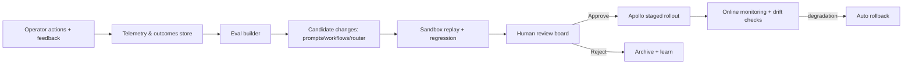

# ClearGlassInc Artemis — Self-Evolving Intelligence Platform (Gotham + Foundry + AIP + Apollo)

**Start intake question:** "What specific case, allegation, government body, or network would you like me to investigate? Please provide available details (names, dates, jurisdictions, documents, or patterns you've observed)."

## System Architecture

```text
[Web UI (React/Next.js)]
   -> [API Gateway + BFF]
      -> [Mission Services (Python/FastAPI)]
      -> [Case Graph Service]
      -> [Alerting + Rules Engine]
      -> [Agent Orchestrator (AIP)]
      -> [Policy Decision Point (OPA)]
      -> [Event Bus (Kafka/PubSub)]
         -> [Foundry Pipelines + Ontology]
         -> [Gotham Operational Views]
         -> [Lakehouse + Vector + Search]
         -> [Eval/Telemetry Warehouse]
      -> [Apollo Deployment Control Plane]
```

- **Gotham**: operational investigations, link analysis, case timelines, watchlists, and alert workflows.
- **Foundry**: data integration, ontology, transforms, quality gates, lineage, and application backends.
- **AIP**: copilots, agents, eval runners, prompt/router registries, and model workflows.
- **Apollo**: secure deployment promotion, staged rollout, rollback, runtime flags, and drift controls.

## Data and Ontology

### Core Ontology Objects

```sql
CREATE TABLE ontology_entity (
  entity_id UUID PRIMARY KEY,
  entity_type TEXT NOT NULL, -- PERSON, ORG, ACCOUNT, CONTRACT, ASSET, EVENT
  canonical_name TEXT,
  confidence NUMERIC(4,3) NOT NULL,
  mission_context TEXT NOT NULL,
  source_count INT NOT NULL,
  first_seen TIMESTAMPTZ NOT NULL,
  last_seen TIMESTAMPTZ NOT NULL,
  classification TEXT NOT NULL,
  caveat_tags TEXT[] NOT NULL,
  lineage_hash TEXT NOT NULL
);

CREATE TABLE ontology_relation (
  relation_id UUID PRIMARY KEY,
  src_entity UUID NOT NULL,
  dst_entity UUID NOT NULL,
  relation_type TEXT NOT NULL, -- OWNS, TRANSFERRED_TO, AWARDED_TO, ADVISED_BY
  valid_from TIMESTAMPTZ,
  valid_to TIMESTAMPTZ,
  confidence NUMERIC(4,3) NOT NULL,
  evidence_refs TEXT[] NOT NULL,
  FOREIGN KEY (src_entity) REFERENCES ontology_entity(entity_id),
  FOREIGN KEY (dst_entity) REFERENCES ontology_entity(entity_id)
);
```

### Ontology Semantics
- **Confidence** is probabilistic and per-assertion, not per-entity only.
- **Temporal state** is bitemporal: event time + ingest time.
- **Lineage** is immutable and cryptographically chained for audit.
- **Permissions** attach to entity + relation + attribute (row/column/entity-level).
- **Mission context** scopes all retrieval and agent actions.

## AI and Agent Design

### Copilots
1. **Analyst Copilot**: case drafting, evidence summarization, contradiction detection.
2. **Commander Copilot**: mission prioritization, risk posture, response options.

### Multi-Agent Workflow
```yaml
agents:
  - triage_agent
  - enrichment_agent
  - correlation_agent
  - legal_policy_agent
  - recommendation_agent
orchestration:
  state_machine: mission_intel_flow_v3
  human_gate:
    required_for:
      - open_case
      - issue_external_notice
      - escalate_watchlist
```

### Tool-Using Agent Contract (Python)
```python
from pydantic import BaseModel
from typing import Literal, Any

class ToolCall(BaseModel):
    tool: Literal["query_graph", "query_docs", "create_case", "propose_action"]
    args: dict[str, Any]
    requires_approval: bool = True

class AgentDecision(BaseModel):
    rationale: str
    confidence: float
    citations: list[str]
    tool_calls: list[ToolCall]
```

## Self-Improvement Loop



### Change Governance
- Every prompt/workflow/router has semantic version and owner.
- No self-modification in production without explicit human approval.
- Canary releases by cohort + mission type.
- Automatic rollback on policy violations, precision drop, or latency breach.

## Full-Stack Implementation

### API Gateway + Backend (FastAPI)
```python
from fastapi import FastAPI, Depends, HTTPException
from models import InvestigationRequest, ActionProposal
from policy import authorize_action
from orchestrator import run_investigation

app = FastAPI(title="ClearGlassInc Artemis Intelligence Gateway")

@app.post("/v1/investigate")
async def investigate(req: InvestigationRequest, user=Depends(...)):
    result = await run_investigation(req, user)
    return result

@app.post("/v1/action/approve")
async def approve_action(action: ActionProposal, user=Depends(...)):
    if not authorize_action(user, action, "APPROVE_OPERATIONAL_ACTION"):
        raise HTTPException(status_code=403, detail="Not authorized")
    return {"status": "approved", "action_id": action.action_id}
```

### Event Handler
```python
async def on_live_event(event: dict):
    await publish("intel.raw", event)
    triage = await triage_agent(event)
    await publish("intel.triaged", triage)
    if triage["risk"] >= 0.80:
        await publish("intel.priority", triage)
```

### Policy-as-Code (OPA/Rego)
```rego
package artemis.authz

default allow = false

allow {
  input.user.clearance >= input.resource.required_clearance
  input.user.mission in input.resource.allowed_missions
  not input.resource.coalition_restricted
}
```

### Workflow State Machine
```python
STATES = ["INGEST", "TRIAGE", "ENRICH", "CORRELATE", "RECOMMEND", "HUMAN_REVIEW", "EXECUTE", "LEARN"]
```

## Security and Governance
- Need-to-know enforcement with ABAC + ReBAC.
- Coalition partitioning with hard boundary tags and query-time denial-by-default.
- Zero-trust service identity (mTLS + workload identity).
- Immutable provenance logs for data, prompts, models, and actions.
- Prompt governance: signed prompt bundles, review metadata, rollout policy.
- Model governance: benchmark minimums, safety eval thresholds, and mission-specific allowlists.

## Code Examples

### Eval Pipeline Skeleton
```python
def evaluate_candidate(candidate_version: str) -> dict:
    offline = run_offline_eval_suite(candidate_version)
    replay = run_historical_replay(candidate_version)
    policy = run_policy_eval(candidate_version)
    return {
        "precision": offline["precision"],
        "recall": offline["recall"],
        "latency_p95": replay["latency_p95"],
        "policy_pass": policy["pass"],
        "decision": "approve" if policy["pass"] and offline["precision"] > 0.86 else "reject"
    }
```

### Model Router
```python
def route_model(task: str, sensitivity: str) -> str:
    if sensitivity == "high" and task in {"legal_check", "action_recommendation"}:
        return "controlled-high-assurance-model"
    if task == "bulk_summarization":
        return "cost-optimized-model"
    return "balanced-model"
```

## Scenario Walkthrough
1. Live cross-border transaction alert enters Foundry ingest.
2. Triage agent scores risk 0.91 and opens a draft Gotham case.
3. Enrichment agent fuses sanctions, contract awards, communications metadata.
4. Correlation agent finds a repeated vendor-politician intermediary pattern.
5. Recommendation agent proposes: freeze further disbursement pending review.
6. Human operator approves with justification and caveat note.
7. Outcome is captured (true positive + response latency + downstream impact).
8. Eval builder detects prompt weakness in false-positive edge cases.
9. New prompt/workflow candidate is generated, replay-tested, and reviewed.
10. Approved candidate is canary deployed via Apollo; metrics improve; version promoted.

### Safety of Continuous Improvement
- Improvement is **bounded optimization**, never autonomous goal rewriting.
- All upgrades are reversible, attributable, and policy-checked before production.
- KPIs: precision, recall, latency, operator trust score, mission impact delta.
