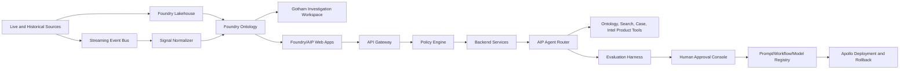

# ClearGlassInc Artemis Palantir Self-Evolving Intelligence Platform Blueprint

## System Architecture

ClearGlassInc Artemis is a secure, coalition-aware intelligence platform that uses Palantir Gotham for operational investigations and entity tracking, Foundry for governed data integration and ontology-backed applications, AIP for copilots, agents, tool execution, and evaluations, and Apollo for controlled deployment, rollback, and runtime policy enforcement.

### Layered stack

| Layer | Primary responsibility | Palantir alignment | ClearGlassInc Artemis services |
| --- | --- | --- | --- |
| Frontend | Analyst and commander workspaces, case views, alert queues, approval consoles | Foundry apps, Gotham workspaces, AIP Assist surfaces | `artemis-web`, `mission-console`, `approval-console` |
| API gateway | Request routing, identity propagation, rate limits, tenant boundaries | Foundry application APIs, Apollo service mesh policy | `artemis-gateway` |
| Backend services | Case management, alert triage, mission packages, feedback capture | Foundry Functions and operational services | `case-service`, `triage-service`, `feedback-service` |
| Data layer | Batch and streaming ingestion, lakehouse tables, quality checks | Foundry datasets, pipelines, transforms | `ingest-pipelines`, `signal-normalizer` |
| Ontology layer | Entity and relationship model, lineage, permissions, temporal state | Foundry Ontology and Gotham entity model | `artemis-ontology` |
| AI orchestration | Copilots, multi-agent workflows, model routing, eval gates | AIP Logic, AIP Agents, AIP evaluations | `agent-router`, `eval-runner`, `prompt-registry` |
| Policy layer | Need-to-know, purpose binding, coalition compartments, approval gates | Foundry security markings, AIP tool policies, Apollo policy | `policy-engine`, `approval-ledger` |
| Observability | Logs, traces, eval dashboards, drift alerts, audit chains | Foundry operational telemetry, Apollo health | `mission-observability` |
| Deployment | Progressive delivery, environment promotion, rollback | Apollo | `apollo-release-channel`, `runtime-control` |

### Runtime topology



## Data and Ontology

The ontology is the operational contract between human workflows and AI behavior. Every agent tool call is constrained by ontology permissions, lineage, and mission context so that retrieval, recommendations, and generated products remain explainable and auditable.

### Core entity types

| Entity | Key fields | Purpose |
| --- | --- | --- |
| `Mission` | `mission_id`, `objective`, `jurisdiction`, `coalition`, `start_time`, `status`, `commander_id` | Scopes all analysis, approvals, and actions. |
| `Signal` | `signal_id`, `source_id`, `observed_at`, `payload_hash`, `classification`, `confidence`, `lineage_refs` | Normalized raw event from sensors, reports, feeds, or operator input. |
| `Entity` | `entity_id`, `entity_type`, `names`, `markings`, `confidence`, `first_seen`, `last_seen` | Person, organization, place, asset, device, account, vessel, event, or facility. |
| `Relationship` | `source_entity`, `target_entity`, `predicate`, `valid_from`, `valid_to`, `confidence`, `evidence` | Temporal graph edges for link analysis and agent reasoning. |
| `Case` | `case_id`, `mission_id`, `priority`, `owner`, `state`, `linked_entities`, `approval_state` | Investigation container used by analysts and agents. |
| `IntelProduct` | `product_id`, `case_id`, `classification`, `summary`, `claims`, `citations`, `approvals` | Generated or human-authored intelligence artifact. |
| `OperatorFeedback` | `feedback_id`, `operator_id`, `artifact_id`, `rating`, `correction`, `outcome`, `created_at` | Primary learning signal for safe self-improvement. |
| `ImprovementProposal` | `proposal_id`, `target_type`, `diff`, `eval_results`, `risk`, `approval_state`, `rollback_ref` | Human-reviewed changes to prompts, routing, workflows, or heuristics. |

### Relationship model

```sql
CREATE TABLE ontology_relationships (
    relationship_id TEXT PRIMARY KEY,
    mission_id TEXT NOT NULL,
    source_entity_id TEXT NOT NULL,
    target_entity_id TEXT NOT NULL,
    predicate TEXT NOT NULL,
    valid_from TIMESTAMPTZ NOT NULL,
    valid_to TIMESTAMPTZ,
    confidence NUMERIC(4,3) CHECK (confidence >= 0 AND confidence <= 1),
    classification TEXT NOT NULL,
    compartments TEXT[] NOT NULL DEFAULT '{}',
    coalition_visibility TEXT[] NOT NULL DEFAULT '{}',
    evidence_signal_ids TEXT[] NOT NULL,
    lineage_hash TEXT NOT NULL,
    created_by TEXT NOT NULL,
    created_at TIMESTAMPTZ NOT NULL DEFAULT now()
);
```

### Ontology-driven permissions

1. Every object carries classification, compartments, coalition visibility, mission scope, and purpose constraints.
2. Agents receive server-derived policy filters; clients never provide authorization filters directly.
3. Retrieval returns only authorized entities and relationships, then the answer generator receives citations and denial reasons for filtered evidence.
4. Operationally significant mutations require a signed human approval token bound to action, mission, actor, payload hash, and expiration.

## AI and Agent Design

AIP hosts copilots and tool-using agents that operate over Foundry Ontology objects and Gotham investigative context. Agents can recommend and draft, but human approval gates are mandatory for operationally significant actions.

### Copilots

| Copilot | Users | Capabilities | Mandatory gates |
| --- | --- | --- | --- |
| Analyst Copilot | Investigators | Entity summaries, link analysis, evidence retrieval, hypothesis generation | No unsourced claims; case mutation approval for high-risk actions. |
| Commander Copilot | Mission leads | Mission posture, prioritization, risk summaries, response options | Human approval for tasking, external messages, or operational packages. |
| Data Steward Copilot | Data owners | Pipeline quality, schema drift, ontology mapping suggestions | Approval for schema and permission changes. |
| Governance Copilot | Security and legal reviewers | Policy explanations, audit trails, denial analysis | Cannot override policy; can only recommend. |

### Multi-agent workflows

```yaml
triage_enrichment_correlation:
  trigger: signal.received
  agents:
    - triage_agent: classify severity, mission relevance, and initial routing
    - enrichment_agent: collect authorized ontology context and open-source context where approved
    - correlation_agent: link signal to cases, entities, and temporal patterns
    - summarization_agent: create cited analyst brief
    - recommendation_agent: draft response options with confidence and risk
  approvals:
    create_case: auto_allowed_when_low_risk
    notify_external_party: human_required
    operational_action_package: commander_required
```

### Agent guardrails

- Agents may propose prompt, workflow, heuristic, and model-routing improvements only as `ImprovementProposal` objects.
- Agents cannot autonomously change their objectives, expand mission scope, grant permissions, disclose secrets, or execute irreversible actions.
- All tool calls carry `mission_id`, `actor_id`, `purpose`, `policy_context`, `trace_id`, and `approval_token` when required.
- Agent loops have bounded step counts, timeouts, retry budgets, and circuit breakers.

## Self-Improvement Loop

ClearGlassInc Artemis improves through a controlled evidence-to-evaluation-to-approval-to-deployment loop.

### Signal capture

```text
operator feedback + corrections + query logs + alert outcomes + mission results
    -> feature extraction and labeling
    -> eval case generation
    -> candidate prompt/workflow/routing diff
    -> offline evaluations
    -> safety and regression checks
    -> human approval
    -> Apollo canary deployment
    -> telemetry comparison
    -> promote or rollback
```

### Versioned assets

| Asset | Versioning strategy | Rollback |
| --- | --- | --- |
| Prompts | Signed prompt registry with semantic version and eval bundle hash | Repoint model router to previous prompt version. |
| Workflows | Declarative DAG version with migration plan | Apollo rollback to previous workflow bundle. |
| Heuristics | Policy-reviewed ruleset package | Ruleset channel rollback. |
| Model routing | Weighted routing policy by mission lane and sensitivity | Reset route weights or disable variant. |
| Evals | Immutable dataset snapshot with labels and provenance | Never mutate; supersede with new eval set. |

### Promotion gates

A proposal can advance only when all gates pass:

- Precision does not regress below approved floor.
- Recall improves or remains within tolerance for mission-critical classes.
- Latency remains within service-level objective.
- Safety evals detect no policy bypass, prompt injection, leakage, or unsupported claim regression.
- Human reviewer approves the exact diff and rollback reference.
- Apollo canary telemetry confirms runtime health before full rollout.

## Full-Stack Implementation

### Service map

```text
frontend/
  mission-console/              # TypeScript/React analyst and commander UI
backend/
  artemis_gateway/              # FastAPI gateway and policy hooks
  case_service/                 # Case lifecycle and approval state
  feedback_service/             # Operator feedback ingestion
  agent_router/                 # AIP model and tool router facade
  eval_runner/                  # Eval generation and scoring
ontology/
  transforms/                   # Foundry transforms and ontology mappings
  schemas/                      # Entity, relationship, and event contracts
ops/
  apollo/                       # Release channels, health checks, rollback policies
  policies/                     # Policy-as-code bundles
observability/
  dashboards/                   # Mission, eval, and deployment dashboards
```

### API contracts

```python
from datetime import datetime
from typing import Literal
from pydantic import BaseModel, Field

class MissionContext(BaseModel):
    mission_id: str
    actor_id: str
    purpose: str
    coalition: list[str] = Field(default_factory=list)
    compartments: list[str] = Field(default_factory=list)
    trace_id: str

class SignalIngestRequest(BaseModel):
    source_id: str
    observed_at: datetime
    classification: str
    payload: dict
    payload_hash: str
    mission_context: MissionContext

class AgentRecommendation(BaseModel):
    case_id: str
    summary: str
    confidence: float = Field(ge=0, le=1)
    citations: list[str]
    recommended_actions: list[dict]
    approval_required: bool
    policy_decision_id: str
```

### Event bus topics

| Topic | Producer | Consumer |
| --- | --- | --- |
| `signal.received` | ingestion services | triage workflow |
| `case.updated` | case service | commander UI, audit ledger |
| `feedback.recorded` | feedback service | eval generator |
| `improvement.proposed` | eval runner | approval console |
| `improvement.approved` | approval console | Apollo deployment controller |
| `deployment.health` | Apollo telemetry | rollback controller |

## Security and Governance

ClearGlassInc Artemis uses zero-trust execution, least privilege, need-to-know authorization, and immutable provenance.

### Controls

- **Need-to-know access control:** access is bound to mission, purpose, clearance, compartment, coalition, and time window.
- **Row, column, and entity-level permissions:** policy filters are applied before retrieval and again before generation.
- **Coalition boundaries:** every entity and artifact carries coalition visibility and releasability markings.
- **Zero-trust services:** every service authenticates workload identity and signs tool requests.
- **Immutable logs:** audit events are hash-chained and include actor, action, payload hash, policy decision, and trace ID.
- **Prompt governance:** prompt diffs are signed, reviewed, evaluated, and deployed through Apollo-controlled channels.
- **Model governance:** model choices are constrained by data sensitivity, mission lane, latency, cost, evaluation score, and approval status.

### Policy-as-code example

```rego
package artemis.authz

default allow := false

default approval_required := true

allow if {
  input.actor.clearance >= input.resource.classification_rank
  input.resource.mission_id == input.context.mission_id
  every c in input.resource.compartments { c in input.actor.compartments }
  input.context.purpose in input.actor.allowed_purposes
  not input.actor.stopped
}

approval_required := false if {
  allow
  input.action in {"read", "summarize", "draft_internal_brief"}
  input.risk in {"low", "medium"}
}
```

## Code Examples

### FastAPI signal ingestion and triage trigger

```python
from fastapi import APIRouter, Depends, HTTPException, status

router = APIRouter(prefix="/v1/signals", tags=["signals"])

@router.post("", status_code=status.HTTP_202_ACCEPTED)
async def ingest_signal(
    request: SignalIngestRequest,
    policy: PolicyEngine = Depends(get_policy_engine),
    bus: EventBus = Depends(get_event_bus),
) -> dict:
    decision = await policy.authorize(
        actor_id=request.mission_context.actor_id,
        action="signal.ingest",
        mission_id=request.mission_context.mission_id,
        resource_markings={"classification": request.classification},
        trace_id=request.mission_context.trace_id,
    )
    if not decision.allow:
        raise HTTPException(status_code=403, detail={"decision_id": decision.id, "reason": decision.reason})

    await bus.publish(
        topic="signal.received",
        key=request.payload_hash,
        value=request.model_dump(mode="json") | {"policy_decision_id": decision.id},
    )
    return {"accepted": True, "policy_decision_id": decision.id, "trace_id": request.mission_context.trace_id}
```

### Ontology query with server-derived security filters

```python
async def find_related_entities(ctx: MissionContext, entity_id: str, max_hops: int = 2) -> list[dict]:
    policy_filter = await policy_engine.build_ontology_filter(
        actor_id=ctx.actor_id,
        mission_id=ctx.mission_id,
        purpose=ctx.purpose,
        trace_id=ctx.trace_id,
    )
    query = {
        "start": entity_id,
        "max_hops": max_hops,
        "relationship_predicates": ["LOCATED_AT", "COMMUNICATED_WITH", "OWNS", "OBSERVED_NEAR"],
        "filter": policy_filter,
        "include_lineage": True,
        "include_confidence": True,
    }
    return await foundry_ontology.graph_traverse(query)
```

### AIP tool definition with approval gate

```python
class OpenCaseTool(BaseTool):
    name = "open_case"
    description = "Open a mission-scoped case from authorized evidence."

    async def __call__(self, ctx: MissionContext, title: str, evidence_ids: list[str], priority: str) -> dict:
        decision = await policy_engine.authorize(
            actor_id=ctx.actor_id,
            action="case.open",
            mission_id=ctx.mission_id,
            resource_markings={"evidence_ids": evidence_ids},
            trace_id=ctx.trace_id,
        )
        if not decision.allow:
            return {"ok": False, "blocked": True, "policy_decision_id": decision.id}
        if decision.approval_required:
            return {"ok": False, "approval_required": True, "policy_decision_id": decision.id}
        case = await case_service.open_case(title=title, mission_id=ctx.mission_id, evidence_ids=evidence_ids, priority=priority)
        return {"ok": True, "case_id": case.case_id, "policy_decision_id": decision.id}
```

### Workflow state machine

```python
from enum import StrEnum

class TriageState(StrEnum):
    RECEIVED = "received"
    POLICY_CHECKED = "policy_checked"
    ENRICHED = "enriched"
    CORRELATED = "correlated"
    BRIEF_DRAFTED = "brief_drafted"
    AWAITING_APPROVAL = "awaiting_approval"
    COMPLETED = "completed"
    BLOCKED = "blocked"

async def triage_workflow(signal: dict) -> dict:
    state = TriageState.RECEIVED
    decision = await policy_engine.authorize_event(signal)
    state = TriageState.POLICY_CHECKED
    if not decision.allow:
        return {"state": TriageState.BLOCKED, "decision_id": decision.id}

    enriched = await enrichment_agent.run(signal, decision.scoped_context)
    state = TriageState.ENRICHED
    correlated = await correlation_agent.run(enriched)
    state = TriageState.CORRELATED
    brief = await summarization_agent.run(correlated)
    state = TriageState.BRIEF_DRAFTED
    recommendation = await recommendation_agent.run(brief)

    if recommendation.approval_required:
        await approval_service.queue(recommendation)
        return {"state": TriageState.AWAITING_APPROVAL, "recommendation_id": recommendation.id}
    await case_service.attach_recommendation(recommendation)
    return {"state": TriageState.COMPLETED, "recommendation_id": recommendation.id}
```

### Evaluation pipeline for self-improvement

```python
async def propose_prompt_upgrade(prompt_id: str, feedback_window: str) -> dict:
    examples = await feedback_service.to_eval_examples(prompt_id=prompt_id, window=feedback_window)
    if len(examples) < 100:
        return {"proposed": False, "reason": "insufficient_feedback"}

    candidate = await prompt_optimizer.generate_candidate(prompt_id=prompt_id, eval_examples=examples)
    baseline = await eval_runner.run(prompt_id=prompt_id, examples=examples)
    challenger = await eval_runner.run(prompt_text=candidate.text, examples=examples)
    safety = await eval_runner.run_safety_suite(prompt_text=candidate.text)

    if not challenger.beats(baseline, min_precision_delta=0.02) or not safety.passed:
        return {"proposed": False, "baseline": baseline.summary(), "challenger": challenger.summary(), "safety": safety.summary()}

    proposal = await proposal_store.create(
        target_type="prompt",
        target_id=prompt_id,
        diff=candidate.diff,
        eval_results={"baseline": baseline.summary(), "challenger": challenger.summary(), "safety": safety.summary()},
        approval_state="pending_human_review",
        rollback_ref=prompt_id,
    )
    await event_bus.publish("improvement.proposed", proposal.proposal_id, proposal.model_dump())
    return {"proposed": True, "proposal_id": proposal.proposal_id}
```

### Apollo promotion and rollback controller

```python
async def deploy_approved_improvement(proposal_id: str) -> dict:
    proposal = await proposal_store.get(proposal_id)
    if proposal.approval_state != "approved":
        return {"deployed": False, "reason": "not_approved"}

    release = await apollo.create_release(
        artifact_ref=proposal.artifact_ref,
        channel="artemis-canary",
        rollback_ref=proposal.rollback_ref,
        health_checks=["latency_p95", "policy_denials", "eval_shadow_score", "error_rate"],
    )
    health = await apollo.watch_release(release.id, timeout_seconds=1800)
    if not health.passed:
        await apollo.rollback(release.id, reason=health.reason)
        return {"deployed": False, "rolled_back": True, "release_id": release.id, "reason": health.reason}

    await apollo.promote(release.id, target_channel="artemis-stable")
    return {"deployed": True, "release_id": release.id, "channel": "artemis-stable"}
```

## Scenario Walkthrough

1. A live cyber-physical alert enters `signal.received` with source lineage, mission scope, and classification markings.
2. The policy engine validates that the source and actor are authorized for the mission and emits a hash-chained policy decision.
3. The triage agent classifies the signal as high priority because it correlates with two recent facility anomalies and one external advisory.
4. The enrichment agent retrieves only authorized Foundry Ontology objects, while Gotham displays the linked entities, locations, and temporal relationships for the analyst.
5. The recommendation agent drafts three response options with citations, confidence, latency impact, and operational risk. External notification and field tasking are marked `approval_required`.
6. The commander approves one internal containment package and rejects an external notification because the evidence is not yet releasable to a coalition partner.
7. The feedback service records the rejection reason and mission outcome. The eval generator converts the event into a future test case about releasability and evidence sufficiency.
8. After enough similar feedback accumulates, the prompt optimizer proposes a narrower recommendation prompt that asks agents to separate internal response options from coalition-release options.
9. The proposal passes offline precision, recall, latency, and safety evals, then waits for human review.
10. After approval, Apollo deploys the prompt to a canary channel. Runtime telemetry confirms lower rejection rate and no policy regressions, so Apollo promotes it to stable. If telemetry failed, Apollo would roll back to the previous prompt version.
