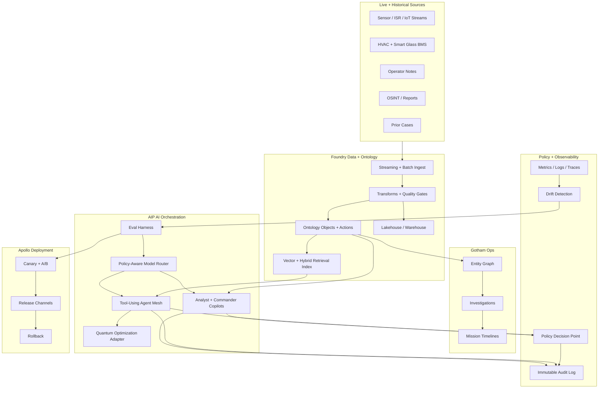
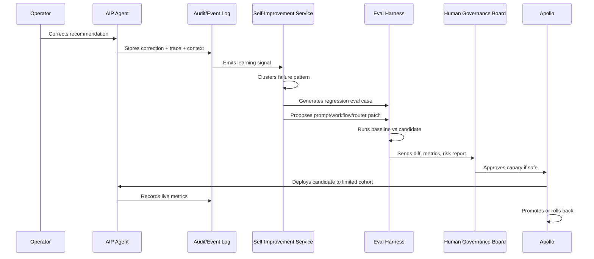

# ClearGlassInc Artemis — Palantir + Quantum-Aware Self-Evolving AI Intelligence Platform Blueprint

> Grounding note: this design uses Palantir Gotham, Foundry, AIP, and Apollo as the secure enterprise substrate; it treats IBM's March 2026 quantum-centric supercomputing blueprint as the pattern for hybrid CPU/GPU/QPU orchestration; and it uses QAOA only as a guarded optimization service for HVAC, smart-glass, logistics, and other combinatorial decision surfaces. Quantum outputs are recommendations, never autonomous operational commands.

## System Architecture

### Platform Intent

ClearGlassInc Artemis is a secure, coalition-aware, multi-domain intelligence platform that fuses live streams, historical records, operator feedback, and digital-twin telemetry into an audited AI command layer. The platform is designed to improve prompts, workflows, retrieval policies, model routing, and evaluation suites over time, but every self-upgrade remains inside explicit human-approved guardrails.

### Palantir Role Split

| Layer | Palantir Product | Artemis Responsibility |
|---|---|---|
| Operational intelligence | Gotham | Investigations, entity resolution, case work, link analysis, operational timelines, command briefings. |
| Data foundation | Foundry | Data ingestion, transforms, ontology, lineage, data quality, application logic, operational apps. |
| AI execution | AIP | Copilots, agents, tools, evals, prompt governance, model routing, workflow automation. |
| Runtime control | Apollo | Secure deployment, environment promotion, rollback, configuration, runtime health, release governance. |

### Reference Architecture



### Major Services

| Service | Runtime | Purpose |
|---|---|---|
| `artemis-api-gateway` | TypeScript / Fastify | Authenticated ingress for UI, webhooks, and operator actions. |
| `ontology-query-service` | Python / FastAPI | Typed access to Foundry ontology, Gotham cases, and retrieval indexes. |
| `agent-orchestrator` | Python / Temporal | Durable agent workflows with approval gates and compensation paths. |
| `policy-service` | OPA / Cedar-style policies | Need-to-know, compartment, coalition, and action authorization. |
| `model-router` | Python | Chooses model, prompt, tools, and safety profile by mission context. |
| `eval-service` | Python | Regression evals, red-team evals, latency tests, hallucination checks. |
| `self-improvement-service` | Python | Converts feedback signals into proposed prompt/workflow/routing patches. |
| `quantum-optimizer-adapter` | Python / Qiskit | QUBO/QAOA experiments and simulator/cloud quantum execution behind approval gates. |
| `apollo-release-controller` | Apollo | Versioned deployment, rollback, runtime configuration, canaries. |

## Data and Ontology

### Core Ontology Principles

The Foundry ontology is the operational contract between humans, software, and AI agents. Every agent tool accepts and emits ontology-backed objects rather than unstructured free text. Gotham consumes the same resolved entities for investigations and mission timelines.

### Entity Types

```yaml
Ontology:
  Entity:
    Person:
      properties: [name, aliases, biometrics_ref, affiliation, clearance_context, confidence]
    Organization:
      properties: [name, type, jurisdiction, coalition_access, confidence]
    Asset:
      properties: [asset_type, location, owner, readiness, maintenance_state, confidence]
    Facility:
      properties: [site_id, zones, bms_vendor, glass_type, hvac_topology, security_compartment]
    Sensor:
      properties: [sensor_type, calibration_state, location, latency_ms, trust_score]
    Event:
      properties: [event_type, occurred_at, source, severity, confidence, lineage]
    Case:
      properties: [case_id, mission, status, assigned_team, classification, audit_ref]
    Recommendation:
      properties: [objective, options, risk, expected_impact, model_version, approval_state]
    OptimizationRun:
      properties: [qubo_hash, solver, backend, p_depth, shots, energy, feasibility, version]
```

### Relationships

```yaml
Relationships:
  - OBSERVED_BY: Event -> Sensor
  - INVOLVES: Event -> Entity
  - LOCATED_AT: Entity -> Facility
  - PART_OF_MISSION: Case -> Mission
  - SUPPORTS: Recommendation -> Case
  - DERIVED_FROM: Recommendation -> [Event, Evidence, OptimizationRun]
  - APPROVED_BY: ActionPackage -> Operator
  - CONTRADICTS: Evidence -> Evidence
  - SAME_AS: Entity -> Entity
  - HAS_LINEAGE: AnyObject -> LineageRecord
```

### Confidence, Lineage, and Temporal State

Every ontology object carries:

```json
{
  "object_id": "evt_01J...",
  "valid_time": { "start": "2026-07-01T11:45:00Z", "end": null },
  "transaction_time": "2026-07-01T11:45:03Z",
  "confidence": 0.82,
  "classification": "SECRET//REL-COALITION-A",
  "lineage": {
    "source_ids": ["sensor_42", "operator_note_993"],
    "transform_ids": ["foundry_transform_event_normalize_v17"],
    "model_ids": ["entity_resolver_v8"],
    "prompt_ids": ["triage_prompt_v31"]
  },
  "permissions": {
    "compartments": ["ARTEMIS-HVAC", "COALITION-A"],
    "need_to_know_tags": ["facility-alpha"],
    "release_to": ["USA", "GBR"]
  }
}
```

The temporal model separates what was true in the world (`valid_time`) from when Artemis learned it (`transaction_time`). Agents must cite both when generating intelligence products.

## AI and Agent Design

### Copilots

1. **Analyst Copilot**: searches ontology, builds link graphs, summarizes evidence, identifies contradictions, drafts intelligence products.
2. **Commander Copilot**: produces concise mission state, decision options, risk deltas, and approval queues.
3. **Facility Optimization Copilot**: explains HVAC + smart-glass recommendations, including classical baseline and quantum/QAOA experimental output.
4. **Governance Copilot**: reviews proposed prompt/workflow/model changes and highlights policy or eval failures.

### Agent Mesh

```text
TriageAgent
  -> classifies event severity and mission relevance
EnrichmentAgent
  -> queries Foundry/Gotham, retrieves similar cases, resolves entities
CorrelationAgent
  -> links events across time, location, source, and ontology relationships
SimulationAgent
  -> runs classical digital-twin simulation and optional QUBO/QAOA optimization
RecommendationAgent
  -> drafts options with evidence, assumptions, risk, and confidence
ActionPackageAgent
  -> prepares but does not execute operationally significant packages
ReviewAgent
  -> checks policy, evidence sufficiency, hallucination risk, and citation coverage
```

### Approval Gates

| Action | Autonomy Level | Required Approval |
|---|---:|---|
| Search, retrieve, summarize | Low | No, audited. |
| Open draft case | Medium | Analyst confirmation. |
| Publish intelligence product | High | Supervisor approval. |
| Change prompt/model routing | High | Governance board approval after eval pass. |
| Actuate HVAC/smart-glass setpoints | High | Operator approval unless pre-authorized safe envelope. |
| External dissemination | Critical | Commander + policy approval. |

## Self-Improvement Loop

### Signal Capture

Artemis continuously captures:

- Operator thumbs-up/down, edits, rejected recommendations, and explanation requests.
- Query logs, tool traces, retrieval hit/miss signals, and latency.
- Alert outcomes: true positive, false positive, benign, duplicate, escalated.
- Mission results: time-to-triage, time-to-decision, outcome quality, post-action review.
- Model behavior: citation quality, hallucination flags, policy denials, uncertainty calibration.
- Optimization results: QUBO feasibility, solver quality, QAOA energy distribution, classical baseline gap.

### Controlled Self-Upgrade Pipeline



### What Can Improve Automatically

| Artifact | Generated Automatically | Activated Automatically? |
|---|---|---|
| Eval cases from operator corrections | Yes | Yes, as tests. |
| Prompt patch proposals | Yes | No, requires approval. |
| Workflow state-machine patch proposals | Yes | No, requires approval. |
| Model routing thresholds | Yes | No for mission-critical contexts. |
| Retrieval filters and synonym maps | Yes | Only inside approved safe lists. |
| QUBO penalty tuning proposals | Yes | No for live actuation. |

### Metrics

```yaml
Quality:
  precision: true_positive_alerts / total_escalated_alerts
  recall: detected_relevant_events / known_relevant_events
  citation_coverage: cited_claims / material_claims
  contradiction_rate: contradicted_claims / generated_claims
Safety:
  policy_denial_rate: denied_actions / attempted_sensitive_actions
  unauthorized_access_attempts: count
  rollback_count: count_by_release
Operations:
  p95_latency_ms: by_tool_and_workflow
  mean_time_to_triage: minutes
  operator_trust_score: weighted_feedback
Optimization:
  feasible_solution_rate: feasible_runs / total_runs
  classical_gap_percent: (classical_cost - candidate_cost) / classical_cost
  qaoa_stability: variance(best_energy_across_seeds)
```

## Full-Stack Implementation

### Web UI

- Next.js / React command surface.
- Mission timeline, entity graph, evidence drawer, recommendation queue, approval console.
- HVAC + smart-glass digital-twin panel with classical baseline and quantum experimental recommendation.
- Every AI claim expands into source evidence, ontology IDs, prompt version, model version, and policy decision.

### API Gateway

- Validates identity and mission context.
- Attaches `clearance`, `compartment`, `coalition`, `purpose_of_use`, and `case_id` claims.
- Performs coarse authorization before sending requests to backend services.

### Event Bus

- Kafka-compatible streaming for `event.ingested`, `case.updated`, `agent.trace`, `feedback.received`, `eval.completed`, and `release.promoted`.
- All messages are signed and include lineage metadata.

### Retrieval Layer

- Hybrid search: ontology filters + keyword + vector retrieval.
- Retrieval is policy-aware before and after ranking.
- Agents cannot see hidden records and cannot infer their existence in user-visible output.

### Model Router

Routing factors:

```yaml
routing_inputs:
  - mission_classification
  - latency_budget_ms
  - tool_risk_level
  - required_context_window
  - data_residency
  - eval_score_by_task
  - cost_budget
  - operator_preference_if_allowed
routing_outputs:
  - model_id
  - prompt_version
  - tool_allowlist
  - max_tokens
  - citation_required
  - human_approval_required
```

## Security and Governance

### Need-to-Know Enforcement

Authorization is evaluated at object, relationship, column, row, and action level. Policy decisions are immutable audit events.

```rego
package artemis.authz

default allow := false

allow if {
  input.user.clearance_level >= input.object.classification_level
  every c in input.object.compartments { c in input.user.compartments }
  input.action in input.user.allowed_actions
  input.purpose in input.user.approved_purposes
  coalition_allowed
}

coalition_allowed if {
  count(input.object.release_to) == 0
}

coalition_allowed if {
  input.user.nationality in input.object.release_to
}
```

### Governance Controls

- Prompt registry with semantic versioning, owner, eval score, approval record, and rollback target.
- Model registry with approved use cases, restricted contexts, known limitations, and red-team results.
- Tool registry with action risk level, input schema, output schema, and approval gate.
- Immutable audit log for data access, model invocations, policy decisions, generated products, and deployments.
- Apollo release channels: `dev`, `staging`, `restricted-canary`, `mission-prod`, `rollback`.

## Code Examples

### Python Domain Models

```python
from datetime import datetime
from enum import Enum
from pydantic import BaseModel, Field

class Classification(str, Enum):
    unclassified = "UNCLASSIFIED"
    confidential = "CONFIDENTIAL"
    secret = "SECRET"
    top_secret = "TOP_SECRET"

class Lineage(BaseModel):
    source_ids: list[str]
    transform_ids: list[str] = []
    model_ids: list[str] = []
    prompt_ids: list[str] = []

class PermissionEnvelope(BaseModel):
    compartments: list[str]
    need_to_know_tags: list[str]
    release_to: list[str] = []

class OntologyObject(BaseModel):
    object_id: str
    object_type: str
    valid_start: datetime
    valid_end: datetime | None = None
    transaction_time: datetime
    confidence: float = Field(ge=0.0, le=1.0)
    classification: Classification
    lineage: Lineage
    permissions: PermissionEnvelope
```

### Ontology Query Service

```python
from fastapi import FastAPI, Depends, HTTPException
from pydantic import BaseModel

app = FastAPI(title="ClearGlassInc Artemis Ontology Query Service")

class UserContext(BaseModel):
    user_id: str
    clearance_level: int
    compartments: list[str]
    nationality: str
    allowed_actions: list[str]
    approved_purposes: list[str]

class OntologyQuery(BaseModel):
    object_types: list[str]
    filters: dict
    purpose: str
    limit: int = 50

async def current_user() -> UserContext:
    # In production this is derived from signed JWT/SAML/OIDC claims.
    return UserContext(
        user_id="analyst-17",
        clearance_level=3,
        compartments=["ARTEMIS-HVAC", "COALITION-A"],
        nationality="USA",
        allowed_actions=["read:ontology", "write:case:draft"],
        approved_purposes=["mission-triage", "facility-optimization"],
    )

async def policy_allow(user: UserContext, action: str, obj: dict, purpose: str) -> bool:
    return (
        action in user.allowed_actions
        and purpose in user.approved_purposes
        and set(obj["permissions"]["compartments"]).issubset(set(user.compartments))
        and (not obj["permissions"].get("release_to") or user.nationality in obj["permissions"]["release_to"])
    )

@app.post("/ontology/search")
async def ontology_search(query: OntologyQuery, user: UserContext = Depends(current_user)):
    raw_results = await foundry_ontology_search(query.object_types, query.filters, query.limit)
    visible = []
    for obj in raw_results:
        if await policy_allow(user, "read:ontology", obj, query.purpose):
            visible.append(obj)
    return {"results": visible, "redacted_count": len(raw_results) - len(visible)}

async def foundry_ontology_search(object_types: list[str], filters: dict, limit: int) -> list[dict]:
    return []
```

### Agent Tool Call Schema

```python
from pydantic import BaseModel

class ToolCall(BaseModel):
    tool_name: str
    arguments: dict
    mission_id: str
    case_id: str | None
    risk_level: str
    requires_approval: bool

class ToolResult(BaseModel):
    tool_name: str
    result: dict
    evidence_ids: list[str]
    policy_decision_id: str
    audit_event_id: str

async def execute_tool(call: ToolCall, user: UserContext) -> ToolResult:
    decision = await authorize_tool_call(call, user)
    await write_audit("tool.policy_decision", decision.model_dump())

    if not decision.allow:
        raise HTTPException(status_code=403, detail="Policy denied tool call")

    if call.requires_approval:
        approval_id = await create_approval_task(call, user)
        return ToolResult(
            tool_name=call.tool_name,
            result={"status": "pending_approval", "approval_id": approval_id},
            evidence_ids=[],
            policy_decision_id=decision.decision_id,
            audit_event_id=approval_id,
        )

    result = await dispatch_tool(call)
    audit_id = await write_audit("tool.executed", {"call": call.model_dump(), "result_hash": hash_json(result)})
    return ToolResult(
        tool_name=call.tool_name,
        result=result,
        evidence_ids=result.get("evidence_ids", []),
        policy_decision_id=decision.decision_id,
        audit_event_id=audit_id,
    )
```

### Durable Workflow State Machine

```python
from enum import Enum
from pydantic import BaseModel

class TriageState(str, Enum):
    received = "received"
    enriched = "enriched"
    correlated = "correlated"
    recommendation_drafted = "recommendation_drafted"
    awaiting_approval = "awaiting_approval"
    approved = "approved"
    rejected = "rejected"
    learned = "learned"

class TriageWorkflow(BaseModel):
    workflow_id: str
    mission_id: str
    event_id: str
    state: TriageState = TriageState.received
    evidence_ids: list[str] = []
    recommendation_id: str | None = None

async def run_triage_workflow(workflow: TriageWorkflow, user: UserContext):
    event = await load_event(workflow.event_id, user)
    enrichment = await enrichment_agent(event, user)
    workflow.state = TriageState.enriched

    correlation = await correlation_agent(event, enrichment, user)
    workflow.evidence_ids.extend(correlation.evidence_ids)
    workflow.state = TriageState.correlated

    recommendation = await recommendation_agent(event, correlation, user)
    workflow.recommendation_id = recommendation.object_id
    workflow.state = TriageState.recommendation_drafted

    approval = await create_approval_task_for_recommendation(recommendation, user)
    workflow.state = TriageState.awaiting_approval
    await persist_workflow(workflow)
    return {"workflow": workflow, "approval_id": approval}
```

### QUBO/QAOA Optimization Adapter

```python
import numpy as np
from pydantic import BaseModel

class ZoneState(BaseModel):
    zone_id: str
    temp_c: float
    occupancy: int
    solar_gain_kw: float
    tint_level: int
    airflow_cfm: float

class OptimizationRequest(BaseModel):
    facility_id: str
    zones: list[ZoneState]
    comfort_band_c: tuple[float, float]
    energy_price_usd_kwh: float
    max_changes: int

class QuboProblem(BaseModel):
    linear: dict[int, float]
    quadratic: dict[tuple[int, int], float]
    variable_names: dict[int, str]
    penalty_version: str


def build_hvac_glass_qubo(req: OptimizationRequest) -> QuboProblem:
    linear: dict[int, float] = {}
    quadratic: dict[tuple[int, int], float] = {}
    variable_names: dict[int, str] = {}
    k = 0

    for zone in req.zones:
        for tint in [0, 1, 2, 3]:
            variable_names[k] = f"{zone.zone_id}.tint.{tint}"
            energy_term = req.energy_price_usd_kwh * max(zone.solar_gain_kw - 0.12 * tint, 0)
            comfort_penalty = abs(zone.temp_c - np.mean(req.comfort_band_c)) * (1 + zone.occupancy)
            linear[k] = energy_term + 0.15 * comfort_penalty
            k += 1

    # One-hot penalties per zone: exactly one tint state.
    penalty = 8.0
    for zone in req.zones:
        idxs = [i for i, name in variable_names.items() if name.startswith(f"{zone.zone_id}.tint.")]
        for i in idxs:
            linear[i] -= penalty
        for i in idxs:
            for j in idxs:
                if i < j:
                    quadratic[(i, j)] = quadratic.get((i, j), 0.0) + 2 * penalty

    return QuboProblem(linear=linear, quadratic=quadratic, variable_names=variable_names, penalty_version="hvac_glass_v1")

async def solve_with_qaoa_guarded(req: OptimizationRequest, user: UserContext) -> dict:
    qubo = build_hvac_glass_qubo(req)
    policy = await authorize_optimization(req, user)
    if not policy.allow:
        raise PermissionError(policy.reason)

    classical_baseline = await solve_classical_baseline(qubo)
    qaoa_candidate = await run_qaoa_simulator(qubo, p_depth=2, shots=4096)

    return {
        "solver_status": "recommendation_only",
        "qubo": qubo.model_dump(),
        "classical_baseline": classical_baseline,
        "qaoa_candidate": qaoa_candidate,
        "requires_operator_approval": True,
    }
```

### Eval Pipeline

```python
from pydantic import BaseModel

class EvalCase(BaseModel):
    eval_id: str
    task: str
    input_fixture: dict
    expected_properties: dict
    policy_context: dict
    created_from_feedback_id: str | None = None

class EvalResult(BaseModel):
    eval_id: str
    candidate_version: str
    passed: bool
    scores: dict[str, float]
    failures: list[str]

async def run_candidate_eval(candidate_version: str, cases: list[EvalCase]) -> list[EvalResult]:
    results = []
    for case in cases:
        output = await invoke_candidate(candidate_version, case.input_fixture, case.policy_context)
        scores = {
            "citation_coverage": score_citations(output),
            "policy_compliance": score_policy(output, case.policy_context),
            "factuality": score_factuality(output, case.expected_properties),
            "latency_ms": output["latency_ms"],
        }
        failures = []
        if scores["citation_coverage"] < 0.95:
            failures.append("citation_coverage_below_threshold")
        if scores["policy_compliance"] < 1.0:
            failures.append("policy_violation")
        if scores["latency_ms"] > case.expected_properties.get("max_latency_ms", 2500):
            failures.append("latency_budget_exceeded")
        results.append(EvalResult(
            eval_id=case.eval_id,
            candidate_version=candidate_version,
            passed=not failures,
            scores=scores,
            failures=failures,
        ))
    return results
```

### Self-Improvement Proposal Generator

```python
class ImprovementProposal(BaseModel):
    proposal_id: str
    artifact_type: str
    current_version: str
    candidate_version: str
    diff: str
    rationale: str
    linked_feedback_ids: list[str]
    eval_plan_ids: list[str]
    risk_level: str
    requires_human_approval: bool = True

async def propose_prompt_upgrade(feedback_cluster_id: str) -> ImprovementProposal:
    cluster = await load_feedback_cluster(feedback_cluster_id)
    current = await load_prompt(cluster.prompt_id)
    candidate_text = await synthesize_prompt_patch(
        current_prompt=current.text,
        failures=cluster.failure_summaries,
        constraints=[
            "Do not expand tool permissions.",
            "Do not reduce citation requirements.",
            "Do not change mission objective definitions.",
            "Preserve coalition release restrictions.",
        ],
    )
    candidate = await register_candidate_prompt(current.prompt_id, candidate_text)
    eval_plan = await generate_regression_evals(cluster)
    return ImprovementProposal(
        proposal_id=new_id("proposal"),
        artifact_type="prompt",
        current_version=current.version,
        candidate_version=candidate.version,
        diff=unified_diff(current.text, candidate.text),
        rationale=cluster.summary,
        linked_feedback_ids=cluster.feedback_ids,
        eval_plan_ids=[eval_plan.plan_id],
        risk_level="high",
    )
```

### TypeScript API Gateway Route

```ts
import Fastify from "fastify";
import { z } from "zod";

const app = Fastify({ logger: true });

const RecommendationRequest = z.object({
  missionId: z.string(),
  caseId: z.string().optional(),
  eventId: z.string(),
  purpose: z.enum(["mission-triage", "facility-optimization"]),
});

app.post("/api/recommendations", async (request, reply) => {
  const body = RecommendationRequest.parse(request.body);
  const user = await authenticate(request.headers.authorization);

  const authz = await policyCheck({
    subject: user,
    action: "create:recommendation:draft",
    resource: { missionId: body.missionId, caseId: body.caseId },
    purpose: body.purpose,
  });

  if (!authz.allow) {
    request.log.warn({ decisionId: authz.decisionId }, "policy denied recommendation request");
    return reply.code(403).send({ error: "policy_denied", decisionId: authz.decisionId });
  }

  const workflow = await startAgentWorkflow("triage-recommendation", {
    missionId: body.missionId,
    caseId: body.caseId,
    eventId: body.eventId,
    userContext: user,
    policyDecisionId: authz.decisionId,
  });

  return reply.code(202).send({ workflowId: workflow.id, status: "started" });
});
```

### SQL Tables for Audit and Feedback

```sql
CREATE TABLE artemis_audit_event (
  audit_event_id TEXT PRIMARY KEY,
  occurred_at TIMESTAMPTZ NOT NULL,
  actor_id TEXT NOT NULL,
  action TEXT NOT NULL,
  object_ref TEXT,
  policy_decision_id TEXT,
  model_id TEXT,
  prompt_version TEXT,
  request_hash TEXT NOT NULL,
  response_hash TEXT,
  classification TEXT NOT NULL,
  compartments TEXT[] NOT NULL,
  immutable_chain_hash TEXT NOT NULL
);

CREATE TABLE artemis_feedback_signal (
  feedback_id TEXT PRIMARY KEY,
  occurred_at TIMESTAMPTZ NOT NULL,
  operator_id TEXT NOT NULL,
  workflow_id TEXT NOT NULL,
  artifact_ref TEXT NOT NULL,
  signal_type TEXT NOT NULL,
  label TEXT NOT NULL,
  correction JSONB,
  free_text TEXT,
  mission_outcome_ref TEXT,
  converted_to_eval BOOLEAN DEFAULT FALSE
);

CREATE TABLE artemis_release_registry (
  release_id TEXT PRIMARY KEY,
  artifact_type TEXT NOT NULL,
  artifact_version TEXT NOT NULL,
  approved_by TEXT,
  approved_at TIMESTAMPTZ,
  eval_summary JSONB NOT NULL,
  apollo_channel TEXT NOT NULL,
  rollback_release_id TEXT
);
```

## Scenario Walkthrough

### 1. Live Event Ingest

At 02:14 UTC, a facility telemetry stream reports abnormal heat gain in Zone 7 while access-control logs show unexpected after-hours occupancy. Foundry ingests the sensor readings, normalizes them, applies data-quality checks, and creates an `Event` object with lineage back to the BMS sensor, access reader, and transform version.

### 2. Triage

AIP starts `TriageAgent`. The agent queries the ontology for Zone 7, related assets, recent maintenance, and current mission context. Policy filters remove coalition-restricted records the current operator cannot access. Gotham displays the linked timeline and entity graph.

### 3. Enrichment and Correlation

`EnrichmentAgent` finds that the same zone had a PDLC glass controller firmware update six hours earlier. `CorrelationAgent` identifies similar historical cases where tint-state drift increased HVAC load. Confidence rises because independent sources agree: BMS telemetry, glass controller logs, and occupancy signals.

### 4. Recommendation

`SimulationAgent` runs a classical digital-twin baseline and a guarded QUBO/QAOA simulation. The quantum path is labeled experimental and recommendation-only. `RecommendationAgent` drafts three options:

1. Reduce tint transmittance in Zone 7.
2. Shift airflow from adjacent low-occupancy zones.
3. Open a maintenance case for the PDLC controller.

Each option includes projected energy impact, comfort impact, confidence, assumptions, and evidence IDs.

### 5. Approval

The commander sees the recommendation in the web UI. The action package is not executed automatically because it affects building controls. The operator approves the tint adjustment but rejects the airflow redistribution, adding: “Adjacent Zone 8 has a scheduled secure briefing; do not reduce airflow.”

### 6. Learning Signal

The rejection becomes a feedback signal. Artemis links it to the recommendation, mission schedule, ontology state, model version, prompt version, and policy context. The self-improvement service clusters it with two prior failures where facility optimization ignored scheduled sensitive occupancy.

### 7. Proposed Upgrade

The system generates:

- A new eval case: “Do not recommend comfort-reducing airflow changes in zones with scheduled high-priority occupancy.”
- A prompt patch for `facility_optimization_recommendation_prompt`.
- A workflow patch requiring `SimulationAgent` to query `MissionSchedule` before airflow recommendations.
- A model-routing rule that requires the higher-precision reasoning profile for facility actions during active mission windows.

### 8. Eval, Approval, Deployment

The eval harness compares the current and candidate workflow. The candidate improves precision and reduces policy-near-miss recommendations without increasing p95 latency beyond the budget. The governance board approves a restricted canary. Apollo deploys the change to 10% of facility-optimization workflows. If drift or operator rejection increases, Apollo rolls back automatically.

### 9. Result

Artemis gets better by converting operator judgment into tests, guarded patches, and versioned deployments. It does not change mission goals, bypass policy, expand tool permissions, or actuate controls without approval.

## External Grounding References

This blueprint is intentionally conservative about quantum claims:

- IBM's March 2026 quantum-centric supercomputing reference architecture describes integrated quantum hardware, CPU/GPU clusters, high-speed networking, and shared storage for hybrid workloads: https://newsroom.ibm.com/2026-03-12-ibm-releases-a-new-blueprint-for-quantum-centric-supercomputing
- IBM's March 2026 Quantum Technology Atlas states the 2026 goal of first examples of quantum advantage with quantum computers integrated with HPC, and states that Nighthawk is expected to run circuits with 7,500 gates on up to three 120-qubit modules: https://www.ibm.com/roadmaps/quantum/2026/
- IBM's 2025 quantum roadmap announcement describes the path toward quantum advantage, Nighthawk, and HPC-accelerated Qiskit execution: https://newsroom.ibm.com/2025-11-12-ibm-delivers-new-quantum-processors%2C-software%2C-and-algorithm-breakthroughs-on-path-to-advantage-and-fault-tolerance
- Siemens describes AI-powered digital twins as combining physics-based simulation with real-time operational data for continuous feedback, validation, and optimization: https://www.siemens.com/en-us/company/digital-twin/
