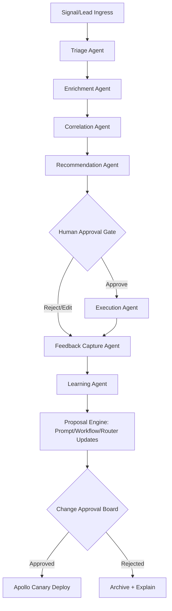

# ClearGlassInc Artemis — Self-Evolving Intelligence + Money Engine Platform (2026)

> **Objective:** Build a secure, coalition-aware, mission-grade intelligence system that also functions as a programmable **revenue engine** (content -> lead -> deal -> delivery -> expansion) with strict human-governed AI self-improvement.

---

## System Architecture

### Palantir Role Precision
- **Gotham**: operational intelligence, investigation graph workflows, entity tracking, case actioning.
- **Foundry**: integration pipelines, ontology, data lineage/provenance, application logic objects, KPIs.
- **AIP**: copilots, agent orchestration, tool-use runtime, eval harnesses, model/prompt routing.
- **Apollo**: continuous delivery control plane, environment policy, canary/promotion/rollback.

### End-to-End Architecture (Mission + Monetization)

```mermaid
flowchart LR
  subgraph UX[User Experience Layer]
    A1[Analyst Console]
    A2[Commander Console]
    A3[Revenue Ops Console]
    A4[Executive KPI Board]
  end

  subgraph EDGE[Edge/API Layer]
    B1[API Gateway + BFF]
    B2[AuthN/AuthZ + Policy Enforcement Point]
    B3[Rate Limiter + Request Signing]
  end

  subgraph APP[Application Services]
    C1[Case Service]
    C2[Entity Graph Service]
    C3[Mission Workflow Service]
    C4[Revenue Workflow Service]
    C5[AI Orchestrator]
    C6[Notification/Comms Service]
  end

  subgraph STREAM[Streaming/Event Mesh]
    D1[Kafka/PubSub Event Bus]
    D2[CDC + Outbox Processors]
  end

  subgraph DATA[Foundry Data Layer]
    E1[Raw + Bronze Datasets]
    E2[Silver Normalized Datasets]
    E3[Gold Ontology Objects]
    E4[Feature Store + Eval Store]
    E5[Revenue Mart + Mission Mart]
  end

  subgraph AI[AIP Intelligence Layer]
    F1[Copilot Runtime]
    F2[Multi-Agent Runtime]
    F3[Model Router]
    F4[Prompt/Workflow Registry]
    F5[Eval Harness + Drift Monitor]
  end

  subgraph OPS[Deployment/Observability]
    G1[Apollo Rings]
    G2[OpenTelemetry + Logs + Metrics]
    G3[Immutable Audit Ledger]
    G4[SIEM/SOAR]
  end

  UX --> EDGE --> APP --> STREAM --> DATA
  APP --> AI
  AI --> APP
  DATA --> AI
  AI --> OPS
  APP --> OPS
  EDGE --> OPS
```



### Runtime Topology
1. **Secure ingress** through API Gateway with mTLS + OIDC.
2. **Policy enforcement** at request-time and data-query-time.
3. **Dual workflow engines**:
   - Mission engine (intel/incident/case).
   - Money engine (content/lead/deal/offer/follow-up).
4. **AIP agents** consume ontology context and call strictly approved tools.
5. **Apollo** controls progressive delivery with policy-guarded promotion.

---

## Data and Ontology

### Ontology Object Types (Foundry)
```text
Mission, Case, AlertSignal, Event, Entity(Person|Org|Asset|Account|Endpoint),
Hypothesis, Indicator, ActionPackage, Evidence, Report,
Lead, AccountOpportunity, Offer, Engagement, Contract, Invoice,
RevenueAttribution, PromptVersion, WorkflowVersion, EvalRun
```

### Core Relationships
```text
TRIGGERED_BY(Case, AlertSignal)
INVOLVES(Case, Entity)
SUPPORTS(Evidence, Hypothesis)
RECOMMENDS(ActionPackage, Case)
GENERATED(Lead, Engagement)
QUALIFIES_TO(Lead, AccountOpportunity)
CONVERTED_TO(AccountOpportunity, Contract)
ATTRIBUTED_TO(RevenueAttribution, WorkflowVersion|PromptVersion|Campaign)
```

### Required Metadata on Every Object
- `classification_level`
- `compartment_tags`
- `coalition_release_tags`
- `confidence_score`
- `lineage_ref`
- `valid_time_start`, `valid_time_end`
- `tx_time_start`, `tx_time_end`
- `policy_scope`
- `mission_context_id`
- `owner_org`

### Temporal + Lineage Semantics
- **Bitemporal correctness**: “what was true” vs “when system learned it.”
- **Version chains** for ontology and AI assets.
- **Lineage graph** records source connectors, transforms, model hash, prompt hash, operator edits.

### Why Ontology Drives Agent Behavior
Agents do not reason over raw tables directly. They reason over ontology objects with enforced context:
1. permissions-filtered views,
2. confidence-aware retrieval,
3. mission-specific relationship traversal,
4. deterministic provenance references in outputs.

---

## AI and Agent Design

### Copilot Roles
- **Analyst Copilot**: hypothesis generation, graph explanation, report drafting with evidence citations.
- **Commander Copilot**: recommendation quality ranking, risk/impact simulation, action readiness.
- **Revenue Copilot**: lead scoring, offer recommendation, follow-up timing, churn-risk prediction.

### Multi-Agent Graph


### Tooling Contract (AIP)
Allowed tools are explicit and policy-bound:
- `tool.query_ontology`
- `tool.open_or_update_case`
- `tool.generate_intel_brief`
- `tool.score_lead`
- `tool.create_followup_sequence`
- `tool.prepare_action_package`
- `tool.request_approval`

Any action with operational or legal impact requires a signed `approval_token` from authorized human roles.

---

## Self-Improvement Loop

### Signal Capture
- operator corrections (entity merge/split, recommendation edits)
- user acceptance/rejection of AI answers
- alert outcomes (TP/FP/FN)
- mission outcomes (time-to-detect, time-to-decision, mission completion)
- revenue outcomes (lead-to-meeting, meeting-to-close, ARPA, payback)
- runtime outcomes (latency, tool errors, fallback rate)

### Improvement Pipeline
1. **Collect** telemetry into Foundry datasets.
2. **Synthesize eval sets**:
   - mission replay set,
   - adversarial set,
   - revenue attribution set.
3. **Run candidate variants** (prompt/workflow/model-router policies).
4. **Compute gates** (precision, recall, latency, trust, revenue delta).
5. **Generate change proposal** with blast radius estimate.
6. **Human review** (Change Approval Board + security sign-off if policy-affecting).
7. **Apollo canary** (`5% -> 20% -> 50% -> 100%`).
8. **Auto-rollback** on SLO/SLA breach.

### Guardrails
- AI cannot mutate mission goals.
- AI cannot self-approve policy changes.
- AI cannot add tools to its own permission set.
- all upgrades are immutable, diffable, and reversible.

---

## Full-Stack Implementation

### Frontend (React/TypeScript)
- Mission Timeline + Entity Graph Explorer
- CoPilot Chat with provenance chips
- Action Approval Drawer (risk, legal, policy diffs)
- Revenue Pipeline Board (MQL -> SQL -> Opportunity -> Won)

### API Gateway
- OIDC/JWT verification, mTLS termination
- ABAC context hydration (`missions`, `clearance`, `coalition_tags`)
- request signing + trace id propagation

### Backend Services (Python-first)
- `case_service` (FastAPI)
- `ontology_query_service` (FastAPI + async graph adapters)
- `agent_orchestrator` (AIP runtime integration)
- `revenue_engine_service` (lead scoring + offer automation)
- `policy_service` (OPA sidecar/PDP)

### Event Bus / Streaming
- topics:
  - `intel.signal.ingested`
  - `intel.case.updated`
  - `agent.recommendation.created`
  - `operator.decision.recorded`
  - `revenue.lead.scored`
  - `revenue.opportunity.converted`
  - `ai.proposal.created`

### Lakehouse / Warehouse
- Bronze: raw connectors
- Silver: conformed entities/signals
- Gold: ontology objects + marts
- Eval Store: eval inputs, outputs, scores, regression history

### Search/Retrieval
- Graph traversal (relationship evidence)
- BM25 keyword (deterministic retrieval)
- vector embeddings (semantic recall)
- reranker with policy-aware chunk filtering

### Model Router / Inference
- route by task class (`summarize`, `correlate`, `recommend`, `classify`), latency tier, sensitivity tier
- deterministic fallback graph
- route decision logged with `model_version`, `prompt_version`, `policy_context`

### Monitoring and Evals
- SLOs:
  - p95 latency
  - recommendation precision
  - operator override rate
  - alert false-positive rate
  - revenue per workflow run

---

## Security and Governance

### Need-to-Know + Multi-Level Policy
- ABAC + RBAC hybrid with entity-level ACL materialization.
- row/column/entity filters pushed to query layer.
- coalition boundary enforcement via release tags.

### Zero-Trust Execution
- workload identity, short-lived credentials, mandatory service auth.
- no implicit trust across network segments.

### Provenance + Audit
- immutable event ledger with hash chaining.
- every AI decision includes:
  - prompt hash,
  - model hash,
  - tool call list,
  - data lineage references,
  - approving principal (if applicable).

### Model/Prompt Governance
- registries:
  - approved models,
  - prompt templates,
  - workflow definitions,
  - policy packs.
- promotion requires eval evidence + human signatures.

---

## Code Examples

### 1) Python FastAPI API Gateway Adapter
```python
from fastapi import FastAPI, Depends, HTTPException, Header
from pydantic import BaseModel
from typing import List, Optional
import uuid

app = FastAPI(title="ClearGlassInc Artemis Control API")

class AuthContext(BaseModel):
    user_id: str
    roles: List[str]
    missions: List[str]
    coalition_tags: List[str]
    clearance: int

class QueryIn(BaseModel):
    mission_id: str
    question: str
    classification_level: int


def parse_context(x_user: Optional[str] = Header(default=None)) -> AuthContext:
    # Replace with JWT/OIDC verification in production
    if not x_user:
        raise HTTPException(status_code=401, detail="missing identity")
    return AuthContext(
        user_id=x_user,
        roles=["analyst"],
        missions=["mission-ops-01"],
        coalition_tags=["REL_USA_FVEY"],
        clearance=3,
    )


def enforce_access(ctx: AuthContext, mission_id: str, level: int) -> None:
    if mission_id not in ctx.missions:
        raise HTTPException(status_code=403, detail="mission denied")
    if ctx.clearance < level:
        raise HTTPException(status_code=403, detail="clearance denied")


@app.post("/v1/copilot/query")
async def copilot_query(payload: QueryIn, ctx: AuthContext = Depends(parse_context)):
    enforce_access(ctx, payload.mission_id, payload.classification_level)
    trace_id = str(uuid.uuid4())
    # forward to AI orchestrator with context envelope
    return {"trace_id": trace_id, "answer": "queued", "status": "accepted"}
```

### 2) Python Event Handler (Signal -> Case)
```python
from dataclasses import dataclass
from datetime import datetime, timezone

@dataclass
class SignalEvent:
    signal_id: str
    mission_id: str
    threat_score: float
    source: str


def triage_and_route(event: SignalEvent) -> dict:
    severity = "CRITICAL" if event.threat_score >= 0.9 else "HIGH" if event.threat_score >= 0.75 else "MEDIUM"
    workflow = "wf_critical_response" if severity == "CRITICAL" else "wf_standard_triage"
    return {
        "event": "intel.case.create.requested",
        "at": datetime.now(timezone.utc).isoformat(),
        "payload": {
            "signal_id": event.signal_id,
            "mission_id": event.mission_id,
            "severity": severity,
            "workflow": workflow,
        },
    }
```

### 3) Python Agent Tool Dispatcher with Approval Gate
```python
from typing import Dict, Any

PRIVILEGED_TOOLS = {"tool.prepare_action_package", "tool.create_followup_sequence"}


def execute_tool_call(tool_name: str, args: Dict[str, Any], auth_ctx: Dict[str, Any]) -> Dict[str, Any]:
    if tool_name in PRIVILEGED_TOOLS and not args.get("approval_token"):
        return {"ok": False, "error": "approval_required"}

    allowed = set(auth_ctx.get("allowed_tools", []))
    if tool_name not in allowed:
        return {"ok": False, "error": "tool_not_allowed"}

    # Dispatch to concrete service adapters
    return {"ok": True, "tool": tool_name, "result": {"status": "executed"}}
```

### 4) Python Self-Improvement Evaluator
```python
from dataclasses import dataclass

@dataclass
class EvalMetrics:
    precision: float
    recall: float
    p95_latency_ms: int
    operator_override_rate: float
    revenue_per_1000_events: float


def should_promote(candidate: EvalMetrics, baseline: EvalMetrics) -> bool:
    quality_ok = candidate.precision >= baseline.precision and candidate.recall >= baseline.recall
    latency_ok = candidate.p95_latency_ms <= int(baseline.p95_latency_ms * 1.10)
    trust_ok = candidate.operator_override_rate <= baseline.operator_override_rate
    revenue_ok = candidate.revenue_per_1000_events >= baseline.revenue_per_1000_events
    return quality_ok and latency_ok and trust_ok and revenue_ok
```

### 5) TypeScript UI Approval Action
```ts
export type ApprovalDecision = "APPROVE" | "REJECT" | "EDIT_AND_APPROVE";

export async function submitDecision(caseId: string, decision: ApprovalDecision, notes: string) {
  const res = await fetch(`/api/v1/cases/${caseId}/decision`, {
    method: "POST",
    headers: { "Content-Type": "application/json" },
    body: JSON.stringify({ decision, notes }),
  });

  if (!res.ok) throw new Error(`Decision failed: ${res.status}`);
  return res.json();
}
```

### 6) SQL Metrics Mart (Mission + Revenue)
```sql
CREATE OR REPLACE VIEW mart_artemis_kpis AS
SELECT
  date_trunc('day', event_time) AS day,
  mission_id,
  SUM(CASE WHEN event_type = 'alert.tp' THEN 1 ELSE 0 END) AS true_positive,
  SUM(CASE WHEN event_type = 'alert.fp' THEN 1 ELSE 0 END) AS false_positive,
  AVG(CASE WHEN event_type = 'decision.latency' THEN metric_value END) AS avg_decision_latency_ms,
  SUM(CASE WHEN event_type = 'revenue.closed_won' THEN amount_usd ELSE 0 END) AS closed_won_usd,
  SUM(CASE WHEN event_type = 'lead.created' THEN 1 ELSE 0 END) AS leads_created
FROM fact_artemis_events
GROUP BY 1, 2;
```

### 7) Rego Policy (Coalition + Need-to-Know)
```rego
package artemis.authz

default allow = false

allow {
  input.subject.missions[_] == input.resource.mission_id
  input.subject.clearance >= input.resource.classification_level
  not coalition_violation
}

coalition_violation {
  some tag
  input.resource.coalition_release_tags[tag]
  not input.subject.coalition_tags[tag]
}
```

### 8) Python Proposal Object for Human-Governed Self-Upgrade
```python
from pydantic import BaseModel
from typing import Literal

class ChangeProposal(BaseModel):
    proposal_id: str
    type: Literal["PROMPT", "WORKFLOW", "ROUTER"]
    current_version: str
    candidate_version: str
    expected_precision_delta: float
    expected_latency_delta_ms: int
    expected_revenue_delta_usd: float
    requires_security_review: bool


def route_for_approval(p: ChangeProposal) -> str:
    if p.requires_security_review:
        return "SECURITY_AND_CHANGE_BOARD"
    return "CHANGE_BOARD"
```

---

## Scenario Walkthrough

### T+00:00 — Live Event Enters System
A high-confidence network anomaly arrives on topic `intel.signal.ingested` for `mission-ops-01`. Foundry ingestion normalizes it and emits an ontology `AlertSignal` object with full lineage.

### T+00:03 — Automated Triage
AIP Triage Agent classifies severity as `CRITICAL`, opens a `Case`, and invokes Enrichment Agent for entity joins (endpoint + account + geo + historical campaign overlap).

### T+00:10 — Correlation and Recommendation
Correlation Agent finds relationship paths to known hostile infrastructure and constructs a candidate `ActionPackage`:
1. isolate endpoint segment,
2. rotate privileged credentials,
3. notify coalition partner cell,
4. generate legal/audit artifact package.

### T+00:12 — Human Approval
Commander Copilot presents confidence distribution, expected impact, policy checks, and data provenance links. Commander modifies step 3 scope and approves.

### T+00:13 — Controlled Execution
Execution Agent dispatches approved actions only. All tool calls and outputs are written to immutable audit ledger.

### T+06:00 — Outcome + Learning
Post-incident review marks one indicator as false positive and confirms successful containment. Feedback pipeline creates new eval cases.

### T+08:00 — Proposed Self-Upgrade
Learning Agent proposes:
- prompt v18 -> v19 (better threshold instructions),
- workflow rule adjustment on enrichment branch,
- model router tweak for high-noise subdomain.

CAB approves canary after eval evidence.

### T+10:00 — Apollo Canary + Promotion Decision
Apollo deploys to 5% traffic. Metrics after fixed window:
- precision: +3.8%
- recall: +1.9%
- p95 latency: +4.6% (within budget)
- override rate: -11%
- revenue/1000 workflow events: +7.2%

Policy gates pass, rollout promoted to 100%. If any threshold failed, Apollo would have auto-rolled back to prior signed versions.

---

## Implementation Notes for Build Teams
- Start with two production paths in parallel:
  1. **Mission path** (intel quality, operator trust, latency).
  2. **Money path** (lead conversion, deal velocity, recurring revenue).
- Keep shared ontology contracts so intelligence workflows and revenue workflows reuse the same governed primitives.
- Treat every prompt/workflow/model change as a deployable artifact with CI checks, eval gates, and Apollo rollback safety.
