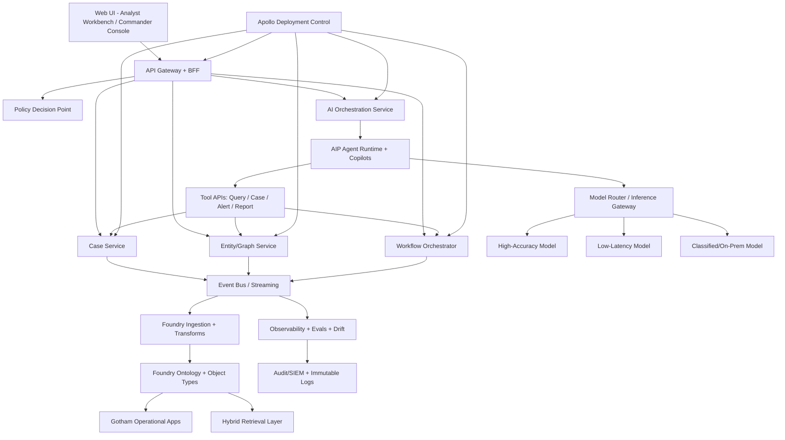

# ClearGlassInc Artemis — Self-Evolving AI Intelligence Platform (Palantir Gotham + Foundry + AIP + Apollo)

## System Architecture

### 1) Mission Context
**ClearGlassInc Artemis** is a coalition-aware intelligence platform designed for secure, real-time operations. It combines:
- **Gotham** for investigations, case management, and entity-centric operational workflows.
- **Foundry** for data integration, ontology modeling, data products, and governed transformation pipelines.
- **AIP (Artificial Intelligence Platform)** for agentic copilots, tool-use workflows, and evaluation-driven optimization.
- **Apollo** for deployment orchestration, environment promotion, policy-gated rollout, and deterministic rollback.

### 2) End-to-End Layered Architecture



### 3) Key Runtime Components
- **Frontend**: React/TypeScript mission UI with map overlays, timeline replay, confidence heatmaps, and AI co-pilot panel.
- **API Gateway/BFF**: Single ingress for UI and partner systems; enforces auth context, redaction, and tenancy.
- **Backend Microservices**:
  - `case-service`: case lifecycle, escalation, and approvals.
  - `graph-service`: ontology-backed graph queries and entity resolution.
  - `workflow-service`: stateful orchestration for triage/enrichment/response packages.
  - `ai-orchestrator`: AIP-facing control plane for agent plans and tool permissions.
- **Data layer**: Foundry pipelines + lakehouse + streaming ingestion + ontology objects.
- **Search layer**: vector + keyword + graph path retrieval with coalition-aware filtering.
- **Policy layer**: policy-as-code (OPA/Rego style) + Foundry permissions + mission rule packs.
- **Observability**: distributed tracing, prompt traces, tool call logs, eval dashboards, and drift monitors.
- **Deployment layer**: Apollo rings (`dev -> staging -> mission-prod`), canary rollout, automated rollback triggers.

---

## Data and Ontology

### 1) Ontology Core (Foundry)
Ontology defines shared semantics used by humans and agents.

#### Entity Types
- `Person`
- `Organization`
- `Asset` (device, vehicle, account, endpoint)
- `Location`
- `Event`
- `Signal` (alert/log/intel report)
- `Case`
- `Mission`
- `Indicator` (threat/risk marker)
- `ActionPackage` (recommended response payload)

#### Relationship Types
- `ASSOCIATED_WITH(Person, Organization)`
- `OWNS(Organization, Asset)`
- `OBSERVED_AT(Entity, Location, time)`
- `TRIGGERED(Signal, Event)`
- `LINKED_TO(Entity, Case)`
- `SUPPORTS(Indicator, Hypothesis)`
- `RECOMMENDS(ActionPackage, Case)`

#### Mandatory Metadata Fields
- `confidence_score` (0.0–1.0)
- `source_reliability` (A-F)
- `lineage` (source system + transformation DAG + model/version)
- `classification` (Unclass/Secret/etc)
- `coalition_tags` (release caveats)
- `effective_time` and `observed_time`
- `permission_scope` (row/entity-level ACL descriptors)

### 2) Temporal + Lineage Model
Every object in ontology keeps:
- **Bitemporal state**: valid time (real-world) + transaction time (system ingestion).
- **Version chain**: immutable object revisions with reason codes (`user_correction`, `model_update`, `source_backfill`).
- **Lineage graph**: full provenance from raw feed -> transform -> model inference -> analyst action.

### 3) Permission Model
- **Need-to-know** as first-class field in ontology.
- **Row/column/entity-level policy** is evaluated at query time.
- **Coalition boundary checks** block cross-release leakage.
- **Attribute-based access control (ABAC)**: role, mission assignment, caveat clearance, geo constraints.

---

## AI and Agent Design

### 1) Copilots (AIP)
- **Analyst Copilot**: asks questions over ontology, drafts summaries, proposes hypotheses with confidence and provenance.
- **Commander Copilot**: risk posture view, action recommendations, what-if simulations, and escalation summaries.

### 2) Multi-Agent Workflow (AIP Agents)
Agents operate under bounded plans with explicit tool contracts:
1. **Triage Agent**: classify incoming signal severity and route path.
2. **Enrichment Agent**: pull related entities/events and confidence-normalize.
3. **Correlation Agent**: graph-path analysis + temporal clustering.
4. **Summarization Agent**: mission brief with citations to ontology objects.
5. **Recommendation Agent**: create action packages and attach policy impact report.

### 3) Tool-Using Agents
Allowed tools (whitelisted):
- `query_ontology`
- `create_or_update_case`
- `generate_intel_product`
- `build_action_package`
- `request_human_approval`

No agent can execute operationally significant actions without an approval token from an authorized operator.

### 4) Approval Gates
- **Gate 1**: model-generated recommendation shown with confidence + rationale + policy diff.
- **Gate 2**: operator approves/rejects/edits.
- **Gate 3**: policy engine final check (if environment changed since recommendation).
- **Gate 4**: action dispatch and immutable log write.

---

## Self-Improvement Loop

### 1) Signals Captured
- Operator corrections (edits to entities, case status, recommendations)
- Query logs (questions asked, answers accepted/rejected)
- Alert outcomes (true positive, false positive, missed detection)
- Mission impact outcomes (time-to-decision, mission success, collateral risk)
- Latency, token use, tool failure rate

### 2) Improvement Pipeline
1. **Ingest telemetry** into Foundry datasets.
2. **Generate eval sets** (golden tasks, adversarial tasks, mission replay tasks).
3. **Score current stack** (prompt/model/workflow variants) via AIP eval harness.
4. **Propose upgrades**:
   - prompt patch
   - routing rule patch
   - workflow state transition patch
   - heuristic threshold adjustment
5. **Human review board** approves or rejects changes.
6. **Apollo canary deploy** in limited ring.
7. **Drift + KPI monitor** decides promote or rollback.

### 3) Safety Controls
- Versioned prompts/workflows/models with semantic changelogs.
- Automatic rollback triggers (precision drop, latency breach, trust score degradation).
- Guardrails prevent autonomous objective changes (agents cannot redefine mission goals).
- Approval-required for any policy, tool permission, or escalation-logic changes.

---

## Full-Stack Implementation

### 1) Frontend (React + TypeScript)
- Mission board: live incident stream + map + timeline
- Case cockpit: entity graph, evidence panel, AI suggestions
- Copilot pane: structured Q/A with source provenance and confidence bars
- Action approval modal: diff view, policy outcome, risk declaration

### 2) API Gateway
- OAuth2/OIDC + mTLS
- Request context injection (user, mission, caveats)
- Redaction middleware
- Rate limiting + signed request IDs for traceability

### 3) Backend Services
- Python FastAPI services for mission-critical logic and AI integration
- Async event handlers for stream processing
- Stateful workflow engine (Temporal/Cadence style)

### 4) Streaming + Data Platform
- Kafka-compatible event bus
- Foundry ingestion connectors for ISR feeds, logs, documents, reports
- Lakehouse tables for normalized and enriched intelligence objects

### 5) Search/Retrieval
- Hybrid retrieval combining:
  - vector similarity for narrative text
  - keyword for deterministic filters
  - graph traversal for relationship-aware context

### 6) Model Router
- policy-aware model routing by sensitivity, latency budget, and task type
- fallback chains for degraded environments
- deterministic “explain routing decision” logs

### 7) Observability + Evals
- OpenTelemetry traces + prompt/tool spans
- mission KPI dashboard (precision/recall/latency/trust/impact)
- eval board comparing candidate vs production variants

---

## Security and Governance

### 1) Zero-Trust Core
- mTLS everywhere, workload identity, short-lived credentials
- signed artifacts and verified runtime attestation

### 2) Access and Compartmentalization
- need-to-know ABAC/RBAC hybrid
- cell/compartment enforcement at query-time and response-time
- coalition release controls with content marking

### 3) Provenance + Immutable Logs
- append-only decision logs
- prompt/version/tool hash on every AI decision
- full evidence chain for after-action review

### 4) Model + Prompt Governance
- model card registry with approved use cases
- prompt registry with policy linting
- blocked patterns for unsafe output classes
- mandatory human sign-off for high-impact automation changes

---

## Code Examples

### 1) FastAPI Gateway + Policy Check (Python)
```python
from fastapi import FastAPI, Depends, HTTPException
from pydantic import BaseModel
from typing import List

app = FastAPI(title="ClearGlassInc Artemis API")

class UserContext(BaseModel):
    user_id: str
    roles: List[str]
    coalition_tags: List[str]
    mission_ids: List[str]

class QueryRequest(BaseModel):
    mission_id: str
    query: str
    classification: str


def get_user_context() -> UserContext:
    # Replace with OIDC token parsing + policy claims extraction
    return UserContext(
        user_id="analyst-42",
        roles=["analyst"],
        coalition_tags=["REL_USA_FVEY"],
        mission_ids=["mission-alpha"],
    )


def policy_enforce(user: UserContext, mission_id: str, classification: str) -> None:
    if mission_id not in user.mission_ids:
        raise HTTPException(status_code=403, detail="Mission scope denied")
    if classification == "SECRET" and "analyst" not in user.roles:
        raise HTTPException(status_code=403, detail="Classification denied")


@app.post("/v1/query")
async def query_ontology(req: QueryRequest, user: UserContext = Depends(get_user_context)):
    policy_enforce(user, req.mission_id, req.classification)
    # graph_service.query(...) with coalition-aware filters
    return {"status": "ok", "results": [], "trace_id": "trc-123"}
```

### 2) Event Handler for Signal Triage (Python)
```python
from dataclasses import dataclass
from datetime import datetime

@dataclass
class SignalEvent:
    signal_id: str
    source: str
    payload: dict
    observed_time: datetime


def triage_signal(event: SignalEvent) -> dict:
    severity = "HIGH" if event.payload.get("threat_score", 0) > 0.85 else "MEDIUM"
    return {
        "signal_id": event.signal_id,
        "severity": severity,
        "route": "urgent_enrichment" if severity == "HIGH" else "standard_enrichment",
        "triaged_at": datetime.utcnow().isoformat(),
    }
```

### 3) Ontology-Driven Query (Pseudo SQL/Graph)
```sql
-- Foundry SQL style (illustrative)
SELECT
  c.case_id,
  e.entity_id,
  e.entity_type,
  rel.relation_type,
  rel.confidence_score,
  rel.observed_time
FROM ontology.case c
JOIN ontology.entity_case_rel ecr ON ecr.case_id = c.case_id
JOIN ontology.entity e ON e.entity_id = ecr.entity_id
LEFT JOIN ontology.entity_rel rel ON rel.src_entity_id = e.entity_id
WHERE c.mission_id = :mission_id
  AND c.status IN ('OPEN', 'ESCALATED')
  AND e.permission_scope @> :user_scope
ORDER BY rel.confidence_score DESC, rel.observed_time DESC;
```

### 4) AIP Agent Tool Contract (Python)
```python
from pydantic import BaseModel
from typing import Literal, Dict, Any

class ToolCall(BaseModel):
    tool: Literal[
        "query_ontology",
        "create_or_update_case",
        "generate_intel_product",
        "build_action_package",
        "request_human_approval",
    ]
    arguments: Dict[str, Any]


def execute_tool_call(call: ToolCall, user_ctx: dict) -> dict:
    # enforce tool-level permissions
    if call.tool == "build_action_package" and "commander" not in user_ctx["roles"]:
        return {"error": "insufficient_role"}
    # dispatch call to service mesh
    return {"ok": True, "tool": call.tool}
```

### 5) Workflow State Machine (Python)
```python
from enum import Enum

class CaseState(str, Enum):
    NEW = "NEW"
    TRIAGED = "TRIAGED"
    ENRICHED = "ENRICHED"
    RECOMMENDED = "RECOMMENDED"
    PENDING_APPROVAL = "PENDING_APPROVAL"
    EXECUTED = "EXECUTED"
    REJECTED = "REJECTED"

ALLOWED = {
    CaseState.NEW: {CaseState.TRIAGED},
    CaseState.TRIAGED: {CaseState.ENRICHED},
    CaseState.ENRICHED: {CaseState.RECOMMENDED},
    CaseState.RECOMMENDED: {CaseState.PENDING_APPROVAL, CaseState.REJECTED},
    CaseState.PENDING_APPROVAL: {CaseState.EXECUTED, CaseState.REJECTED},
}


def transition(current: CaseState, nxt: CaseState) -> CaseState:
    if nxt not in ALLOWED.get(current, set()):
        raise ValueError(f"Invalid transition: {current} -> {nxt}")
    return nxt
```

### 6) Eval Pipeline for Self-Upgrades (Python)
```python
from statistics import mean


def evaluate_candidate(candidate_outputs, baseline_outputs, labels):
    def precision(outputs):
        tp = sum(1 for o, y in zip(outputs, labels) if o == 1 and y == 1)
        fp = sum(1 for o, y in zip(outputs, labels) if o == 1 and y == 0)
        return tp / (tp + fp + 1e-9)

    def recall(outputs):
        tp = sum(1 for o, y in zip(outputs, labels) if o == 1 and y == 1)
        fn = sum(1 for o, y in zip(outputs, labels) if o == 0 and y == 1)
        return tp / (tp + fn + 1e-9)

    metrics = {
        "candidate_precision": precision(candidate_outputs),
        "candidate_recall": recall(candidate_outputs),
        "baseline_precision": precision(baseline_outputs),
        "baseline_recall": recall(baseline_outputs),
    }
    metrics["promote"] = (
        metrics["candidate_precision"] >= metrics["baseline_precision"]
        and metrics["candidate_recall"] >= metrics["baseline_recall"]
    )
    return metrics
```

### 7) Policy-as-Code Example (Rego-like)
```rego
package artemis.authz

default allow = false

allow {
  input.user.mission_ids[_] == input.resource.mission_id
  input.user.clearance >= input.resource.classification_level
  not violates_coalition_boundary
}

violates_coalition_boundary {
  some tag
  input.resource.coalition_tags[tag]
  not input.user.coalition_tags[tag]
}
```

---

## Scenario Walkthrough (Cinematic, Mission-Credible)

1. **Live event ingestion**: A cross-border cyber signal enters stream with high anomaly score.
2. **Automated triage**: Triage Agent marks severity HIGH and opens a case draft.
3. **Enrichment + correlation**: Enrichment Agent pulls linked entities; Correlation Agent finds temporal overlap with a known campaign cluster.
4. **Recommendation**: Recommendation Agent proposes an action package: isolate endpoint group, issue coalition advisory, initiate legal hold on impacted audit logs.
5. **Approval gate**: Commander reviews rationale, confidence trend, and policy impact. Commander edits one step and approves.
6. **Execution + logging**: Workflow dispatches through approved tools; immutable logs store full provenance.
7. **Outcome capture**: 6 hours later, post-action telemetry confirms containment success; one false positive indicator is identified.
8. **Self-improvement**:
   - Eval system records accepted recommendation patterns and rejected signal features.
   - Candidate prompt/workflow patch improves false-positive handling.
   - Human review board approves patch for canary.
   - Apollo deploys to 10% ring.
   - Metrics hold (precision +4.1%, latency +2.3% within budget), then promote to mission-prod.

This gives **ClearGlassInc Artemis** a controlled self-evolving loop: higher intelligence quality over time without surrendering human command authority.
