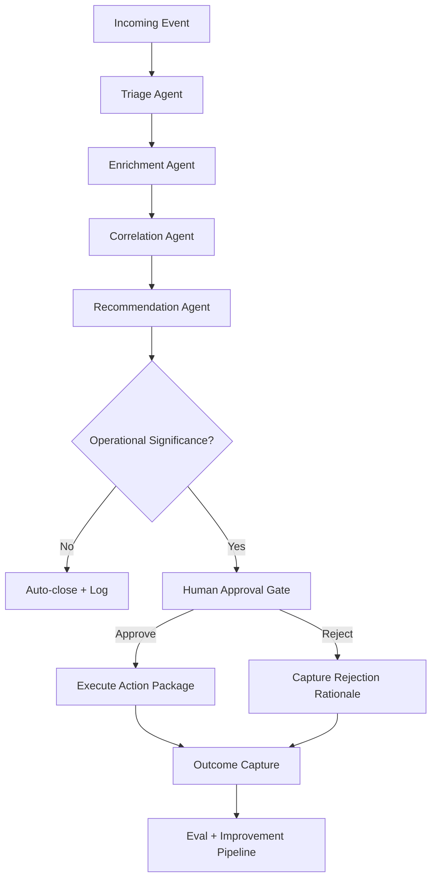

# ClearGlassInc Artemis — Self‑Evolving Intelligence Platform

## System Architecture

### 1) End-to-End Layered Architecture

```text
[Web UI / Mission Console]
   -> [API Gateway + BFF]
      -> [Domain Microservices]
         -> [Event Bus / Stream Fabric]
            -> [Foundry Pipelines + Ontology + Object Storage + Lakehouse]
               -> [Gotham Operational Apps / Case Graph / Entity Tracking]
                  -> [AIP Copilots + Agents + Eval Service + Prompt Registry]
                     -> [Policy Engine + Guardrails + Human Approval Gates]
                        -> [Apollo Delivery + Runtime Policy + Rollback]
```

**Frontend (Mission Console):** React/TypeScript app with real-time map/timeline/case board views, analyst copilot sidecar, commander decision panel, and explainability drawers.

**Backend:** Python FastAPI + gRPC services for ingest, entity resolution, correlation, mission orchestration, and action package generation.

**Data & Ontology:** Foundry Code Repositories + Pipelines + Ontology models as the system of semantic truth.

**Operational Layer:** Gotham apps consume ontology-backed entities/cases for investigation and operational execution.

**AI Layer (AIP):** Prompt-managed copilots, agent workflows, tool contracts, eval jobs, and model routing policies.

**Deployment/Control (Apollo):** Signed artifact promotion, environment targeting, canary rollout, automatic rollback, and policy lockstep deployment.

---

## Data and Ontology

### 2) Core Ontology Model (Foundry)

### Principal Entities
- `Person`, `Organization`, `Asset`, `Device`, `Account`, `Location`, `Event`, `Alert`, `Case`, `Mission`, `Report`, `ActionPackage`, `DataSource`, `ModelArtifact`, `PromptVersion`, `WorkflowVersion`, `PolicyVersion`.

### Relationship Types
- `ASSOCIATED_WITH`, `OWNS`, `OPERATES`, `LOCATED_AT`, `OBSERVED_IN`, `DERIVED_FROM`, `TRIGGERED`, `ESCALATED_TO`, `PART_OF_MISSION`, `RECOMMENDS`, `APPROVED_BY`, `REJECTED_BY`, `SUPERSEDES`.

### Required Metadata on Every Ontology Object
- `classification` (U/C/S/TS or coalition taxonomy)
- `compartment`
- `coalition_tags`
- `confidence_score` (0-1)
- `source_reliability` (A-F)
- `lineage_ref`
- `valid_from` / `valid_to`
- `observed_at` / `ingested_at`
- `owner_org` = `ClearGlassInc Artemis`

### Temporal + Lineage Pattern
Use bi-temporal semantics:
- **valid time** = truth in mission world
- **system time** = when platform learned/changed it

```sql
CREATE TABLE ontology_event_fact (
  event_id TEXT,
  entity_id TEXT,
  relation_type TEXT,
  confidence DOUBLE PRECISION,
  source_id TEXT,
  valid_from TIMESTAMP,
  valid_to TIMESTAMP,
  system_from TIMESTAMP DEFAULT CURRENT_TIMESTAMP,
  system_to TIMESTAMP,
  lineage_hash TEXT,
  policy_context JSONB,
  PRIMARY KEY (event_id, entity_id, relation_type, system_from)
);
```

---

## AI and Agent Design

### 3) Agent Roles (AIP)

1. **Analyst Copilot Agent**: NL query -> ontology query plans -> draft assessment.
2. **Commander Copilot Agent**: prioritization, COA (course-of-action) synthesis, risk matrix.
3. **Triage Agent**: streaming alert scoring + de-duplication.
4. **Enrichment Agent**: joins external/internal sources and updates confidence.
5. **Correlation Agent**: links entities/events/cases and explains causal hypotheses.
6. **Recommendation Agent**: proposes actions with policy rationale and expected impact.
7. **Audit Narrator Agent**: auto-generates immutable decision narratives.

### 4) Multi-Agent Workflow



### 5) Tool Contract Example

```python
from pydantic import BaseModel, Field
from typing import Literal, List

class ToolCallContext(BaseModel):
    user_id: str
    mission_id: str
    classification: str
    coalition_tags: List[str]

class OpenCaseInput(BaseModel):
    title: str
    priority: Literal["low", "medium", "high", "critical"]
    linked_alert_id: str
    rationale: str

class OpenCaseOutput(BaseModel):
    case_id: str
    status: Literal["created", "blocked_by_policy"]


def open_case_tool(ctx: ToolCallContext, payload: OpenCaseInput) -> OpenCaseOutput:
    # policy pre-check must pass before state mutation
    allowed = policy_check("case.create", ctx, resource={"priority": payload.priority})
    if not allowed:
        return OpenCaseOutput(case_id="", status="blocked_by_policy")
    case_id = gotham_create_case(payload.model_dump())
    return OpenCaseOutput(case_id=case_id, status="created")
```

---

## Self-Improvement Loop

### 6) Feedback Signals Captured
- Inline thumbs + structured analyst feedback.
- Operator corrections to entities/links/confidence.
- Alert disposition outcomes (TP/FP/FN).
- Mission impact metrics (response time, prevented incidents, decision quality).
- Prompt/tool trace telemetry (latency, token, failure mode, policy blocks).

### 7) Closed-Loop Improvement Pipeline

```text
Signals -> Feature Builder -> Eval Dataset Builder -> Candidate Generator
-> Offline Evals -> Safety Gates -> Human Review Board -> Canary
-> Live A/B -> Promotion or Rollback -> Immutable Audit Commit
```

### 8) Versioned Artifacts
- `prompt_version`
- `workflow_dag_version`
- `router_policy_version`
- `model_bundle_version`
- `policy_bundle_version`

All updates require:
1. quantitative eval pass,
2. policy conformance pass,
3. designated human approval,
4. Apollo deployment receipt.

### 9) Drift Detection

```python
from dataclasses import dataclass

@dataclass
class DriftReport:
    metric: str
    baseline: float
    current: float
    threshold: float


def detect_drift(metric: str, baseline: float, current: float, threshold: float) -> DriftReport | None:
    delta = abs(current - baseline)
    if delta >= threshold:
        return DriftReport(metric=metric, baseline=baseline, current=current, threshold=threshold)
    return None
```

---

## Full-Stack Implementation

### 10) Backend Service Skeleton (Python/FastAPI)

```python
from fastapi import FastAPI, Depends
from pydantic import BaseModel
from uuid import uuid4

app = FastAPI(title="ClearGlassInc Artemis Mission API")

class IntelEventIn(BaseModel):
    source: str
    payload: dict
    mission_id: str

@app.post("/v1/events")
def ingest_event(event: IntelEventIn, user=Depends(authn_authz)):
    event_id = str(uuid4())
    emit_stream("intel.events.raw", {"event_id": event_id, **event.model_dump()})
    return {"event_id": event_id, "status": "accepted"}
```

### 11) Event Handler + Workflow State Machine

```python
from enum import Enum

class FlowState(str, Enum):
    TRIAGE = "triage"
    ENRICH = "enrich"
    CORRELATE = "correlate"
    RECOMMEND = "recommend"
    APPROVAL = "approval"
    EXECUTE = "execute"
    COMPLETE = "complete"


def process_event(event):
    state = FlowState.TRIAGE
    context = {"event": event}

    while state != FlowState.COMPLETE:
        if state == FlowState.TRIAGE:
            context["triage"] = triage_agent(context)
            state = FlowState.ENRICH
        elif state == FlowState.ENRICH:
            context["enrichment"] = enrichment_agent(context)
            state = FlowState.CORRELATE
        elif state == FlowState.CORRELATE:
            context["correlation"] = correlation_agent(context)
            state = FlowState.RECOMMEND
        elif state == FlowState.RECOMMEND:
            context["recommendation"] = recommendation_agent(context)
            state = FlowState.APPROVAL if context["recommendation"]["requires_approval"] else FlowState.EXECUTE
        elif state == FlowState.APPROVAL:
            decision = wait_for_human_decision(context)
            context["decision"] = decision
            state = FlowState.EXECUTE if decision["approved"] else FlowState.COMPLETE
        elif state == FlowState.EXECUTE:
            execute_action_package(context)
            state = FlowState.COMPLETE

    publish_outcome(context)
```

### 12) Ontology-Driven Query Example

```sql
-- retrieve linked high-risk entities for active mission
SELECT e.entity_id, e.entity_type, r.relation_type, r.confidence
FROM ontology_entities e
JOIN ontology_relations r ON r.target_id = e.entity_id
WHERE r.mission_id = :mission_id
  AND r.confidence >= 0.78
  AND e.risk_tier IN ('high','critical')
  AND e.valid_to IS NULL;
```

### 13) Policy-as-Code (OPA/Rego-style)

```rego
package artemis.authz

default allow = false

allow {
  input.subject.clearance >= input.resource.classification
  input.subject.coalition[_] == input.resource.coalition
  not input.resource.compartment in input.subject.denied_compartments
  input.action == "case.read"
}

allow {
  input.action == "action_package.execute"
  input.approval.signed == true
  input.approval.role in {"mission_commander", "duty_officer"}
}
```

### 14) Eval Pipeline (Python)

```python
def run_eval_suite(candidate_bundle, eval_dataset):
    results = {
        "precision": eval_precision(candidate_bundle, eval_dataset),
        "recall": eval_recall(candidate_bundle, eval_dataset),
        "latency_p95_ms": eval_latency(candidate_bundle),
        "policy_violations": eval_policy_violations(candidate_bundle),
        "operator_trust": eval_human_panel(candidate_bundle)
    }

    pass_gate = (
        results["precision"] >= 0.91 and
        results["recall"] >= 0.86 and
        results["latency_p95_ms"] <= 1800 and
        results["policy_violations"] == 0 and
        results["operator_trust"] >= 4.3
    )
    return results, pass_gate
```

---

## Security and Governance

### 15) Zero-Trust + Need-to-Know
- mTLS service identity everywhere.
- short-lived workload identity tokens.
- per-request policy decision with explicit deny-by-default.
- row/column/entity enforcement in query path.

### 16) Coalition Segmentation
- Data tagged by releasability and coalition code.
- Query rewriter injects coalition filters automatically.
- Cross-domain transfer requires signed downgrade/transfer policy.

### 17) Provenance and Immutable Logging
- Append-only audit log (hash-chained records).
- Each AI recommendation includes:
  - model/version,
  - prompt/version,
  - tools used,
  - source objects + lineage IDs,
  - approval actor and timestamp.

### 18) Apollo Runtime Controls
- Canary rollout (5% -> 25% -> 100%).
- Automatic rollback on SLO breach or policy anomaly.
- Artifact promotion only from signed trusted pipeline.

---

## Code Examples (Advanced)

### 19) Model Router with Guarded Self-Optimization

```python
class RouterPolicy:
    def __init__(self, version, rules):
        self.version = version
        self.rules = rules


def route_task(task, policy: RouterPolicy):
    # deterministic policy first, then learned heuristic
    if task["classification"] == "TS":
        return "onprem-llm-secure-v2"
    if task["needs_tool_use"]:
        return "aip-tool-agent-v4"
    return "fast-analyst-llm-v3"


def propose_router_update(metrics, current_policy):
    # self-improvement proposal only; never auto-apply
    if metrics["latency_p95_ms"] > 2200 and metrics["precision"] >= 0.9:
        return {"proposal": "prefer fast-analyst-llm-v4 for low-risk summaries", "base": current_policy.version}
    return None
```

### 20) Human Approval Gate API

```python
@app.post("/v1/action-packages/{action_id}/approve")
def approve_action(action_id: str, decision: dict, user=Depends(commander_auth)):
    assert decision["approved"] in [True, False]
    write_audit("action.approval", {"action_id": action_id, "decision": decision, "user": user.id})
    if decision["approved"]:
        enqueue("actions.execute", {"action_id": action_id, "approved_by": user.id})
    else:
        enqueue("learning.rejections", {"action_id": action_id, "reason": decision.get("reason", "")})
    return {"ok": True}
```

---

## Scenario Walkthrough (Cinematic + Credible)

1. **22:14:03Z**: SIGINT-derived event enters `intel.events.raw` with low initial confidence (0.42).
2. **22:14:04Z**: Triage Agent detects spatiotemporal overlap with a known risk corridor and boosts priority.
3. **22:14:06Z**: Enrichment Agent joins telemetry, watchlist history, and prior case links from Foundry ontology.
4. **22:14:08Z**: Correlation Agent identifies entity cluster with 0.81 confidence and opens a candidate case in Gotham.
5. **22:14:10Z**: Recommendation Agent drafts Action Package AP-7781: surveillance reposition + partner notification.
6. **22:14:11Z**: Policy engine blocks auto-execution due to coalition-sharing constraint; requests human commander approval.
7. **22:14:30Z**: Commander approves surveillance reposition, rejects partner notification (insufficient confidence).
8. **22:15:10Z**: Outcome confirms true positive signal, no escalation incident.
9. **23:00:00Z**: Learning pipeline ingests outcome + rejection reason, generates eval slice "partner notification overreach".
10. **23:20:00Z**: Candidate prompt/workflow update reduces premature partner-notification suggestions by 37% in offline eval.
11. **23:40:00Z**: Human AI Review Board approves canary deployment.
12. **+24h**: Canary shows +6.4% precision, unchanged recall, no policy violations. Apollo promotes to full.

**Why this is safe:** all self-upgrades are *proposals* until they pass eval, policy, and human governance gates.

---

## Operational KPIs
- Precision/Recall/F1 by mission type.
- False-positive burden per analyst hour.
- P95 end-to-end decision latency.
- Approval acceptance rate by agent recommendation type.
- Policy violation count (hard target: zero).
- Operator trust score trend.
- Mission impact deltas (response-time reduction, incident prevention).

This blueprint gives ClearGlassInc Artemis a production-grade path to become continuously better while remaining human-governed, policy-constrained, and operationally accountable.
