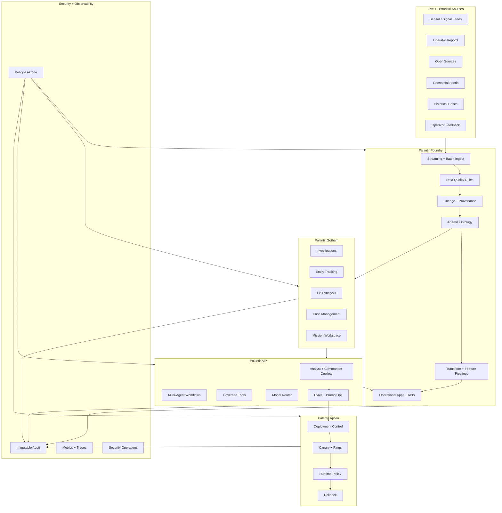
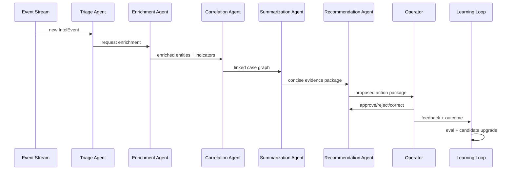

# ClearGlassInc Artemis — Palantir Self-Evolving AI Intelligence Platform Blueprint

## System Architecture

ClearGlassInc Artemis is a secure, coalition-aware, multi-domain intelligence platform built across four Palantir control planes:

- **Gotham**: operational intelligence, investigations, entity resolution, case management, link analysis, and mission context.
- **Foundry**: data integration, lineage, ontology, pipeline execution, governed datasets, and application logic.
- **AIP**: analyst copilots, commander copilots, tool-using agents, evaluations, workflow automation, model routing, and prompt governance.
- **Apollo**: controlled deployment, runtime policy, progressive rollout, rollback, environment promotion, and fleet health.

The platform is designed around one rule: **the system may propose improvements to prompts, workflows, routing, heuristics, and model selection, but every operationally significant change must pass explicit human approval and policy-as-code validation before release**.



### Full-stack layers

| Layer | ClearGlassInc Artemis responsibility | Primary implementation |
|---|---|---|
| Frontend | Mission dashboard, entity graph, alert queue, copilots, approval inbox, eval dashboards | React, TypeScript, WebSocket/SSE, graph visualization, secure file handling |
| API gateway | Request normalization, JWT validation, tenant/coalition headers, rate limits, audit envelope | FastAPI, Envoy/Kong, OPA sidecar |
| Backend services | Case service, alert service, feedback service, eval service, prompt registry, model routing | Python, FastAPI, SQLAlchemy, Pydantic, OpenTelemetry |
| Event bus | Machine-speed alert propagation, feedback capture, model telemetry, workflow events | Kafka/Pulsar/Kinesis-compatible streaming |
| Data layer | Raw lake, curated lakehouse, warehouse, vector store, search index | Foundry datasets, object store, Postgres, Iceberg/Delta-style tables, OpenSearch, pgvector/Milvus |
| Ontology layer | Governed semantic model for entities, relationships, missions, permissions, confidence, temporal state | Foundry Ontology + Gotham object model |
| AI orchestration | Copilots, agents, evals, prompt versioning, tool execution, model routing | AIP agents, workflow engine, Python orchestration |
| Policy layer | Need-to-know controls, row/column/entity permissions, tool policy, release gates | OPA/Rego, ABAC/RBAC, Palantir security model |
| Observability | Logs, traces, eval outcomes, trust metrics, drift metrics, model latency | OpenTelemetry, Prometheus, Grafana, immutable audit store |
| Deployment | Ring-based promotion, version pinning, remote config, kill switches, rollback | Apollo deployment policies |

## Data and Ontology

The Artemis ontology is the semantic contract between humans, AI agents, data products, and operational applications. It is not just a database schema; it defines how ClearGlassInc Artemis reasons about entities, relationships, confidence, provenance, temporal validity, mission scope, and permissions.

### Core entity types

```yaml
ontology:
  namespace: clearglassinc.artemis
  entities:
    Person:
      keys: [person_id]
      properties:
        legal_name: string
        aliases: string[]
        biometric_refs: string[]
        nationality: string
        confidence: float
        compartments: string[]
        coalition_release: string[]
        valid_time: interval
        source_lineage: LineageRef[]
    Organization:
      keys: [org_id]
      properties:
        name: string
        type: enum[company, unit, group, agency, unknown]
        jurisdiction: string
        risk_score: float
        confidence: float
    Asset:
      keys: [asset_id]
      properties:
        asset_type: enum[vehicle, vessel, aircraft, device, facility, account, wallet]
        identifier: string
        current_location: geopoint
        confidence: float
    Event:
      keys: [event_id]
      properties:
        event_type: string
        observed_at: timestamp
        reported_at: timestamp
        location: geopoint
        severity: int
        confidence: float
        status: enum[new, triaged, escalated, actioned, dismissed, archived]
    Indicator:
      keys: [indicator_id]
      properties:
        indicator_type: enum[ip, domain, wallet, phrase, image_hash, device_id, tactic]
        value: string
        first_seen: timestamp
        last_seen: timestamp
        confidence: float
    Mission:
      keys: [mission_id]
      properties:
        name: string
        objective: string
        commander: string
        priority: int
        compartments: string[]
        coalition_policy: string
    Case:
      keys: [case_id]
      properties:
        title: string
        state: enum[open, pending_review, approved, rejected, closed]
        mission_id: string
        owner: string
        created_at: timestamp
    IntelProduct:
      keys: [product_id]
      properties:
        classification: string
        summary: string
        evidence_refs: EvidenceRef[]
        generated_by: string
        reviewed_by: string
        approval_state: enum[draft, review, approved, rejected]
    FeedbackSignal:
      keys: [feedback_id]
      properties:
        user_id: string
        artifact_id: string
        signal_type: enum[thumbs_up, thumbs_down, correction, override, escalation, dismissal]
        free_text: string
        captured_at: timestamp
        mission_id: string
```

### Relationship model

```yaml
relationships:
  AFFILIATED_WITH:
    from: Person
    to: Organization
    properties: {confidence: float, source_refs: string[], valid_time: interval}
  LOCATED_AT:
    from: [Person, Asset, Event]
    to: Location
    properties: {confidence: float, observed_at: timestamp, lineage: string[]}
  PARTICIPATED_IN:
    from: [Person, Organization, Asset]
    to: Event
    properties: {role: string, confidence: float, source_refs: string[]}
  INDICATES:
    from: Indicator
    to: [Event, Person, Organization, Asset]
    properties: {analytic_method: string, confidence: float}
  SUPPORTS_CASE:
    from: [Event, Indicator, IntelProduct]
    to: Case
    properties: {evidence_weight: float, added_by: string, added_at: timestamp}
  FEEDBACK_ON:
    from: FeedbackSignal
    to: [Alert, IntelProduct, WorkflowRun, PromptVersion]
    properties: {impact: string, accepted_for_eval: boolean}
```

### Confidence, lineage, and temporal state

Every object carries three precision fields:

1. **Confidence**: model-estimated or analyst-assigned probability-like score, calibrated by source reliability and corroboration.
2. **Lineage**: immutable source references, pipeline versions, transformation code hash, analyst edits, model version, prompt version, and policy decision ID.
3. **Temporal state**: valid time, transaction time, first observed, last observed, and supersession links.

```sql
CREATE TABLE artemis_entity_fact (
  fact_id UUID PRIMARY KEY,
  entity_id TEXT NOT NULL,
  entity_type TEXT NOT NULL,
  property_name TEXT NOT NULL,
  property_value JSONB NOT NULL,
  confidence NUMERIC(5,4) NOT NULL CHECK (confidence >= 0 AND confidence <= 1),
  source_refs TEXT[] NOT NULL,
  pipeline_version TEXT NOT NULL,
  model_version TEXT,
  prompt_version TEXT,
  valid_from TIMESTAMPTZ NOT NULL,
  valid_to TIMESTAMPTZ,
  transaction_time TIMESTAMPTZ NOT NULL DEFAULT now(),
  compartments TEXT[] NOT NULL,
  coalition_release TEXT[] NOT NULL,
  classification TEXT NOT NULL,
  supersedes_fact_id UUID
);
```

### How the ontology drives humans and agents

- Human dashboards show mission-specific entity graphs, case timelines, confidence changes, and evidence packages.
- Agents can only use tools whose input and output types are declared against the ontology.
- Policy checks occur at the ontology object, relationship, field, and action level.
- Evals are generated from ontology-grounded tasks such as “correlate Indicator to Event with evidence” or “summarize Case without exposing unreleasable compartments.”
- Workflow state machines read ontology status fields and write governed transitions rather than free-form mutations.

## AI and Agent Design

### Copilots

**Analyst Copilot** supports search, triage, enrichment, case drafting, evidence summarization, hypothesis tracking, and source citation. It can prepare products but cannot approve operational actions.

**Commander Copilot** summarizes mission posture, compares courses of action, surfaces risk, explains confidence, and prepares decision briefs. It cannot initiate an action package without explicit commander approval.

### Multi-agent workflow topology



### Agent roles

| Agent | Reads | Writes | Approval gate |
|---|---|---|---|
| Triage Agent | Events, indicators, mission rules | Alert priority, triage rationale | Required for severity escalation above threshold |
| Enrichment Agent | Entity graph, external governed sources | Enrichment candidates | Human review for low-confidence merge |
| Correlation Agent | Cases, relationships, embeddings, graph paths | Suggested links | Human approval before case evidence promotion |
| Summarization Agent | Case objects, evidence refs | Draft intel products | Review before product release |
| Recommendation Agent | Mission rules, risks, historical outcomes | Draft action packages | Mandatory commander approval |
| PromptOps Agent | Feedback, eval failures, logs | Candidate prompt/workflow diffs | Mandatory AI governance board approval |

### Governed tool contract

```python
from pydantic import BaseModel, Field
from typing import Literal

class ToolContext(BaseModel):
    user_id: str
    mission_id: str
    compartments: list[str]
    coalition: list[str]
    purpose: str
    request_id: str

class EntitySearchInput(BaseModel):
    query: str
    entity_types: list[Literal["Person", "Organization", "Asset", "Event", "Indicator"]]
    min_confidence: float = Field(default=0.65, ge=0.0, le=1.0)
    max_results: int = Field(default=25, ge=1, le=100)

class EntitySearchResult(BaseModel):
    entity_id: str
    entity_type: str
    display_name: str
    confidence: float
    lineage_refs: list[str]
    releasability: list[str]
```

## Self-Improvement Loop

The self-improvement loop transforms operational signals into controlled candidate improvements. It never allows autonomous goal changes and never deploys a workflow modification without human approval.

### Signal capture

Captured signals include:

- Operator feedback: thumbs up/down, corrections, overrides, dismissals, escalations.
- Query logs: search terms, clicked evidence, abandoned flows, latency, result quality.
- Alert outcomes: true positive, false positive, duplicate, stale, insufficient evidence.
- Mission results: whether recommended actions were useful, delayed, risky, or rejected.
- Model telemetry: hallucination flags, refusal flags, tool errors, token cost, latency, confidence calibration.

```json
{
  "event_type": "operator_feedback.v1",
  "feedback_id": "fb_01JZ...",
  "mission_id": "mission_border_integrity_17",
  "artifact_type": "alert",
  "artifact_id": "alert_8841",
  "signal_type": "correction",
  "operator_correction": {
    "field": "priority",
    "old_value": "high",
    "new_value": "medium",
    "reason": "source reliability was over-weighted"
  },
  "model_version": "router-2026-07-06",
  "prompt_version": "triage-agent@3.2.1",
  "workflow_version": "triage-flow@1.9.0",
  "policy_decision_id": "opa_decision_7ee2",
  "captured_at": "2026-07-06T12:00:00Z"
}
```

### Upgrade pipeline

1. **Normalize signals** into a feedback lakehouse table.
2. **Label outcomes** with operator-reviewed ground truth.
3. **Generate eval cases** from failures, near misses, and representative successes.
4. **Run baselines** against current prompt/workflow/model route.
5. **Create candidate changes**: prompt diffs, workflow thresholds, retrieval filters, routing rules, heuristics.
6. **Evaluate candidates** offline with precision, recall, calibration, citation fidelity, safety compliance, latency, and cost.
7. **Package proposal** with evidence, expected impact, blast radius, rollback plan, and policy diff.
8. **Human approval** by mission owner, AI governance owner, and security owner when required.
9. **Apollo canary deployment** to low-risk ring.
10. **Monitor and rollback** automatically if guardrail metrics degrade.

### Safe versioning and rollback

```yaml
upgrade_proposal:
  id: artemis-upgrade-2026-07-06-014
  component: triage-agent
  proposed_by: PromptOpsAgent
  change_type: prompt_update
  from_version: triage-agent@3.2.1
  to_version: triage-agent@3.3.0-candidate.4
  evidence:
    eval_suite: triage_eval_2026w27
    precision_delta: +0.041
    recall_delta: +0.018
    p95_latency_delta_ms: +22
    policy_violations: 0
  guardrails:
    rollback_if_false_positive_rate_gt: 0.08
    rollback_if_p95_latency_gt_ms: 1800
    rollback_if_policy_violation_count_gt: 0
  approvals:
    mission_owner: pending
    ai_governance: pending
    security: pending
```

## Full-Stack Implementation

### Repository shape

```text
artemis-platform/
  apps/
    web-console/                 # React mission UI
    commander-brief/             # Executive mission posture UI
  services/
    api-gateway/                 # FastAPI edge service
    ontology-service/            # ontology-aware query facade
    alert-service/               # alert lifecycle
    feedback-service/            # operator feedback capture
    eval-service/                # eval generation + execution
    prompt-registry/             # prompt/workflow/model route versions
    model-router/                # inference provider routing
    workflow-orchestrator/       # state machines
  packages/
    artemis-policy/              # Rego policies + test fixtures
    artemis-sdk/                 # typed Python/TS clients
    artemis-ontology/            # schemas, contracts, migrations
  infra/
    apollo/                      # deployment manifests
    telemetry/                   # dashboards and alerts
    pipelines/                   # Foundry transform definitions
```

### Web UI modules

```tsx
type AlertCardProps = {
  alertId: string;
  title: string;
  severity: "low" | "medium" | "high" | "critical";
  confidence: number;
  evidenceRefs: string[];
  approvalRequired: boolean;
};

export function AlertCard(props: AlertCardProps) {
  return (
    <section className="rounded-xl border border-slate-700 bg-slate-950 p-4">
      <div className="flex items-center justify-between">
        <h3 className="text-lg font-semibold text-white">{props.title}</h3>
        <span className="rounded bg-amber-500/20 px-2 py-1 text-amber-200">
          {props.severity.toUpperCase()}
        </span>
      </div>
      <p className="mt-2 text-sm text-slate-300">
        Confidence: {(props.confidence * 100).toFixed(1)}%
      </p>
      <div className="mt-3 flex gap-2">
        <button data-action="approve" className="btn-primary">Approve Package</button>
        <button data-action="reject" className="btn-secondary">Reject</button>
        <button data-action="correct" className="btn-secondary">Correct</button>
      </div>
    </section>
  );
}
```

### API gateway

```python
from fastapi import FastAPI, Depends, HTTPException, Request
from pydantic import BaseModel
from artemis_policy import authorize
from artemis_audit import audit_event

app = FastAPI(title="ClearGlassInc Artemis API Gateway")

class UserContext(BaseModel):
    user_id: str
    roles: list[str]
    compartments: list[str]
    coalition: list[str]
    clearance: str

async def get_user_context(request: Request) -> UserContext:
    claims = request.state.jwt_claims
    return UserContext(
        user_id=claims["sub"],
        roles=claims.get("roles", []),
        compartments=claims.get("compartments", []),
        coalition=claims.get("coalition", []),
        clearance=claims.get("clearance", "unclassified"),
    )

@app.post("/v1/cases/{case_id}/approve")
async def approve_case(case_id: str, user: UserContext = Depends(get_user_context)):
    decision = authorize(
        subject=user.model_dump(),
        action="case.approve",
        resource={"case_id": case_id, "type": "Case"},
        context={"purpose": "mission_review"},
    )
    await audit_event("policy_decision", decision)
    if not decision.allow:
        raise HTTPException(status_code=403, detail=decision.reason)
    await audit_event("case_approved", {"case_id": case_id, "user_id": user.user_id})
    return {"status": "approved", "case_id": case_id}
```

### Event handler

```python
from dataclasses import dataclass
from datetime import datetime, timezone

@dataclass(frozen=True)
class IntelEvent:
    event_id: str
    mission_id: str
    event_type: str
    payload: dict
    classification: str
    compartments: list[str]
    observed_at: datetime

async def handle_intel_event(event: IntelEvent, triage_agent, event_store, audit):
    await event_store.append("intel_event.received", event.__dict__)
    result = await triage_agent.run(
        mission_id=event.mission_id,
        event_payload=event.payload,
        observed_at=event.observed_at.isoformat(),
    )
    alert = {
        "alert_id": f"alert_{event.event_id}",
        "mission_id": event.mission_id,
        "priority": result.priority,
        "confidence": result.confidence,
        "rationale": result.rationale,
        "evidence_refs": result.evidence_refs,
        "created_at": datetime.now(timezone.utc).isoformat(),
    }
    await event_store.append("alert.created", alert)
    await audit.write("agent_triage_completed", {"event_id": event.event_id, "alert": alert})
    return alert
```

### Ontology-driven query

```python
class OntologyQueryService:
    def __init__(self, foundry_client, policy_engine):
        self.foundry = foundry_client
        self.policy = policy_engine

    async def neighborhood(self, user, entity_id: str, depth: int = 2) -> dict:
        decision = self.policy.authorize(
            subject=user,
            action="ontology.graph.read",
            resource={"entity_id": entity_id},
            context={"depth": depth},
        )
        if not decision.allow:
            raise PermissionError(decision.reason)

        graph = await self.foundry.ontology.query_graph(
            root=entity_id,
            relationships=["AFFILIATED_WITH", "PARTICIPATED_IN", "INDICATES", "SUPPORTS_CASE"],
            depth=min(depth, 3),
            filters={
                "min_confidence": 0.60,
                "compartments_intersect": user["compartments"],
                "coalition_release_intersect": user["coalition"],
            },
        )
        return graph
```

### Workflow state machine

```python
from enum import Enum
from pydantic import BaseModel

class AlertState(str, Enum):
    NEW = "new"
    TRIAGED = "triaged"
    ENRICHED = "enriched"
    REVIEW_REQUIRED = "review_required"
    APPROVED = "approved"
    REJECTED = "rejected"
    CLOSED = "closed"

class Transition(BaseModel):
    from_state: AlertState
    to_state: AlertState
    action: str
    requires_approval: bool

TRANSITIONS = {
    (AlertState.NEW, "triage"): Transition(from_state=AlertState.NEW, to_state=AlertState.TRIAGED, action="triage", requires_approval=False),
    (AlertState.TRIAGED, "enrich"): Transition(from_state=AlertState.TRIAGED, to_state=AlertState.ENRICHED, action="enrich", requires_approval=False),
    (AlertState.ENRICHED, "recommend_action"): Transition(from_state=AlertState.ENRICHED, to_state=AlertState.REVIEW_REQUIRED, action="recommend_action", requires_approval=True),
    (AlertState.REVIEW_REQUIRED, "approve"): Transition(from_state=AlertState.REVIEW_REQUIRED, to_state=AlertState.APPROVED, action="approve", requires_approval=True),
    (AlertState.REVIEW_REQUIRED, "reject"): Transition(from_state=AlertState.REVIEW_REQUIRED, to_state=AlertState.REJECTED, action="reject", requires_approval=True),
}

def transition_alert(current: AlertState, action: str, approved: bool = False) -> AlertState:
    transition = TRANSITIONS[(current, action)]
    if transition.requires_approval and not approved:
        raise ValueError(f"Action {action} requires explicit approval")
    return transition.to_state
```

### Eval pipeline in Python

```python
from pydantic import BaseModel
from statistics import mean

class EvalCase(BaseModel):
    case_id: str
    input_event: dict
    expected_priority: str
    expected_entities: list[str]
    forbidden_disclosures: list[str]

class EvalResult(BaseModel):
    case_id: str
    passed: bool
    precision: float
    recall: float
    latency_ms: int
    policy_violations: int
    notes: str

async def run_triage_eval(eval_cases: list[EvalCase], candidate_agent) -> dict:
    results: list[EvalResult] = []
    for case in eval_cases:
        output = await candidate_agent.run(case.input_event)
        predicted = set(output.entity_ids)
        expected = set(case.expected_entities)
        precision = len(predicted & expected) / max(len(predicted), 1)
        recall = len(predicted & expected) / max(len(expected), 1)
        policy_violations = sum(
            1 for forbidden in case.forbidden_disclosures
            if forbidden.lower() in output.summary.lower()
        )
        results.append(EvalResult(
            case_id=case.case_id,
            passed=output.priority == case.expected_priority and policy_violations == 0,
            precision=precision,
            recall=recall,
            latency_ms=output.latency_ms,
            policy_violations=policy_violations,
            notes=output.rationale[:500],
        ))
    return {
        "pass_rate": mean([1.0 if r.passed else 0.0 for r in results]),
        "precision": mean([r.precision for r in results]),
        "recall": mean([r.recall for r in results]),
        "p95_latency_ms": sorted([r.latency_ms for r in results])[int(len(results) * 0.95) - 1],
        "policy_violations": sum(r.policy_violations for r in results),
        "results": [r.model_dump() for r in results],
    }
```

## Security and Governance

### Need-to-know access control

ClearGlassInc Artemis uses layered authorization:

- **RBAC** for coarse roles such as analyst, commander, data steward, AI governance reviewer, and security officer.
- **ABAC** for attributes such as clearance, mission assignment, compartment, coalition releasability, location, device trust, and purpose.
- **Entity-level policy** for objects and graph relationships.
- **Column-level policy** for sensitive fields such as source identity, raw identifiers, and unreleasable notes.
- **Tool-level policy** for agent actions.

```rego
package artemis.authz

default allow := false

allow if {
  input.action == "ontology.graph.read"
  input.subject.clearance_level >= input.resource.classification_level
  count(input.subject.compartments & input.resource.compartments) > 0
  count(input.subject.coalition & input.resource.coalition_release) > 0
  input.context.purpose in {"mission_review", "investigation", "approved_eval"}
}

allow if {
  input.action == "case.approve"
  "commander" in input.subject.roles
  input.resource.mission_id in input.subject.assigned_missions
  input.resource.approval_state == "review_required"
}

deny_reason := "insufficient mission need-to-know" if not allow
```

### Model and prompt governance

- Prompts are versioned, signed, evaluated, and deployed like code.
- Workflow updates require a proposal with diffs, eval results, security review, owner approval, and rollback criteria.
- Models are routed by task sensitivity, classification boundary, latency budget, eval score, and cost.
- Generated intelligence products must include citations, confidence, and provenance.
- Agents must log tool inputs, tool outputs, policy decisions, and human approvals.

### Zero-trust execution

Every service call carries signed identity, mission purpose, request ID, tenant/coalition boundary, and device posture. Agents receive scoped tool credentials only for the duration of a workflow step. Apollo can revoke runtime config, disable a model route, or pin a previous prompt version without redeploying the entire platform.

## Code Examples

### Model router

```python
class ModelRouteRequest(BaseModel):
    task_type: str
    classification: str
    latency_budget_ms: int
    requires_reasoning: bool
    requires_vision: bool = False
    mission_id: str

class ModelRoute(BaseModel):
    provider: str
    model: str
    prompt_version: str
    max_tokens: int
    temperature: float
    policy_tags: list[str]

class ModelRouter:
    def __init__(self, registry, policy):
        self.registry = registry
        self.policy = policy

    async def route(self, request: ModelRouteRequest, user: dict) -> ModelRoute:
        candidates = await self.registry.candidates(
            task_type=request.task_type,
            classification=request.classification,
            requires_vision=request.requires_vision,
        )
        permitted = [
            c for c in candidates
            if self.policy.authorize(user, "model.invoke", c.model_dump(), request.model_dump()).allow
        ]
        if not permitted:
            raise RuntimeError("No policy-permitted model route available")
        permitted.sort(key=lambda c: (c.eval_score, -c.p95_latency_ms), reverse=True)
        winner = permitted[0]
        return ModelRoute(
            provider=winner.provider,
            model=winner.model,
            prompt_version=winner.prompt_version,
            max_tokens=winner.max_tokens,
            temperature=0.1 if request.task_type in {"triage", "case_summary"} else 0.2,
            policy_tags=winner.policy_tags,
        )
```

### Agent tool call with approval gate

```python
async def prepare_action_package(agent_ctx, case_id: str, recommendation: str):
    case = await agent_ctx.tools.case_service.get_case(case_id)
    evidence = await agent_ctx.tools.ontology.neighborhood(case.primary_entity_id, depth=2)
    package = await agent_ctx.llm.generate_structured(
        schema={
            "type": "object",
            "properties": {
                "recommended_action": {"type": "string"},
                "rationale": {"type": "string"},
                "risks": {"type": "array", "items": {"type": "string"}},
                "evidence_refs": {"type": "array", "items": {"type": "string"}},
                "confidence": {"type": "number"},
            },
            "required": ["recommended_action", "rationale", "risks", "evidence_refs", "confidence"],
        },
        messages=[
            {"role": "system", "content": "Prepare a decision-support package. Do not claim authority to execute actions."},
            {"role": "user", "content": {"case": case, "evidence": evidence, "recommendation": recommendation}},
        ],
    )
    approval_id = await agent_ctx.tools.approvals.create(
        artifact_type="ActionPackage",
        artifact=package,
        required_roles=["commander", "security_officer"],
        reason="Operationally significant recommendation requires explicit approval",
    )
    return {"approval_required": True, "approval_id": approval_id, "package": package}
```

### Prompt candidate generator

```python
async def propose_prompt_upgrade(failures: list[dict], current_prompt: str, llm) -> dict:
    proposal = await llm.generate_structured(
        schema={
            "type": "object",
            "properties": {
                "summary": {"type": "string"},
                "prompt_diff": {"type": "string"},
                "expected_metric_lift": {"type": "object"},
                "risk_analysis": {"type": "array", "items": {"type": "string"}},
                "rollback_plan": {"type": "string"},
            },
            "required": ["summary", "prompt_diff", "expected_metric_lift", "risk_analysis", "rollback_plan"],
        },
        messages=[
            {"role": "system", "content": "You are PromptOps for ClearGlassInc Artemis. Propose bounded, reviewable prompt changes only."},
            {"role": "user", "content": {"current_prompt": current_prompt, "eval_failures": failures[:50]}},
        ],
    )
    return {
        "status": "candidate_only",
        "requires_human_approval": True,
        "proposal": proposal,
    }
```

## Scenario Walkthrough

At 03:14 UTC, a live indicator enters ClearGlassInc Artemis from a governed sensor stream. The event contains a device identifier, a geospatial observation, and a partial association to a previously watched organization.

1. **Ingest**: Foundry receives the event, validates schema, attaches source lineage, applies quality rules, and writes a raw immutable record.
2. **Ontology mapping**: The pipeline maps the device identifier to an `Asset`, the observation to an `Event`, and the partial association to an `INDICATES` edge with 0.62 confidence.
3. **Gotham operational context**: Gotham surfaces the entity in an existing mission workspace because the observed location intersects a commander-defined area of interest.
4. **AIP triage**: The Triage Agent reads the event, mission priority, historical case patterns, and current entity graph. It assigns medium priority because evidence is plausible but under-corroborated.
5. **Enrichment**: The Enrichment Agent queries governed datasets and finds two additional weak indicators. It does not merge entities automatically because confidence remains below the merge threshold.
6. **Correlation**: The Correlation Agent identifies a path to an open case through a shared `Indicator`, then marks the link as “suggested” rather than evidence because human review is required.
7. **Recommendation**: The Recommendation Agent prepares an action package: increase monitoring, request human verification, and avoid escalation until corroboration arrives.
8. **Approval gate**: The operator rejects the initial priority as too high for the current mission tempo and corrects it from medium to low. The correction is captured with reason: “source reliability over-weighted.”
9. **Learning signal**: The feedback service emits `operator_feedback.v1`, linking the correction to event, prompt version, model route, workflow version, source reliability score, and policy decision.
10. **Eval generation**: The eval service converts the corrected case into a regression test: similar source reliability and corroboration patterns should not exceed low priority without additional evidence.
11. **Candidate improvement**: The PromptOps Agent proposes a bounded prompt update and a workflow threshold change that reduce source reliability weight when corroboration is absent.
12. **Offline validation**: The eval harness shows precision improves by 4.1 percentage points, recall improves by 1.8 points, no policy violations occur, and p95 latency increases by only 22 ms.
13. **Human review**: The mission owner and AI governance owner approve the candidate. Security approval is not required because the change does not alter data access or model boundary.
14. **Apollo rollout**: Apollo deploys `triage-agent@3.3.0` to the canary ring. Runtime guardrails monitor false positives, latency, policy violations, and operator overrides.
15. **Rollback path**: If false positives exceed 8%, p95 latency exceeds 1.8 seconds, or any policy violation appears, Apollo automatically pins `triage-agent@3.2.1` and opens an incident.

The system gets better by tightening the relationship between evidence, confidence, and mission impact while preserving human authority, auditability, and rollback control.
