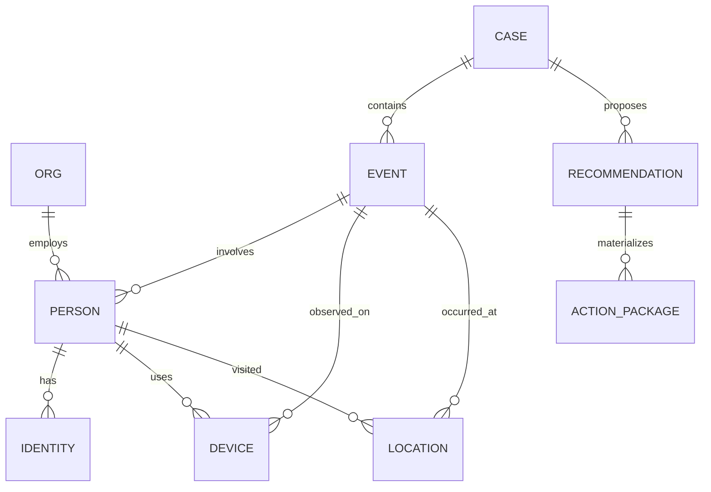

# ClearGlassInc Artemis — Self-Evolving Intelligence Platform (Gotham + Foundry + AIP + Apollo)

## System Architecture

### 1) Reference Stack (End-to-End)

```text
[Web UI / Command Ops Console (React/TS)]
  -> [API Gateway + BFF]
    -> [Mission Services (Python FastAPI + gRPC)]
      -> [Event Bus (Kafka/PubSub)]
      -> [Foundry Pipelines + Ontology + Functions]
      -> [Search/Retrieval (OpenSearch + Vector DB)]
      -> [AIP Agent Runtime + Copilots + Evals]
      -> [Policy Decision Point (OPA/Rego + Foundry policies)]
      -> [Gotham Ops Apps + Case Mgmt + Graph Investigations]
      -> [Observability (OTel + Prometheus + Loki + Jaeger)]
      -> [Apollo Delivery Control Plane]
```

### 2) Layered Architecture

- **Frontend Layer**: coalition-aware web apps; mission timeline; graph view; decision cards; approval queue.
- **Backend Layer**: domain services (`entity`, `case`, `alert`, `workflow`, `evaluation`, `policy`, `deployment`).
- **Data Layer**: streaming + batch ingestion, feature views, historical lakehouse, immutable evidence store.
- **Ontology Layer (Foundry)**: normalized entities, relationships, lineage, temporal state, confidence, permissions.
- **AI Orchestration Layer (AIP)**: model routing, tool-use, multi-agent workflows, eval harnesses, prompt registry.
- **Policy Layer**: ABAC/RBAC, compartment rules, need-to-know, action gating, dual-control approvals.
- **Observability Layer**: traces per mission action, eval telemetry, model drift, workflow success metrics.
- **Deployment Layer (Apollo)**: progressive rollouts, canary, runtime flags, auto rollback, air-gapped promotion.

---

## Data and Ontology

### 1) Ontology Core



### 2) Entity Spec

- `EntityBase`: `id`, `source_system`, `created_at`, `updated_at`, `classification`, `compartment_tags[]`, `lineage_id`.
- `TemporalState`: `valid_from`, `valid_to`, `observed_at`, `is_current`, `state_confidence`.
- `ConfidenceEnvelope`: `score`, `method`, `signals[]`, `human_override`, `override_reason`.
- `MissionContext`: `mission_id`, `theater`, `priority`, `rules_of_engagement`, `coalition_scope`.

### 3) Access-Safe Ontology Rules

- All ontology objects carry `policy_labels` (`REL-TO`, `NOFORN`, coalition partitions).
- Relationship traversals require graph-level policy evaluation before expansion.
- Query planner rewrites to enforce row/column/entity masking at execution time.

### 4) Foundry Data Products

- `dp_raw_signals`: unnormalized ISR/cyber/OSINT streams.
- `dp_entity_resolution`: deduped entities + confidence.
- `dp_mission_alerts`: scored alerts with triage metadata.
- `dp_agent_learning`: feedback + outcomes + eval judgments.
- `dp_prompt_candidates`: auto-generated candidate prompt patches.

---

## AI and Agent Design

### 1) Copilots

- **Analyst Copilot**: evidence correlation, timeline synthesis, hypothesis trees, source confidence grading.
- **Commander Copilot**: mission-level summaries, COA recommendations, risk envelopes, approval-ready action cards.

### 2) Multi-Agent Workflow Topology

```text
IngestAgent -> TriageAgent -> EnrichmentAgent -> CorrelationAgent
             -> SummarizationAgent -> RecommendationAgent -> ApprovalAgent
             -> ActionExecutionAgent (only post-approval)
```

### 3) Tool-Use Contracts

Each agent uses signed tool specs:
- `query_ontology`
- `open_case`
- `attach_evidence`
- `draft_intel_product`
- `prepare_action_package`
- `request_approval`

Operationally significant tools (`prepare_action_package`, `dispatch`) are hard-gated by policy + human approval.

### 4) Model Router (AIP)

Routing by:
- classification level,
- latency budget,
- task family (NER, correlation, summarization, planning),
- evaluation scorecards,
- jurisdiction/coalition constraints.

---

## Self-Improvement Loop

### 1) Signals Captured

- operator edits on AI outputs,
- approval/rejection decisions,
- downstream mission outcomes,
- false positive / false negative adjudications,
- latency/SLA breaches,
- trust score feedback.

### 2) Learning Pipeline

1. **Collect** signals into `dp_agent_learning`.
2. **Label** outcome quality via adjudication workflow.
3. **Generate** candidate improvements:
   - prompt patch,
   - tool-sequence adjustment,
   - model-routing delta,
   - heuristic threshold update.
4. **Evaluate** in offline replay + shadow mode.
5. **Govern** via human review board + policy checks.
6. **Promote** through Apollo canary rollout.
7. **Monitor** drift + mission impact.
8. **Rollback** automatically on guardrail breach.

### 3) Guardrails

- No autonomous goal rewrites.
- No autonomous permission broadening.
- No autonomous operational dispatch.
- Mandatory diff-based approval for prompt/workflow/model-route changes.

### 4) Versioning + Rollback

- Version all artifacts: `prompt:vX`, `workflow:vY`, `router_policy:vZ`.
- Apollo runtime flag bundles these versions as release units.
- Rollback triggers: precision drop, policy violation, latency regression, operator trust decline.

---

## Full-Stack Implementation

### 1) Web UI

- React + TypeScript + GraphQL BFF.
- Views: Mission Feed, Entity Graph, Case Workspace, Approval Queue, Eval Dashboard, Release Control.
- UX patterns: confidence heatmaps, provenance drawers, “why this recommendation” cards.

### 2) API Gateway / BFF

- JWT + mTLS; request enrichment with mission context.
- Per-request policy pre-check.
- SSE/WebSocket for live mission updates.

### 3) Backend Services (Python)

- `ingest-service`: streaming ingestion + schema validation.
- `ontology-service`: entity CRUD + relationship traversals.
- `agent-orchestrator`: state machines + tool-use execution.
- `policy-service`: PDP/PIP integration.
- `eval-service`: offline replay, scorecards, regression tests.
- `release-service`: Apollo deployment orchestration.

### 4) Event Bus

Topics:
- `signals.raw`, `signals.normalized`, `alerts.created`,
- `cases.updated`, `agent.recommendations`, `approval.events`,
- `eval.runs`, `release.events`, `rollback.events`.

### 5) Storage

- Lakehouse (Parquet/Iceberg/Delta style) for historical mission data.
- OLTP store for cases/tasks.
- Graph store for ontology relationships.
- Vector store for semantically indexed intel text/media embeddings.
- Immutable evidence store with hash-chained records.

---

## Security and Governance

- **Need-to-know by default**: deny unless explicit grant.
- **Compartment enforcement**: coalition partitions at query and inference levels.
- **Zero-trust runtime**: workload identity + mTLS + attested compute.
- **Policy-as-code**: Rego policies in CI with unit tests.
- **Provenance**: every AI output includes source trace, model version, prompt hash, tool call log.
- **Immutable logs**: WORM + signed append-only audit ledger.

---

## Code Examples (Python-first, production-style)

### 1) FastAPI Mission Service

```python
from fastapi import FastAPI, Depends, HTTPException
from pydantic import BaseModel
from typing import List

app = FastAPI(title="ClearGlassInc Artemis Mission API")

class AlertIn(BaseModel):
    mission_id: str
    signal_id: str
    payload: dict

class Recommendation(BaseModel):
    recommendation_id: str
    risk: float
    confidence: float
    rationale: str


def enforce_policy(user_ctx: dict, mission_id: str, action: str) -> None:
    allowed = policy_decision(user_ctx, mission_id, action)
    if not allowed:
        raise HTTPException(status_code=403, detail="Policy denied")


@app.post("/alerts/triage", response_model=Recommendation)
def triage_alert(alert: AlertIn, user_ctx: dict = Depends(get_user_ctx)):
    enforce_policy(user_ctx, alert.mission_id, "alert:triage")
    rec = run_agent_workflow(alert)
    persist_recommendation(rec)
    return rec
```

### 2) Event Handler + Workflow State Machine

```python
from enum import Enum

class WorkflowState(str, Enum):
    INGESTED = "ingested"
    TRIAGED = "triaged"
    ENRICHED = "enriched"
    CORRELATED = "correlated"
    SUMMARIZED = "summarized"
    RECOMMENDED = "recommended"
    AWAITING_APPROVAL = "awaiting_approval"
    EXECUTED = "executed"
    REJECTED = "rejected"


def on_alert_created(event: dict) -> None:
    state = WorkflowState.INGESTED
    ctx = init_context(event)

    ctx = triage_agent(ctx); state = WorkflowState.TRIAGED
    ctx = enrichment_agent(ctx); state = WorkflowState.ENRICHED
    ctx = correlation_agent(ctx); state = WorkflowState.CORRELATED
    ctx = summarization_agent(ctx); state = WorkflowState.SUMMARIZED
    ctx = recommendation_agent(ctx); state = WorkflowState.RECOMMENDED

    if requires_human_approval(ctx):
        state = WorkflowState.AWAITING_APPROVAL
        emit("approval.events", build_approval_request(ctx))
    else:
        execute_non_operational_actions(ctx)
```

### 3) Ontology-Driven Query

```python
def fetch_entity_neighborhood(entity_id: str, hops: int, user_ctx: dict):
    policy_filter = compile_policy_filter(user_ctx)
    query = {
        "start": entity_id,
        "max_hops": hops,
        "edge_filter": policy_filter.edge_predicate,
        "node_filter": policy_filter.node_predicate,
        "temporal_at": user_ctx.get("as_of"),
    }
    return graph_store.traverse(query)
```

### 4) AIP Tool Call Wrapper

```python
class ToolResult(BaseModel):
    ok: bool
    data: dict
    provenance: dict


def tool_query_ontology(agent_ctx: dict, query: dict) -> ToolResult:
    assert_guardrail(agent_ctx, "tool:query_ontology")
    data = ontology_client.query(query)
    return ToolResult(
        ok=True,
        data=data,
        provenance={
            "tool": "query_ontology",
            "query_hash": stable_hash(query),
            "timestamp": utc_now_iso(),
        },
    )
```

### 5) Policy-as-Code (Rego snippet)

```rego
package artemis.authz

default allow = false

allow {
  input.user.clearance >= input.resource.classification
  input.user.compartments[_] == input.resource.compartment
  input.action == "recommendation:view"
}

allow {
  input.action == "action_package:approve"
  input.user.roles[_] == "mission_commander"
  input.resource.dual_control_required == false
}
```

### 6) Eval Pipeline

```python
def run_eval_suite(candidate_version: str, baseline_version: str, replay_set_id: str):
    baseline = replay(candidate=baseline_version, dataset=replay_set_id)
    candidate = replay(candidate=candidate_version, dataset=replay_set_id)

    report = {
        "precision_delta": candidate.precision - baseline.precision,
        "recall_delta": candidate.recall - baseline.recall,
        "latency_p95_delta_ms": candidate.p95_ms - baseline.p95_ms,
        "trust_delta": candidate.operator_trust - baseline.operator_trust,
        "policy_violations": candidate.policy_violations,
    }

    if report["policy_violations"] > 0:
        return "REJECT", report
    if report["precision_delta"] < -0.02:
        return "REJECT", report
    if report["latency_p95_delta_ms"] > 200:
        return "HOLD", report
    return "APPROVE_FOR_CANARY", report
```

### 7) SQL for Learning Signals

```sql
CREATE TABLE agent_feedback_events (
  event_id STRING,
  mission_id STRING,
  case_id STRING,
  operator_id STRING,
  artifact_type STRING, -- prompt/workflow/recommendation
  artifact_version STRING,
  action STRING,        -- accepted/rejected/edited
  delta_json STRING,
  outcome_label STRING, -- true_positive/false_positive/etc
  created_at TIMESTAMP,
  PRIMARY KEY (event_id)
);
```

---

## Scenario Walkthrough (Cinematic + Operational)

1. **Live event enters**: SIGINT + OSINT mention arrives on `signals.raw` for Mission `M-741`.
2. **Triage**: TriageAgent scores as high-risk due to entity overlap + temporal proximity.
3. **Enrichment**: EnrichmentAgent binds two devices + one logistics org in ontology.
4. **Correlation**: CorrelationAgent finds pattern match with prior event chain from last 72h.
5. **Recommendation**: Recommender drafts action package with risk/confidence + alternatives.
6. **Approval gate**: Commander Copilot surfaces an approval card; human approves with one edit.
7. **Execution**: ActionExecutionAgent performs only approved, policy-compliant steps.
8. **Outcome capture**: mission result tagged `true_positive`, response latency 94s, zero policy violations.
9. **Self-improvement**:
   - edit diff becomes prompt candidate,
   - replay eval shows +3.1% precision, +1.4% recall, +20ms latency,
   - governance board approves,
   - Apollo canary deploys to 10%, then 100% after 24h stable run.
10. **Audit trail**: all actions linked by immutable provenance chain (prompt hash, model version, tool logs, approvals).

---

## Final Engineering Notes

- Treat **Foundry Ontology** as the control surface for both human and agent workflows.
- Keep **AIP agents tool-scoped + policy-scoped**, never free-actuating operations.
- Use **Apollo** not only for app releases, but for AI artifact lifecycle (prompt/workflow/router bundles).
- Optimize for measurable mission outcomes: precision, recall, p95 latency, trust score, and operational impact.
