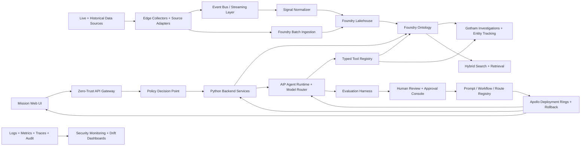

# ClearGlassInc Artemis Self-Evolving AI Intelligence Platform Full-Stack Blueprint

## System Architecture

ClearGlassInc Artemis is a secure, coalition-aware, latency-sensitive intelligence platform that combines Palantir Gotham, Foundry, AIP, and Apollo into a governed intelligence operating system. Gotham provides operational investigations, link analysis, entity tracking, and case workflows. Foundry provides governed data integration, pipelines, ontology, transforms, and application logic. AIP provides copilots, tool-using agents, model routing, prompt governance, and evaluations. Apollo provides signed deployment, runtime control, progressive delivery, rollback, and environment-specific policy enforcement.

The platform is intentionally self-improving but not self-authorizing. It may propose improvements to prompts, workflows, heuristics, retrieval settings, and model routing only inside explicit human-approved guardrails. It may not expand its mission scope, grant access, change operational objectives, execute significant actions, or promote its own upgrades without review.

### End-to-end topology



### Layer responsibilities

| Layer | Production implementation | Palantir alignment | Non-negotiable controls |
| --- | --- | --- | --- |
| Frontend | TypeScript mission console, graph workspace, alert queue, approval console, eval dashboard | Gotham workspaces, Foundry applications, AIP Assist | classification banners, redaction-aware rendering, visible provenance, keyboard-accessible approvals |
| API gateway | Python/FastAPI or Envoy-backed gateway with mTLS, JWT validation, rate limits, and request signing | Foundry application APIs and Apollo service mesh | identity propagation, request body hashing, idempotency keys, tenant and coalition boundary checks |
| Backend services | Case, alert, mission, feedback, workflow, proposal, and audit services | Foundry Functions and operational services | typed contracts, timeouts, bounded retries, append-only material events |
| Data layer | Foundry datasets, streaming topics, lakehouse history, hot operational stores | Foundry pipelines, transforms, datasets | source lineage, schema contracts, data quality checks, retention policies |
| Ontology layer | Mission, Signal, Entity, Relationship, Evidence, Case, ActionPackage, PromptVersion, WorkflowVersion | Foundry Ontology and Gotham entity graph | bitemporal state, confidence per assertion, classification markings, row/column/entity permissions |
| AI orchestration | AIP copilots, multi-agent workflows, model router, prompt registry, eval runner | AIP agents, AIP Logic, AIP evaluations | tool allowlists, cited outputs, model policy, approval gates, replayable traces |
| Policy layer | OPA/Rego or Cedar-style policy engine plus Foundry markings | Foundry security markings, AIP tool policy, Apollo runtime policy | deny-by-default, purpose binding, coalition caveats, signed approvals |
| Observability | OpenTelemetry, privacy-aware logs, metrics, traces, eval telemetry, immutable audit ledger | Foundry operational telemetry, Apollo health | no secrets in logs, trace IDs on every action, drift and abuse-case alerts |
| Deployment | Apollo rings: development, shadow, canary, mission, rollback | Apollo | signed artifacts, health gates, kill switches, rollback refs, promotion approval |

### Primary runtime flow

1. Edge collectors normalize live signals and historical imports into signed source envelopes.
2. Foundry pipelines validate schemas, attach lineage, classify data, and publish ontology objects.
3. Gotham and Foundry applications expose entity graphs, cases, alerts, and mission workflows to operators.
4. AIP agents retrieve only authorized ontology context and prepare cited outputs, cases, briefs, and action packages.
5. Policy enforcement happens before query, before tool execution, before generated output, and before deployment.
6. Operators approve, reject, or correct outputs. Those decisions become governed feedback records.
7. The self-improvement loop converts feedback and outcomes into eval cases, candidate diffs, risk assessments, and human-reviewed proposals.
8. Apollo deploys approved prompt, workflow, model-route, and service changes progressively with automatic rollback triggers.

## Data and Ontology

The ontology is the system contract shared by humans, services, and AI agents. Agents do not reason over raw data dumps; they reason over typed ontology objects with provenance, confidence, temporal validity, mission scope, and permissions.

### Core ontology object types

| Object type | Representative fields | Purpose |
| --- | --- | --- |
| `Mission` | `mission_id`, `name`, `objective`, `theater`, `jurisdiction`, `classification`, `coalition_tags`, `active_from`, `active_to`, `commander_id`, `status` | Scopes analysis, access, approvals, and operational context. |
| `Signal` | `signal_id`, `source_system`, `source_reliability`, `observed_at`, `received_at`, `payload_hash`, `classification`, `compartments`, `confidence`, `lineage_refs` | Normalized live or historical input from sensors, reports, feeds, or operators. |
| `Entity` | `entity_id`, `kind`, `canonical_name`, `aliases`, `markings`, `first_seen`, `last_seen`, `confidence`, `risk_score` | Person, organization, place, facility, device, vessel, account, asset, or event. |
| `Relationship` | `relationship_id`, `source_entity_id`, `target_entity_id`, `predicate`, `valid_from`, `valid_to`, `confidence`, `evidence_ids` | Temporal graph edge for link analysis and agent correlation. |
| `Evidence` | `evidence_id`, `source_uri`, `sha256`, `collector`, `collected_at`, `lineage`, `handling_caveats`, `retention_class` | Immutable support for claims, alerts, and products. |
| `Alert` | `alert_id`, `mission_id`, `severity`, `score`, `status`, `sla_deadline`, `disposition`, `triage_trace_id` | Operational item requiring triage, enrichment, or escalation. |
| `Case` | `case_id`, `mission_id`, `owner_id`, `priority`, `state`, `linked_entities`, `approval_state` | Investigation container for workflows and decisions. |
| `ActionPackage` | `package_id`, `case_id`, `recommended_action`, `risk_level`, `expected_effect`, `approvals`, `execution_state` | Draft response package that cannot execute until required approval gates pass. |
| `OperatorFeedback` | `feedback_id`, `operator_id`, `artifact_ref`, `rating`, `correction`, `label`, `outcome`, `created_at` | Learning signal for evals and controlled upgrades. |
| `PromptVersion` | `prompt_version_id`, `name`, `version`, `hash`, `owner`, `eval_score`, `approval_state`, `apollo_ring` | Versioned prompt artifact for AIP agents. |
| `WorkflowVersion` | `workflow_version_id`, `name`, `graph_hash`, `risk_class`, `eval_score`, `approval_state`, `apollo_ring` | Versioned workflow DAG or state machine. |
| `ImprovementProposal` | `proposal_id`, `target_type`, `target_ref`, `diff`, `evidence`, `eval_results`, `risk`, `approval_state`, `rollback_ref` | Human-reviewable self-upgrade candidate. |

### Relationship model

```yaml
relationships:
  - Mission CONSTRAINS Case
  - Mission AUTHORIZES PurposeOfUse
  - Case CONTAINS Alert
  - Alert TRIGGERED_BY Signal
  - Signal MENTIONS Entity
  - Signal SUPPORTED_BY Evidence
  - Entity RELATED_TO Entity
  - Entity LOCATED_AT Location
  - Entity PARTICIPATED_IN Event
  - Evidence SUPPORTS Relationship
  - OperatorFeedback CORRECTS Alert
  - OperatorFeedback EVALUATES IntelProduct
  - PromptVersion POWERS Agent
  - WorkflowVersion ORCHESTRATES Agent
  - ImprovementProposal MODIFIES PromptVersion
  - ImprovementProposal MODIFIES WorkflowVersion
```

### SQL reference schema

```sql
CREATE TABLE artemis_relationship_assertions (
    relationship_id TEXT PRIMARY KEY,
    mission_id TEXT NOT NULL,
    source_entity_id TEXT NOT NULL,
    target_entity_id TEXT NOT NULL,
    predicate TEXT NOT NULL,
    valid_from TIMESTAMPTZ NOT NULL,
    valid_to TIMESTAMPTZ,
    tx_from TIMESTAMPTZ NOT NULL DEFAULT now(),
    tx_to TIMESTAMPTZ,
    confidence NUMERIC(4,3) NOT NULL CHECK (confidence >= 0 AND confidence <= 1),
    classification TEXT NOT NULL,
    compartments TEXT[] NOT NULL DEFAULT '{}',
    coalition_visibility TEXT[] NOT NULL DEFAULT '{}',
    evidence_ids TEXT[] NOT NULL,
    lineage_hash TEXT NOT NULL,
    created_by TEXT NOT NULL,
    created_at TIMESTAMPTZ NOT NULL DEFAULT now()
);

CREATE INDEX artemis_relationships_mission_idx
    ON artemis_relationship_assertions (mission_id, predicate, valid_from DESC);

CREATE TABLE artemis_improvement_proposals (
    proposal_id TEXT PRIMARY KEY,
    target_type TEXT NOT NULL CHECK (target_type IN ('prompt', 'workflow', 'model_route', 'heuristic')),
    target_ref TEXT NOT NULL,
    candidate_version TEXT NOT NULL,
    diff_json JSONB NOT NULL,
    evidence_refs TEXT[] NOT NULL,
    eval_results JSONB NOT NULL,
    risk_level TEXT NOT NULL CHECK (risk_level IN ('low', 'medium', 'high', 'critical')),
    approval_state TEXT NOT NULL CHECK (approval_state IN ('draft', 'queued', 'approved', 'rejected', 'rolled_back')),
    rollback_ref TEXT NOT NULL,
    created_by TEXT NOT NULL,
    created_at TIMESTAMPTZ NOT NULL DEFAULT now()
);
```

### How the ontology drives workflows and agents

- Human workflows inherit mission scope, case state, classification markings, and required approvals from ontology object metadata.
- AI tools receive server-side policy filters derived from the operator identity, mission, clearance, compartments, coalition tags, purpose of use, and action risk.
- Generated summaries must cite `Evidence` and `Signal` objects; unsupported claims are blocked by the response validator.
- Confidence is attached to assertions and relationships, not merely to entities, so the system can explain why confidence changed.
- Bitemporal state preserves what was known at decision time and what was true in the world, enabling replay, audit, and rollback analysis.

## AI and Agent Design

### Copilots

| Copilot | Primary users | Capabilities | Mandatory gates |
| --- | --- | --- | --- |
| Analyst Copilot | Investigators and analysts | entity summaries, link analysis, evidence search, hypothesis generation, investigation notes | cited outputs, no unsourced claims, case mutation checks |
| Commander Copilot | Mission commanders | operational posture, prioritization, risk comparisons, courses of action | human approval for tasking, external communication, action packages |
| Data Steward Copilot | Data owners and ontology stewards | schema drift explanation, ontology mapping suggestions, data quality triage | approval for schema, retention, lineage, or permission changes |
| Governance Copilot | Security, legal, coalition release officers | policy explanations, audit trails, denied-query explanations | cannot override policy; can only recommend remediation |
| ModelOps Copilot | AI engineering and evaluation teams | prompt diffs, workflow diffs, route tuning, eval diagnosis | human review, eval thresholds, Apollo rollout gates |

### Multi-agent workflow pattern

```yaml
workflow: triage_enrich_correlate_recommend
trigger: signal.received
max_steps: 12
timeout_seconds: 45
agents:
  - triage_agent:
      goal: classify relevance, severity, and mission fit
      tools: [ontology_query, source_reliability_lookup]
  - enrichment_agent:
      goal: retrieve authorized corroborating context
      tools: [ontology_query, evidence_fetch, search_index]
  - correlation_agent:
      goal: link signals to entities, relationships, cases, and time windows
      tools: [graph_neighbors, temporal_pattern_search]
  - summarization_agent:
      goal: produce a cited analyst brief
      tools: [citation_builder, redaction_validator]
  - recommendation_agent:
      goal: draft response options with risk, confidence, and required approvals
      tools: [action_package_draft, policy_explain]
approvals:
  create_low_risk_case: auto_allowed_with_audit
  notify_external_party: human_required
  operational_action_package: commander_required
  cross_coalition_release: release_officer_required
```

### Agent guardrails

- Agents are planners and drafters by default; deterministic services enforce authorization and mutation rules.
- Every tool call carries `actor_id`, `mission_id`, `purpose`, `trace_id`, `policy_context`, `artifact_hash`, and an `approval_token` when required.
- Significant actions are modeled as state-machine transitions and require explicit human approval tokens bound to action, payload hash, approver, expiry, and mission.
- Agents cannot grant themselves new tools, new data access, new deployment permissions, or broader goals.
- Tool outputs are untrusted until schema-validated, policy-filtered, and cited.

## Self-Improvement Loop

ClearGlassInc Artemis gets better through a controlled loop: capture evidence, generate evals, propose candidate upgrades, score candidates, require human approval, deploy through Apollo, monitor outcomes, and roll back when guardrails fail.

### Learning signals

- Operator ratings, corrections, dismissals, escalations, and free-text rationales.
- Query logs, retrieval miss reports, low-confidence summaries, and denied-tool attempts.
- Alert outcomes such as true positive, false positive, false negative, duplicate, stale, or insufficient evidence.
- Mission results such as time-to-triage, time-to-brief, approval latency, commander acceptance, and post-action outcome labels.
- Drift signals such as schema changes, source reliability shifts, embedding distribution movement, prompt regression, and latency spikes.

### Controlled upgrade pipeline

```text
Feedback + outcomes + query traces
  -> sanitize and label
  -> generate eval cases with expected assertions and forbidden failures
  -> create candidate prompt/workflow/route/heuristic diffs
  -> run offline quality, safety, latency, and policy regression evals
  -> risk-rank proposal and attach rollback reference
  -> human review in approval console
  -> Apollo shadow deployment
  -> canary ring with live guardrails
  -> mission ring if metrics remain within thresholds
  -> automatic rollback or freeze on invariant violation
```

### Upgrade safety requirements

- A candidate cannot promote itself; promotion requires an authorized human reviewer and Apollo policy.
- Every proposal stores source feedback, diff, eval set, baseline score, candidate score, risk level, approver, and rollback reference.
- Drift detection creates proposals or alerts; it does not silently change behavior.
- A/B tests are limited to approved prompts and workflows, never to authorization policy or action approval gates.
- Model routing changes must preserve data residency, classification, latency SLOs, cost ceilings, and tool compatibility.

## Full-Stack Implementation

### Web UI

The mission console is a TypeScript application with strict classification banners, redaction-aware components, and operator approval flows.

```tsx
export function AlertReviewPanel({ alert, policy }: { alert: AlertView; policy: PolicyDecision }) {
  return (
    <section aria-labelledby="alert-title" data-classification={alert.classification}>
      <header>
        <p className="classification-banner">{alert.classification}</p>
        <h2 id="alert-title">{alert.title}</h2>
        <p>Severity: {alert.severity} · Confidence: {Math.round(alert.confidence * 100)}%</p>
      </header>
      <EvidenceList evidence={alert.authorizedEvidence} />
      <RecommendationCard recommendation={alert.recommendation} />
      <button disabled={!policy.canApprove} data-action="approve-package">
        Approve drafted action package
      </button>
      <button data-action="reject-package">Reject and provide correction</button>
    </section>
  );
}
```

### API gateway and backend services

Backend services are Python-first for precision, deterministic policy checks, and auditable state transitions.

```python
from dataclasses import dataclass
from enum import StrEnum
from typing import Any
from fastapi import FastAPI, Header, HTTPException
from pydantic import BaseModel, Field

app = FastAPI(title="ClearGlassInc Artemis Mission API")

class Risk(StrEnum):
    LOW = "low"
    MEDIUM = "medium"
    HIGH = "high"
    CRITICAL = "critical"

class ActionPackageRequest(BaseModel):
    mission_id: str
    case_id: str
    recommended_action: str = Field(min_length=8, max_length=4000)
    evidence_ids: list[str] = Field(min_length=1)
    expected_effect: str
    risk: Risk

@dataclass(frozen=True)
class ActorContext:
    actor_id: str
    clearances: frozenset[str]
    compartments: frozenset[str]
    coalition_tags: frozenset[str]
    purpose: str

async def evaluate_policy(actor: ActorContext, action: str, resource: dict[str, Any]) -> dict[str, Any]:
    # In production this calls the policy decision point with mTLS and signed inputs.
    denied = resource["classification"] not in actor.clearances
    return {"allow": not denied, "reason": "classification_mismatch" if denied else "allowed"}

@app.post("/v1/action-packages")
async def draft_action_package(
    body: ActionPackageRequest,
    x_actor_id: str = Header(),
    x_purpose: str = Header(),
) -> dict[str, str]:
    actor = ActorContext(
        actor_id=x_actor_id,
        clearances=frozenset({"SECRET"}),
        compartments=frozenset({"ARTEMIS"}),
        coalition_tags=frozenset({"US"}),
        purpose=x_purpose,
    )
    resource = {"mission_id": body.mission_id, "classification": "SECRET", "risk": body.risk}
    decision = await evaluate_policy(actor, "action_package:draft", resource)
    if not decision["allow"]:
        raise HTTPException(status_code=403, detail={"code": "policy_denied", "reason": decision["reason"]})

    package_id = f"apkg_{body.case_id}"
    # Persist draft plus append-only audit event; execution remains blocked until approval.
    return {"package_id": package_id, "state": "draft", "requires_approval": str(body.risk in {Risk.HIGH, Risk.CRITICAL})}
```

### Event bus and streaming handlers

```python
class SignalEnvelope(BaseModel):
    signal_id: str
    source_system: str
    observed_at: str
    payload_hash: str
    classification: str
    compartments: list[str]
    payload: dict[str, Any]

async def handle_signal_received(event: SignalEnvelope) -> None:
    validate_source_contract(event)
    lineage_ref = await persist_raw_evidence(event)
    normalized = await normalize_signal(event, lineage_ref=lineage_ref)
    await publish_ontology_mutation(normalized)
    await enqueue_agent_workflow("triage_enrich_correlate_recommend", signal_id=event.signal_id)
```

### Ontology-driven query service

```python
def build_authorized_entity_query(actor: ActorContext, mission_id: str, entity_id: str) -> tuple[str, dict[str, Any]]:
    sql = """
    SELECT entity_id, canonical_name, kind, confidence, risk_score, classification, compartments
    FROM artemis_entities
    WHERE mission_id = :mission_id
      AND entity_id = :entity_id
      AND classification = ANY(:clearances)
      AND compartments <@ :compartments
    """
    params = {
        "mission_id": mission_id,
        "entity_id": entity_id,
        "clearances": list(actor.clearances),
        "compartments": list(actor.compartments),
    }
    return sql, params
```

### Tool-using AIP agent contract

```python
class ToolCall(BaseModel):
    tool_name: str
    mission_id: str
    actor_id: str
    purpose: str
    trace_id: str
    arguments: dict[str, Any]
    approval_token: str | None = None

async def execute_tool(call: ToolCall) -> dict[str, Any]:
    tool = TOOL_REGISTRY.get(call.tool_name)
    if tool is None:
        raise PermissionError("tool_not_registered")
    decision = await evaluate_policy(
        actor=await load_actor(call.actor_id, call.purpose),
        action=f"tool:{call.tool_name}",
        resource={"mission_id": call.mission_id, "arguments": call.arguments},
    )
    if not decision["allow"]:
        await audit_denial(call, decision)
        raise PermissionError(decision["reason"])
    result = await tool.invoke(call.arguments)
    return validate_and_redact_tool_result(result, call)
```

### Workflow state machine

```python
ALLOWED_TRANSITIONS = {
    "draft": {"queued_for_approval", "rejected"},
    "queued_for_approval": {"approved", "rejected", "expired"},
    "approved": {"executed", "rolled_back"},
    "executed": {"closed"},
    "rejected": set(),
    "expired": set(),
}

async def transition_package(package_id: str, target_state: str, approval_token: str | None) -> None:
    package = await load_action_package(package_id)
    if target_state not in ALLOWED_TRANSITIONS[package.state]:
        raise ValueError(f"invalid_transition:{package.state}->{target_state}")
    if target_state in {"approved", "executed"}:
        await verify_approval_token(approval_token, package)
    await save_package_state(package_id, target_state)
    await append_audit_event("action_package.transition", package_id, {"from": package.state, "to": target_state})
```

### Evaluation pipeline

```python
class EvalCase(BaseModel):
    case_id: str
    prompt_version: str
    input_trace_ref: str
    expected_claims: list[str]
    forbidden_claims: list[str]
    required_citations: list[str]
    max_latency_ms: int

async def run_candidate_eval(candidate_ref: str, eval_cases: list[EvalCase]) -> dict[str, float]:
    passed = 0
    latencies: list[float] = []
    for case in eval_cases:
        result = await replay_agent_trace(candidate_ref, case.input_trace_ref)
        assert_no_forbidden_claims(result, case.forbidden_claims)
        assert_required_citations(result, case.required_citations)
        latencies.append(result.latency_ms)
        passed += int(set(case.expected_claims).issubset(set(result.claims)))
    return {
        "precision_proxy": passed / max(len(eval_cases), 1),
        "p95_latency_ms": percentile(latencies, 95),
        "cases": float(len(eval_cases)),
    }
```

## Security and Governance

### Need-to-know and coalition boundaries

- Access decisions combine identity, clearance, compartments, coalition tags, mission membership, purpose of use, object markings, time window, and action risk.
- Row-level, column-level, and entity-level filters are computed server-side and applied before retrieval.
- Cross-coalition release requires explicit release-officer approval and produces a redacted artifact with a separate lineage hash.
- UI hiding is not a security control; backend policy remains authoritative.

### Policy-as-code example

```rego
package artemis.authz

default allow := false

allow if {
  input.actor.authenticated
  input.resource.mission_id in input.actor.missions
  input.resource.classification in input.actor.clearances
  every c in input.resource.compartments { c in input.actor.compartments }
  input.purpose in input.resource.allowed_purposes
  not high_risk_without_approval
}

high_risk_without_approval if {
  input.action.risk in {"high", "critical"}
  not input.approval.valid
}
```

### Immutable audit model

Every material event is appended with actor, action, mission, resource hash, policy decision, tool trace, model version, prompt version, workflow version, and parent event hash. Audit exports are written to WORM-capable storage and monitored for chain breaks.

```json
{
  "event_type": "agent.tool.executed",
  "trace_id": "trc_01J...",
  "mission_id": "mis_artemis_042",
  "actor_id": "analyst_17",
  "tool_name": "ontology_query",
  "policy_decision": "allow",
  "model_route": "aip-secure-reasoner:v7",
  "prompt_version": "triage_agent:4.2.1",
  "resource_hash": "sha256:...",
  "parent_event_hash": "sha256:..."
}
```

### Model and prompt governance

- Prompt templates, tools, workflow graphs, model routes, eval cases, and release configs are versioned artifacts.
- Promotion requires test evidence, reviewer identity, risk classification, rollback plan, and Apollo deployment ring.
- High-risk changes require security and mission-owner review.
- Prompt injection defenses include context partitioning, tool allowlists, citation validation, output schemas, and denial of instructions embedded in retrieved content.

## Code Examples

### Improvement proposal generator

```python
async def propose_prompt_upgrade(feedback_batch_id: str, target_prompt: str) -> str:
    feedback = await load_sanitized_feedback(feedback_batch_id)
    baseline = await load_prompt_version(target_prompt, stage="mission")
    eval_cases = await synthesize_eval_cases(feedback, baseline)
    candidate = await generate_candidate_prompt_diff(baseline, feedback)
    eval_results = await run_candidate_eval(candidate.ref, eval_cases)

    risk = classify_upgrade_risk(candidate.diff, eval_results)
    proposal_id = await save_improvement_proposal(
        target_type="prompt",
        target_ref=baseline.ref,
        candidate_version=candidate.ref,
        diff_json=candidate.diff,
        evidence_refs=[feedback_batch_id],
        eval_results=eval_results,
        risk_level=risk,
        approval_state="queued" if eval_results["precision_proxy"] >= 0.92 else "draft",
        rollback_ref=baseline.ref,
    )
    await append_audit_event("improvement.proposed", proposal_id, {"risk": risk, "target": baseline.ref})
    return proposal_id
```

### Model router skeleton

```python
def choose_model_route(task: str, classification: str, latency_budget_ms: int, requires_tool_use: bool) -> str:
    eligible = [
        route for route in MODEL_ROUTES
        if classification in route.allowed_classifications
        and route.p95_latency_ms <= latency_budget_ms
        and (not requires_tool_use or route.supports_tools)
    ]
    if not eligible:
        raise RuntimeError("no_compliant_model_route")
    return max(eligible, key=lambda route: (route.eval_score, -route.p95_latency_ms)).name
```

### Approval-bound action execution

```python
async def execute_approved_package(package_id: str, approval_token: str) -> dict[str, str]:
    package = await load_action_package(package_id)
    await verify_approval_token(approval_token, package)
    await transition_package(package_id, "executed", approval_token)
    # Production implementation delegates only to registered, reversible, logged executors.
    execution_id = await dispatch_executor(package.executor_name, package.payload)
    await append_audit_event("action_package.executed", package_id, {"execution_id": execution_id})
    return {"execution_id": execution_id, "state": "executed"}
```

## Scenario Walkthrough

At 03:14 UTC, a live signal enters ClearGlassInc Artemis from an approved source adapter. The edge collector hashes the payload, validates the source contract, assigns classification and compartment markings, and publishes `signal.received` to the streaming layer. Foundry pipelines persist the raw evidence, normalize fields, attach lineage, and create a `Signal` ontology object.

The triage workflow starts automatically. The Triage Agent scores the signal as mission-relevant because the entity graph shows a temporal relationship to an open case in Gotham. The Enrichment Agent retrieves only authorized evidence, the Correlation Agent links the signal to two prior events in the same time window, and the Summarization Agent drafts a cited brief. The Recommendation Agent prepares three response options: monitor, escalate to commander, or draft an action package. Because the recommended package is high risk, execution is blocked until a commander approves it.

An analyst reviews the brief in the mission console. The analyst accepts the entity link but rejects one low-confidence relationship as stale. That correction writes an `OperatorFeedback` record and updates the relationship assertion with a closed transaction time rather than deleting history. The commander approves a revised, lower-risk package. The approval token is bound to the mission, package hash, approver, action, and expiry. The backend verifies the token, executes the approved state transition, and appends audit events for the transition and execution.

After the mission window, the self-improvement controller batches the analyst correction, query trace, alert disposition, latency metrics, and commander outcome. It generates eval cases that require the system to distinguish stale relationships from currently valid ones. The ModelOps Agent proposes a prompt and retrieval heuristic update that weights bitemporal validity more strongly. Offline evals show improved precision without latency regression, so an `ImprovementProposal` is queued. A human reviewer approves it, Apollo deploys it to shadow, then canary. Drift and eval dashboards remain green, so Apollo promotes it to the mission ring. If false positives rise or policy validators fail, Apollo rolls the route back to the stored `rollback_ref` and freezes further promotion.

The system has improved, but only by learning from governed evidence, passing evals, preserving auditability, and obtaining human approval before production behavior changed.
