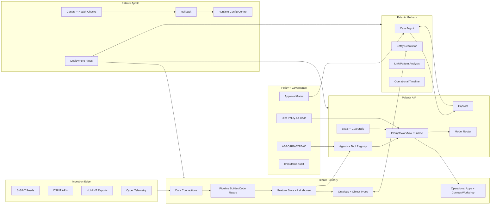

# ClearGlassInc Artemis — Self-Evolving AI Intelligence Platform Blueprint

## 1) System Architecture

### 1.1 Mission Envelope
ClearGlassInc Artemis operates in secure, coalition-aware, multi-domain, latency-sensitive environments. The platform is designed to:
- Fuse historical and live intelligence at machine speed.
- Assist analysts and commanders with auditable AI copilots.
- Self-improve prompts/workflows/model routing under explicit human approvals.
- Enforce policy, provenance, and need-to-know segmentation by default.

### 1.2 Logical Architecture (Palantir-aligned)



### 1.3 Full-Stack Component Map
- **Frontend**: React/TypeScript mission console; map/timeline/link graph panels; copilot chat; approval queue.
- **API Gateway**: Envoy/Kong with mTLS + JWT + attribute claims.
- **Backend services (Python/FastAPI)**: case orchestration, ontology query service, agent coordinator, feedback capture.
- **Streaming layer**: Kafka (or Foundry streaming connectors) for event fanout.
- **Data layer**: Foundry lakehouse datasets + indexed retrieval (OpenSearch/Vector store with policy filters).
- **AI orchestration**: AIP agents, tool contracts, model routing, eval pipelines.
- **Policy layer**: OPA + Foundry/Gotham ACL + row/entity filters.
- **Observability**: OpenTelemetry + Prometheus + Grafana + eval dashboards.
- **Deployment**: Apollo rings (dev/stage/prod), canary, signed artifacts, rollback.

---

## 2) Data and Ontology

### 2.1 Ontology Core (Foundry Object Model)

**Entities**
- `Person`, `Organization`, `Device`, `Account`, `Location`, `Event`, `Signal`, `Case`, `Mission`, `ActionRecommendation`, `EvidenceArtifact`.

**Relationships**
- `Person -> uses -> Device`
- `Device -> observed_at -> Location`
- `Person -> associated_with -> Organization`
- `Event -> contributes_to -> Case`
- `EvidenceArtifact -> supports -> ActionRecommendation`
- `Mission -> contains -> Case`

**Meta fields (all object types)**
- `classification`, `compartment`, `coalition_tags`
- `source_system`, `collection_method`
- `confidence_score` (0-1)
- `valid_time_start`, `valid_time_end`, `recorded_at`
- `lineage_ref` (immutable provenance chain)
- `policy_labels` (ABAC attributes)

### 2.2 Example DDL-like Ontology Spec (conceptual)

```sql
CREATE OBJECT TYPE Person (
  person_id STRING PRIMARY KEY,
  full_name STRING,
  aliases ARRAY<STRING>,
  dob DATE,
  nationality STRING,
  confidence_score DOUBLE,
  classification STRING,
  compartment ARRAY<STRING>,
  coalition_tags ARRAY<STRING>,
  valid_time_start TIMESTAMP,
  valid_time_end TIMESTAMP,
  recorded_at TIMESTAMP,
  lineage_ref STRING
);

CREATE OBJECT TYPE Device (
  device_id STRING PRIMARY KEY,
  imei STRING,
  mac_addr STRING,
  device_type STRING,
  confidence_score DOUBLE,
  classification STRING,
  policy_labels ARRAY<STRING>
);

CREATE LINK TYPE Uses (
  from Person,
  to Device,
  first_seen TIMESTAMP,
  last_seen TIMESTAMP,
  confidence_score DOUBLE,
  lineage_ref STRING
);
```

### 2.3 Ontology as Control Plane for Humans + AI
- Human workflows read ontology-backed cases/timelines (Gotham UI objects).
- AI tools are constrained to ontology-scoped query APIs (`query_case_entities`, `get_temporal_links`) to prevent free-form uncontrolled data access.
- Permission checks apply uniformly across UI, API, and agent tools using ontology labels.

---

## 3) AI and Agent Design

### 3.1 Copilot Roles
- **Analyst Copilot**: triage assistance, cross-source summarization, confidence heatmap.
- **Commander Copilot**: options analysis, risk matrix, recommended COA (course of action).

### 3.2 Multi-Agent Workflow
1. **Triage Agent**: classify severity, dedupe, assign case candidate.
2. **Enrichment Agent**: pull related entities/signals/history.
3. **Correlation Agent**: detect patterns, anomalies, campaign overlaps.
4. **Summarization Agent**: produce analyst-ready SITREP.
5. **Recommendation Agent**: propose actions with confidence, legal/policy rationale.

### 3.3 Tool-Using Agents (Python contracts)
- `search_ontology_entities`
- `fetch_case_timeline`
- `open_or_update_case`
- `generate_action_package`
- `request_human_approval`

Operationally significant actions (`notify field units`, `task sensor`, `escalate mission posture`) are always **human-gated**.

---

## 4) Self-Improvement Loop (Safe Evolution)

### 4.1 Signals Captured
- Prompt input/output and token traces.
- Operator edits, overrides, and rejects.
- Alert outcomes (true positive / false positive / missed).
- Mission KPIs (time-to-triage, action effectiveness, downstream impact).
- Latency, tool failures, hallucination flags.

### 4.2 Improvement Pipeline
1. **Telemetry ingestion** → append-only `ai_interaction_log`.
2. **Eval set synthesis** from hard examples and failure clusters.
3. **Candidate generation**:
   - Prompt diffs
   - Workflow graph edits
   - Model routing policy changes
4. **Offline replay** on curated eval suites.
5. **Policy + safety checks** (no privilege expansion, no hidden goals).
6. **Human approval board** (mission lead + AI governance).
7. **Canary rollout via Apollo**.
8. **Continuous drift monitoring** and rollback if regressions.

### 4.3 Versioning + Rollback
- Version every prompt/workflow/router rule: `artifact_id`, `semver`, `commit_sha`, `approved_by`, `effective_window`.
- Store immutable changelog in audit dataset + signed deployment manifest.
- Automatic rollback trigger when:
  - precision drops > threshold,
  - latency budget exceeded,
  - operator trust score drops,
  - policy violation incidents > 0.

---

## 5) Full-Stack Implementation Blueprint

### 5.1 Frontend (React/TypeScript)
- Mission Dashboard: live event queue + map + graph + case pane.
- Copilot Panel: explanation, source citations, confidence bars.
- Approval Console: queued high-impact actions with approve/reject and rationale.
- Evals Console: side-by-side A/B prompt outputs and reviewer voting.

### 5.2 Backend Services (Python microservices)
- `ingest-service`: normalizes raw feeds, pushes events.
- `ontology-service`: graph/object query abstraction.
- `agent-orchestrator`: stateful workflow execution.
- `policy-service`: centralized authorization decision.
- `feedback-service`: logs operator edits and outcomes.
- `eval-service`: replay harness + scoring.

### 5.3 Event Topics
- `intel.raw.events`
- `intel.normalized.events`
- `intel.case.updates`
- `ai.agent.decisions`
- `ai.approval.requests`
- `ai.feedback.events`
- `ai.eval.results`

### 5.4 Model Router
- Small model for extraction/classification.
- Mid model for summarization.
- Frontier model for deep reasoning with strict tool usage + citations.
- Router policy considers classification level, latency SLO, and task criticality.

---

## 6) Security and Governance

- **Need-to-know** with ABAC + RBAC + mission context attributes.
- **Row/column/entity-level controls** in Foundry/Gotham datasets/objects.
- **Compartmentalization** by coalition and mission codeword tags.
- **Zero-trust runtime**: mTLS, short-lived tokens, workload identity.
- **Full provenance**: lineage on every derived artifact and AI output.
- **Immutable logs**: append-only storage + cryptographic signing.
- **Model governance**: allowed model registry, approved use-cases.
- **Prompt governance**: prompt templates under code review + approvals.
- **Policy-as-code**: OPA rules tested in CI before Apollo deploy.

---

## 7) Code Examples (Python-first, production-oriented)

### 7.1 FastAPI API Gateway Adapter

```python
from fastapi import FastAPI, Depends, HTTPException
from pydantic import BaseModel
from typing import List

app = FastAPI(title="ClearGlassInc Artemis API")

class Principal(BaseModel):
    user_id: str
    roles: List[str]
    attrs: dict

class EventIn(BaseModel):
    event_id: str
    source: str
    payload: dict
    classification: str


def require_auth() -> Principal:
    # Replace with mTLS/JWT validation and claim extraction
    return Principal(user_id="u-123", roles=["analyst"], attrs={"coalition": "ALPHA"})


@app.post("/v1/events")
def ingest_event(evt: EventIn, principal: Principal = Depends(require_auth)):
    if evt.classification == "TOP_SECRET" and "ts_read" not in principal.roles:
        raise HTTPException(status_code=403, detail="insufficient clearance")
    # publish to intel.raw.events
    return {"status": "accepted", "event_id": evt.event_id}
```

### 7.2 Agent Tool Contract + Policy Gate

```python
from dataclasses import dataclass

@dataclass
class ToolContext:
    principal: dict
    mission_id: str
    classification: str


def policy_check(action: str, ctx: ToolContext, resource_attrs: dict) -> bool:
    # Stub for OPA/Foundry policy engine call
    if action == "case.write" and "commander" not in ctx.principal.get("roles", []):
        return False
    if resource_attrs.get("coalition") != ctx.principal.get("coalition"):
        return False
    return True


def open_or_update_case(ctx: ToolContext, case_payload: dict) -> dict:
    if not policy_check("case.write", ctx, {"coalition": case_payload["coalition"]}):
        raise PermissionError("policy denied")
    # write to Gotham/Foundry case object
    return {"case_id": "CASE-7781", "status": "updated"}
```

### 7.3 Workflow State Machine (agent orchestration)

```python
from enum import Enum

class Stage(str, Enum):
    TRIAGE = "TRIAGE"
    ENRICH = "ENRICH"
    CORRELATE = "CORRELATE"
    SUMMARIZE = "SUMMARIZE"
    RECOMMEND = "RECOMMEND"
    AWAIT_APPROVAL = "AWAIT_APPROVAL"
    EXECUTE = "EXECUTE"
    COMPLETE = "COMPLETE"


def next_stage(current: Stage, approved: bool | None = None) -> Stage:
    transitions = {
        Stage.TRIAGE: Stage.ENRICH,
        Stage.ENRICH: Stage.CORRELATE,
        Stage.CORRELATE: Stage.SUMMARIZE,
        Stage.SUMMARIZE: Stage.RECOMMEND,
        Stage.RECOMMEND: Stage.AWAIT_APPROVAL,
    }
    if current == Stage.AWAIT_APPROVAL:
        return Stage.EXECUTE if approved else Stage.COMPLETE
    if current == Stage.EXECUTE:
        return Stage.COMPLETE
    return transitions[current]
```

### 7.4 Eval Pipeline + Candidate Promotion

```python
from statistics import mean

PROMOTION_THRESHOLDS = {
    "precision": 0.92,
    "recall": 0.88,
    "p95_latency_ms": 2200,
    "trust_score": 4.3,
}


def evaluate_candidate(run_results: list[dict]) -> dict:
    agg = {
        "precision": mean(x["precision"] for x in run_results),
        "recall": mean(x["recall"] for x in run_results),
        "p95_latency_ms": max(x["p95_latency_ms"] for x in run_results),
        "trust_score": mean(x["trust_score"] for x in run_results),
    }
    pass_gate = (
        agg["precision"] >= PROMOTION_THRESHOLDS["precision"]
        and agg["recall"] >= PROMOTION_THRESHOLDS["recall"]
        and agg["p95_latency_ms"] <= PROMOTION_THRESHOLDS["p95_latency_ms"]
        and agg["trust_score"] >= PROMOTION_THRESHOLDS["trust_score"]
    )
    return {"metrics": agg, "promote": pass_gate}
```

### 7.5 OPA Policy-as-Code (Rego)

```rego
package clearglassinc.artemis.authz

default allow = false

allow if {
  input.action == "action.execute"
  input.principal.roles[_] == "commander"
  input.resource.classification <= input.principal.clearance
  input.resource.coalition == input.principal.coalition
  input.change.approved == true
}
```

---

## 8) Cinematic Scenario Walkthrough (Technically Credible)

1. **Live Event Ingest**: a border sensor emits anomaly `evt-9f21` at 13:04:21Z into `intel.raw.events`.
2. **Foundry Pipeline** normalizes payload, enriches geospatial metadata, writes to ontology `Event` object.
3. **Triage Agent (AIP)** scores severity `0.87` and opens `CASE-7781` in Gotham.
4. **Correlation Agent** links device fingerprints to prior smuggling pattern across two regions.
5. **Recommendation Agent** proposes `ActionPackage-23`: task UAV corridor scan + alert joint unit.
6. **Approval Gate** triggers because action impacts external assets; commander reviews rationale, evidence lineage, and confidence decomposition.
7. **Commander approves** at 13:06:02Z; execution adapter dispatches via authorized mission system.
8. **Outcome capture** after 47 minutes: alert classified true positive; intercept successful.
9. **Self-improvement loop**:
   - Operator noted summary missed one historical analog case.
   - Feedback logged in `ai.feedback.events`.
   - Eval service adds this to hard-negative/hard-positive set.
   - Prompt candidate + retrieval depth update tested offline.
   - Candidate improves recall +2.4% without latency breach.
   - Human governance board approves; Apollo canary deploys to 10% traffic.
   - Drift monitor remains stable; rollout promoted to 100%.

Result: ClearGlassInc Artemis improves future triage/correlation quality while remaining bounded by policy, approvals, and auditable controls.
