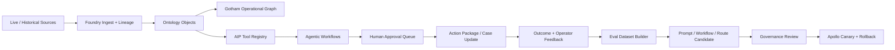

# ClearGlassInc Artemis System 2040 Skeleton Key Full-Stack Blueprint

## System Architecture

ClearGlassInc Artemis is a secure, coalition-aware, multi-domain intelligence platform that combines Palantir Gotham for operational investigations, Foundry for governed data integration and ontology-backed application logic, AIP for agentic copilots and evaluation-driven workflow automation, and Apollo for continuous delivery, rollback, and runtime control. The platform is designed for latency-sensitive missions where every recommendation is explainable, every action is approval-gated, and every model or prompt upgrade is versioned before release.

### Layered Reference Architecture

| Layer | Production responsibility | Core implementation pattern |
| --- | --- | --- |
| Web UI | Analyst console, commander dashboard, case boards, approval queues, eval dashboards | React/Next.js shell, websocket event streams, ontology-aware forms |
| API Gateway | Tenant routing, auth context, request signing, rate limits, audit envelope injection | FastAPI or Envoy front door with JWT/SPIFFE identity propagation |
| Backend Services | Case management, alert intake, action packages, feedback capture, workflow state | Python microservices, async workers, event-sourced state machines |
| Event Bus | Live telemetry, alert fanout, enrichment jobs, approval events, eval triggers | Kafka/Pulsar topics partitioned by mission, compartment, and releasability |
| Foundry Data Layer | Batch and streaming transforms, lineage, ontology objects, application logic | Foundry pipelines, object sets, action types, ontology-backed APIs |
| Gotham Operations | Entity tracking, link analysis, investigations, mission context | Gotham entity graph, watchlists, dossier timelines, investigation workspaces |
| AIP Orchestration | Copilots, tool-using agents, model routing, evals, prompt/workflow variants | AIP Logic functions, constrained tools, eval harnesses, human approval gates |
| Policy Layer | Need-to-know, row/column/entity-level controls, coalition boundaries | OPA/Rego, ABAC, data markings, dynamic policy decisions |
| Observability | Metrics, traces, immutable audit trails, model quality, operator trust | OpenTelemetry, Prometheus, tamper-evident append-only logs |
| Apollo Deployment | Secure rollout, canary, rollback, runtime configuration, drift response | Signed artifacts, environment promotion rings, SLO-gated releases |

### Runtime Control Plane



## Data and Ontology

The ontology is the contract between human workflows and AI behavior. Foundry normalizes raw records into governed object types, relationship types, action types, and permissions. Gotham consumes the same ontology to power operational investigations, while AIP agents use ontology metadata to decide which tools can be called, what evidence is required, and when approval is mandatory.

### Core Entities

| Entity | Purpose | High-value fields |
| --- | --- | --- |
| `Mission` | Operational container for objectives, ROE, coalition scope, and priority | `mission_id`, `objective`, `classification`, `coalition_scope`, `latency_slo_ms` |
| `IntelEvent` | Live or historical signal entering the system | `event_id`, `source_id`, `observed_at`, `confidence`, `classification`, `payload_hash` |
| `Entity` | Person, organization, device, account, vessel, location, asset | `entity_id`, `entity_type`, `aliases`, `confidence`, `current_state`, `valid_time` |
| `Relationship` | Typed edge between entities | `subject_id`, `predicate`, `object_id`, `confidence`, `evidence_ids`, `valid_from`, `valid_to` |
| `Case` | Investigation workspace | `case_id`, `mission_id`, `lead_analyst`, `status`, `priority`, `risk_score` |
| `ActionPackage` | Recommended operational response requiring review | `package_id`, `case_id`, `recommendation`, `legal_basis`, `approval_state`, `rollback_plan` |
| `FeedbackSignal` | Operator correction, approval, rejection, rating, or outcome | `signal_id`, `actor_id`, `artifact_ref`, `label`, `reason`, `mission_impact` |
| `EvalRun` | Offline or online evaluation result | `eval_id`, `candidate_ref`, `dataset_ref`, `precision`, `recall`, `latency_p95_ms`, `approved` |

### SQL Schema Skeleton

```sql
CREATE TABLE ontology_entity (
  entity_id UUID PRIMARY KEY,
  entity_type TEXT NOT NULL,
  display_name TEXT NOT NULL,
  aliases TEXT[] DEFAULT '{}',
  confidence NUMERIC(5,4) CHECK (confidence >= 0 AND confidence <= 1),
  classification TEXT NOT NULL,
  releasability TEXT[] NOT NULL,
  compartments TEXT[] NOT NULL,
  source_lineage JSONB NOT NULL,
  current_state JSONB NOT NULL,
  valid_time TSTZRANGE NOT NULL,
  system_time TSTZRANGE NOT NULL DEFAULT tstzrange(now(), NULL),
  created_at TIMESTAMPTZ NOT NULL DEFAULT now()
);

CREATE TABLE ontology_relationship (
  relationship_id UUID PRIMARY KEY,
  subject_id UUID NOT NULL REFERENCES ontology_entity(entity_id),
  predicate TEXT NOT NULL,
  object_id UUID NOT NULL REFERENCES ontology_entity(entity_id),
  confidence NUMERIC(5,4) NOT NULL,
  evidence_ids UUID[] NOT NULL,
  classification TEXT NOT NULL,
  releasability TEXT[] NOT NULL,
  valid_time TSTZRANGE NOT NULL,
  provenance JSONB NOT NULL,
  created_at TIMESTAMPTZ NOT NULL DEFAULT now()
);

CREATE TABLE feedback_signal (
  signal_id UUID PRIMARY KEY,
  mission_id UUID NOT NULL,
  actor_id TEXT NOT NULL,
  artifact_ref TEXT NOT NULL,
  signal_type TEXT NOT NULL CHECK (signal_type IN ('approve','reject','correct','rate','outcome')),
  label TEXT NOT NULL,
  reason TEXT,
  mission_impact NUMERIC(5,4),
  policy_context JSONB NOT NULL,
  created_at TIMESTAMPTZ NOT NULL DEFAULT now()
);
```

### Ontology-Driven Agent Behavior

1. An agent may only query object types included in the mission's authorization envelope.
2. Relationship confidence and provenance determine whether the agent can summarize, ask for enrichment, or propose action.
3. Temporal state prevents stale reasoning by forcing agents to distinguish observed time, valid time, and system processing time.
4. Classification, releasability, and compartments are embedded into every retrieval result and tool response.
5. Action packages inherit the strictest marking from their supporting entities, relationships, and evidence.

## AI and Agent Design

AIP provides the controlled agent layer. Agents do not directly mutate operational state; they request tool calls, produce evidence-linked recommendations, and submit operationally significant actions to approval queues.

### Copilot Types

| Copilot | Audience | Capabilities | Hard limits |
| --- | --- | --- | --- |
| Analyst Copilot | Investigators and fusion analysts | Triage alerts, enrich entities, summarize cases, explain evidence chains | Cannot close cases or send external actions without approval |
| Commander Copilot | Mission leads | Prioritize risk, compare courses of action, monitor readiness, draft briefs | Cannot bypass legal/policy review |
| Governance Copilot | Security, legal, compliance | Inspect lineage, validate policy, review prompt/workflow changes, audit releases | Cannot approve its own generated upgrades |

### Multi-Agent Workflow

```yaml
workflow: artemis_intel_triage_v1
states:
  - ingest_event
  - normalize_to_ontology
  - policy_filter
  - triage_score
  - enrich_entities
  - correlate_graph
  - summarize_evidence
  - recommend_action
  - require_human_approval
  - publish_case_update
  - capture_outcome
approval_gates:
  operational_action: mandatory_human_approval
  cross_coalition_release: governance_and_mission_owner_approval
  prompt_or_model_change: eval_board_approval
```

### Tool Registry Contract

```python
from typing import Literal
from pydantic import BaseModel, Field

class ToolContext(BaseModel):
    actor_id: str
    mission_id: str
    compartments: list[str]
    releasability: list[str]
    classification_ceiling: str
    approval_required: bool = True

class OntologyQuery(BaseModel):
    object_type: Literal['IntelEvent', 'Entity', 'Relationship', 'Case']
    filters: dict[str, str | float | int]
    max_results: int = Field(default=25, le=100)
    include_provenance: bool = True

class ActionPackageDraft(BaseModel):
    case_id: str
    recommendation: str
    evidence_refs: list[str]
    risk_score: float = Field(ge=0, le=1)
    legal_basis: str
    rollback_plan: str
    requires_approval: bool = True
```

## Self-Improvement Loop

The self-improvement loop is deliberately bounded: ClearGlassInc Artemis can propose improvements to prompts, workflows, heuristics, and model routing, but cannot autonomously change mission goals, policy boundaries, approval rules, or access controls.

### Improvement Pipeline

1. **Capture signals:** operator corrections, approvals, rejections, free-text feedback, query logs, case outcomes, alert disposition, latency, false-positive and false-negative labels.
2. **Convert to evals:** transform feedback into labeled evaluation datasets with mission, ontology, policy, and evidence context.
3. **Generate candidates:** propose prompt variants, retrieval filters, triage thresholds, workflow ordering changes, and model routing policies.
4. **Evaluate offline:** run replay tests across historical missions and adversarial safety suites.
5. **Review:** submit candidate diff, eval metrics, regression risks, and rollback plan to human governance board.
6. **Deploy canary:** Apollo releases candidate to a narrow mission ring with signed artifact verification.
7. **Monitor drift:** compare precision, recall, latency, operator trust, and policy violations against baselines.
8. **Promote or rollback:** promote only if SLOs and governance criteria pass; otherwise Apollo rolls back and records immutable evidence.

### Guardrail Matrix

| Candidate change | Automation allowed | Required approval | Rollback trigger |
| --- | --- | --- | --- |
| Prompt wording | Generate and test | Eval board | Precision drop, policy citation failure, trust drop |
| Workflow order | Simulate and canary | Mission owner + eval board | Latency breach, missed critical alert |
| Model routing | Offline eval and shadow mode | Model governance | Cost spike, hallucination increase, classification mismatch |
| Access policy | None | Security authority only | Any denied/overbroad access finding |
| Operational recommendation threshold | Propose only | Mission commander + legal | False-negative or false-positive breach |

## Full-Stack Implementation

### Repository Shape

```text
artemis/
  api/
    gateway.py
    auth.py
    policy.py
  services/
    intake.py
    ontology.py
    workflow.py
    feedback.py
    evals.py
    model_router.py
  agents/
    analyst_copilot.py
    commander_copilot.py
    governance_copilot.py
    tools.py
  observability/
    audit.py
    metrics.py
    tracing.py
  deployment/
    apollo_manifest.yaml
web/
  app/
    cases/[caseId]/page.tsx
    approvals/page.tsx
    evals/page.tsx
```

### Python Backend Skeleton

```python
from fastapi import FastAPI, Depends, HTTPException
from pydantic import BaseModel, Field

app = FastAPI(title='ClearGlassInc Artemis Control Plane')

class IntelEventIn(BaseModel):
    source_id: str
    mission_id: str
    observed_at: str
    classification: str
    releasability: list[str]
    payload: dict

class IntakeResponse(BaseModel):
    event_id: str
    workflow_id: str
    accepted: bool

async def require_policy(event: IntelEventIn, actor: str) -> None:
    allowed = event.classification in {'UNCLASSIFIED', 'CONFIDENTIAL', 'SECRET'}
    if not allowed:
        raise HTTPException(status_code=403, detail='classification ceiling exceeded')

@app.post('/v1/intel/events', response_model=IntakeResponse)
async def ingest_intel_event(event: IntelEventIn, actor: str = Depends(lambda: 'operator-001')):
    await require_policy(event, actor)
    event_id = await persist_ontology_event(event, actor)
    workflow_id = await start_triage_workflow(event_id=event_id, mission_id=event.mission_id)
    await audit('intel_event_ingested', actor=actor, object_ref=event_id, mission_id=event.mission_id)
    return IntakeResponse(event_id=event_id, workflow_id=workflow_id, accepted=True)
```

### Workflow State Machine

```python
from enum import Enum
from pydantic import BaseModel

class TriageState(str, Enum):
    INGESTED = 'ingested'
    POLICY_FILTERED = 'policy_filtered'
    ENRICHED = 'enriched'
    CORRELATED = 'correlated'
    RECOMMENDED = 'recommended'
    WAITING_APPROVAL = 'waiting_approval'
    COMPLETED = 'completed'
    ROLLED_BACK = 'rolled_back'

class WorkflowContext(BaseModel):
    workflow_id: str
    mission_id: str
    event_id: str
    state: TriageState
    evidence_refs: list[str] = []
    risk_score: float = 0.0
    approval_id: str | None = None

async def advance_triage(ctx: WorkflowContext) -> WorkflowContext:
    if ctx.state == TriageState.INGESTED:
        await enforce_need_to_know(ctx)
        ctx.state = TriageState.POLICY_FILTERED
    elif ctx.state == TriageState.POLICY_FILTERED:
        ctx.evidence_refs += await enrich_entities(ctx.event_id)
        ctx.state = TriageState.ENRICHED
    elif ctx.state == TriageState.ENRICHED:
        ctx.risk_score = await correlate_graph(ctx.event_id, ctx.evidence_refs)
        ctx.state = TriageState.CORRELATED
    elif ctx.state == TriageState.CORRELATED:
        ctx.approval_id = await draft_action_package(ctx)
        ctx.state = TriageState.WAITING_APPROVAL
    return ctx
```

### Policy-as-Code Example

```python
def can_read_entity(actor: dict, entity: dict, mission: dict) -> bool:
    if entity['classification'] not in actor['classification_clearances']:
        return False
    if not set(entity['compartments']).issubset(set(actor['compartments'])):
        return False
    if not set(entity['releasability']).intersection(set(actor['releasability'])):
        return False
    if mission['mission_id'] not in actor['authorized_missions']:
        return False
    return True
```

### Eval Pipeline

```python
from dataclasses import dataclass

@dataclass(frozen=True)
class EvalMetric:
    precision: float
    recall: float
    latency_p95_ms: int
    policy_violations: int
    operator_trust: float

@dataclass(frozen=True)
class CandidateChange:
    candidate_id: str
    change_type: str
    artifact_ref: str
    baseline_ref: str
    rollback_ref: str

async def evaluate_candidate(candidate: CandidateChange, dataset_ref: str) -> EvalMetric:
    replay_results = await replay_historical_missions(candidate, dataset_ref)
    safety_results = await run_policy_regression_suite(candidate)
    return EvalMetric(
        precision=replay_results.precision,
        recall=replay_results.recall,
        latency_p95_ms=replay_results.latency_p95_ms,
        policy_violations=safety_results.violations,
        operator_trust=replay_results.mean_trust_score,
    )

async def submit_for_release(candidate: CandidateChange, metric: EvalMetric) -> str:
    if metric.policy_violations > 0 or metric.precision < 0.92 or metric.recall < 0.88:
        return await reject_candidate(candidate, metric)
    return await create_human_review_ticket(candidate, metric)
```

### Web UI Blueprint

```tsx
export function ApprovalQueue({ packages }: { packages: ActionPackage[] }) {
  return (
    <section className="grid gap-4">
      {packages.map((pkg) => (
        <article key={pkg.packageId} className="rounded-xl border p-4 shadow-sm">
          <div className="flex items-center justify-between">
            <h2>{pkg.recommendation}</h2>
            <span>Risk: {Math.round(pkg.riskScore * 100)}%</span>
          </div>
          <EvidenceList evidenceRefs={pkg.evidenceRefs} />
          <PolicyBadge markings={pkg.markings} />
          <button onClick={() => approve(pkg.packageId)}>Approve with audit</button>
          <button onClick={() => reject(pkg.packageId)}>Reject and capture reason</button>
        </article>
      ))}
    </section>
  );
}
```

## Security and Governance

ClearGlassInc Artemis treats security as runtime logic, not documentation. Every query, agent tool call, UI object, eval dataset, and deployment artifact carries actor identity, mission context, data markings, provenance, and approval state.

### Controls

- **Need-to-know:** ABAC policies combine clearance, mission assignment, coalition scope, entity marking, and purpose of use.
- **Row/column/entity permissions:** Foundry object access and API response shaping remove unauthorized fields before model context is built.
- **Compartmentalization:** Kafka topics, object sets, vector indexes, and eval datasets are segmented by compartment and releasability.
- **Zero trust:** services authenticate with short-lived SPIFFE identities and signed requests.
- **Immutable logs:** approval decisions, tool calls, prompt versions, model routes, and release actions are written to append-only audit storage.
- **Model governance:** every model route has allowed data classes, max classification, latency budget, cost guardrail, and eval baseline.
- **Prompt governance:** prompts are signed artifacts with owner, intent, allowed tools, prohibited actions, eval coverage, and rollback pointer.
- **Apollo runtime control:** production promotion requires signed images, successful canary metrics, and automatic rollback conditions.

## Code Examples

### Ontology-Driven Query Tool

```python
async def query_ontology(ctx: ToolContext, query: OntologyQuery) -> list[dict]:
    policy_decision = await policy_engine.authorize(
        actor_id=ctx.actor_id,
        mission_id=ctx.mission_id,
        action='ontology.query',
        resource=query.object_type,
        compartments=ctx.compartments,
        releasability=ctx.releasability,
    )
    if not policy_decision.allowed:
        await audit('ontology_query_denied', actor=ctx.actor_id, reason=policy_decision.reason)
        raise PermissionError(policy_decision.reason)

    rows = await foundry_objects.search(query.object_type, query.filters, limit=query.max_results)
    redacted = [apply_field_level_security(row, policy_decision) for row in rows]
    await audit('ontology_query_allowed', actor=ctx.actor_id, count=len(redacted))
    return redacted
```

### Model Router

```python
def route_model(task: str, classification: str, latency_budget_ms: int) -> str:
    if classification in {'SECRET', 'TOP_SECRET'}:
        return 'sovereign-secure-llm-v3'
    if task == 'entity_resolution' and latency_budget_ms < 300:
        return 'fast-embedding-reranker-v2'
    if task == 'commander_brief':
        return 'reasoning-llm-with-citations-v5'
    return 'balanced-intel-llm-v4'
```

### Feedback Capture Handler

```python
class FeedbackIn(BaseModel):
    artifact_ref: str
    signal_type: str
    label: str
    reason: str | None = None
    mission_impact: float = Field(default=0, ge=-1, le=1)

@app.post('/v1/feedback')
async def capture_feedback(feedback: FeedbackIn, actor: str = Depends(lambda: 'operator-001')):
    signal_id = await feedback_store.write(feedback, actor=actor)
    await event_bus.publish('artemis.feedback.captured', {'signal_id': signal_id})
    await audit('feedback_captured', actor=actor, object_ref=feedback.artifact_ref)
    return {'signal_id': signal_id, 'accepted': True}
```

## Scenario Walkthrough

At 02:13:08 UTC, a coalition sensor posts a live `IntelEvent` into the ClearGlassInc Artemis API. Foundry validates lineage, normalizes the payload into the ontology, and emits a compartment-scoped event. Gotham immediately links the event to an existing vessel, two accounts, and one logistics organization. The Analyst Copilot receives a constrained AIP task: summarize the event, query only authorized ontology objects, and produce a risk-scored explanation with evidence IDs.

The triage workflow enriches the entities, discovers a temporal relationship to a previously rejected false positive, and lowers confidence until a second source confirms the pattern. The agent drafts an `ActionPackage` recommending enhanced monitoring, not interdiction, because the policy layer identifies insufficient confidence for an operational response. The package includes evidence references, classification markings, legal basis, confidence, dissenting evidence, and a rollback plan.

An operator reviews the recommendation, approves enhanced monitoring, and adds a correction: the logistics organization was misclassified as a shell company when it should be marked as a high-risk vendor. That correction becomes a `FeedbackSignal`. The eval builder converts it into a labeled example for entity classification and relationship confidence. AIP generates a candidate prompt update that asks the enrichment agent to explicitly compare vendor registries before labeling shell-company relationships.

The candidate is replayed against historical missions. Precision improves from 0.91 to 0.94, recall remains at 0.89, latency increases by 40 ms, and policy violations remain zero. The governance copilot prepares a review packet, but cannot approve it. A human eval board approves the change. Apollo deploys the prompt as a signed canary to one mission ring. Observability dashboards watch precision, recall, latency p95, rejection rate, operator trust, and policy citations. If metrics degrade, Apollo automatically rolls back to the previous prompt artifact and writes the rollback reason to immutable audit logs.

The result is safe compounding improvement: ClearGlassInc Artemis gets better at triage, enrichment, and recommendation while preserving human control, policy boundaries, provenance, and rollback at every step.
