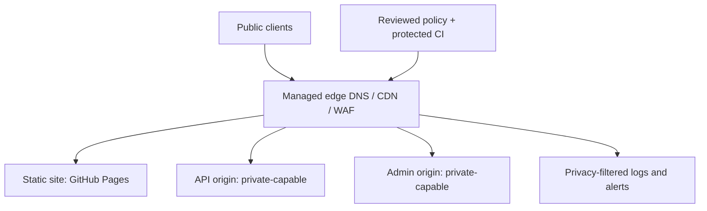
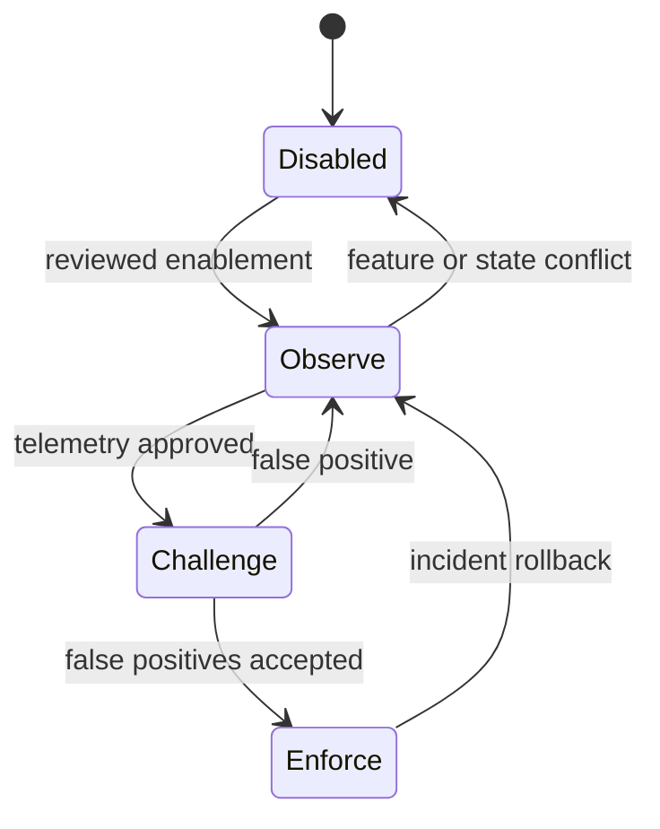
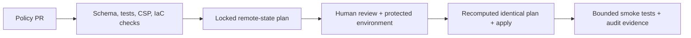

# Edge Security Architecture

Status: target design and reproducible configuration only. No provider or DNS change is represented as complete.

## Target state

Cloudflare is the reference adapter. `infra/edge/policies/baseline.json` is the provider-neutral intent, while Terraform isolates Cloudflare expressions and resources. Fastly, AWS CloudFront plus AWS WAF, Azure Front Door, or another enterprise provider must preserve the same scopes, rollout states, exceptions, ownership, expiry, logging, and origin-control semantics.

## Edge request path

The managed edge is responsible for:

- provider-managed L3/L4/L7 DDoS mitigation and emergency security posture
- TLS termination, HTTPS redirect, caching, and plan-appropriate tiered/origin shielding
- managed exploit rules for SQL injection, XSS, LFI/RFI, command injection, protocol anomalies, malformed requests, and known exploit signatures
- custom method, traversal/scanner, user-agent, reputation, size, geo/ASN, and emergency rules
- verified-bot classification, scoped bot-score handling, challenges, and challenge telemetry
- per-route rate limits for assets, HTML, auth, reset, search, forms, API, admin, and webhooks
- response-header transforms and removal of selected identifying headers
- security-event export, metrics, dashboards, alerts, and configuration audit evidence

The static Pages origin remains publicly reachable through GitHub infrastructure. CDN caching lowers normal origin load but is not equivalent to a private origin shield. API/admin origins should reject direct ingress using private connectivity, mTLS/authenticated pulls, provider egress allow lists, or the edge-overwritten high-entropy header template in `origin.tf`.

## Control ownership

| Control | Edge provider | GitHub Actions | Application/origin | Manual operator |
|---|---|---|---|---|
| DDoS mitigation | Enforces managed protection | Validates declared intent only | Capacity/degradation handling | Select plan; activate emergency mode |
| Managed/custom WAF | Evaluates requests | Schema, static checks, plan, protected apply | Input validation remains mandatory | Approve promotions/exceptions |
| Bot controls | Verification, score, challenge | Prevents unsafe zone-wide defaults | Identity and abuse context | Confirm plan and trusted services |
| Reputation/IP lists | Threat signals and list matching | Validates configuration shape | Corroborating abuse evidence | Steward lists and expiry |
| Rate limiting | Per edge-native characteristics | Enforces reviewed route/action maps | Identity/session/app counters remain | Tune from observed p99 traffic |
| Geo/ASN | Disabled baseline; scoped rules | Rejects unsafe default enablement | Authorization remains mandatory | Explicit enablement and exceptions |
| Response headers | Adds/removes HTTP headers | Audits artifact CSP and IaC | Owns route CSP/CORS/cache semantics | Compatibility promotion |
| Origin access | Injects/verifies provider identity where supported | Keeps secret inputs ephemeral | Must reject missing/invalid identity | Configure network/secret/mTLS |
| Logs/alerts | Produces/exports security events | Records plan/apply audit evidence | Produces auth/business signals | Create destination and alert routes |
| DNS/certificates | Serves only after manual setup | Makes no DNS resources | Pages/custom-domain certificate support | All zone, DNS, TLS, and cutover work |

## Provider policy layers

Rules are modeled as layers rather than as a broad default-deny list:

1. protect only the explicitly configured public, API, and admin hostnames
2. preserve narrow trusted monitoring/automation exceptions within bot/rate layers; do not skip managed exploit inspection
3. evaluate temporary emergency controls with owner, ticket, and expiry
4. detect malformed methods, traversal/probing, suspicious agents, size anomalies, and confirmed deny/quarantine sources
5. apply optional reputation and geo/ASN signals, all observe/disabled by default
6. classify bots and challenge uncertain automation without treating user-agent text as identity
7. enforce route-specific rate limits with webhook-safe non-browser actions
8. execute provider managed WAF categories
9. apply cache, routing, origin-auth, and response-header policies

Providers differ in exact phase order. The adapter must follow provider-native ordering while retaining these security invariants. On Cloudflare, a single Terraform state must own each zone ruleset entry point.

## Rollout state machine

Committed staging and production configurations start with every provider mutation disabled. Promotion is a version-controlled change to the environment file, followed by validation, a remote-state plan, review, protected approval, apply, and live smoke tests. Broad policies must never jump directly from disabled to block.

## DDoS, cache, and shielding

- Use the provider's always-on network/application DDoS service; never emulate an attack in testing.
- Cache versioned static assets with long TTLs only when immutable naming is verified.
- Cache Pages HTML conservatively so deploys and rollbacks propagate.
- Bypass auth, account, checkout, admin, webhook, personalized, `Authorization`, `Set-Cookie`, `private`, and `no-store` traffic.
- Keep cache keys limited to scheme, validated host, normalized path, and explicitly relevant query parameters. Never trust forwarding headers in the cache key.
- Configure provider tiered cache/origin shield manually or in a provider adapter only after plan and state ownership review. `cache-policy.example.json` is the source template; this Cloudflare v4 adapter does not silently claim those provider-side controls.
- During a spike, protect the attacked route and use managed challenge for uncertain traffic. Do not equate a popularity spike with an attack.

## Bot and reputation decision model

Verified crawler identity uses the provider's verified-bot field, not a spoofable user-agent. Monitoring and internal automation exceptions are explicit CIDRs and affect generic bot/rate layers only. Optional bot-score rules are hostname-scoped. Zone-wide Super Bot Fight Mode stays disabled; with API/admin hostnames it may be enabled only with automation actions set to allow and scoped custom rules handling browser-oriented challenges.

Provider threat scores, anonymous-proxy/VPN lists, and Tor lists start at log or managed challenge. They cannot produce a permanent reputation-only deny. Confirmed-abuse deny CIDRs require evidence and review; quarantine entries require a future expiry.

## Header strategy

The edge candidate is derived from the built artifact in `csp-inventory.json` and starts as `Content-Security-Policy-Report-Only`. Enforcement requires route-owner and browser telemetry approval. Application/origin code remains authoritative for CORS, sensitive `Cache-Control`, and route-specific CSP.

Baseline transforms include HSTS without subdomain/preload expansion, nosniff, strict-origin referrer policy, a restrictive permissions policy, compatible COOP/CORP, CSP `frame-ancestors`, legacy `X-Frame-Options`, and removal of selected server-identifying headers. HSTS `includeSubDomains` and `preload` are separate promotions because they can affect hostnames outside this site.

## Observability and privacy

Dashboards and alerts are declared in `observability.example.json`. At minimum, correlate request action, rule ID, bot/challenge outcome, country, ASN, path class, user-agent class, origin error/latency, cache status, authentication abuse, configuration drift, DNS, and certificates.

Default retention is 14–30 days for high-cardinality raw security events, 90 days for normalized metrics, and at least one year for configuration audit records. Do not export cookies, authorization headers, passwords, bodies, or complete sensitive query values. Omit, truncate, or keyed-hash client IPs unless incident response has an approved need for full addresses.

## Configuration and deployment pipeline

Plan and apply use separate least-privilege provider tokens. Backend configuration and state credentials live in protected GitHub environments. Apply rebuilds the ephemeral inputs, validates their hashes, recomputes the provider plan, and refuses mutation if the reviewed plan digest changes. Pull requests and pushes validate only; they never apply.

## Emergency bypass and recovery

Emergency mode is a temporary managed challenge, not permanent lockdown. It requires custom-WAF ownership enabled in the reviewed environment file, a change/incident ticket, accountable operator, and expiry no later than 24 hours from plan time. It excludes verified bots, trusted operations, and webhooks.

Rollback order is: revert the narrow rule/action, return the affected layer to observe, apply the last reviewed configuration, and only then consider a recorded DNS-only bypass if the provider itself is unavailable. DNS bypass restores reachability at the cost of the WAF/CDN perimeter and requires explicit risk acceptance.
