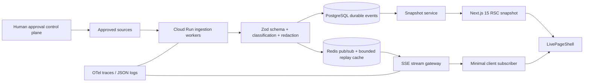

# ClearGlass Live Signal Fabric

**Status:** Phase 1 foundation; production activation is disabled pending named owner, source, privacy, and operations approvals. This document describes implemented code separately from target-state infrastructure. It does not claim that PostgreSQL, Redis, Palantir, Google Cloud, monitoring, or any provider is provisioned.

## Existing-system inspection (2026-08-08)

| Area | Observed state |
|---|---|
| Framework/runtime | The public site is 179 static HTML documents served by GitHub Pages. Root Node tooling targets Node 20 and does not render the site. Independently deployed Next.js and Python services exist in subtrees. |
| Routes/layouts | Public routes are file-based `*.html` paths with independently authored layouts plus shared generated related-navigation blocks. No root App Router layout exists. |
| Fetching/API | Static documents use direct browser fetches for selected forms/feeds. No public site SSE API exists. Backend APIs are separately deployed and must not be assumed reachable from Pages. |
| Analytics/services | `analytics.js` exists but is not referenced by the public documents inspected. External fonts and form submission services are present. No verified performance/status provider is configured for this fabric. |
| Deployment | Root static assets deploy to GitHub Pages. Next.js services deploy independently; SSE cannot be hosted by Pages and needs Cloud Run or equivalent. |
| Environment | Root and product-specific examples exist. The new template contains names only and no credentials. |
| Security | `_headers` documents CSP, HSTS, frame, content-type, referrer, permissions, COOP/CORP protections, subject to host support. The Next service adds its own headers. |
| Loading/errors | Static pages remain their own fallback. The new app supplies loading and error routes plus per-module empty/disabled/degraded states. |
| Design tokens | The homepage supplies white/glass/prismatic tokens; shared command surfaces use near-black, cyan, violet, and restrained motion. The fabric intentionally uses the latter semantic palette. |
| Bottlenecks | Many large independent HTML documents, inline CSS/JS, external fonts, and inconsistent shared-script adoption increase parse/cache cost. No synthetic measurement was run, so this is a code-level observation rather than measured performance. |
| Reusable components | Shared design-system scripts, status surfaces, cards, banners, navigation, and generated related links are suitable integration points. Static pages must not be bulk-rewritten until the service URL and rollout are approved. |

## Phased migration

1. **Foundation (implemented):** strict contracts, source interface, fail-closed configuration, snapshot endpoint, five bounded SSE routes, reconnect/poll fallback, consent, shell, safe empty adapter, tests, migration plan.
2. **Public status:** approve one monitoring provider; deploy gateway; connect status/content adapters; canary the shell on the homepage; verify source and freshness end to end.
3. **Page modules:** use a route-to-stream manifest and progressively add web-design, services, case-study, and contact modules. Never inject unrelated streams globally.
4. **Authenticated dashboards:** integrate an identity proxy, signed session, workspace membership lookup, PostgreSQL RLS, Redis connection accounting, and approval queues before enabling `dashboard`.
5. **Analytics/optimization:** consented RUM aggregation with minimum-count privacy thresholds, Web Vitals budgets, controlled experiments, evaluation dashboards.
6. **Hardening:** load/fault tests, source outage drills, backup restore, key rotation, threat review, protected production approval, canary, and rollback exercise.

## Architecture



Cloud Run should deploy the web and stream gateway as separate revisions when connection scaling differs. The gateway has no command capability. PostgreSQL is durable; Redis is disposable fan-out. REST/server actions handle mutations behind CSRF and authorization checks. No WebSocket is introduced.

## Event taxonomy and quality

Prefixes are `status.*`, `performance.*`, `content.*`, `deployment.*`, `security.*`, `growth.*`, `ai.*`, and `approval.*`. Public allowlists initially permit only `status.updated`, `status.incident`, `status.maintenance`, `performance.measured`, and `content.published`. Each displayed signal carries `live|recent|cached|stale|estimated|unavailable`, timestamps, and source. A stale value is never relabeled live.

Events are schema checked, source allowlisted, size bounded, sequence checked, deduplicated, tenant checked, and payload-redacted from logs. Durable uniqueness is `(source_id, tenant_id, type, sequence)`; the client also ignores repeated IDs. Production retention is source-specific (default recommendation: raw events 30 days, aggregates 13 months, stream audit 7 years only where legal review approves).

## Classification and authorization

| Class | Browser delivery | Examples |
|---|---|---|
| PUBLIC | Anonymous, aggregated only | Public status/maintenance |
| AUTHENTICATED | Signed-in subject | Personal notification metadata |
| WORKSPACE | Matching tenant only | Approved workspace aggregates |
| ADMIN | Matching authorized administrator | Configuration summaries |
| INTERNAL | Operator tooling only; never public SSE | Source health and queue depth |
| SECRET | Never serialized to the browser | Credentials, raw prompts, private findings |

| Actor | Public streams | Dashboard | Workspace/admin changes |
|---|---:|---:|---:|
| Anonymous | Yes | No | No |
| Authenticated user | Yes | No | No |
| Workspace member | Yes | Own workspace | No |
| Workspace administrator | Yes | Own workspace | Draft/request approval |
| Billing administrator | Yes | Authorized billing views | Draft/request approval |
| Platform administrator | Yes | Explicit scope | Approve configuration per policy |
| Internal operator | Yes | Explicit mission scope | Execute only an approved change |

The current identity adapter intentionally returns anonymous, so protected streaming fails closed until a trusted identity proxy is integrated. Never map roles from browser-supplied headers.

## Threat model and AI boundary

Assets are event integrity, tenant data, credentials, configuration authority, audit records, and availability. Boundaries exist at source ingestion, broker, snapshot/SSE serialization, browser, identity proxy, database, and telemetry. Controls address injection (strict schema, text-only rendering), replay (IDs/sequences/unique constraint), cross-tenant access (adjacent authorization and RLS), DoS (payload/rate/connection/event limits and TTL), source spoofing (workload identity and allowlist), secret leakage (server filtering and redacted structured logs), cache poisoning (private/no-store responses), and unsafe agent actions (read → draft → human approval → execute → append-only audit).

AI receives a frozen, authorized, redacted snapshot with source/freshness and treats content as untrusted. It can produce only `DRAFT`; a conventional state machine permits `DRAFT → REVIEW_REQUIRED → APPROVED|REJECTED → PUBLISHED|EXPIRED`. Model output cannot change prompts, tools, policies, deployment, or streams. Proposed improvements require offline evals, named approval, Apollo/Cloud Run canary, drift monitoring, and one-click rollback. Palantir Gotham/Foundry/AIP/Apollo remain optional target-state adapters; none is represented as provisioned.

## Performance and observability budget

| Limit | Default/gate |
|---|---:|
| Public SSE connections/IP | 3/minute opening rate; distributed concurrent quota required before production |
| Authenticated connections/user | 5; Redis-backed distributed counter required |
| Streams/page | 3 |
| Events/client | 5/sec, batched to ≤4 DOM commits/sec at adapter boundary |
| Payload | 16 KiB |
| Reconnect | 1s exponential + jitter, 30s max, 6 automatic attempts |
| Connection TTL | 5 minutes, reconnectable with Last-Event-ID |
| GPU/motion | 30 FPS ceiling; no animation under reduced motion |
| Added live JS | 45 KiB gzip route budget (must be measured in production build) |
| Layout shift | CLS ≤0.05 for live modules |

Private OTel dashboards track active connections, open failures, reconnects, delivery latency, validation failures, dropped/duplicate events, stale duration, source health, queue depth, CPU/memory, API latency, client render time, disconnects, and errors. Alert on >20% connection failure for 5 minutes, backlog age >60 seconds, ≥5 schema violations/source/5 minutes, any cross-tenant denial spike, stale public status >10 minutes, or browser long-task regression. Logs contain IDs and classifications, never payloads.

## Source onboarding and deployment

Each adapter requires owner, purpose, data inventory/classification, credential scope, consent/legal basis, provider terms, quotas, health SLO, timeout/backoff, retention/deletion, disconnect, incident, and rollback approval. No real adapter is connected in this change; the development adapter is explicitly empty.

```bash
cd apps/live-signal-fabric
npm ci && npm run test && npm run typecheck && npm run build
gcloud run deploy clearglass-live-web --source . --region "$REGION" --no-allow-unauthenticated
gcloud run services update-traffic clearglass-live-web --to-revisions "$NEW_REVISION=5,$OLD_REVISION=95" --region "$REGION"
```

Before public access, put the service behind the approved load balancer/identity policy, provision Cloud SQL and Memorystore with private networking, store tokens in Secret Manager, configure OTel, quotas, protected approval, readiness probes, minimum instances/cost caps, PITR backups, and a privacy notice. Never use `.env.example` values as production configuration.

Rollback is traffic-only first: `gcloud run services update-traffic clearglass-live-web --to-revisions "$LAST_GOOD_REVISION=100" --region "$REGION"`. Then set `LIVE_FABRIC_ENABLED=false`, preserve audit evidence, drain gateway connections, and restore the last compatible database snapshot only for a validated data-integrity incident. The additive static website remains the fallback throughout.

## Production readiness checklist

- [ ] Named system, privacy, security, data, and rollback owners approve.
- [ ] At least one source is verified; credentials use Secret Manager and workload identity.
- [ ] Classification, minimum aggregation counts, retention, deletion, and privacy notice are approved.
- [ ] Trusted AuthN, tenant AuthZ, PostgreSQL RLS, and distributed quotas pass negative tests.
- [ ] Replay, duplicate, malformed, outage, shutdown, reconnect, polling, accessibility, reduced-motion, mobile, CSP, load, and restore tests pass.
- [ ] Dashboards, alerts, log redaction, traces, readiness/liveness, backup/PITR, cost controls, and rollback drill are verified.
- [ ] Bundle, CLS, INP, LCP, DOM commit, and connection budgets pass on the canary.
- [ ] `LIVE_FABRIC_PRODUCTION_APPROVED=true` is changed only in the protected environment after owner approval is recorded.

## Phased acceptance note

The isolated service supplies the reusable shell and secure foundation without removing or rewriting any static page. “Every page” integration is intentionally a later canary migration because GitHub Pages cannot host SSE and no verified production source, identity provider, privacy approval, or service owner is configured. Claiming complete live coverage now would violate the request's source-verification and production-approval requirements.
