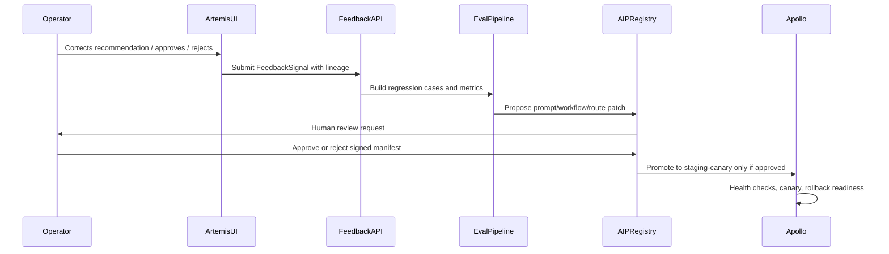

# ClearGlassInc Artemis — System 2040 Advanced Feature Pack

## System Architecture

ClearGlassInc Artemis is organized as a secure full-stack intelligence platform:

| Layer | Advanced Feature | Implementation Intent |
|---|---|---|
| Frontend | Mission Command Surface | Web console for cases, live event streams, graph pivots, agent conversations, approvals, and eval dashboards. |
| API Gateway | Zero-trust ingress | mTLS, signed JWT claims, request classification labels, coalition caveats, and policy decision logging. |
| Backend | Python control services | FastAPI-style services for feedback capture, ontology queries, agent coordination, approval gates, and audit export. |
| Data | Foundry lakehouse + ontology | Historical and live data fusion with object-level permissions, lineage, temporal validity, and confidence scoring. |
| AI | AIP governed agents | Tool-using copilots with policy-filtered retrieval, eval harnesses, model routing, and human-reviewed self-upgrades. |
| Deployment | Apollo runtime control | Ring deployments, signed artifacts, canary evals, health checks, rollback, and runtime configuration lockdown. |
| Observability | Mission telemetry | OpenTelemetry traces, immutable audit logs, eval metrics, latency SLOs, operator trust, and drift alarms. |

## Data and Ontology

The ontology is the operational contract between humans, software, and AI agents. Every object includes provenance, policy labels, confidence, and temporal state.

### Core object types

- `Mission`: operational objective, classification, coalition boundary, success metrics, commander intent, and approval chain.
- `Case`: investigation container with linked events, entities, evidence artifacts, recommendations, and dispositions.
- `Event`: timestamped observation from a sensor, report, cyber feed, analyst note, or external source.
- `Person`, `Organization`, `Device`, `Account`, `Location`: resolved entities with aliases, identifiers, confidence, and caveats.
- `Signal`: normalized inbound data unit with source, collection method, confidence, and lineage hash.
- `EvidenceArtifact`: immutable supporting material used by analysts or agents.
- `ActionRecommendation`: AI- or analyst-generated recommendation with required approval gates.
- `FeedbackSignal`: operator correction, query log, alert outcome, mission result, latency sample, or trust rating.
- `ChangeProposal`: versioned prompt, workflow, route, or heuristic improvement awaiting review.

### Relationship model

```sql
Mission CONTAINS Case;
Case HAS_EVENT Event;
Event OBSERVED_ENTITY Person | Organization | Device | Account | Location;
EvidenceArtifact SUPPORTS ActionRecommendation;
FeedbackSignal EVALUATES ActionRecommendation;
ChangeProposal DERIVED_FROM FeedbackSignal;
ChangeProposal TARGETS Agent | Workflow | Prompt | ModelRoute;
```

### Mandatory metadata

```sql
classification       TEXT NOT NULL,
compartment          TEXT NOT NULL,
coalition_tags       TEXT[] NOT NULL,
source_system        TEXT NOT NULL,
collection_method    TEXT,
confidence_score     NUMERIC CHECK (confidence_score BETWEEN 0 AND 1),
valid_time_start     TIMESTAMPTZ,
valid_time_end       TIMESTAMPTZ,
recorded_at          TIMESTAMPTZ NOT NULL,
lineage_hash         TEXT NOT NULL,
policy_labels        JSONB NOT NULL,
approval_state       TEXT DEFAULT 'not_required'
```

## AI and Agent Design

Artemis uses AIP-style governed agents instead of unchecked autonomous actors.

1. **Analyst Copilot**: drafts timelines, finds entity links, explains evidence, and asks clarifying questions.
2. **Commander Copilot**: summarizes mission impact, confidence, risk, readiness, and approval options.
3. **Triage Agent**: scores incoming events by mission relevance, novelty, confidence, and policy constraints.
4. **Enrichment Agent**: gathers additional ontology records and retrieval snippets through policy-filtered tools.
5. **Correlation Agent**: links events across time, geography, identity, cyber indicators, and known cases.
6. **Intel Product Agent**: generates briefs, annexes, source tables, and caveated summaries.
7. **Recommendation Agent**: prepares action packages, but cannot execute or escalate without a human approval token.
8. **Evaluation Agent**: replays golden missions and regression suites against proposed changes.

All agents receive a constrained tool registry. Tools check policy before query execution and return evidence with lineage identifiers.

## Self-Improvement Loop

The platform gets better by converting mission telemetry into governed change proposals.



### Upgrade rules

- The system may propose prompt, workflow, routing, and heuristic changes.
- The system may not change mission goals, authorities, approval gates, or policy boundaries.
- Every proposal includes evidence hashes, eval results, target component, current version, proposed version, and rollback plan.
- Promotion requires zero policy violations, acceptable precision/recall, latency within SLO, and a human approval token.
- Apollo can automatically roll back if canary metrics degrade or policy alarms fire.

## Full-Stack Implementation

### Web UI

- `/artemis-2040.html`: executive and engineering command surface for the advanced architecture.
- Panels: live ingestion, ontology graph, agent reasoning trace, approval queue, eval scorecards, deployment ring status.
- UI state is driven by mission IDs, case IDs, classification labels, and user attributes.

### Backend services

- `feedback-service`: receives operator corrections, mission outcomes, and trust signals.
- `ontology-query-service`: wraps Foundry/Gotham object queries with policy filters.
- `agent-coordinator`: dispatches tools and maintains workflow state machines.
- `eval-service`: converts feedback into replayable test cases and calculates metrics.
- `proposal-service`: signs proposal manifests and routes them to human reviewers.
- `deployment-control-service`: maps approved proposals to Apollo release rings.

### Streaming and data

- Event topics: `signals.raw`, `signals.normalized`, `cases.updated`, `feedback.received`, `eval.completed`, `proposal.created`, `approval.recorded`, `deployment.promoted`.
- Lakehouse datasets: immutable raw zone, normalized curated zone, ontology projection zone, eval corpus zone, and audit zone.
- Retrieval indexes are partitioned by classification, coalition tag, compartment, mission, and entity type.

## Security and Governance

- Need-to-know access control across row, column, entity, relationship, and tool levels.
- Coalition boundaries enforced before retrieval, reasoning, summarization, and export.
- Immutable audit logs for every query, tool call, prompt version, eval run, approval, deployment, and rollback.
- Policy-as-code blocks unsafe tool calls before execution.
- Prompt governance treats prompt templates as versioned production artifacts.
- Model governance records model ID, route rationale, safety profile, latency, and eval score.
- Zero-trust execution assumes compromised clients and validates every call server-side.

## Code Examples

The runnable Python simulator in `tools/artemis_self_improvement_engine.py` demonstrates the core safe learning loop:

```bash
python3 tools/artemis_self_improvement_engine.py
```

It emits a signed proposal manifest with:

- `proposal_type`
- `target_component`
- `current_version`
- `proposed_version`
- `evidence_hashes`
- `eval_result`
- `approval_required`
- `rollout_ring`
- `signature`

## Scenario Walkthrough

1. A live cyber-physical event enters `signals.raw` with source, time, confidence, and classification metadata.
2. Foundry pipelines normalize it into the Artemis ontology and link it to a `Device`, `Location`, `Event`, and active `Mission`.
3. The Triage Agent checks policy, queries permitted evidence, and creates a recommendation with confidence bands.
4. The Commander Copilot displays the recommendation and evidence chain in the approval queue.
5. An operator rejects one claim as overconfident and adds a correction explaining the missing temporal context.
6. The feedback service stores a `FeedbackSignal` with lineage and the original recommendation ID.
7. The eval pipeline turns the correction into a regression case and detects repeated misses on temporal linkage.
8. The proposal service creates a prompt patch requiring two independent evidence artifacts and explicit uncertainty below 0.78 confidence.
9. Human reviewers inspect the signed manifest, eval score, policy result, and rollback plan.
10. Apollo promotes the approved change to staging-canary, watches metrics, and either expands rollout or rolls back automatically.

## Advanced Merge and Self-Improvement Controls

The July 2026 feature merge adds a safer ontology-improvement path for ClearGlassInc Artemis. It extends the self-improvement loop beyond prompt patches while preserving the core invariant that agents may propose changes, but only approved humans and governed deployment controls may apply them.

### New production-grade capabilities

- **Draft-only ontology merge review**: repeated operator merge/split corrections can create an `ONTOLOGY_MERGE_REVIEW` proposal for entity-resolution stewards. Artemis never merges entities directly from agent output.
- **Cross-compartment fail-closed guard**: if merge evidence spans compartments, the proposal is blocked as `blocked_policy_boundary` and keeps the active ontology version unchanged.
- **Deterministic sanitization**: user-provided payload strings are HTML-escaped before being copied into signed proposal manifests or review surfaces.
- **Risk-tier assignment**: proposal manifests now carry `medium`, `high`, or `critical` risk labels based on drift, policy violations, and ontology-impact scope.
- **Rollback pointer on every proposal**: each signed manifest records the rollback version Apollo should restore if canary metrics, policy checks, or human review fail.

### Merge-review state machine

```text
Operator merge correction
  └─► feedback.signals
        └─► sanitize payload
              └─► group by mission + compartment
                    ├─ cross-compartment evidence ─► BLOCKED_POLICY_BOUNDARY
                    └─ same-compartment evidence
                          └─► ONTOLOGY_MERGE_REVIEW proposal
                                └─► entity steward review
                                      └─► mission owner approval
                                            └─► Apollo canary release
                                                  ├─ promote if policy/eval/SLO pass
                                                  └─ rollback to recorded rollback_version
```

### Python implementation anchor

The stdlib-safe simulator now models both prompt-patch proposals and ontology merge-review proposals:

```python
from tools.artemis_self_improvement_engine import ArtemisImprovementEngine, FeedbackSignal, SignalType

engine = ArtemisImprovementEngine({
    "aip.agent.triage_copilot": "2.4.9",
    "ontology.entity_resolution": "1.3.5",
})

proposal = engine.synthesize_proposals([
    FeedbackSignal(
        signal_id="merge-1",
        signal_type=SignalType.ENTITY_MERGE_CORRECTION,
        mission_id="mission-alpha",
        ontology_object_id="person-a",
        actor="operator.alpha",
        classification="SECRET",
        compartment="ARTEMIS",
        payload={"candidate_pair": ["person-a", "person-b"]},
    ),
    FeedbackSignal(
        signal_id="merge-2",
        signal_type=SignalType.ENTITY_MERGE_CORRECTION,
        mission_id="mission-alpha",
        ontology_object_id="person-b",
        actor="operator.bravo",
        classification="SECRET",
        compartment="ARTEMIS",
        payload={"candidate_pair": ["person-a", "person-b"]},
    ),
])[0]

assert proposal.proposal_type.value == "ontology_merge_review"
assert proposal.patch["merge_execution"] == "draft_only_until_approved"
assert proposal.rollback_version == "1.3.5"
```

### Top 5 implementation risks and fastest mitigations

| Risk | Fastest mitigation |
|---|---|
| Agent proposes an unsafe entity merge that collapses distinct identities. | Keep merge execution draft-only; require entity steward plus mission-owner approval and regression tests against known split cases. |
| Coalition or compartment leakage through proposal evidence. | Fail closed when evidence spans compartments; run policy filtering before manifest generation and redact inaccessible evidence hashes from reviewer views. |
| Malicious operator text appears in dashboards or signed manifests. | Sanitize all user-facing strings before proposal creation; keep raw payloads only in access-controlled audit storage. |
| Canary deployment degrades latency or trust. | Attach rollback versions to every proposal and configure Apollo abort thresholds for p95 latency, policy denials, and rejection-rate spikes. |
| Self-improvement loop optimizes local metrics while hurting mission outcomes. | Require mission-level eval suites with precision, recall, trust, policy safety delta, and after-action labels before promotion. |
