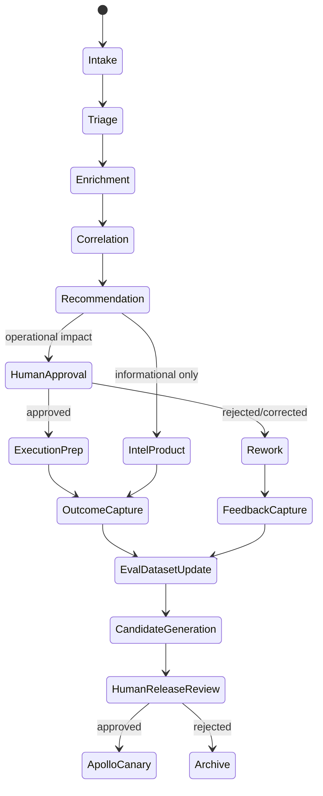

# ClearGlassInc Artemis — Mission-Grade Self-Evolving Intelligence Platform Blueprint

## System Architecture

### 1) End-to-End Full-Stack Topology (Gotham + Foundry + AIP + Apollo)

```text
┌──────────────────────────────────────────────────────────────────────────────────────────┐
│ UX Layer (Web + Mobile Secure Client)                                                   │
│  - Analyst Workbench: Entity graph, timeline, map, case board                           │
│  - Commander COP: COA simulator, risk matrix, approval console                           │
│  - Governance Console: policy diffs, model/prompt release board                          │
└──────────────────────────────────────────────────────────────────────────────────────────┘
                                           │
                                           ▼
┌──────────────────────────────────────────────────────────────────────────────────────────┐
│ Edge/API Layer                                                                           │
│  - Envoy/API Gateway: REST + GraphQL + WebSocket + gRPC-web                             │
│  - Context Broker: coalition boundary, mission, classification, releasability           │
│  - PDP/PIP adapter: OPA policy decision + identity attributes                            │
└──────────────────────────────────────────────────────────────────────────────────────────┘
                                           │
                                           ▼
┌──────────────────────────────────────────────────────────────────────────────────────────┐
│ Service Mesh Domain Layer                                                                │
│  - Intake (GDELT/NVD/ADS-B/USGS)  - Fusion/Correlation  - Case Management               │
│  - Alerting/Risk Scoring          - Action Packaging   - Approval & Execution           │
│  - Feedback/Eval Capture          - PromptOps/WorkflowOps                                │
└──────────────────────────────────────────────────────────────────────────────────────────┘
                       │                                            │
                       ▼                                            ▼
┌─────────────────────────────────────────────┐      ┌─────────────────────────────────────┐
│ Foundry Data/Ontology Plane                 │      │ AIP Agentic AI Plane                │
│ - Bronze/Silver/Gold data products          │      │ - Copilots + multi-agent runtime    │
│ - Ontology objects/links/actions            │      │ - Tool registry + planner           │
│ - Data lineage + quality contracts          │      │ - Model routing + eval harness      │
│ - Bitemporal entity state                    │      │ - Guardrailed self-improvement      │
└─────────────────────────────────────────────┘      └─────────────────────────────────────┘
                       │                                            │
                       └──────────────────────────┬─────────────────┘
                                                  ▼
┌──────────────────────────────────────────────────────────────────────────────────────────┐
│ Security/Observability/Governance Plane                                                  │
│ - Zero trust, mTLS SPIFFE IDs, ABAC + ReBAC                                              │
│ - OpenTelemetry traces/logs/metrics + eval scorecards                                    │
│ - Immutable audit ledger for data/model/prompt/workflow decisions                        │
└──────────────────────────────────────────────────────────────────────────────────────────┘
                                                  │
                                                  ▼
┌──────────────────────────────────────────────────────────────────────────────────────────┐
│ Apollo Delivery Plane                                                                     │
│ - Signed artifacts, canary rings, blast-radius control, progressive rollout              │
│ - Per-component rollback: prompt/workflow/router/model/policy independently              │
│ - Runtime kill-switches and mission-mode degradation controls                             │
└──────────────────────────────────────────────────────────────────────────────────────────┘
```

### 2) Control Planes
- **Data Control Plane**: schema registry, quality checks, lineage, retention.
- **Knowledge Control Plane**: ontology versioning, graph integrity, bitemporal state.
- **AI Control Plane**: prompt registry, tool contracts, eval gates, router policies.
- **Policy Control Plane**: OPA bundles, coalition constraints, approval rules.
- **Delivery Control Plane**: Apollo release rings, health checks, rollback graph.

---

## Data and Ontology

### 1) Canonical Ontology (Foundry-backed)

#### Entity Types
- `Actor(Person|Org|Group)`
- `CyberAsset(Device|IP|Domain|Certificate|SoftwareComponent)`
- `GeoAsset(Location|Facility|Route|AirTrack)`
- `IntelArtifact(Event|Signal|Report|IOC|CVE|Case|Mission|Task|ActionPackage)`
- `GovernanceArtifact(PolicyDecision|Approval|ModelRelease|PromptRelease)`

#### Relationship Types
- `OBSERVED_AT`, `ATTRIBUTED_TO`, `INDICATES`, `TARGETS`, `PART_OF_CASE`, `PART_OF_MISSION`
- `SUPPORTS`, `CONTRADICTS`, `DERIVED_FROM`, `REQUIRES_APPROVAL`, `EXECUTED_BY`

#### Mandatory Metadata
- Confidence tuple: `confidence`, `source_reliability`, `model_agreement`
- Provenance tuple: `source_system`, `ingestion_job`, `transform_version`, `evidence_hash`
- Temporal tuple: `valid_start/end`, `txn_start/end`
- Security tuple: `classification`, `releasability`, `compartment`, `need_to_know`

### 2) SQL Foundation (PostgreSQL + Timescale + pgvector)

```sql
create table intel_event (
  event_id uuid primary key,
  event_type text not null,
  payload jsonb not null,
  confidence numeric(5,4) not null,
  classification text not null,
  compartment text not null,
  valid_time tstzrange not null,
  txn_time tstzrange not null,
  lineage_id text not null,
  created_at timestamptz not null default now()
);

create table entity_edge (
  edge_id uuid primary key,
  src_entity uuid not null,
  dst_entity uuid not null,
  relation text not null,
  confidence numeric(5,4) not null,
  valid_time tstzrange not null,
  txn_time tstzrange not null,
  policy_tags text[] not null,
  evidence_hash text not null
);

create table prompt_release (
  release_id uuid primary key,
  prompt_family text not null,
  version text not null,
  metrics jsonb not null,
  approved_by text,
  approved_at timestamptz,
  status text not null check (status in ('candidate','approved','rolled_back','rejected'))
);
```

---

## AI and Agent Design

### 1) Copilot and Agent Roles
- **Analyst Copilot**: triage, enrichment, evidence graph explanation.
- **Commander Copilot**: COA synthesis with mission risk and confidence envelope.
- **Governance Copilot**: “why blocked/allowed” policy explanation with citations.

### 2) Multi-Agent Pipeline (AIP)

```yaml
workflow: intel-response-v3
steps:
  - intake_agent
  - triage_agent
  - enrichment_agent
  - correlation_agent
  - threat_scoring_agent
  - recommendation_agent
  - approval_gate_agent
  - execution_agent
  - outcome_agent
  - learning_agent
hard_guards:
  - no_operational_execution_without_human_approval: true
  - no_policy_change_by_agents: true
  - no_cross_compartment_data_leakage: true
```

### 3) Python Tool Contract Example

```python
from pydantic import BaseModel, Field
from typing import Literal, List

class MissionContext(BaseModel):
    mission_id: str
    coalition: str
    classification: Literal["U", "C", "S", "TS"]
    compartments: List[str]

class QueryOntologyInput(BaseModel):
    query: str
    k: int = Field(default=25, ge=1, le=200)
    context: MissionContext

class ToolResult(BaseModel):
    rows: list[dict]
    citations: list[str]

async def query_ontology_tool(inp: QueryOntologyInput) -> ToolResult:
    # policy-filtered query generated by ontology planner
    sql = "select * from ontology_search($1, $2, $3, $4)"
    rows = await db.fetch(sql, inp.query, inp.k, inp.context.coalition, inp.context.compartments)
    return ToolResult(rows=[dict(r) for r in rows], citations=[r["lineage_id"] for r in rows])
```

---

## Self-Improvement Loop

### 1) Learning Signals
- Explicit analyst feedback (`thumbs`, corrections, rationale).
- Alert outcome labels (TP/FP/FN), response success/failure.
- Latency, route choice, token cost, abstention rate.
- Approval outcomes and rollback incidents.

### 2) Improvement Lifecycle
1. Ingest signals into `feedback.events` stream.
2. Materialize eval datasets stratified by mission type + compartment.
3. Generate prompt/workflow/router candidates.
4. Run offline eval harness and policy guard tests.
5. Human approval board review.
6. Apollo canary (Ring0->Ring2).
7. Promote or auto-rollback on regression.

### 3) Drift + Safety
- Data drift: PSI/KL thresholds.
- Behavior drift: rising rejection/override rates.
- Trust drift: operator confidence trend and unresolved case delay.

### 4) Python Eval Pipeline Skeleton

```python
@dataclass
class EvalResult:
    candidate_id: str
    precision: float
    recall: float
    p95_latency_ms: int
    trust_score: float
    policy_violations: int


def pass_gate(r: EvalResult) -> bool:
    return (
        r.precision >= 0.87 and
        r.recall >= 0.82 and
        r.p95_latency_ms <= 1200 and
        r.trust_score >= 0.75 and
        r.policy_violations == 0
    )


def choose_release(champion: EvalResult, challenger: EvalResult) -> str:
    if pass_gate(challenger) and challenger.precision - champion.precision >= 0.02:
        return "promote_challenger"
    return "retain_champion"
```

---

## Full-Stack Implementation

### 1) Frontend (Next.js + TypeScript + Deck.gl)
- Real-time threat layer overlays with WebSocket delta updates.
- Ontology graph with evidence/citation side panel.
- Approval modal requiring reason codes + hardware-backed auth.

### 2) API Gateway/BFF
- `POST /v1/intel/intake`
- `POST /v1/agents/plan`
- `POST /v1/actions/{id}/approve`
- `POST /v1/feedback`
- `GET /v1/evals/releases`

### 3) Python Backend Services
- `ingest_service` (connectors, schema validation)
- `fusion_service` (entity resolution + correlation)
- `agent_runtime_service` (AIP orchestration)
- `approval_service` (workflow + policy checks)
- `evalops_service` (offline/online evals)

### 4) Eventing
- Redpanda/Kafka topics: `intel.raw`, `intel.enriched`, `alert.triaged`, `action.pending`, `feedback.events`, `eval.results`.

### 5) Workflow State Machine (Python)

```python
from enum import Enum

class ActionState(str, Enum):
    DRAFT = "draft"
    PENDING_APPROVAL = "pending_approval"
    APPROVED = "approved"
    REJECTED = "rejected"
    EXECUTED = "executed"
    ROLLED_BACK = "rolled_back"

ALLOWED = {
    ActionState.DRAFT: {ActionState.PENDING_APPROVAL},
    ActionState.PENDING_APPROVAL: {ActionState.APPROVED, ActionState.REJECTED},
    ActionState.APPROVED: {ActionState.EXECUTED, ActionState.ROLLED_BACK},
    ActionState.REJECTED: set(),
    ActionState.EXECUTED: {ActionState.ROLLED_BACK},
    ActionState.ROLLED_BACK: set(),
}


def transition(state: ActionState, nxt: ActionState) -> ActionState:
    if nxt not in ALLOWED[state]:
        raise ValueError(f"invalid transition {state}->{nxt}")
    return nxt
```

---

## Security and Governance

- Need-to-know and coalition-aware ABAC/ReBAC on rows, columns, entities, and graph edges.
- Policy-as-code (OPA/Rego) for runtime decisions and prompt/action constraints.
- Immutable provenance and append-only audit ledger for every agent/tool/action decision.
- Zero-trust execution with workload identity, mTLS, short-lived credentials.
- Prompt governance + model governance with explicit approval chain and signed releases.

```rego
package artemis.approval

default allow = false

allow {
  input.action.risk <= 0.45
  input.user.role == "Commander"
  input.user.clearance >= input.action.required_clearance
  input.context.compartment in input.user.compartments
}
```

---

## Code Examples

### 1) Event Handler (Python/FastAPI)

```python
from fastapi import FastAPI, Header, HTTPException

app = FastAPI()

@app.post("/v1/intel/intake")
async def intake(event: dict, x_mission_id: str = Header(...)):
    if not await policy.can_ingest(event, mission_id=x_mission_id):
        raise HTTPException(403, "policy denied")
    normalized = normalize_event(event)
    await bus.publish("intel.raw", normalized)
    return {"status": "accepted", "event_id": normalized["event_id"]}
```

### 2) Model Router Snippet

```python

def route_model(task: str, sensitivity: str, latency_budget_ms: int) -> str:
    if sensitivity in {"S", "TS"}:
        return "local-llm-secure-70b"
    if task == "triage" and latency_budget_ms < 700:
        return "local-llm-fast-8b"
    return "local-llm-accuracy-34b"
```

### 3) Approval Gate

```python
async def approve_action(action_id: str, user: UserCtx) -> dict:
    action = await actions.get(action_id)
    decision = await opa.evaluate("artemis/approval", {"action": action, "user": user.dict()})
    if not decision["allow"]:
        return {"status": "denied", "reason": "policy"}
    await actions.update_state(action_id, "approved")
    await audit.log("action_approved", action_id=action_id, actor=user.user_id)
    return {"status": "approved"}
```

---

## Scenario Walkthrough (Cinematic + Technical)

1. **Live event ingestion**: A new NVD CVE + GDELT infrastructure unrest signal enters `intel.raw` within 300 ms.
2. **Fusion**: `fusion_service` links CVE -> vendor asset inventory -> exposed business units in the mission compartment.
3. **Agent triage**: Triage and correlation agents generate a severity-0.81 action package and COA options.
4. **Recommendation**: Commander Copilot recommends temporary segmentation + patch acceleration; cites evidence lineage IDs.
5. **Human gate**: Commander approves in approval console with dual-control signature.
6. **Execution**: Action pushed to orchestrator playbook; confirmation flows back as `actions.executed`.
7. **Outcome learning**: Incident closes with no downtime. System records TP label, operator trust +0.06, and updates eval corpus.
8. **Self-upgrade proposal**: LearningAgent proposes prompt v3.18 improving triage precision by 2.6% in offline replay.
9. **Governed release**: Human review approves; Apollo canary deploys to Ring0. No regressions after 24h, then global promote.

8. **Audit and Provenance**  
   Every step (data read, model route, prompt/workflow versions, approval decision, deployment promotion) is immutably logged and queryable for after-action review.

---

## Artemis IV Core Backend Kickstart (Python-first precision implementation)

### Recommended first build slice: Real-time GDELT ingestion pipeline

```python
# services/gdelt_ingest/app.py
import asyncio
import json
from dataclasses import dataclass
from datetime import datetime, timezone
from typing import Any

import httpx
from aiokafka import AIOKafkaProducer
from fastapi import FastAPI

GDELT_URL = "https://api.gdeltproject.org/api/v2/doc/doc"

@dataclass
class GdeltConfig:
    query: str = "(cyber OR malware OR ransomware)"
    mode: str = "ArtList"
    format: str = "json"
    max_records: int = 100

app = FastAPI(title="Artemis IV GDELT Ingest")
producer: AIOKafkaProducer | None = None

@app.on_event("startup")
async def startup() -> None:
    global producer
    producer = AIOKafkaProducer(bootstrap_servers="redpanda:9092")
    await producer.start()

@app.on_event("shutdown")
async def shutdown() -> None:
    if producer:
        await producer.stop()

async def fetch_gdelt(cfg: GdeltConfig) -> list[dict[str, Any]]:
    params = {
        "query": cfg.query,
        "mode": cfg.mode,
        "format": cfg.format,
        "maxrecords": cfg.max_records,
    }
    async with httpx.AsyncClient(timeout=20) as client:
        resp = await client.get(GDELT_URL, params=params)
        resp.raise_for_status()
        return resp.json().get("articles", [])

@app.post("/v1/ingest/gdelt/poll")
async def poll_once() -> dict[str, Any]:
    assert producer is not None
    records = await fetch_gdelt(GdeltConfig())
    sent = 0
    for r in records:
        event = {
            "source": "gdelt",
            "event_time": r.get("seendate") or datetime.now(timezone.utc).isoformat(),
            "title": r.get("title"),
            "url": r.get("url"),
            "domain": r.get("domain"),
            "lang": r.get("language"),
            "lineage": {"pipeline": "gdelt_ingest_v1", "emitted_at": datetime.now(timezone.utc).isoformat()},
        }
        await producer.send_and_wait("intel.raw", json.dumps(event).encode("utf-8"))
        sent += 1
    return {"status": "ok", "sent": sent}


async def scheduler() -> None:
    while True:
        try:
            await poll_once()
        except Exception as exc:  # logged/observed via OTEL in production
            print(f"gdelt-poll-error: {exc}")
        await asyncio.sleep(30)
```

### Python policy guard before any operational action

```python
# services/policy/guard.py
from dataclasses import dataclass

@dataclass
class Subject:
    user_id: str
    role: str
    clearance: str
    compartments: list[str]

@dataclass
class Action:
    name: str
    sensitivity: str
    mission_compartment: str


def authorize(subject: Subject, action: Action) -> tuple[bool, str]:
    if action.sensitivity == "operational" and subject.role not in {"commander", "ops_lead"}:
        return False, "role_block"
    if subject.clearance not in {"SECRET", "TS"}:
        return False, "clearance_block"
    if action.mission_compartment not in subject.compartments:
        return False, "compartment_block"
    return True, "allow"
```

---

## Production Implementation Blueprint — ClearGlassInc Artemis Reference Build

This section turns the platform concept into an implementation-ready build plan for a secure, coalition-aware deployment that uses **Gotham** for investigations and operational entity tracking, **Foundry** for data integration and ontology-backed applications, **AIP** for governed copilots and agents, and **Apollo** for controlled deployment, rollback, and runtime operations.

### System Architecture

#### Layered Reference Architecture

```text
[Secure Web UI]
  ├─ Analyst Workbench: graph, map, timeline, evidence, notebook
  ├─ Commander Console: risk posture, COA comparison, approval queue
  ├─ PromptOps Console: prompt diffs, eval scorecards, release approvals
  └─ Governance Console: policy simulation, audit replay, coalition visibility
        │
        ▼
[API Gateway / BFF]
  ├─ OAuth2/OIDC + hardware-backed MFA
  ├─ tenant/mission/compartment context injection
  ├─ request signing, rate limits, payload validation
  └─ GraphQL + REST + WebSocket fanout
        │
        ▼
[Domain Services]
  ├─ ingest-service        ├─ ontology-query-service
  ├─ fusion-service        ├─ agent-runtime-service
  ├─ case-service          ├─ approval-service
  ├─ feedback-service      ├─ evalops-service
  └─ release-control-service
        │
        ├──────────────► [Foundry: data products, ontology, actions, transforms]
        ├──────────────► [Gotham: investigations, entities, links, operational workflows]
        ├──────────────► [AIP: copilots, agents, tools, evals, model routing]
        └──────────────► [Apollo: deployment rings, health gates, rollback]
```

#### Production Service Boundaries

| Service | Responsibility | Critical APIs | Data Owned |
|---|---|---|---|
| `ingest-service` | Normalize live and historical feeds into bronze/silver data products. | `/v1/intake`, `/v1/connectors/{id}/poll` | raw events, connector checkpoints |
| `fusion-service` | Entity resolution, correlation, confidence scoring, link creation. | `/v1/fusion/run`, `/v1/correlation/explain` | entity candidates, merge decisions |
| `ontology-query-service` | Policy-filtered reads against Foundry ontology/Gotham graph. | `/v1/ontology/search`, `/v1/entities/{id}` | read projections, cached query plans |
| `agent-runtime-service` | AIP-backed planning, tool invocation, agent state, citations. | `/v1/agents/runs`, `/v1/agents/{id}/events` | agent traces, tool calls |
| `approval-service` | Human gates, dual control, state transitions, action packages. | `/v1/actions/{id}/approve` | approvals, action state |
| `feedback-service` | Operator feedback, corrections, labels, trust signals. | `/v1/feedback`, `/v1/outcomes` | feedback events, outcome labels |
| `evalops-service` | Offline replays, A/B tests, prompt/model/workflow evaluations. | `/v1/evals/run`, `/v1/evals/scorecards` | eval datasets, scorecards |
| `release-control-service` | Prompt/workflow/router/policy release proposals and Apollo promotion. | `/v1/releases/propose`, `/v1/releases/promote` | release manifest, rollback pointer |

### Data and Ontology

#### Ontology Objects

```yaml
ontology:
  objects:
    Actor:
      properties: [name, aliases, actor_type, country, confidence, classification]
    Organization:
      properties: [legal_name, sector, subsidiaries, external_ids]
    CyberAsset:
      properties: [asset_type, hostname, ip, domain, software, owner_org, exposure]
    Event:
      properties: [event_type, event_time, severity, summary, source_reliability]
    Signal:
      properties: [signal_type, raw_payload_hash, normalized_fields, extraction_model]
    Case:
      properties: [case_status, mission_id, lead_analyst, priority, sla_deadline]
    ActionPackage:
      properties: [recommended_action, risk, required_approval, state, rollback_plan]
    PromptRelease:
      properties: [family, version, candidate_id, eval_score, approval_state]
  links:
    - OBSERVED_AT: {from: Event, to: GeoAsset}
    - TARGETS: {from: Actor, to: CyberAsset}
    - INDICATES: {from: Signal, to: Event}
    - DERIVED_FROM: {from: ActionPackage, to: Event}
    - PART_OF_CASE: {from: Event, to: Case}
    - USED_PROMPT: {from: ActionPackage, to: PromptRelease}
```

#### Bitemporal, Lineage-Aware Entity Model

```sql
create table ontology_object_state (
  object_id uuid not null,
  object_type text not null,
  state jsonb not null,
  confidence numeric(5,4) not null,
  classification text not null,
  releasability text[] not null,
  compartments text[] not null,
  valid_from timestamptz not null,
  valid_to timestamptz,
  transaction_from timestamptz not null default now(),
  transaction_to timestamptz,
  lineage jsonb not null,
  primary key (object_id, transaction_from)
);

create index ontology_object_state_gin on ontology_object_state using gin (state);
create index ontology_object_state_policy on ontology_object_state (classification, compartments);
```

The ontology drives human workflows by determining what appears in Gotham investigations, Foundry operational applications, case boards, and commander briefings. It drives agent behavior by constraining the tools an AIP agent can call, the rows it can retrieve, the relationships it may traverse, and the operational actions it may prepare.

### AI and Agent Design

#### Agent Runtime Contract

```python
from enum import Enum
from pydantic import BaseModel, Field
from typing import Any

class RiskTier(str, Enum):
    LOW = "low"
    MEDIUM = "medium"
    HIGH = "high"
    OPERATIONAL = "operational"

class AgentToolCall(BaseModel):
    tool_name: str
    args: dict[str, Any]
    purpose: str
    expected_artifact: str

class AgentPlan(BaseModel):
    mission_id: str
    run_id: str
    objective: str
    risk_tier: RiskTier
    tool_calls: list[AgentToolCall]
    approval_required: bool = True
    citations_required: bool = True
    max_latency_ms: int = Field(default=1500, ge=100)
```

#### Mission Agent Workflow



### Self-Improvement Loop

ClearGlassInc Artemis improves by treating every operator interaction as governed telemetry, not as permission for uncontrolled autonomous behavior.

#### Signal-to-Upgrade Pipeline

```text
operator feedback + corrections + outcomes + latency + policy denials
  → normalized feedback.events stream
  → stratified eval dataset builder
  → candidate prompt/workflow/router generation
  → offline replay against gold cases and adversarial policy tests
  → scorecard: precision, recall, citation coverage, latency, cost, trust, violations
  → human release board approval
  → signed release manifest
  → Apollo ringed canary
  → automatic rollback on regression
```

#### Upgrade Candidate Schema

```python
from datetime import datetime
from pydantic import BaseModel

class UpgradeCandidate(BaseModel):
    candidate_id: str
    artifact_type: str  # prompt | workflow | router | heuristic | policy
    artifact_family: str
    base_version: str
    proposed_version: str
    rationale: str
    generated_from_signals: list[str]
    offline_metrics: dict[str, float]
    safety_tests: dict[str, bool]
    created_at: datetime
    requires_human_approval: bool = True
```

#### Safe Release Decision Logic

```python
MINIMUMS = {
    "precision": 0.90,
    "recall": 0.84,
    "citation_coverage": 0.98,
    "policy_violations": 0.0,
    "p95_latency_ms": 1200,
}

def is_release_candidate(champion: dict[str, float], challenger: dict[str, float]) -> tuple[bool, list[str]]:
    reasons: list[str] = []
    if challenger["precision"] < MINIMUMS["precision"]:
        reasons.append("precision_floor")
    if challenger["recall"] < MINIMUMS["recall"]:
        reasons.append("recall_floor")
    if challenger["citation_coverage"] < MINIMUMS["citation_coverage"]:
        reasons.append("citation_floor")
    if challenger["policy_violations"] > MINIMUMS["policy_violations"]:
        reasons.append("policy_violation")
    if challenger["p95_latency_ms"] > MINIMUMS["p95_latency_ms"]:
        reasons.append("latency_regression")
    if challenger["precision"] - champion["precision"] < 0.015:
        reasons.append("insufficient_precision_lift")
    return len(reasons) == 0, reasons
```

### Full-Stack Implementation

#### Web UI Route Map

```text
/app
  /dashboard              mission status, alerts, trust metrics
  /cases/[caseId]         entity graph, timeline, evidence, agent transcript
  /approvals              operational action queue with dual-control signing
  /evals                  champion/challenger scorecards and drift charts
  /governance/policies    Rego bundle viewer and policy simulator
  /governance/releases    prompt/workflow/router release board
```

#### TypeScript API Client

```ts
export type ActionState = "draft" | "pending_approval" | "approved" | "rejected" | "executed" | "rolled_back";

export interface ActionPackage {
  id: string;
  missionId: string;
  summary: string;
  risk: number;
  state: ActionState;
  citations: string[];
  rollbackPlan: string;
}

export async function approveAction(id: string, reason: string, mfaToken: string): Promise<ActionPackage> {
  const res = await fetch(`/v1/actions/${id}/approve`, {
    method: "POST",
    headers: { "content-type": "application/json", "x-mfa-token": mfaToken },
    body: JSON.stringify({ reason }),
  });
  if (!res.ok) throw new Error(`approval failed: ${res.status}`);
  return res.json();
}
```

#### Python Event Consumer

```python
import json
from aiokafka import AIOKafkaConsumer, AIOKafkaProducer

async def consume_raw_events() -> None:
    consumer = AIOKafkaConsumer("intel.raw", bootstrap_servers="redpanda:9092", group_id="fusion-service")
    producer = AIOKafkaProducer(bootstrap_servers="redpanda:9092")
    await consumer.start()
    await producer.start()
    try:
        async for msg in consumer:
            raw = json.loads(msg.value)
            enriched = await enrich_and_resolve(raw)
            await producer.send_and_wait("intel.enriched", json.dumps(enriched).encode())
    finally:
        await consumer.stop()
        await producer.stop()
```

#### Ontology-Driven Query Tool

```python
class OntologyQueryRequest(BaseModel):
    mission_id: str
    user_id: str
    query_text: str
    object_types: list[str]
    limit: int = 25

async def ontology_search(req: OntologyQueryRequest) -> list[dict]:
    decision = await opa.evaluate("artemis/read", req.model_dump())
    if not decision["allow"]:
        raise PermissionError(decision.get("reason", "policy_denied"))
    sql = """
      select object_id, object_type, state, confidence, lineage
      from ontology_object_state
      where object_type = any($1)
        and classification <= $2
        and compartments && $3
        and transaction_to is null
      order by confidence desc
      limit $4
    """
    return await db.fetch(sql, req.object_types, decision["max_classification"], decision["allowed_compartments"], req.limit)
```

#### Eval Dataset Builder

```python
async def build_eval_dataset(window_hours: int = 168) -> list[dict]:
    rows = await db.fetch(
        """
        select f.event_id, f.operator_label, f.correction, a.prompt_version,
               a.workflow_version, a.model_route, a.latency_ms, a.citations
        from feedback_event f
        join agent_run a on a.run_id = f.run_id
        where f.created_at > now() - ($1 || ' hours')::interval
          and f.operator_label is not null
        """,
        window_hours,
    )
    return [dict(row) for row in rows]
```

### Security and Governance

#### Policy Model

```rego
package artemis.read

default allow = false

allow {
  input.mission_id == data.user_missions[input.user_id][_]
  every c in input.required_compartments { c in data.user_compartments[input.user_id] }
  input.requested_classification <= data.user_clearance[input.user_id]
}
```

Security controls are enforced at multiple layers: API gateway context binding, service-level OPA checks, Foundry/Gotham ontology permissions, database row/column/entity filters, AIP tool contracts, and Apollo runtime controls. Agents never receive raw unrestricted datasets; they receive policy-filtered tool outputs with citations and lineage.

#### Immutable Audit Events

```json
{
  "event_type": "action_approval_decision",
  "actor": "user:commander-17",
  "mission_id": "mission:artemis-2026-06-29",
  "action_id": "action:segmentation-8841",
  "decision": "approved",
  "policy_bundle": "artemis-policy@2.4.1",
  "prompt_version": "triage@3.18.0",
  "workflow_version": "intel-response@4.2.0",
  "timestamp": "2026-06-29T14:11:23Z",
  "hash_prev": "b4b7...",
  "hash_self": "7df2..."
}
```

### Scenario Walkthrough

1. A live cyber signal enters `intel.raw` from a connector and is written to a Foundry bronze data product with source hash, connector version, and receipt time.
2. The fusion service normalizes it, links it to a `CyberAsset`, raises confidence through corroborating evidence, and writes ontology links visible in Gotham.
3. AIP starts an `intel-response-v3` workflow. The triage agent queries only the mission-authorized ontology slice, summarizes the event, and cites lineage IDs.
4. The enrichment and correlation agents identify a likely operational impact and prepare an `ActionPackage` with risk, confidence, expected impact, and rollback plan.
5. The commander sees the recommendation in the approval console. The action cannot execute until a human supplies reason code, MFA, and—if risk is high—dual authorization.
6. The operator approves a constrained response. Apollo confirms the target runtime and canary ring, applies the change, and streams health metrics back to the case.
7. Outcome labels flow into `feedback.events`: true positive, low collateral impact, commander accepted with minor wording correction, p95 decision latency under target.
8. EvalOps turns the correction into a regression test. A learning agent proposes a prompt update that improves citation density and reduces over-warning.
9. The candidate passes offline evals and policy adversarial tests, but it remains inert until the human release board approves it.
10. Apollo deploys the signed prompt manifest to Ring0. If precision, latency, citation coverage, or rejection rate regresses beyond thresholds, Artemis automatically rolls back to the previous prompt version and logs the decision.

### Implementation Sequencing

```text
Phase 0: governance baseline — identity, policy-as-code, audit ledger, ontology permissions
Phase 1: ingestion/fusion — connectors, event streams, Foundry data products, entity resolution
Phase 2: operator workflows — Gotham cases, analyst workbench, approval service, commander console
Phase 3: AIP copilots — tool registry, agent runtime, citations, model router, guarded recommendations
Phase 4: EvalOps — feedback capture, gold datasets, offline replay, A/B testing, drift detection
Phase 5: self-improvement — candidate generation, release board, Apollo canary, automated rollback
```
